# Willkommen zur Nav-data Dokumentation 🚀

Nav-data ist ein Datenkonvertierungsprojekt, das gemeinsam von Luftfahrtbegeisterten gepflegt wird und sich der Bereitstellung hochwertiger Navigationsdaten für Flugsimulatoren (wie Microsoft Flight Simulator) widmet. Egal ob Sie Entwickler, Pilot oder Enthusiast sind, hier finden Sie die benötigten Informationen und Anleitungen.

## 🔄 Datenkonvertierungsprozess

```mermaid
graph TD
    A["📊 Datenquelle<br/>AIRAC/Navigraph"] --> B["🔄 Nav-data<br/>Konvertierungstool"]
    B --> C["🛩️ PMDG<br/>SQLite-Datenbank"]
    B --> D["✈️ iniBuilds<br/>A350-Datendateien"]
    B --> E["🛫 X-Plane<br/>DAT-Format-Dateien"]
    
    F["🗂️ Rohdaten"] --> G["📥 Datenanalyse"]
    G --> H["🔧 Formatkonvertierung"]
    H --> I["✅ Datenvalidierung"]
    I --> J["📤 Ausgabedateien"]
    
    style A fill:#e1f5fe,stroke:#0277bd,stroke-width:2px
    style B fill:#f3e5f5,stroke:#7b1fa2,stroke-width:2px
    style C fill:#e8f5e8,stroke:#388e3c,stroke-width:2px
    style D fill:#fff3e0,stroke:#f57c00,stroke-width:2px
    style E fill:#fce4ec,stroke:#c2185b,stroke-width:2px
    
    style F fill:#f1f8e9,stroke:#689f38,stroke-width:2px
    style G fill:#f1f8e9,stroke:#689f38,stroke-width:2px
    style H fill:#f1f8e9,stroke:#689f38,stroke-width:2px
    style I fill:#f1f8e9,stroke:#689f38,stroke-width:2px
    style J fill:#f1f8e9,stroke:#689f38,stroke-width:2px
```

---

## ✨ Projektmerkmale

  

    
📦

    <h3>Multiplattform-Unterstützung</h3>
    
Unterstützt gängige Flugsimulatorplattformen wie PMDG, iniBuilds, X-Plane

  

  
  

    
🛫

    <h3>Detaillierte Anleitungen</h3>
    
Bietet vollständige Anleitungen zur Konfiguration, Installation und Nutzung, sodass auch Anfänger problemlos loslegen können.

  

  
  

    
🗂️

    <h3>Klare Struktur</h3>
    
Klare Datenstruktur, einfach zu erweitern und zu warten, unterstützt benutzerdefinierte Konfigurationen.

  

  
  

    
🤝

    <h3>Open-Source-Kollaboration</h3>
    
Beiträge und Zusammenarbeit der Community sind willkommen, um gemeinsam bessere Navigationsdatentools zu entwickeln.

  

---

## 🚀 Schnellstart
1. Wählen Sie Ihr Add-on: [PMDG Anleitung](/PMDG/guide/index) | [iniBuilds Anleitung](/iniBuilds/guide/index)
2. Folgen Sie der Anleitung für Konfiguration und Installation.
3. Genießen Sie ein noch realistischeres Flugerlebnis!

---

## 🧭 Schnelle Navigation

### 📊 Vergleich der Plattformunterstützung

  <table>
    <thead>
      <tr>
        <th>Merkmal</th>
        <th>🛩️ PMDG</th>
        <th>✈️ iniBuilds</th>
        <th>🛫 X-Plane</th>
      </tr>
    </thead>
    <tbody>
      <tr>
        <td><strong>Unterstützte Flugzeuge</strong></td>
        <td>737-Serie, 777-Serie</td>
        <td>A350</td>
        <td>Alle X-Plane Flugzeuge</td>
      </tr>
      <tr>
        <td><strong>Datenformat</strong></td>
        <td>SQLite-Datenbank</td>
        <td>Spezifische Datendatei</td>
        <td>DAT-Format-Dateien</td>
      </tr>
      <tr>
        <td><strong>Installationsschwierigkeit</strong></td>
        <td><StatusBadge type="warning" text="Mittel" icon="⚠️" /></td>
        <td><StatusBadge type="success" text="Einfach" icon="✅" /></td>
        <td><StatusBadge type="error" text="Komplex" icon="🔴" /></td>
      </tr>
      <tr>
        <td><strong>Datenabdeckung</strong></td>
        <td><StatusBadge type="success" text="Vollständig" icon="✅" /></td>
        <td><StatusBadge type="success" text="Vollständig" icon="✅" /></td>
        <td><StatusBadge type="warning" text="Teilweise" icon="⚠️" /></td>
      </tr>
      <tr>
        <td><strong>Aktualisierungsfrequenz</strong></td>
        <td>AIRAC-Zyklus</td>
        <td>AIRAC-Zyklus</td>
        <td>Bei Bedarf</td>
      </tr>
    </tbody>
  </table>

### 📚 Anleitungen

  <a href="/PMDG/guide/index" class="guide-link pmdg">
    
🛩️

    

      <h3>PMDG Anleitung</h3>
      
Komplettes Tutorial zur Navigationsdatenkonvertierung für PMDG Flugzeuge

    

  </a>
  
  <a href="/iniBuilds/guide/index" class="guide-link inibuilds">
    
✈️

    

      <h3>iniBuilds Anleitung</h3>
      
Anleitung zur Navigationsdatenkonvertierung für iniBuilds A350

    

  </a>
  
  <a href="/X-Plane/guide/index" class="guide-link xplane">
    
🛫

    

      <h3>X-Plane Anleitung</h3>
      
Vollständiger Prozess zur Navigationsdatenverarbeitung für X-Plane

    

  </a>

### 🆘 Hilfe erhalten

  

    <h4>🛩️ PMDG Support</h4>
    <ul>
      <li><a href="/PMDG/faq">Häufig gestellte Fragen (FAQ)</a></li>
      <li><a href="/PMDG/troubleshooting">Fehlerbehebungsanleitung</a></li>
    </ul>
  

  
  

    <h4>✈️ iniBuilds Support</h4>
    <ul>
      <li><a href="/iniBuilds/faq">Häufig gestellte Fragen (FAQ)</a></li>
      <li><a href="/iniBuilds/troubleshooting">Fehlerbehebungsanleitung</a></li>
    </ul>
  

  
  

    <h4>🛫 X-Plane Support</h4>
    <ul>
      <li><a href="/X-Plane/faq">Häufig gestellte Fragen (FAQ)</a></li>
      <li><a href="/X-Plane/troubleshooting">Fehlerbehebungsanleitung</a></li>
    </ul>
  

### 🔧 Technische Dokumentation

  <a href="/iniBuilds/architecture" class="tech-link">
    🏗️
    Projektarchitektur
  </a>
  <a href="/iniBuilds/contributing" class="tech-link">
    🤝
    Beitragsrichtlinien
  </a>
  <a href="/iniBuilds/changelog" class="tech-link">
    📋
    Änderungsprotokoll
  </a>

---

## 🌍 Mitmachen & Feedback
- GitHub: [nav-data](https://github.com/nav-data)
- Haben Sie Vorschläge oder Fragen? Kontaktieren Sie uns gerne über ein [Issue](https://github.com/nav-data/nav-data/issues) oder per E-Mail!