# Welcome to Nav-data Documentation 🚀

Nav-data is a data conversion project maintained collaboratively by aviation enthusiasts, dedicated to providing high-quality navigation data support for flight simulators (such as Microsoft Flight Simulator). Whether you are a developer, a pilot, or an enthusiast, you will find the resources and guides you need here.

## 🔄 Data Conversion Process

```mermaid
graph TD
    A["📊 Data Source<br/>AIRAC/Navigraph"] --> B["🔄 Nav-data<br/>Conversion Tool"]
    B --> C["🛩️ PMDG<br/>SQLite Database"]
    B --> D["✈️ iniBuilds<br/>A350 Data File"]
    B --> E["🛫 X-Plane<br/>DAT Format File"]
    
    F["🗂️ Raw Data"] --> G["📥 Data Parsing"]
    G --> H["🔧 Format Conversion"]
    H --> I["✅ Data Validation"]
    I --> J["📤 Output File"]
    
    style A fill:#e1f5fe,stroke:#0277bd,stroke-width:2px
    style B fill:#f3e5f5,stroke:#7b1fa2,stroke-width:2px
    style C fill:#e8f5e8,stroke:#388e3c,stroke-width:2px
    style D fill:#fff3e0,stroke:#f57c00,stroke-width:2px
    style E fill:#fce4ec,stroke:#c2185b,stroke-width:2px
    
    style F fill:#f1f8e9,stroke:#689f38,stroke-width:2px
    style G fill:#f1f8e9,stroke:#689f38,stroke-width:2px
    style H fill:#f1f8e9,stroke:#689f38,stroke-width:2px
    style I fill:#f1f8e9,stroke:#689f38,stroke-width:2px
    style J fill:#f1f8e9,stroke:#689f38,stroke-width:2px
```

---

## ✨ Project Features

  

    
📦

    <h3>Multi-Platform Support</h3>
    
Supports mainstream flight simulator platforms such as PMDG, iniBuilds, and X-Plane

  

  
  

    
🛫

    <h3>Detailed Guides</h3>
    
Provides complete configuration, installation, and usage guides, making it easy for beginners to get started

  

  
  

    
🗂️

    <h3>Clear Structure</h3>
    
Clear data structure, easy to extend and maintain, supports custom configurations

  

  
  

    
🤝

    <h3>Open Source Collaboration</h3>
    
Community contributions and collaboration are welcome to collectively build better navigation data tools

  

---

## 🚀 Quick Start
1. Select your addon: [PMDG Guide](/PMDG/guide/index) | [iniBuilds Guide](/iniBuilds/guide/index)
2. Follow the guide for configuration and installation
3. Enjoy a more realistic flight experience!

---

## 🧭 Quick Navigation

### 📊 Platform Support Comparison

  <table>
    <thead>
      <tr>
        <th>Feature</th>
        <th>🛩️ PMDG</th>
        <th>✈️ iniBuilds</th>
        <th>🛫 X-Plane</th>
      </tr>
    </thead>
    <tbody>
      <tr>
        <td><strong>Supported Aircraft</strong></td>
        <td>737 series, 777 series</td>
        <td>A350</td>
        <td>All X-Plane aircraft</td>
      </tr>
      <tr>
        <td><strong>Data Format</strong></td>
        <td>SQLite Database</td>
        <td>Proprietary Data Files</td>
        <td>DAT Format Files</td>
      </tr>
      <tr>
        <td><strong>Installation Difficulty</strong></td>
        <td><StatusBadge type="warning" text="Medium" icon="⚠️" /></td>
        <td><StatusBadge type="success" text="Easy" icon="✅" /></td>
        <td><StatusBadge type="error" text="Complex" icon="🔴" /></td>
      </tr>
      <tr>
        <td><strong>Data Coverage</strong></td>
        <td><StatusBadge type="success" text="Complete" icon="✅" /></td>
        <td><StatusBadge type="success" text="Complete" icon="✅" /></td>
        <td><StatusBadge type="warning" text="Partial" icon="⚠️" /></td>
      </tr>
      <tr>
        <td><strong>Update Frequency</strong></td>
        <td>AIRAC Cycle</td>
        <td>AIRAC Cycle</td>
        <td>On-demand Updates</td>
      </tr>
    </tbody>
  </table>

### 📚 Usage Guides

  <a href="/PMDG/guide/index" class="guide-link pmdg">
    
🛩️

    

      <h3>PMDG Guide</h3>
      
Complete tutorial for PMDG aircraft navigation data conversion

    

  </a>
  
  <a href="/iniBuilds/guide/index" class="guide-link inibuilds">
    
✈️

    

      <h3>iniBuilds Guide</h3>
      
iniBuilds A350 navigation data conversion guide

    

  </a>
  
  <a href="/X-Plane/guide/index" class="guide-link xplane">
    
🛫

    

      <h3>X-Plane Guide</h3>
      
Complete process for X-Plane navigation data handling

    

  </a>

### 🆘 Get Help

  

    <h4>🛩️ PMDG Support</h4>
    <ul>
      <li><a href="/PMDG/faq">Frequently Asked Questions</a></li>
      <li><a href="/PMDG/troubleshooting">Troubleshooting Guide</a></li>
    </ul>
  

  
  

    <h4>✈️ iniBuilds Support</h4>
    <ul>
      <li><a href="/iniBuilds/faq">Frequently Asked Questions</a></li>
      <li><a href="/iniBuilds/troubleshooting">Troubleshooting Guide</a></li>
    </ul>
  

  
  

    <h4>🛫 X-Plane Support</h4>
    <ul>
      <li><a href="/X-Plane/faq">Frequently Asked Questions</a></li>
      <li><a href="/X-Plane/troubleshooting">Troubleshooting Guide</a></li>
    </ul>
  

### 🔧 Technical Documentation

  <a href="/iniBuilds/architecture" class="tech-link">
    🏗️
    Project Architecture Explanation
  </a>
  <a href="/iniBuilds/contributing" class="tech-link">
    🤝
    Contribution Guide
  </a>
  <a href="/iniBuilds/changelog" class="tech-link">
    📋
    Changelog
  </a>

---

## 🌍 Join Us & Feedback
- GitHub: [nav-data](https://github.com/nav-data)
- Have suggestions or questions? Feel free to contact us via [Issue](https://github.com/nav-data/nav-data/issues) or email!