# 🚀 Usage Instructions

This guide details how to use the Nav-data tool to convert aviation navigation data into a PMDG-compatible database format and install it into Microsoft Flight Simulator.

## 📋 Conversion Process Overview

Nav-data's data conversion follows these main steps:

```mermaid
graph TD
    A[准备数据源] --> B[配置文件路径]
    B --> C[运行数据转换]
    C --> D[验证数据库]
    D --> E[安装到MSFS]
    E --> F[测试验证]
```



### Conversion Module Descriptions

| Module Name | Function | Input Data | Output Table |
|-------------|-----------------------------|---------------------------|--------------------------|
| `PMDG_APT.py` | Airport Data Processing | AD_HP.csv + Airport.dat | tbl_airports |
| `PMDG_RUNWAY.py` | Runway Information Processing | RWY*.csv + earth_nav.dat | tbl_runways |
| `PMDG_VHF.py` | VOR/DME Data Processing | earth_nav.dat | tbl_vhfnavaids |
| `PMDG_ENRT_NDB.py` | NDB Data Processing | earth_nav.dat | tbl_enroute_ndbnavaids |
| `PMDG_ENRT_WAYPOINT.py` | Waypoint Processing | earth_fix.dat | tbl_enroute_waypoints |
| `PMDG_TMA_WAYPOINT.py` | Terminal Area Waypoints | earth_fix.dat | tbl_terminal_waypoints |
| `PMDG_AWY_FINAL.py` | Airway Data Processing | RTE_SEG.csv + earth_*.dat | tbl_enroute_airways |
| `PMDG_ILS.py` | ILS/GS Data Processing | earth_nav.dat | tbl_localizers_glideslopes |
| `PMDG_SID.py` | Standard Departure Procedures | CIFP .dat文件 | tbl_sids |
| `PMDG_STAR.py` | Standard Arrival Procedures | CIFP .dat文件 | tbl_stars |
| `PMDG_APPCH.py` | Approach Procedures | CIFP .dat文件 | tbl_iaps |

## 🔄 Data Conversion Steps

### Step 1: Data Preparation

1.  **Obtain NAIP Data**
    ```bash
    # Place NAIP CSV files into the specified directory
    cp /source/path/*.csv data/input/naip/
    
    # Verify file integrity
    ls data/input/naip/
    # Should display: AD_HP.csv, RWY_DIRECTION.csv, RWY.csv, RTE_SEG.csv
    ```

2.  **Obtain X-Plane Data**
    ```bash
    # Copy data files from X-Plane installation directory
    cp "/path/to/X-Plane/Custom Data/earth_fix.dat" data/input/xplane/
    cp "/path/to/X-Plane/Custom Data/earth_nav.dat" data/input/xplane/
    ```

3.  **Obtain CIFP Data**
    ```bash
    # Copy CIFP procedure data files
    cp -r /path/to/CIFP/* data/input/cifp/
    ```

4.  **Prepare Airport Lookup File**
    ```bash
    # Copy airport name lookup file
    cp /path/to/Airport.dat data/input/
    ```

### Step 2: Activate Environment and Validate

```bash
# Activate virtual environment
source nav-data-env/bin/activate  # macOS/Linux
# Or nav-data-env\Scripts\activate  # Windows

# Validate configuration
python scripts/validate_config.py
```

### Step 3: Execute Data Conversion

#### Method A: Run Modules Individually (Recommended)

Run each module sequentially according to data dependencies:

```bash
# 1. Process basic airport data
echo "🏢 Processing airport data..."
python PMDG_APT.py

# 2. Process runway data
echo "🛫 Processing runway data..."
python PMDG_RUNWAY.py

# 3. Process navigation aids
echo "📡 Processing VHF navigation aids..."
python PMDG_VHF.py

echo "📡 Processing NDB navigation aids..."
python PMDG_ENRT_NDB.py

echo "📍 Processing ILS system..."
python PMDG_ILS.py

# 4. Process waypoints
echo "🗺️ Processing waypoint data..."
python PMDG_ENRT_WAYPOINT.py
python PMDG_TMA_WAYPOINT.py

# 5. Process airway data
echo "🛣️ Processing airway data..."
python PMDG_AWY_FINAL.py

# 6. Process flight procedures (if CIFP data is available)
echo "📋 Processing Standard Departure Procedures..."
python PMDG_SID.py

echo "📋 Processing Standard Arrival Procedures..."
python PMDG_STAR.py

echo "📋 Processing Approach Procedures..."
python PMDG_APPCH.py
```

#### Method B: Batch Processing Script

Create an automated processing script:

```bash
# scripts/run_conversion.sh
#!/bin/bash

set -e  # Exit immediately if a command exits with a non-zero status.

echo "🚀 Starting Nav-data conversion process..."

# Check virtual environment
if [[ "$VIRTUAL_ENV" == "" ]]; then
    echo "❌ Please activate the virtual environment first"
    exit 1
fi

# Validate configuration
echo "🔍 Validating configuration..."
python scripts/validate_config.py

# Create output directories
mkdir -p data/output logs

# Record start time
start_time=$(date +%s)

# Conversion function
run_module() {
    local module=$1
    local description=$2
    
    echo "📊 $description"
    if python $module.py; then
        echo "✅ $module completed"
    else
        echo "❌ $module failed"
        exit 1
    fi
    echo "---"
}

# Execute conversion steps
run_module "PMDG_APT" "Processing airport data"
run_module "PMDG_RUNWAY" "Processing runway data"
run_module "PMDG_VHF" "Processing VHF navigation aids"
run_module "PMDG_ENRT_NDB" "Processing NDB navigation aids"
run_module "PMDG_ILS" "Processing ILS system"
run_module "PMDG_ENRT_WAYPOINT" "Processing waypoint data"
run_module "PMDG_TMA_WAYPOINT" "Processing terminal area waypoints"
run_module "PMDG_AWY_FINAL" "Processing airway data"

# Procedure data (optional)
if [[ -d "data/input/cifp" ]] && [[ $(ls -A data/input/cifp) ]]; then
    run_module "PMDG_SID" "Processing Standard Departure Procedures"
    run_module "PMDG_STAR" "Processing Standard Arrival Procedures"
    run_module "PMDG_APPCH" "Processing Approach Procedures"
fi

# Validate generated database
echo "🔍 Validating database..."
python db_validator.py data/output/e_dfd_PMDG.s3db

# Calculate total duration
end_time=$(date +%s)
duration=$((end_time - start_time))
echo "✅ Conversion complete! Total duration: ${duration} seconds"

echo "📊 Generated database file: data/output/e_dfd_PMDG.s3db"
echo "📝 Log file location: logs/"
```

### Step 4: Verify the Generated Database

```bash
# Run database validation tool
python db_validator.py data/output/e_dfd_PMDG.s3db

# Check database statistics
python -c "
import sqlite3
conn = sqlite3.connect('data/output/e_dfd_PMDG.s3db')
cursor = conn.cursor()

# Get list of tables
cursor.execute(\"SELECT name FROM sqlite_master WHERE type='table'\")
tables = cursor.fetchall()

print('📊 Database Table Statistics:')
for table in tables:
    table_name = table[0]
    cursor.execute(f'SELECT COUNT(*) FROM {table_name}')
    count = cursor.fetchone()[0]
    print(f'  {table_name}: {count:,} records')

conn.close()
"
```

## 📥 Install into Microsoft Flight Simulator

### Step 1: Locate PMDG Aircraft

1.  **Locate MSFS Community Folder**
    
    Depending on your MSFS installation method:
    
    -   **Microsoft Store**: `%LOCALAPPDATA%\Packages\Microsoft.FlightSimulator_8wekyb3d8bbwe\LocalCache\Packages\Community`
    -   **Steam**: `%APPDATA%\Microsoft Flight Simulator\Packages\Community`
    -   **Xbox Game Pass**: `%LOCALAPPDATA%\Packages\Microsoft.FlightDashboard_8wekyb3d8bbwe\LocalCache\Packages\Community`

2.  **Confirm PMDG Aircraft Installation**
    ```cmd
    dir Community
    ```
    Should display directories similar to these:
    ```
    pmdg-aircraft-737
    pmdg-aircraft-738
    pmdg-aircraft-77w
    ```

### Step 2: Back Up Existing Data

Back up existing navigation data for each PMDG aircraft:

```cmd
REM Example: Back up PMDG 737-800
cd "Community\pmdg-aircraft-738\Config"
ren Navdata Navdata_backup_%DATE:~0,10%

REM Back up PMDG 777-300ER  
cd "..\..\..\pmdg-aircraft-77w\Config"
ren Navdata Navdata_backup_%DATE:~0,10%
```

### Step 3: Install New Database

```cmd
REM Create Navdata directory and copy database for each aircraft
mkdir "Community\pmdg-aircraft-738\Config\Navdata"
copy "Nav-data\data\output\e_dfd_PMDG.s3db" "Community\pmdg-aircraft-738\Config\Navdata\"

mkdir "Community\pmdg-aircraft-77w\Config\Navdata"
copy "Nav-data\data\output\e_dfd_PMDG.s3db" "Community\pmdg-aircraft-77w\Config\Navdata\"
```

### Step 4: Clear MSFS Cache

Delete MSFS navigation data cache to force a reload:

```cmd
REM Microsoft Store version
rmdir /s /q "%LOCALAPPDATA%\Packages\Microsoft.FlightSimulator_8wekyb3d8bbwe\LocalState\packages\pmdg-aircraft-738\work\NavigationData"
rmdir /s /q "%LOCALAPPDATA%\Packages\Microsoft.FlightSimulator_8wekyb3d8bbwe\LocalState\packages\pmdg-aircraft-77w\work\NavigationData"

REM Steam version  
rmdir /s /q "%APPDATA%\Microsoft Flight Simulator\LocalState\packages\pmdg-aircraft-738\work\NavigationData"
rmdir /s /q "%APPDATA%\Microsoft Flight Simulator\LocalState\packages\pmdg-aircraft-77w\work\NavigationData"
```

## ✅ Verify Installation

### Step 1: Start MSFS

1.  Completely close Microsoft Flight Simulator
2.  Restart MSFS
3.  Wait for full loading

### Step 2: Check PMDG Aircraft

1.  **Select PMDG Aircraft**
    -   Select any PMDG 737 or 777 aircraft
    -   Select an airport in the China region (e.g., ZBAA Beijing Capital)

2.  **Check FMC Data**
    -   Enter the cockpit
    -   Open the CDU/FMC
    -   Check the navigation database date
    -   Verify waypoint availability

### Step 3: Functional Test

#### Test Waypoints

```
CDU Operation Steps:
1. MENU → NAV DATA → WAYPOINT
2. Enter test waypoint: ABING
3. Confirm correct coordinate information is displayed
```

#### Test Airport Data

```
CDU Operation Steps:
1. MENU → NAV DATA → AIRPORT
2. Enter test airport: ZBAA
3. Verify runway information and frequency data
```

#### Test Flight Procedures

```
CDU Operation Steps:
1. ROUTE → DEPARTURE
2. Select Beijing Capital Airport (ZBAA)
3. Verify SID procedure availability
4. ROUTE → ARRIVAL
5. Verify STAR and approach procedures
```

## 🔧 Advanced Usage

### 1. Incremental Update

If you only need to update specific types of data:

```bash
# Only update airway data
python PMDG_AWY_FINAL.py

# Only update airport data
python PMDG_APT.py
python PMDG_RUNWAY.py
```

### 2. Batch Installation Script

Create an automatic installation script:

```python
# scripts/install_to_msfs.py
import os
import shutil
import winreg
import glob
from pathlib import Path

def find_msfs_community():
    """Automatically finds the MSFS Community folder"""
    possible_paths = [
        os.path.expandvars(r"%LOCALAPPDATA%\Packages\Microsoft.FlightSimulator_8wekyb3d8bbwe\LocalCache\Packages\Community"),
        os.path.expandvars(r"%APPDATA%\Microsoft Flight Simulator\Packages\Community"),
        os.path.expandvars(r"%LOCALAPPDATA%\Packages\Microsoft.FlightDashboard_8wekyb3d8bbwe\LocalCache\Packages\Community")
    ]
    
    for path in possible_paths:
        if os.path.exists(path):
            return path
    return None

def install_navdata():
    """Installs navigation data to all PMDG aircraft"""
    
    community_path = find_msfs_community()
    if not community_path:
        print("❌ Could not find MSFS Community folder")
        return False
    
    print(f"📂 Found Community folder: {community_path}")
    
    # Find PMDG aircraft
    pmdg_aircraft = glob.glob(os.path.join(community_path, "pmdg-aircraft-*"))
    
    if not pmdg_aircraft:
        print("❌ No PMDG aircraft found")
        return False
    
    database_path = "data/output/e_dfd_PMDG.s3db"
    if not os.path.exists(database_path):
        print(f"❌ Database file does not exist: {database_path}")
        return False
    
    for aircraft_path in pmdg_aircraft:
        aircraft_name = os.path.basename(aircraft_path)
        config_path = os.path.join(aircraft_path, "Config")
        navdata_path = os.path.join(config_path, "Navdata")
        
        print(f"🛫 Processing {aircraft_name}...")
        
        # Back up existing data
        if os.path.exists(navdata_path):
            backup_path = f"{navdata_path}_backup"
            if os.path.exists(backup_path):
                shutil.rmtree(backup_path)
            shutil.move(navdata_path, backup_path)
            print(f"  💾 Existing data backed up to {backup_path}")
        
        # Create new Navdata directory
        os.makedirs(navdata_path, exist_ok=True)
        
        # Copy database file
        dest_db = os.path.join(navdata_path, "e_dfd_PMDG.s3db")
        shutil.copy2(database_path, dest_db)
        print(f"  ✅ Database installed to {dest_db}")
    
    print("✅ Navigation data installation complete for all PMDG aircraft!")
    print("⚠️  Please restart Microsoft Flight Simulator to load new data")
    return True

if __name__ == "__main__":
    install_navdata()
```

### 3. Data Comparison Tool

Create a tool to compare different versions of data:

```python
# scripts/compare_databases.py
import sqlite3
import sys

def compare_databases(db1_path, db2_path):
    """Compares the differences between two databases"""
    
    conn1 = sqlite3.connect(db1_path)
    conn2 = sqlite3.connect(db2_path)
    
    cursor1 = conn1.cursor()
    cursor2 = conn2.cursor()
    
    # Get list of tables
    cursor1.execute("SELECT name FROM sqlite_master WHERE type='table'")
    tables1 = {row[0] for row in cursor1.fetchall()}
    
    cursor2.execute("SELECT name FROM sqlite_master WHERE type='table'")
    tables2 = {row[0] for row in cursor2.fetchall()}
    
    print("📊 Database Comparison Report")
    print("=" * 50)
    
    # Compare table structure
    common_tables = tables1.intersection(tables2)
    only_in_db1 = tables1 - tables2
    only_in_db2 = tables2 - tables1
    
    if only_in_db1:
        print(f"Tables only in {db1_path}: {only_in_db1}")
    if only_in_db2:
        print(f"Tables only in {db2_path}: {only_in_db2}")
    
    # Compare record counts
    for table in common_tables:
        cursor1.execute(f"SELECT COUNT(*) FROM {table}")
        count1 = cursor1.fetchone()[0]
        
        cursor2.execute(f"SELECT COUNT(*) FROM {table}")
        count2 = cursor2.fetchone()[0]
        
        diff = count2 - count1
        status = "📈" if diff > 0 else "📉" if diff < 0 else "➡️"
        print(f"{status} {table}: {count1} → {count2} ({diff:+d})")
    
    conn1.close()
    conn2.close()

if __name__ == "__main__":
    if len(sys.argv) != 3:
        print("Usage: python compare_databases.py <database1> <database2>")
        sys.exit(1)
    
    compare_databases(sys.argv[1], sys.argv[2])
```

## 🔍 Troubleshooting

### Common Issues and Solutions

#### 1. Conversion Interrupted
**Symptoms**: An error occurred during conversion and it stopped
**Solution**:
```bash
# Check error logs
cat logs/PMDG_*.log | grep ERROR

# Rerun the failed module
python [failed_module].py
```

#### 2. MSFS Cannot Recognize Data
**Symptoms**: PMDG FMC displays "DB OUT OF DATE"
**Solution**:
```bash
# Confirm database file location is correct
ls "Community/pmdg-aircraft-*/Config/Navdata/"

# Re-clear cache
rmdir /s /q "%LOCALAPPDATA%\...\NavigationData"

# Restart MSFS
```

#### 3. Out of Memory Error
**Symptoms**: "MemoryError" or system slowdown
**Solution**:
```bash
# Reduce batch size
# Edit PMDG_TMA_WAYPOINT.py
# Change batch_size=1000 to batch_size=500

# Close other applications
# Increase virtual memory
```

#### 4. Permissions Issues
**Symptoms**: "Permission denied" error
**Solution**:
```cmd
REM Windows: Run as administrator
REM Or modify folder permissions
icacls "Community" /grant %USERNAME%:F /t
```

### Log Analysis

Check the log files for each module for detailed information:

```bash
# View processing statistics
grep "completed processing" logs/PMDG_*.log

# View error messages
grep "ERROR\|错误" logs/PMDG_*.log

# View warning messages
grep "WARNING\|警告" logs/PMDG_*.log
```

---

**Completion**: You have now mastered the complete Nav-data usage process! For more advanced features, please refer to the [Technical Architecture](../architecture.md) document.