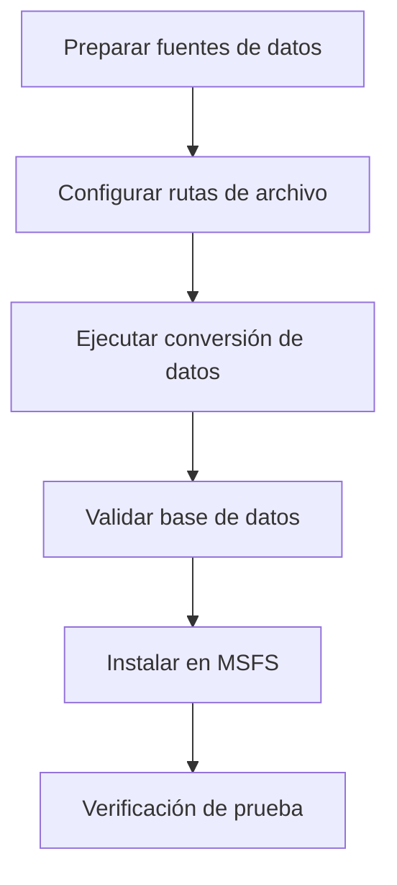

# 🚀 Instrucciones de uso

Esta guía detalla cómo usar la herramienta Nav-data para convertir datos de navegación aérea a un formato de base de datos compatible con PMDG e instalarlo en Microsoft Flight Simulator.

## 📋 Visión general del proceso de conversión

La conversión de datos de Nav-data sigue los siguientes pasos principales:



### Descripción de los módulos de conversión

| Nombre del módulo | Función | Datos de entrada | Tabla de salida |
|--------|------|----------|--------|
| `PMDG_APT.py` | Procesamiento de datos de aeropuertos | AD_HP.csv + Airport.dat | tbl_airports |
| `PMDG_RUNWAY.py` | Procesamiento de información de pistas | RWY*.csv + earth_nav.dat | tbl_runways |
| `PMDG_VHF.py` | Procesamiento de datos VOR/DME | earth_nav.dat | tbl_vhfnavaids |
| `PMDG_ENRT_NDB.py` | Procesamiento de datos NDB | earth_nav.dat | tbl_enroute_ndbnavaids |
| `PMDG_ENRT_WAYPOINT.py` | Procesamiento de puntos de ruta | earth_fix.dat | tbl_enroute_waypoints |
| `PMDG_TMA_WAYPOINT.py` | Puntos de ruta de área terminal | earth_fix.dat | tbl_terminal_waypoints |
| `PMDG_AWY_FINAL.py` | Procesamiento de datos de aerovías | RTE_SEG.csv + earth_*.dat | tbl_enroute_airways |
| `PMDG_ILS.py` | Procesamiento de datos ILS/GS | earth_nav.dat | tbl_localizers_glideslopes |
| `PMDG_SID.py` | Procedimientos de salida estándar (SID) | Archivos .dat CIFP | tbl_sids |
| `PMDG_STAR.py` | Procedimientos de llegada estándar (STAR) | Archivos .dat CIFP | tbl_stars |
| `PMDG_APPCH.py` | Procedimientos de aproximación | Archivos .dat CIFP | tbl_iaps |

## 🔄 Pasos de la conversión de datos

### Paso uno: Preparación de datos

1. **Obtener datos NAIP**
   ```bash
   # Colocar los archivos CSV de NAIP en el directorio especificado
   cp /source/path/*.csv data/input/naip/
   
   # Verificar la integridad de los archivos
   ls data/input/naip/
   # Debería mostrar: AD_HP.csv, RWY_DIRECTION.csv, RWY.csv, RTE_SEG.csv
   ```

2. **Obtener datos de X-Plane**
   ```bash
   # Copiar archivos de datos del directorio de instalación de X-Plane
   cp "/path/to/X-Plane/Custom Data/earth_fix.dat" data/input/xplane/
   cp "/path/to/X-Plane/Custom Data/earth_nav.dat" data/input/xplane/
   ```

3. **Obtener datos CIFP**
   ```bash
   # Copiar archivos de datos de procedimientos CIFP
   cp -r /path/to/CIFP/* data/input/cifp/
   ```

4. **Preparar archivo de búsqueda de aeropuertos**
   ```bash
   # Copiar archivo de búsqueda de nombres de aeropuertos
   cp /path/to/Airport.dat data/input/
   ```

### Paso dos: Activar entorno y verificar

```bash
# Activar entorno virtual
source nav-data-env/bin/activate  # macOS/Linux
# O nav-data-env\Scripts\activate  # Windows

# Validar configuración
python scripts/validate_config.py
```

### Paso tres: Ejecutar la conversión de datos

#### Método A: Ejecutar módulos individualmente (recomendado)

Ejecutar cada módulo paso a paso, siguiendo las dependencias de datos:

```bash
# 1. Procesar datos básicos de aeropuertos
echo "🏢 Procesando datos de aeropuertos..."
python PMDG_APT.py

# 2. Procesar datos de pistas
echo "🛫 Procesando datos de pistas..."
python PMDG_RUNWAY.py

# 3. Procesar equipos de navegación
echo "📡 Procesando ayudas a la navegación VHF..."
python PMDG_VHF.py

echo "📡 Procesando ayudas a la navegación NDB..."
python PMDG_ENRT_NDB.py

echo "📍 Procesando sistema ILS..."
python PMDG_ILS.py

# 4. Procesar puntos de ruta
echo "🗺️ Procesando datos de puntos de ruta..."
python PMDG_ENRT_WAYPOINT.py
python PMDG_TMA_WAYPOINT.py

# 5. Procesar datos de aerovías
echo "🛣️ Procesando datos de aerovías..."
python PMDG_AWY_FINAL.py

# 6. Procesar procedimientos de vuelo (si hay datos CIFP)
echo "📋 Procesando procedimientos de salida estándar (SID)..."
python PMDG_SID.py

echo "📋 Procesando procedimientos de llegada estándar (STAR)..."
python PMDG_STAR.py

echo "📋 Procesando procedimientos de aproximación..."
python PMDG_APPCH.py
```

#### Método B: Script de procesamiento por lotes

Crear script de procesamiento automatizado:

```bash
# scripts/run_conversion.sh
#!/bin/bash

set -e  # Detener en caso de error

echo "🚀 Iniciando el proceso de conversión de Nav-data..."

# Verificar entorno virtual
if [[ "$VIRTUAL_ENV" == "" ]]; then
    echo "❌ Por favor, active el entorno virtual primero"
    exit 1
fi

# Validar configuración
echo "🔍 Validando configuración..."
python scripts/validate_config.py

# Crear directorio de salida
mkdir -p data/output logs

# Registrar hora de inicio
start_time=$(date +%s)

# Función de conversión
run_module() {
    local module=$1
    local description=$2
    
    echo "📊 $description"
    if python $module.py; then
        echo "✅ $module completado"
    else
        echo "❌ $module falló"
        exit 1
    fi
    echo "---"
}

# Ejecutar pasos de conversión
run_module "PMDG_APT" "Procesar datos de aeropuertos"
run_module "PMDG_RUNWAY" "Procesar datos de pistas"
run_module "PMDG_VHF" "Procesar ayudas a la navegación VHF"
run_module "PMDG_ENRT_NDB" "Procesar ayudas a la navegación NDB"
run_module "PMDG_ILS" "Procesar sistema ILS"
run_module "PMDG_ENRT_WAYPOINT" "Procesar datos de puntos de ruta"
run_module "PMDG_TMA_WAYPOINT" "Procesar puntos de ruta de área terminal"
run_module "PMDG_AWY_FINAL" "Procesar datos de aerovías"

# Datos de procedimientos (opcional)
if [[ -d "data/input/cifp" ]] && [[ $(ls -A data/input/cifp) ]]; then
    run_module "PMDG_SID" "Procesar procedimientos de salida estándar (SID)"
    run_module "PMDG_STAR" "Procesar procedimientos de llegada estándar (STAR)"
    run_module "PMDG_APPCH" "Procesar procedimientos de aproximación"
fi

# Validar la base de datos generada
echo "🔍 Validando base de datos..."
python db_validator.py data/output/e_dfd_PMDG.s3db

# Calcular tiempo total
end_time=$(date +%s)
duration=$((end_time - start_time))
echo "✅ Conversión completada! Tiempo total: ${duration} segundos"

echo "📊 Archivo de base de datos generado: data/output/e_dfd_PMDG.s3db"
echo "📝 Ubicación de los archivos de registro: logs/"
```

### Paso cuatro: Validar la base de datos generada

```bash
# Ejecutar herramienta de validación de base de datos
python db_validator.py data/output/e_dfd_PMDG.s3db

# Verificar estadísticas de la base de datos
python -c "
import sqlite3
conn = sqlite3.connect('data/output/e_dfd_PMDG.s3db')
cursor = conn.cursor()

# Obtener lista de tablas
cursor.execute(\"SELECT name FROM sqlite_master WHERE type='table'\")
tables = cursor.fetchall()

print('📊 Estadísticas de tablas de la base de datos:')
for table in tables:
    table_name = table[0]
    cursor.execute(f'SELECT COUNT(*) FROM {table_name}')
    count = cursor.fetchone()[0]
    print(f'  {table_name}: {count:,} registros')

conn.close()
"
```

## 📥 Instalación en Microsoft Flight Simulator

### Paso uno: Localizar aeronaves PMDG

1. **Encontrar la carpeta Community de MSFS**
   
   Según su método de instalación de MSFS:
   
   - **Microsoft Store**: `%LOCALAPPDATA%\Packages\Microsoft.FlightSimulator_8wekyb3d8bbwe\LocalCache\Packages\Community`
   - **Steam**: `%APPDATA%\Microsoft Flight Simulator\Packages\Community`
   - **Xbox Game Pass**: `%LOCALAPPDATA%\Packages\Microsoft.FlightDashboard_8wekyb3d8bbwe\LocalCache\Packages\Community`

2. **Confirmar instalación de aeronaves PMDG**
   ```cmd
   dir Community
   ```
   Debería mostrar directorios similares a los siguientes:
   ```
   pmdg-aircraft-737
   pmdg-aircraft-738
   pmdg-aircraft-77w
   ```

### Paso dos: Realizar copia de seguridad de datos existentes

Realizar copia de seguridad de los datos de navegación existentes para cada aeronave PMDG:

```cmd
REM Ejemplo: Copia de seguridad de PMDG 737-800
cd "Community\pmdg-aircraft-738\Config"
ren Navdata Navdata_backup_%DATE:~0,10%

REM Copia de seguridad de PMDG 777-300ER  
cd "..\..\..\pmdg-aircraft-77w\Config"
ren Navdata Navdata_backup_%DATE:~0,10%
```

### Paso tres: Instalar la nueva base de datos

```cmd
REM Crear el directorio Navdata para cada aeronave y copiar la base de datos
mkdir "Community\pmdg-aircraft-738\Config\Navdata"
copy "Nav-data\data\output\e_dfd_PMDG.s3db" "Community\pmdg-aircraft-738\Config\Navdata\"

mkdir "Community\pmdg-aircraft-77w\Config\Navdata"
copy "Nav-data\data\output\e_dfd_PMDG.s3db" "Community\pmdg-aircraft-77w\Config\Navdata\"
```

### Paso cuatro: Limpiar caché de MSFS

Eliminar la caché de datos de navegación de MSFS para forzar una recarga:

```cmd
REM Versión de Microsoft Store
rmdir /s /q "%LOCALAPPDATA%\Packages\Microsoft.FlightSimulator_8wekyb3d8bbwe\LocalState\packages\pmdg-aircraft-738\work\NavigationData"
rmdir /s /q "%LOCALAPPDATA%\Packages\Microsoft.FlightSimulator_8wekyb3d8bbwe\LocalState\packages\pmdg-aircraft-77w\work\NavigationData"

REM Versión de Steam  
rmdir /s /q "%APPDATA%\Microsoft Flight Simulator\LocalState\packages\pmdg-aircraft-738\work\NavigationData"
rmdir /s /q "%APPDATA%\Microsoft Flight Simulator\LocalState\packages\pmdg-aircraft-77w\work\NavigationData"
```

## ✅ Verificar instalación

### Paso uno: Iniciar MSFS

1. Cerrar completamente Microsoft Flight Simulator
2. Reiniciar MSFS
3. Esperar a que cargue completamente

### Paso dos: Revisar aeronaves PMDG

1. **Seleccionar aeronave PMDG**
   - Seleccionar cualquier aeronave PMDG 737 o 777
   - Seleccionar un aeropuerto de la región de China (ej. ZBAA Beijing Capital)

2. **Verificar datos del FMC**
   - Entrar en la cabina
   - Abrir CDU/FMC
   - Verificar la fecha de la base de datos de navegación
   - Validar la disponibilidad de puntos de ruta

### Paso tres: Prueba de funcionalidad

#### Probar puntos de ruta

```
Pasos de operación del CDU:
1. MENU → NAV DATA → WAYPOINT
2. Introducir punto de ruta de prueba: ABING
3. Confirmar que se muestra la información de coordenadas correcta
```

#### Probar datos de aeropuertos

```
Pasos de operación del CDU:
1. MENU → NAV DATA → AIRPORT
2. Introducir aeropuerto de prueba: ZBAA
3. Verificar información de pista y datos de frecuencia
```

#### Probar procedimientos de vuelo

```
Pasos de operación del CDU:
1. ROUTE → DEPARTURE
2. Seleccionar Aeropuerto Internacional de Pekín Capital (ZBAA)
3. Validar la disponibilidad de los procedimientos SID
4. ROUTE → ARRIVAL
5. Validar los procedimientos STAR y de aproximación
```

## 🔧 Uso avanzado

### 1. Actualización incremental

Si solo necesita actualizar tipos específicos de datos:

```bash
# Solo actualizar datos de aerovías
python PMDG_AWY_FINAL.py

# Solo actualizar datos de aeropuertos
python PMDG_APT.py
python PMDG_RUNWAY.py
```

### 2. Script de instalación por lotes

Crear un script de instalación automatizado:

```python
# scripts/install_to_msfs.py
import os
import shutil
import winreg
import glob
from pathlib import Path

def find_msfs_community():
    """Buscar automáticamente la carpeta Community de MSFS"""
    possible_paths = [
        os.path.expandvars(r"%LOCALAPPDATA%\Packages\Microsoft.FlightSimulator_8wekyb3d8bbwe\LocalCache\Packages\Community"),
        os.path.expandvars(r"%APPDATA%\Microsoft Flight Simulator\Packages\Community"),
        os.path.expandvars(r"%LOCALAPPDATA%\Packages\Microsoft.FlightDashboard_8wekyb3d8bbwe\LocalCache\Packages\Community")
    ]
    
    for path in possible_paths:
        if os.path.exists(path):
            return path
    return None

def install_navdata():
    """Instalar datos de navegación en todas las aeronaves PMDG"""
    
    community_path = find_msfs_community()
    if not community_path:
        print("❌ No se pudo encontrar la carpeta Community de MSFS")
        return False
    
    print(f"📂 Carpeta Community encontrada: {community_path}")
    
    # Buscar aeronaves PMDG
    pmdg_aircraft = glob.glob(os.path.join(community_path, "pmdg-aircraft-*"))
    
    if not pmdg_aircraft:
        print("❌ No se encontraron aeronaves PMDG")
        return False
    
    database_path = "data/output/e_dfd_PMDG.s3db"
    if not os.path.exists(database_path):
        print(f"❌ El archivo de la base de datos no existe: {database_path}")
        return False
    
    for aircraft_path in pmdg_aircraft:
        aircraft_name = os.path.basename(aircraft_path)
        config_path = os.path.join(aircraft_path, "Config")
        navdata_path = os.path.join(config_path, "Navdata")
        
        print(f"🛫 Procesando {aircraft_name}...")
        
        # Hacer copia de seguridad de los datos existentes
        if os.path.exists(navdata_path):
            backup_path = f"{navdata_path}_backup"
            if os.path.exists(backup_path):
                shutil.rmtree(backup_path)
            shutil.move(navdata_path, backup_path)
            print(f"  💾 Datos existentes respaldados en {backup_path}")
        
        # Crear nuevo directorio Navdata
        os.makedirs(navdata_path, exist_ok=True)
        
        # Copiar archivo de base de datos
        dest_db = os.path.join(navdata_path, "e_dfd_PMDG.s3db")
        shutil.copy2(database_path, dest_db)
        print(f"  ✅ Base de datos instalada en {dest_db}")
    
    print("✅ Instalación de datos de navegación completada para todas las aeronaves PMDG!")
    print("⚠️  Por favor, reinicie Microsoft Flight Simulator para cargar los nuevos datos")
    return True

if __name__ == "__main__":
    install_navdata()
```

### 3. Herramienta de comparación de datos

Crear una herramienta para comparar datos de diferentes versiones:

```python
# scripts/compare_databases.py
import sqlite3
import sys

def compare_databases(db1_path, db2_path):
    """Comparar diferencias entre dos bases de datos"""
    
    conn1 = sqlite3.connect(db1_path)
    conn2 = sqlite3.connect(db2_path)
    
    cursor1 = conn1.cursor()
    cursor2 = conn2.cursor()
    
    # Obtener lista de tablas
    cursor1.execute("SELECT name FROM sqlite_master WHERE type='table'")
    tables1 = {row[0] for row in cursor1.fetchall()}
    
    cursor2.execute("SELECT name FROM sqlite_master WHERE type='table'")
    tables2 = {row[0] for row in cursor2.fetchall()}
    
    print("📊 Informe de comparación de bases de datos")
    print("=" * 50)
    
    # Comparar estructura de tablas
    common_tables = tables1.intersection(tables2)
    only_in_db1 = tables1 - tables2
    only_in_db2 = tables2 - tables1
    
    if only_in_db1:
        print(f"Tablas solo en {db1_path}: {only_in_db1}")
    if only_in_db2:
        print(f"Tablas solo en {db2_path}: {only_in_db2}")
    
    # Comparar número de registros
    for table in common_tables:
        cursor1.execute(f"SELECT COUNT(*) FROM {table}")
        count1 = cursor1.fetchone()[0]
        
        cursor2.execute(f"SELECT COUNT(*) FROM {table}")
        count2 = cursor2.fetchone()[0]
        
        diff = count2 - count1
        status = "📈" if diff > 0 else "📉" if diff < 0 else "➡️"
        print(f"{status} {table}: {count1} → {count2} ({diff:+d})")
    
    conn1.close()
    conn2.close()

if __name__ == "__main__":
    if len(sys.argv) != 3:
        print("Uso: python compare_databases.py <base_de_datos1> <base_de_datos2>")
        sys.exit(1)
    
    compare_databases(sys.argv[1], sys.argv[2])
```

## 🔍 Solución de problemas

### Problemas comunes y soluciones

#### 1. Interrupción del proceso de conversión
**Síntoma**: Se produce un error y el proceso se detiene durante la conversión
**Solución**:
```bash
# Verificar registros de errores
cat logs/PMDG_*.log | grep ERROR

# Volver a ejecutar el módulo fallido
python [módulo_fallido].py
```

#### 2. MSFS no reconoce los datos
**Síntoma**: El FMC de PMDG muestra "DB OUT OF DATE"
**Solución**:
```bash
# Confirmar que la ubicación del archivo de la base de datos es correcta
ls "Community/pmdg-aircraft-*/Config/Navdata/"

# Volver a limpiar la caché
rmdir /s /q "%LOCALAPPDATA%\...\NavigationData"

# Reiniciar MSFS
```

#### 3. Error de memoria insuficiente
**Síntoma**: "MemoryError" o el sistema se ralentiza
**Solución**:
```bash
# Reducir el tamaño del lote
# Editar PMDG_TMA_WAYPOINT.py
# Cambiar batch_size=1000 a batch_size=500

# Cerrar otras aplicaciones
# Aumentar la memoria virtual
```

#### 4. Problemas de permisos
**Síntoma**: Error "Permission denied"
**Solución**:
```cmd
REM Windows: Ejecutar como administrador
REM O modificar permisos de carpeta
icacls "Community" /grant %USERNAME%:F /t
```

### Análisis de registros

Verificar los archivos de registro de cada módulo para obtener información detallada:

```bash
# Ver estadísticas de procesamiento
grep "处理完成" logs/PMDG_*.log

# Ver información de error
grep "ERROR\|error" logs/PMDG_*.log

# Ver información de advertencia
grep "WARNING\|advertencia" logs/PMDG_*.log
```

---

¡Completado!: ¡Ahora ha dominado el flujo de uso completo de Nav-data! Para obtener más información sobre funciones avanzadas, consulte el documento de [Arquitectura Técnica](../architecture.md).