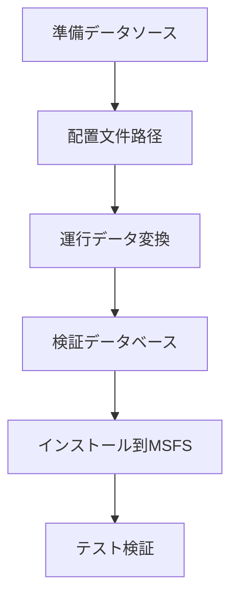

# 🚀 利用方法

このガイドでは、Nav-data ツールを使用して航空ナビゲーションデータを PMDG 互換のデータベース形式に変換し、Microsoft Flight Simulator にインストールする方法を詳細に説明します。

## 📋 変換プロセス概要

Nav-data のデータ変換は以下の主要な手順に従います。



### 変換モジュール説明

| モジュール名 | 機能 | 入力データ | 出力テーブル |
|--------|------|----------|--------|
| `PMDG_APT.py` | 空港データ処理 | AD_HP.csv + Airport.dat | tbl_airports |
| `PMDG_RUNWAY.py` | 滑走路情報処理 | RWY*.csv + earth_nav.dat | tbl_runways |
| `PMDG_VHF.py` | VOR/DMEデータ処理 | earth_nav.dat | tbl_vhfnavaids |
| `PMDG_ENRT_NDB.py` | NDBデータ処理 | earth_nav.dat | tbl_enroute_ndbnavaids |
| `PMDG_ENRT_WAYPOINT.py` | ウェイポイント処理 | earth_fix.dat | tbl_enroute_waypoints |
| `PMDG_TMA_WAYPOINT.py` | ターミナルエリアウェイポイント | earth_fix.dat | tbl_terminal_waypoints |
| `PMDG_AWY_FINAL.py` | 航空路データ処理 | RTE_SEG.csv + earth_*.dat | tbl_enroute_airways |
| `PMDG_ILS.py` | ILS/GSデータ処理 | earth_nav.dat | tbl_localizers_glideslopes |
| `PMDG_SID.py` | 標準出発方式 (SID) | CIFP .dat ファイル | tbl_sids |
| `PMDG_STAR.py` | 標準到着方式 (STAR) | CIFP .dat ファイル | tbl_stars |
| `PMDG_APPCH.py` | アプローチ方式 | CIFP .dat ファイル | tbl_iaps |

## 🔄 データ変換手順

### ステップ 1: データ準備

1.  **NAIP データの取得**
    ```bash
    # NAIP CSV ファイルを指定ディレクトリに配置
    cp /source/path/*.csv data/input/naip/
    
    # ファイルの完全性を検証
    ls data/input/naip/
    # 以下が表示されるはずです: AD_HP.csv, RWY_DIRECTION.csv, RWY.csv, RTE_SEG.csv
    ```

2.  **X-Plane データの取得**
    ```bash
    # X-Plane インストールディレクトリからデータファイルをコピー
    cp "/path/to/X-Plane/Custom Data/earth_fix.dat" data/input/xplane/
    cp "/path/to/X-Plane/Custom Data/earth_nav.dat" data/input/xplane/
    ```

3.  **CIFP データの取得**
    ```bash
    # CIFP プログラムデータファイルをコピー
    cp -r /path/to/CIFP/* data/input/cifp/
    ```

4.  **空港ルックアップファイルの準備**
    ```bash
    # 空港名ルックアップファイルをコピー
    cp /path/to/Airport.dat data/input/
    ```

### ステップ 2: 環境の有効化と検証

```bash
# 仮想環境をアクティブ化
source nav-data-env/bin/activate  # macOS/Linux
# または nav-data-env\Scripts\activate  # Windows

# 設定を検証
python scripts/validate_config.py
```

### ステップ 3: データ変換の実行

#### 方法 A: 各モジュールを個別に実行する (推奨)

データの依存関係に従い、各モジュールを段階的に実行します。

```bash
# 1. 空港基本データの処理
echo "🏢 空港データを処理中..."
python PMDG_APT.py

# 2. 滑走路データの処理
echo "🛫 滑走路データを処理中..."
python PMDG_RUNWAY.py

# 3. 航法設備の処理
echo "📡 VHF航法設備を処理中..."
python PMDG_VHF.py

echo "📡 NDB航法設備を処理中..."
python PMDG_ENRT_NDB.py

echo "📍 ILSシステムを処理中..."
python PMDG_ILS.py

# 4. ウェイポイントの処理
echo "🗺️ ウェイポイントデータを処理中..."
python PMDG_ENRT_WAYPOINT.py
python PMDG_TMA_WAYPOINT.py

# 5. 航空路データの処理
echo "🛣️ 航空路データを処理中..."
python PMDG_AWY_FINAL.py

# 6. 飛行方式の処理 (CIFPデータがある場合)
echo "📋 標準出発方式を処理中..."
python PMDG_SID.py

echo "📋 標準到着方式を処理中..."
python PMDG_STAR.py

echo "📋 アプローチ方式を処理中..."
python PMDG_APPCH.py
```

#### 方法 B: バッチ処理スクリプト

自動処理スクリプトを作成します。

```bash
# scripts/run_conversion.sh
#!/bin/bash

set -e  # エラーが発生した場合に停止

echo "🚀 Nav-data 変換プロセスを開始します..."

# 仮想環境を確認
if [[ "$VIRTUAL_ENV" == "" ]]; then
    echo "❌ まず仮想環境をアクティブ化してください"
    exit 1
fi

# 設定を検証
echo "🔍 設定を検証中..."
python scripts/validate_config.py

# 出力ディレクトリを作成
mkdir -p data/output logs

# 開始時間を記録
start_time=$(date +%s)

# 変換関数
run_module() {
    local module=$1
    local description=$2
    
    echo "📊 $description"
    if python $module.py; then
        echo "✅ $module 完了"
    else
        echo "❌ $module 失敗"
        exit 1
    fi
    echo "---"
}

# 変換手順を実行
run_module "PMDG_APT" "空港データ処理"
run_module "PMDG_RUNWAY" "滑走路データ処理"
run_module "PMDG_VHF" "VHF航法設備処理"
run_module "PMDG_ENRT_NDB" "NDB航法設備処理"
run_module "PMDG_ILS" "ILSシステム処理"
run_module "PMDG_ENRT_WAYPOINT" "ウェイポイントデータ処理"
run_module "PMDG_TMA_WAYPOINT" "ターミナルエリアウェイポイント処理"
run_module "PMDG_AWY_FINAL" "航空路データ処理"

# 方式データ (オプション)
if [[ -d "data/input/cifp" ]] && [[ $(ls -A data/input/cifp) ]]; then
    run_module "PMDG_SID" "標準出発方式処理"
    run_module "PMDG_STAR" "標準到着方式処理"
    run_module "PMDG_APPCH" "アプローチ方式処理"
fi

# 生成されたデータベースを検証
echo "🔍 生成されたデータベースを検証中..."
python db_validator.py data/output/e_dfd_PMDG.s3db

# 総所要時間を計算
end_time=$(date +%s)
duration=$((end_time - start_time))
echo "✅ 変換完了! 総所要時間: ${duration}秒"

echo "📊 生成されたデータベースファイル: data/output/e_dfd_PMDG.s3db"
echo "📝 ログファイルの場所: logs/"
```

### ステップ 4: 生成されたデータベースの検証

```bash
# データベース検証ツールを実行
python db_validator.py data/output/e_dfd_PMDG.s3db

# データベースの統計情報を確認
python -c "
import sqlite3
conn = sqlite3.connect('data/output/e_dfd_PMDG.s3db')
cursor = conn.cursor()

# テーブルリストを取得
cursor.execute(\"SELECT name FROM sqlite_master WHERE type='table'\")
tables = cursor.fetchall()

print('📊 データベーステーブル統計:')
for table in tables:
    table_name = table[0]
    cursor.execute(f'SELECT COUNT(*) FROM {table_name}')
    count = cursor.fetchone()[0]
    print(f'  {table_name}: {count:,} レコード')

conn.close()
"
```

## 📥 Microsoft Flight Simulator へのインストール

### ステップ 1: PMDG 機体の特定

1.  **MSFS Community フォルダーを見つける**

    MSFS のインストール方法に応じて：

    *   **Microsoft Store**: `%LOCALAPPDATA%\Packages\Microsoft.FlightSimulator_8wekyb3d8bbwe\LocalCache\Packages\Community`
    *   **Steam**: `%APPDATA%\Microsoft Flight Simulator\Packages\Community`
    *   **Xbox Game Pass**: `%LOCALAPPDATA%\Packages\Microsoft.FlightDashboard_8wekyb3d8bbwe\LocalCache\Packages\Community`

2.  **PMDG 機体のインストールを確認**
    ```cmd
    dir Community
    ```
    以下のようなディレクトリが表示されるはずです：
    ```
    pmdg-aircraft-737
    pmdg-aircraft-738
    pmdg-aircraft-77w
    ```

### ステップ 2: 元のデータのバックアップ

各 PMDG 機体について、元のナビゲーションデータをバックアップします。

```cmd
REM 例：PMDG 737-800 のバックアップ
cd "Community\pmdg-aircraft-738\Config"
ren Navdata Navdata_backup_%DATE:~0,10%

REM PMDG 777-300ER のバックアップ  
cd "..\..\..\pmdg-aircraft-77w\Config"
ren Navdata Navdata_backup_%DATE:~0,10%
```

### ステップ 3: 新しいデータベースのインストール

```cmd
REM 各機体用の Navdata ディレクトリを作成し、データベースをコピー
mkdir "Community\pmdg-aircraft-738\Config\Navdata"
copy "Nav-data\data\output\e_dfd_PMDG.s3db" "Community\pmdg-aircraft-738\Config\Navdata\"

mkdir "Community\pmdg-aircraft-77w\Config\Navdata"
copy "Nav-data\data\output\e_dfd_PMDG.s3db" "Community\pmdg-aircraft-77w\Config\Navdata\"
```

### ステップ 4: MSFS キャッシュのクリア

MSFS のナビゲーションデータキャッシュを削除し、再ロードを強制します。

```cmd
REM Microsoft Store 版
rmdir /s /q "%LOCALAPPDATA%\Packages\Microsoft.FlightSimulator_8wekyb3d8bbwe\LocalState\packages\pmdg-aircraft-738\work\NavigationData"
rmdir /s /q "%LOCALAPPDATA%\Packages\Microsoft.FlightSimulator_8wekyb3d8bbwe\LocalState\packages\pmdg-aircraft-77w\work\NavigationData"

REM Steam 版  
rmdir /s /q "%APPDATA%\Microsoft Flight Simulator\LocalState\packages\pmdg-aircraft-738\work\NavigationData"
rmdir /s /q "%APPDATA%\Microsoft Flight Simulator\LocalState\packages\pmdg-aircraft-77w\work\NavigationData"
```

## ✅ インストールの検証

### ステップ 1: MSFS の起動

1.  Microsoft Flight Simulator を完全に終了します
2.  MSFS を再起動します
3.  完全にロードされるまで待ちます

### ステップ 2: PMDG 機体の確認

1.  **PMDG 機体を選択**
    *   いずれかの PMDG 737 または 777 機体を選択します
    *   中国地域の空港（例：ZBAA 北京首都）を選択します

2.  **FMC データの確認**
    *   コックピットに入ります
    *   CDU/FMC を開きます
    *   ナビゲーションデータベースの日付を確認します
    *   ウェイポイントの可用性を検証します

### ステップ 3: 機能テスト

#### ウェイポイントのテスト

```
CDU 操作手順:
1. MENU → NAV DATA → WAYPOINT
2. テストウェイポイントを入力: ABING
3. 正しい座標情報が表示されることを確認
```

#### 空港データのテスト

```
CDU 操作手順:
1. MENU → NAV DATA → AIRPORT
2. テスト空港を入力: ZBAA
3. 滑走路情報と周波数データを検証
```

#### 飛行方式のテスト

```
CDU 操作手順:
1. ROUTE → DEPARTURE
2. 北京首都空港 (ZBAA) を選択
3. SID 方式の可用性を検証
4. ROUTE → ARRIVAL
5. STAR とアプローチ方式を検証
```

## 🔧 高度な利用方法

### 1. 増分更新

特定の種類のデータのみを更新したい場合：

```bash
# 航空路データのみを更新
python PMDG_AWY_FINAL.py

# 空港データのみを更新
python PMDG_APT.py
python PMDG_RUNWAY.py
```

### 2. バッチインストールスクリプト

自動インストールスクリプトを作成します。

```python
# scripts/install_to_msfs.py
import os
import shutil
import winreg
import glob
from pathlib import Path

def find_msfs_community():
    """MSFS Community フォルダーを自動で検索"""
    possible_paths = [
        os.path.expandvars(r"%LOCALAPPDATA%\Packages\Microsoft.FlightSimulator_8wekyb3d8bbwe\LocalCache\Packages\Community"),
        os.path.expandvars(r"%APPDATA%\Microsoft Flight Simulator\Packages\Community"),
        os.path.expandvars(r"%LOCALAPPDATA%\Packages\Microsoft.FlightDashboard_8wekyb3d8bbwe\LocalCache\Packages\Community")
    ]
    
    for path in possible_paths:
        if os.path.exists(path):
            return path
    return None

def install_navdata():
    """すべての PMDG 機体にナビゲーションデータをインストール"""
    
    community_path = find_msfs_community()
    if not community_path:
        print("❌ MSFS Community フォルダーが見つかりません")
        return False
    
    print(f"📂 Community フォルダーが見つかりました: {community_path}")
    
    # PMDG 機体を検索
    pmdg_aircraft = glob.glob(os.path.join(community_path, "pmdg-aircraft-*"))
    
    if not pmdg_aircraft:
        print("❌ PMDG 機体が見つかりません")
        return False
    
    database_path = "data/output/e_dfd_PMDG.s3db"
    if not os.path.exists(database_path):
        print(f"❌ データベースファイルが存在しません: {database_path}")
        return False
    
    for aircraft_path in pmdg_aircraft:
        aircraft_name = os.path.basename(aircraft_path)
        config_path = os.path.join(aircraft_path, "Config")
        navdata_path = os.path.join(config_path, "Navdata")
        
        print(f"🛫 {aircraft_name} を処理中...")
        
        # 元のデータをバックアップ
        if os.path.exists(navdata_path):
            backup_path = f"{navdata_path}_backup"
            if os.path.exists(backup_path):
                shutil.rmtree(backup_path)
            shutil.move(navdata_path, backup_path)
            print(f"  💾 元のデータは {backup_path} にバックアップされました")
        
        # 新しい Navdata ディレクトリを作成
        os.makedirs(navdata_path, exist_ok=True)
        
        # データベースファイルをコピー
        dest_db = os.path.join(navdata_path, "e_dfd_PMDG.s3db")
        shutil.copy2(database_path, dest_db)
        print(f"  ✅ データベースは {dest_db} にインストールされました")
    
    print("✅ すべての PMDG 機体へのナビゲーションデータのインストールが完了しました!")
    print("⚠️  新しいデータをロードするために Microsoft Flight Simulator を再起動してください")
    return True

if __name__ == "__main__":
    install_navdata()
```

### 3. データ比較ツール

異なるバージョンのデータを比較するツールを作成します。

```python
# scripts/compare_databases.py
import sqlite3
import sys

def compare_databases(db1_path, db2_path):
    """2つのデータベースの差異を比較"""
    
    conn1 = sqlite3.connect(db1_path)
    conn2 = sqlite3.connect(db2_path)
    
    cursor1 = conn1.cursor()
    cursor2 = conn2.cursor()
    
    # テーブルリストを取得
    cursor1.execute("SELECT name FROM sqlite_master WHERE type='table'")
    tables1 = {row[0] for row in cursor1.fetchall()}
    
    cursor2.execute("SELECT name FROM sqlite_master WHERE type='table'")
    tables2 = {row[0] for row in cursor2.fetchall()}
    
    print("📊 データベース比較レポート")
    print("=" * 50)
    
    # テーブル構造を比較
    common_tables = tables1.intersection(tables2)
    only_in_db1 = tables1 - tables2
    only_in_db2 = tables2 - tables1
    
    if only_in_db1:
        print(f"  {db1_path} にのみ存在するテーブル: {only_in_db1}")
    if only_in_db2:
        print(f"  {db2_path} にのみ存在するテーブル: {only_in_db2}")
    
    # レコード数を比較
    for table in common_tables:
        cursor1.execute(f"SELECT COUNT(*) FROM {table}")
        count1 = cursor1.fetchone()[0]
        
        cursor2.execute(f"SELECT COUNT(*) FROM {table}")
        count2 = cursor2.fetchone()[0]
        
        diff = count2 - count1
        status = "📈" if diff > 0 else "📉" if diff < 0 else "➡️"
        print(f"{status} {table}: {count1} → {count2} ({diff:+d})")
    
    conn1.close()
    conn2.close()

if __name__ == "__main__":
    if len(sys.argv) != 3:
        print("使用法: python compare_databases.py <データベース1> <データベース2>")
        sys.exit(1)
    
    compare_databases(sys.argv[1], sys.argv[2])
```

## 🔍 トラブルシューティング

### よくある問題と解決策

#### 1. 変換の中断
**症状**: 変換中にエラーが発生し停止
**解決**:
```bash
# エラーログを確認
cat logs/PMDG_*.log | grep ERROR

# 失敗したモジュールを再実行
python [失敗したモジュール].py
```

#### 2. MSFS がデータを認識しない
**症状**: PMDG FMC に "DB OUT OF DATE" と表示される
**解決**:
```bash
# データベースファイルの場所が正しいことを確認
ls "Community/pmdg-aircraft-*/Config/Navdata/"

# キャッシュを再クリア
rmdir /s /q "%LOCALAPPDATA%\...\NavigationData"

# MSFS を再起動
```

#### 3. メモリ不足エラー
**症状**: "MemoryError" またはシステムが遅くなる
**解決**:
```bash
# バッチサイズを減らす
# PMDG_TMA_WAYPOINT.py を編集
# batch_size=1000 を batch_size=500 に変更

# 他のアプリケーションを閉じる
# 仮想メモリを増やす
```

#### 4. 権限の問題
**症状**: "Permission denied" エラー
**解決**:
```cmd
REM Windows: 管理者として実行
REM またはフォルダーの権限を変更
icacls "Community" /grant %USERNAME%:F /t
```

### ログ分析

詳細については、各モジュールのログファイルを確認してください。

```bash
# 処理統計を確認
grep "処理完了" logs/PMDG_*.log

# エラー情報を確認
grep "ERROR\|エラー" logs/PMDG_*.log

# 警告情報を確認
grep "WARNING\|警告" logs/PMDG_*.log
```

---

**完了**: これで Nav-data の完全な使用プロセスを習得しました！詳細な高度な機能については、[技術アーキテクチャ](../architecture.md)ドキュメントを参照してください。