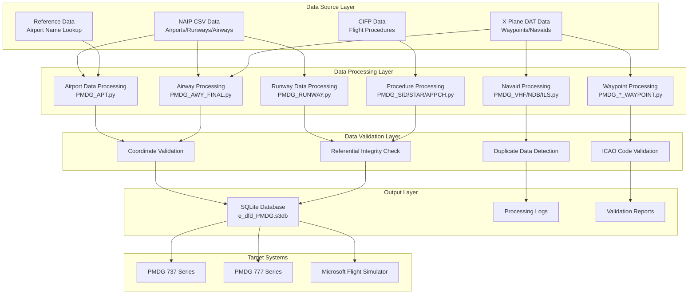
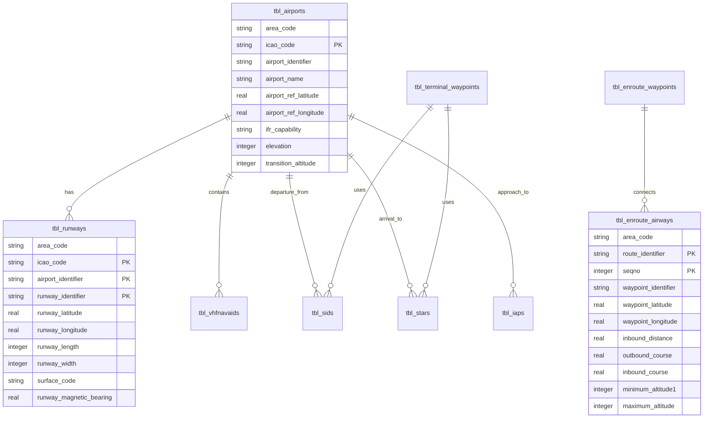
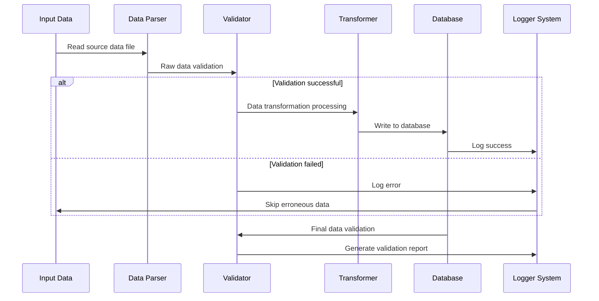

# 🏗️ Technical Architecture

This document provides an in-depth introduction to Nav-data's system architecture, design principles, and technical implementation details, offering comprehensive technical reference for developers and technical users.

## 📐 System Architecture Overview

### Overall Architecture Diagram



### Core Component Description

| Component           | Functionality          | Tech Stack          | Key Features                                 |
|---------------------|------------------------|---------------------|----------------------------------------------|
| **Data Parser**     | Multi-format data reading | pandas, chardet     | Automatic encoding detection, fault tolerance |
| **Coordinate Converter** | Geographic coordinate processing | Custom algorithm    | DMS↔Decimal conversion, precision control    |
| **Magnetic Variation Calculator** | Magnetic declination calculation | pygeomag            | WMM2025 model, high-precision calculation    |
| **Database Engine** | SQLite database        | sqlite3             | PMDG compatible mode, transaction processing |
| **Validation Engine** | Data quality assurance | Custom validators   | Multi-layer validation, detailed reporting   |
| **Concurrent Processor** | Performance optimization       | ThreadPoolExecutor  | Multi-threading, progress monitoring         |

## 🧩 Module Architecture Design

### 1. Data Processing Module

#### Airport Data Processing (`PMDG_APT.py`)

```python
class AirportProcessor:
    """Airport data processor"""
    
    def __init__(self):
        self.csv_parser = CSVParser(encoding='latin1')
        self.coordinate_converter = CoordinateConverter()
        self.database_writer = DatabaseWriter()
    
    def process(self) -> ProcessResult:
        """Main processing flow"""
        # 1. Read NAIP airport data
        airports_data = self.csv_parser.read_csv(self.csv_file_path)
        
        # 2. Load airport name lookup table
        name_lookup = self.load_airport_names()
        
        # 3. Data processing and conversion
        processed_data = []
        for airport in airports_data:
            # Coordinate conversion: DMS -> Decimal
            lat, lon = self.coordinate_converter.dms_to_decimal(
                airport['GEO_LAT_ACCURACY'],
                airport['GEO_LONG_ACCURACY']
            )
            
            # Data validation and cleaning
            if self.validate_airport_data(airport, lat, lon):
                processed_data.append({
                    'icao_code': airport['CODE_ID'][:2],
                    'airport_identifier': airport['CODE_ID'],
                    'airport_name': name_lookup.get(airport['CODE_ID'], 'UNKNOWN'),
                    'latitude': lat,
                    'longitude': lon,
                    # ... Other fields
                })
        
        # 4. Write to database
        return self.database_writer.write_airports(processed_data)
```

#### Airway Data Processing (`PMDG_AWY_FINAL.py`)

This is the most complex module, containing an intelligent airway merging algorithm:

```python
class AirwayProcessor:
    """Airway data processor - supports intelligent merging"""
    
    def process_airways(self):
        """Airway processing main flow"""
        # 1. Read CSV airway segment data
        route_segments = self.read_route_segments()
        
        # 2. Match waypoint coordinates
        for segment in route_segments:
            icao_code, lat, lon = self.match_waypoint_coordinates(
                segment['waypoint_identifier'],
                segment['code_type']
            )
            segment.update({'lat': lat, 'lon': lon, 'icao': icao_code})
        
        # 3. Intelligent airway merging
        for route_id in self.get_unique_routes():
            existing_route = self.get_existing_route(route_id)
            new_segments = self.get_route_segments(route_id)
            
            merged_route = self.intelligent_merge(existing_route, new_segments)
            
            # 4. Recalculate segment distance and course
            self.recalculate_route_geometry(merged_route)
            
            # 5. Update database
            self.update_route_in_database(route_id, merged_route)
    
    def intelligent_merge(self, existing, new_segments):
        """Intelligent airway merging algorithm"""
        if not existing:
            return new_segments
        
        # Find common waypoints
        common_points = self.find_common_waypoints(existing, new_segments)
        
        if not common_points:
            # No common points - append directly
            return self.append_segments(existing, new_segments)
        else:
            # Common points exist - intelligent insertion
            return self.insert_missing_segments(existing, new_segments, common_points)
```

### 2. Data Validation Architecture

#### Multi-layer Validation System

```python
class ValidationEngine:
    """Data validation engine"""
    
    def __init__(self):
        self.validators = [
            CoordinateValidator(),
            ICAOCodeValidator(),
            ReferenceIntegrityValidator(),
            DuplicateDetector(),
            BusinessRuleValidator()
        ]
    
    def validate(self, data: dict) -> ValidationResult:
        """Executes multi-layer validation"""
        result = ValidationResult()
        
        for validator in self.validators:
            validator_result = validator.validate(data)
            result.merge(validator_result)
            
            # Stop validation on critical errors
            if validator_result.has_critical_errors():
                break
        
        return result

class CoordinateValidator:
    """Coordinate validator"""
    
    # China Region Coordinate Bounds
    CHINA_BOUNDS = {
        'lat_min': 15.0, 'lat_max': 55.0,
        'lon_min': 70.0, 'lon_max': 140.0
    }
    
    def validate(self, data: dict) -> ValidationResult:
        lat, lon = data.get('latitude'), data.get('longitude')
        
        if not self.is_valid_coordinate(lat, lon):
            return ValidationResult.error(f"Coordinates out of China region bounds: {lat}, {lon}")
        
        return ValidationResult.success()
```

### 3. Concurrent Processing Architecture

#### Multi-threading Design

```python
class ConcurrentProcessor:
    """Concurrent processor"""
    
    def __init__(self, max_workers=50):
        self.max_workers = min(max_workers, multiprocessing.cpu_count() * 2)
        self.progress_tracker = ProgressTracker()
    
    def process_in_parallel(self, tasks: List[Task]) -> List[Result]:
        """Processes tasks in parallel"""
        results = []
        
        with ThreadPoolExecutor(max_workers=self.max_workers) as executor:
            # Submit all tasks
            future_to_task = {
                executor.submit(self.process_task, task): task 
                for task in tasks
            }
            
            # Collect results and update progress
            for future in as_completed(future_to_task):
                task = future_to_task[future]
                try:
                    result = future.result()
                    results.append(result)
                    self.progress_tracker.update()
                except Exception as e:
                    logging.error(f"Task {task.id} failed: {e}")
        
        return results
```

## 🗄️ Database Design

### ER Diagram



### Table Structure Details

#### Core Table Design Principles

1.  **PMDG Compatibility**: Strictly follow PMDG database table structure and field naming
2.  **ICAO Standard**: Support International Civil Aviation Organization data standards
3.  **Performance Optimization**: Reasonable index design and data type selection
4.  **Data Integrity**: Foreign key constraints and business rule validation

#### Key Table Structures

```sql
-- Airport Table
CREATE TABLE tbl_airports (
    area_code TEXT DEFAULT 'EEU',
    icao_code TEXT NOT NULL,
    airport_identifier TEXT PRIMARY KEY,
    airport_name TEXT,
    airport_ref_latitude REAL,
    airport_ref_longitude REAL,
    ifr_capability TEXT DEFAULT 'Y',
    longest_runway_surface_code TEXT,
    elevation INTEGER,
    transition_altitude INTEGER DEFAULT 18000,
    transition_level INTEGER,
    speed_limit INTEGER,
    speed_limit_altitude INTEGER,
    iata_ata_designator TEXT,
    id TEXT UNIQUE
);

-- Airway Table
CREATE TABLE tbl_enroute_airways (
    area_code TEXT DEFAULT 'EEU',
    crusing_table_identifier TEXT DEFAULT 'EE',
    route_identifier TEXT NOT NULL,
    seqno INTEGER NOT NULL,
    icao_code TEXT,
    waypoint_identifier TEXT,
    waypoint_latitude REAL,
    waypoint_longitude REAL,
    waypoint_description_code TEXT,
    route_type TEXT DEFAULT 'O',
    inbound_course REAL DEFAULT 0.0,
    inbound_distance REAL DEFAULT 0.0,
    outbound_course REAL DEFAULT 0.0,
    minimum_altitude1 INTEGER DEFAULT 5000,
    minimum_altitude2 INTEGER,
    maximum_altitude INTEGER DEFAULT 99999,
    direction_restriction TEXT,
    flightlevel TEXT DEFAULT 'B',
    id TEXT,
    PRIMARY KEY (route_identifier, seqno)
);
```

## 🔄 Data Processing Flow

### Processing Pipeline



### Error Handling Strategy

```python
class ErrorHandler:
    """Error handling strategy"""
    
    ERROR_STRATEGIES = {
        'missing_data': 'log_and_skip',
        'invalid_coordinates': 'log_and_skip', 
        'duplicate_records': 'log_and_merge',
        'reference_not_found': 'log_and_continue',
        'critical_error': 'stop_processing'
    }
    
    def handle_error(self, error_type: str, error_data: dict):
        strategy = self.ERROR_STRATEGIES.get(error_type, 'log_and_continue')
        
        if strategy == 'log_and_skip':
            self.log_error(error_data)
            return ProcessingAction.SKIP
        elif strategy == 'stop_processing':
            self.log_critical_error(error_data)
            raise ProcessingException(error_data)
        # ... Other strategies
```

## 🎯 Performance Optimization Design

### Memory Management

```python
class MemoryManager:
    """Memory manager"""
    
    def __init__(self, max_memory_mb=2048):
        self.max_memory = max_memory_mb * 1024 * 1024
        self.current_usage = 0
    
    def process_in_batches(self, data_source, batch_size=1000):
        """Processes large datasets in batches"""
        batch = []
        
        for item in data_source:
            batch.append(item)
            self.current_usage += sys.getsizeof(item)
            
            if len(batch) >= batch_size or self.memory_threshold_reached():
                yield batch
                batch = []
                self.gc_collect()  # Force garbage collection
    
    def memory_threshold_reached(self) -> bool:
        return self.current_usage > self.max_memory * 0.8
```

### Database Optimization

```python
class DatabaseOptimizer:
    """Database performance optimization"""
    
    PRAGMA_SETTINGS = {
        'journal_mode': 'DELETE',     # PMDG compatible mode
        'synchronous': 'FULL',        # Data safety first
        'cache_size': 10000,          # Large cache for performance improvement
        'temp_store': 'MEMORY',       # Temporary data stored in memory
        'mmap_size': 268435456        # 256MB memory mapping
    }
    
    def optimize_database(self, connection):
        """Applies performance optimization settings"""
        for pragma, value in self.PRAGMA_SETTINGS.items():
            connection.execute(f"PRAGMA {pragma} = {value}")
        
        # Create key indexes
        self.create_performance_indexes(connection)
    
    def create_performance_indexes(self, connection):
        """Creates performance optimization indexes"""
        indexes = [
            "CREATE INDEX IF NOT EXISTS idx_airports_icao ON tbl_airports(icao_code)",
            "CREATE INDEX IF NOT EXISTS idx_airways_route ON tbl_enroute_airways(route_identifier)",
            "CREATE INDEX IF NOT EXISTS idx_waypoints_id ON tbl_enroute_waypoints(waypoint_identifier)",
        ]
        
        for index_sql in indexes:
            connection.execute(index_sql)
```

## 🔍 Quality Assurance System

### Data Validation Framework

```python
class QualityAssurance:
    """Quality assurance framework"""
    
    def __init__(self):
        self.validation_rules = self.load_validation_rules()
        self.test_cases = self.load_test_cases()
    
    def comprehensive_validation(self, database_path: str) -> QAReport:
        """Comprehensive quality check"""
        report = QAReport()
        
        # 1. Schema Validation
        report.add_section(self.validate_schema(database_path))
        
        # 2. Data Integrity Validation
        report.add_section(self.validate_integrity(database_path))
        
        # 3. Business Rule Validation
        report.add_section(self.validate_business_rules(database_path))
        
        # 4. Performance Benchmark Testing
        report.add_section(self.performance_benchmark(database_path))
        
        # 5. PMDG Compatibility Testing
        report.add_section(self.pmdg_compatibility_test(database_path))
        
        return report
    
    def validate_business_rules(self, database_path: str) -> ValidationSection:
        """Business rule validation"""
        rules = [
            "Airway must connect valid waypoints",
            "Airport must have at least one runway",
            "ILS frequency must be within a valid range",
            "Airway altitude limits must be reasonable",
            "Coordinates must be within the China region"
        ]
        
        results = []
        for rule in rules:
            result = self.check_business_rule(database_path, rule)
            results.append(result)
        
        return ValidationSection("Business Rule Validation", results)
```

## 🔧 Extensibility Design

### Plugin Architecture

```python
class PluginManager:
    """Plugin manager"""
    
    def __init__(self):
        self.processors = {}
        self.validators = {}
        self.exporters = {}
    
    def register_processor(self, name: str, processor_class):
        """Registers a data processor plugin"""
        self.processors[name] = processor_class
    
    def register_validator(self, name: str, validator_class):
        """Registers a validator plugin"""
        self.validators[name] = validator_class
    
    def load_plugins(self, plugin_directory: str):
        """Dynamically loads plugins"""
        for plugin_file in glob.glob(f"{plugin_directory}/*.py"):
            plugin_module = importlib.import_module(plugin_file)
            if hasattr(plugin_module, 'register'):
                plugin_module.register(self)

# Example Plugin
class CustomAirportProcessor(BaseProcessor):
    """Custom airport processor plugin"""
    
    def process(self, data):
        # Custom processing logic
        return super().process(data)

def register(plugin_manager):
    """Plugin registration function"""
    plugin_manager.register_processor('custom_airport', CustomAirportProcessor)
```

### Configuration Management

```python
class ConfigurationManager:
    """Configuration manager"""
    
    def __init__(self, config_path: str = "config/settings.yaml"):
        self.config = self.load_config(config_path)
        self.validators = self.load_config_validators()
    
    def load_config(self, path: str) -> dict:
        """Loads configuration file"""
        with open(path, 'r', encoding='utf-8') as f:
            return yaml.safe_load(f)
    
    def validate_config(self) -> bool:
        """Validates configuration validity"""
        for validator in self.validators:
            if not validator.validate(self.config):
                return False
        return True
    
    def get_nested_value(self, key_path: str, default=None):
        """Gets nested configuration value"""
        keys = key_path.split('.')
        value = self.config
        
        for key in keys:
            if isinstance(value, dict) and key in value:
                value = value[key]
            else:
                return default
        
        return value

# Configuration File Example (settings.yaml)
"""
data_sources:
  naip:
    directory: "data/input/naip"
    encoding: "latin1"
  xplane:
    directory: "data/input/xplane"
    encoding: "utf-8"

processing:
  batch_size: 1000
  max_workers: 50
  memory_limit_mb: 2048

database:
  path: "data/output/e_dfd_PMDG.s3db"
  pragmas:
    journal_mode: "DELETE"
    synchronous: "FULL"

validation:
  coordinate_bounds:
    china:
      lat_min: 15.0
      lat_max: 55.0
      lon_min: 70.0
      lon_max: 140.0
"""
```

## 📊 Monitoring and Logging

### Structured Logging System

```python
class StructuredLogger:
    """Structured logging system"""
    
    def __init__(self, name: str):
        self.logger = logging.getLogger(name)
        self.setup_handlers()
    
    def setup_handlers(self):
        """Sets up log handlers"""
        # Console handler
        console_handler = logging.StreamHandler()
        console_handler.setFormatter(ColoredFormatter())
        
        # File handler
        file_handler = RotatingFileHandler(
            f"logs/{self.logger.name}.log",
            maxBytes=10*1024*1024,
            backupCount=5
        )
        file_handler.setFormatter(JSONFormatter())
        
        self.logger.addHandler(console_handler)
        self.logger.addHandler(file_handler)
    
    def log_processing_start(self, module: str, input_size: int):
        """Logs processing start"""
        self.logger.info("Processing started", extra={
            'module': module,
            'input_size': input_size,
            'timestamp': datetime.utcnow().isoformat(),
            'event_type': 'processing_start'
        })
    
    def log_processing_complete(self, module: str, output_size: int, duration: float):
        """Logs processing completion"""
        self.logger.info("Processing completed", extra={
            'module': module,
            'output_size': output_size,
            'duration_seconds': duration,
            'records_per_second': output_size / duration if duration > 0 else 0,
            'timestamp': datetime.utcnow().isoformat(),
            'event_type': 'processing_complete'
        })
```

## 🔒 Security Design

### Data Security

```python
class SecurityManager:
    """Security manager"""
    
    def __init__(self):
        self.input_sanitizer = InputSanitizer()
        self.path_validator = PathValidator()
    
    def validate_input_path(self, path: str) -> bool:
        """Validates input path security"""
        # Prevent path traversal attacks
        normalized_path = os.path.normpath(path)
        if '..' in normalized_path:
            raise SecurityException("Path contains illegal characters")
        
        # Ensure path is within allowed directories
        allowed_dirs = ['data/input', 'config']
        if not any(normalized_path.startswith(allowed) for allowed in allowed_dirs):
            raise SecurityException("Path is not within allowed directories")
        
        return True
    
    def sanitize_sql_input(self, value: str) -> str:
        """SQL input sanitization"""
        if not isinstance(value, str):
            return value
        
        # Remove potential SQL injection characters
        dangerous_chars = ["'", '"', ';', '--', '/*', '*/']
        for char in dangerous_chars:
            value = value.replace(char, '')
        
        return value
```

---

This technical architecture document provides a comprehensive technical overview for the Nav-data project, covering all aspects such as system design, data flow, performance optimization, quality assurance, and security. Developers can perform secondary development and feature extensions based on this architecture.