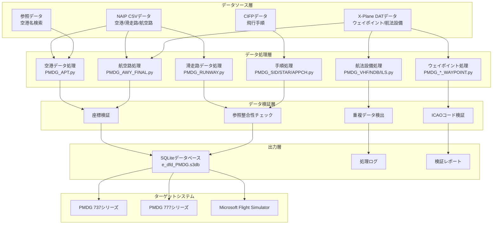
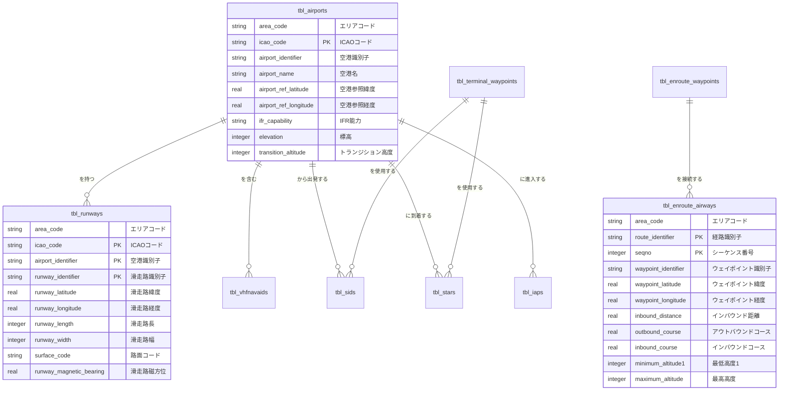
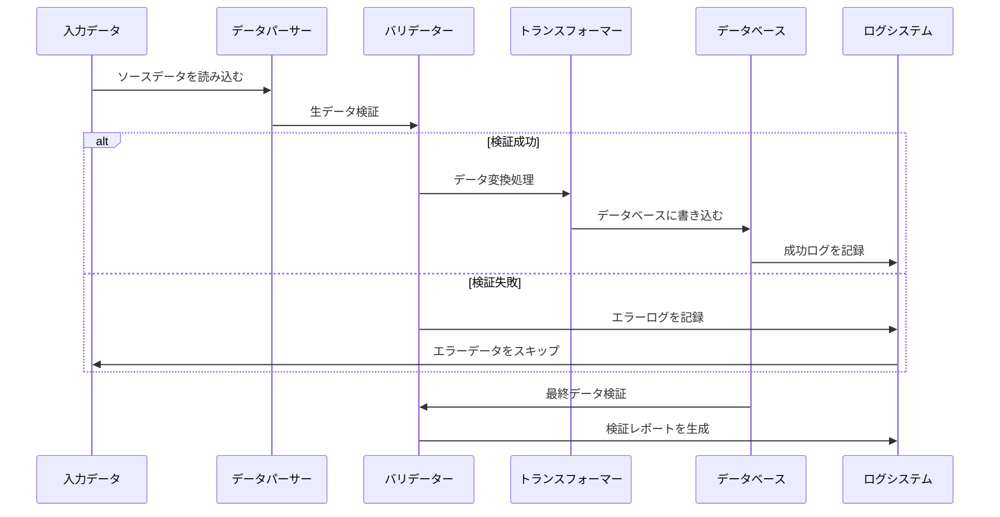

# 🏗️ 技術アーキテクチャ

本ドキュメントでは、Nav-dataのシステムアーキテクチャ、設計原則、および技術的な実装詳細を詳細に解説し、開発者および技術ユーザーに包括的な技術リファレンスを提供します。

## 📐 システムアーキテクチャの概要

### 全体アーキテクチャ図



### コアコンポーネントの説明

| コンポーネント | 機能 | 技術スタック | 主要機能 |
|------|------|--------|----------|
| **データパーサー** | マルチフォーマットデータ読み取り | pandas, chardet | 自動エンコーディング検出、フォールトトレランス処理 |
| **座標変換器** | 地理座標処理 | カスタムアルゴリズム | DMS↔Decimal変換、精度制御 |
| **磁気偏角計算器** | 磁気偏角計算 | pygeomag | WMM2025モデル、高精度計算 |
| **データベースエンジン** | SQLiteデータベース | sqlite3 | PMDG互換モード、トランザクション処理 |
| **検証エンジン** | データ品質保証 | カスタムバリデーター | 多層検証、詳細レポート |
| **並行プロセッサ** | パフォーマンス最適化 | ThreadPoolExecutor | マルチスレッド処理、進捗監視 |

## 🧩 モジュールアーキテクチャ設計

### 1. データ処理モジュール

#### 空港データ処理 (`PMDG_APT.py`)

```python
class AirportProcessor:
    """空港データプロセッサ"""
    
    def __init__(self):
        self.csv_parser = CSVParser(encoding='latin1')
        self.coordinate_converter = CoordinateConverter()
        self.database_writer = DatabaseWriter()
    
    def process(self) -> ProcessResult:
        """メイン処理フロー"""
        # 1. NAIP空港データを読み込む
        airports_data = self.csv_parser.read_csv(self.csv_file_path)
        
        # 2. 空港名ルックアップテーブルを読み込む
        name_lookup = self.load_airport_names()
        
        # 3. データ処理と変換
        processed_data = []
        for airport in airports_data:
            # 座標変換: DMS -> Decimal
            lat, lon = self.coordinate_converter.dms_to_decimal(
                airport['GEO_LAT_ACCURACY'],
                airport['GEO_LONG_ACCURACY']
            )
            
            # データ検証とクリーンアップ
            if self.validate_airport_data(airport, lat, lon):
                processed_data.append({
                    'icao_code': airport['CODE_ID'][:2],
                    'airport_identifier': airport['CODE_ID'],
                    'airport_name': name_lookup.get(airport['CODE_ID'], 'UNKNOWN'),
                    'latitude': lat,
                    'longitude': lon,
                    # ... その他のフィールド
                })
        
        # 4. データベースに書き込む
        return self.database_writer.write_airports(processed_data)
```

#### 航空路データ処理 (`PMDG_AWY_FINAL.py`)

これは最も複雑なモジュールであり、賢い航空路マージアルゴリズムを含んでいます。

```python
class AirwayProcessor:
    """航空路データプロセッサ - 賢いマージをサポート"""
    
    def process_airways(self):
        """航空路処理メインフロー"""
        # 1. CSV航空路セグメントデータを読み込む
        route_segments = self.read_route_segments()
        
        # 2. ウェイポイント座標をマッチング
        for segment in route_segments:
            icao_code, lat, lon = self.match_waypoint_coordinates(
                segment['waypoint_identifier'],
                segment['code_type']
            )
            segment.update({'lat': lat, 'lon': lon, 'icao': icao_code})
        
        # 3. 賢い航空路マージ
        for route_id in self.get_unique_routes():
            existing_route = self.get_existing_route(route_id)
            new_segments = self.get_route_segments(route_id)
            
            merged_route = self.intelligent_merge(existing_route, new_segments)
            
            # 4. 航空路セグメントの距離と方位を再計算
            self.recalculate_route_geometry(merged_route)
            
            # 5. データベースを更新
            self.update_route_in_database(route_id, merged_route)
    
    def intelligent_merge(self, existing, new_segments):
        """賢い航空路マージアルゴリズム"""
        if not existing:
            return new_segments
        
        # 共通ウェイポイントを見つける
        common_points = self.find_common_waypoints(existing, new_segments)
        
        if not common_points:
            # 共通点なし - 直接追加
            return self.append_segments(existing, new_segments)
        else:
            # 共通点あり - 賢い挿入
            return self.insert_missing_segments(existing, new_segments, common_points)
```

### 2. データ検証アーキテクチャ

#### 多層検証システム

```python
class ValidationEngine:
    """データ検証エンジン"""
    
    def __init__(self):
        self.validators = [
            CoordinateValidator(),
            ICAOCodeValidator(),
            ReferenceIntegrityValidator(),
            DuplicateDetector(),
            BusinessRuleValidator()
        ]
    
    def validate(self, data: dict) -> ValidationResult:
        """多層検証を実行する"""
        result = ValidationResult()
        
        for validator in self.validators:
            validator_result = validator.validate(data)
            result.merge(validator_result)
            
            # 重大なエラーが発生した場合、検証を停止
            if validator_result.has_critical_errors():
                break
        
        return result

class CoordinateValidator:
    """座標検証器"""
    
    # 中国地域座標の境界
    CHINA_BOUNDS = {
        'lat_min': 15.0, 'lat_max': 55.0,
        'lon_min': 70.0, 'lon_max': 140.0
    }
    
    def validate(self, data: dict) -> ValidationResult:
        lat, lon = data.get('latitude'), data.get('longitude')
        
        if not self.is_valid_coordinate(lat, lon):
            return ValidationResult.error(f"座標が中国地域の範囲外です: {lat}, {lon}")
        
        return ValidationResult.success()
```

### 3. 並行処理アーキテクチャ

#### マルチスレッド処理設計

```python
class ConcurrentProcessor:
    """並行プロセッサ"""
    
    def __init__(self, max_workers=50):
        self.max_workers = min(max_workers, multiprocessing.cpu_count() * 2)
        self.progress_tracker = ProgressTracker()
    
    def process_in_parallel(self, tasks: List[Task]) -> List[Result]:
        """タスクを並行処理する"""
        results = []
        
        with ThreadPoolExecutor(max_workers=self.max_workers) as executor:
            # すべてのタスクを投入
            future_to_task = {
                executor.submit(self.process_task, task): task 
                for task in tasks
            }
            
            # 結果を収集し、進捗を更新
            for future in as_completed(future_to_task):
                task = future_to_task[future]
                try:
                    result = future.result()
                    results.append(result)
                    self.progress_tracker.update()
                except Exception as e:
                    logging.error(f"タスク {task.id} に失敗しました: {e}")
        
        return results
```

## 🗄️ データベース設計

### ER図



### テーブル構造の詳細

#### コアテーブル設計原則

1.  **PMDG互換性**: PMDGデータベースのテーブル構造とフィールド命名に厳密に従う
2.  **ICAO標準**: 国際民間航空機関のデータ標準をサポート
3.  **パフォーマンス最適化**: 適切なインデックス設計とデータ型選択
4.  **データ整合性**: 外部キー制約とビジネスルール検証

#### 主要なテーブル構造

```sql
-- 空港テーブル
CREATE TABLE tbl_airports (
    area_code TEXT DEFAULT 'EEU',
    icao_code TEXT NOT NULL,
    airport_identifier TEXT PRIMARY KEY,
    airport_name TEXT,
    airport_ref_latitude REAL,
    airport_ref_longitude REAL,
    ifr_capability TEXT DEFAULT 'Y',
    longest_runway_surface_code TEXT,
    elevation INTEGER,
    transition_altitude INTEGER DEFAULT 18000,
    transition_level INTEGER,
    speed_limit INTEGER,
    speed_limit_altitude INTEGER,
    iata_ata_designator TEXT,
    id TEXT UNIQUE
);

-- 航空路テーブル
CREATE TABLE tbl_enroute_airways (
    area_code TEXT DEFAULT 'EEU',
    crusing_table_identifier TEXT DEFAULT 'EE',
    route_identifier TEXT NOT NULL,
    seqno INTEGER NOT NULL,
    icao_code TEXT,
    waypoint_identifier TEXT,
    waypoint_latitude REAL,
    waypoint_longitude REAL,
    waypoint_description_code TEXT,
    route_type TEXT DEFAULT 'O',
    inbound_course REAL DEFAULT 0.0,
    inbound_distance REAL DEFAULT 0.0,
    outbound_course REAL DEFAULT 0.0,
    minimum_altitude1 INTEGER DEFAULT 5000,
    minimum_altitude2 INTEGER,
    maximum_altitude INTEGER DEFAULT 99999,
    direction_restriction TEXT,
    flightlevel TEXT DEFAULT 'B',
    id TEXT,
    PRIMARY KEY (route_identifier, seqno)
);
```

## 🔄 データ処理フロー

### 処理パイプライン



### エラー処理戦略

```python
class ErrorHandler:
    """エラー処理戦略"""
    
    ERROR_STRATEGIES = {
        'missing_data': 'log_and_skip',
        'invalid_coordinates': 'log_and_skip', 
        'duplicate_records': 'log_and_merge',
        'reference_not_found': 'log_and_continue',
        'critical_error': 'stop_processing'
    }
    
    共通点なし - 直接追加
    
    def handle_error(self, error_type: str, error_data: dict):
        strategy = self.ERROR_STRATEGIES.get(error_type, 'log_and_continue')
        
        if strategy == 'log_and_skip':
            self.log_error(error_data)
            return ProcessingAction.SKIP
        elif strategy == 'stop_processing':
            self.log_critical_error(error_data)
            raise ProcessingException(error_data)
        # ... その他の戦略
```

## 🎯 パフォーマンス最適化設計

### メモリ管理

```python
class MemoryManager:
    """メモリマネージャー"""
    
    def __init__(self, max_memory_mb=2048):
        self.max_memory = max_memory_mb * 1024 * 1024
        self.current_usage = 0
    
    def process_in_batches(self, data_source, batch_size=1000):
        """大規模データをバッチ処理する"""
        batch = []
        
        for item in data_source:
            batch.append(item)
            self.current_usage += sys.getsizeof(item)
            
            if len(batch) >= batch_size or self.memory_threshold_reached():
                yield batch
                batch = []
                self.gc_collect()  # 強制ガベージコレクション
    
    def memory_threshold_reached(self) -> bool:
        return self.current_usage > self.max_memory * 0.8
```

### データベース最適化

```python
class DatabaseOptimizer:
    """データベース性能最適化"""
    
    PRAGMA_SETTINGS = {
        'journal_mode': 'DELETE',     # PMDG互換モード
        'synchronous': 'FULL',        # データ安全優先
        'cache_size': 10000,          # 大容量キャッシュで性能向上
        'temp_store': 'MEMORY',       # 一時データをメモリに保存
        'mmap_size': 268435456        # 256MBメモリマップ
    }
    
    def optimize_database(self, connection):
        """性能最適化設定を適用する"""
        for pragma, value in self.PRAGMA_SETTINGS.items():
            connection.execute(f"PRAGMA {pragma} = {value}")
        
        # 主要なインデックスを作成
        self.create_performance_indexes(connection)
    
    def create_performance_indexes(self, connection):
        """性能最適化インデックスを作成する"""
        indexes = [
            "CREATE INDEX IF NOT EXISTS idx_airports_icao ON tbl_airports(icao_code)",
            "CREATE INDEX IF NOT EXISTS idx_airways_route ON tbl_enroute_airways(route_identifier)",
            "CREATE INDEX IF NOT EXISTS idx_waypoints_id ON tbl_enroute_waypoints(waypoint_identifier)",
        ]
        
        for index_sql in indexes:
            connection.execute(index_sql)
```

## 🔍 品質保証体制

### データ検証フレームワーク

```python
class QualityAssurance:
    """品質保証フレームワーク"""
    
    def __init__(self):
        self.validation_rules = self.load_validation_rules()
        self.test_cases = self.load_test_cases()
    
    def comprehensive_validation(self, database_path: str) -> QAReport:
        """包括的な品質チェック"""
        report = QAReport()
        
        # 1. スキーマ検証
        report.add_section(self.validate_schema(database_path))
        
        # 2. データ整合性検証
        report.add_section(self.validate_integrity(database_path))
        
        # 3. ビジネスルール検証
        report.add_section(self.validate_business_rules(database_path))
        
        # 4. パフォーマンスベンチマークテスト
        report.add_section(self.performance_benchmark(database_path))
        
        # 5. PMDG互換性テスト
        report.add_section(self.pmdg_compatibility_test(database_path))
        
        return report
    
    def validate_business_rules(self, database_path: str) -> ValidationSection:
        """ビジネスルール検証"""
        rules = [
            "航空路は有効なウェイポイントに接続されている必要があります",
            "空港は少なくとも1本の滑走路を持っている必要があります",
            "ILS周波数は有効な範囲内である必要があります",
            "航空路高度制限は合理的である必要があります",
            "座標は中国地域内である必要があります"
        ]
        
        results = []
        for rule in rules:
            result = self.check_business_rule(database_path, rule)
            results.append(result)
        
        return ValidationSection("ビジネスルール検証", results)
```

## 🔧 拡張性設計

### プラグインアーキテクチャ

```python
class PluginManager:
    """プラグインマネージャー"""
    
    def __init__(self):
        self.processors = {}
        self.validators = {}
        self.exporters = {}
    
    def register_processor(self, name: str, processor_class):
        """データプロセッサプラグインを登録する"""
        self.processors[name] = processor_class
    
    def register_validator(self, name: str, validator_class):
        """バリデータープラグインを登録する"""
        self.validators[name] = validator_class
    
    def load_plugins(self, plugin_directory: str):
        """プラグインを動的にロードする"""
        for plugin_file in glob.glob(f"{plugin_directory}/*.py"):
            plugin_module = importlib.import_module(plugin_file)
            if hasattr(plugin_module, 'register'):
                plugin_module.register(self)

# プラグインの例
class CustomAirportProcessor(BaseProcessor):
    """カスタム空港プロセッサプラグイン"""
    
    def process(self, data):
        # カスタム処理ロジック
        return super().process(data)

def register(plugin_manager):
    """プラグイン登録関数"""
    plugin_manager.register_processor('custom_airport', CustomAirportProcessor)
```

### 設定管理

```python
class ConfigurationManager:
    """設定マネージャー"""
    
    def __init__(self, config_path: str = "config/settings.yaml"):
        self.config = self.load_config(config_path)
        self.validators = self.load_config_validators()
    
    def load_config(self, path: str) -> dict:
        """設定ファイルをロードする"""
        with open(path, 'r', encoding='utf-8') as f:
            return yaml.safe_load(f)
    
    def validate_config(self) -> bool:
        """設定の有効性を検証する"""
        for validator in self.validators:
            if not validator.validate(self.config):
                return False
        return True
    
    def get_nested_value(self, key_path: str, default=None):
        """ネストされた設定値を取得する"""
        keys = key_path.split('.')
        value = self.config
        
        for key in keys:
            if isinstance(value, dict) and key in value:
                value = value[key]
            else:
                return default
        
        return value

# 設定ファイル例 (settings.yaml)
"""
data_sources:
  naip:
    directory: "data/input/naip"
    encoding: "latin1"
  xplane:
    directory: "data/input/xplane"
    encoding: "utf-8"

processing:
  batch_size: 1000
  max_workers: 50
  memory_limit_mb: 2048

database:
  path: "data/output/e_dfd_PMDG.s3db"
  pragmas:
    journal_mode: "DELETE"
    synchronous: "FULL"

validation:
  coordinate_bounds:
    china:
      lat_min: 15.0
      lat_max: 55.0
      lon_min: 70.0
      lon_max: 140.0
"""
```

## 📊 監視とログ

### 構造化ログシステム

```python
class StructuredLogger:
    """構造化ログシステム"""
    
    def __init__(self, name: str):
        self.logger = logging.getLogger(name)
        self.setup_handlers()
    
    def setup_handlers(self):
        """ログハンドラを設定する"""
        # コンソールハンドラ
        console_handler = logging.StreamHandler()
        console_handler.setFormatter(ColoredFormatter())
        
        # ファイルハンドラ
        file_handler = RotatingFileHandler(
            f"logs/{self.logger.name}.log",
            maxBytes=10*1024*1024,
            backupCount=5
        )
        file_handler.setFormatter(JSONFormatter())
        
        self.logger.addHandler(console_handler)
        self.logger.addHandler(file_handler)
    
    def log_processing_start(self, module: str, input_size: int):
        """処理開始を記録する"""
        self.logger.info("Processing started", extra={
            'module': module,
            'input_size': input_size,
            'timestamp': datetime.utcnow().isoformat(),
            'event_type': 'processing_start'
        })
    
    def log_processing_complete(self, module: str, output_size: int, duration: float):
        """処理完了を記録する"""
        self.logger.info("Processing completed", extra={
            'module': module,
            'output_size': output_size,
            'duration_seconds': duration,
            'records_per_second': output_size / duration if duration > 0 else 0,
            'timestamp': datetime.utcnow().isoformat(),
            'event_type': 'processing_complete'
        })
```

## 🔒 セキュリティ設計

### データセキュリティ

```python
class SecurityManager:
    """セキュリティマネージャー"""
    
    def __init__(self):
        self.input_sanitizer = InputSanitizer()
        self.path_validator = PathValidator()
    
    def validate_input_path(self, path: str) -> bool:
        """入力パスのセキュリティを検証する"""
        # パス横断攻撃を防止
        normalized_path = os.path.normpath(path)
        if '..' in normalized_path:
            raise SecurityException("パスに不正な文字が含まれています")
        
        # パスが許可されたディレクトリ内にあることを確認
        allowed_dirs = ['data/input', 'config']
        if not any(normalized_path.startswith(allowed) for allowed in allowed_dirs):
            raise SecurityException("パスが許可されたディレクトリ内にありません")
        
        return True
    
    def sanitize_sql_input(self, value: str) -> str:
        """SQL入力のサニタイズ"""
        if not isinstance(value, str):
            return value
        
        # 潜在的なSQLインジェクション文字を削除
        dangerous_chars = ["'", '"', ';', '--', '/*', '*/']
        for char in dangerous_chars:
            value = value.replace(char, '')
        
        return value
```

---

この技術アーキテクチャドキュメントは、Nav-dataプロジェクトに包括的な技術的視点を提供し、システム設計、データフロー、パフォーマンス最適化、品質保証、セキュリティなど、あらゆる側面を網羅しています。開発者はこのアーキテクチャに基づいて二次開発および機能拡張を行うことができます。