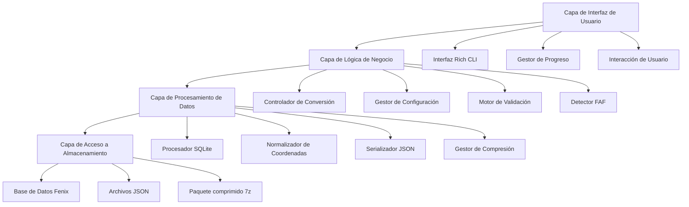
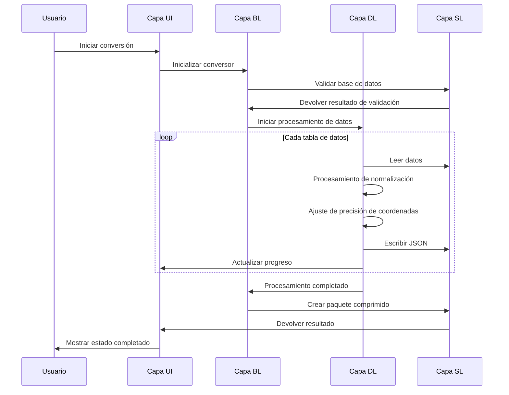

# 🏗️ Arquitectura del Convertidor de Datos de Navegación TFDI

## Sistema General

El Convertidor de Datos de Navegación TFDI es una herramienta profesional de conversión de datos de navegación aérea, diseñada específicamente para convertir la base de datos de navegación del Fenix A320 al formato JSON compatible con el TFDI MD-11. Esta herramienta adopta un diseño de arquitectura moderna, proporcionando servicios de conversión de datos eficientes y fiables.

## 🎯 Principios de Diseño

### 1. Prioridad a la Integridad de los Datos
- **Validación estricta**: Múltiples mecanismos de validación de datos
- **Mantenimiento de relaciones**: Preservación de las relaciones de dependencia entre los datos de navegación
- **Garantía de precisión**: Mantenimiento de alta precisión en coordenadas y cálculos
- **Comprobación de coherencia**: Aseguramiento de la coherencia lógica de los datos después de la conversión

### 2. Orientado a la Optimización del Rendimiento
- **Optimización de SQLite**: Modo WAL y ajuste de rendimiento
- **Procesamiento por lotes**: Estrategias de procesamiento por lotes eficientes en memoria
- **Mecanismo de caché**: Caché y reutilización inteligente de datos
- **Optimización de compresión**: Compresión y limpieza rápidas con 7z

### 3. Experiencia de Usuario Superior
- **Rich CLI**: Interfaz de terminal moderna y colorida
- **Retroalimentación en tiempo real**: Visualización detallada del progreso y actualizaciones de estado
- **Mensajes amigables**: Manejo profesional de errores y sugerencias de recuperación
- **Diseño interactivo**: Guía intuitiva del flujo de operación

## 🏗️ Arquitectura del Sistema

### Diagrama de Arquitectura General



### Detalles de los Componentes Clave

#### 1. Capa de Interfaz de Usuario (UI Layer)
**Responsabilidad**: Proporcionar la interfaz de interacción y retroalimentación del usuario
```python
class RichInterface:
    """Gestor de Interfaz Rich CLI"""
    - progress_tracking: Gestión de barras de progreso
    - status_display: Visualización de información de estado
    - error_presentation: Presentación de mensajes de error
    - user_input: Procesamiento de entrada de usuario
```

#### 2. Capa de Lógica de Negocio (Business Layer)
**Responsabilidad**: Lógica de negocio central y control de flujo
```python
class FenixToTFDIConverter:
    """Clase del conversor principal"""
    - database_validation: Validación de base de datos
    - conversion_orchestration: Orquestación del proceso de conversión
    - faf_detection: Detección de puntos FAF
    - data_normalization: Normalización de datos
```

#### 3. Capa de Procesamiento de Datos (Data Layer)
**Responsabilidad**: Algoritmos de conversión y procesamiento de datos
```python
class DataProcessor:
    """Núcleo de procesamiento de datos"""
    - coordinate_precision: Gestión de precisión de coordenadas
    - column_standardization: Normalización de nombres de columna
    - relationship_mapping: Mapeo de relaciones
    - format_conversion: Conversión de formato
```

#### 4. Capa de Acceso a Almacenamiento (Storage Layer)
**Responsabilidad**: Acceso a base de datos y operaciones de archivo
```python
class StorageManager:
    """Gestor de almacenamiento"""
    - sqlite_optimization: Optimización de rendimiento de SQLite
    - file_operations: Operaciones de lectura/escritura de archivos
    - compression_handling: Manejo de archivos comprimidos
    - backup_management: Gestión de copias de seguridad
```

## 📊 Arquitectura del Flujo de Datos

### Pipeline de Conversión



### Arquitectura de Mapeo de Datos


## 🔧 Pila Tecnológica

### Tecnologías Clave

| Componente | Selección de Tecnología | Requisitos de Versión | Propósito |
|------------|-------------------------|-----------------------|-----------|
| **Python** | Python 3.8+             | ≥ 3.8.0               | Lenguaje de programación principal |
| **Rich**   | Rich Library            | ≥ 12.0.0              | Embellecimiento de interfaz CLI |
| **SQLite3**| Módulo integrado        | Integrado en Python   | Acceso a base de datos |
| **Pandas** | DataFrame               | ≥ 1.3.0               | Procesamiento de datos |
| **JSON**   | Módulo integrado        | Integrado en Python   | Serialización de datos |
| **py7zr**  | 7-Zip Python            | ≥ 0.18.0              | Manejo de compresión |

### Características de la Arquitectura

#### 1. Diseño Modular
```python
fenix_to_tfdi/
├── core/                  # Módulo central
│   ├── converter.py       # Conversor principal
│   ├── validator.py       # Validador de datos
│   └── config.py         # Gestión de configuración
├── data/                  # Procesamiento de datos
│   ├── processor.py       # Procesador de datos
│   ├── normalizer.py      # Herramienta de normalización
│   └── serializer.py     # Herramienta de serialización
├── ui/                    # Interfaz de usuario
│   ├── cli.py            # Interfaz de línea de comandos
│   └── progress.py       # Gestión de progreso
└── utils/                 # Módulo de utilidades
    ├── storage.py        # Utilidades de almacenamiento
    └── compression.py    # Utilidades de compresión
```

#### 2. Arquitectura Orientada a la Configuración
```python
@dataclass
class ConverterConfig:
    """Clase de configuración del conversor"""
    output_dir: str = "Primary"
    procedure_legs_dir: str = "Primary/ProcedureLegs"
    archive_name: str = "Primary.7z"
    coordinate_precision: int = 8
    vnav_threshold: float = 2.5
    
    # Configuración de optimización de SQLite
    sqlite_pragmas: Dict[str, str] = field(default_factory=lambda: {
        "journal_mode": "WAL",
        "synchronous": "NORMAL",
        "cache_size": "10000",
        "temp_store": "MEMORY"
    })
```

## 🚀 Arquitectura de Rendimiento

### Estrategia de Gestión de Memoria

#### 1. Procesamiento por Flujo
```python
def process_large_table(table_name: str, batch_size: int = 1000):
    """Procesamiento por flujo de tablas grandes"""
    offset = 0
    while True:
        query = f"""
        SELECT * FROM {table_name} 
        LIMIT {batch_size} OFFSET {offset}
        """
        
        batch = execute_query(query)
        if not batch:
            break
            
        process_batch(batch)
        offset += batch_size
```

#### 2. Optimización de Caché
```python
class WaypointCache:
    """Gestión de caché de puntos de ruta"""
    def __init__(self, max_size: int = 10000):
        self._cache: Dict[str, WaypointData] = {}
        self._max_size = max_size
        self._access_times: Dict[str, float] = {}
    
    def get_waypoint(self, waypoint_id: str) -> Optional[WaypointData]:
        """Obtener datos de punto de ruta en caché"""
        if waypoint_id in self._cache:
            self._access_times[waypoint_id] = time.time()
            return self._cache[waypoint_id]
        return None
```

### Arquitectura de Procesamiento Concurrente

#### 1. Diseño Multihilo
```python
class ConcurrentProcessor:
    """Procesador concurrente"""
    def __init__(self, max_workers: int = 4):
        self.max_workers = max_workers
        self.executor = ThreadPoolExecutor(max_workers=max_workers)
    
    def process_tables_parallel(self, tables: List[str]):
        """Procesar múltiples tablas en paralelo"""
        futures = []
        for table in tables:
            future = self.executor.submit(self.process_table, table)
            futures.append(future)
        
        # Esperar a que todas las tareas se completen
        concurrent.futures.wait(futures)
```

#### 2. Gestión de Pool de Recursos
```python
class DatabaseConnectionPool:
    """Pool de conexiones de base de datos"""
    def __init__(self, db_path: str, pool_size: int = 5):
        self.db_path = db_path
        self.pool_size = pool_size
        self.connections: Queue = Queue(maxsize=pool_size)
        self._init_pool()
    
    def get_connection(self) -> sqlite3.Connection:
        """Obtener conexión a la base de datos"""
        return self.connections.get()
    
    def return_connection(self, conn: sqlite3.Connection):
        """Devolver conexión a la base de datos"""
        self.connections.put(conn)
```

## 🔒 Arquitectura de Seguridad

### Mecanismos de Protección de Datos

#### 1. Validación de Entrada
```python
class InputValidator:
    """Validador de entrada"""
    
    @staticmethod
    def validate_database_path(path: str) -> bool:
        """Validar seguridad de la ruta de la base de datos"""
        # Comprobar ataques de path traversal
        if ".." in path or path.startswith("/"):
            return False
        
        # Validar extensión de archivo
        if not path.endswith(('.db', '.db3', '.sqlite')):
            return False
        
        return True
    
    @staticmethod  
    def validate_terminal_id(terminal_id: int) -> bool:
        """Validar rango de ID de terminal"""
        return 1 <= terminal_id <= 999999
```

#### 2. Aislamiento de Errores
```python
class SafeConverter:
    """Conversor seguro"""
    
    def safe_convert_table(self, table_name: str) -> bool:
        """Conversión de tabla segura"""
        try:
            with self.create_transaction() as transaction:
                result = self.convert_table(table_name)
                transaction.commit()
                return result
        except DatabaseError as e:
            self.logger.error(f"Error de base de datos: {e}")
            transaction.rollback()
            return False
        except Exception as e:
            self.logger.error(f"Error desconocido: {e}")
            return False
```

## 📈 Arquitectura Escalable

### Diseño del Sistema de Plugins

#### 1. Interfaz de Plugin de Conversor
```python
class ConverterPlugin(ABC):
    """Clase base abstracta para plugins de conversor"""
    
    @abstractmethod
    def get_name(self) -> str:
        """Obtener nombre del plugin"""
        pass
    
    @abstractmethod
    def get_supported_formats(self) -> List[str]:
        """Obtener formatos soportados"""
        pass
    
    @abstractmethod
    def convert_data(self, data: Any, config: ConverterConfig) -> Any:
        """Convertir datos"""
        pass
```

#### 2. Mecanismo de Extensión de Formatos
```python
class FormatRegistry:
    """Registro de formatos"""
    
    def __init__(self):
        self._converters: Dict[str, ConverterPlugin] = {}
    
    def register_converter(self, format_name: str, converter: ConverterPlugin):
        """Registrar conversor"""
        self._converters[format_name] = converter
    
    def get_converter(self, format_name: str) -> Optional[ConverterPlugin]:
        """Obtener conversor"""
        return self._converters.get(format_name)
```

### Extensión de Fuentes de Datos

#### 1. Abstracción de Fuente de Datos
```python
class DataSource(ABC):
    """Clase base abstracta de fuente de datos"""
    
    @abstractmethod
    def connect(self) -> bool:
        """Conectar a la fuente de datos"""
        pass
    
    @abstractmethod
    def get_tables(self) -> List[str]:
        """Obtener lista de tablas"""
        pass
    
    @abstractmethod
    def query_data(self, query: str) -> Iterator[Dict]:
        """Consultar datos"""
        pass
```

## 🔄 Arquitectura de Mantenibilidad

### Sistema de Registro de Eventos

#### 1. Registro Estructurado
```python
class StructuredLogger:
    """Registrador estructurado"""
    
    def __init__(self, name: str):
        self.logger = logging.getLogger(name)
        self.logger.setLevel(logging.INFO)
        
        # Manejador de formato Rich
        rich_handler = RichHandler(rich_tracebacks=True)
        rich_handler.setFormatter(
            logging.Formatter(
                "%(asctime)s - %(name)s - %(levelname)s - %(message)s"
            )
        )
        self.logger.addHandler(rich_handler)
    
    def log_conversion_start(self, table_name: str, record_count: int):
        """Registrar inicio de conversión"""
        self.logger.info(
            f"Comenzando la conversión de la tabla {table_name}",
            extra={
                "table": table_name,
                "record_count": record_count,
                "operation": "conversion_start"
            }
        )
```

#### 2. Monitoreo del Rendimiento
```python
class PerformanceMonitor:
    """Monitor de rendimiento"""
    
    def __init__(self):
        self.metrics: Dict[str, List[float]] = defaultdict(list)
    
    @contextmanager
    def measure_time(self, operation: str):
        """Medir tiempo de operación"""
        start_time = time.time()
        try:
            yield
        finally:
            elapsed = time.time() - start_time
            self.metrics[operation].append(elapsed)
            self.logger.debug(f"Duración de {operation}: {elapsed:.2f}s")
```

## 📊 Arquitectura de Pruebas

### Estrategia de Pruebas

#### 1. Pruebas por Capas
```python
# Pruebas unitarias
class TestDataProcessor(unittest.TestCase):
    def test_coordinate_normalization(self):
        """Probar normalización de coordenadas"""
        processor = DataProcessor()
        result = processor.normalize_coordinate(39.916667, 8)
        self.assertEqual(result, 39.91666700)

# Pruebas de integración  
class TestConverterIntegration(unittest.TestCase):
    def test_full_conversion_pipeline(self):
        """Probar pipeline de conversión completo"""
        converter = FenixToTFDIConverter(test_config)
        result = converter.convert(test_database_path)
        self.assertTrue(result)

# Pruebas de rendimiento
class TestPerformance(unittest.TestCase):
    def test_large_database_conversion(self):
        """Probar rendimiento de conversión de base de datos grande"""
        start_time = time.time()
        converter.convert(large_test_database)
        elapsed = time.time() - start_time
        self.assertLess(elapsed, 300)  # Debe completarse en 5 minutos
```

---

Este diseño arquitectónico asegura la **fiabilidad**, el **rendimiento** y la **mantenibilidad** del Convertidor de Datos de Navegación TFDI, proporcionando una solución de conversión de datos de nivel profesional para la comunidad de simulación de vuelo del TFDI MD-11. 🚁✨