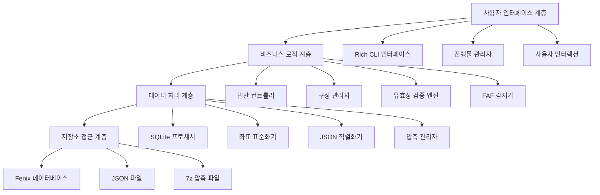
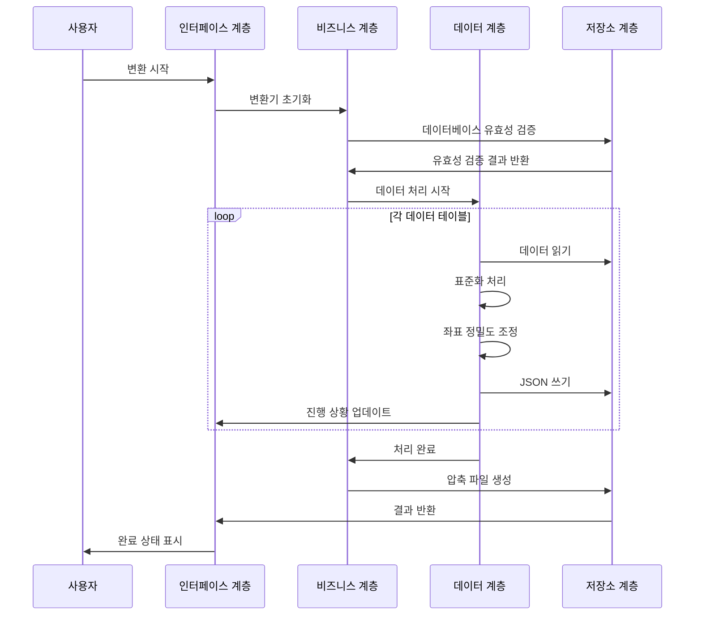

# 🏗️ TFDI 항법 데이터 변환기 아키텍처

## 시스템 개요

TFDI 항법 데이터 변환기는 Fenix A320 항법 데이터베이스를 TFDI MD-11 호환 JSON 형식으로 변환하도록 특별히 설계된 전문적인 항공 항법 데이터 변환 도구입니다. 이 도구는 현대적인 아키텍처 설계를 채택하여 효율적이고 신뢰할 수 있는 데이터 변환 서비스를 제공합니다.

## 🎯 설계 원칙

### 1. 데이터 무결성 우선
- **엄격한 유효성 검증**: 다층 데이터 유효성 검증 메커니즘
- **관계 유지**: 항법 데이터 간의 종속 관계 유지
- **정밀도 보장**: 좌표 및 계산의 높은 정밀도 유지
- **일관성 검사**: 변환된 데이터의 논리적 일관성 확보

### 2. 성능 최적화 지향
- **SQLite 최적화**: WAL 모드 및 성능 튜닝
- **배치 처리**: 메모리 효율적인 배치 처리 전략
- **캐싱 메커니즘**: 지능형 데이터 캐싱 및 재사용
- **압축 최적화**: 빠른 7z 압축 및 정리

### 3. 사용자 경험 최우선
- **Rich CLI**: 현대적인 컬러 터미널 인터페이스
- **실시간 피드백**: 상세한 진행 상황 표시 및 상태 업데이트
- **친화적 안내**: 전문적인 오류 처리 및 복구 제안
- **인터랙티브 디자인**: 직관적인 작업 흐름 안내

## 🏗️ 시스템 아키텍처

### 전체 아키텍처 다이어그램



### 핵심 구성 요소 상세 설명

#### 1. 사용자 인터페이스 계층 (UI Layer)
**역할**: 사용자 인터랙션 인터페이스 및 피드백 제공
```python
class RichInterface:
    """Rich CLI 인터페이스 관리자"""
    - progress_tracking: 진행률 표시줄 관리
    - status_display: 상태 정보 표시
    - error_presentation: 오류 정보 표시
    - user_input: 사용자 입력 처리
```

#### 2. 비즈니스 로직 계층 (Business Layer)
**역할**: 핵심 비즈니스 로직 및 프로세스 제어
```python
class FenixToTFDIConverter:
    """주 변환기 클래스"""
    - database_validation: 데이터베이스 유효성 검증
    - conversion_orchestration: 변환 프로세스 오케스트레이션
    - faf_detection: FAF 지점 감지
    - data_normalization: 데이터 표준화
```

#### 3. 데이터 처리 계층 (Data Layer)
**역할**: 데이터 변환 및 처리 알고리즘
```python
class DataProcessor:
    """데이터 처리 핵심"""
    - coordinate_precision: 좌표 정밀도 처리
    - column_standardization: 열 이름 표준화
    - relationship_mapping: 관계 매핑
    - format_conversion: 형식 변환
```

#### 4. 저장소 접근 계층 (Storage Layer)
**역할**: 데이터베이스 접근 및 파일 작업
```python
class StorageManager:
    """저장소 관리자"""
    - sqlite_optimization: SQLite 성능 최적화
    - file_operations: 파일 읽기/쓰기 작업
    - compression_handling: 압축 파일 처리
    - backup_management: 백업 관리
```

## 📊 데이터 흐름 아키텍처

### 변환 파이프라인



### 데이터 매핑 아키텍처


## 🔧 기술 스택

### 핵심 기술

| 구성 요소 | 기술 선택 | 버전 요구 사항 | 용도 |
|------|----------|----------|------|
| **Python** | Python 3.8+ | ≥ 3.8.0 | 주요 프로그래밍 언어 |
| **Rich** | Rich Library | ≥ 12.0.0 | CLI 인터페이스 미화 |
| **SQLite3** | 내장 모듈 | Python 내장 | 데이터베이스 접근 |
| **Pandas** | DataFrame | ≥ 1.3.0 | 데이터 처리 |
| **JSON** | 내장 모듈 | Python 내장 | 데이터 직렬화 |
| **py7zr** | 7-Zip Python | ≥ 0.18.0 | 압축 처리 |

### 아키텍처 특징

#### 1. 모듈화 설계
```python
fenix_to_tfdi/
├── core/                  # 핵심 모듈
│   ├── converter.py       # 주 변환기
│   ├── validator.py       # 데이터 유효성 검사기
│   └── config.py         # 구성 관리
├── data/                  # 데이터 처리
│   ├── processor.py       # 데이터 처리기
│   ├── normalizer.py      # 표준화 도구
│   └── serializer.py     # 직렬화 도구
├── ui/                    # 사용자 인터페이스
│   ├── cli.py            # 명령줄 인터페이스
│   └── progress.py       # 진행 상황 관리
└── utils/                 # 유틸리티 모듈
    ├── storage.py        # 저장소 도구
    └── compression.py    # 압축 도구
```

#### 2. 구성 기반 아키텍처
```python
@dataclass
class ConverterConfig:
    """변환기 구성 클래스"""
    output_dir: str = "Primary"
    procedure_legs_dir: str = "Primary/ProcedureLegs"
    archive_name: str = "Primary.7z"
    coordinate_precision: int = 8
    vnav_threshold: float = 2.5
    
    # SQLite 최적화 구성
    sqlite_pragmas: Dict[str, str] = field(default_factory=lambda: {
        "journal_mode": "WAL",
        "synchronous": "NORMAL",
        "cache_size": "10000",
        "temp_store": "MEMORY"
    })
```

## 🚀 성능 아키텍처

### 메모리 관리 전략

#### 1. 스트리밍 처리
```python
def process_large_table(table_name: str, batch_size: int = 1000):
    """대용량 테이블 스트리밍 처리"""
    offset = 0
    while True:
        query = f"""
        SELECT * FROM {table_name} 
        LIMIT {batch_size} OFFSET {offset}
        """
        
        batch = execute_query(query)
        if not batch:
            break
            
        process_batch(batch)
        offset += batch_size
```

#### 2. 캐시 최적화
```python
class WaypointCache:
    """웨이포인트 캐시 관리"""
    def __init__(self, max_size: int = 10000):
        self._cache: Dict[str, WaypointData] = {}
        self._max_size = max_size
        self._access_times: Dict[str, float] = {}
    
    def get_waypoint(self, waypoint_id: str) -> Optional[WaypointData]:
        """캐시된 웨이포인트 데이터 가져오기"""
        if waypoint_id in self._cache:
            self._access_times[waypoint_id] = time.time()
            return self._cache[waypoint_id]
        return None
```

### 동시 처리 아키텍처

#### 1. 멀티스레드 설계
```python
class ConcurrentProcessor:
    """동시 처리기"""
    def __init__(self, max_workers: int = 4):
        self.max_workers = max_workers
        self.executor = ThreadPoolExecutor(max_workers=max_workers)
    
    def process_tables_parallel(self, tables: List[str]):
        """여러 테이블 병렬 처리"""
        futures = []
        for table in tables:
            future = self.executor.submit(self.process_table, table)
            futures.append(future)
        
        # 모든 작업 완료 대기
        concurrent.futures.wait(futures)
```

#### 2. 리소스 풀 관리
```python
class DatabaseConnectionPool:
    """데이터베이스 연결 풀"""
    def __init__(self, db_path: str, pool_size: int = 5):
        self.db_path = db_path
        self.pool_size = pool_size
        self.connections: Queue = Queue(maxsize=pool_size)
        self._init_pool()
    
    def get_connection(self) -> sqlite3.Connection:
        """데이터베이스 연결 가져오기"""
        return self.connections.get()
    
    def return_connection(self, conn: sqlite3.Connection):
        """데이터베이스 연결 반환"""
        self.connections.put(conn)
```

## 🔒 보안 아키텍처

### 데이터 보호 메커니즘

#### 1. 입력 유효성 검증
```python
class InputValidator:
    """입력 유효성 검사기"""
    
    @staticmethod
    def validate_database_path(path: str) -> bool:
        """데이터베이스 경로 보안 유효성 검증"""
        # 경로 탐색 공격 확인
        if ".." in path or path.startswith("/"):
            return False
        
        # 파일 확장자 유효성 검증
        if not path.endswith(('.db', '.db3', '.sqlite')):
            return False
        
        return True
    
    @staticmethod  
    def validate_terminal_id(terminal_id: int) -> bool:
        """터미널 ID 범위 유효성 검증"""
        return 1 <= terminal_id <= 999999
```

#### 2. 오류 격리
```python
class SafeConverter:
    """안전 변환기"""
    
    def safe_convert_table(self, table_name: str) -> bool:
        """안전한 테이블 변환"""
        try:
            with self.create_transaction() as transaction:
                result = self.convert_table(table_name)
                transaction.commit()
                return result
        except DatabaseError as e:
            self.logger.error(f"데이터베이스 오류: {e}")
            transaction.rollback()
            return False
        except Exception as e:
            self.logger.error(f"알 수 없는 오류: {e}")
            return False
```

## 📈 확장 가능한 아키텍처

### 플러그인 시스템 설계

#### 1. 변환기 플러그인 인터페이스
```python
class ConverterPlugin(ABC):
    """변환기 플러그인 추상 기본 클래스"""
    
    @abstractmethod
    def get_name(self) -> str:
        """플러그인 이름 가져오기"""
        pass
    
    @abstractmethod
    def get_supported_formats(self) -> List[str]:
        """지원되는 형식 가져오기"""
        pass
    
    @abstractmethod
    def convert_data(self, data: Any, config: ConverterConfig) -> Any:
        """데이터 변환"""
        pass
```

#### 2. 형식 확장 메커니즘
```python
class FormatRegistry:
    """형식 레지스트리"""
    
    def __init__(self):
        self._converters: Dict[str, ConverterPlugin] = {}
    
    def register_converter(self, format_name: str, converter: ConverterPlugin):
        """변환기 등록"""
        self._converters[format_name] = converter
    
    def get_converter(self, format_name: str) -> Optional[ConverterPlugin]:
        """변환기 가져오기"""
        return self._converters.get(format_name)
```

### 데이터 소스 확장

#### 1. 데이터 소스 추상화
```python
class DataSource(ABC):
    """데이터 소스 추상 기본 클래스"""
    
    @abstractmethod
    def connect(self) -> bool:
        """데이터 소스 연결"""
        pass
    
    @abstractmethod
    def get_tables(self) -> List[str]:
        """테이블 목록 가져오기"""
        pass
    
    @abstractmethod
    def query_data(self, query: str) -> Iterator[Dict]:
        """데이터 쿼리"""
        pass
```

## 🔄 유지 보수성 아키텍처

### 로깅 시스템

#### 1. 구조화된 로그
```python
class StructuredLogger:
    """구조화된 로거"""
    
    def __init__(self, name: str):
        self.logger = logging.getLogger(name)
        self.logger.setLevel(logging.INFO)
        
        # Rich 포매터 핸들러
        rich_handler = RichHandler(rich_tracebacks=True)
        rich_handler.setFormatter(
            logging.Formatter(
                "%(asctime)s - %(name)s - %(levelname)s - %(message)s"
            )
        )
        self.logger.addHandler(rich_handler)
    
    def log_conversion_start(self, table_name: str, record_count: int):
        """변환 시작 기록"""
        self.logger.info(
            f"테이블 {table_name} 변환 시작",
            extra={
                "table": table_name,
                "record_count": record_count,
                "operation": "conversion_start"
            }
        )
```

#### 2. 성능 모니터링
```python
class PerformanceMonitor:
    """성능 모니터"""
    
    def __init__(self):
        self.metrics: Dict[str, List[float]] = defaultdict(list)
    
    @contextmanager
    def measure_time(self, operation: str):
        """작업 소요 시간 측정"""
        start_time = time.time()
        try:
            yield
        finally:
            elapsed = time.time() - start_time
            self.metrics[operation].append(elapsed)
            self.logger.debug(f"{operation} 소요 시간: {elapsed:.2f}s")
```

## 📊 테스트 아키텍처

### 테스트 전략

#### 1. 계층별 테스트
```python
# 단위 테스트
class TestDataProcessor(unittest.TestCase):
    def test_coordinate_normalization(self):
        """좌표 표준화 테스트"""
        processor = DataProcessor()
        result = processor.normalize_coordinate(39.916667, 8)
        self.assertEqual(result, 39.91666700)

# 통합 테스트  
class TestConverterIntegration(unittest.TestCase):
    def test_full_conversion_pipeline(self):
        """전체 변환 파이프라인 테스트"""
        converter = FenixToTFDIConverter(test_config)
        result = converter.convert(test_database_path)
        self.assertTrue(result)

# 성능 테스트
class TestPerformance(unittest.TestCase):
    def test_large_database_conversion(self):
        """대규모 데이터베이스 변환 성능 테스트"""
        start_time = time.time()
        converter.convert(large_test_database)
        elapsed = time.time() - start_time
        self.assertLess(elapsed, 300)  # 5분 이내 완료되어야 함
```

---

이 아키텍처 설계는 TFDI 항법 데이터 변환기의 **신뢰성**, **성능** 및 **유지 보수성**을 보장하며, TFDI MD-11 비행 시뮬레이션 커뮤니티에 전문적인 데이터 변환 솔루션을 제공합니다. 🚁✨
