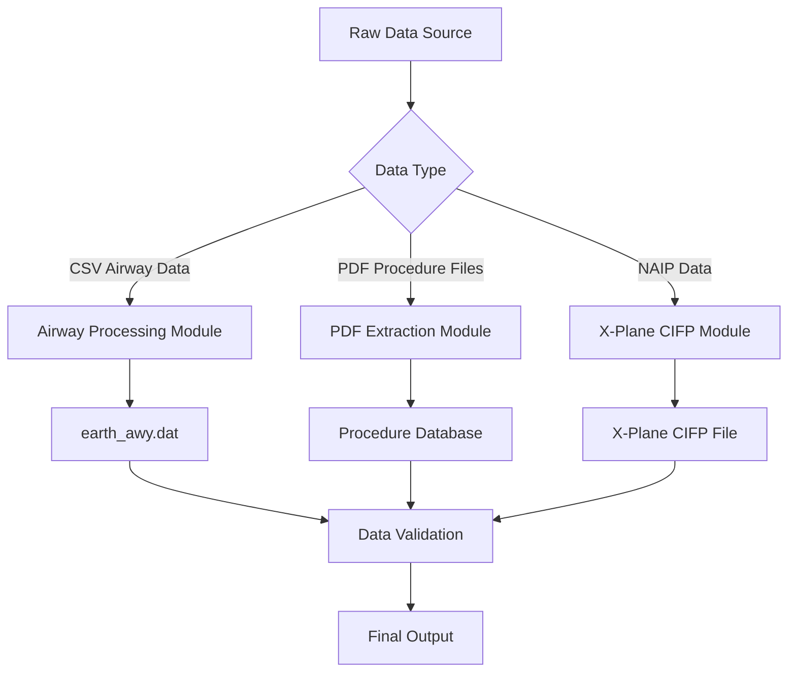

# Usage Guide

This document details how to use the Nav-data tool for aviation navigation data conversion, covering the complete process from data preparation to final output.

## 🗂️ Data Processing Workflow Overview

Nav-data comprises three main data processing workflows:



## 🛣️ Airway Data Processing

### Data Preparation

#### 1. Prepare Input Files
Ensure the following files are in the working directory:

```bash
# Required input files
RTE_SEG.csv          # Airway segment data (CSV format)
earth_fix.dat        # X-Plane fix point data
earth_nav.dat        # X-Plane navigation aid data
earth_awy.dat        # X-Plane airway data (will be updated)
```

#### 2. CSV File Format Validation
`RTE_SEG.csv` must contain the following fields:

| Field Name | Description | Example |
|--------|------|------|
| `CODE_POINT_START` | Start Point Code | ABCDE |
| `CODE_TYPE_START` | Start Point Type | DESIGNATED_POINT |
| `CODE_POINT_END` | End Point Code | FGHIJ |
| `CODE_TYPE_END` | End Point Type | VOR/DME |
| `CODE_DIR` | Direction Code | N |
| `TXT_DESIG` | Airway Name | A123 |

### Execute Airway Conversion

#### Basic Usage
```bash
# Enter the airway module directory
cd Airway

# Run the conversion script
python airway.py
```

#### Advanced Usage
```bash
# Use custom parameters
python airway.py --config custom_config.ini

# Specify specific input file
python airway.py --csv-file /path/to/custom_routes.csv

# Enable verbose logging
python airway.py --verbose

# Only process specific regions
python airway.py --areas ZB,ZG,ZY
```

#### In-script Configuration Modification
To modify processing parameters, edit `Airway/airway.py`:

```python
# Modify filtered regions
china_areas = {'ZB', 'ZG', 'ZY', 'ZS', 'ZW', 'ZJ', 'ZP', 'ZL', 'ZH', 'ZU'}

# Modify file paths
csv_file = 'custom_routes.csv'
earth_fix_path = '/path/to/earth_fix.dat'
earth_nav_path = '/path/to/earth_nav.dat'
earth_awy_path = '/path/to/earth_awy.dat'
```

### Output File Description

After processing, the `earth_awy.dat` file will contain:
- Filtered original airway data
- Newly added Chinese airspace airway data
- Airway information compatible with X-Plane format

Output format example:
```
ABCDE  ZB  11 FGHIJ  ZG   3 N  1    0  600 A123
```

## 📄 PDF Data Extraction

### Procedure Data Processing Workflow

#### Workflow 1: Raw PDF Extraction
```bash
# Enter the PDF extraction directory
cd "PDF extract"

# Run the PDF extraction script
python 1_terminal_pdf.py

# Input: airport_procedures.pdf
# Output: ZXXX_procedure.txt
```

**Usage Example:**
```python
# Custom PDF processing
import pdfplumber
from utils import *

# Open PDF file
with pdfplumber.open("ZBAA_procedures.pdf") as pdf:
    # Extract text and graphic elements
    extracted_data = extract(pdf)
    
    # Save extraction results
    with open("ZBAA_procedure.txt", "w", encoding="utf-8") as f:
        for line in extracted_data:
            f.write(line + "\n")
```

#### Workflow 2: Data Standardization Encoding
```bash
# Run the encoding script
python 2_terminal_encode.py

# Input: ZXXX_procedure.txt
# Output: ZXXX_encode.txt
```

**Encoding Rules:**
- Clean invalid characters and formats
- Standardize procedure names
- Standardize coordinate format
- Validate data integrity

#### Workflow 3: Database Format Generation
```bash
# Run the database generation script
python 3_terminal_db.py

# Input: ZXXX_encode.txt  
# Output: ZXXX_db.txt
```

**Database Format Features:**
- Separate multi-runway procedures
- Concatenate transition, go-around, holding procedures
- Generate X-Plane compatible format
- Add procedure description encoding

#### Workflow 4: Procedure Augmentation (Optional)
```bash
# Correct inconsistent procedure naming issues
python 4_程序增殖.py

# Input: ZXXX_db.txt
# Output: Corrected procedure file
```

### Waypoint Coordinate Extraction Workflow

#### Automatic Extraction (Recommended)
```bash
# Run automatic coordinate extraction
python waypoint_1_pdf.py

# Configure input and output paths
input_pdf = "ZBAA_waypoints.pdf"
output_txt = "ZBAA_waypoint.txt"
```

**Automatic Extraction Features:**
- Intelligent recognition of coordinate format
- Automatic handling of degrees-minutes-seconds conversion
- Supports various PDF layouts
- Includes data validation

#### Manual Extraction (Alternative Solution)
When automatic extraction accuracy is not ideal:

```bash
# Manually extract using Edge browser
python waypoint_2_edge.py
```

**Manual Extraction Steps:**
1. Open the PDF file with Microsoft Edge
2. Right-click to select and copy the relevant text
3. Save the text to an input file
4. Run the script for formatting

#### Single File Processing (Special Case)
```bash
# Process files containing special characters
python debug_single.py

# Applicable for:
# - Files containing special characters like parentheses
# - Data requiring manual correction
# - Separately processed airport files
```

### PDF Processing Best Practices

#### 1. PDF File Pre-processing
```bash
# Check PDF file quality
python -c "
import pdfplumber
with pdfplumber.open('input.pdf') as pdf:
    print(f'Pages: {len(pdf.pages)}')
    print(f'Text lines on first page: {len(pdf.pages[0].extract_text_lines())}')
"
```

#### 2. Batch Processing
```python
# Batch process multiple airport PDFs
import os
from pathlib import Path

pdf_folder = "input_pdfs/"
output_folder = "output_txt/"

for pdf_file in Path(pdf_folder).glob("*.pdf"):
    airport_code = pdf_file.stem[:4]  # Extract airport code
    
    # Process single file
    os.system(f"python 1_terminal_pdf.py {pdf_file}")
    os.system(f"python 2_terminal_encode.py {airport_code}_procedure.txt")
    os.system(f"python 3_terminal_db.py {airport_code}_encode.txt")
    
    print(f"Processing complete: {airport_code}")
```

#### 3. Quality Check
```python
# Validate extraction results
def validate_extraction(output_file):
    with open(output_file, 'r', encoding='utf-8') as f:
        lines = f.readlines()
    
    # Check coordinate format
    coord_pattern = r'\d+\.\d{8}'
    valid_coords = sum(1 for line in lines if re.search(coord_pattern, line))
    
    print(f"File: {output_file}")
    print(f"Total lines: {len(lines)}")
    print(f"Valid coordinate lines: {valid_coords}")
    print(f"Data quality: {valid_coords/len(lines)*100:.1f}%")

# Usage example
validate_extraction("ZBAA_waypoint.txt")
```

## 🔧 Terminal Procedure Repair

### Data Encoding Repair

#### Using the Encoder
```bash
# Enter the repair module directory
cd "Terminal Patch"

# Batch process (default path)
python terminal_encoder.py

# Custom path processing
python terminal_encoder.py "input_folder" "output_folder"

# Example
python terminal_encoder.py "PDF extract/public" "PDF extract/encoded"
```

**Encoder Functions:**
- Identify IF point location
- Add transition segment encoding
- Mark key procedure points
- Generate standard description code

#### Using the Format Repair Tool
```bash
# Batch format repair (default path)
python terminal_reencode.py

# Single file processing
python terminal_reencode.py ZBAA.dat ZBAA_fixed.dat

# Specify input and output folders
python terminal_reencode.py "/input/folder" "/output/folder"
```

**Repair Rule Description:**

1. **APPCH Line GY M Rule**
   ```
   Before repair: APPCH ... RW01 ... ... GY M
   After repair: APPCH ... RW01 ... G GY M
   ```

2. **All-alphabet Fifth Part Rule**
   ```
   Before repair: SID ... ABC ... ... EY M
   After repair: SID ... ABC ... D B VY M
   ```

3. **SID RW Rule**
   ```
   Before repair: SID ... RW25 ... ... EY D
   After repair: SID ... RW25 ... G GY D
   ```

### Custom Repair Script

```python
# Create custom repair script
import re

def custom_fix_procedure(input_file, output_file):
    """Custom procedure repair function"""
    with open(input_file, 'r', encoding='utf-8') as f:
        lines = f.readlines()
    
    fixed_lines = []
    for line in lines:
        # Apply custom repair rules
        if line.startswith('APPCH'):
            # Custom approach procedure repair
            parts = line.split()
            if len(parts) >= 9:
                # Repair logic
                if parts[8] == 'EY':
                    parts[8] = 'GY'
                line = ' '.join(parts) + '\n'
        
        fixed_lines.append(line)
    
    with open(output_file, 'w', encoding='utf-8') as f:
        f.writelines(fixed_lines)

# Usage example
custom_fix_procedure('ZBAA.dat', 'ZBAA_custom_fixed.dat')
```

## 🛩️ X-Plane CIFP Generation

### Navigation Aid Processing

#### VOR/DME and NDB Data Processing
```bash
cd "X-Plane CIFP"

# Process navigation aid data
python 1_navaid.py
```

**Configure Paths:**
```python
# Modify path configuration in script
navPath = "path/to/earth_nav.dat"
vorPath = "path/to/VOR.csv"
ndbPath = "path/to/NDB.csv"
```

**CSV Data Format Requirements:**

VOR.csv Fields:
- Airport code, name, frequency, coordinates, altitude, etc.

NDB.csv Fields:
- Airport code, name, frequency, coordinates, altitude, etc.

### Waypoint Processing

```bash
# Process waypoint data
python 2_waypoint.py
```

**Configuration Example:**
```python
# Modify path configuration
naipPath = "path/to/naip/waypoints"
xplanePath = "path/to/xplane/data"
outputPath = "path/to/output/earth_fix.dat"

# Select X-Plane version
forXp11 = False  # True for X-Plane 11, False for X-Plane 12
```

### Terminal Procedure Processing

```bash
# Process terminal procedure data
python 3_terminal.py
```

**Configure Paths:**
```python
# Main path configuration
inputPath = "path/to/encoded/procedures"
outputFolder = "path/to/cifp/output"
xplanePath = "path/to/xplane/installation"
csvFolder = "path/to/naip/csv/data"
```

**Processing Workflow:**
1. Read encoded procedure files
2. Establish waypoint database
3. Process SID, STAR, and approach procedures
4. Generate runway information
5. Output CIFP format files

### Special Function Modules

#### Fenix Data Extraction
```bash
# Extract runway and MAP information in a specific format
python Fenix.py

# Configure parameters
csv_folder = "path/to/csv/data"
procedure_folder = "path/to/procedures"
output_file = "fenix_output.txt"
```

#### Runway Generation
```bash
# Generate runway-related data
python spawn_runway.py

# Or use the export version
python 跑道生成导出ver.py
```

## 📊 Data Validation and Quality Control

### Automated Validation Script

Create `validate_output.py`:

```python
#!/usr/bin/env python3
"""
Output data validation script
"""
import re
import os
from pathlib import Path

def validate_airway_data(file_path):
    """Validates airway data format"""
    errors = []
    with open(file_path, 'r', encoding='utf-8') as f:
        for line_num, line in enumerate(f, 1):
            line = line.strip()
            if not line or line == "99":
                continue
                
            # X-Plane airway format validation
            parts = line.split()
            if len(parts) < 11:
                errors.append(f"Line {line_num}: Insufficient fields")
                continue
                
            # Coordinate range validation
            try:
                # Add specific coordinate validation logic here
                pass
            except ValueError as e:
                errors.append(f"Line {line_num}: Coordinate format error - {e}")
    
    return errors

def validate_waypoint_data(file_path):
    """Validates waypoint data format"""
    errors = []
    coord_pattern = r'^-?\d+\.\d{8}$'
    
    with open(file_path, 'r', encoding='utf-8') as f:
        for line_num, line in enumerate(f, 1):
            line = line.strip()
            if not line:
                continue
                
            parts = line.split()
            if len(parts) < 3:
                errors.append(f"Line {line_num}: Insufficient fields")
                continue
                
            # Validate coordinate format
            try:
                lat, lon = float(parts[1]), float(parts[2])
                if not (-90 <= lat <= 90):
                    errors.append(f"Line {line_num}: Latitude out of range")
                if not (-180 <= lon <= 180):
                    errors.append(f"Line {line_num}: Longitude out of range")
            except ValueError:
                errors.append(f"Line {line_num}: Coordinate format error")
    
    return errors

def validate_cifp_data(file_path):
    """Validates CIFP data format"""
    errors = []
    procedure_types = ['SID', 'STAR', 'APPCH']
    
    with open(file_path, 'r', encoding='utf-8') as f:
        for line_num, line in enumerate(f, 1):
            line = line.strip()
            if not line:
                continue
                
            # Check procedure type
            if any(line.startswith(ptype) for ptype in procedure_types):
                parts = line.split()
                if len(parts) < 15:
                    errors.append(f"Line {line_num}: Insufficient CIFP format fields")
    
    return errors

def main():
    """Main validation function"""
    print("🔍 Nav-data Output Validation")
    print("=" * 40)
    
    # Validation configuration
    validation_config = {
        'earth_awy.dat': validate_airway_data,
        '*.txt': validate_waypoint_data,  # Waypoint files
        '*.dat': validate_cifp_data,      # CIFP files
    }
    
    total_errors = 0
    
    for pattern, validator in validation_config.items():
        if '*' in pattern:
            # Wildcard pattern
            ext = pattern.split('*')[1]
            files = list(Path('.').glob(f'**/*{ext}'))
        else:
            # Specific file
            files = [Path(pattern)] if Path(pattern).exists() else []
        
        for file_path in files:
            if file_path.exists():
                print(f"\n📄 Validating file: {file_path}")
                errors = validator(str(file_path))
                
                if errors:
                    print(f"❌ Found {len(errors)} errors:")
                    for error in errors[:5]:  # Only show first 5 errors
                        print(f"   - {error}")
                    if len(errors) > 5:
                        print(f"   ... and {len(errors) - 5} more errors")
                    total_errors += len(errors)
                else:
                    print("✅ Validation successful")
    
    print(f"\n" + "=" * 40)
    if total_errors == 0:
        print("🎉 All data validated successfully!")
        return 0
    else:
        print(f"⚠️  Found {total_errors} issues in total")
        return 1

if __name__ == "__main__":
    exit(main())
```

### Using the Validation Script
```bash
# Run validation
python validate_output.py

# Output example
🔍 Nav-data Output Validation
========================================

📄 Validating file: earth_awy.dat
✅ Validation successful

📄 Validating file: ZBAA_waypoint.txt
✅ Validation successful

📄 Validating file: ZBAA.dat
❌ Found 2 errors:
   - Line 15: Insufficient CIFP format fields
   - Line 23: Coordinate format error

========================================
⚠️  Found 2 issues in total
```

## 🔧 Batch Processing Workflow

### Create Batch Processing Script

Create `batch_process.py`:

```python
#!/usr/bin/env python3
"""
Nav-data Batch Processing Script
"""
import os
import sys
import subprocess
from pathlib import Path
import logging

# Configure logging
logging.basicConfig(level=logging.INFO, format='%(asctime)s - %(levelname)s - %(message)s')
logger = logging.getLogger(__name__)

class BatchProcessor:
    def __init__(self, config):
        self.config = config
        self.processed_count = 0
        self.error_count = 0
    
    def process_airway_data(self):
        """Processes airway data"""
        logger.info("Starting airway data processing...")
        
        try:
            os.chdir('Airway')
            result = subprocess.run(['python', 'airway.py'], 
                                  capture_output=True, text=True)
            
            if result.returncode == 0:
                logger.info("Airway data processed successfully")
                self.processed_count += 1
            else:
                logger.error(f"Airway data processing failed: {result.stderr}")
                self.error_count += 1
                
        except Exception as e:
            logger.error(f"Airway data processing exception: {e}")
            self.error_count += 1
        finally:
            os.chdir('..')
    
    def process_pdf_data(self, pdf_files):
        """Batch processes PDF data"""
        logger.info(f"Starting to process {len(pdf_files)} PDF files...")
        
        os.chdir('PDF extract')
        
        for pdf_file in pdf_files:
            try:
                airport_code = Path(pdf_file).stem[:4]
                logger.info(f"Processing airport: {airport_code}")
                
                # Step 1: PDF Extraction
                subprocess.run(['python', '1_terminal_pdf.py', pdf_file], check=True)
                
                # Step 2: Encoding
                subprocess.run(['python', '2_terminal_encode.py', 
                              f'{airport_code}_procedure.txt'], check=True)
                
                # Step 3: Database Generation
                subprocess.run(['python', '3_terminal_db.py', 
                              f'{airport_code}_encode.txt'], check=True)
                
                logger.info(f"Processing complete: {airport_code}")
                self.processed_count += 1
                
            except subprocess.CalledProcessError as e:
                logger.error(f"Processing {pdf_file} failed: {e}")
                self.error_count += 1
            except Exception as e:
                logger.error(f"Processing {pdf_file} exception: {e}")
                self.error_count += 1
        
        os.chdir('..')
    
    def process_terminal_patch(self):
        """Processes terminal patches"""
        logger.info("Starting terminal patch processing...")
        
        try:
            os.chdir('Terminal Patch')
            
            # Encoder
            subprocess.run(['python', 'terminal_encoder.py'], check=True)
            
            # Format repair
            subprocess.run(['python', 'terminal_reencode.py'], check=True)
            
            logger.info("Terminal patches processed successfully")
            self.processed_count += 1
            
        except subprocess.CalledProcessError as e:
            logger.error(f"Terminal patch processing failed: {e}")
            self.error_count += 1
        except Exception as e:
            logger.error(f"Terminal patch processing exception: {e}")
            self.error_count += 1
        finally:
            os.chdir('..')
    
    def process_cifp_data(self):
        """Processes CIFP data"""
        logger.info("Starting CIFP data processing...")
        
        try:
            os.chdir('X-Plane CIFP')
            
            # Navigation aids
            subprocess.run(['python', '1_navaid.py'], check=True)
            
            # Waypoints
            subprocess.run(['python', '2_waypoint.py'], check=True)
            
            # Terminal procedures
            subprocess.run(['python', '3_terminal.py'], check=True)
            
            logger.info("CIFP data processed successfully")
            self.processed_count += 1
            
        except subprocess.CalledProcessError as e:
            logger.error(f"CIFP data processing failed: {e}")
            self.error_count += 1
        except Exception as e:
            logger.error(f"CIFP data processing exception: {e}")
            self.error_count += 1
        finally:
            os.chdir('..')
    
    def run_validation(self):
        """Runs data validation"""
        logger.info("Starting data validation...")
        
        try:
            result = subprocess.run(['python', 'validate_output.py'], 
                                  capture_output=True, text=True)
            
            if result.returncode == 0:
                logger.info("Data validation successful")
            else:
                logger.warning(f"Data validation found issues: {result.stdout}")
                
        except Exception as e:
            logger.error(f"Data validation exception: {e}")
    
    def generate_report(self):
        """Generates processing report"""
        total = self.processed_count + self.error_count
        success_rate = (self.processed_count / total * 100) if total > 0 else 0
        
        report = f"""
Nav-data Batch Processing Report
========================
Total tasks: {total}
Successful: {self.processed_count}
Failed: {self.error_count}
Success rate: {success_rate:.1f}%

Detailed logs available in console output.
        """
        
        logger.info(report)
        
        # Save report to file
        with open('batch_process_report.txt', 'w', encoding='utf-8') as f:
            f.write(report)

def main():
    """Main function"""
    config = {
        'pdf_folder': 'input_pdfs/',
        'enable_validation': True,
        'generate_report': True
    }
    
    processor = BatchProcessor(config)
    
    # Find PDF files
    pdf_files = list(Path(config['pdf_folder']).glob('*.pdf')) if Path(config['pdf_folder']).exists() else []
    
    # Execute processing workflow
    try:
        # 1. Airway data processing
        if Path('Airway/RTE_SEG.csv').exists():
            processor.process_airway_data()
        
        # 2. PDF data processing
        if pdf_files:
            processor.process_pdf_data(pdf_files)
        
        # 3. Terminal patch processing
        processor.process_terminal_patch()
        
        # 4. CIFP data processing
        processor.process_cifp_data()
        
        # 5. Data validation
        if config['enable_validation']:
            processor.run_validation()
        
        # 6. Generate report
        if config['generate_report']:
            processor.generate_report()
            
    except KeyboardInterrupt:
        logger.info("User interrupted processing")
    except Exception as e:
        logger.error(f"Batch processing exception: {e}")
    
    logger.info("Batch processing complete")

if __name__ == "__main__":
    main()
```

### Using Batch Processing
```bash
# Run batch processing
python batch_process.py

# Output example
2025-01-23 10:00:00 - INFO - Starting airway data processing...
2025-01-23 10:01:30 - INFO - Airway data processed successfully
2025-01-23 10:01:30 - INFO - Starting to process 5 PDF files...
2025-01-23 10:02:00 - INFO - Processing airport: ZBAA
2025-01-23 10:03:15 - INFO - Processing complete: ZBAA
...
2025-01-23 10:15:00 - INFO - Batch processing complete
```

## ❓ Frequently Asked Questions (FAQ)

### Q1: Why did the airway conversion fail?
**A:** Common causes and solutions:

1. **CSV File Format Error**
   ```bash
   # Check CSV file encoding
   file -I RTE_SEG.csv
   
   # Convert encoding (if needed)
   iconv -f gbk -t utf-8 RTE_SEG.csv > RTE_SEG_utf8.csv
   ```

2. **Missing Required Fields**
   ```python
   # Validate CSV fields
   import pandas as pd
   df = pd.read_csv('RTE_SEG.csv')
   required_fields = ['CODE_POINT_START', 'CODE_TYPE_START', 'CODE_POINT_END', 
                     'CODE_TYPE_END', 'CODE_DIR', 'TXT_DESIG']
   missing_fields = [f for f in required_fields if f not in df.columns]
   print(f"Missing fields: {missing_fields}")
   ```

3. **Reference Data Files Not Found**
   ```bash
   # Check if files exist
   ls -la earth_fix.dat earth_nav.dat earth_awy.dat
   ```

### Q2: What if PDF extraction accuracy is not ideal?
**A:** Try the following solutions:

1. **Use manual extraction method**
   ```bash
   python waypoint_2_edge.py
   ```

2. **Adjust PDF processing parameters**
   ```python
   # Adjust in waypoint_1_pdf.py
   crop_margin = 50  # Increase crop margin
   text_confidence = 0.8  # Decrease text confidence threshold
   ```

3. **Pre-process PDF files**
   - Ensure the PDF is in text format, not a scanned image
   - Use a PDF editor to optimize file quality
   - Remove unnecessary graphic elements

### Q3: How to fix procedure encoding errors?
**A:** Use repair tools:

1. **Automatic repair**
   ```bash
   cd "Terminal Patch"
   python terminal_reencode.py
   ```

2. **Manual check and repair**
   ```python
   # Check procedure format
   with open('ZBAA.dat', 'r') as f:
       for i, line in enumerate(f, 1):
           if 'APPCH' in line:
               parts = line.split()
               if len(parts) < 15:
                   print(f"Line {i} incomplete format: {line.strip()}")
   ```

### Q4: X-Plane cannot recognize the generated data?
**A:** Check the following items:

1. **Correct file paths**
   ```bash
   # X-Plane 11
   ls "$XPLANE_PATH/Custom Data/"
   
   # X-Plane 12
   ls "$XPLANE_PATH/Output/FMS plans/"
   ```

2. **File format compatibility**
   ```python
   # Check file encoding
   with open('earth_awy.dat', 'rb') as f:
       raw = f.read(100)
       print(f"File encoding detection: {raw}")
   ```

3. **Data integrity**
   ```bash
   # Check if the file ends with "99"
   tail -n 5 earth_awy.dat
   ```

### Q5: Out of memory when processing large files?
**A:** Optimize memory usage:

1. **Increase virtual memory**
   ```bash
   # Linux system
   sudo swapon --show
   sudo fallocate -l 4G /swapfile
   sudo mkswap /swapfile
   sudo swapon /swapfile
   ```

2. **Process in batches**
   ```python
   # Modify batch size
   BATCH_SIZE = 500  # Reduce batch size
   ```

3. **Clean up memory**
   ```python
   import gc
   # Add in processing loop
   gc.collect()
   ```

### Q6: Coordinate precision issues?
**A:** Improve coordinate processing precision:

1. **Adjust precision settings**
   ```python
   COORDINATE_PRECISION = 8  # Maintain 8 decimal places precision
   ```

2. **Validate coordinate range**
   ```python
   # China region coordinate range
   LAT_MIN, LAT_MAX = 15.0, 55.0
   LON_MIN, LON_MAX = 70.0, 140.0
   ```

3. **Use high-precision calculation**
   ```python
   from decimal import Decimal, getcontext
   getcontext().prec = 12  # Set high precision
   ```

### Q7: How to update AIRAC data?
**A:** AIRAC data update workflow:

1. **Automatically calculate current cycle**
   ```python
   from datetime import datetime
   # The tool automatically calculates the current AIRAC cycle
   current_cycle = get_current_airac_cycle()
   print(f"Current AIRAC cycle: {current_cycle}")
   ```

2. **Manually specify cycle**
   ```python
   # Specify in configuration
   manual_cycle = "2504"  # 4th cycle of 2025
   ```

3. **Check data validity**
   ```bash
   # Check AIRAC information of source data
   grep -i "airac" *.csv
   ```

### Q8: How to contribute code or report issues?
**A:** Participate in project development:

1. **Report issues**
   - Submit detailed Issues to GitHub
   - Include error messages and reproduction steps
- Provide relevant input files (if possible)

2. **Contribute code**
   - Fork the project repository
   - Create feature branches
   - Submit Pull Requests

3. **Improve documentation**
   - Report documentation errors
   - Provide usage examples
   - Translate documentation

---

**Happy flying!** ✈️ If you encounter other issues, please check the project's GitHub Issues or create a new issue report.