# 🏗️ Technische Architektur

Dieses Dokument bietet einen detaillierten Einblick in die Systemarchitektur, die Entwurfsprinzipien und die technischen Implementierungsdetails von Nav-data und dient als umfassendes technisches Referenzmaterial für Entwickler und technische Benutzer.

## 📐 Systemarchitektur im Überblick

### Gesamtarchitekturdiagramm


### Beschreibung der Kernkomponenten

| Komponente | Funktion | Technologie-Stack | Hauptmerkmale |
|------------|----------|-------------------|---------------|
| **Datenparser** | Lesen von Daten in verschiedenen Formaten | pandas, chardet | Automatische Kodierungserkennung, Fehlertoleranz |
| **Koordinatenkonverter** | Verarbeitung geografischer Koordinaten | Benutzerdefinierter Algorithmus | DMS↔Dezimal-Umwandlung, Präzisionskontrolle |
| **Missweisungsrechner** | Berechnung der magnetischen Deklination | pygeomag | WMM2025-Modell, hochpräzise Berechnung |
| **Datenbank-Engine** | SQLite-Datenbank | sqlite3 | PMDG-Kompatibilitätsmodus, Transaktionsverarbeitung |
| **Validierungs-Engine** | Datensicherstellung | Benutzerdefinierter Validator | Mehrstufige Validierung, detaillierter Bericht |
| **Parallelprozessor** | Leistungsoptimierung | ThreadPoolExecutor | Multithreading-Verarbeitung, Fortschrittsüberwachung |

## 🧩 Modulare Architektur

### 1. Datenverarbeitungsmodul

#### Flughafendatenverarbeitung (`PMDG_APT.py`)

```python
class AirportProcessor:
    """Flughafendatenprozessor"""
    
    def __init__(self):
        self.csv_parser = CSVParser(encoding='latin1')
        self.coordinate_converter = CoordinateConverter()
        self.database_writer = DatabaseWriter()
    
    def process(self) -> ProcessResult:
        """Hauptverarbeitungsprozess"""
        # 1. NAIP Flughafendaten lesen
        airports_data = self.csv_parser.read_csv(self.csv_file_path)
        
        # 2. Flughafennamen-Nachschlagetabelle lesen
        name_lookup = self.load_airport_names()
        
        # 3. Datenverarbeitung und -konvertierung
        processed_data = []
        for airport in airports_data:
            # Koordinatenkonvertierung: DMS -> Dezimal
            lat, lon = self.coordinate_converter.dms_to_decimal(
                airport['GEO_LAT_ACCURACY'],
                airport['GEO_LONG_ACCURACY']
            )
            
            # Datenvalidierung und -bereinigung
            if self.validate_airport_data(airport, lat, lon):
                processed_data.append({
                    'icao_code': airport['CODE_ID'][:2],
                    'airport_identifier': airport['CODE_ID'],
                    'airport_name': name_lookup.get(airport['CODE_ID'], 'UNKNOWN'),
                    'latitude': lat,
                    'longitude': lon,
                    # ... weitere Felder
                })
        
        # 4. In die Datenbank schreiben
        return self.database_writer.write_airports(processed_data)
```

#### Flugwegdatenverarbeitung (`PMDG_AWY_FINAL.py`)

Dies ist das komplexeste Modul, das einen intelligenten Flugweg-Zusammenführungsalgorithmus enthält:

```python
class AirwayProcessor:
    """Flugwegdatenprozessor - unterstützt intelligente Zusammenführung"""
    
    def process_airways(self):
        """Hauptverarbeitungsprozess für Flugwege"""
        # 1. CSV-Flugwegsegmentdaten lesen
        route_segments = self.read_route_segments()
        
        # 2. Wegpunktkoordinaten abgleichen
        for segment in route_segments:
            icao_code, lat, lon = self.match_waypoint_coordinates(
                segment['waypoint_identifier'],
                segment['code_type']
            )
            segment.update({'lat': lat, 'lon': lon, 'icao': icao_code})
        
        # 3. Intelligente Flugweg-Zusammenführung
        for route_id in self.get_unique_routes():
            existing_route = self.get_existing_route(route_id)
            new_segments = self.get_route_segments(route_id)
            
            merged_route = self.intelligent_merge(existing_route, new_segments)
            
            # 4. Segmententfernung und Kurs neu berechnen
            self.recalculate_route_geometry(merged_route)
            
            # 5. Datenbank aktualisieren
            self.update_route_in_database(route_id, merged_route)
    
    def intelligent_merge(self, existing, new_segments):
        """Intelligenter Flugweg-Zusammenführungsalgorithmus"""
        if not existing:
            return new_segments
        
        # Gemeinsame Wegpunkte finden
        common_points = self.find_common_waypoints(existing, new_segments)
        
        if not common_points:
            # Keine gemeinsamen Punkte - direkt anhängen
            return self.append_segments(existing, new_segments)
        else:
            # Gemeinsame Punkte vorhanden - intelligent einfügen
            return self.insert_missing_segments(existing, new_segments, common_points)
```

### 2. Datenvalidierungsarchitektur

#### Mehrstufiges Validierungssystem

```python
class ValidationEngine:
    """Datenvalidierungs-Engine"""
    
    def __init__(self):
        self.validators = [
            CoordinateValidator(),
            ICAOCodeValidator(),
            ReferenceIntegrityValidator(),
            DuplicateDetector(),
            BusinessRuleValidator()
        ]
    
    def validate(self, data: dict) -> ValidationResult:
        """Führt eine mehrstufige Validierung durch"""
        result = ValidationResult()
        
        for validator in self.validators:
            validator_result = validator.validate(data)
            result.merge(validator_result)
            
            # Validierung bei kritischen Fehlern stoppen
            if validator_result.has_critical_errors():
                break
        
        return result

class CoordinateValidator:
    """Koordinatenvalidator"""
    
    # Koordinatengrenzen für die Region China
    CHINA_BOUNDS = {
        'lat_min': 15.0, 'lat_max': 55.0,
        'lon_min': 70.0, 'lon_max': 140.0
    }
    
    def validate(self, data: dict) -> ValidationResult:
        lat, lon = data.get('latitude'), data.get('longitude')
        
        if not self.is_valid_coordinate(lat, lon):
            return ValidationResult.error(f"Koordinaten außerhalb des Bereichs der Region China: {lat}, {lon}")
        
        return ValidationResult.success()
```

### 3. Architektur für parallele Verarbeitung

#### Multithreading-Design

```python
class ConcurrentProcessor:
    """Parallelprozessor"""
    
    def __init__(self, max_workers=50):
        self.max_workers = min(max_workers, multiprocessing.cpu_count() * 2)
        self.progress_tracker = ProgressTracker()
    
    def process_in_parallel(self, tasks: List[Task]) -> List[Result]:
        """Verarbeitet Aufgaben parallel"""
        results = []
        
        with ThreadPoolExecutor(max_workers=self.max_workers) as executor:
            # Alle Aufgaben einreichen
            future_to_task = {
                executor.submit(self.process_task, task): task 
                for task in tasks
            }
            
            # Ergebnisse sammeln und Fortschritt aktualisieren
            for future in as_completed(future_to_task):
                task = future_to_task[future]
                try:
                    result = future.result()
                    results.append(result)
                    self.progress_tracker.update()
                except Exception as e:
                    logging.error(f"Aufgabe {task.id} fehlgeschlagen: {e}")
        
        return results
```

## 🗄️ Datenbankdesign

### ER-Diagramm

```mermaid
erDiagram
    tbl_airports ||--o{ tbl_runways : hat
    tbl_airports ||--o{ tbl_vhfnavaids : enthält
    tbl_airports ||--o{ tbl_sids : Abflug_von
    tbl_airports ||--o{ tbl_stars : Ankunft_bei
    tbl_airports ||--o{ tbl_iaps : Anflug_auf
    
    tbl_enroute_waypoints ||--o{ tbl_enroute_airways : verbindet
    tbl_terminal_waypoints ||--o{ tbl_sids : verwendet
    tbl_terminal_waypoints ||--o{ tbl_stars : verwendet
    
    tbl_airports {
        string area_code
        string icao_code PK
        string airport_identifier
        string Flughafenname
        real airport_ref_latitude
        real airport_ref_longitude
        string ifr_capability
        integer Höhe
        integer Übergangshöhe
    }
    
    tbl_runways {
        string area_code
        string icao_code PK
        string airport_identifier PK
        string runway_identifier PK
        real runway_latitude
        real runway_longitude
        integer Landebahnlänge
        integer Landebahnbreite
        string surface_code
        real runway_magnetic_bearing
    }
    
    tbl_enroute_airways {
        string area_code
        string route_identifier PK
        integer seqno PK
        string waypoint_identifier
        real waypoint_latitude
        real waypoint_longitude
        real Einflugentfernung
        real Ausflugskurs
        real Einflugskurs
        integer Mindesthöhe1
        integer Maximalhöhe
    }
```

### Detaillierte Tabellenstruktur

#### Prinzipien des Kern-Tabellen-Designs

1.  **PMDG-Kompatibilität**: Strikte Einhaltung der PMDG-Datenbanktabellenstruktur und Feldnamen
2.  **ICAO-Standard**: Unterstützung der Datenstandards der Internationalen Zivilluftfahrtorganisation
3.  **Leistungsoptimierung**: Sinnvolles Indexdesign und Auswahl der Datentypen
4.  **Datenintegrität**: Fremdschlüssel-Constraints und Geschäftsregelvalidierung

#### Schlüssel-Tabellenstrukturen

```sql
-- Flughafentabelle
CREATE TABLE tbl_airports (
    area_code TEXT DEFAULT 'EEU',
    icao_code TEXT NOT NULL,
    airport_identifier TEXT PRIMARY KEY,
    airport_name TEXT,
    airport_ref_latitude REAL,
    airport_ref_longitude REAL,
    ifr_capability TEXT DEFAULT 'Y',
    longest_runway_surface_code TEXT,
    elevation INTEGER,
    transition_altitude INTEGER DEFAULT 18000,
    transition_level INTEGER,
    speed_limit INTEGER,
    speed_limit_altitude INTEGER,
    iata_ata_designator TEXT,
    id TEXT UNIQUE
);

-- Flugwegtabelle
CREATE TABLE tbl_enroute_airways (
    area_code TEXT DEFAULT 'EEU',
    crusing_table_identifier TEXT DEFAULT 'EE',
    route_identifier TEXT NOT NULL,
    seqno INTEGER NOT NULL,
    icao_code TEXT,
    waypoint_identifier TEXT,
    waypoint_latitude REAL,
    waypoint_longitude REAL,
    waypoint_description_code TEXT,
    route_type TEXT DEFAULT 'O',
    inbound_course REAL DEFAULT 0.0,
    inbound_distance REAL DEFAULT 0.0,
    outbound_course REAL DEFAULT 0.0,
    minimum_altitude1 INTEGER DEFAULT 5000,
    minimum_altitude2 INTEGER,
    maximum_altitude INTEGER DEFAULT 99999,
    direction_restriction TEXT,
    flightlevel TEXT DEFAULT 'B',
    id TEXT,
    PRIMARY KEY (route_identifier, seqno)
);
```

## 🔄 Datenverarbeitungsworkflow

### Verarbeitungspipeline

```mermaid
sequenceDiagram
    participant Input as Eingabedaten
    participant Parser as Datenparser
    participant Validator as Validator
    participant Transformer as Konverter
    participant Database as Datenbank
    participant Logger as Log-System
    
    Input->>Parser: Quelldatendateien lesen
    Parser->>Validator: Rohdaten validieren
    
    alt Validierung erfolgreich
        Validator->>Transformer: Datenkonvertierung und -verarbeitung
        Transformer->>Database: In Datenbank schreiben
        Database->>Logger: Erfolgslog schreiben
    else Validierung fehlgeschlagen
        Validator->>Logger: Fehlerlog schreiben
        Logger->>Input: Fehlerhafte Daten überspringen
    end
    
    Database->>Validator: Endgültige Datenvalidierung
    Validator->>Logger: Validierungsbericht erstellen
```



### Fehlerbehandlungsstrategien

```python
class ErrorHandler:
    """Fehlerbehandlungsstrategien"""
    
    ERROR_STRATEGIES = {
        'missing_data': 'log_and_skip',
        'invalid_coordinates': 'log_and_skip', 
        'duplicate_records': 'log_and_merge',
        'reference_not_found': 'log_and_continue',
        'critical_error': 'stop_processing'
    }
    
    def handle_error(self, error_type: str, error_data: dict):
        strategy = self.ERROR_STRATEGIES.get(error_type, 'log_and_continue')
        
        if strategy == 'log_and_skip':
            self.log_error(error_data)
            return ProcessingAction.SKIP
        elif strategy == 'stop_processing':
            self.log_critical_error(error_data)
            raise ProcessingException(error_data)
        # ... andere Strategien
```

## 🎯 Entwurf für Leistungsoptimierung

### Speicherverwaltung

```python
class MemoryManager:
    """Speichermanager"""
    
    def __init__(self, max_memory_mb=2048):
        self.max_memory = max_memory_mb * 1024 * 1024
        self.current_usage = 0
    
    def process_in_batches(self, data_source, batch_size=1000):
        """Verarbeitet große Datensätze in Batches"""
        batch = []
        
        for item in data_source:
            batch.append(item)
            self.current_usage += sys.getsizeof(item)
            
            if len(batch) >= batch_size or self.memory_threshold_reached():
                yield batch
                batch = []
                self.gc_collect()  # Erzwingt Garbage Collection
    
    def memory_threshold_reached(self) -> bool:
        return self.current_usage > self.max_memory * 0.8
```

### Datenbankoptimierung

```python
class DatabaseOptimizer:
    """Datenbank-Leistungsoptimierung"""
    
    PRAGMA_SETTINGS = {
        'journal_mode': 'DELETE',     # PMDG-Kompatibilitätsmodus
        'synchronous': 'FULL',        # Datensicherheit hat Priorität
        'cache_size': 10000,          # Großer Cache zur Leistungssteigerung
        'temp_store': 'MEMORY',       # Temporäre Daten im Speicher ablegen
        'mmap_size': 268435456        # 256MB Speicherzuordnung (memory map)
    }
    
    def optimize_database(self, connection):
        """Wendet Leistungsoptimierungseinstellungen an"""
        for pragma, value in self.PRAGMA_SETTINGS.items():
            connection.execute(f"PRAGMA {pragma} = {value}")
        
        # Wichtige Indizes erstellen
        self.create_performance_indexes(connection)
    
    def create_performance_indexes(self, connection):
        """Erstellt Indizes zur Leistungsoptimierung"""
        indexes = [
            "CREATE INDEX IF NOT EXISTS idx_airports_icao ON tbl_airports(icao_code)",
            "CREATE INDEX IF NOT EXISTS idx_airways_route ON tbl_enroute_airways(route_identifier)",
            "CREATE INDEX IF NOT EXISTS idx_waypoints_id ON tbl_enroute_waypoints(waypoint_identifier)",
        ]
        
        for index_sql in indexes:
            connection.execute(index_sql)
```

## 🔍 Qualitätssicherungssystem

### Datenvalidierungs-Framework

```python
class QualityAssurance:
    """Qualitätssicherungs-Framework"""
    
    def __init__(self):
        self.validation_rules = self.load_validation_rules()
        self.test_cases = self.load_test_cases()
    
    def comprehensive_validation(self, database_path: str) -> QAReport:
        """Umfassende Qualitätsprüfung"""
        report = QAReport()
        
        # 1. Schemavalidierung
        report.add_section(self.validate_schema(database_path))
        
        # 2. Datenintegritätsprüfung
        report.add_section(self.validate_integrity(database_path))
        
        # 3. Geschäftsregelvalidierung
        report.add_section(self.validate_business_rules(database_path))
        
        # 4. Leistungs-Benchmark-Test
        report.add_section(self.performance_benchmark(database_path))
        
        # 5. PMDG-Kompatibilitätstest
        report.add_section(self.pmdg_compatibility_test(database_path))
        
        return report
    
    def validate_business_rules(self, database_path: str) -> ValidationSection:
        """Geschäftsregelvalidierung"""
        rules = [
            "Flugwege müssen gültige Wegpunkte verbinden",
            "Flughäfen müssen mindestens eine Landebahn haben",
            "ILS-Frequenzen müssen im gültigen Bereich liegen",
            "Flugweg-Höhenbeschränkungen müssen plausibel sein",
            "Koordinaten müssen im Bereich der Region China liegen"
        ]
        
        results = []
        for rule in rules:
            result = self.check_business_rule(database_path, rule)
            results.append(result)
        
        return ValidationSection("Geschäftsregelvalidierung", results)
```

## 🔧 Erweiterbarkeitsdesign

### Plugin-Architektur

```python
class PluginManager:
    """Plugin-Manager"""
    
    def __init__(self):
        self.processors = {}
        self.validators = {}
        self.exporters = {}
    
    def register_processor(self, name: str, processor_class):
        """Registriert ein Datenprozessor-Plugin"""
        self.processors[name] = processor_class
    
    def register_validator(self, name: str, validator_class):
        """Registriert ein Validator-Plugin"""
        self.validators[name] = validator_class
    
    def load_plugins(self, plugin_directory: str):
        """Lädt Plugins dynamisch"""
        for plugin_file in glob.glob(f"{plugin_directory}/*.py"):
            plugin_module = importlib.import_module(plugin_file)
            if hasattr(plugin_module, 'register'):
                plugin_module.register(self)

# Beispiel-Plugin
class CustomAirportProcessor(BaseProcessor):
    """Benutzerdefiniertes Flughafenprozessor-Plugin"""
    
    def process(self, data):
        # Benutzerdefinierte Verarbeitungslogik
        return super().process(data)

def register(plugin_manager):
    """Plugin-Registrierungsfunktion"""
    plugin_manager.register_processor('custom_airport', CustomAirportProcessor)
```

### Konfigurationsverwaltung

```python
class ConfigurationManager:
    """Konfigurationsmanager"""
    
    def __init__(self, config_path: str = "config/settings.yaml"):
        self.config = self.load_config(config_path)
        self.validators = self.load_config_validators()
    
    def load_config(self, path: str) -> dict:
        """Lädt die Konfigurationsdatei"""
        with open(path, 'r', encoding='utf-8') as f:
            return yaml.safe_load(f)
    
    def validate_config(self) -> bool:
        """Validiert die Gültigkeit der Konfiguration"""
        for validator in self.validators:
            if not validator.validate(self.config):
                return False
        return True
    
    def get_nested_value(self, key_path: str, default=None):
        """Ruft verschachtelte Konfigurationswerte ab"""
        keys = key_path.split('.')
        value = self.config
        
        for key in keys:
            if isinstance(value, dict) and key in value:
                value = value[key]
            else:
                return default
        
        return value

# Beispiel für Konfigurationsdatei (settings.yaml)
"""
data_sources:
  naip:
    directory: "data/input/naip"
    encoding: "latin1"
  xplane:
    directory: "data/input/xplane"
    encoding: "utf-8"

processing:
  batch_size: 1000
  max_workers: 50
  memory_limit_mb: 2048

database:
  path: "data/output/e_dfd_PMDG.s3db"
  pragmas:
    journal_mode: "DELETE"
    synchronous: "FULL"

validation:
  coordinate_bounds:
    china:
      lat_min: 15.0
      lat_max: 55.0
      lon_min: 70.0
      lon_max: 140.0
"""
```

## 📊 Überwachung und Protokollierung

### Strukturiertes Protokollsystem

```python
class StructuredLogger:
    """Strukturiertes Protokollsystem"""
    
    def __init__(self, name: str):
        self.logger = logging.getLogger(name)
        self.setup_handlers()
    
    def setup_handlers(self):
        """Setzt Log-Handler auf"""
        # Konsolen-Handler
        console_handler = logging.StreamHandler()
        console_handler.setFormatter(ColoredFormatter())
        
        # Datei-Handler
        file_handler = RotatingFileHandler(
            f"logs/{self.logger.name}.log",
            maxBytes=10*1024*1024,
            backupCount=5
        )
        file_handler.setFormatter(JSONFormatter())
        
        self.logger.addHandler(console_handler)
        self.logger.addHandler(file_handler)
    
    def log_processing_start(self, module: str, input_size: int):
        """Prozessstart protokollieren"""
        self.logger.info("Verarbeitung gestartet", extra={
            'module': module,
            'input_size': input_size,
            'timestamp': datetime.utcnow().isoformat(),
            'event_type': 'processing_start'
        })
    
    def log_processing_complete(self, module: str, output_size: int, duration: float):
        """Prozessabschluss protokollieren"""
        self.logger.info("Verarbeitung abgeschlossen", extra={
            'module': module,
            'output_size': output_size,
            'duration_seconds': duration,
            'records_per_second': output_size / duration if duration > 0 else 0,
            'timestamp': datetime.utcnow().isoformat(),
            'event_type': 'processing_complete'
        })
```

## 🔒 Sicherheitsdesign

### Datensicherheit

```python
class SecurityManager:
    """Sicherheitsmanager"""
    
    def __init__(self):
        self.input_sanitizer = InputSanitizer()
        self.path_validator = PathValidator()
    
    def validate_input_path(self, path: str) -> bool:
        """Validiert die Sicherheit des Eingabepfads"""
        # Path Traversal-Angriffe verhindern
        normalized_path = os.path.normpath(path)
        if '..' in normalized_path:
            raise SecurityException("Pfad enthält ungültige Zeichen")
        
        # Sicherstellen, dass der Pfad in einem zulässigen Verzeichnis liegt
        allowed_dirs = ['data/input', 'config']
        if not any(normalized_path.startswith(allowed) for allowed in allowed_dirs):
            raise SecurityException("Pfad liegt nicht in einem zulässigen Verzeichnis")
        
        return True
    
    def sanitize_sql_input(self, value: str) -> str:
        """SQL-Eingabebereinigung"""
        if not isinstance(value, str):
            return value
        
        # Entfernt potenzielle SQL-Injection-Zeichen
        dangerous_chars = ["'", '"', ';', '--', '/*', '*/']
        for char in dangerous_chars:
            value = value.replace(char, '')
        
        return value
```

---

Dieses technische Architektur-Dokument bietet eine umfassende technische Übersicht über das Nav-data-Projekt, einschließlich Systemdesign, Datenfluss, Leistungsoptimierung, Qualitätssicherung und Sicherheit. Entwickler können auf dieser Architektur aufbauen, um weitere Entwicklungen und Funktionserweiterungen vorzunehmen.