# 🚀 Verwendungshinweise

Diese Anleitung beschreibt detailliert, wie Sie das Nav-data-Tool verwenden, um Luftfahrt-Navigationsdaten in ein PMDG-kompatibles Datenbankformat zu konvertieren und diese in Microsoft Flight Simulator zu installieren.

## 📋 Übersicht des Konvertierungsablaufs

Die Datenkonvertierung mit Nav-data folgt den folgenden Hauptschritten:

```mermaid
graph TD
    A[Datenquellen vorbereiten] --> B[Dateipfade konfigurieren]
    B --> C[Datenkonvertierung ausführen]
    C --> D[Datenbank überprüfen]
    D --> E[In MSFS installieren]
    E --> F[Testen und verifizieren]
```



### Beschreibung der Konvertierungsmodule

| Modulname | Funktion | Eingabedaten | Ausgabetabelle |
|--------|------|----------|--------|
| `PMDG_APT.py` | Verarbeitung von Flughafendaten | AD_HP.csv + Airport.dat | tbl_airports |
| `PMDG_RUNWAY.py` | Verarbeitung von Pisteninformationen | RWY*.csv + earth_nav.dat | tbl_runways |
| `PMDG_VHF.py` | Verarbeitung von VOR/DME-Daten | earth_nav.dat | tbl_vhfnavaids |
| `PMDG_ENRT_NDB.py` | Verarbeitung von NDB-Daten | earth_nav.dat | tbl_enroute_ndbnavaids |
| `PMDG_ENRT_WAYPOINT.py` | Verarbeitung von Wegpunkten | earth_fix.dat | tbl_enroute_waypoints |
| `PMDG_TMA_WAYPOINT.py` | Wegpunkte des Terminalbereichs | earth_fix.dat | tbl_terminal_waypoints |
| `PMDG_AWY_FINAL.py` | Verarbeitung von Streckendaten | RTE_SEG.csv + earth_*.dat | tbl_enroute_airways |
| `PMDG_ILS.py` | Verarbeitung von ILS/GS-Daten | earth_nav.dat | tbl_localizers_glideslopes |
| `PMDG_SID.py` | Standard-Abflugverfahren | CIFP .dat-Dateien | tbl_sids |
| `PMDG_STAR.py` | Standard-Ankunftsverfahren | CIFP .dat-Dateien | tbl_stars |
| `PMDG_APPCH.py` | Anflugverfahren | CIFP .dat-Dateien | tbl_iaps |

## 🔄 Schritte zur Datenkonvertierung

### Schritt 1: Datenvorbereitung

1. **NAIP-Daten beziehen**
   ```bash
   # NAIP CSV-Dateien in das angegebene Verzeichnis legen
   cp /source/path/*.csv data/input/naip/
   
   # Dateintegrität überprüfen
   ls data/input/naip/
   # Sollte anzeigen: AD_HP.csv, RWY_DIRECTION.csv, RWY.csv, RTE_SEG.csv
   ```

2. **X-Plane-Daten beziehen**
   ```bash
   # Datendateien aus dem X-Plane Installationsverzeichnis kopieren
   cp "/path/to/X-Plane/Custom Data/earth_fix.dat" data/input/xplane/
   cp "/path/to/X-Plane/Custom Data/earth_nav.dat" data/input/xplane/
   ```

3. **CIFP-Daten beziehen**
   ```bash
   # CIFP-Programm-Datendateien kopieren
   cp -r /path/to/CIFP/* data/input/cifp/
   ```

4. **Flughafensuchdatei vorbereiten**
   ```bash
   # Flughafennamen-Suchdatei kopieren
   cp /path/to/Airport.dat data/input/
   ```

### Schritt 2: Umgebung aktivieren und überprüfen

```bash
# Virtuelle Umgebung aktivieren
source nav-data-env/bin/activate  # macOS/Linux
# Oder nav-data-env\Scripts\activate  # Windows

# Konfiguration überprüfen
python scripts/validate_config.py
```

### Schritt 3: Datenkonvertierung ausführen

#### Methode A: Module einzeln ausführen (empfohlen)

Führen Sie die einzelnen Module schrittweise gemäß den Datenabhängigkeiten aus:

```bash
# 1. Grundlegende Flughafendaten verarbeiten
echo "🏢 Flughafendaten werden verarbeitet..."
python PMDG_APT.py

# 2. Pisten(landebahn)-Daten verarbeiten
echo "🛫 Pisten(landebahn)-Daten werden verarbeitet..."
python PMDG_RUNWAY.py

# 3. Navigationsgeräte verarbeiten
echo "📡 VHF-Navigationsgeräte werden verarbeitet..."
python PMDG_VHF.py

echo "📡 NDB-Navigationsgeräte werden verarbeitet..."
python PMDG_ENRT_NDB.py

echo "📍 ILS-System wird verarbeitet..."
python PMDG_ILS.py

# 4. Wegpunkte verarbeiten
echo "🗺️ Wegpunktdaten werden verarbeitet..."
python PMDG_ENRT_WAYPOINT.py
python PMDG_TMA_WAYPOINT.py

# 5. Streckendaten verarbeiten
echo "🛣️ Streckendaten werden verarbeitet..."
python PMDG_AWY_FINAL.py

# 6. Flugverfahren verarbeiten (falls CIFP-Daten vorhanden)
echo "📋 Standard-Abflugverfahren werden verarbeitet..."
python PMDG_SID.py

echo "📋 Standard-Ankunftsverfahren werden verarbeitet..."
python PMDG_STAR.py

echo "📋 Anflugverfahren werden verarbeitet..."
python PMDG_APPCH.py
```

#### Methode B: Stapelverarbeitungs-Skript

Automatisches Verarbeitungs-Skript erstellen:

```bash
# scripts/run_conversion.sh
#!/bin/bash

set -e  # Bei Fehlern anhalten

echo "🚀 Nav-data Konvertierungsprozess beginnt..."

# Virtuelle Umgebung überprüfen
if [[ "$VIRTUAL_ENV" == "" ]]; then
    echo "❌ Bitte zuerst die virtuelle Umgebung aktivieren"
    exit 1
fi

# Konfiguration überprüfen
echo "🔍 Konfiguration wird überprüft..."
python scripts/validate_config.py

# Ausgabeverzeichnis erstellen
mkdir -p data/output logs

# Startzeit aufzeichnen
start_time=$(date +%s)

# Konvertierungsfunktion
run_module() {
    local module=$1
    local description=$2
    
    echo "📊 $description"
    if python $module.py; then
        echo "✅ $module abgeschlossen"
    else
        echo "❌ $module fehlgeschlagen"
        exit 1
    fi
    echo "---"
}

# Konvertierungsschritte ausführen
run_module "PMDG_APT" "Verarbeitung von Flughafendaten"
run_module "PMDG_RUNWAY" "Verarbeitung von Pisten(landebahn)daten"
run_module "PMDG_VHF" "Verarbeitung von VHF-Navigationsgeräten"
run_module "PMDG_ENRT_NDB" "Verarbeitung von NDB-Navigationsgeräten"
run_module "PMDG_ILS" "Verarbeitung des ILS-Systems"
run_module "PMDG_ENRT_WAYPOINT" "Verarbeitung von Wegpunktdaten"
run_module "PMDG_TMA_WAYPOINT" "Verarbeitung von Wegpunkten des Terminalbereichs"
run_module "PMDG_AWY_FINAL" "Verarbeitung von Streckendaten"

# Prozedurdaten (optional)
if [[ -d "data/input/cifp" ]] && [[ $(ls -A data/input/cifp) ]]; then
    run_module "PMDG_SID" "Verarbeitung von Standard-Abflugverfahren"
    run_module "PMDG_STAR" "Verarbeitung von Standard-Ankunftsverfahren"
    run_module "PMDG_APPCH" "Verarbeitung von Anflugverfahren"
fi

# Generierte Datenbank überprüfen
echo "🔍 Datenbank wird überprüft..."
python db_validator.py data/output/e_dfd_PMDG.s3db

# Gesamtzeit berechnen
end_time=$(date +%s)
duration=$((end_time - start_time))
echo "✅ Konvertierung abgeschlossen! Gesamtzeit: ${duration} Sekunden"

echo "📊 Generierte Datenbankdatei: data/output/e_dfd_PMDG.s3db"
echo "📝 Speicherort der Protokolldateien: logs/"
```

### Schritt 4: Generierte Datenbank überprüfen

```bash
# Datenbank-Validierungstool ausführen
python db_validator.py data/output/e_dfd_PMDG.s3db

# Datenbank-Statistiken überprüfen
python -c "
import sqlite3
conn = sqlite3.connect('data/output/e_dfd_PMDG.s3db')
cursor = conn.cursor()

# Tabellenliste abrufen
cursor.execute(\"SELECT name FROM sqlite_master WHERE type='table'\")
tables = cursor.fetchall()

print('📊 Datenbanktabellen-Statistiken:')
for table in tables:
    table_name = table[0]
    cursor.execute(f'SELECT COUNT(*) FROM {table_name}')
    count = cursor.fetchone()[0]
    print(f'  {table_name}: {count:,} Einträge')

conn.close()
"
```

## 📥 Installation in Microsoft Flight Simulator

### Schritt 1: PMDG-Flugzeuge lokalisieren

1. **MSFS Community-Ordner finden**
   
   Abhängig von Ihrer MSFS-Installationsmethode:
   
   - **Microsoft Store**: `%LOCALAPPDATA%\Packages\Microsoft.FlightSimulator_8wekyb3d8bbwe\LocalCache\Packages\Community`
   - **Steam**: `%APPDATA%\Microsoft Flight Simulator\Packages\Community`
   - **Xbox Game Pass**: `%LOCALAPPDATA%\Packages\Microsoft.FlightDashboard_8wekyb3d8bbwe\LocalCache\Packages\Community`

2. **PMDG-Flugzeuginstallation bestätigen**
   ```cmd
   dir Community
   ```
   Es sollten Verzeichnisse ähnlich den folgenden angezeigt werden:
   ```
   pmdg-aircraft-737
   pmdg-aircraft-738
   pmdg-aircraft-77w
   ```

### Schritt 2: Originaldaten sichern

Sichern Sie die originalen Navigationsdaten für jedes PMDG-Flugzeug:

```cmd
REM Beispiel: PMDG 737-800 sichern
cd "Community\pmdg-aircraft-738\Config"
ren Navdata Navdata_backup_%DATE:~0,10%

REM PMDG 777-300ER sichern  
cd "..\..\..\pmdg-aircraft-77w\Config"
ren Navdata Navdata_backup_%DATE:~0,10%
```

### Schritt 3: Neue Datenbank installieren

```cmd
REM Für jedes Flugzeug ein Navdata-Verzeichnis erstellen und die Datenbank kopieren
mkdir "Community\pmdg-aircraft-738\Config\Navdata"
copy "Nav-data\data\output\e_dfd_PMDG.s3db" "Community\pmdg-aircraft-738\Config\Navdata\"

mkdir "Community\pmdg-aircraft-77w\Config\Navdata"
copy "Nav-data\data\output\e_dfd_PMDG.s3db" "Community\pmdg-aircraft-77w\Config\Navdata\"
```

### Schritt 4: MSFS-Cache löschen

Löschen Sie den MSFS-Navigationsdaten-Cache, um ein erneutes Laden zu erzwingen:

```cmd
REM Microsoft Store Version
rmdir /s /q "%LOCALAPPDATA%\Packages\Microsoft.FlightSimulator_8wekyb3d8bbwe\LocalState\packages\pmdg-aircraft-738\work\NavigationData"
rmdir /s /q "%LOCALAPPDATA%\Packages\Microsoft.FlightSimulator_8wekyb3d8bbwe\LocalState\packages\pmdg-aircraft-77w\work\NavigationData"

REM Steam Version  
rmdir /s /q "%APPDATA%\Microsoft Flight Simulator\LocalState\packages\pmdg-aircraft-738\work\NavigationData"
rmdir /s /q "%APPDATA%\Microsoft Flight Simulator\LocalState\packages\pmdg-aircraft-77w\work\NavigationData"
```

## ✅ Installation überprüfen

### Schritt 1: MSFS starten

1. Microsoft Flight Simulator vollständig schließen
2. MSFS neu starten
3. Vollständiges Laden abwarten

### Schritt 2: PMDG-Flugzeuge überprüfen

1. **PMDG-Flugzeug auswählen**
   - Wählen Sie ein beliebiges PMDG 737 oder 777 Flugzeug
   - Wählen Sie einen Flughafen in der Region China (z.B. ZBAA Peking Capital)

2. **FMC-Daten überprüfen**
   - Cockpit betreten
   - CDU/FMC öffnen
   - Navigationsdatenbank-Datum überprüfen
   - Wegpunktverfügbarkeit überprüfen

### Schritt 3: Funktionstest

#### Wegpunkte testen

```
CDU-Bedienungsschritte:
1. MENU → NAV DATA → WAYPOINT
2. Test-Wegpunkt eingeben: ABING
3. Richtige Koordinateninformationen bestätigen
```

#### Flughafendaten testen

```
CDU-Bedienungsschritte:
1. MENU → NAV DATA → AIRPORT
2. Test-Flughafen eingeben: ZBAA
3. Pisten(landebahn)informationen und Frequenzdaten überprüfen
```

#### Flugverfahren testen

```
CDU-Bedienungsschritte:
1. ROUTE → DEPARTURE
2. Flughafen Peking Capital (ZBAA) auswählen
3. SID-Verfahrensverfügbarkeit überprüfen
4. ROUTE → ARRIVAL
5. STAR- und Anflugverfahren überprüfen
```

## 🔧 Erweiterte Nutzung

### 1. Inkrementelle Updates

Wenn Sie nur bestimmte Datentypen aktualisieren müssen:

```bash
# Nur Streckendaten aktualisieren
python PMDG_AWY_FINAL.py

# Nur Flughafendaten aktualisieren
python PMDG_APT.py
python PMDG_RUNWAY.py
```

### 2. Skript für Stapelinstallation

Automatisches Installationsskript erstellen:

```python
# scripts/install_to_msfs.py
import os
import shutil
import winreg
import glob
from pathlib import Path

def find_msfs_community():
    """MSFS Community-Ordner automatisch finden"""
    possible_paths = [
        os.path.expandvars(r"%LOCALAPPDATA%\Packages\Microsoft.FlightSimulator_8wekyb3d8bbwe\LocalCache\Packages\Community"),
        os.path.expandvars(r"%APPDATA%\Microsoft Flight Simulator\Packages\Community"),
        os.path.expandvars(r"%LOCALAPPDATA%\Packages\Microsoft.FlightDashboard_8wekyb3d8bbwe\LocalCache\Packages\Community")
    ]
    
    for path in possible_paths:
        if os.path.exists(path):
            return path
    return None

def install_navdata():
    """Installiert Navigationsdaten für alle PMDG-Flugzeuge"""
    
    community_path = find_msfs_community()
    if not community_path:
        print("❌ MSFS Community-Ordner konnte nicht gefunden werden")
        return False
    
    print(f"📂 Community-Ordner gefunden: {community_path}")
    
    # PMDG-Flugzeuge suchen
    pmdg_aircraft = glob.glob(os.path.join(community_path, "pmdg-aircraft-*"))
    
    if not pmdg_aircraft:
        print("❌ PMDG-Flugzeuge nicht gefunden")
        return False
    
    database_path = "data/output/e_dfd_PMDG.s3db"
    if not os.path.exists(database_path):
        print(f"❌ Datenbankdatei existiert nicht: {database_path}")
        return False
    
    for aircraft_path in pmdg_aircraft:
        aircraft_name = os.path.basename(aircraft_path)
        config_path = os.path.join(aircraft_path, "Config")
        navdata_path = os.path.join(config_path, "Navdata")
        
        print(f"🛫 {aircraft_name} wird verarbeitet...")
        
        # Originaldaten sichern
        if os.path.exists(navdata_path):
            backup_path = f"{navdata_path}_backup"
            if os.path.exists(backup_path):
                shutil.rmtree(backup_path)
            shutil.move(navdata_path, backup_path)
            print(f"  💾 Originaldaten nach {backup_path} gesichert")
        
        # Neues Navdata-Verzeichnis erstellen
        os.makedirs(navdata_path, exist_ok=True)
        
        # Datenbankdatei kopieren
        dest_db = os.path.join(navdata_path, "e_dfd_PMDG.s3db")
        shutil.copy2(database_path, dest_db)
        print(f"  ✅ Datenbank installiert in {dest_db}")
    
    print("✅ Navigationsdateninstallation für alle PMDG-Flugzeuge abgeschlossen!")
    print("⚠️  Bitte starten Sie Microsoft Flight Simulator neu, um die neuen Daten zu laden")
    return True

if __name__ == "__main__":
    install_navdata()
```

### 3. Datenvergleichstool

Tool zum Vergleichen verschiedener Datenversionen erstellen:

```python
# scripts/compare_databases.py
import sqlite3
import sys

def compare_databases(db1_path, db2_path):
    """Vergleicht die Unterschiede zwischen zwei Datenbanken"""
    
    conn1 = sqlite3.connect(db1_path)
    conn2 = sqlite3.connect(db2_path)
    
    cursor1 = conn1.cursor()
    cursor2 = conn2.cursor()
    
    # Tabellenliste abrufen
    cursor1.execute("SELECT name FROM sqlite_master WHERE type='table'")
    tables1 = {row[0] for row in cursor1.fetchall()}
    
    cursor2.execute("SELECT name FROM sqlite_master WHERE type='table'")
    tables2 = {row[0] for row in cursor2.fetchall()}
    
    print("📊 Datenbank-Vergleichsbericht")
    print("=" * 50)
    
    # Tabellenstruktur vergleichen
    common_tables = tables1.intersection(tables2)
    only_in_db1 = tables1 - tables2
    only_in_db2 = tables2 - tables1
    
    if only_in_db1:
        print(f"Tabellen nur in {db1_path}: {only_in_db1}")
    if only_in_db2:
        print(f"Tabellen nur in {db2_path}: {only_in_db2}")
    
    # Anzahl der Datensätze vergleichen
    for table in common_tables:
        cursor1.execute(f"SELECT COUNT(*) FROM {table}")
        count1 = cursor1.fetchone()[0]
        
        cursor2.execute(f"SELECT COUNT(*) FROM {table}")
        count2 = cursor2.fetchone()[0]
        
        diff = count2 - count1
        status = "📈" if diff > 0 else "📉" if diff < 0 else "➡️"
        print(f"{status} {table}: {count1} → {count2} ({diff:+d})")
    
    conn1.close()
    conn2.close()

if __name__ == "__main__":
    if len(sys.argv) != 3:
        print("Verwendung: python compare_databases.py <Datenbank1> <Datenbank2>")
        sys.exit(1)
    
    compare_databases(sys.argv[1], sys.argv[2])
```

## 🔍 Fehlerbehebung

### Häufige Probleme und Lösungen

#### 1. Konvertierung abgebrochen
**Symptom**: Fehler treten während der Konvertierung auf und diese stoppt
**Lösung**:
```bash
# Fehlerprotokolle überprüfen
cat logs/PMDG_*.log | grep ERROR

# Fehlgeschlagenes Modul erneut ausführen
python [fehlgeschlagenes_modul].py
```

#### 2. MSFS erkennt Daten nicht
**Symptom**: PMDG FMC zeigt "DB OUT OF DATE"
**Lösung**:
```bash
# Datenbankdateipfad überprüfen
ls "Community/pmdg-aircraft-*/Config/Navdata/"

# Cache erneut löschen
rmdir /s /q "%LOCALAPPDATA%\...\NavigationData"

# MSFS neu starten
```

#### 3. Speicherfehler
**Symptom**: "MemoryError" oder Systemverlangsamung
**Lösung**:
```bash
# Batchgröße reduzieren
# PMDG_TMA_WAYPOINT.py bearbeiten
# batch_size=1000 auf batch_size=500 ändern

# Andere Anwendungen schließen
# Virtuellen Speicher erhöhen
```

#### 4. Berechtigungsprobleme
**Symptom**: Fehler "Permission denied"
**Lösung**:
```cmd
REM Windows: Als Administrator ausführen
REM Oder Ordnerberechtigungen ändern
icacls "Community" /grant %USERNAME%:F /t
```

### Protokollanalyse

Überprüfen Sie die Protokolldateien jedes Moduls für detaillierte Informationen:

```bash
# Verarbeitungsstatistiken anzeigen
grep "Verarbeitung abgeschlossen" logs/PMDG_*.log

# Fehlerinformationen anzeigen
grep "ERROR\|Fehler" logs/PMDG_*.log

# Warninformationen anzeigen
grep "WARNING\|Warnung" logs/PMDG_*.log
```

---

**Fertig**: Sie haben nun den vollständigen Nutzungsprozess von Nav-data gemeistert! Für weitere erweiterte Funktionen konsultieren Sie bitte das [technische Architektur](../architecture.md)-Dokument.