# Anleitung zur Verwendung

Dieses Dokument beschreibt detailliert, wie das Nav-data Tool zur Konvertierung von Luftfahrnavigationsdaten verwendet wird, und deckt den gesamten Prozess von der Datenvorbereitung bis zur endgültigen Ausgabe ab.

## 🗂️ Überblick über den Datenverarbeitungsablauf

Nav-data umfasst drei Haupt-Datenverarbeitungsprozesse:

```mermaid
graph TD
    A[Rohdatenquelle] --> B{Datentyp}
    B -->|CSV-Luftstraßendaten| C[Luftstraßen-Verarbeitungsmodul]
    B -->|PDF-Verfahrensdateien| D[PDF-Extraktionsmodul]
    B -->|NAIP-Daten| E[X-Plane CIFP-Modul]
    
    C --> F[earth_awy.dat]
    D --> G[Verfahrensdatenbank]
    E --> H[X-Plane CIFP-Dateien]
    
    F --> I[Datenvalidierung]
    G --> I
    H --> I
    I --> J[Endgültige Ausgabe]
```



## 🛣️ Luftstraßendaten-Verarbeitung

### Datenvorbereitung

#### 1. Eingabedateien vorbereiten
Stellen Sie sicher, dass die folgenden Dateien im Arbeitsverzeichnis vorhanden sind:

```bash
# Erforderliche Eingabedateien
RTE_SEG.csv          # Luftstraßensegmentdaten (CSV-Format)
earth_fix.dat        # X-Plane Fixpunkt-Daten
earth_nav.dat        # X-Plane Navigationsanlagen-Daten
earth_awy.dat        # X-Plane Luftstraßendaten (werden aktualisiert)
```

#### 2. CSV-Dateiformatvalidierung
`RTE_SEG.csv` muss die folgenden Felder enthalten:

| Feldname | Beschreibung | Beispiel |
|--------|------|------|
| `CODE_POINT_START` | Startpunktcode | ABCDE |
| `CODE_TYPE_START` | Startpunkttyp | DESIGNATED_POINT |
| `CODE_POINT_END` | Endpunktcode | FGHIJ |
| `CODE_TYPE_END` | Endpunkttyp | VOR/DME |
| `CODE_DIR` | Richtungscode | N |
| `TXT_DESIG` | Luftstraßenname | A123 |

### Luftstraßenkonvertierung ausführen

#### Grundlegende Verwendung
```bash
# In das Luftstraßenmodul-Verzeichnis wechseln
cd Airway

# Konvertierungsskript ausführen
python airway.py
```

#### Erweiterte Verwendung
```bash
# Mit benutzerdefinierten Parametern verwenden
python airway.py --config custom_config.ini

# Spezifische Eingabedatei angeben
python airway.py --csv-file /path/to/custom_routes.csv

# Detaillierte Protokollierung aktivieren
python airway.py --verbose

# Nur bestimmte Gebiete verarbeiten
python airway.py --areas ZB,ZG,ZY
```

#### Konfigurationsänderungen innerhalb des Skripts
Um Verarbeitungsparameter zu ändern, bearbeiten Sie `Airway/airway.py`:

```python
# Filterbereiche ändern
china_areas = {'ZB', 'ZG', 'ZY', 'ZS', 'ZW', 'ZJ', 'ZP', 'ZL', 'ZH', 'ZU'}

# Dateipfade ändern
csv_file = 'custom_routes.csv'
earth_fix_path = '/path/to/earth_fix.dat'
earth_nav_path = '/path/to/earth_nav.dat'
earth_awy_path = '/path/to/earth_awy.dat'
```

### Beschreibung der Ausgabedatei

Nach der Verarbeitung enthält die Datei `earth_awy.dat`:
- Gefilterte Original-Luftstraßendaten
- Neu hinzugefügte Luftstraßendaten für den chinesischen Luftraum
- Luftstraßeninformationen im X-Plane-kompatiblen Format

Beispiel für das Ausgabeformat:
```
ABCDE  ZB  11 FGHIJ  ZG   3 N  1    0  600 A123
```

## 📄 PDF-Datenextraktion

### Verfahrensdaten-Verarbeitungsprozess

#### Prozess 1: PDF-Rohdatenextraktion
```bash
# In das PDF-Extraktionsverzeichnis wechseln
cd "PDF extract"

# PDF-Extraktionsskript ausführen
python 1_terminal_pdf.py

# Eingabe: airport_procedures.pdf
# Ausgabe: ZXXX_procedure.txt
```

**Anwendungsbeispiel:**
```python
# Benutzerdefinierte PDF-Verarbeitung
import pdfplumber
from utils import *

# PDF-Datei öffnen
with pdfplumber.open("ZBAA_procedures.pdf") as pdf:
    # Text- und Grafikelemente extrahieren
    extracted_data = extract(pdf)
    
    # Extraktionsergebnisse speichern
    with open("ZBAA_procedure.txt", "w", encoding="utf-8") as f:
        for line in extracted_data:
            f.write(line + "\n")
```

#### Prozess 2: Datenstandardisierung und -kodierung
```bash
# Kodierungsskript ausführen
python 2_terminal_encode.py

# Eingabe: ZXXX_procedure.txt
# Ausgabe: ZXXX_encode.txt
```

**Kodierungsregeln:**
- Ungültige Zeichen und Formate bereinigen
- Verfahrensnamen standardisieren
- Koordinatenformat normieren
- Datenintegrität validieren

#### Prozess 3: Datenbankformatgenerierung
```bash
# Datenbankgenerierungsskript ausführen
python 3_terminal_db.py

# Eingabe: ZXXX_encode.txt  
# Ausgabe: ZXXX_db.txt
```

**Eigenschaften des Datenbankformats:**
- Verfahren für mehrere Landebahnen trennen
- Übergangs-, Fehlanflug- und Warteverfahren zusammenführen
- X-Plane-kompatibles Format generieren
- Verfahrensbeschreibungs-Kodierung hinzufügen

#### Prozess 4: Verfahrensreplikation (Optional)
```bash
# Inkonsistenzen bei Verfahrensnamen korrigieren
python 4_程序增殖.py

# Eingabe: ZXXX_db.txt
# Ausgabe: Korrigierte Verfahrensdateien
```

### Wegpunktkoordinaten-Extraktionsprozess

#### Automatische Extraktion (Empfohlen)
```bash
# Automatisches Koordinatenextraktionsskript ausführen
python waypoint_1_pdf.py

# Eingabe- und Ausgabepfade konfigurieren
input_pdf = "ZBAA_waypoints.pdf"
output_txt = "ZBAA_waypoint.txt"
```

**Eigenschaften der automatischen Extraktion:**
- Intelligente Erkennung von Koordinatenformaten
- Automatische Verarbeitung der Grad-Minuten-Sekunden-Konvertierung
- Unterstützt verschiedene PDF-Layouts
- Inklusive Datenvalidierung

#### Manuelle Extraktion (Alternative)
Wenn die automatische Extraktion nicht präzise genug ist:

```bash
# Manuelle Extraktion mit Microsoft Edge Browser
python waypoint_2_edge.py
```

**Schritte zur manuellen Extraktion:**
1. PDF-Datei mit Microsoft Edge öffnen
2. Rechtsklick, auswählen und relevanten Text kopieren
3. Text in einer Eingabedatei speichern
4. Skript zur Formatierung ausführen

#### Einzeldateiverarbeitung (Sonderfall)
```bash
# Dateien mit Sonderzeichen verarbeiten
python debug_single.py

# Geeignet für:
# - Dateien, die Sonderzeichen wie Klammern enthalten
# - Daten, die manuell korrigiert werden müssen
# - Einzeln zu verarbeitende Flughafen-Dateien
```

### Best Practices für die PDF-Verarbeitung

#### 1. PDF-Dateivorverarbeitung
```bash
# PDF-Dateiqualität überprüfen
python -c "
import pdfplumber
with pdfplumber.open('input.pdf') as pdf:
    print(f'Seitenzahl: {len(pdf.pages)}')
    print(f'Textzeilen auf der ersten Seite: {len(pdf.pages[0].extract_text_lines())}')
"
```

#### 2. Stapelverarbeitung
```python
# Mehrere Flughafen-PDFs im Stapel verarbeiten
import os
from pathlib import Path

pdf_folder = "input_pdfs/"
output_folder = "output_txt/"

for pdf_file in Path(pdf_folder).glob("*.pdf"):
    airport_code = pdf_file.stem[:4]  # Flughafencode extrahieren
    
    # Einzelne Datei verarbeiten
    os.system(f"python 1_terminal_pdf.py {pdf_file}")
    os.system(f"python 2_terminal_encode.py {airport_code}_procedure.txt")
    os.system(f"python 3_terminal_db.py {airport_code}_encode.txt")
    
    print(f"Verarbeitung abgeschlossen: {airport_code}")
```

#### 3. Qualitätsprüfung
```python
# Extraktionsergebnisse validieren
def validate_extraction(output_file):
    with open(output_file, 'r', encoding='utf-8') as f:
        lines = f.readlines()
    
    # Koordinatenformat prüfen
    coord_pattern = r'\d+\.\d{8}'
    valid_coords = sum(1 for line in lines if re.search(coord_pattern, line))
    
    print(f"Datei: {output_file}")
    print(f"Gesamtzeilen: {len(lines)}")
    print(f"Anzahl der gültigen Koordinatenzeilen: {valid_coords}")
    print(f"Datenqualität: {valid_coords/len(lines)*100:.1f}%")

# Anwendungsbeispiel
validate_extraction("ZBAA_waypoint.txt")
```

## 🔧 Terminalverfahrensreparatur

### Datenkodierungsreparatur

#### Verwendung des Kodierers
```bash
# In das Reparaturmodul-Verzeichnis wechseln
cd "Terminal Patch"

# Stapelverarbeitung (Standardpfad)
python terminal_encoder.py

# Verarbeitung mit benutzerdefiniertem Pfad
python terminal_encoder.py "input_folder" "output_folder"

# Beispiel
python terminal_encoder.py "PDF extract/public" "PDF extract/encoded"
```

**Funktionen des Kodierers:**
- IF-Punkt-Positionen identifizieren
- Übergangsabschnitts-Kodierung hinzufügen
- Wichtige Punkte des Verfahrens markieren
- Standard-Beschreibungscode generieren

#### Verwendung des Format-Reparaturwerkzeugs
```bash
# Stapelweise Formatkorrektur (Standardpfad)
python terminal_reencode.py

# Einzeldateiverarbeitung
python terminal_reencode.py ZBAA.dat ZBAA_fixed.dat

# Eingabe- und Ausgabeordner angeben
python terminal_reencode.py "/input/folder" "/output/folder"
```

**Erläuterung der Korrekturregeln:**

1. **APPCH Zeile GY M Regel**
   ```
   Vor der Korrektur: APPCH ... RW01 ... ... GY M
   Nach der Korrektur: APPCH ... RW01 ... G GY M
   ```

2. **Regel für den fünften Teil rein alphabetisch**
   ```
   Vor der Korrektur: SID ... ABC ... ... EY M
   Nach der Korrektur: SID ... ABC ... D B VY M
   ```

3. **SID RW Regel**
   ```
   Vor der Korrektur: SID ... RW25 ... ... EY D
   Nach der Korrektur: SID ... RW25 ... G GY D
   ```

### Benutzerdefinierte Reparatur-Skripte

```python
# Benutzerdefiniertes Reparatur-Skript erstellen
import re

def custom_fix_procedure(input_file, output_file):
    """Benutzerdefinierte Verfahrenskorrekturfunktion"""
    with open(input_file, 'r', encoding='utf-8') as f:
        lines = f.readlines()
    
    fixed_lines = []
    for line in lines:
        # Benutzerdefinierte Korrekturregeln anwenden
        if line.startswith('APPCH'):
            # Benutzerdefinierte Anflugverfahrenskorrektur
            parts = line.split()
            if len(parts) >= 9:
                # Korrekturlogik
                if parts[8] == 'EY':
                    parts[8] = 'GY'
                line = ' '.join(parts) + '\n'
        
        fixed_lines.append(line)
    
    with open(output_file, 'w', encoding="utf-8") as f:
        f.writelines(fixed_lines)

# Anwendungsbeispiel
custom_fix_procedure('ZBAA.dat', 'ZBAA_custom_fixed.dat')
```

## 🛩️ X-Plane CIFP-Generierung

### Navigationsanlagen-Verarbeitung

#### VOR/DME- und NDB-Datenverarbeitung
```bash
cd "X-Plane CIFP"

# Navigationsanlagen-Daten verarbeiten
python 1_navaid.py
```

**Pfade konfigurieren:**
```python
# Pfadkonfiguration im Skript ändern
nav路径 = "path/to/earth_nav.dat"
vor路径 = "path/to/VOR.csv"
ndb路径 = "path/to/NDB.csv"
```

**CSV-Datenformatanforderungen:**

VOR.csv Felder:
- Flughafencode, Name, Frequenz, Koordinaten, Höhe usw.

NDB.csv Felder:
- Flughafencode, Name, Frequenz, Koordinaten, Höhe usw.

### Wegpunktverarbeitung

```bash
# Wegpunktdaten verarbeiten
python 2_waypoint.py
```

**Konfigurationsbeispiel:**
```python
# Pfadkonfiguration ändern
naipPath = "path/to/naip/waypoints"
xplanePath = "path/to/xplane/data"
outputPath = "path/to/output/earth_fix.dat"

# X-Plane-Version auswählen
forXp11 = False  # True für X-Plane 11, False für X-Plane 12
```

### Terminalverfahrensverarbeitung

```bash
# Terminalverfahrensdaten verarbeiten
python 3_terminal.py
```

**Pfade konfigurieren:**
```python
# Hauptpfadkonfiguration
inputPath = "path/to/encoded/procedures"
outputFolder = "path/to/cifp/output"
xplanePath = "path/to/xplane/installation"
csvFolder = "path/to/naip/csv/data"
```

**Verarbeitungsprozess:**
1. Kodierte Verfahrensdateien lesen
2. Wegpunktdatenbank erstellen
3. SID-, STAR- und Anflugverfahren verarbeiten
4. Landebahninformationen generieren
5. CIFP-Formatdateien ausgeben

### Spezielle Funktionsmodule

#### Fenix-Datenextraktion
```bash
# Landebahn- und MAP-Informationen in spezifischem Format extrahieren
python Fenix.py

# Parameter konfigurieren
csv_folder = "path/to/csv/data"
procedure_folder = "path/to/procedures"
output_file = "fenix_output.txt"
```

#### Landebahngenerierung
```bash
# Landebahnbezogene Daten generieren
python spawn_runway.py

# Oder die Exportversion verwenden
python 跑道生成导出ver.py
```

## 📊 Datenvalidierung und Qualitätskontrolle

### Automatisches Validierungsskript

Erstellen Sie `validate_output.py`:

```python
#!/usr/bin/env python3
"""
Skript zur Validierung der Ausgabedaten
"""
import re
import os
from pathlib import Path

def validate_airway_data(file_path):
    """Luftstraßendatenformat validieren"""
    errors = []
    with open(file_path, 'r', encoding='utf-8') as f:
        for line_num, line in enumerate(f, 1):
            line = line.strip()
            if not line or line == "99":
                continue
                
            # X-Plane Luftstraßenformatvalidierung
            parts = line.split()
            if len(parts) < 11:
                errors.append(f"Zeile {line_num}: Zu wenige Felder")
                continue
                
            # Koordinatenbereich validieren
            try:
                # Hier spezifische Koordinatenvalidierungslogik hinzufügen
                pass
            except ValueError as e:
                errors.append(f"Zeile {line_num}: Koordinatenformatfehler - {e}")
    
    return errors

def validate_waypoint_data(file_path):
    """Wegpunktdatenformat validieren"""
    errors = []
    coord_pattern = r'^-?\d+\.\d{8}$'
    
    with open(file_path, 'r', encoding='utf-8') as f:
        for line_num, line in enumerate(f, 1):
            line = line.strip()
            if not line:
                continue
                
            parts = line.split()
            if len(parts) < 3:
                errors.append(f"Zeile {line_num}: Zu wenige Felder")
                continue
                
            # Koordinatenformat prüfen
            try:
                lat, lon = float(parts[1]), float(parts[2])
                if not (-90 <= lat <= 90):
                    errors.append(f"Zeile {line_num}: Breitengrad außerhalb des Bereichs")
                if not (-180 <= lon <= 180):
                    errors.append(f"Zeile {line_num}: Längengrad außerhalb des Bereichs")
            except ValueError:
                errors.append(f"Zeile {line_num}: Koordinatenformatfehler")
    
    return errors

def validate_cifp_data(file_path):
    """CIFP-Datenformat validieren"""
    errors = []
    procedure_types = ['SID', 'STAR', 'APPCH']
    
    with open(file_path, 'r', encoding='utf-8') as f:
        for line_num, line in enumerate(f, 1):
            line = line.strip()
            if not line:
                continue
                
            # Verfahrenstyp prüfen
            if any(line.startswith(ptype) for ptype in procedure_types):
                parts = line.split()
                if len(parts) < 15:
                    errors.append(f"Zeile {line_num}: CIFP-Format: Zu wenige Felder")
    
    return errors

def main():
    """Hauptvalidierungsfunktion"""
    print("🔍 Nav-data Ausgabedatenvalidierung")
    print("=" * 40)
    
    # Validierungskonfiguration
    validation_config = {
        'earth_awy.dat': validate_airway_data,
        '*.txt': validate_waypoint_data,  # Wegpunktdateien
        '*.dat': validate_cifp_data,      # CIFP-Dateien
    }
    
    total_errors = 0
    
    for pattern, validator in validation_config.items():
        if '*' in pattern:
            # Wildcard-Muster
            ext = pattern.split('*')[1]
            files = list(Path('.').glob(f'**/*{ext}'))
        else:
            # Spezifische Datei
            files = [Path(pattern)] if Path(pattern).exists() else []
        
        for file_path in files:
            if file_path.exists():
                print(f"\n📄 Datei validieren: {file_path}")
                errors = validator(str(file_path))
                
                if errors:
                    print(f"❌ Es wurden {len(errors)} Fehler gefunden:")
                    for error in errors[:5]:  # Nur die ersten 5 Fehler anzeigen
                        print(f"   - {error}")
                    if len(errors) > 5:
                        print(f"   ... weitere {len(errors) - 5} Fehler")
                    total_errors += len(errors)
                else:
                    print("✅ Validierung erfolgreich")
    
    print(f"\n" + "=" * 40)
    if total_errors == 0:
        print("🎉 Alle Daten wurden erfolgreich validiert!")
        return 0
    else:
        print(f"⚠️  Insgesamt wurden {total_errors} Probleme gefunden")
        return 1

if __name__ == "__main__":
    exit(main())
```

### Verwendung des Validierungsskripts
```bash
# Validierung ausführen
python validate_output.py

# Ausgabebeispiel
🔍 Nav-data Ausgabedatenvalidierung
========================================

📄 Datei validieren: earth_awy.dat
✅ Validierung erfolgreich

📄 Datei validieren: ZBAA_waypoint.txt
✅ Validierung erfolgreich

📄 Datei validieren: ZBAA.dat
❌ Es wurden 2 Fehler gefunden:
   - Zeile 15: CIFP-Format: Zu wenige Felder
   - Zeile 23: Koordinatenformatfehler

========================================
⚠️  Insgesamt wurden 2 Probleme gefunden
```

## 🔧 Stapelverarbeitungs-Workflow

### Stapelverarbeitungsskript erstellen

Erstellen Sie `batch_process.py`:

```python
#!/usr/bin/env python3
"""
Nav-data Stapelverarbeitungsskript
"""
import os
import sys
import subprocess
from pathlib import Path
import logging

# Protokollierung konfigurieren
logging.basicConfig(level=logging.INFO, format='%(asctime)s - %(levelname)s - %(message)s')
logger = logging.getLogger(__name__)

class BatchProcessor:
    def __init__(self, config):
        self.config = config
        self.processed_count = 0
        self.error_count = 0
    
    def process_airway_data(self):
        """Luftstraßendaten verarbeiten"""
        logger.info("Beginne mit der Verarbeitung der Luftstraßendaten...")
        
        try:
            os.chdir('Airway')
            result = subprocess.run(['python', 'airway.py'], 
                                  capture_output=True, text=True)
            
            if result.returncode == 0:
                logger.info("Luftstraßendaten erfolgreich verarbeitet")
                self.processed_count += 1
            else:
                logger.error(f"Verarbeitung der Luftstraßendaten fehlgeschlagen: {result.stderr}")
                self.error_count += 1
                
        except Exception as e:
            logger.error(f"Fehler bei der Verarbeitung der Luftstraßendaten: {e}")
            self.error_count += 1
        finally:
            os.chdir('..')
    
    def process_pdf_data(self, pdf_files):
        """PDF-Daten im Stapel verarbeiten"""
        logger.info(f"Beginne mit der Verarbeitung von {len(pdf_files)} PDF-Dateien...")
        
        os.chdir('PDF extract')
        
        for pdf_file in pdf_files:
            try:
                airport_code = Path(pdf_file).stem[:4]
                logger.info(f"Flughafen verarbeiten: {airport_code}")
                
                # Schritt 1: PDF-Extraktion
                subprocess.run(['python', '1_terminal_pdf.py', pdf_file], check=True)
                
                # Schritt 2: Kodierung
                subprocess.run(['python', '2_terminal_encode.py', 
                              f'{airport_code}_procedure.txt'], check=True)
                
                # Schritt 3: Datenbankgenerierung
                subprocess.run(['python', '3_terminal_db.py', 
                              f'{airport_code}_encode.txt'], check=True)
                
                logger.info(f"Verarbeitung abgeschlossen: {airport_code}")
                self.processed_count += 1
                
            except subprocess.CalledProcessError as e:
                logger.error(f"Verarbeitung von {pdf_file} fehlgeschlagen: {e}")
                self.error_count += 1
            except Exception as e:
                logger.error(f"Fehler bei der Verarbeitung von {pdf_file}: {e}")
                self.error_count += 1
        
        os.chdir('..')
    
    def process_terminal_patch(self):
        """Terminalpatches verarbeiten"""
        logger.info("Beginne mit der Verarbeitung der Terminalpatches...")
        
        try:
            os.chdir('Terminal Patch')
            
            # Kodierer
            subprocess.run(['python', 'terminal_encoder.py'], check=True)
            
            # Formatkorrektur
            subprocess.run(['python', 'terminal_reencode.py'], check=True)
            
            logger.info("Terminalpatches erfolgreich verarbeitet")
            self.processed_count += 1
            
        except subprocess.CalledProcessError as e:
            logger.error(f"Verarbeitung der Terminalpatches fehlgeschlagen: {e}")
            self.error_count += 1
        except Exception as e:
            logger.error(f"Fehler bei der Verarbeitung der Terminalpatches: {e}")
            self.error_count += 1
        finally:
            os.chdir('..')
    
    def process_cifp_data(self):
        """CIFP-Daten verarbeiten"""
        logger.info("Beginne mit der Verarbeitung der CIFP-Daten...")
        
        try:
            os.chdir('X-Plane CIFP')
            
            # Navigationsanlagen
            subprocess.run(['python', '1_navaid.py'], check=True)
            
            # Wegpunkte
            subprocess.run(['python', '2_waypoint.py'], check=True)
            
            # Terminalverfahren
            subprocess.run(['python', '3_terminal.py'], check=True)
            
            logger.info("CIFP-Daten erfolgreich verarbeitet")
            self.processed_count += 1
            
        except subprocess.CalledProcessError as e:
            logger.error(f"Verarbeitung der CIFP-Daten fehlgeschlagen: {e}")
            self.error_count += 1
        except Exception as e:
            logger.error(f"Fehler bei der Verarbeitung der CIFP-Daten: {e}")
            self.error_count += 1
        finally:
            os.chdir('..')
    
    def run_validation(self):
        """Datenvalidierung ausführen"""
        logger.info("Beginne mit der Datenvalidierung...")
        
        try:
            result = subprocess.run(['python', 'validate_output.py'], 
                                  capture_output=True, text=True)
            
            if result.returncode == 0:
                logger.info("Datenvalidierung erfolgreich")
            else:
                logger.warning(f"Datenvalidierung hat Probleme gefunden: {result.stdout}")
                
        except Exception as e:
            logger.error(f"Fehler bei der Datenvalidierung: {e}")
    
    def generate_report(self):
        """Verarbeitungsbericht erstellen"""
        total = self.processed_count + self.error_count
        success_rate = (self.processed_count / total * 100) if total > 0 else 0
        
        report = f"""
Nav-data Stapelverarbeitungsbericht
========================
Gesamtzahl der Aufgaben: {total}
Erfolgreich abgeschlossen: {self.processed_count}
Fehlgeschlagen: {self.error_count}
Erfolgsrate: {success_rate:.1f}%

Detailliertes Protokoll finden Sie in der Konsolenausgabe.
        """
        
        logger.info(report)
        
        # Bericht in Datei speichern
        with open('batch_process_report.txt', 'w', encoding="utf-8") as f:
            f.write(report)

def main():
    """Hauptfunktion"""
    config = {
        'pdf_folder': 'input_pdfs/',
        'enable_validation': True,
        'generate_report': True
    }
    
    processor = BatchProcessor(config)
    
    # PDF-Dateien finden
    pdf_files = list(Path(config['pdf_folder']).glob('*.pdf')) if Path(config['pdf_folder']).exists() else []
    
    # Verarbeitungsprozess ausführen
    try:
        # 1. Luftstraßendatenverarbeitung
        if Path('Airway/RTE_SEG.csv').exists():
            processor.process_airway_data()
        
        # 2. PDF-Datenverarbeitung
        if pdf_files:
            processor.process_pdf_data(pdf_files)
        
        # 3. Terminalpatch-Verarbeitung
        processor.process_terminal_patch()
        
        # 4. CIFP-Datenverarbeitung
        processor.process_cifp_data()
        
        # 5. Datenvalidierung
        if config['enable_validation']:
            processor.run_validation()
        
        # 6. Bericht generieren
        if config['generate_report']:
            processor.generate_report()
            
    except KeyboardInterrupt:
        logger.info("Verarbeitung durch Benutzer unterbrochen")
    except Exception as e:
        logger.error(f"Fehler bei der Stapelverarbeitung: {e}")
    
    logger.info("Stapelverarbeitung abgeschlossen")

if __name__ == "__main__":
    main()
```

### Verwendung der Stapelverarbeitung
```bash
# Stapelverarbeitung ausführen
python batch_process.py

# Ausgabebeispiel
2025-01-23 10:00:00 - INFO - Beginne mit der Verarbeitung der Luftstraßendaten...
2025-01-23 10:01:30 - INFO - Luftstraßendaten erfolgreich verarbeitet
2025-01-23 10:01:30 - INFO - Beginne mit der Verarbeitung von 5 PDF-Dateien...
2025-01-23 10:02:00 - INFO - Flughafen verarbeiten: ZBAA
2025-01-23 10:03:15 - INFO - Verarbeitung abgeschlossen: ZBAA
...
2025-01-23 10:15:00 - INFO - Stapelverarbeitung abgeschlossen
```

## ❓ Häufig gestellte Fragen (FAQ)

### F1: Warum schlägt die Luftstraßenkonvertierung fehl?
**A:** Häufige Ursachen und Lösungen:

1. **CSV-Dateiformatfehler**
   ```bash
   # CSV-Dateikodierung prüfen
   file -I RTE_SEG.csv
   
   # Kodierung konvertieren (falls erforderlich)
   iconv -f gbk -t utf-8 RTE_SEG.csv > RTE_SEG_utf8.csv
   ```

2. **Fehlende Pflichtfelder**
   ```python
   # CSV-Felder validieren
   import pandas as pd
   df = pd.read_csv('RTE_SEG.csv')
   required_fields = ['CODE_POINT_START', 'CODE_TYPE_START', 'CODE_POINT_END', 
                     'CODE_TYPE_END', 'CODE_DIR', 'TXT_DESIG']
   missing_fields = [f for f in required_fields if f not in df.columns]
   print(f"Fehlende Felder: {missing_fields}")
   ```

3. **Referenzdatendatei nicht vorhanden**
   ```bash
   # Prüfen, ob die Datei existiert
   ls -la earth_fix.dat earth_nav.dat earth_awy.dat
   ```

### F2: Was tun, wenn die PDF-Extraktionsgenauigkeit unzureichend ist?
**A:** Versuchen Sie die folgenden Lösungen:

1. **Verwenden Sie die manuelle Extraktionsmethode**
   ```bash
   python waypoint_2_edge.py
   ```

2. **Passen Sie die PDF-Verarbeitungsparameter an**
   ```python
   # In waypoint_1_pdf.py anpassen
   crop_margin = 50  # Schnittrand erhöhen
   text_confidence = 0.8  # Text-Konfidenzschwelle senken
   ```

3. **PDF-Dateien vorverarbeiten**
   - Stellen Sie sicher, dass das PDF im Textformat und nicht als gescanntes Bild vorliegt
   - Verwenden Sie einen PDF-Editor, um die Dateiqualität zu optimieren
   - Unnötige grafische Elemente entfernen

### F3: Wie werden Verfahrenskodierungsfehler behoben?
**A:** Verwenden Sie die Reparaturwerkzeuge:

1. **Automatische Reparatur**
   ```bash
   cd "Terminal Patch"
   python terminal_reencode.py
   ```

2. **Manuelle Überprüfung und Reparatur**
   ```python
   # Verfahrensformat prüfen
   with open('ZBAA.dat', 'r') as f:
       for i, line in enumerate(f, 1):
           if 'APPCH' in line:
               parts = line.split()
               if len(parts) < 15:
                   print(f"Zeile {i} Format unvollständig: {line.strip()}")
   ```

### F4: X-Plane erkennt die generierten Daten nicht?
**A:** Überprüfen Sie die folgenden Punkte:

1. **Korrektheit des Dateipfads**
   ```bash
   # X-Plane 11
   ls "$XPLANE_PATH/Custom Data/"
   
   # X-Plane 12
   ls "$XPLANE_PATH/Output/FMS plans/"
   ```

2. **Dateiformatkompatibilität**
   ```python
   # Dateikodierung prüfen
   with open('earth_awy.dat', 'rb') as f:
       raw = f.read(100)
       print(f"Dateikodierung erkannt: {raw}")
   ```

3. **Datenintegrität**
   ```bash
   # Prüfen, ob die Datei mit "99" endet
   tail -n 5 earth_awy.dat
   ```

### F5: Nicht genügend Speicher beim Verarbeiten großer Dateien?
**A:** Speicherverbrauch optimieren:

1. **Virtuellen Speicher erhöhen**
   ```bash
   # Linux-System
   sudo swapon --show
   sudo fallocate -l 4G /swapfile
   sudo mkswap /swapfile
   sudo swapon /swapfile
   ```

2. **Stapelweise verarbeiten**
   ```python
   # Stapelgröße ändern
   BATCH_SIZE = 500  # Stapelgröße reduzieren
   ```

3. **Speicher bereinigen**
   ```python
   import gc
   # Im Verarbeitungs-Loop hinzufügen
   gc.collect()
   ```

### F6: Problem mit der Koordinatengenauigkeit?
**A:** Koordinatenverarbeitungsgenauigkeit erhöhen:

1. **Genauigkeitseinstellungen anpassen**
   ```python
   COORDINATE_PRECISION = 8  # 8 Dezimalstellen Genauigkeit beibehalten
   ```

2. **Koordinatenbereich validieren**
   ```python
   # Koordinatenbereich für China
   LAT_MIN, LAT_MAX = 15.0, 55.0
   LON_MIN, LON_MAX = 70.0, 140.0
   ```

3. **Hochpräzisionsberechnungen verwenden**
   ```python
   from decimal import Decimal, getcontext
   getcontext().prec = 12  # Hohe Genauigkeit einstellen
   ```

### F7: Wie werden AIRAC-Daten aktualisiert?
**A:** AIRAC-Datenaktualisierungsprozess:

1. **Aktuellen Zyklus automatisch berechnen**
   ```python
   from datetime import datetime
   # Das Tool berechnet automatisch den aktuellen AIRAC-Zyklus
   current_cycle = get_current_airac_cycle()
   print(f"Aktueller AIRAC-Zyklus: {current_cycle}")
   ```

2. **Zyklus manuell angeben**
   ```python
   # In der Konfiguration angeben
   manual_cycle = "2504"  # 4. Zyklus 2025
   ```

3. **Datenvalidität prüfen**
   ```bash
   # AIRAC-Informationen der Quelldaten prüfen
   grep -i "airac" *.csv
   ```

### F8: Wie kann ich Code beitragen oder Probleme melden?
**A:** Am Projekt mitwirken:

1. **Probleme melden**
   - Ein detailliertes Issue auf GitHub einreichen
   - Fehlermeldung und Schritte zur Reproduktion angeben
   - Zugehörige Eingabedateien bereitstellen (falls möglich)

2. **Code beitragen**
   - Projekt-Repository forken
   - Einen Feature-Branch erstellen
   - Pull Request einreichen

3. **Dokumentation verbessern**
   - Dokumentationsfehler melden
   - Anwendungsbeispiele bereitstellen
   - Dokumentation übersetzen

---

**Viel Spaß bei der Nutzung!** ✈️ Sollten Sie auf weitere Probleme stoßen, prüfen Sie bitte die GitHub Issues des Projekts oder erstellen Sie einen neuen Problembericht.