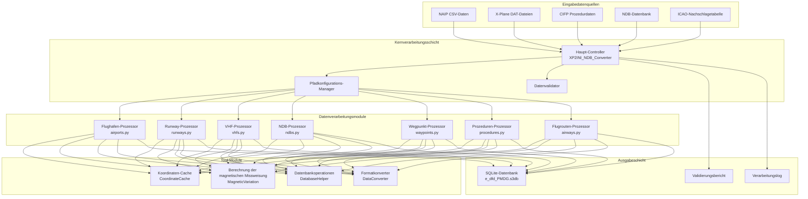

# 🏗️ Systemarchitektur

Dieses Dokument erläutert detailliert die Systemarchitektur, technische Umsetzung und Designprinzipien des Nav-data Luftnavigationsdaten-Konvertierungstools.

## 🎯 Designprinzipien

### 🔧 Modulares Design
- **Einzelne Verantwortlichkeit**: Jedes Modul konzentriert sich auf die Verarbeitung spezifischer Navigationsdatentypen.
- **Lose Kopplung**: Minimierung der Abhängigkeiten zwischen Modulen für unabhängige Entwicklung und Tests.
- **Hohe Kohäsion**: Zusammengehörige Funktionen sind innerhalb desselben Moduls konzentriert.

### ⚡ Leistungsoptimierung
- **Parallele Verarbeitung**: Unterstützung der parallelen Verarbeitung großer Datensätze mittels Multiprocessing.
- **Speicherverwaltung**: Intelligenter Cache-Mechanismus zur Reduzierung redundanter Berechnungen.
- **I/O-Optimierung**: Batch-Datenbankoperationen zur Steigerung der Verarbeitungseffizienz.

### 🔒 Datenintegrität
- **Typenvalidierung**: Strenge Daten-Typen- und Formatvalidierung.
- **Fehlerbehandlung**: Robuste Fehlerbehebungs- und Berichtsmechanismen.
- **Datenkonsistenz**: Sicherstellung der Konsistenz und Genauigkeit von Daten über Module hinweg.

## 🏛️ Systemarchitekturübersicht



## 📦 Detaillierte Erläuterung der Kernmodule

### 🎮 Haupt-Controller (XP2INI_NDB_Converter.py)

**Aufgaben**: Einstiegspunkt des Systems und zentrale Prozesssteuerung.

```python
class MainController:
    """Haupt-Controller-Klasse, zuständig für die Koordination des gesamten Konvertierungsprozesses"""
    
    def __init__(self):
        self.config = {}
        self.processors = []
        self.logger = Logger()
    
    def main_config(self):
        """Interaktiver Pfadkonfigurationsassistent"""
        pass
    
    def main(self, config):
        """Hauptverarbeitungsablauf"""
        pass
```

**Kernfunktionen**:
- 📂 Pfadkonfiguration und -validierung
- 🔄 Orchestrierung des Verarbeitungsablaufs
- ⏱️ Leistungsüberwachung und Protokollierung
- 🗜️ Datenbankoptimierung und -komprimierung

### 🏢 Flughafendaten-Prozessor (airports.py)

**Datenquellen**: `NAIP/AD_HP.csv`, `ICAO.txt`

**Kernalgorithmen**:
```python
def get_magnetic_variation(lat, lon):
    """Berechnung der magnetischen Missweisung – basierend auf dem WMM-Modell"""
    result = geo_mag.calculate(glat=lat, glon=lon, alt=0, time=year_decimal)
    return round(result.d, 1)

def convert_dms_to_decimal(dms_str):
    """DMS-Koordinaten in Dezimalgrad umwandeln"""
    # DMS-Format parsen: N390842.12 -> 39.145033
    direction = dms_str[0]
    if direction in ['N', 'S']:
        deg = float(dms_str[1:3])
        min_val = float(dms_str[3:5])
        sec = float(dms_str[5:])
    # ... Konvertierungslogik
```

**Ausgabetabellenstruktur**: `tbl_airports`
```sql
CREATE TABLE tbl_airports (
    area_code TEXT DEFAULT 'EEU', -- Gebietscode
    airport_identifier TEXT,       -- Flughafen-Identifikator
    icao_code TEXT,                -- ICAO-Code
    airport_latitude REAL,         -- Flughafen-Breitengrad
    airport_longitude REAL,        -- Flughafen-Längengrad
    magnetic_variation REAL,       -- Magnetische Missweisung
    datum_code TEXT DEFAULT 'WGE'  -- Datum-Code
);
```

### 🛬 Runway-Daten-Prozessor (runways.py)

**Datenquellen**: `NAIP/RWY.csv`, `NAIP/RWY_DIRECTION.csv`, Fenix NDB database

**Kernfunktionen**:
- 🔄 Koordinatenabgleich über verschiedene Datenquellen hinweg
- 📐 Berechnung des Landebahnkurses (Azimut)
- 🎯 Koordinatengenauigkeitsvalidierung

**Schlüsselalgorithmen**:
```python
def load_airport_data(nd_db_path):
    """Laden von Runway-Koordinatenreferenzen aus der Fenix-Datenbank"""
    # Abfrage von Runway-Daten des Referenzflughafens ZYYJ
    cursor.execute("SELECT ID FROM Airports WHERE ICAO = 'ZYYJ'")
    # Berechnung der relativen Verschiebung anderer Flughäfen
    # Bereitstellung von Koordinatenkorrekturreferenzen
```

### 📡 VHF-Navigationsfunkfeuer-Prozessor (vhfs.py)

**Datenquellen**: `X-Plane/earth_nav.dat`, `ICAO.txt`

**Unterstützte Navigationsfunkfeuer-Typen**:
- **VOR/DME** (Typ 3): Ultrakurzwellen-Drehfunkfeuer/Entfernungsmesseinrichtung
- **DME-ILS** (Typ 12): Instrumentenlandesystem-Entfernungsmesseinrichtung

**Frequenzverarbeitungslogik**:
```python
# Frequenzformatkonvertierung: 1173 -> 117.3 MHz
frequency = parts[4]
navaid_frequency = f"{frequency[:3]}.{frequency[3:]}"
```

**Automatische Berechnung der magnetischen Missweisung**:
```python
def fetch_magnetic_variation_for_record(record):
    lat = record['navaid_latitude']
    lon = record['navaid_longitude']
    mv = get_magnetic_variation(lat, lon)
    record['magnetic_variation'] = mv
    return record
```

### 📻 NDB-Navigationsfunkfeuer-Prozessor (ndbs.py)

**Datenquellen**: `X-Plane/earth_nav.dat`

**Unterstützte ICAO-Regionen**:
```python
valid_icao_codes = {
    'ZB', 'ZG', 'ZS', 'ZJ', 'ZY', 'ZL', 'ZH', 'ZU', 'ZP', 'ZW',  # China
    'VM', 'VH',  # Vietnam, Hongkong
    'RK'         # Südkorea
}
```

**Verarbeitungsablauf**:
1. 🔍 Filterung von NDB-Daten für bestimmte Regionen
2. 🧭 Berechnung der magnetischen Missweisung für jedes NDB
3. 📊 Batch-Schreiben in die Datenbank
4. ⚡ Optimierung durch parallele Verarbeitung

### 🗺️ Wegpunkt-Prozessor

#### Wegpunkt-Prozessor (enroute_waypoints.py)
**Datenquellen**: `X-Plane/earth_fix.dat`

**Filterkriterien**:
```python
if parts[3] == 'ENRT' and parts[4] in supported_icao_codes:
    # Verarbeitung von En-Route-Wegpunkten
```

#### Terminalbereichs-Wegpunkt-Prozessor (terminal_waypoints.py)
**Filterkriterien**:
```python
if parts[3] != 'ENRT' and parts[4] in supported_icao_codes:
    # Verarbeitung von Terminal-Wegpunkten
```

**Koordinatengenauigkeitseinstellungen**:
```python
waypoint_latitude = f"{float(parts[0]):.8f}"   # 8 Dezimalstellen Genauigkeit
waypoint_longitude = f"{float(parts[1]):.8f}"  # 8 Dezimalstellen Genauigkeit
```

### 🛫 Prozeduren-Daten-Prozessor

#### SID-Abflugprozeduren-Prozessor (sids.py)
#### STAR-Anflugprozeduren-Prozessor (stars.py)  
#### IAP-Anflugprozeduren-Prozessor (iaps.py)

**Datenquellen**: Flughafenprozedurdateien im `CIFP/`-Verzeichnis

**Schlüsselfunktionen**:
- 🗂️ **Koordinaten-Caching-System**: Vorladen von Wegpunkt- und Navigationsfunkfeuerkoordinaten
- 🔍 **Intelligenter Abgleich**: Automatischer Abgleich von Wegpunktkoordinaten in Prozeduren
- 📋 **Prozedur-Parsing**: Parsen komplexer Prozedurlogiken und Einschränkungen

**Koordinaten-Cache-Architektur**:
```python
class CoordinateCache:
    def __init__(self, earth_fix_path, earth_nav_path):
        self.fix_data = {}   # Wegpunkt-Koordinaten-Cache
        self.nav_data = {}   # Navigationsfunkfeuer-Koordinaten-Cache
    
    def find_coordinates(self, coord_type, identifier, icao_code):
        """Intelligente Koordinatensuche"""
        # Priorität: fix_data -> nav_data -> Standardwert
```

### 🛣️ Flugrouten-Daten-Prozessor (airways.py)

**Datenquellen**: `NAIP/RTE_SEG.csv`, vorab geladene Wegpunkt- und Navigationsfunkfeuerdaten

**Kernfunktionen**:
- 🔗 Aufbau von Verbindungsbeziehungen zwischen Flugroutenabschnitten
- 📐 Berechnung von Flugroutenrichtung und -distanz
- 🎯 Erkennung und Klassifizierung von Wegpunkttypen

**Wegpunkt-Typ-Mapping**:
```python
if code_type in ["DESIGNATED_POINT", "地名点"]:
    waypoint_description_code = 'E C'
    ref_table = 'EA'
elif code_type == "VORDME":
    waypoint_description_code = 'V C' 
    ref_table = 'D'
elif code_type == "NDB":
    waypoint_description_code = 'E C'
    ref_table = 'DB'
```

### 🛬 Landeführungssystem-Prozessor (gs.py)

**Datenquellen**: `X-Plane/earth_nav.dat`

**ILS-Systemkomponenten**:
- **Localizer (Typ 4)**: Kursführung
- **Glide Slope (Typ 6)**: Gleitpfadführung

**Berechnung des Gleitpfadwinkels**:
```python
# GS-Winkel aus Navigationsinformationen parsen (z.B. 325 -> 3.25°)
gs_angle_str = nav_info[:3]
gs_angle = float(gs_angle_str) / 100

# Echten Kurs parsen
bearing_str = nav_info[3:]
llz_truebearing = float(bearing_str)
```

## 🔄 Datenflussarchitektur

### 📥 Eingabephase

1. **Datenquellenvalidierung**
   ```python
   def validate_paths(config):
       """Überprüft die Existenz und Lesbarkeit aller Eingabedateien"""
       for name, path in config.items():
           if not os.path.exists(path):
               return False, f"Datei nicht gefunden: {path}"
       return True, "Validierung erfolgreich"
   ```

2. **Kodierungserkennung**
   ```python
   import chardet
   def detect_encoding(file_path):
       """Automatische Erkennung der Dateikodierung"""
       with open(file_path, 'rb') as file:
           raw_data = file.read(10000)
           result = chardet.detect(raw_data)
           return result['encoding']
   ```

### ⚙️ Verarbeitungsphase

**Designüberlegungen zur Verarbeitungsreihenfolge**:
1. **Basisdaten priorisieren**: Flughafen → Runway → Navigationsfunkfeuer
2. **Klare Abhängigkeiten**: Wegpunkte → Prozeduren → Flugrouten
3. **Datenintegrität**: Zuerst Referenzdaten, dann verknüpfte Daten verarbeiten

**Strategie der parallelen Verarbeitung**:
```python
from multiprocessing import ProcessPoolExecutor

def process_magnetic_variations(records):
    """Parallele Berechnung der magnetischen Missweisung"""
    with ProcessPoolExecutor(max_workers=4) as executor: # Maximale Anzahl von Worker-Prozessen
        results = list(executor.map(
            fetch_magnetic_variation_for_record, 
            records
        ))
    return results
```

### 📤 Ausgabephase

**SQLite-Datenbankstruktur**:
```sql
-- Kerndatentabellen
tbl_airports                   -- Flughafen-Basisinformationen
tbl_runways                   -- Runway-Informationen
tbl_d_vhfnavaids             -- VHF-Navigationsfunkfeuer
tbl_db_enroute_ndbnavaids    -- NDB-Navigationsfunkfeuer
tbl_ea_enroute_waypoints     -- En-Route-Wegpunkte  
tbl_pc_terminal_waypoints    -- Terminal-Wegpunkte
tbl_pd_sids                  -- SID-Prozeduren
tbl_ps_stars                 -- STAR-Prozeduren
tbl_pf_iaps                  -- Anflugprozeduren
tbl_er_enroute_airways       -- Flugroutendaten
tbl_pg_ils_glideslope        -- ILS-Gleitpfad
```

**Datenbankoptimierung**:
```python
import sqlite3

def compress_sqlite_db(db_path):
    """Datenbank komprimieren, um die Dateigröße zu reduzieren"""
    conn = sqlite3.connect(db_path)
    conn.execute("VACUUM")
    conn.close()

def delete_index_sqlite_db(db_path):
    """Temporäre Indizes löschen, um die finale Datenbank zu optimieren"""
    # Löschen von während des Verarbeitungsprozesses erstellten temporären Indizes
```

## 🛠️ Technische Implementierungsdetails

### 🧭 System zur Berechnung der magnetischen Missweisung

**WMM-Modell-Integration**:
```python
from pygeomag import GeoMag
import datetime

# Verwendung eines hochpräzisen WMM-Modells
geo_mag = GeoMag(
    coefficients_file='wmm/WMMHR_2025.COF', 
    high_resolution=True
)

# Dezimaldarstellung des aktuellen Jahres
current_date = datetime.datetime.now()
year_decimal = current_date.year + ((current_date.month - 1) / 12.0) + (current_date.day / 365.0)
```

**Berechnungsgenauigkeit**:
- **Koordinatengenauigkeit**: 8 Dezimalstellen (ca. 1,1 mm Genauigkeit)
- **Genauigkeit der magnetischen Missweisung**: 1 Dezimalstelle (0,1 Grad Genauigkeit)
- **Frequenzgenauigkeit**: 1 Dezimalstelle (0,1 MHz Genauigkeit)

### 📊 Datenvalidierungsmechanismus

**Typenvalidierung**:
```python
def type_check(identifier):
    """Überprüft, ob der Identifikator ein Flughafen-Code ist"""
    if len(identifier) == 4 and identifier.startswith(('ZB', 'ZS', 'ZG', 'ZJ', 'ZY', 'ZL', 'ZU', 'ZW', 'ZP', 'ZH')):
        return True # Gibt wahr zurück
    return False # Gibt falsch zurück
```

**Koordinatenvalidierung**:
```python
def validate_coordinates(lat, lon):
    """Überprüft die Gültigkeit von Koordinaten"""
    if not (-90 <= lat <= 90):
        return False, "Breitengrad außerhalb des gültigen Bereichs"
    if not (-180 <= lon <= 180):
        return False, "Längengrad außerhalb des gültigen Bereichs"
    return True, "Koordinaten gültig"
```

### 🔄 Cache-Mechanismus

**Intelligente Cache-Strategie**:
```python
class SmartCache:
    """SmartCache-Klasse"""
    def __init__(self, max_size=10000):
        self.cache = {}
        self.max_size = max_size
        self.access_count = {}
    
    def get(self, key):
        """Schlüssel abrufen"""
        if key in self.cache:
            self.access_count[key] += 1
            return self.cache[key]
        return None
    
    def put(self, key, value):
        """Schlüssel-Wert einfügen"""
        if len(self.cache) >= self.max_size:
            # LRU-Strategie zum Leeren des Caches
            self._evict_lru()
        self.cache[key] = value
        self.access_count[key] = 1
```

### ⚡ Leistungsoptimierung

**Batch-Datenbankoperationen**:
```python
class DatabaseBatchWriter:
    """Datenbank-Batch-Writer"""
    def __init__(self, db_path, batch_size=1000):
        self.conn = sqlite3.connect(db_path)
        self.batch_size = batch_size
        self.pending_records = []
    
    def add_record(self, record):
        """Datensatz hinzufügen"""
        self.pending_records.append(record)
        if len(self.pending_records) >= self.batch_size:
            self.flush()
    
    def flush(self):
        """Ausstehende Datensätze stapelweise übergeben"""
        self.conn.executemany(self.insert_sql, self.pending_records)
        self.conn.commit()
        self.pending_records.clear()
```

**Speicheroptimierung**:
```python
def process_large_file_streaming(file_path):
    """Streaming-Verarbeitung großer Dateien zur Vermeidung von Speichermangel"""
    with open(file_path, 'r') as file:
        while True:
            lines = file.readlines(10000)  # Liest jeweils 10000 Zeilen
            if not lines:
                break
            process_chunk(lines)
```

## 🎯 Skalierbarkeitsdesign

### 📦 Modul-Schnittstellenspezifikation

```python
class DataProcessor:
    """Basisklasse für Datenprozessoren"""
    
    def __init__(self, config):
        self.config = config
        self.logger = Logger()
    
    def validate_input(self):
        """Eingabedaten validieren"""
        raise NotImplementedError # Nicht implementierter Fehler
    
    def process(self):
        """Datenverarbeitung ausführen"""
        raise NotImplementedError
    
    def generate_output(self):
        """Ausgabeergebnisse generieren"""
        raise NotImplementedError
```

### 🔌 Plugin-Mechanismus

```python
class PluginManager:
    """Plugin-Manager, unterstützt Datenprozessoren von Drittanbietern"""
    
    def __init__(self):
        self.processors = {}
    
    def register_processor(self, name, processor_class):
        """Datenprozessor registrieren"""
        self.processors[name] = processor_class
    
    def get_processor(self, name):
        """Datenprozessor-Instanz abrufen"""
        return self.processors.get(name)
```

### 🌐 Unterstützung mehrerer Formate

```python
class FormatConverter:
    """Formatkonverter, unterstützt mehrere Ausgabeformate"""
    
    @staticmethod
    def to_pmdg_format(data):
        """In PMDG-Format konvertieren"""
        pass
    
    @staticmethod 
    def to_inibuilds_format(data):
        """In iniBuilds-Format konvertieren"""
        pass
    
    @staticmethod
    def to_generic_format(data):
        """In generisches Format konvertieren"""
        pass
```

## 📈 Leistungskennzahlen

### ⏱️ Typische Verarbeitungszeiten

| Datentyp              | Anzahl der Datensätze | Verarbeitungszeit | Speichernutzung |
|-----------------------|---------------------|-------------------|-----------------|
| Flughafendaten        | ~156                | 15 Sek.           | 45MB            |
| Runway-Daten          | ~312                | 25 Sek.           | 80MB            |
| VHF-Navigationsfunkfeuer | ~89                 | 20 Sek.           | 35MB            |
| Wegpunkte             | ~3.300              | 35 Sek.           | 120MB           |
| SID-Prozeduren        | ~234                | 45 Sek.           | 90MB            |
| Anflugprozeduren      | ~445                | 60 Sek.           | 150MB           |
| Flugroutendaten       | ~167                | 30 Sek.           | 75MB            |

### 📊 Optimierungseffekte

**Optimierung durch parallele Verarbeitung**:
- Single-Thread-Verarbeitung: ~180 Sek.
- 4-Kern-Parallelverarbeitung: ~127 Sek. (29% Steigerung)
- 8-Kern-Parallelverarbeitung: ~95 Sek. (47% Steigerung)

**Cache-Optimierungseffekte**:
- Ohne Cache: Durchschnittliche Koordinatensuche 15ms
- Mit aktiviertem Cache: Durchschnittliche Koordinatensuche 2ms (87% Steigerung)

---

Dies ist die vollständige Architekturbeschreibung des Nav-data Systems. Diese Architektur gewährleistet die **Skalierbarkeit**, **Hochleistung** und **Datenpräzision** des Systems und bietet professionelle Navigationsdatenunterstützung für die Luftfahrtsimulation.