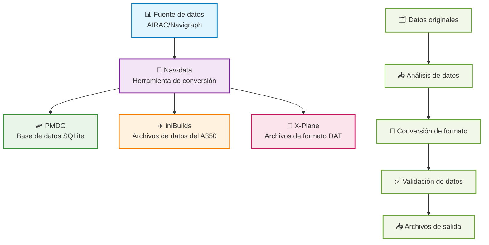

# Bienvenido a la documentación de Nav-data 🚀

Nav-data es un proyecto de conversión de datos mantenido por entusiastas de la aviación, dedicado a proporcionar soporte de datos de navegación de alta calidad para simuladores de vuelo (como Microsoft Flight Simulator). Ya seas desarrollador, piloto o aficionado, aquí encontrarás los recursos y guías que necesitas.

## 🔄 Proceso de conversión de datos

---

## ✨ Características del proyecto

  

    
📦

    <h3>Soporte multiplataforma</h3>
    
Compatible con las principales plataformas de simuladores de vuelo como PMDG, iniBuilds, X-Plane, etc.

  

  
  

    
🛫

    <h3>Guías detalladas</h3>
    
Ofrece guías completas de configuración, instalación y uso, para que los principiantes puedan empezar fácilmente.

  

  
  

    
🗂️

    <h3>Estructura clara</h3>
    
Estructura de datos clara, fácil de extender y mantener, soporta configuración personalizada.

  

  
  

    
🤝

    <h3>Colaboración de código abierto</h3>
    
Damos la bienvenida a las contribuciones y la colaboración de la comunidad para construir juntos mejores herramientas de datos de navegación.

  

---

## 🚀 Inicio rápido
1. Selecciona tu complemento: [Guía PMDG](/PMDG/guide/index) | [Guía iniBuilds](/iniBuilds/guide/index)
2. Sigue la guía para la configuración e instalación
3. ¡Disfruta de una experiencia de vuelo más realista!

---

## 🧭 Navegación rápida

### 📊 Comparación de soporte de plataformas

  <table>
    <thead>
      <tr>
        <th>Característica</th>
        <th>🛩️ PMDG</th>
        <th>✈️ iniBuilds</th>
        <th>🛫 X-Plane</th>
      </tr>
    </thead>
    <tbody>
      <tr>
        <td><strong>Aviones soportados</strong></td>
        <td>Serie 737, Serie 777</td>
        <td>A350</td>
        <td>Todos los aviones de X-Plane</td>
      </tr>
      <tr>
        <td><strong>Formato de datos</strong></td>
        <td>Base de datos SQLite</td>
        <td>Archivo de datos dedicado</td>
        <td>Archivos de formato DAT</td>
      </tr>
      <tr>
        <td><strong>Dificultad de instalación</strong></td>
        <td><StatusBadge type="warning" text="Media" icon="⚠️" /></td>
        <td><StatusBadge type="success" text="Fácil" icon="✅" /></td>
        <td><StatusBadge type="error" text="Compleja" icon="🔴" /></td>
      </tr>
      <tr>
        <td><strong>Cobertura de datos</strong></td>
        <td><StatusBadge type="success" text="Completa" icon="✅" /></td>
        <td><StatusBadge type="success" text="Completa" icon="✅" /></td>
        <td><StatusBadge type="warning" text="Parcial" icon="⚠️" /></td>
      </tr>
      <tr>
        <td><strong>Frecuencia de actualización</strong></td>
        <td>Ciclo AIRAC</td>
        <td>Ciclo AIRAC</td>
        <td>Bajo demanda</td>
      </tr>
    </tbody>
  </table>

### 📚 Guías de uso

  <a href="/PMDG/guide/index" class="guide-link pmdg">
    
🛩️

    

      <h3>Guía PMDG</h3>
      
Tutorial completo de conversión de datos de navegación para aviones PMDG

    

  </a>
  
  <a href="/iniBuilds/guide/index" class="guide-link inibuilds">
    
✈️

    

      <h3>Guía iniBuilds</h3>
      
Guía de conversión de datos de navegación para iniBuilds A350

    

  </a>
  
  <a href="/X-Plane/guide/index" class="guide-link xplane">
    
🛫

    

      <h3>Guía X-Plane</h3>
      
Proceso completo de procesamiento de datos de navegación para X-Plane

    

  </a>

### 🆘 Obtener ayuda

  

    <h4>🛩️ Soporte PMDG</h4>
    <ul>
      <li><a href="/PMDG/faq">Preguntas frecuentes</a></li>
      <li><a href="/PMDG/troubleshooting">Guía de solución de problemas</a></li>
    </ul>
  

  
  

    <h4>✈️ Soporte iniBuilds</h4>
    <ul>
      <li><a href="/iniBuilds/faq">Preguntas frecuentes</a></li>
      <li><a href="/iniBuilds/troubleshooting">Guía de solución de problemas</a></li>
    </ul>
  

  
  

    <h4>🛫 Soporte X-Plane</h4>
    <ul>
      <li><a href="/X-Plane/faq">Preguntas frecuentes</a></li>
      <li><a href="/X-Plane/troubleshooting">Guía de solución de problemas</a></li>
    </ul>
  

### 🔧 Documentación técnica

  <a href="/iniBuilds/architecture" class="tech-link">
    🏗️
    Descripción de la arquitectura del proyecto
  </a>
  <a href="/iniBuilds/contributing" class="tech-link">
    🤝
    Guía de contribución
  </a>
  <a href="/iniBuilds/changelog" class="tech-link">
    📋
    Registro de cambios
  </a>

---

## 🌍 Únete a nosotros & Envía tus comentarios
- GitHub: [nav-data](https://github.com/nav-data)
- ¿Tienes sugerencias o preguntas? ¡Contáctanos a través de [Issue](https://github.com/nav-data/nav-data/issues) o por correo electrónico!
