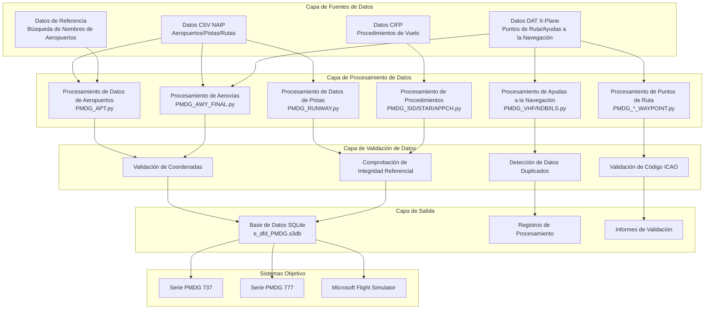
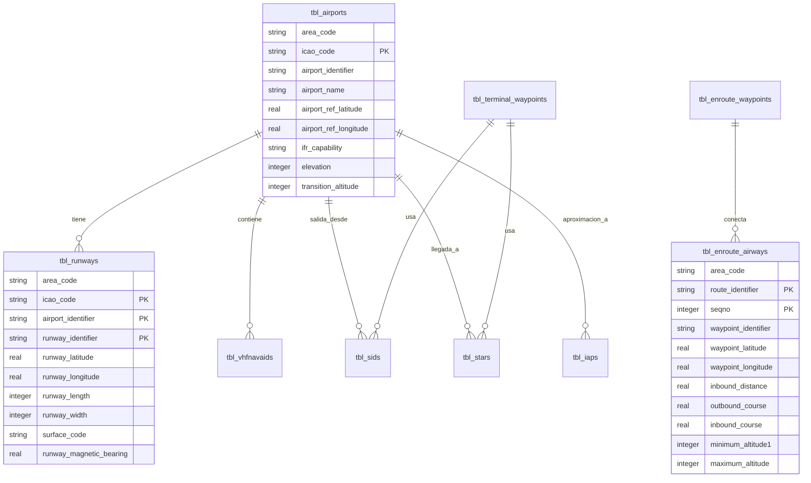
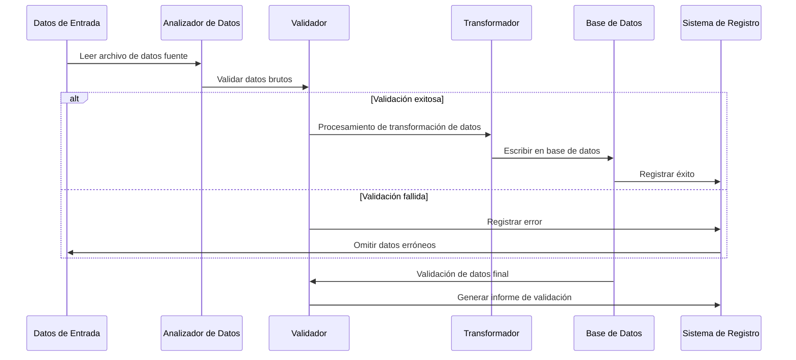

# 🏗️ Arquitectura Técnica

Este documento profundiza en la arquitectura del sistema, los principios de diseño y los detalles de implementación técnica de Nav-data, proporcionando una referencia técnica completa para desarrolladores y usuarios técnicos.

## 📐 Visión General de la Arquitectura del Sistema

### Diagrama de Arquitectura General



### Descripción de Componentes Clave

| Componente | Función | Tecnologías | Características Clave |
|------------|---------|-------------|-----------------------|
| **Analizador de Datos** | Lectura de datos multiformato | pandas, chardet | Detección automática de codificación, manejo de errores |
| **Convertidor de Coordenadas** | Procesamiento de coordenadas geográficas | Algoritmo personalizado | Conversión DMS↔Decimal, control de precisión |
| **Calculadora de Declinación Magnética** | Cálculo de declinación magnética | pygeomag | Modelo WMM2025, cálculo de alta precisión |
| **Motor de Base de Datos** | Base de datos SQLite | sqlite3 | Modo compatible con PMDG, procesamiento de transacciones |
| **Motor de Validación** | Garantía de calidad de datos | Validadores personalizados | Validación multicapa, informes detallados |
| **Procesador Concurrente** | Optimización de rendimiento | ThreadPoolExecutor | Procesamiento multihilo, monitoreo de progreso |

## 🧩 Diseño de la Arquitectura Modular

### 1. Módulo de Procesamiento de Datos

#### Procesamiento de Datos de Aeropuertos (`PMDG_APT.py`)

```python
class AirportProcessor:
    """Procesador de datos de aeropuertos"""
    
    def __init__(self):
        self.csv_parser = CSVParser(encoding='latin1')
        self.coordinate_converter = CoordinateConverter()
        self.database_writer = DatabaseWriter()
    
    def process(self) -> ProcessResult:
        """Flujo principal de procesamiento"""
        # 1. Leer datos de aeropuertos NAIP
        airports_data = self.csv_parser.read_csv(self.csv_file_path)
        
        # 2. Leer tabla de búsqueda de nombres de aeropuertos
        name_lookup = self.load_airport_names()
        
        # 3. Procesamiento y conversión de datos
        processed_data = []
        for airport in airports_data:
            # Conversión de coordenadas: DMS -> Decimal
            lat, lon = self.coordinate_converter.dms_to_decimal(
                airport['GEO_LAT_ACCURACY'],
                airport['GEO_LONG_ACCURACY']
            )
            
            # Validación y limpieza de datos
            if self.validate_airport_data(airport, lat, lon):
                processed_data.append({
                    'icao_code': airport['CODE_ID'][:2],
                    'airport_identifier': airport['CODE_ID'],
                    'airport_name': name_lookup.get(airport['CODE_ID'], 'UNKNOWN'),
                    'latitude': lat,
                    'longitude': lon,
                    # ... Otros campos
                })
        
        # 4. Escribir en la base de datos
        return self.database_writer.write_airports(processed_data)
```

#### Procesamiento de Datos de Aerovías (`PMDG_AWY_FINAL.py`)

Este es el módulo más complejo, que contiene un algoritmo de fusión inteligente de aerovías:

```python
class AirwayProcessor:
    """Procesador de datos de aerovías - Soporta fusión inteligente"""
    
    def process_airways(self):
        """Flujo principal de procesamiento de aerovías"""
        # 1. Leer datos de segmentos de aerovía CSV
        route_segments = self.read_route_segments()
        
        # 2. Coincidir coordenadas de puntos de ruta
        for segment in route_segments:
            icao_code, lat, lon = self.match_waypoint_coordinates(
                segment['waypoint_identifier'],
                segment['code_type']
            )
            segment.update({'lat': lat, 'lon': lon, 'icao': icao_code})
        
        # 3. Fusión inteligente de aerovías
        for route_id in self.get_unique_routes():
            existing_route = self.get_existing_route(route_id)
            new_segments = self.get_route_segments(route_id)
            
            merged_route = self.intelligent_merge(existing_route, new_segments)
            
            # 4. Recalcular distancia de segmento y rumbo
            self.recalculate_route_geometry(merged_route)
            
            # 5. Actualizar la base de datos
            self.update_route_in_database(route_id, merged_route)
    
    def intelligent_merge(self, existing, new_segments):
        """Algoritmo de fusión inteligente de aerovías"""
        if not existing:
            return new_segments
        
        # Buscar puntos de ruta comunes
        common_points = self.find_common_waypoints(existing, new_segments)
        
        if not common_points:
            # Sin puntos comunes - Añadir directamente
            return self.append_segments(existing, new_segments)
        else:
            # Con puntos comunes - Insertar inteligentemente
            return self.insert_missing_segments(existing, new_segments, common_points)
```

### 2. Arquitectura de Validación de Datos

#### Sistema de Validación Multicapa

```python
class ValidationEngine:
    """Motor de validación de datos"""
    
    def __init__(self):
        self.validators = [
            CoordinateValidator(),
            ICAOCodeValidator(),
            ReferenceIntegrityValidator(),
            DuplicateDetector(),
            BusinessRuleValidator()
        ]
    
    def validate(self, data: dict) -> ValidationResult:
        """Ejecuta validación multicapa"""
        result = ValidationResult()
        
        for validator in self.validators:
            validator_result = validator.validate(data)
            result.merge(validator_result)
            
            # Detener validación en caso de error grave
            if validator_result.has_critical_errors():
                break
        
        return result

class CoordinateValidator:
    """Validador de coordenadas"""
    
    # Límites de coordenadas para la región de China
    CHINA_BOUNDS = {
        'lat_min': 15.0, 'lat_max': 55.0,
        'lon_min': 70.0, 'lon_max': 140.0
    }
    
    def validate(self, data: dict) -> ValidationResult:
        lat, lon = data.get('latitude'), data.get('longitude')
        
        if not self.is_valid_coordinate(lat, lon):
            return ValidationResult.error(f"Coordenadas fuera del rango para la región de China: {lat}, {lon}")
        
        return ValidationResult.success()
```

### 3. Arquitectura de Procesamiento Concurrente

#### Diseño de Procesamiento Multihilo

```python
class ConcurrentProcessor:
    """Procesador concurrente"""
    
    def __init__(self, max_workers=50):
        self.max_workers = min(max_workers, multiprocessing.cpu_count() * 2)
        self.progress_tracker = ProgressTracker()
    
    def process_in_parallel(self, tasks: List[Task]) -> List[Result]:
        """Procesa tareas en paralelo"""
        results = []
        
        with ThreadPoolExecutor(max_workers=self.max_workers) as executor:
            # Enviar todas las tareas
            future_to_task = {
                executor.submit(self.process_task, task): task 
                for task in tasks
            }
            
            # Recopilar resultados y actualizar progreso
            for future in as_completed(future_to_task):
                task = future_to_task[future]
                try:
                    result = future.result()
                    results.append(result)
                    self.progress_tracker.update()
                except Exception as e:
                    logging.error(f"La tarea {task.id} falló: {e}")
        
        return results
```

## 🗄️ Diseño de Base de Datos

### Diagrama ER



### Detalles de la Estructura de las Tablas

#### Principios de Diseño de Tablas Clave

1.  **Compatibilidad PMDG**: Sigue estrictamente la estructura de tablas y la nomenclatura de campos de la base de datos PMDG
2.  **Estándares ICAO**: Soporta los estándares de datos de la Organización de Aviación Civil Internacional
3.  **Optimización de Rendimiento**: Diseño de índices razonable y selección de tipos de datos
4.  **Integridad de Datos**: Restricciones de clave externa y validación de reglas de negocio

#### Estructuras de Tablas Clave

```sql
-- Tabla de Aeropuertos
CREATE TABLE tbl_airports (
    area_code TEXT DEFAULT 'EEU',
    icao_code TEXT NOT NULL,
    airport_identifier TEXT PRIMARY KEY,
    airport_name TEXT,
    airport_ref_latitude REAL,
    airport_ref_longitude REAL,
    ifr_capability TEXT DEFAULT 'Y',
    longest_runway_surface_code TEXT,
    elevation INTEGER,
    transition_altitude INTEGER DEFAULT 18000,
    transition_level INTEGER,
    speed_limit INTEGER,
    speed_limit_altitude INTEGER,
    iata_ata_designator TEXT,
    id TEXT UNIQUE
);

-- Tabla de Aerovías
CREATE TABLE tbl_enroute_airways (
    area_code TEXT DEFAULT 'EEU',
    crusing_table_identifier TEXT DEFAULT 'EE',
    route_identifier TEXT NOT NULL,
    seqno INTEGER NOT NULL,
    icao_code TEXT,
    waypoint_identifier TEXT,
    waypoint_latitude REAL,
    waypoint_longitude REAL,
    waypoint_description_code TEXT,
    route_type TEXT DEFAULT 'O',
    inbound_course REAL DEFAULT 0.0,
    inbound_distance REAL DEFAULT 0.0,
    outbound_course REAL DEFAULT 0.0,
    minimum_altitude1 INTEGER DEFAULT 5000,
    minimum_altitude2 INTEGER,
    maximum_altitude INTEGER DEFAULT 99999,
    direction_restriction TEXT,
    flightlevel TEXT DEFAULT 'B',
    id TEXT,
    PRIMARY KEY (route_identifier, seqno)
);
```

## 🔄 Flujo de Procesamiento de Datos

### Pipeline de Procesamiento



### Estrategias de Manejo de Errores

```python
class ErrorHandler:
    """Estrategias de manejo de errores"""
    
    ERROR_STRATEGIES = {
        'missing_data': 'log_and_skip',
        'invalid_coordinates': 'log_and_skip', 
        'duplicate_records': 'log_and_merge',
        'reference_not_found': 'log_and_continue',
        'critical_error': 'stop_processing'
    }
    
    def handle_error(self, error_type: str, error_data: dict):
        strategy = self.ERROR_STRATEGIES.get(error_type, 'log_and_continue')
        
        if strategy == 'log_and_skip':
            self.log_error(error_data)
            return ProcessingAction.SKIP
        elif strategy == 'stop_processing':
            self.log_critical_error(error_data)
            raise ProcessingException(error_data)
        # ... Otras estrategias
```

## 🎯 Diseño de Optimización de Rendimiento

### Gestión de Memoria

```python
class MemoryManager:
    """Administrador de memoria"""
    
    def __init__(self, max_memory_mb=2048):
        self.max_memory = max_memory_mb * 1024 * 1024
        self.current_usage = 0
    
    def process_in_batches(self, data_source, batch_size=1000):
        """Procesa grandes conjuntos de datos en lotes"""
        batch = []
        
        for item in data_source:
            batch.append(item)
            self.current_usage += sys.getsizeof(item)
            
            if len(batch) >= batch_size or self.memory_threshold_reached():
                yield batch
                batch = []
                self.gc_collect()  # Recolección forzada de basura
    
    def memory_threshold_reached(self) -> bool:
        return self.current_usage > self.max_memory * 0.8
```

### Optimización de Base de Datos

```python
class DatabaseOptimizer:
    """Optimización del rendimiento de la base de datos"""
    
    PRAGMA_SETTINGS = {
        'journal_mode': 'DELETE',     # Modo compatible con PMDG
        'synchronous': 'FULL',        # Prioridad a la seguridad de datos
        'cache_size': 10000,          # Gran caché para mejorar el rendimiento
        'temp_store': 'MEMORY',       # Almacenar datos temporales en memoria
        'mmap_size': 268435456        # Mapeo de memoria de 256MB
    }
    
    def optimize_database(self, connection):
        """Aplica la configuración de optimización de rendimiento"""
        for pragma, value in self.PRAGMA_SETTINGS.items():
            connection.execute(f"PRAGMA {pragma} = {value}")
        
        # Crear índices clave
        self.create_performance_indexes(connection)
    
    def create_performance_indexes(self, connection):
        """Crea índices de optimización de rendimiento"""
        indexes = [
            "CREATE INDEX IF NOT EXISTS idx_airports_icao ON tbl_airports(icao_code)",
            "CREATE INDEX IF NOT EXISTS idx_airways_route ON tbl_enroute_airways(route_identifier)",
            "CREATE INDEX IF NOT EXISTS idx_waypoints_id ON tbl_enroute_waypoints(waypoint_identifier)",
        ]
        
        for index_sql in indexes:
            connection.execute(index_sql)
```

## 🔍 Sistema de Garantía de Calidad

### Marco de Validación de Datos

```python
class QualityAssurance:
    """Marco de garantía de calidad"""
    
    def __init__(self):
        self.validation_rules = self.load_validation_rules()
        self.test_cases = self.load_test_cases()
    
    def comprehensive_validation(self, database_path: str) -> QAReport:
        """Verificación de calidad exhaustiva"""
        report = QAReport()
        
        # 1. Validación de estructura
        report.add_section(self.validate_schema(database_path))
        
        # 2. Validación de integridad de datos
        report.add_section(self.validate_integrity(database_path))
        
        # 3. Validación de reglas de negocio
        report.add_section(self.validate_business_rules(database_path))
        
        # 4. Pruebas de rendimiento
        report.add_section(self.performance_benchmark(database_path))
        
        # 5. Pruebas de compatibilidad con PMDG
        report.add_section(self.pmdg_compatibility_test(database_path))
        
        return report
    
    def validate_business_rules(self, database_path: str) -> ValidationSection:
        """Validación de reglas de negocio"""
        rules = [
            "Las aerovías deben conectar puntos de ruta válidos",
            "Los aeropuertos deben tener al menos una pista",
            "Las frecuencias ILS deben estar dentro del rango válido",
            "Las restricciones de altitud de las aerovías deben ser razonables",
            "Las coordenadas deben estar dentro de la región de China"
        ]
        
        results = []
        for rule in rules:
            result = self.check_business_rule(database_path, rule)
            results.append(result)
        
        return ValidationSection("Validación de Reglas de Negocio", results)
```

## 🔧 Diseño de Extensibilidad

### Arquitectura de Plugins

```python
class PluginManager:
    """Administrador de plugins"""
    
    def __init__(self):
        self.processors = {}
        self.validators = {}
        self.exporters = {}
    
    def register_processor(self, name: str, processor_class):
        """Registra un plugin procesador de datos"""
        self.processors[name] = processor_class
    
    def register_validator(self, name: str, validator_class):
        """Registra un plugin validador"""
        self.validators[name] = validator_class
    
    def load_plugins(self, plugin_directory: str):
        """Carga plugins dinámicamente"""
        for plugin_file in glob.glob(f"{plugin_directory}/*.py"):
            plugin_module = importlib.import_module(plugin_file)
            if hasattr(plugin_module, 'register'):
                plugin_module.register(self)

# Plugin de ejemplo
class CustomAirportProcessor(BaseProcessor):
    """Plugin procesador de aeropuertos personalizado"""
    
    def process(self, data):
        # Lógica de procesamiento personalizada
        return super().process(data)

def register(plugin_manager):
    """Función de registro de plugins"""
    plugin_manager.register_processor('custom_airport', CustomAirportProcessor)
```

### Gestión de Configuración

```python
class ConfigurationManager:
    """Administrador de configuración"""
    
    def __init__(self, config_path: str = "config/settings.yaml"):
        self.config = self.load_config(config_path)
        self.validators = self.load_config_validators()
    
    def load_config(self, path: str) -> dict:
        """Carga el archivo de configuración"""
        with open(path, 'r', encoding='utf-8') as f:
            return yaml.safe_load(f)
    
    def validate_config(self) -> bool:
        """Valida la efectividad de la configuración"""
        for validator in self.validators:
            if not validator.validate(self.config):
                return False
        return True
    
    def get_nested_value(self, key_path: str, default=None):
        """Obtiene el valor de configuración anidado"""
        keys = key_path.split('.')
        value = self.config
        
        for key in keys:
            if isinstance(value, dict) and key in value:
                value = value[key]
            else:
                return default
        
        return value

# Ejemplo de archivo de configuración (settings.yaml)
"""
data_sources:
  naip:
    directory: "data/input/naip"
    encoding: "latin1"
  xplane:
    directory: "data/input/xplane"
    encoding: "utf-8"

processing:
  batch_size: 1000
  max_workers: 50
  memory_limit_mb: 2048

database:
  path: "data/output/e_dfd_PMDG.s3db"
  pragmas:
    journal_mode: "DELETE"
    synchronous: "FULL"

validation:
  coordinate_bounds:
    china:
      lat_min: 15.0
      lat_max: 55.0
      lon_min: 70.0
      lon_max: 140.0
"""
```

## 📊 Monitoreo y Registro

### Sistema de Registro Estructurado

```python
class StructuredLogger:
    """Sistema de registro estructurado"""
    
    def __init__(self, name: str):
        self.logger = logging.getLogger(name)
        self.setup_handlers()
    
    def setup_handlers(self):
        """Configura los manejadores de registro"""
        # Manejador de consola
        console_handler = logging.StreamHandler()
        console_handler.setFormatter(ColoredFormatter())
        
        # Manejador de archivo
        file_handler = RotatingFileHandler(
            f"logs/{self.logger.name}.log",
            maxBytes=10*1024*1024,
            backupCount=5
        )
        file_handler.setFormatter(JSONFormatter())
        
        self.logger.addHandler(console_handler)
        self.logger.addHandler(file_handler)
    
    def log_processing_start(self, module: str, input_size: int):
        """Registra el inicio del procesamiento"""
        self.logger.info("Processing started", extra={
            'module': module,
            'input_size': input_size,
            'timestamp': datetime.utcnow().isoformat(),
            'event_type': 'processing_start'
        })
    
    def log_processing_complete(self, module: str, output_size: int, duration: float):
        """Registra la finalización del procesamiento"""
        self.logger.info("Processing completed", extra={
            'module': module,
            'output_size': output_size,
            'duration_seconds': duration,
            'records_per_second': output_size / duration if duration > 0 else 0,
            'timestamp': datetime.utcnow().isoformat(),
            'event_type': 'processing_complete'
        })
```

## 🔒 Diseño de Seguridad

### Seguridad de Datos

```python
class SecurityManager:
    """Administrador de seguridad"""
    
    def __init__(self):
        self.input_sanitizer = InputSanitizer()
        self.path_validator = PathValidator()
    
    def validate_input_path(self, path: str) -> bool:
        """Valida la seguridad de la ruta de entrada"""
        # Prevenir ataques de Path Traversal
        normalized_path = os.path.normpath(path)
        if '..' in normalized_path:
            raise SecurityException("La ruta contiene caracteres ilegales")
        
        # Asegurar que la ruta esté dentro de los directorios permitidos
        allowed_dirs = ['data/input', 'config']
        if not any(normalized_path.startswith(allowed) for allowed in allowed_dirs):
            raise SecurityException("La ruta no está dentro de los directorios permitidos")
        
        return True
    
    def sanitize_sql_input(self, value: str) -> str:
        """Limpieza de entrada SQL"""
        if not isinstance(value, str):
            return value
        
        # Eliminar caracteres potenciales de inyección SQL
        dangerous_chars = ["'", '"', ';', '--', '/*', '*/']
        for char in dangerous_chars:
            value = value.replace(char, '')
        
        return value
```

---

Este documento de arquitectura técnica proporciona una visión técnica completa del proyecto Nav-data, cubriendo el diseño del sistema, el flujo de datos, la optimización del rendimiento, la garantía de calidad y la seguridad, entre otros aspectos. Los desarrolladores pueden basarse en esta arquitectura para el desarrollo secundario y la expansión de funcionalidades.