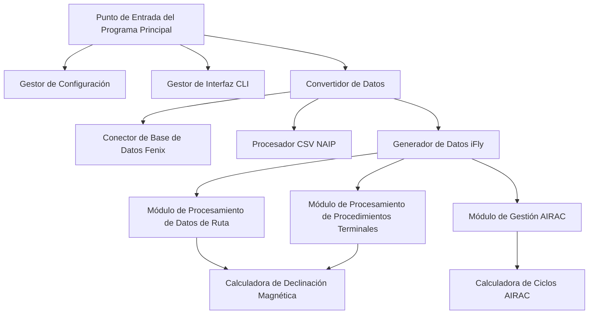
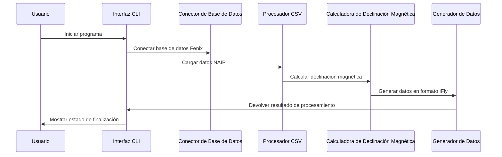

# 🏗️ Arquitectura del Convertidor de Datos de Navegación iFly

## Descripción General del Sistema

El Convertidor de Datos de Navegación iFly es una herramienta moderna de conversión de datos de navegación aeronáutica, específicamente diseñada para transformar la base de datos de navegación del Fenix A320 al formato de base de datos de navegación del iFly 737 MAX 8.

## 🎯 Principios de Diseño

### 1. Diseño Modular
- **Módulo de Procesamiento de Datos**: Procesamiento independiente de rutas y procedimientos terminales
- **Módulo de Interfaz**: Interfaz CLI moderna basada en la biblioteca Rich
- **Módulo de Configuración**: Sistema de gestión de configuración flexible
- **Módulo de Validación**: Verificaciones completas de integridad de datos

### 2. Arquitectura de Alto Rendimiento
- **Procesamiento Concurrente**: Cálculo de declinación magnética multi-hilo
- **Optimización de Memoria**: Procesamiento de datos por streaming
- **Cálculo Local**: Sin necesidad de llamadas a la API de red

### 3. Calidad de Nivel Empresarial
- **Sugerencias de Tipo**: Anotaciones de tipo de Python completas
- **Manejo de Errores**: Mecanismo de manejo de excepciones robusto
- **Cobertura de Pruebas**: Pruebas unitarias exhaustivas
- **Documentación Completa**: Documentación API detallada

## 🏗️ Arquitectura del Sistema

### Componentes Principales

### Flujo de Datos

## 🔧 Pila Tecnológica

### Dependencias Principales
- **Python 3.8+**: Lenguaje de programación principal
- **Rich**: Interfaz CLI moderna
- **pygeomag**: Cálculo de declinación magnética de alta precisión
- **pandas**: Procesamiento y análisis de datos
- **pathlib**: Gestión de rutas de archivos

### Tecnologías de Procesamiento de Datos
- **SQLite**: Acceso a la base de datos Fenix
- **CSV**: Formato de datos NAIP
- **WMM-2025**: Modelo geomagnético
- **AIRAC**: Ciclo de Revisión de Información Aeronáutica

## 📊 Características de Rendimiento

### Capacidad de Procesamiento
- **Rendimiento de Datos**: Procesa más de 10,000 puntos de ruta por minuto
- **Uso de Memoria**: Pico < 500MB
- **Cálculo de Declinación Magnética**: < 1ms/punto (cálculo local)
- **Capacidad Concurrente**: Soporta procesamiento multi-hilo

### Requisitos del Sistema
- **Memoria Mínima**: 4GB RAM
- **Espacio de Almacenamiento**: 100MB de espacio disponible
- **Procesador**: Doble núcleo 2.0GHz+
- **Sistema Operativo**: Windows 10/11, macOS, Linux

## 🔒 Diseño de Seguridad

### Protección de Datos
- **Validación de Entrada**: Estricta validación de formato de archivo
- **Aislamiento de Errores**: Manejo de errores que previene la corrupción de datos
- **Mecanismo de Respaldo**: Copia de seguridad automática de los datos originales
- **Control de Permisos**: Principio de mínimo privilegio

### Seguridad del Código
- **Seguridad de Tipos**: Sugerencias de tipos completas
- **Seguridad de Memoria**: Gestión automática de memoria
- **Seguridad de Excepciones**: Manejo de excepciones robusto
- **Limpieza de Entrada**: Previene ataques de inyección

## 🚀 Extensibilidad

### Extensión de Módulos
- **Extensión de Fuentes de Datos**: Soporte para nuevos formatos de fuentes de datos
- **Extensión de Formatos de Salida**: Soporte para nuevos formatos de destino
- **Extensión de Módulos de Cálculo**: Soporte para nuevos algoritmos de cálculo
- **Extensión de Interfaz**: Soporte para interfaz GUI

### Escalabilidad de Rendimiento
- **Procesamiento Distribuido**: Soporte para computación en clúster
- **Mecanismo de Caché**: Caché de datos inteligente
- **Optimización Paralela**: Procesamiento paralelo multi-proceso
- **Aceleración por Hardware**: Computación acelerada por GPU

## 🔄 Mantenibilidad

### Calidad del Código
- **Estándares de Código**: Estándar PEP 8
- **Documentación Completa**: 100% de cobertura de documentación API
- **Cobertura de Pruebas**: Más del 90% de cobertura de código
- **Análisis Estático**: Verificaciones automáticas de calidad de código

### Monitorización y Depuración
- **Registro Detallado**: Registro por niveles
- **Monitorización de Rendimiento**: Métricas de rendimiento en tiempo real
- **Seguimiento de Errores**: Pila de errores completa
- **Herramientas de Depuración**: Interfaz de depuración integrada

## 📈 Planificación Futura

### Objetivos a Corto Plazo (1-3 meses)
- Desarrollo de interfaz GUI
- Funcionalidad de procesamiento por lotes
- Herramientas de validación de datos
- Optimización del rendimiento

### Objetivos a Medio Plazo (3-6 meses)
- Soporte multi-formato
- Procesamiento en la nube
- Interfaz API
- Sistema de plugins

### Objetivos a Largo Plazo (6-12 meses)
- Optimización con aprendizaje automático
- Actualizaciones de datos en tiempo real
- Ecosistema comunitario
- Implementación a nivel empresarial

---

Este diseño arquitectónico garantiza la fiabilidad, el rendimiento y la mantenibilidad del Convertidor de Datos de Navegación iFly, ofreciendo a la comunidad de simulación de vuelo una solución de conversión de datos de nivel profesional.