# Bienvenue dans la documentation Nav-data 🚀

Nav-data est un projet de conversion de données maintenu conjointement par des passionnés d'aviation, dédié à la fourniture d'un support de données de navigation de haute qualité pour les simulateurs de vol (tels que Microsoft Flight Simulator). Que vous soyez développeur, pilote ou passionné, vous trouverez ici les ressources et les guides dont vous avez besoin.

## 🔄 Flux de conversion des données

```mermaid
graph TD
    A["📊 Sources de données<br/>AIRAC/Navigraph"] --> B["🔄 Nav-data<br/>Outil de conversion"]
    B --> C["🛩️ PMDG<br/>Base de données SQLite"]
    B --> D["✈️ iniBuilds<br/>Fichiers de données A350"]
    B --> E["🛫 X-Plane<br/>Fichiers au format DAT"]
    
    F["🗂️ Données brutes"] --> G["📥 Analyse des données"]
    G --> H["🔧 Conversion de format"]
    H --> I["✅ Validation des données"]
    I --> J["📤 Fichiers de sortie"]
    
    style A fill:#e1f5fe,stroke:#0277bd,stroke-width:2px
    style B fill:#f3e5f5,stroke:#7b1fa2,stroke-width:2px
    style C fill:#e8f5e8,stroke:#388e3c,stroke-width:2px
    style D fill:#fff3e0,stroke:#f57c00,stroke-width:2px
    style E fill:#fce4ec,stroke:#c2185b,stroke-width:2px
    
    style F fill:#f1f8e9,stroke:#689f38,stroke-width:2px
    style G fill:#f1f8e9,stroke:#689f38,stroke-width:2px
    style H fill:#f1f8e9,stroke:#689f38,stroke-width:2px
    style I fill:#f1f8e9,stroke:#689f38,stroke-width:2px
    style J fill:#f1f8e9,stroke:#689f38,stroke-width:2px
```

---

## ✨ Caractéristiques du projet

  

    
📦

    <h3>Support multiplateforme</h3>
    
Prend en charge les principales plateformes de simulateurs de vol comme PMDG, iniBuilds, X-Plane, etc.

  

  
  

    
🛫

    <h3>Guides détaillés</h3>
    
Fournit des guides complets de configuration, d'installation et d'utilisation, pour une prise en main facile même pour les débutants.

  

  
  

    
🗂️

    <h3>Structure claire</h3>
    
Structure des données claire, facile à étendre et à maintenir, prend en charge la configuration personnalisée.

  

  
  

    
🤝

    <h3>Collaboration open source</h3>
    
La contribution et la collaboration de la communauté sont les bienvenues pour construire ensemble de meilleurs outils de données de navigation.

  

---

## 🚀 Démarrage rapide
1. Choisissez votre extension : [Guide PMDG](/PMDG/guide/index) | [Guide iniBuilds](/iniBuilds/guide/index)
2. Suivez le guide pour la configuration et l'installation.
3. Profitez d'une expérience de vol plus réaliste !

---

## 🧭 Navigation rapide

### 📊 Comparaison du support des plateformes

  <table>
    <thead>
      <tr>
        <th>Caractéristique</th>
        <th>🛩️ PMDG</th>
        <th>✈️ iniBuilds</th>
        <th>🛫 X-Plane</th>
      </tr>
    </thead>
    <tbody>
      <tr>
        <td><strong>Avions supportés</strong></td>
        <td>Séries 737, séries 777</td>
        <td>A350</td>
        <td>Tous les avions X-Plane</td>
      </tr>
      <tr>
        <td><strong>Format des données</strong></td>
        <td>Base de données SQLite</td>
        <td>Fichier de données dédié</td>
        <td>Fichier au format DAT</td>
      </tr>
      <tr>
        <td><strong>Difficulté d'installation</strong></td>
        <td><StatusBadge type="warning" text="Moyenne" icon="⚠️" /></td>
        <td><StatusBadge type="success" text="Simple" icon="✅" /></td>
        <td><StatusBadge type="error" text="Complexe" icon="🔴" /></td>
      </tr>
      <tr>
        <td><strong>Couverture des données</strong></td>
        <td><StatusBadge type="success" text="Complète" icon="✅" /></td>
        <td><StatusBadge type="success" text="Complète" icon="✅" /></td>
        <td><StatusBadge type="warning" text="Partielle" icon="⚠️" /></td>
      </tr>
      <tr>
        <td><strong>Fréquence des mises à jour</strong></td>
        <td>Cycle AIRAC</td>
        <td>Cycle AIRAC</td>
        <td>Mises à jour à la demande</td>
      </tr>
    </tbody>
  </table>

### 📚 Guides d'utilisation

  <a href="/PMDG/guide/index" class="guide-link pmdg">
    
🛩️

    

      <h3>Guide PMDG</h3>
      
Tutoriel complet sur la conversion des données de navigation pour les avions PMDG

    

  </a>
  
  <a href="/iniBuilds/guide/index" class="guide-link inibuilds">
    
✈️

    

      <h3>Guide iniBuilds</h3>
      
Guide de conversion des données de navigation pour l'A350 d'iniBuilds

    

  </a>
  
  <a href="/X-Plane/guide/index" class="guide-link xplane">
    
🛫

    

      <h3>Guide X-Plane</h3>
      
Processus complet de traitement des données de navigation pour X-Plane

    

  </a>

### 🆘 Obtenir de l'aide

  

    <h4>🛩️ Support PMDG</h4>
    <ul>
      <li><a href="/PMDG/faq">Foire Aux Questions (FAQ)</a></li>
      <li><a href="/PMDG/troubleshooting">Guide de dépannage</a></li>
    </ul>
  

  
  

    <h4>✈️ Support iniBuilds</h4>
    <ul>
      <li><a href="/iniBuilds/faq">Foire Aux Questions (FAQ)</a></li>
      <li><a href="/iniBuilds/troubleshooting">Guide de dépannage</a></li>
    </ul>
  

  
  

    <h4>🛫 Support X-Plane</h4>
    <ul>
      <li><a href="/X-Plane/faq">Foire Aux Questions (FAQ)</a></li>
      <li><a href="/X-Plane/troubleshooting">Guide de dépannage</a></li>
    </ul>
  

### 🔧 Documentation technique

  <a href="/iniBuilds/architecture" class="tech-link">
    🏗️
    Description de l'architecture du projet
  </a>
  <a href="/iniBuilds/contributing" class="tech-link">
    🤝
    Guide de contribution
  </a>
  <a href="/iniBuilds/changelog" class="tech-link">
    📋
    Journal des modifications
  </a>

---

## 🌍 Rejoignez-nous et laissez vos commentaires
- GitHub: [nav-data](https://github.com/nav-data)
- Des suggestions ou des questions ? Contactez-nous via un [Issue](https://github.com/nav-data/nav-data/issues) ou par e-mail !