# 🏗️ Architecture Technique

Ce document présente en détail l'architecture système, les principes de conception et les spécificités d'implémentation technique de Nav-data, offrant une référence technique complète aux développeurs et aux utilisateurs techniques.

## 📐 Aperçu de l'Architecture Système

### Diagramme d'architecture globale

```mermaid
graph TB
    subgraph "Couche de sources de données"
        A1[Données CSV NAIP<br/>Aéroports / Pistes / Voies aériennes]
        A2[Données DAT X-Plane<br/>Points de cheminement / Équipements de navigation]
        A3[Données CIFP<br/>Procédures de vol]
        A4[Données de référence<br/>Recherche de nom d'aéroport]
    end
    
    subgraph "Couche de traitement des données"
        B1[Traitement des données d'aéroport<br/>PMDG_APT.py]
        B2[Traitement des données de piste<br/>PMDG_RUNWAY.py]
        B3[Traitement des équipements de navigation<br/>PMDG_VHF/NDB/ILS.py]
        B4[Traitement des points de cheminement<br/>PMDG_*_WAYPOINT.py]
        B5[Traitement des voies aériennes<br/>PMDG_AWY_FINAL.py]
        B6[Traitement des procédures<br/>PMDG_SID/STAR/APPCH.py]
    end
    
    subgraph "Couche de validation des données"
        C1[Validation des coordonnées]
        C2[Vérification de l'intégrité référentielle]
        C3[Détection des doublons]
        C4[Validation des codes OACI]
    end
    
    subgraph "Couche de sortie"
        D1[Base de données SQLite<br/>e_dfd_PMDG.s3db]
        D2[Journaux de traitement]
        D3[Rapports de validation]
    end
    
    subgraph "Systèmes cibles"
        E1[PMDG 737 Series]
        E2[PMDG 777 Series]
        E3[Microsoft Flight Simulator]
    end
    
    A1 --> B1
    A1 --> B2
    A2 --> B3
    A2 --> B4
    A1 --> B5
    A2 --> B5
    A3 --> B6
    A4 --> B1
    
    B1 --> C1
    B2 --> C2
    B3 --> C3
    B4 --> C4
    B5 --> C1
    B6 --> C2
    
    C1 --> D1
    C2 --> D1
    C3 --> D2
    C4 --> D3
    
    D1 --> E1
    D1 --> E2
    D1 --> E3
```



### Description des composants clés

| Composant | Fonctionnalité | Pile technologique | Caractéristiques clés |
|-----------|----------------|--------------------|----------------------|
| **Analyseur de données** | Lecture de données multi-formats | pandas, chardet | Détection automatique d'encodage, gestion des erreurs |
| **Convertisseur de coordonnées** | Traitement des coordonnées géographiques | Algorithme personnalisé | Conversion DMS↔Décimal, contrôle de précision |
| **Calculateur de déclinaison magnétique** | Calcul de la déclinaison magnétique | pygeomag | Modèle WMM2025, calcul haute précision |
| **Moteur de base de données** | Base de données SQLite | sqlite3 | Mode de compatibilité PMDG, gestion des transactions |
| **Moteur de validation** | Assurance qualité des données | Validateurs personnalisés | Validation multi-niveaux, rapports détaillés |
| **Processeur concurrent** | Optimisation des performances | ThreadPoolExecutor | Traitement multithread, surveillance de la progression |

## 🧩 Conception de l'Architecture Modulaire

### 1. Module de traitement des données

#### Traitement des données d'aéroport (`PMDG_APT.py`)

```python
class AirportProcessor:
    """Processeur de données d'aéroport"""
    
    def __init__(self):
        self.csv_parser = CSVParser(encoding='latin1')
        self.coordinate_converter = CoordinateConverter()
        self.database_writer = DatabaseWriter()
    
    def process(self) -> ProcessResult:
        """Flux de traitement principal"""
        # 1. Lecture des données d'aéroport NAIP
        airports_data = self.csv_parser.read_csv(self.csv_file_path)
        
        # 2. Lecture de la table de recherche des noms d'aéroport
        name_lookup = self.load_airport_names()
        
        # 3. Traitement et conversion des données
        processed_data = []
        for airport in airports_data:
            # Conversion des coordonnées: DMS -> Decimal
            lat, lon = self.coordinate_converter.dms_to_decimal(
                airport['GEO_LAT_ACCURACY'],
                airport['GEO_LONG_ACCURACY']
            )
            
            # Validation et nettoyage des données
            if self.validate_airport_data(airport, lat, lon):
                processed_data.append({
                    'icao_code': airport['CODE_ID'][:2],
                    'airport_identifier': airport['CODE_ID'],
                    'airport_name': name_lookup.get(airport['CODE_ID'], 'UNKNOWN'),
                    'latitude': lat,
                    'longitude': lon,
                    # ... autres champs
                })
        
        # 4. Écriture dans la base de données
        return self.database_writer.write_airports(processed_data)
```

#### Traitement des données de voies aériennes (`PMDG_AWY_FINAL.py`)

C'est le module le plus complexe, il contient un algorithme de fusion intelligente des voies aériennes :

```python
class AirwayProcessor:
    """Processeur de données de voies aériennes - Prise en charge de la fusion intelligente"""
    
    def process_airways(self):
        """Flux de traitement principal des voies aériennes"""
        # 1. Lecture des données des segments de voies aériennes CSV
        route_segments = self.read_route_segments()
        
        # 2. Correspondance des coordonnées de points de cheminement
        for segment in route_segments:
            icao_code, lat, lon = self.match_waypoint_coordinates(
                segment['waypoint_identifier'],
                segment['code_type']
            )
            segment.update({'lat': lat, 'lon': lon, 'icao': icao_code})
        
        # 3. Fusion intelligente des voies aériennes
        for route_id in self.get_unique_routes():
            existing_route = self.get_existing_route(route_id)
            new_segments = self.get_route_segments(route_id)
            
            merged_route = self.intelligent_merge(existing_route, new_segments)
            
            # 4. Recalcul des distances de segment et des caps
            self.recalculate_route_geometry(merged_route)
            
            # 5. Mise à jour de la base de données
            self.update_route_in_database(route_id, merged_route)
    
    def intelligent_merge(self, existing, new_segments):
        """Algorithme de fusion intelligente des voies aériennes"""
        if not existing:
            return new_segments
        
        # Recherche de points de cheminement communs
        common_points = self.find_common_waypoints(existing, new_segments)
        
        if not common_points:
            # Pas de points communs - Ajout direct
            return self.append_segments(existing, new_segments)
        else:
            # Points communs - Insertion intelligente
            return self.insert_missing_segments(existing, new_segments, common_points)
```

### 2. Architecture de validation des données

#### Système de validation multi-niveaux

```python
class ValidationEngine:
    """Moteur de validation des données"""
    
    def __init__(self):
        self.validators = [
            CoordinateValidator(),
            ICAOCodeValidator(),
            ReferenceIntegrityValidator(),
            DuplicateDetector(),
            BusinessRuleValidator()
        ]
    
    def validate(self, data: dict) -> ValidationResult:
        """Exécuter une validation multi-niveaux"""
        result = ValidationResult()
        
        for validator in self.validators:
            validator_result = validator.validate(data)
            result.merge(validator_result)
            
            # Arrêter la validation en cas d'erreurs critiques
            if validator_result.has_critical_errors():
                break
        
        return result

class CoordinateValidator:
    """Validateur de coordonnées"""
    
    # Limites des coordonnées pour la région de la Chine
    CHINA_BOUNDS = {
        'lat_min': 15.0, 'lat_max': 55.0,
        'lon_min': 70.0, 'lon_max': 140.0
    }
    
    def validate(self, data: dict) -> ValidationResult:
        lat, lon = data.get('latitude'), data.get('longitude')
        
        if not self.is_valid_coordinate(lat, lon):
            return ValidationResult.error(f"Coordonnées en dehors de la région de la Chine: {lat}, {lon}")
        
        return ValidationResult.success()
```

### 3. Architecture de traitement concurrent

#### Conception du traitement multithread

```python
class ConcurrentProcessor:
    """Processeur concurrent"""
    
    def __init__(self, max_workers=50):
        self.max_workers = min(max_workers, multiprocessing.cpu_count() * 2)
        self.progress_tracker = ProgressTracker()
    
    def process_in_parallel(self, tasks: List[Task]) -> List[Result]:
        """Traiter les tâches en parallèle"""
        results = []
        
        with ThreadPoolExecutor(max_workers=self.max_workers) as executor:
            # Soumettre toutes les tâches
            future_to_task = {
                executor.submit(self.process_task, task): task 
                for task in tasks
            }
            
            # Collecter les résultats et mettre à jour la progression
            for future in as_completed(future_to_task):
                task = future_to_task[future]
                try:
                    result = future.result()
                    results.append(result)
                    self.progress_tracker.update()
                except Exception as e:
                    logging.error(f"Échec de la tâche {task.id}: {e}")
        
        return results
```

## 🗄️ Conception de la base de données

### Diagramme ER


### Structure des tables clés

#### Principes de conception des tables principales

1.  **Compatibilité PMDG**: Respect strict de la structure des tables et des conventions de nommage des champs PMDG
2.  **Normes OACI**: Prise en charge des normes de données de l'Organisation de l'aviation civile internationale
3.  **Optimisation des performances**: Conception d'index et choix de types de données appropriés
4.  **Intégrité des données**: Contraintes de clés étrangères et validation des règles métier

#### Structure des tables clés

```sql
-- Table des aéroports
CREATE TABLE tbl_airports (
    area_code TEXT DEFAULT 'EEU',
    icao_code TEXT NOT NULL,
    airport_identifier TEXT PRIMARY KEY,
    airport_name TEXT,
    airport_ref_latitude REAL,
    airport_ref_longitude REAL,
    ifr_capability TEXT DEFAULT 'Y',
    longest_runway_surface_code TEXT,
    elevation INTEGER,
    transition_altitude INTEGER DEFAULT 18000,
    transition_level INTEGER,
    speed_limit INTEGER,
    speed_limit_altitude INTEGER,
    iata_ata_designator TEXT,
    id TEXT UNIQUE
);

-- Table des voies aériennes
CREATE TABLE tbl_enroute_airways (
    area_code TEXT DEFAULT 'EEU',
    crusing_table_identifier TEXT DEFAULT 'EE',
    route_identifier TEXT NOT NULL,
    seqno INTEGER NOT NULL,
    icao_code TEXT,
    waypoint_identifier TEXT,
    waypoint_latitude REAL,
    waypoint_longitude REAL,
    waypoint_description_code TEXT,
    route_type TEXT DEFAULT 'O',
    inbound_course REAL DEFAULT 0.0,
    inbound_distance REAL DEFAULT 0.0,
    outbound_course REAL DEFAULT 0.0,
    minimum_altitude1 INTEGER DEFAULT 5000,
    minimum_altitude2 INTEGER,
    maximum_altitude INTEGER DEFAULT 99999,
    direction_restriction TEXT,
    flightlevel TEXT DEFAULT 'B',
    id TEXT,
    PRIMARY KEY (route_identifier, seqno)
);
```

## 🔄 Flux de Traitement des Données

### Pipeline de traitement

```mermaid
sequenceDiagram
    participant Input as Données d'entrée
    participant Parser as Analyseur de données
    participant Validator as Validateur
    participant Transformer as Transformateur
    participant Database as Base de données
    participant Logger as Système de journalisation
    
    Input->>Parser: Lecture des fichiers de données source
    Parser->>Validator: Validation des données brutes
    
    alt Validation réussie
        Validator->>Transformer: Traitement de transformation des données
        Transformer->>Database: Écriture dans la base de données
        Database->>Logger: Enregistrement du journal de succès
    else Validation échouée
        Validator->>Logger: Enregistrement du journal d'erreurs
        Logger->>Input: Ignorer les données erronées
    end
    
    Database->>Validator: Validation finale des données
    Validator->>Logger: Génération du rapport de validation
```



### Stratégie de gestion des erreurs

```python
class ErrorHandler:
    """Stratégie de gestion des erreurs"""
    
    ERROR_STRATEGIES = {
        'missing_data': 'log_and_skip',
        'invalid_coordinates': 'log_and_skip', 
        'duplicate_records': 'log_and_merge',
        'reference_not_found': 'log_and_continue',
        'critical_error': 'stop_processing'
    }
    
    def handle_error(self, error_type: str, error_data: dict):
        strategy = self.ERROR_STRATEGIES.get(error_type, 'log_and_continue')
        
        if strategy == 'log_and_skip':
            self.log_error(error_data)
            return ProcessingAction.SKIP
        elif strategy == 'stop_processing':
            self.log_critical_error(error_data)
            raise ProcessingException(error_data)
        # ... autres stratégies
```

## 🎯 Conception pour l'Optimisation des Performances

### Gestion de la mémoire

```python
class MemoryManager:
    """Gestionnaire de mémoire"""
    
    def __init__(self, max_memory_mb=2048):
        self.max_memory = max_memory_mb * 1024 * 1024
        self.current_usage = 0
    
    def process_in_batches(self, data_source, batch_size=1000):
        """Traitement par lots des grands ensembles de données"""
        batch = []
        
        for item in data_source:
            batch.append(item)
            self.current_usage += sys.getsizeof(item)
            
            if len(batch) >= batch_size or self.memory_threshold_reached():
                yield batch
                batch = []
                self.gc_collect()  # Collecte forcée des déchets
    
    def memory_threshold_reached(self) -> bool:
        return self.current_usage > self.max_memory * 0.8
```

### Optimisation de la base de données

```python
class DatabaseOptimizer:
    """Optimisation des performances de la base de données"""
    
    PRAGMA_SETTINGS = {
        'journal_mode': 'DELETE',     # Mode de compatibilité PMDG
        'synchronous': 'FULL',        # Priorité à la sécurité des données
        'cache_size': 10000,          # Grand cache pour améliorer les performances
        'temp_store': 'MEMORY',       # Stockage temporaire des données en mémoire
        'mmap_size': 268435456        # Mappage mémoire de 256 Mo
    }
    
    def optimize_database(self, connection):
        """Appliquer les paramètres d'optimisation des performances"""
        for pragma, value in self.PRAGMA_SETTINGS.items():
            connection.execute(f"PRAGMA {pragma} = {value}")
        
        # Créer des index clés
        self.create_performance_indexes(connection)
    
    def create_performance_indexes(self, connection):
        """Créer des index d'optimisation des performances"""
        indexes = [
            "CREATE INDEX IF NOT EXISTS idx_airports_icao ON tbl_airports(icao_code)",
            "CREATE INDEX IF NOT EXISTS idx_airways_route ON tbl_enroute_airways(route_identifier)",
            "CREATE INDEX IF NOT EXISTS idx_waypoints_id ON tbl_enroute_waypoints(waypoint_identifier)",
        ]
        
        for index_sql in indexes:
            connection.execute(index_sql)
```

## 🔍 Système d'Assurance Qualité

### Cadre de validation des données

```python
class QualityAssurance:
    """Cadre d'assurance qualité"""
    
    def __init__(self):
        self.validation_rules = self.load_validation_rules()
        self.test_cases = self.load_test_cases()
    
    def comprehensive_validation(self, database_path: str) -> QAReport:
        """Vérification complète de la qualité"""
        report = QAReport()
        
        # 1. Validation de la structure
        report.add_section(self.validate_schema(database_path))
        
        # 2. Validation de l'intégrité des données
        report.add_section(self.validate_integrity(database_path))
        
        # 3. Validation des règles métier
        report.add_section(self.validate_business_rules(database_path))
        
        # 4. Test de performance de référence
        report.add_section(self.performance_benchmark(database_path))
        
        # 5. Test de compatibilité PMDG
        report.add_section(self.pmdg_compatibility_test(database_path))
        
        return report
    
    def validate_business_rules(self, database_path: str) -> ValidationSection:
        """Validation des règles métier"""
        rules = [
            "Les voies aériennes doivent se connecter à des points de cheminement valides",
            "Un aéroport doit avoir au moins une piste",
            "La fréquence ILS doit être dans une plage valide",
            "Les restrictions d'altitude des voies aériennes doivent être raisonnables",
            "Les coordonnées doivent être dans la région de la Chine"
        ]
        
        results = []
        for rule in rules:
            result = self.check_business_rule(database_path, rule)
            results.append(result)
        
        return ValidationSection("Validation des règles métier", results)
```

## 🔧 Conception pour l'Extensibilité

### Architecture de plugins

```python
class PluginManager:
    """Gestionnaire de plugins"""
    
    def __init__(self):
        self.processors = {}
        self.validators = {}
        self.exporters = {}
    
    def register_processor(self, name: str, processor_class):
        """Enregistrer un plugin de processeur de données"""
        self.processors[name] = processor_class
    
    def register_validator(self, name: str, validator_class):
        """Enregistrer un plugin de validateur"""
        self.validators[name] = validator_class
    
    def load_plugins(self, plugin_directory: str):
        """Charger les plugins dynamiquement"""
        for plugin_file in glob.glob(f"{plugin_directory}/*.py"):
            plugin_module = importlib.import_module(plugin_file)
            if hasattr(plugin_module, 'register'):
                plugin_module.register(self)

# Exemple de plugin
class CustomAirportProcessor(BaseProcessor):
    """Plugin de processeur d'aéroport personnalisé"""
    
    def process(self, data):
        # Logique de traitement personnalisée
        return super().process(data)

def register(plugin_manager):
    """Fonction d'enregistrement de plugin"""
    plugin_manager.register_processor('custom_airport', CustomAirportProcessor)
```

### Gestion de la configuration

```python
class ConfigurationManager:
    """Gestionnaire de configuration"""
    
    def __init__(self, config_path: str = "config/settings.yaml"):
        self.config = self.load_config(config_path)
        self.validators = self.load_config_validators()
    
    def load_config(self, path: str) -> dict:
        """Charger le fichier de configuration"""
        with open(path, 'r', encoding='utf-8') as f:
            return yaml.safe_load(f)
    
    def validate_config(self) -> bool:
        """Valider la validité de la configuration"""
        for validator in self.validators:
            if not validator.validate(self.config):
                return False
        return True
    
    def get_nested_value(self, key_path: str, default=None):
        """Obtenir une valeur de configuration imbriquée"""
        keys = key_path.split('.')
        value = self.config
        
        for key in keys:
            if isinstance(value, dict) and key in value:
                value = value[key]
            else:
                return default
        
        return value

# Exemple de fichier de configuration (settings.yaml)
"""
data_sources:
  naip:
    directory: "data/input/naip"
    encoding: "latin1"
  xplane:
    directory: "data/input/xplane"
    encoding: "utf-8"

processing:
  batch_size: 1000
  max_workers: 50
  memory_limit_mb: 2048

database:
  path: "data/output/e_dfd_PMDG.s3db"
  pragmas:
    journal_mode: "DELETE"
    synchronous: "FULL"

validation:
  coordinate_bounds:
    china:
      lat_min: 15.0
      lat_max: 55.0
      lon_min: 70.0
      lon_max: 140.0
"""
```

## 📊 Surveillance et Journalisation

### Système de journalisation structurée

```python
class StructuredLogger:
    """Système de journalisation structurée"""
    
    def __init__(self, name: str):
        self.logger = logging.getLogger(name)
        self.setup_handlers()
    
    def setup_handlers(self):
        """Configurer les gestionnaires de journalisation"""
        # Gestionnaire de console
        console_handler = logging.StreamHandler()
        console_handler.setFormatter(ColoredFormatter())
        
        # Gestionnaire de fichiers
        file_handler = RotatingFileHandler(
            f"logs/{self.logger.name}.log",
            maxBytes=10*1024*1024,
            backupCount=5
        )
        file_handler.setFormatter(JSONFormatter())
        
        self.logger.addHandler(console_handler)
        self.logger.addHandler(file_handler)
    
    def log_processing_start(self, module: str, input_size: int):
        """Enregistrer le début du traitement"""
        self.logger.info("Processing started", extra={
            'module': module,
            'input_size': input_size,
            'timestamp': datetime.utcnow().isoformat(),
            'event_type': 'processing_start'
        })
    
    def log_processing_complete(self, module: str, output_size: int, duration: float):
        """Enregistrer la fin du traitement"""
        self.logger.info("Processing completed", extra={
            'module': module,
            'output_size': output_size,
            'duration_seconds': duration,
            'records_per_second': output_size / duration if duration > 0 else 0,
            'timestamp': datetime.utcnow().isoformat(),
            'event_type': 'processing_complete'
        })
```

## 🔒 Conception de la Sécurité

### Sécurité des données

```python
class SecurityManager:
    """Gestionnaire de sécurité"""
    
    def __init__(self):
        self.input_sanitizer = InputSanitizer()
        self.path_validator = PathValidator()
    
    def validate_input_path(self, path: str) -> bool:
        """Valider la sécurité du chemin d'entrée"""
        # Prévenir les attaques par traversée de répertoire
        normalized_path = os.path.normpath(path)
        if '..' in normalized_path:
            raise SecurityException("Le chemin contient des caractères illégaux")
        
        # Assurer que le chemin se trouve dans les répertoires autorisés
        allowed_dirs = ['data/input', 'config']
        if not any(normalized_path.startswith(allowed) for allowed in allowed_dirs):
            raise SecurityException("Le chemin ne se trouve pas dans les répertoires autorisés")
        
        return True
    
    def sanitize_sql_input(self, value: str) -> str:
        """Nettoyage des entrées SQL"""
        if not isinstance(value, str):
            return value
        
        # Supprimer les caractères potentiels d'injection SQL
        dangerous_chars = ["'", '"', ';', '--', '/*', '*/']
        for char in dangerous_chars:
            value = value.replace(char, '')
        
        return value
```

---

Ce document d'architecture technique offre une vue technique complète du projet Nav-data, couvrant tous les aspects tels que la conception du système, le flux de données, l'optimisation des performances, l'assurance qualité et la sécurité. Les développeurs peuvent utiliser cette architecture pour le développement secondaire et l'extension des fonctionnalités.