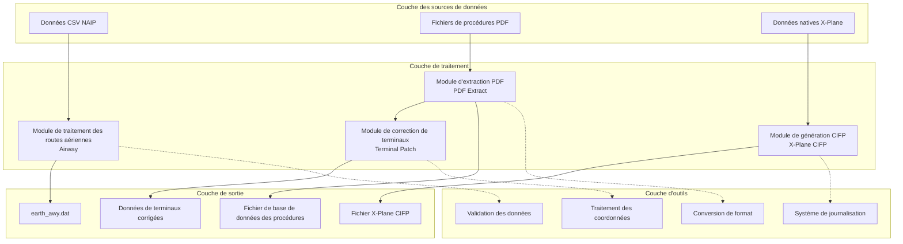
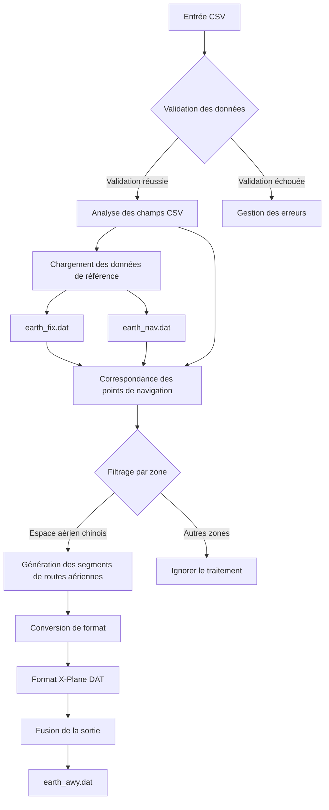
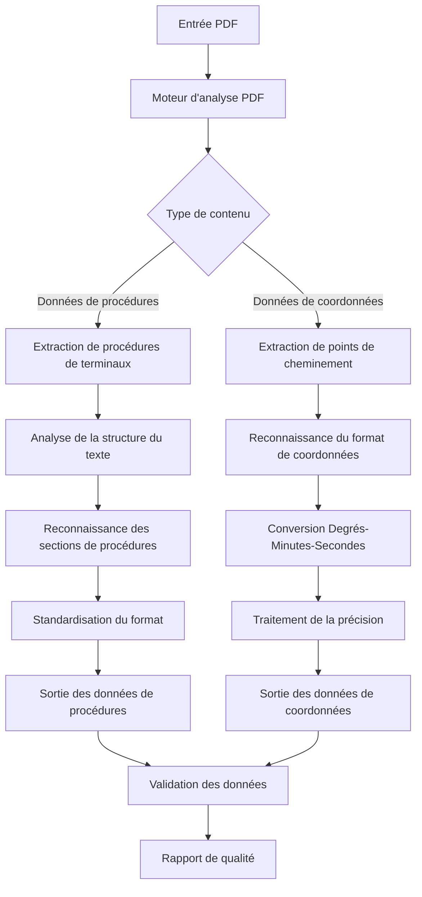
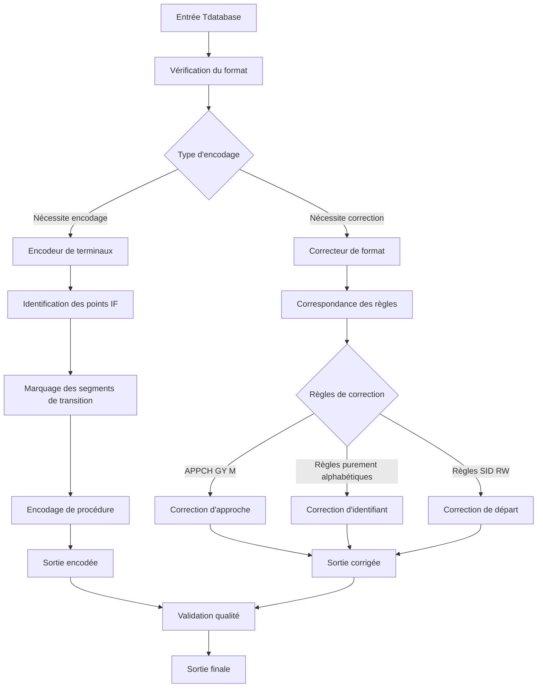
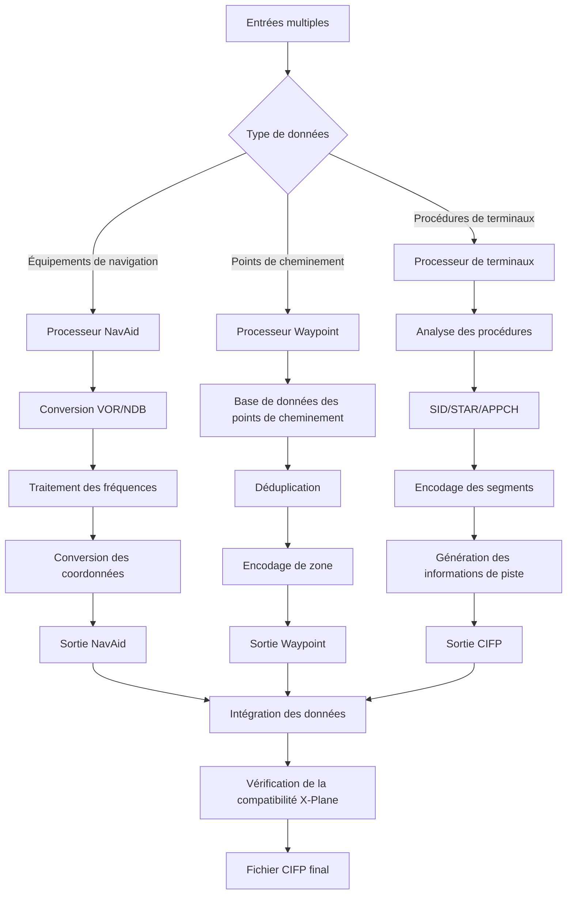
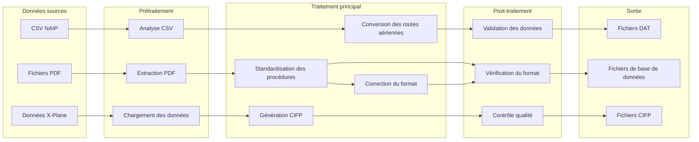
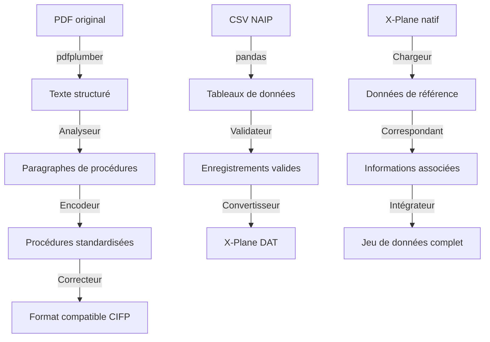
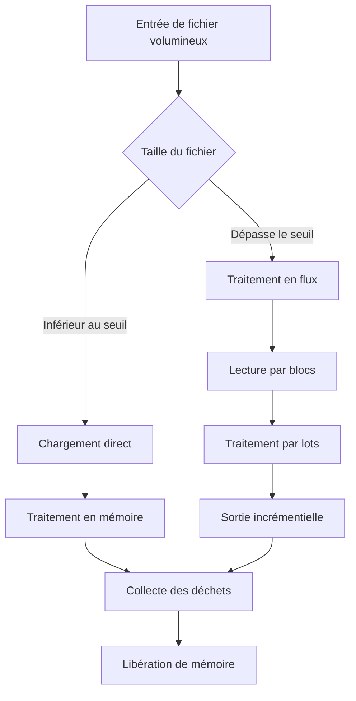
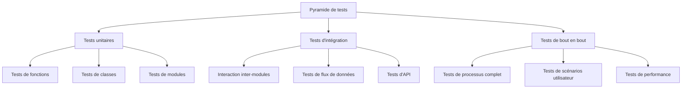

# Description de l'Architecture

Ce document détaille l'architecture système, les principes techniques et les concepts de conception du projet Nav-data.

## 🏗️ Architecture Générale

Nav-data adopte une conception modulaire, composée de quatre modules principaux, chacun fonctionnant indépendamment et pouvant être combiné de manière flexible.



## 📋 Principes de Conception

### 1. Conception modulaire
- **Indépendance** : Chaque module peut fonctionner indépendamment, sans forte dépendance vis-à-vis des autres modules.
- **Composabilité** : Les modules peuvent être combinés de manière flexible pour former différents flux de traitement.
- **Extensibilité** : De nouveaux modules peuvent être intégrés de manière transparente à l'architecture existante.

### 2. Piloté par le flux de données
- **Flux de données unidirectionnel** : Les données circulent de la source vers la cible, évitant les dépendances circulaires.
- **Sauvegarde des états intermédiaires** : Chaque étape de traitement sauvegarde les résultats intermédiaires, facilitant le débogage et la récupération.
- **Standardisation des formats** : Des spécifications de format de données uniformes garantissent la compatibilité entre les modules.

### 3. Tolérance aux pannes et récupération
- **Traitement par étapes** : Les tâches complexes sont décomposées en petites étapes, réduisant le risque d'échec.
- **Isolation des erreurs** : L'échec du traitement d'un seul fichier n'affecte pas l'ensemble de la tâche de traitement par lots.
- **Persistance de l'état** : Les informations d'état critiques sont persistantes, permettant la reprise après interruption.

### 4. Optimisation des performances
- **Faible consommation mémoire** : Traitement en flux des fichiers volumineux pour éviter les débordements de mémoire.
- **Opérations par lots** : Le traitement par lots améliore l'efficacité des E/S.
- **Support de la concurrence** : Prise en charge du traitement concurrent en multithreading/multiprocessus.

## 🛠️ Architecture des Modules Principaux

### Module de traitement des routes aériennes (Airway)



**Caractéristiques techniques :**
- **Algorithme de correspondance de données** : Correspondance intelligente basée sur les identifiants et les coordonnées.
- **Mécanisme de filtrage par zone** : Prend en charge la configuration flexible du filtrage par zone géographique.
- **Moteur de conversion de format** : Conversion précise du format CSV vers X-Plane DAT.
- **Gestion des cycles AIRAC** : Calcul et gestion automatiques des périodes de validité des données aéronautiques.

**Classes et interfaces principales :**
```python
class NavigationType(Enum):
    """导航点类型枚举"""
    DESIGNATED_POINT = ('DESIGNATED_POINT', '11')
    VORDME = ('VORDME', '3') 
    NDB = ('NDB', '2')

@dataclass
class NavigationPoint:
    """导航点数据结构"""
    identifier: str
    type: NavigationType
    area_code: str

def process_navigation_point(identifier: str, code_type: str, 
                           earth_fix_data: Dict, earth_nav_data: Dict) -> Optional[NavigationPoint]:
    """导航点处理核心算法"""
    pass

def convert_csv_to_dat(csv_file: str, earth_fix_path: str, 
                      earth_nav_path: str, earth_awy_path: str) -> None:
    """主要转换函数"""
    pass
```

### Module d'extraction PDF (PDF Extract)



**Caractéristiques techniques :**
- **Analyse multi-niveaux** : Prend en charge plusieurs éléments PDF tels que le texte, les lignes et les tableaux.
- **Reconnaissance intelligente** : Identifie automatiquement les formats de coordonnées et les structures de procédures.
- **Mécanisme de tolérance aux pannes** : Gère les incohérences de format PDF et les problèmes de données manquantes.
- **Contrôle qualité** : Mécanisme intégré de vérification et de rapport de la qualité des données.

**Composants principaux :**
```python
class Line:
    """线条元素类"""
    def __init__(self, line: dict):
        self.is_horizontal = True if line["width"] > 5 else False
        self.top = line["top"]
        self.left = line["x0"]
        self.length = line["width"] if self.is_horizontal else line["height"]

class Word:
    """文本元素类"""
    def __init__(self, info: dict):
        self.content = info["text"]
        self.center = ((info["x0"] + info["x1"]) / 2, (info["top"] + info["bottom"]) / 2)

class Unit:
    """处理单元类"""
    def __init__(self):
        self.words = []
        self.lines = []
    
    def match_underline(self):
        """下划线匹配算法"""
        pass

def extract(pdf: pdfplumber.PDF) -> List[str]:
    """PDF 提取主函数"""
    pass
```

### Module de correction de terminaux (Terminal Patch)



**Caractéristiques techniques :**
- **Moteur de règles** : Moteur de règles de correction basé sur la configuration.
- **Reconnaissance de motifs** : Reconnaissance intelligente des différents types de procédures et d'identifiants.
- **Traitement par lots** : Prend en charge la correction par lots au niveau du dossier.
- **Rétrocompatibilité** : Maintient la compatibilité avec les formats de données existants.

**Système de règles de correction :**
```python
class FixRule:
    """修复规则基类"""
    def __init__(self, name: str, pattern: str, action: callable):
        self.name = name
        self.pattern = pattern
        self.action = action
    
    def apply(self, line: str) -> str:
        """应用修复规则"""
        pass

class RuleEngine:
    """规则引擎"""
    def __init__(self):
        self.rules = []
    
    def add_rule(self, rule: FixRule):
        """添加修复规则"""
        self.rules.append(rule)
    
    def apply_rules(self, content: str) -> str:
        """应用所有规则"""
        pass

# 预定义修复规则
APPCH_GY_M_RULE = FixRule(
    name="APPCH_GY_M",
    pattern=r"APPCH.*GY M",
    action=lambda line: fix_appch_gy_m(line)
)
```

### Module X-Plane CIFP (X-Plane CIFP)



**Caractéristiques techniques :**
- **Intégration de données multi-sources** : Intègre plusieurs sources de données comme NAIP et les données natives X-Plane.
- **Algorithme de déduplication intelligent** : Algorithme de déduplication intelligent basé sur les coordonnées et les identifiants.
- **Compatibilité des versions** : Prend en charge les formats X-Plane 11 et X-Plane 12.
- **Intégrité des données** : Assure que les données CIFP générées sont complètes et conformes aux standards.

**Structures de données principales :**
```python
class Waypoint:
    """航路点类"""
    def __init__(self, la: float, long: float, ident: str, cat: int, 
                 airport: str = '', area: str = '', changeable: bool = True):
        self.latitude = la
        self.longitude = long
        self.ident = ident
        self.cat = cat  # -1:不可用 1:航路点 2:VHF 3:NDB
        self.airport = airport
        self.area = area
        self.changeable = changeable
    
    def is_same(self, fix: "Waypoint", change: bool = False) -> bool:
        """判断是否为相同航路点"""
        pass

class WaypointSystem:
    """航路点管理系统"""
    def __init__(self):
        self.base = {}  # 主数据库
    
    def add_point(self, point: Waypoint):
        """添加航路点"""
        pass
    
    def query(self, point: Waypoint, change: bool = False) -> int:
        """查询航路点"""
        pass

class Procedure:
    """程序类"""
    def __init__(self, ptype: int):
        self.ptype = "SID" if ptype == 1 else ("STAR" if ptype == 2 else "APPCH")
        self.airport = None
        self.runway = None
        self.name = None
        self.legs = []
    
    def encode(self):
        """程序编码"""
        pass
    
    def output(self) -> str:
        """输出 CIFP 格式"""
        pass
```

## 🔄 Architecture du Flux de Données

### Diagramme de flux de données



### Chaîne de conversion des formats de données



## ⚙️ Architecture de la Pile Technologique

### Composants techniques principaux

```mermaid
graph TB
    subgraph "Langage de programmation"
        A1[Python 3.6+]
    end
    
    subgraph "Traitement des données"
        B1[pandas - Analyse de données]
        B2[numpy - Calcul numérique]
        B3[csv - Traitement CSV]
    end
    
    subgraph "Traitement PDF"
        C1[pdfplumber - Analyse PDF]
        C2[Expressions régulières - Correspondance de motifs]
    end
    
    subgraph "Calculs géographiques"
        D1[geopy - Calcul de distances géographiques]
        D2[Algorithmes de conversion de coordonnées]
    end
    
    subgraph "Interface utilisateur"
        E1[tqdm - Barres de progression]
        E2[colorama - Sortie colorée]
        E3[logging - Système de journalisation]
    end
    
    subgraph "Base de données"
        F1[sqlite3 - Base de données légère]
        F2[Système de fichiers - Persistance des données]
    end
    
    A1 --> B1
    A1 --> B2
    A1 --> C1
    A1 --> D1
    A1 --> E1
    A1 --> F1
```



### Gestion des dépendances

```python
# requirements.txt Dépendances
# Dépendances principales
pandas>=1.3.0          # Base de traitement des données
numpy>=1.21.0          # Base de calcul numérique

# Traitement PDF
pdfplumber>=0.7.0      # Moteur d'analyse PDF

# Expérience utilisateur
tqdm>=4.60.0           # Affichage de la progression
colorama>=0.4.4        # Sortie colorée

# Calculs géographiques
geopy>=2.2.0           # Calcul de distances géographiques

# Traitement du chinois
pypinyin>=0.44.0       # Conversion Pinyin du chinois

# Outils de développement (optionnel)
pytest>=6.0.0          # Framework de test
black>=21.0.0          # Formatage de code
flake8>=3.9.0          # Analyse de code
```

## 🏛️ Modèles de Conception

### 1. Modèle de fabrique (Factory Pattern)
Utilisé pour créer différents types de processeurs de données :

```python
class ProcessorFactory:
    """数据处理器工厂"""
    
    @staticmethod
    def create_processor(data_type: str):
        if data_type == "airway":
            return AirwayProcessor()
        elif data_type == "pdf":
            return PDFProcessor()
        elif data_type == "terminal":
            return TerminalProcessor()
        elif data_type == "cifp":
            return CIFPProcessor()
        else:
            raise ValueError(f"Unknown processor type: {data_type}")

# Exemple d'utilisation
processor = ProcessorFactory.create_processor("airway")
result = processor.process(input_data)
```

### 2. Modèle de stratégie (Strategy Pattern)
Utilisé pour implémenter différentes stratégies de conversion de données :

```python
class ConversionStrategy:
    """转换策略接口"""
    def convert(self, data): pass

class CSVToDAT(ConversionStrategy):
    """CSV 到 DAT 转换策略"""
    def convert(self, csv_data):
        # Logique de conversion CSV
        pass

class PDFToText(ConversionStrategy):
    """PDF 到文本转换策略"""
    def convert(self, pdf_data):
        # Logique de conversion PDF
        pass

class DataConverter:
    """数据转换器"""
    def __init__(self, strategy: ConversionStrategy):
        self.strategy = strategy
    
    def convert(self, data):
        return self.strategy.convert(data)
```

### 3. Modèle d'observateur (Observer Pattern)
Utilisé pour surveiller la progression du traitement :

```python
class ProgressObserver:
    """进度观察者接口"""
    def update(self, progress: float, message: str): pass

class ConsoleProgressObserver(ProgressObserver):
    """控制台进度显示"""
    def update(self, progress: float, message: str):
        print(f"Progress: {progress:.1%} - {message}")

class TqdmProgressObserver(ProgressObserver):
    """tqdm 进度条显示"""
    def __init__(self):
        self.pbar = None
    
    def update(self, progress: float, message: str):
        if self.pbar:
            self.pbar.set_description(message)
            self.pbar.update()

class DataProcessor:
    """数据处理器基类"""
    def __init__(self):
        self.observers = []
    
    def add_observer(self, observer: ProgressObserver):
        self.observers.append(observer)
    
    def notify_progress(self, progress: float, message: str):
        for observer in self.observers:
            observer.update(progress, message)
```

### 4. Modèle de chaîne de responsabilité (Chain of Responsibility)
Utilisé pour implémenter une chaîne de validation de données :

```python
class ValidationHandler:
    """验证处理器接口"""
    def __init__(self):
        self.next_handler = None
    
    def set_next(self, handler):
        self.next_handler = handler
        return handler
    
    def handle(self, data):
        result = self.validate(data)
        if result and self.next_handler:
            return self.next_handler.handle(data)
        return result
    
    def validate(self, data):
        pass

class FormatValidator(ValidationHandler):
    """格式验证器"""
    def validate(self, data):
        # Logique de validation du format
        return True

class RangeValidator(ValidationHandler):
    """范围验证器"""
    def validate(self, data):
        # Logique de validation de la portée
        return True

class IntegrityValidator(ValidationHandler):
    """完整性验证器"""
    def validate(self, data):
        # Logique de validation de l'intégrité
        return True

# Construction de la chaîne de validation
format_validator = FormatValidator()
range_validator = RangeValidator()
integrity_validator = IntegrityValidator()

format_validator.set_next(range_validator).set_next(integrity_validator)

# Utilisation de la chaîne de validation
is_valid = format_validator.handle(input_data)
```

## 📊 Architecture de Performance

### Stratégies de gestion de la mémoire



**Stratégies d'optimisation de la mémoire :**
```python
import gc
from typing import Iterator, List

class MemoryEfficientProcessor:
    """内存高效的数据处理器"""
    
    def __init__(self, chunk_size: int = 1000):
        self.chunk_size = chunk_size
    
    def process_large_file(self, file_path: str) -> Iterator[List]:
        """分块处理大文件"""
        chunk = []
        with open(file_path, 'r', encoding='utf-8') as f:
            for line in f:
                chunk.append(line.strip())
                
                if len(chunk) >= self.chunk_size:
                    yield self.process_chunk(chunk)
                    chunk.clear()
                    gc.collect()  # Force la collecte des déchets
            
            if chunk:  # Traite les données restantes
                yield self.process_chunk(chunk)
    
    def process_chunk(self, chunk: List[str]) -> List[str]:
        """处理单个数据块"""
        # Logique de traitement des données
        return [self.process_line(line) for line in chunk]
    
    def process_line(self, line: str) -> str:
        """处理单行数据"""
        # Logique de traitement spécifique
        return line
```

### Architecture de traitement concurrent

```python
import concurrent.futures
from multiprocessing import Pool
import threading

class ConcurrentProcessor:
    """并发数据处理器"""
    
    def __init__(self, max_workers: int = 4):
        self.max_workers = max_workers
    
    def process_files_threaded(self, file_list: List[str]) -> List:
        """多线程处理文件列表"""
        with concurrent.futures.ThreadPoolExecutor(max_workers=self.max_workers) as executor:
            # Soumettre les tâches
            future_to_file = {
                executor.submit(self.process_single_file, file): file 
                for file in file_list
            }
            
            results = []
            for future in concurrent.futures.as_completed(future_to_file):
                file = future_to_file[future]
                try:
                    result = future.result()
                    results.append(result)
                except Exception as exc:
                    print(f'File {file} generated an exception: {exc}')
            
            return results
    
    def process_files_multiprocess(self, file_list: List[str]) -> List:
        """多进程处理文件列表"""
        with Pool(processes=self.max_workers) as pool:
            results = pool.map(self.process_single_file, file_list)
        return results
    
    def process_single_file(self, file_path: str):
        """处理单个文件"""
        # Logique de traitement de fichier
        pass
```

### Architecture de cache

```python
import functools
import hashlib
import pickle
from pathlib import Path

class CacheManager:
    """缓存管理器"""
    
    def __init__(self, cache_dir: str = "cache"):
        self.cache_dir = Path(cache_dir)
        self.cache_dir.mkdir(exist_ok=True)
    
    def get_cache_key(self, *args, **kwargs) -> str:
        """生成缓存键"""
        content = str(args) + str(sorted(kwargs.items()))
        return hashlib.md5(content.encode()).hexdigest()
    
    def get(self, key: str):
        """获取缓存"""
        cache_file = self.cache_dir / f"{key}.cache"
        if cache_file.exists():
            with open(cache_file, 'rb') as f:
                return pickle.load(f)
        return None
    
    def set(self, key: str, value):
        """设置缓存"""
        cache_file = self.cache_dir / f"{key}.cache"
        with open(cache_file, 'wb') as f:
            pickle.dump(value, f)
    
    def cached(self, ttl: int = 3600):
        """缓存装饰器"""
        def decorator(func):
            @functools.wraps(func)
            def wrapper(*args, **kwargs):
                cache_key = self.get_cache_key(func.__name__, *args, **kwargs)
                result = self.get(cache_key)
                
                if result is None:
                    result = func(*args, **kwargs)
                    self.set(cache_key, result)
                
                return result
            return wrapper
        return decorator

# Exemple d'utilisation
cache_manager = CacheManager()

@cache_manager.cached(ttl=3600)
def expensive_processing(data):
    """耗时的数据处理函数"""
    # Logique de traitement complexe
    return processed_data
```

## 🔒 Architecture de Sécurité

### Couche de validation des entrées

```python
import re
from pathlib import Path
from typing import Any, Dict

class InputValidator:
    """输入验证器"""
    
    # Extensions de fichiers sécurisées
    SAFE_EXTENSIONS = {'.csv', '.dat', '.txt', '.pdf'}
    
    # Modèle de restriction de chemin
    SAFE_PATH_PATTERN = re.compile(r'^[a-zA-Z0-9._/\-\s]+$')
    
    @classmethod
    def validate_file_path(cls, file_path: str) -> bool:
        """验证文件路径安全性"""
        path = Path(file_path)
        
        # Vérifier l'extension du fichier
        if path.suffix.lower() not in cls.SAFE_EXTENSIONS:
            raise ValueError(f"Unsafe file extension: {path.suffix}")
        
        # Vérifier les caractères du chemin
        if not cls.SAFE_PATH_PATTERN.match(file_path):
            raise ValueError(f"Unsafe characters in path: {file_path}")
        
        # Vérifier les attaques par traversée de chemin
        if '..' in file_path or file_path.startswith('/'):
            raise ValueError(f"Path traversal detected: {file_path}")
        
        return True
    
    @classmethod
    def validate_coordinate(cls, lat: float, lon: float) -> bool:
        """验证坐标范围"""
        if not (-90 <= lat <= 90):
            raise ValueError(f"Invalid latitude: {lat}")
        
        if not (-180 <= lon <= 180):
            raise ValueError(f"Invalid longitude: {lon}")
        
        return True
    
    @classmethod
    def sanitize_string(cls, input_str: str) -> str:
        """清理输入字符串"""
        # Supprimer les caractères potentiellement dangereux
        sanitized = re.sub(r'[<>"\';\\]', '', input_str)
        # Limiter la longueur
        return sanitized[:1000]
```

### Architecture de gestion des erreurs

```python
import logging
from enum import Enum
from typing import Optional

class ErrorLevel(Enum):
    """错误级别"""
    WARNING = "WARNING"
    ERROR = "ERROR"
    CRITICAL = "CRITICAL"

class NavDataError(Exception):
    """Nav-data 自定义异常基类"""
    def __init__(self, message: str, error_code: str = None, level: ErrorLevel = ErrorLevel.ERROR):
        super().__init__(message)
        self.message = message
        self.error_code = error_code
        self.level = level

class FileProcessingError(NavDataError):
    """文件处理异常"""
    pass

class DataValidationError(NavDataError):
    """数据验证异常"""
    pass

class ErrorHandler:
    """错误处理器"""
    
    def __init__(self):
        self.logger = logging.getLogger(__name__)
    
    def handle_error(self, error: Exception, context: Optional[Dict] = None):
        """处理异常"""
        if isinstance(error, NavDataError):
            self.handle_nav_data_error(error, context)
        else:
            self.handle_unexpected_error(error, context)
    
    def handle_nav_data_error(self, error: NavDataError, context: Optional[Dict] = None):
        """处理自定义异常"""
        log_message = f"[{error.error_code}] {error.message}"
        if context:
            log_message += f" Context: {context}"
        
        if error.level == ErrorLevel.WARNING:
            self.logger.warning(log_message)
        elif error.level == ErrorLevel.ERROR:
            self.logger.error(log_message)
        elif error.level == ErrorLevel.CRITICAL:
            self.logger.critical(log_message)
            # Peut nécessiter l'arrêt de l'exécution du programme
    
    def handle_unexpected_error(self, error: Exception, context: Optional[Dict] = None):
        """处理未预期的异常"""
        log_message = f"Unexpected error: {str(error)}"
        if context:
            log_message += f" Context: {context}"
        
        self.logger.error(log_message, exc_info=True)
```

## 🧪 Architecture de Test

### Stratégie de test



### Code du framework de test

```python
import pytest
import tempfile
from pathlib import Path
from unittest.mock import Mock, patch

class TestDataFixtures:
    """测试数据装置"""
    
    @pytest.fixture
    def sample_csv_data(self):
        """Exemple de données CSV"""
        return """CODE_POINT_START,CODE_TYPE_START,CODE_POINT_END,CODE_TYPE_END,CODE_DIR,TXT_DESIG
ABCDE,DESIGNATED_POINT,FGHIJ,VOR/DME,N,A123
KLMNO,NDB,PQRST,DESIGNATED_POINT,N,B456"""
    
    @pytest.fixture
    def temp_directory(self):
        """Répertoire temporaire"""
        with tempfile.TemporaryDirectory() as temp_dir:
            yield Path(temp_dir)
    
    @pytest.fixture
    def mock_earth_fix_data(self):
        """Données earth_fix simulées"""
        return {
            'ABCDE': 'ZB',
            'PQRST': 'ZG'
        }
    
    @pytest.fixture
    def mock_earth_nav_data(self):
        """Données earth_nav simulées"""
        return {
            'FGHIJ': 'ZG',
            'KLMNO': 'ZB'
        }

class TestAirwayModule(TestDataFixtures):
    """Tests du module Airway"""
    
    def test_navigation_type_enum(self):
        """Tester l'énumération du type de navigation"""
        from Airway.airway import NavigationType
        
        assert NavigationType.DESIGNATED_POINT.type_code == '11'
        assert NavigationType.VORDME.type_code == '3'
        assert NavigationType.NDB.type_code == '2'
    
    def test_process_navigation_point(self, mock_earth_fix_data, mock_earth_nav_data):
        """Tester le traitement des points de navigation"""
        # Tester le traitement des points désignés
        from Airway.airway import process_navigation_point
        
        result = process_navigation_point(
            'ABCDE', 'DESIGNATED_POINT', 
            mock_earth_fix_data, mock_earth_nav_data
        )
        
        assert result is not None
        assert result.identifier == 'ABCDE'
        assert result.area_code == 'ZB'
    
    @patch('Airway.airway.load_fixed_width_data')
    @patch('pandas.read_csv')
    def test_csv_to_dat_conversion(self, mock_read_csv, mock_load_data, 
                                 sample_csv_data, temp_directory):
        """Tester la conversion CSV vers DAT"""
        # Configurer les données simulées
        mock_df = Mock()
        mock_read_csv.return_value = mock_df
        mock_load_data.return_value = {'ABCDE': 'ZB'}
        
        # Créer un fichier temporaire
        csv_file = temp_directory / "test.csv"
        csv_file.write_text(sample_csv_data)
        
        # Tester la fonction de conversion
        from Airway.airway import convert_csv_to_dat
        
        # Ceci doit être ajusté en fonction de la signature de fonction réelle
        # convert_csv_to_dat(str(csv_file), ...)
        
        # Vérifier le résultat
        assert True  # Assert en fonction du résultat réel

class TestPDFModule(TestDataFixtures):
    """Tests du module PDF"""
    
    @patch('pdfplumber.open')
    def test_pdf_extraction(self, mock_pdf_open):
        """Tester la fonction d'extraction PDF"""
        # Configurer le PDF simulé
        mock_pdf = Mock()
        mock_page = Mock()
        mock_page.extract_text_lines.return_value = [
            {'text': 'ZBAA N39°48\'35.6" E116°34\'46.7"'}
        ]
        mock_pdf.pages = [mock_page]
        mock_pdf_open.return_value.__enter__.return_value = mock_pdf
        
        # Tester la fonction d'extraction
        import sys
        sys.path.append('PDF extract')
        from waypoint_1_pdf import extract
        
        result = extract(mock_pdf)
        assert len(result) > 0
```

## 📈 Architecture de Surveillance et de Journalisation

### Conception du système de journalisation

```python
import logging
import logging.handlers
from enum import Enum
from pathlib import Path

class LogLevel(Enum):
    """日志级别"""
    DEBUG = logging.DEBUG
    INFO = logging.INFO
    WARNING = logging.WARNING
    ERROR = logging.ERROR
    CRITICAL = logging.CRITICAL

class StructuredLogger:
    """结构化日志器"""
    
    def __init__(self, name: str, log_dir: str = "logs"):
        self.logger = logging.getLogger(name)
        self.log_dir = Path(log_dir)
        self.log_dir.mkdir(exist_ok=True)
        
        self.setup_handlers()
    
    def setup_handlers(self):
        """Configurer les gestionnaires de journalisation"""
        # Gestionnaire de console
        console_handler = logging.StreamHandler()
        console_formatter = logging.Formatter(
            '%(asctime)s - %(name)s - %(levelname)s - %(message)s'
        )
        console_handler.setFormatter(console_formatter)
        
        # Gestionnaire de fichiers (rotation par date)
        file_handler = logging.handlers.TimedRotatingFileHandler(
            filename=self.log_dir / 'nav-data.log',
            when='midnight',
            interval=1,
            backupCount=30,
            encoding='utf-8'
        )
        file_formatter = logging.Formatter(
            '%(asctime)s - %(name)s - %(levelname)s - %(filename)s:%(lineno)d - %(message)s'
        )
        file_handler.setFormatter(file_formatter)
        
        # Gestionnaire de fichiers d'erreurs
        error_handler = logging.FileHandler(
            filename=self.log_dir / 'errors.log',
            encoding='utf-8'
        )
        error_handler.setLevel(logging.ERROR)
        error_handler.setFormatter(file_formatter)
        
        # Ajouter les gestionnaires
        self.logger.addHandler(console_handler)
        self.logger.addHandler(file_handler)
        self.logger.addHandler(error_handler)
        
        self.logger.setLevel(logging.INFO)
    
    def log_with_context(self, level: LogLevel, message: str, **context):
        """Journalisation avec contexte"""
        if context:
            message = f"{message} | Context: {context}"
        
        self.logger.log(level.value, message)
    
    def log_performance(self, operation: str, duration: float, **metrics):
        """Journal de performance"""
        perf_message = f"Performance | Operation: {operation} | Duration: {duration:.3f}s"
        if metrics:
            perf_message += f" | Metrics: {metrics}"
        
        self.logger.info(perf_message)
```

### Surveillance des performances

```python
import time
import psutil
from contextlib import contextmanager
from typing import Dict, Any

class PerformanceMonitor:
    """性能监控器"""
    
    def __init__(self, logger: StructuredLogger):
        self.logger = logger
        self.metrics = {}
    
    @contextmanager
    def measure_time(self, operation_name: str):
        """Mesurer la durée de l'opération"""
        start_time = time.time()
        start_memory = psutil.Process().memory_info().rss / 1024 / 1024  # MB
        
        try:
            yield
        finally:
            end_time = time.time()
            end_memory = psutil.Process().memory_info().rss / 1024 / 1024  # MB
            
            duration = end_time - start_time
            memory_delta = end_memory - start_memory
            
            self.logger.log_performance(
                operation=operation_name,
                duration=duration,
                memory_start=start_memory,
                memory_end=end_memory,
                memory_delta=memory_delta
            )
    
    def collect_system_metrics(self) -> Dict[str, Any]:
        """Collecter les métriques système"""
        return {
            'cpu_percent': psutil.cpu_percent(),
            'memory_percent': psutil.virtual_memory().percent,
            'disk_usage': psutil.disk_usage('/').percent,
            'process_memory': psutil.Process().memory_info().rss / 1024 / 1024
        }

# Exemple d'utilisation
logger = StructuredLogger("nav-data")
monitor = PerformanceMonitor(logger)

with monitor.measure_time("csv_processing"):
    # Exécuter l'opération de traitement CSV
    process_csv_file("large_file.csv")

# Enregistrer les métriques système
system_metrics = monitor.collect_system_metrics()
logger.log_with_context(LogLevel.INFO, "System metrics collected", **system_metrics)
```

## 🔮 Architecture d'Extension

### Conception du système de plugins

```python
from abc import ABC, abstractmethod
from typing import Dict, Any, List
import importlib
import os

class Plugin(ABC):
    """插件接口"""
    
    @property
    @abstractmethod
    def name(self) -> str:
        """Nom du plugin"""
        pass
    
    @property
    @abstractmethod
    def version(self) -> str:
        """Version du plugin"""
        pass
    
    @abstractmethod
    def initialize(self, config: Dict[str, Any]):
        """Initialiser le plugin"""
        pass
    
    @abstractmethod
    def process(self, data: Any) -> Any:
        """Traiter les données"""
        pass
    
    @abstractmethod
    def cleanup(self):
        """Nettoyer les ressources"""
        pass

class PluginManager:
    """插件管理器"""
    
    def __init__(self, plugin_dir: str = "plugins"):
        self.plugin_dir = plugin_dir
        self.plugins: Dict[str, Plugin] = {}
    
    def load_plugins(self):
        """Charger tous les plugins"""
        if not os.path.exists(self.plugin_dir):
            return
        
        for filename in os.listdir(self.plugin_dir):
            if filename.endswith('.py') and not filename.startswith('__'):
                module_name = filename[:-3]
                try:
                    module = importlib.import_module(f"{self.plugin_dir}.{module_name}")
                    plugin_class = getattr(module, 'Plugin', None)
                    
                    if plugin_class and issubclass(plugin_class, Plugin):
                        plugin = plugin_class()
                        self.plugins[plugin.name] = plugin
                        print(f"Loaded plugin: {plugin.name} v{plugin.version}")
                
                except Exception as e:
                    print(f"Failed to load plugin {module_name}: {e}")
    
    def get_plugin(self, name: str) -> Plugin:
        """Obtenir un plugin"""
        return self.plugins.get(name)
    
    def list_plugins(self) -> List[str]:
        """Lister tous les plugins"""
        return list(self.plugins.keys())
    
    def execute_plugin(self, name: str, data: Any, config: Dict[str, Any] = None) -> Any:
        """Exécuter un plugin"""
        plugin = self.get_plugin(name)
        if not plugin:
            raise ValueError(f"Plugin not found: {name}")
        
        try:
            if config:
                plugin.initialize(config)
            
            result = plugin.process(data)
            plugin.cleanup()
            return result
        
        except Exception as e:
            plugin.cleanup()
            raise e

# Exemple d'implémentation de plugin
class CustomDataProcessor(Plugin):
    """Plugin de traitement de données personnalisé"""
    
    @property
    def name(self) -> str:
        return "custom_processor"
    
    @property
    def version(self) -> str:
        return "1.0.0"
    
    def initialize(self, config: Dict[str, Any]):
        self.config = config
    
    def process(self, data: Any) -> Any:
        # Logique de traitement personnalisée
        return processed_data
    
    def cleanup(self):
        # Nettoyer les ressources
        pass
```

---

**Résumé** : Nav-data adopte une conception architecturale modulaire et stratifiée, garantissant la maintenabilité, l'extensibilité et la performance du système. Grâce à l'application judicieuse de modèles de conception, à un mécanisme complet de gestion des erreurs et à un système de surveillance, il fournit aux utilisateurs un service stable et fiable de conversion de données de navigation aérienne. ✈️