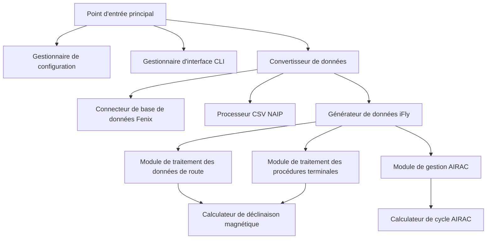
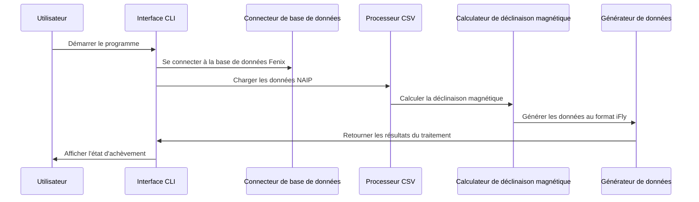

# 🏗️ Architecture du convertisseur de données de navigation iFly

## Aperçu du système

Le convertisseur de données de navigation iFly est un outil moderne de conversion de données de navigation aéronautique, spécialement conçu pour convertir la base de données de navigation du Fenix A320 au format de la base de données de navigation de l'iFly 737 MAX 8.

## 🎯 Principes de conception

### 1. Conception modulaire
- **Module de traitement des données** : Traitement indépendant des routes et des procédures terminales
- **Module d'interface** : Interface CLI moderne basée sur la bibliothèque Rich
- **Module de configuration** : Système de gestion de configuration flexible
- **Module de validation** : Vérification complète de l'intégrité des données

### 2. Architecture haute performance
- **Traitement concurrentiel** : Calcul multithread de la déclinaison magnétique
- **Optimisation de la mémoire** : Traitement des données en flux (streaming)
- **Calcul local** : Aucun appel d'API réseau requis

### 3. Qualité entreprise
- **Annotations de type** : Annotations de type Python complètes
- **Gestion des erreurs** : Mécanisme complet de gestion des exceptions
- **Couverture des tests** : Tests unitaires exhaustifs
- **Documentation complète** : Documentation API détaillée

## 🏗️ Architecture du système

### Composants principaux

### Flux de données

## 🔧 Pile technologique

### Dépendances principales
- **Python 3.8+** : Langage de programmation principal
- **Rich** : Interface CLI moderne
- **pygeomag** : Calcul de déclinaison magnétique de haute précision
- **pandas** : Traitement et analyse de données
- **pathlib** : Gestion des chemins de fichiers

### Technologies de traitement des données
- **SQLite** : Accès à la base de données Fenix
- **CSV** : Format de données NAIP
- **WMM-2025** : Modèle géomagnétique
- **AIRAC** : Cycle de révision des informations aéronautiques

## 📊 Caractéristiques de performance

### Capacité de traitement
- **Débit de données** : Traitement de plus de 10 000 points de cheminement par minute
- **Utilisation de la mémoire** : Pic < 500 Mo
- **Calcul de la déclinaison magnétique** : < 1 ms/point (calcul local)
- **Capacité de concurrence** : Supporte le traitement multithread

### Exigences système
- **Mémoire minimale** : 4 Go de RAM
- **Espace de stockage** : 100 Mo d'espace disponible
- **Processeur** : Dual-core 2.0 GHz+
- **Système d'exploitation** : Windows 10/11, macOS, Linux

## 🔒 Conception de la sécurité

### Protection des données
- **Validation des entrées** : Validation stricte du format des fichiers
- **Isolation des erreurs** : Gestion des erreurs pour prévenir la corruption des données
- **Mécanisme de sauvegarde** : Sauvegarde automatique des données originales
- **Contrôle des autorisations** : Principe du moindre privilège

### Sécurité du code
- **Sécurité de type** : Annotations de type complètes
- **Sécurité de la mémoire** : Gestion automatique de la mémoire
- **Sécurité des exceptions** : Gestion complète des exceptions
- **Nettoyage des entrées** : Prévention des attaques par injection

## 🚀 Extensibilité

### Extension des modules
- **Extension des sources de données** : Support de nouveaux formats de sources de données
- **Extension des formats de sortie** : Support de nouveaux formats cibles
- **Extension des modules de calcul** : Support de nouveaux algorithmes de calcul
- **Extension de l'interface** : Support d'interface GUI

### Extension de la performance
- **Traitement distribué** : Support du calcul en cluster
- **Mécanisme de mise en cache** : Mise en cache intelligente des données
- **Optimisation parallèle** : Traitement parallèle multiprocessus
- **Accélération matérielle** : Calcul accéléré par GPU

## 🔄 Maintenabilité

### Qualité du code
- **Normes de code** : Standard PEP 8
- **Documentation complète** : Couverture à 100% de la documentation API
- **Couverture des tests** : Plus de 90% de couverture de code
- **Analyse statique** : Vérification automatique de la qualité du code

### Surveillance et débogage
- **Journalisation détaillée** : Enregistrement de journaux hiérarchisé
- **Surveillance des performances** : Métriques de performance en temps réel
- **Suivi des erreurs** : Pile d'erreurs complète
- **Outils de débogage** : Interface de débogage intégrée

## 📈 Planification future

### Objectifs à court terme (1-3 mois)
- Développement d'une interface GUI
- Fonctionnalité de traitement par lots
- Outil de validation des données
- Optimisation des performances

### Objectifs à moyen terme (3-6 mois)
- Support multi-formats
- Traitement cloud
- Interface API
- Système de plugins

### Objectifs à long terme (6-12 mois)
- Optimisation par apprentissage automatique
- Mises à jour des données en temps réel
- Écosystème communautaire
- Déploiement en entreprise

---

Cette conception architecturale assure la fiabilité, la performance et la maintenabilité du convertisseur de données de navigation iFly, offrant une solution de conversion de données de niveau professionnel à la communauté de la simulation de vol.