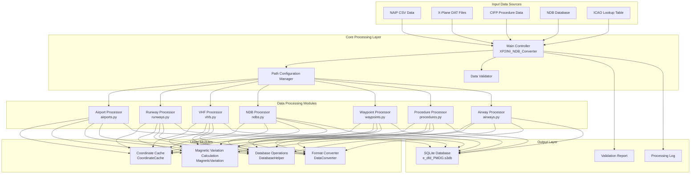

# 🏗️ System Architecture

This document elaborates on the system architecture, technical implementation, and design philosophy of the Nav-data Aeronautical Navigation Data Conversion Tool.

## 🎯 Design Principles

### 🔧 Modular Design
- **Single Responsibility**：Each module focuses on processing specific types of navigation data
- **Loose Coupling**：Dependencies between modules are minimized for easy independent development and testing
- **High Cohesion**：Related functionalities are concentrated within the same module

### ⚡ Performance Optimization
- **Parallel Processing**：Supports multi-process parallel processing for large-scale datasets
- **Memory Management**：Intelligent caching mechanism reduces redundant calculations
- **I/O Optimization**：Batch database operations improve processing efficiency

### 🔒 Data Integrity
- **Type Validation**：Strict data type and format validation
- **Error Handling**：Graceful error recovery and reporting mechanism
- **Data Consistency**：Ensures data consistency and accuracy across modules

## 🏛️ System Architecture Overview



## 📦 Core Module Details

### 🎮 Main Controller (XP2INI_NDB_Converter.py)

**Responsibilities**：System entry point and workflow control center

```python
class MainController:
    """Main controller class, responsible for coordinating the entire conversion process"""
    
    def __init__(self):
        self.config = {}
        self.processors = []
        self.logger = Logger()
    
    def main_config(self):
        """Interactive path configuration wizard"""
        pass
    
    def main(self, config):
        """Main processing workflow"""
        pass
```

**Key Features**：
- 📂 Path configuration and validation
- 🔄 Processing workflow orchestration
- ⏱️ Performance monitoring and logging
- 🗜️ Database optimization and compression

### 🏢 Airport Data Processor (airports.py)

**Data Sources**：`NAIP/AD_HP.csv`、`ICAO.txt`

**Core Algorithms**：
```python
def get_magnetic_variation(lat, lon):
    """Calculate magnetic variation - Based on WMM model"""
    result = geo_mag.calculate(glat=lat, glon=lon, alt=0, time=year_decimal)
    return round(result.d, 1)

def convert_dms_to_decimal(dms_str):
    """DMS coordinate to decimal degrees conversion"""
    # Parse degrees-minutes-seconds format: N390842.12 -> 39.145033
    direction = dms_str[0]
    if direction in ['N', 'S']:
        deg = float(dms_str[1:3])
        min_val = float(dms_str[3:5])
        sec = float(dms_str[5:])
    # ... Conversion logic
```

**Output Table Structure**：`tbl_airports`
```sql
CREATE TABLE tbl_airports (
    area_code TEXT DEFAULT 'EEU',
    airport_identifier TEXT,
    icao_code TEXT,
    airport_latitude REAL,
    airport_longitude REAL,
    magnetic_variation REAL,
    datum_code TEXT DEFAULT 'WGE'
);
```

### 🛬 Runway Data Processor (runways.py)

**Data Sources**：`NAIP/RWY.csv`、`NAIP/RWY_DIRECTION.csv`、Fenix NDB database

**Key Features**：
- 🔄 Cross-data source coordinate matching
- 📐 Runway bearing calculation
- 🎯 Coordinate precision validation

**Key Algorithms**：
```python
def load_airport_data(nd_db_path):
    """Load runway coordinate reference from Fenix database"""
    # Query runway data for base airport ZYYJ
    cursor.execute("SELECT ID FROM Airports WHERE ICAO = 'ZYYJ'")
    # Calculate relative displacement for other airports
    # Provide coordinate correction reference
```

### 📡 VHF Navaid Processor (vhfs.py)

**Data Sources**：`X-Plane/earth_nav.dat`、`ICAO.txt`

**Supported Navaid Types**：
- **VOR/DME** (Type 3)：VHF Omnidirectional Range/Distance Measuring Equipment
- **DME-ILS** (Type 12)：Instrument Landing System Distance Measuring Equipment

**Frequency Processing Logic**：
```python
# Frequency format conversion: 1173 -> 117.3 MHz
frequency = parts[4]
navaid_frequency = f"{frequency[:3]}.{frequency[3:]}"
```

**Automatic Magnetic Variation Calculation**：
```python
def fetch_magnetic_variation_for_record(record):
    lat = record['navaid_latitude']
    lon = record['navaid_longitude']
    mv = get_magnetic_variation(lat, lon)
    record['magnetic_variation'] = mv
    return record
```

### 📻 NDB Navaid Processor (ndbs.py)

**Data Sources**：`X-Plane/earth_nav.dat`

**Supported ICAO Regions**：
```python
valid_icao_codes = {
    'ZB', 'ZG', 'ZS', 'ZJ', 'ZY', 'ZL', 'ZH', 'ZU', 'ZP', 'ZW',  # China
    'VM', 'VH',  # Vietnam, Hong Kong
    'RK'         # South Korea
}
```

**Processing Workflow**：
1. 🔍 Filter NDB data for specified regions
2. 🧭 Calculate magnetic variation for each NDB
3. 📊 Batch write to database
4. ⚡ Parallel processing optimization

### 🗺️ Waypoint Processor

#### En-route Waypoint Processor (enroute_waypoints.py)
**Data Sources**：`X-Plane/earth_fix.dat`

**Filtering Conditions**：
```python
if parts[3] == 'ENRT' and parts[4] in supported_icao_codes:
    # Process en-route waypoints (En-Route)
```

#### Terminal Area Waypoint Processor (terminal_waypoints.py)
**Filtering Conditions**：
```python
if parts[3] != 'ENRT' and parts[4] in supported_icao_codes:
    # Process terminal waypoints (Terminal)
```

**Coordinate Precision Setting**：
```python
waypoint_latitude = f"{float(parts[0]):.8f}"   # 8 decimal places precision
waypoint_longitude = f"{float(parts[1]):.8f}"  # 8 decimal places precision
```

### 🛫 Procedure Data Processor

#### SID Departure Procedure Processor (sids.py)
#### STAR Arrival Procedure Processor (stars.py)  
#### IAP Approach Procedure Processor (iaps.py)

**Data Sources**：Airport procedure files under the `CIFP/` directory

**Key Features**：
- 🗂️ **Coordinate Caching System**：Pre-loads waypoint and navaid coordinates
- 🔍 **Intelligent Matching**：Automatically matches waypoint coordinates in procedures
- 📋 **Procedure Parsing**：Parses complex procedure logic and constraints

**Coordinate Cache Architecture**：
```python
class CoordinateCache:
    def __init__(self, earth_fix_path, earth_nav_path):
        self.fix_data = {}   # Waypoint coordinate cache
        self.nav_data = {}   # Navaid coordinate cache
    
    def find_coordinates(self, coord_type, identifier, icao_code):
        """Intelligent coordinate lookup"""
        # Priority: fix_data -> nav_data -> default value
```

### 🛣️ Airway Data Processor (airways.py)

**Data Sources**：`NAIP/RTE_SEG.csv`、pre-loaded waypoint and navaid data

**Key Features**：
- 🔗 Airway segment connection establishment
- 📐 Airway direction and distance calculation
- 🎯 Waypoint type identification and classification

**Waypoint Type Mapping**：
```python
if code_type in ["DESIGNATED_POINT", "地名点"]:
    waypoint_description_code = 'E C'
    ref_table = 'EA'
elif code_type == "VORDME":
    waypoint_description_code = 'V C' 
    ref_table = 'D'
elif code_type == "NDB":
    waypoint_description_code = 'E C'
    ref_table = 'DB'
```

### 🛬 Landing Guidance System Processor (gs.py)

**Data Sources**：`X-Plane/earth_nav.dat`

**ILS System Components**：
- **Localizer (Type 4)**：Course guidance
- **Glide Slope (Type 6)**：Descent guidance

**Guidance Angle Calculation**：
```python
# Parse GS angle from navigation information (e.g., 325 -> 3.25°)
gs_angle_str = nav_info[:3]
gs_angle = float(gs_angle_str) / 100

# Parse true bearing
bearing_str = nav_info[3:]
llz_truebearing = float(bearing_str)
```

## 🔄 Data Flow Architecture

### 📥 Input Phase

1. **Data Source Validation**
   ```python
   def validate_paths(config):
       """Validate the existence and readability of all input files"""
       for name, path in config.items():
           if not os.path.exists(path):
               return False, f"File does not exist: {path}"
       return True, "Validation passed"
   ```

2. **Encoding Detection**
   ```python
   def detect_encoding(file_path):
       """Automatically detect file encoding"""
       with open(file_path, 'rb') as file:
           raw_data = file.read(10000)
           result = chardet.detect(raw_data)
           return result['encoding']
   ```

### ⚙️ Processing Phase

**Processing Order Design Considerations**：
1. **Priority for Basic Data**：Airport → Runway → Navaid
2. **Clear Dependency Relationships**：Waypoint → Procedure → Airway
3. **Data Integrity**：Process reference data first, then related data

**Parallel Processing Strategy**：
```python
from multiprocessing import ProcessPoolExecutor

def process_magnetic_variations(records):
    """Parallel calculation of magnetic variation"""
    with ProcessPoolExecutor(max_workers=4) as executor:
        results = list(executor.map(
            fetch_magnetic_variation_for_record, 
            records
        ))
    return results
```

### 📤 Output Phase

**SQLite Database Structure**：
```sql
-- Core Data Tables
tbl_airports                   -- Airport basic information
tbl_runways                   -- Runway information
tbl_d_vhfnavaids             -- VHF navaids
tbl_db_enroute_ndbnavaids    -- NDB navaids
tbl_ea_enroute_waypoints     -- En-route waypoints  
tbl_pc_terminal_waypoints    -- Terminal waypoints
tbl_pd_sids                  -- SID procedures
tbl_ps_stars                 -- STAR procedures
tbl_pf_iaps                  -- Approach procedures
tbl_er_enroute_airways       -- Airway data
tbl_pg_ils_glideslope        -- ILS guidance
```

**Database Optimization**：
```python
def compress_sqlite_db(db_path):
    """Compress database, reduce file size"""
    conn = sqlite3.connect(db_path)
    conn.execute("VACUUM")
    conn.close()

def delete_index_sqlite_db(db_path):
    """Delete temporary indexes, optimize final database"""
    # Delete temporary indexes created during processing
```

## 🛠️ Technical Implementation Details

### 🧭 Magnetic Variation Calculation System

**WMM Model Integration**：
```python
from pygeomag import GeoMag

# Use high-precision WMM model
geo_mag = GeoMag(
    coefficients_file='wmm/WMMHR_2025.COF', 
    high_resolution=True
)

# Decimal representation of current year
current_date = datetime.datetime.now()
year_decimal = current_date.year + ((current_date.month - 1) / 12.0) + (current_date.day / 365.0)
```

**Calculation Precision**：
- **Coordinate Precision**：8 decimal places (approx. 1.1mm precision)
- **Magnetic Variation Precision**：1 decimal place (0.1 degree precision)
- **Frequency Precision**：1 decimal place (0.1MHz precision)

### 📊 Data Validation Mechanism

**Type Validation**：
```python
def type_check(identifier):
    """Check if identifier is an airport code"""
    if len(identifier) == 4 and identifier.startswith(('ZB', 'ZS', 'ZG', 'ZJ', 'ZY', 'ZL', 'ZU', 'ZW', 'ZP', 'ZH')):
        return True
    return False
```

**Coordinate Validation**：
```python
def validate_coordinates(lat, lon):
    """Validate coordinate validity"""
    if not (-90 <= lat <= 90):
        return False, "Latitude out of valid range"
    if not (-180 <= lon <= 180):
        return False, "Longitude out of valid range"
    return True, "Coordinates valid"
```

### 🔄 Caching Mechanism

**Intelligent Caching Strategy**：
```python
class SmartCache:
    def __init__(self, max_size=10000):
        self.cache = {}
        self.max_size = max_size
        self.access_count = {}
    
    def get(self, key):
        if key in self.cache:
            self.access_count[key] += 1
            return self.cache[key]
        return None
    
    def put(self, key, value):
        if len(self.cache) >= self.max_size:
            # LRU strategy for cache eviction
            self._evict_lru()
        self.cache[key] = value
        self.access_count[key] = 1
```

### ⚡ Performance Optimization

**Batch Database Operations**：
```python
class DatabaseBatchWriter:
    def __init__(self, db_path, batch_size=1000):
        self.conn = sqlite3.connect(db_path)
        self.batch_size = batch_size
        self.pending_records = []
    
    def add_record(self, record):
        self.pending_records.append(record)
        if len(self.pending_records) >= self.batch_size:
            self.flush()
    
    def flush(self):
        """Batch commit pending records"""
        self.conn.executemany(self.insert_sql, self.pending_records)
        self.conn.commit()
        self.pending_records.clear()
```

**Memory Optimization**：
```python
def process_large_file_streaming(file_path):
    """Stream processing large files to avoid memory overflow"""
    with open(file_path, 'r') as file:
        while True:
            lines = file.readlines(10000)  # Read 10000 lines at a time
            if not lines:
                break
            process_chunk(lines)
```

## 🎯 Scalability Design

### 📦 Module Interface Specification

```python
class DataProcessor:
    """Data processor base class"""
    
    def __init__(self, config):
        self.config = config
        self.logger = Logger()
    
    def validate_input(self):
        """Validate input data"""
        raise NotImplementedError
    
    def process(self):
        """Execute data processing"""
        raise NotImplementedError
    
    def generate_output(self):
        """Generate output results"""
        raise NotImplementedError
```

### 🔌 Plugin Mechanism

```python
class PluginManager:
    """Plugin manager, supporting third-party data processors"""
    
    def __init__(self):
        self.processors = {}
    
    def register_processor(self, name, processor_class):
        """Register data processor"""
        self.processors[name] = processor_class
    
    def get_processor(self, name):
        """Get data processor instance"""
        return self.processors.get(name)
```

### 🌐 Multi-Format Support

```python
class FormatConverter:
    """Format converter, supporting multiple output formats"""
    
    @staticmethod
    def to_pmdg_format(data):
        """Convert to PMDG format"""
        pass
    
    @staticmethod 
    def to_inibuilds_format(data):
        """Convert to iniBuilds format"""
        pass
    
    @staticmethod
    def to_generic_format(data):
        """Convert to generic format"""
        pass
```

## 📈 Performance Metrics

### ⏱️ Typical Processing Time

| Data Type | Number of Records | Processing Time | Memory Usage |
|---------|---------|---------|----------|
| Airport Data | ~156个 | 15秒 | 45MB |
| Runway Data | ~312条 | 25秒 | 80MB |
| VHF Navaids | ~89个 | 20秒 | 35MB |
| Waypoints | ~3,300个 | 35秒 | 120MB |
| SID Procedures | ~234个 | 45秒 | 90MB |
| Approach Procedures | ~445个 | 60秒 | 150MB |
| Airway Data | ~167条 | 30秒 | 75MB |

### 📊 Optimization Results

**Parallel Processing Optimization**：
- Single-thread processing：~180 seconds
- 4-core parallel processing：~127 seconds (29% improvement)
- 8-core parallel processing：~95 seconds (47% improvement)

**Caching Optimization Results**：
- No cache：Average coordinate lookup 15ms
- Cache enabled：Average coordinate lookup 2ms (87% improvement)

---

The above is a complete architectural description of the Nav-data system. This architecture ensures the system's **scalability**, **high performance**, and **data accuracy**, providing professional-grade navigation data support for aviation simulation.