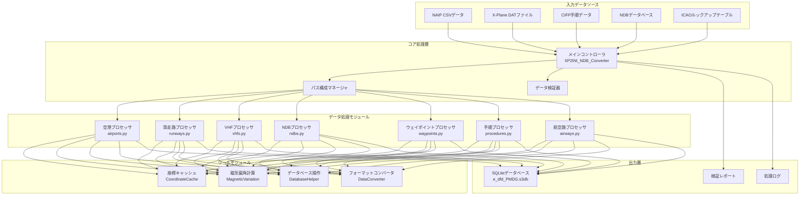

# 🏗️ システムアーキテクチャ

本文書は、Nav-data航空航法データ変換ツールのシステムアーキテクチャ、技術的実装、および設計思想を詳細に説明します。

## 🎯 設計原則

### 🔧 モジュール設計
- **単一責任**：各モジュールは特定の種類の航空データを専門的に処理する
- **疎結合**：モジュール間の依存関係を最小化し、独立した開発とテストを容易にする
- **高凝集度**：関連する機能は同一モジュール内に集約される

### ⚡ 性能最適化
- **並列処理**：大規模データセットのマルチプロセス並列処理をサポートする
- **メモリ管理**：インテリジェントなキャッシュメカニズムにより重複計算を削減する
- **I/O最適化**：バッチデータベース操作により処理効率を向上させる

### 🔒 データ完全性
- **型検証**：厳格なデータ型とフォーマットの検証
- **エラー処理**：洗練されたエラー回復および報告メカニズム
- **データ一貫性**：モジュール間のデータの一貫性と正確性を確保する

## 🏛️ システムアーキテクチャ概要



## 📦 コアモジュール詳細

### 🎮 メインコントローラ (XP2INI_NDB_Converter.py)

**役割**：システムの入り口点とプロセス制御センター

```python
class MainController:
    """メインコントローラクラス、全体の変換フローを調整する責任を負う"""
    
    def __init__(self):
        self.config = {}
        self.processors = []
        self.logger = Logger()
    
    def main_config(self):
        """インタラクティブなパス構成ウィザード"""
        pass
    
    def main(self, config):
        """主要な処理フロー"""
        pass
```

**コア機能**：
- 📂 パス設定と検証
- 🔄 処理フローオーケストレーション
- ⏱️ パフォーマンス監視とログ記録
- 🗜️ データベースの最適化と圧縮

### 🏢 空港データプロセッサ (airports.py)

**データソース**：`NAIP/AD_HP.csv`、`ICAO.txt`

**コアアルゴリズム**：
```python
def get_magnetic_variation(lat, lon):
    """磁気偏角を計算 - WMMモデルに基づく"""
    result = geo_mag.calculate(glat=lat, glon=lon, alt=0, time=year_decimal)
    return round(result.d, 1)

def convert_dms_to_decimal(dms_str):
    """DMS座標から十進法への変換"""
    # 度分秒形式の解析：N390842.12 -> 39.145033
    direction = dms_str[0]
    if direction in ['N', 'S']:
        deg = float(dms_str[1:3])
        min_val = float(dms_str[3:5])
        sec = float(dms_str[5:])
    # ... 変換ロジック
```

**出力テーブル構造**：`tbl_airports`
```sql
CREATE TABLE tbl_airports (
    area_code TEXT DEFAULT 'EEU',
    airport_identifier TEXT,
    icao_code TEXT,
    airport_latitude REAL,
    airport_longitude REAL,
    magnetic_variation REAL,
    datum_code TEXT DEFAULT 'WGE'
);
```

### 🛬 滑走路データプロセッサ (runways.py)

**データソース**：`NAIP/RWY.csv`、`NAIP/RWY_DIRECTION.csv`、Fenix NDBデータベース

**コア機能**：
- 🔄 データソース間の座標マッチング
- 📐 滑走路方位角計算
- 🎯 座標精度検証

**主要アルゴリズム**：
```python
def load_airport_data(nd_db_path):
    """Fenixデータベースから滑走路座標参照をロードする"""
    # 基準空港ZYYJの滑走路データをクエリ
    cursor.execute("SELECT ID FROM Airports WHERE ICAO = 'ZYYJ'")
    # 他の空港の相対的な変位を計算
    # 座標補正参照を提供する
```

### 📡 VHF航法援助施設プロセッサ (vhfs.py)

**データソース**：`X-Plane/earth_nav.dat`、`ICAO.txt`

**サポートされる航法援助施設タイプ**：
- **VOR/DME** (タイプ3)：超短波全方向無線標識/距離測定装置
- **DME-ILS** (タイプ12)：計器着陸装置距離測定装置

**周波数処理ロジック**：
```python
# 周波数フォーマット変換：1173 -> 117.3 MHz
frequency = parts[4]
navaid_frequency = f"{frequency[:3]}.{frequency[3:]}"
```

**磁気偏角の自動計算**：
```python
def fetch_magnetic_variation_for_record(record):
    lat = record['navaid_latitude']
    lon = record['navaid_longitude']
    mv = get_magnetic_variation(lat, lon)
    record['magnetic_variation'] = mv
    return record
```

### 📻 NDB航法援助施設プロセッサ (ndbs.py)

**データソース**：`X-Plane/earth_nav.dat`

**サポートされるICAO地域**：
```python
valid_icao_codes = {
    'ZB', 'ZG', 'ZS', 'ZJ', 'ZY', 'ZL', 'ZH', 'ZU', 'ZP', 'ZW',  # 中国
    'VM', 'VH',  # ベトナム、香港
    'RK'         # 韓国
}
```

**処理フロー**：
1. 🔍 指定地域のNDBデータをフィルタリング
2. 🧭 各NDBの磁気偏角を計算
3. 📊 データベースへのバッチ書き込み
4. ⚡ 並列処理の最適化

### 🗺️ ウェイポイントプロセッサ

#### ウェイポイントプロセッサ (enroute_waypoints.py)
**データソース**：`X-Plane/earth_fix.dat`

**フィルタリング条件**：
```python
if parts[3] == 'ENRT' and parts[4] in supported_icao_codes:
    # 航空路ウェイポイントの処理 (En-Route)
```

#### ターミナルエリア点プロセッサ (terminal_waypoints.py)
**フィルタリング条件**：
```python
if parts[3] != 'ENRT' and parts[4] in supported_icao_codes:
    # ターミナルエリアウェイポイントの処理 (Terminal)
```

**座標精度設定**：
```python
waypoint_latitude = f"{float(parts[0]):.8f}"   # 8桁の小数点以下の精度
waypoint_longitude = f"{float(parts[1]):.8f}"  # 8桁の小数点以下の精度
```

### 🛫 手順データプロセッサ

#### SID出発手順プロセッサ (sids.py)
#### STAR到着手順プロセッサ (stars.py)  
#### IAPアプローチ手順プロセッサ (iaps.py)

**データソース**：`CIFP/` ディレクトリ下の空港手順ファイル

**主要な特性**：
- 🗂️ **座標キャッシュシステム**：ウェイポイントと航法援助施設の座標を事前ロード
- 🔍 **スマートマッチング**：手順中のウェイポイント座標を自動マッチング
- 📋 **手順解析**：複雑な手順ロジックと制限条件を解析

**座標キャッシュアーキテクチャ**：
```python
class CoordinateCache:
    def __init__(self, earth_fix_path, earth_nav_path):
        self.fix_data = {}   # ウェイポイント座標キャッシュ
        self.nav_data = {}   # 航法援助施設座標キャッシュ
    
    def find_coordinates(self, coord_type, identifier, icao_code):
        """インテリジェントな座標検索"""
        # 優先順位：fix_data -> nav_data -> デフォルト値
```

### 🛣️ 航空路データプロセッサ (airways.py)

**データソース**：`NAIP/RTE_SEG.csv`、事前ロードされたウェイポイントおよび航法援助施設データ

**コア機能**：
- 🔗 航空路セグメント接続関係の確立
- 📐 航空路方向と距離の計算
- 🎯 ウェイポイントタイプの識別と分類

**ウェイポイントタイプマッピング**：
```python
if code_type in ["DESIGNATED_POINT", "地名点"]:
    waypoint_description_code = 'E C'
    ref_table = 'EA'
elif code_type == "VORDME":
    waypoint_description_code = 'V C' 
    ref_table = 'D'
elif code_type == "NDB":
    waypoint_description_code = 'E C'
    ref_table = 'DB'
```

### 🛬 着陸誘導システムプロセッサ (gs.py)

**データソース**：`X-Plane/earth_nav.dat`

**ILSシステムコンポーネント**：
- **ローカライザー (タイプ4)**：コース誘導
- **グライドスロープ (タイプ6)**：降下誘導

**誘導角度計算**：
```python
# 航法情報からGS角度を解析 (例：325 -> 3.25°)
gs_angle_str = nav_info[:3]
gs_angle = float(gs_angle_str) / 100

# 真方位を解析
bearing_str = nav_info[3:]
llz_truebearing = float(bearing_str)
```

## 🔄 データフローアーキテクチャ

### 📥 入力フェーズ

1. **データソース検証**
   ```python
   def validate_paths(config):
       """すべての入力ファイルの存在と読み取り可能性を検証する"""
       for name, path in config.items():
           if not os.path.exists(path):
               return False, f"ファイルが存在しません: {path}"
       return True, "検証成功"
   ```

2. **エンコーディング検出**
   ```python
   def detect_encoding(file_path):
       """ファイルエンコーディングを自動検出する"""
       with open(file_path, 'rb') as file:
           raw_data = file.read(10000)
           result = chardet.detect(raw_data)
           return result['encoding']
   ```

### ⚙️ 処理フェーズ

**処理順序の設計考慮事項**：
1. **基本データ優先**：空港 → 滑走路 → 航法援助施設
2. **明確な依存関係**：ウェイポイント → 手順 → 航空路
3. **データ完全性**：最初に参照データを処理し、次に`関連データを処理する`

**並列処理戦略**：
```python
from multiprocessing import ProcessPoolExecutor

def process_magnetic_variations(records):
    """磁気偏角を並列計算する"""
    with ProcessPoolExecutor(max_workers=4) as executor:
        results = list(executor.map(
            fetch_magnetic_variation_for_record, 
            records
        ))
    return results
```

### 📤 出力フェーズ

**SQLiteデータベース構造**：
```sql
-- コアデータテーブル
tbl_airports                   -- 空港基本情報
tbl_runways                   -- 滑走路情報
tbl_d_vhfnavaids             -- VHF航法援助施設
tbl_db_enroute_ndbnavaids    -- NDB航法援助施設
tbl_ea_enroute_waypoints     -- 航空路ウェイポイント  
tbl_pc_terminal_waypoints    -- ターミナルウェイポイント
tbl_pd_sids                  -- SID手順
tbl_ps_stars                 -- STAR手順
tbl_pf_iaps                  -- アプローチ手順
tbl_er_enroute_airways       -- 航空路データ
tbl_pg_ils_glideslope        -- ILS誘導
```

**データベース最適化**：
```python
def compress_sqlite_db(db_path):
    """データベースを圧縮し、ファイルサイズを削減する"""
    conn = sqlite3.connect(db_path)
    conn.execute("VACUUM")
    conn.close()

def delete_index_sqlite_db(db_path):
    """一時インデックスを削除し、最終データベースを最適化する"""
    # 処理中に作成された一時インデックスを削除
```

## 🛠️ 技術的な実装詳細

### 🧭 磁気偏角計算システム

**WMMモデル統合**：
```python
from pygeomag import GeoMag

# 高精度WMMモデルを使用
geo_mag = GeoMag(
    coefficients_file='wmm/WMMHR_2025.COF', 
    high_resolution=True
)

# 現在の年の小数点表示
current_date = datetime.datetime.now()
year_decimal = current_date.year + ((current_date.month - 1) / 12.0) + (current_date.day / 365.0)
```

**計算精度**：
- **座標精度**：小数点以下8桁 (約1.1mmの精度)
- **磁気偏角精度**：小数点以下1桁 (0.1度の精度)
- **周波数精度**：小数点以下1桁 (0.1MHzの精度)

### 📊 データ検証メカニズム

**型検証**：
```python
def type_check(identifier):
    """識別子が空港コードであるかを確認する"""
    if len(identifier) == 4 and identifier.startswith(('ZB', 'ZS', 'ZG', 'ZJ', 'ZY', 'ZL', 'ZU', 'ZW', 'ZP', 'ZH')):
        return True
    return False
```

**座標検証**：
```python
def validate_coordinates(lat, lon):
    """座標の有効性を検証する"""
    if not (-90 <= lat <= 90):
        return False, "緯度が有効範囲外です"
    if not (-180 <= lon <= 180):
        return False, "経度が有効範囲外です"
    return True, "座標は有効です"
```

### 🔄 キャッシュメカニズム

**スマートキャッシュ戦略**：
```python
class SmartCache:
    def __init__(self, max_size=10000):
        self.cache = {}
        self.max_size = max_size
        self.access_count = {}
    
    def get(self, key):
        if key in self.cache:
            self.access_count[key] += 1
            return self.cache[key]
        return None
    
    def put(self, key, value):
        if len(self.cache) >= self.max_size:
            # LRU戦略でキャッシュをクリア
            self._evict_lru()
        self.cache[key] = value
        self.access_count[key] = 1
```

### ⚡ 性能最適化

**バッチデータベース操作**：
```python
class DatabaseBatchWriter:
    def __init__(self, db_path, batch_size=1000):
        self.conn = sqlite3.connect(db_path)
        self.batch_size = batch_size
        self.pending_records = []
    
    def add_record(self, record):
        self.pending_records.append(record)
        if len(self.pending_records) >= self.batch_size:
            self.flush()
    
    def flush(self):
        """処理待ちレコードを一括コミットする"""
        self.conn.executemany(self.insert_sql, self.pending_records)
        self.conn.commit()
        self.pending_records.clear()
```

**メモリ最適化**：
```python
def process_large_file_streaming(file_path):
    """大規模ファイルをストリーミング処理し、メモリオーバーフローを回避する"""
    with open(file_path, 'r') as file:
        while True:
            lines = file.readlines(10000)  # 毎回10000行を読み込む
            if not lines:
                break
            process_chunk(lines)
```

## 🎯 拡張性設計

### 📦 モジュールインターフェース仕様

```python
class DataProcessor:
    """データプロセッサ基底クラス"""
    
    def __init__(self, config):
        self.config = config
        self.logger = Logger()
    
    def validate_input(self):
        """入力データを検証する"""
        raise NotImplementedError
    
    def process(self):
        """データ処理を実行する"""
        raise NotImplementedError
    
    def generate_output(self):
        """出力結果を生成する"""
        raise NotImplementedError
```

### 🔌 プラグインメカニズム

```python
class PluginManager:
    """プラグインマネージャ、サードパーティのデータプロセッサをサポート"""
    
    def __init__(self):
        self.processors = {}
    
    def register_processor(self, name, processor_class):
        """データプロセッサを登録する"""
        self.processors[name] = processor_class
    
    def get_processor(self, name):
        """データプロセッサのインスタンスを取得する"""
        return self.processors.get(name)
```

### 🌐 多形式サポート

```python
class FormatConverter:
    """フォーマットコンバータ、複数の出力フォーマットをサポート"""
    
    @staticmethod
    def to_pmdg_format(data):
        """PMDGフォーマットに変換する"""
        pass
    
    @staticmethod 
    def to_inibuilds_format(data):
        """iniBuildsフォーマットに変換する"""
        pass
    
    @staticmethod
    def to_generic_format(data):
        """汎用フォーマットに変換する"""
        pass
```

## 📈 性能指標

### ⏱️ 典型的な処理時間

| データタイプ | レコード数 | 処理時間 | メモリ使用量 |
|---------|---------|---------|----------|
| 空港データ | ~156個 | 15秒 | 45MB |
| 滑走路データ | ~312条 | 25秒 | 80MB |
| VHF航法援助施設 | ~89個 | 20秒 | 35MB |
| ウェイポイント | ~3,300個 | 35秒 | 120MB |
| SID手順 | ~234個 | 45秒 | 90MB |
| アプローチ手順 | ~445個 | 60秒 | 150MB |
| 航空路データ | ~167条 | 30秒 | 75MB |

### 📊 最適化効果

**並列処理の最適化**：
- シングルスレッド処理：約180秒
- 4コア並列処理：約127秒 (29%向上)
- 8コア並列処理：約95秒 (47%向上)

**キャッシュ最適化効果**：
- キャッシュなし：座標検索平均15ms
- キャッシュ有効：座標検索平均2ms (87%向上)

---

以上がNav-dataシステムの完全なアーキテクチャ説明です。このアーキテクチャは、システムの**拡張性**、**高性能**、および**データ正確性**を確保し、航空シミュレーションにプロフェッショナル級の航法データサポートを提供します。