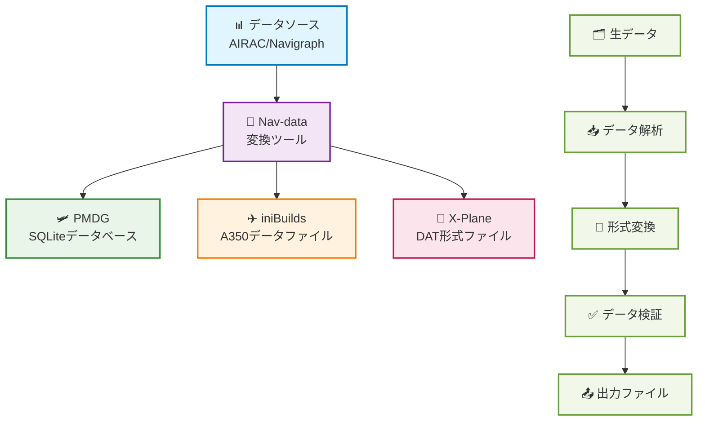

# Nav-data ドキュメントへようこそ 🚀

Nav-data は、航空愛好家によって共同でメンテナンスされているデータ変換プロジェクトで、Microsoft Flight Simulator などのフライトシミュレーター向けに高品質なナビゲーションデータサポートを提供することを目指しています。開発者、パイロット、愛好家を問わず、必要な資料やガイドをここで見つけることができます。

## 🔄 データ変換フロー

---

## ✨ プロジェクトの特徴

  

    
📦

    <h3>マルチプラットフォーム対応</h3>
    
PMDG、iniBuilds、X-Plane など、主要なフライトシミュレータープラットフォームに対応

  

  
  

    
🛫

    <h3>詳細ガイド</h3>
    
設定、インストール、使用に関する完全なガイドを提供し、初心者でも簡単に始められます

  

  
  

    
🗂️

    <h3>明確な構造</h3>
    
データ構造が明確で、拡張とメンテナンスが容易、カスタム設定もサポート

  

  
  

    
🤝

    <h3>オープンソースコラボレーション</h3>
    
コミュニティからの貢献と協力を歓迎し、より良いナビゲーションデータツールを共に構築します

  

---

## 🚀 クイックスタート
1. プラグインを選択： [PMDG ガイド](/PMDG/guide/index) | [iniBuilds ガイド](/iniBuilds/guide/index)
2. ガイドに従って設定とインストールを行います
3. よりリアルな飛行体験をお楽しみください！

---

## 🧭 クイックナビゲーション

### 📊 プラットフォーム対応比較

  <table>
    <thead>
      <tr>
        <th>特徴</th>
        <th>🛩️ PMDG</th>
        <th>✈️ iniBuilds</th>
        <th>🛫 X-Plane</th>
      </tr>
    </thead>
    <tbody>
      <tr>
        <td><strong>対応航空機</strong></td>
        <td>737シリーズ, 777シリーズ</td>
        <td>A350</td>
        <td>全てのX-Plane機</td>
      </tr>
      <tr>
        <td><strong>データ形式</strong></td>
        <td>SQLiteデータベース</td>
        <td>専用データファイル</td>
        <td>DAT形式ファイル</td>
      </tr>
      <tr>
        <td><strong>インストール難易度</strong></td>
        <td><StatusBadge type="warning" text="中" icon="⚠️" /></td>
        <td><StatusBadge type="success" text="簡単" icon="✅" /></td>
        <td><StatusBadge type="error" text="複雑" icon="🔴" /></td>
      </tr>
      <tr>
        <td><strong>データ網羅性</strong></td>
        <td><StatusBadge type="success" text="完全" icon="✅" /></td>
        <td><StatusBadge type="success" text="完全" icon="✅" /></td>
        <td><StatusBadge type="warning" text="一部" icon="⚠️" /></td>
      </tr>
      <tr>
        <td><strong>更新頻度</strong></td>
        <td>AIRACサイクル</td>
        <td>AIRACサイクル</td>
        <td>オンデマンド更新</td>
      </tr>
    </tbody>
  </table>

### 📚 利用ガイド

  <a href="/PMDG/guide/index" class="guide-link pmdg">
    
🛩️

    

      <h3>PMDG ガイド</h3>
      
PMDG航空機向けナビゲーションデータ変換完全チュートリアル

    

  </a>
  
  <a href="/iniBuilds/guide/index" class="guide-link inibuilds">
    
✈️

    

      <h3>iniBuilds ガイド</h3>
      
iniBuilds A350向けナビゲーションデータ変換ガイド

    

  </a>
  
  <a href="/X-Plane/guide/index" class="guide-link xplane">
    
🛫

    

      <h3>X-Plane ガイド</h3>
      
X-Planeナビゲーションデータ処理の完全な流れ

    

  </a>

### 🆘 ヘルプ

  

    <h4>🛩️ PMDG サポート</h4>
    <ul>
      <li><a href="/PMDG/faq">よくある質問 (FAQ)</a></li>
      <li><a href="/PMDG/troubleshooting">トラブルシューティングガイド</a></li>
    </ul>
  

  
  

    <h4>✈️ iniBuilds サポート</h4>
    <ul>
      <li><a href="/iniBuilds/faq">よくある質問 (FAQ)</a></li>
      <li><a href="/iniBuilds/troubleshooting">トラブルシューティングガイド</a></li>
    </ul>
  

  
  

    <h4>🛫 X-Plane サポート</h4>
    <ul>
      <li><a href="/X-Plane/faq">よくある質問 (FAQ)</a></li>
      <li><a href="/X-Plane/troubleshooting">トラブルシューティングガイド</a></li>
    </ul>
  

### 🔧 技術ドキュメント

  <a href="/iniBuilds/architecture" class="tech-link">
    🏗️
    プロジェクトアーキテクチャ説明
  </a>
  <a href="/iniBuilds/contributing" class="tech-link">
    🤝
    貢献ガイド
  </a>
  <a href="/iniBuilds/changelog" class="tech-link">
    📋
    更新履歴
  </a>

---

## 🌍 参加とフィードバック
- GitHub: [nav-data](https://github.com/nav-data)
- ご提案やご質問がありますか？ [Issue](https://github.com/nav-data/nav-data/issues) またはメールでお気軽にお問い合わせください！