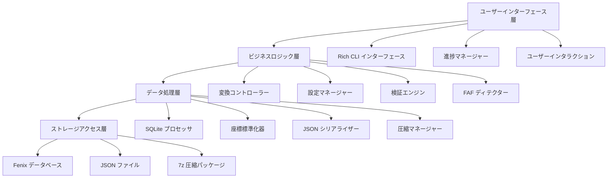
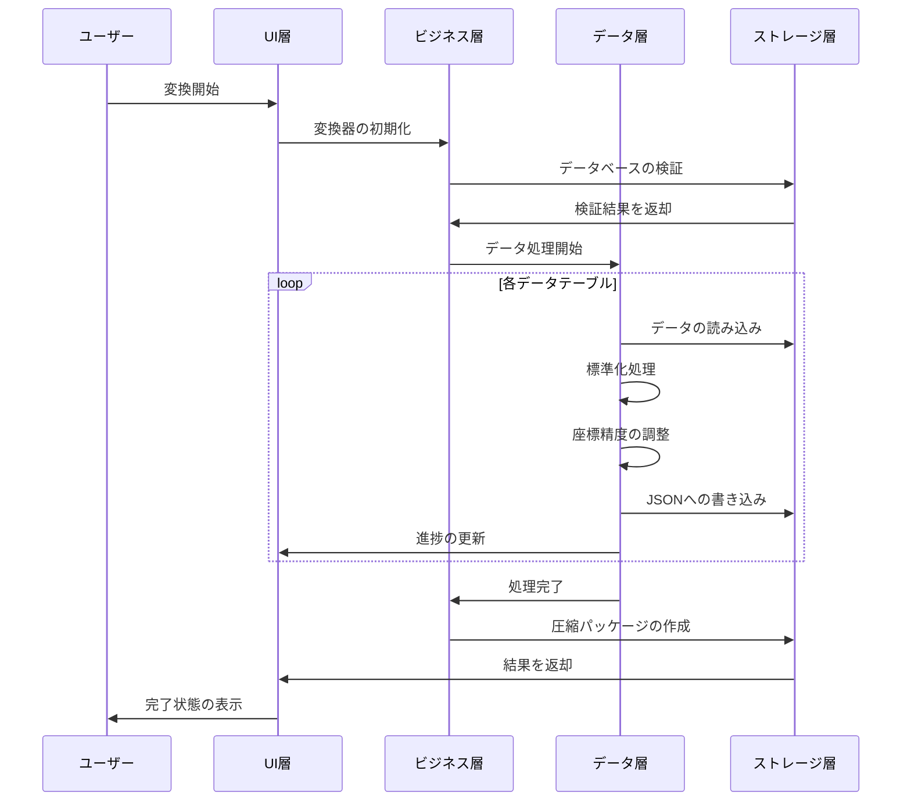

# 🏗️ TFDI 航法データ変換器のアーキテクチャ

## システム概要

TFDI 航法データ変換器は、Fenix A320 の航法データベースを TFDI MD-11 互換の JSON 形式に変換するために特別に設計された、プロフェッショナルな航空航法データ変換ツールです。このツールは、最新のアーキテクチャ設計を採用し、効率的で信頼性の高いデータ変換サービスを提供します。

## 🎯 設計原則

### 1. データ整合性最優先
- **厳格な検証**: 多層データ検証メカニズム
- **関係性の維持**: 航法データ間の依存関係を維持する
- **精度の保証**: 座標と計算の高精度を維持する
- **一貫性チェック**: 変換後のデータの論理的一貫性を確保する

### 2. 性能最適化指向
- **SQLite の最適化**: WAL モードと性能チューニング
- **バッチ処理**: メモリ効率の高いバッチ処理戦略
- **キャッシュメカニズム**: スマートなデータキャッシュと再利用
- **圧縮の最適化**: 高速な 7z 圧縮とクリーンアップ

### 3. ユーザーエクスペリエンス最優先
- **Rich CLI**: 最新のカラーターミナルインターフェース
- **リアルタイムフィードバック**: 詳細な進捗表示とステータス更新
- **親切なプロンプト**: プロフェッショナルなエラー処理と回復提案
- **インタラクションデザイン**: 直感的な操作フローガイダンス

## 🏗️ システムアーキテクチャ

### 全体アーキテクチャ図



### コアコンポーネント詳細

#### 1. ユーザーインターフェース層 (UI Layer)
**役割**: ユーザーインタラクションインターフェースとフィードバックを提供する
```python
class RichInterface:
    """Rich CLI 界面管理器"""
    - progress_tracking: 进度条管理
    - status_display: 状态信息显示
    - error_presentation: 错误信息展示
    - user_input: 用户输入处理
```

#### 2. ビジネスロジック層 (Business Layer)
**役割**: コアビジネスロジックとプロセス制御
```python
class FenixToTFDIConverter:
    """主转换器类"""
    - database_validation: 数据库验证
    - conversion_orchestration: 转换流程编排
    - faf_detection: FAF 点检测
    - data_normalization: 数据标准化
```

#### 3. データ処理層 (Data Layer)
**役割**: データ変換と処理アルゴリズム
```python
class DataProcessor:
    """数据处理核心"""
    - coordinate_precision: 坐标精度处理
    - column_standardization: 列名标准化
    - relationship_mapping: 关系映射
    - format_conversion: 格式转换
```

#### 4. ストレージアクセス層 (Storage Layer)
**役割**: データベースアクセスとファイル操作
```python
class StorageManager:
    """存储管理器"""
    - sqlite_optimization: SQLite 性能优化
    - file_operations: 文件读写操作
    - compression_handling: 压缩文件处理
    - backup_management: 备份管理
```

## 📊 データフローアーキテクチャ

### 変換パイプライン



### データマッピングアーキテクチャ


## 🔧 技術スタック

### コア技術

| コンポーネント | 技術選択 | バージョン要件 | 用途 |
|------|----------|----------|------|
| **Python** | Python 3.8+ | ≥ 3.8.0 | 主要プログラミング言語 |
| **Rich** | Rich Library | ≥ 12.0.0 | CLI インターフェースの美化 |
| **SQLite3** | 内蔵モジュール | Python 内蔵 | データベースアクセス |
| **Pandas** | DataFrame | ≥ 1.3.0 | データ処理 |
| **JSON** | 内蔵モジュール | Python 内蔵 | データシリアライズ |
| **py7zr** | 7-Zip Python | ≥ 0.18.0 | 圧縮処理 |

### アーキテクチャ特性

#### 1. モジュール化設計
```python
fenix_to_tfdi/
├── core/                  # コアモジュール
│   ├── converter.py       # メイン変換器
│   ├── validator.py       # データバリデーター
│   └── config.py         # 設定管理
├── data/                  # データ処理
│   ├── processor.py       # データプロセッサ
│   ├── normalizer.py      # 標準化ツール
│   └── serializer.py     # シリアライズツール
├── ui/                    # ユーザーインターフェース
│   ├── cli.py            # コマンドラインインターフェース
│   └── progress.py       # 進捗管理
└── utils/                 # ユーティリティモジュール
    ├── storage.py        # ストレージツール
    └── compression.py    # 圧縮ツール
```

#### 2. 設定駆動アーキテクチャ
```python
@dataclass
class ConverterConfig:
    """変換器設定クラス"""
    output_dir: str = "Primary"
    procedure_legs_dir: str = "Primary/ProcedureLegs"
    archive_name: str = "Primary.7z"
    coordinate_precision: int = 8
    vnav_threshold: float = 2.5
    
    # SQLite 最適化設定
    sqlite_pragmas: Dict[str, str] = field(default_factory=lambda: {
        "journal_mode": "WAL",
        "synchronous": "NORMAL",
        "cache_size": "10000",
        "temp_store": "MEMORY"
    })
```

## 🚀 パフォーマンスアーキテクチャ

### メモリ管理戦略

#### 1. ストリーミング処理
```python
def process_large_table(table_name: str, batch_size: int = 1000):
    """大規模テーブルのストリーミング処理"""
    offset = 0
    while True:
        query = f"""
        SELECT * FROM {table_name} 
        LIMIT {batch_size} OFFSET {offset}
        """
        
        batch = execute_query(query)
        if not batch:
            break
            
        process_batch(batch)
        offset += batch_size
```

#### 2. キャッシュ最適化
```python
class WaypointCache:
    """ウェイポイントキャッシュ管理"""
    def __init__(self, max_size: int = 10000):
        self._cache: Dict[str, WaypointData] = {}
        self._max_size = max_size
        self._access_times: Dict[str, float] = {}
    
    def get_waypoint(self, waypoint_id: str) -> Optional[WaypointData]:
        """キャッシュされたウェイポイントデータを取得する"""
        if waypoint_id in self._cache:
            self._access_times[waypoint_id] = time.time()
            return self._cache[waypoint_id]
        return None
```

### 並行処理アーキテクチャ

#### 1. マルチスレッド設計
```python
class ConcurrentProcessor:
    """並行プロセッサ"""
    def __init__(self, max_workers: int = 4):
        self.max_workers = max_workers
        self.executor = ThreadPoolExecutor(max_workers=max_workers)
    
    def process_tables_parallel(self, tables: List[str]):
        """複数のテーブルを並行処理する"""
        futures = []
        for table in tables:
            future = self.executor.submit(self.process_table, table)
            futures.append(future)
        
        # すべてのタスクが完了するのを待つ
        concurrent.futures.wait(futures)
```

#### 2. リソースプール管理
```python
class DatabaseConnectionPool:
    """データベース接続プール"""
    def __init__(self, db_path: str, pool_size: int = 5):
        self.db_path = db_path
        self.pool_size = pool_size
        self.connections: Queue = Queue(maxsize=pool_size)
        self._init_pool()
    
    def get_connection(self) -> sqlite3.Connection:
        """データベース接続を取得する"""
        return self.connections.get()
    
    def return_connection(self, conn: sqlite3.Connection):
        """データベース接続を返却する"""
        self.connections.put(conn)
```

## 🔒 セキュリティアーキテクチャ

### データ保護メカニズム

#### 1. 入力検証
```python
class InputValidator:
    """入力バリデーター"""
    
    @staticmethod
    def validate_database_path(path: str) -> bool:
        """データベースパスのセキュリティを検証する"""
        # パス遍歴攻撃をチェック
        if ".." in path or path.startswith("/"):
            return False
        
        # ファイル拡張子を検証する
        if not path.endswith(('.db', '.db3', '.sqlite')):
            return False
        
        return True
    
    @staticmethod  
    def validate_terminal_id(terminal_id: int) -> bool:
        """端末IDの範囲を検証する"""
        return 1 <= terminal_id <= 999999
```

#### 2. エラー分離
```python
class SafeConverter:
    """安全な変換器"""
    
    def safe_convert_table(self, table_name: str) -> bool:
        """安全なテーブル変換"""
        try:
            with self.create_transaction() as transaction:
                result = self.convert_table(table_name)
                transaction.commit()
                return result
        except DatabaseError as e:
            self.logger.error(f"データベースエラー: {e}")
            transaction.rollback()
            return False
        except Exception as e:
            self.logger.error(f"未知のエラー: {e}")
            return False
```

## 📈 スケーラブルアーキテクチャ

### プラグインシステム設計

#### 1. 変換器プラグインインターフェース
```python
class ConverterPlugin(ABC):
    """変換器プラグイン抽象基底クラス"""
    
    @abstractmethod
    def get_name(self) -> str:
        """プラグイン名を取得する"""
        pass
    
    @abstractmethod
    def get_supported_formats(self) -> List[str]:
        """サポートされている形式を取得する"""
        pass
    
    @abstractmethod
    def convert_data(self, data: Any, config: ConverterConfig) -> Any:
        """データを変換する"""
        pass
```

#### 2. 形式拡張メカニズム
```python
class FormatRegistry:
    """形式レジストリ"""
    
    def __init__(self):
        self._converters: Dict[str, ConverterPlugin] = {}
    
    def register_converter(self, format_name: str, converter: ConverterPlugin):
        """変換器を登録する"""
        self._converters[format_name] = converter
    
    def get_converter(self, format_name: str) -> Optional[ConverterPlugin]:
        """変換器を取得する"""
        return self._converters.get(format_name)
```

### データソース拡張

#### 1. データソース抽象化
```python
class DataSource(ABC):
    """データソース抽象基底クラス"""
    
    @abstractmethod
    def connect(self) -> bool:
        """データソースに接続する"""
        pass
    
    @abstractmethod
    def get_tables(self) -> List[str]:
        """テーブルリストを取得する"""
        pass
    
    @abstractmethod
    def query_data(self, query: str) -> Iterator[Dict]:
        """データをクエリする"""
        pass
```

## 🔄 保守性アーキテクチャ

### ロギングシステム

#### 1. 構造化ログ
```python
class StructuredLogger:
    """構造化ロガー"""
    
    def __init__(self, name: str):
        self.logger = logging.getLogger(name)
        self.logger.setLevel(logging.INFO)
        
        # Rich 形式化ハンドラー
        rich_handler = RichHandler(rich_tracebacks=True)
        rich_handler.setFormatter(
            logging.Formatter(
                "%(asctime)s - %(name)s - %(levelname)s - %(message)s"
            )
        )
        self.logger.addHandler(rich_handler)
    
    def log_conversion_start(self, table_name: str, record_count: int):
        """変換開始を記録する"""
        self.logger.info(
            f"開始変換表 {table_name}",
            extra={
                "table": table_name,
                "record_count": record_count,
                "operation": "conversion_start"
            }
        )
```

#### 2. パフォーマンス監視
```python
class PerformanceMonitor:
    """パフォーマンスモニター"""
    
    def __init__(self):
        self.metrics: Dict[str, List[float]] = defaultdict(list)
    
    @contextmanager
    def measure_time(self, operation: str):
        """操作にかかる時間を計測する"""
        start_time = time.time()
        try:
            yield
        finally:
            elapsed = time.time() - start_time
            self.metrics[operation].append(elapsed)
            self.logger.debug(f"{operation} 経過時間: {elapsed:.2f}s")
```

## 📊 テストアーキテクチャ

### テスト戦略

#### 1. 階層型テスト
```python
# 単体テスト
class TestDataProcessor(unittest.TestCase):
    def test_coordinate_normalization(self):
        """座標の標準化をテスト"""
        processor = DataProcessor()
        result = processor.normalize_coordinate(39.916667, 8)
        self.assertEqual(result, 39.91666700)

# 統合テスト  
class TestConverterIntegration(unittest.TestCase):
    def test_full_conversion_pipeline(self):
        """完全な変換パイプラインをテスト"""
        converter = FenixToTFDIConverter(test_config)
        result = converter.convert(test_database_path)
        self.assertTrue(result)

# 性能テスト
class TestPerformance(unittest.TestCase):
    def test_large_database_conversion(self):
        """大規模データベース変換の性能をテスト"""
        start_time = time.time()
        converter.convert(large_test_database)
        elapsed = time.time() - start_time
        self.assertLess(elapsed, 300)  # 5分以内に完了する必要がある
```

---

このアーキテクチャ設計は、TFDI 航法データ変換器の**信頼性**、**パフォーマンス**、**保守性**を確保し、TFDI MD-11 フライトシミュレーションコミュニティにプロフェッショナルグレードのデータ変換ソリューションを提供します。🚁✨
