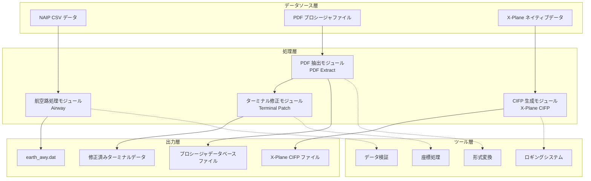
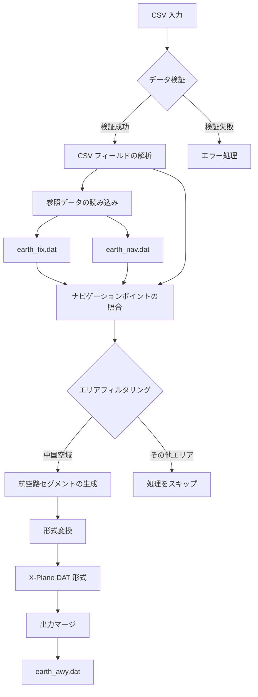
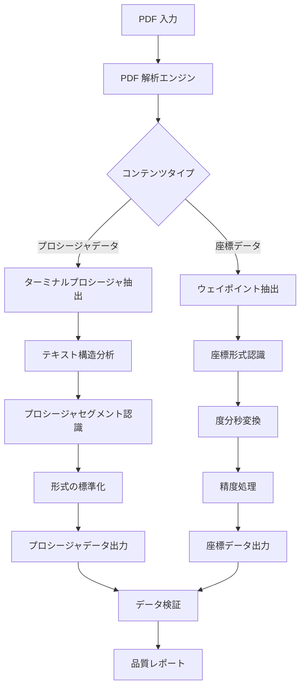
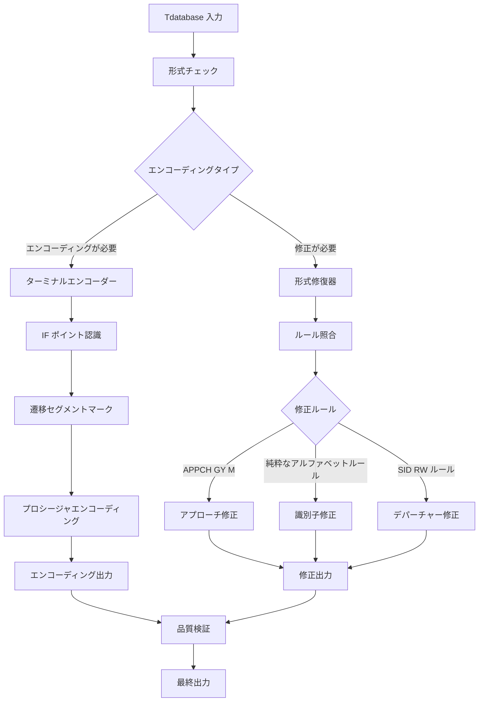
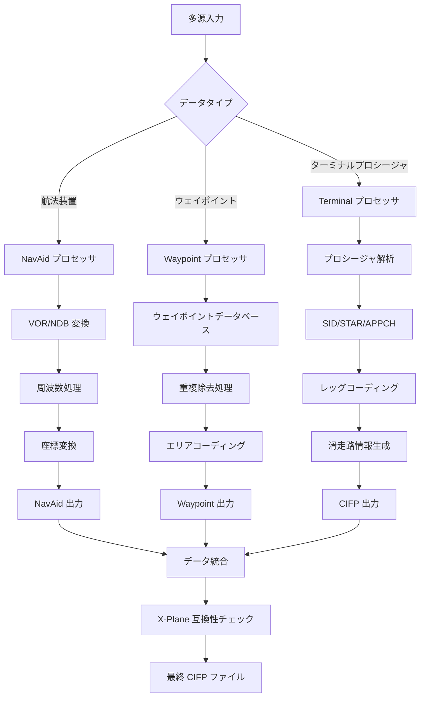
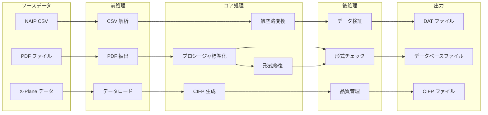
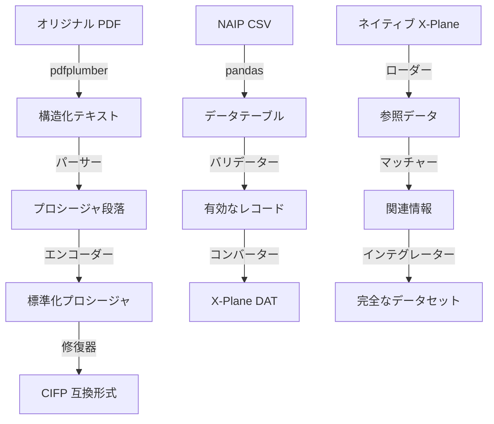
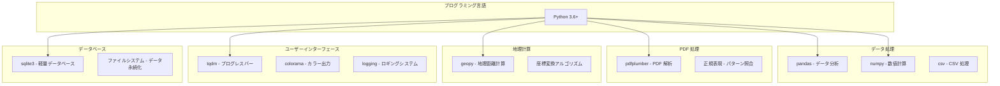
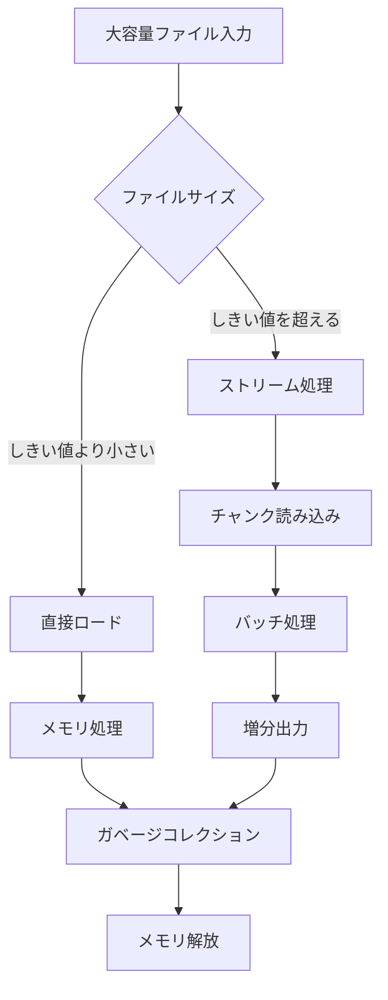
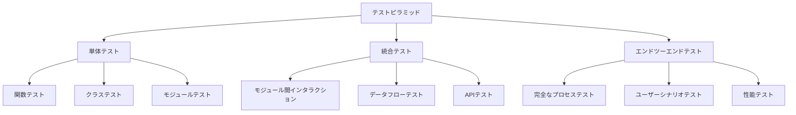

# アーキテクチャ説明

本文書では、Nav-dataプロジェクトのシステムアーキテクチャ、技術原理、および設計思想について詳しく説明します。

## 🏗️ 全体アーキテクチャ

Nav-dataはモジュール設計を採用しており、4つのコアモジュールで構成され、各モジュールは独立して動作し、柔軟に組み合わせて使用できます。



## 📋 設計原則

### 1. モジュール設計
- **独立性**：各モジュールは独立して動作し、他のモジュールに強く依存しない
- **組み合わせ可能性**：モジュールは柔軟に組み合わせて異なる処理フローを形成できる
- **拡張性**：新しいモジュールを既存のアーキテクチャにシームレスに統合できる

### 2. データフロー駆動
- **単方向データフロー**：データはソースからターゲットへ流れ、循環依存を回避
- **中間状態の保存**：各処理ステップは中間結果を保存し、デバッグと回復を容易にする
- **形式の標準化**：統一されたデータ形式規範により、モジュール間の互換性を確保

### 3. 許容誤差と回復
- **段階的処理**：複雑なタスクを複数の小さなステップに分解し、失敗のリスクを低減
- **エラー隔離**：単一ファイルの処理失敗がバッチ処理全体に影響を与えない
- **状態の保存**：重要な状態情報を永続化し、中断からの再開をサポート

### 4. 性能最適化
- **メモリ効率**：大容量ファイルをストリーム処理し、メモリオーバーフローを回避
- **バッチ処理**：バッチ処理によりI/O効率を向上
- **並行処理のサポート**：マルチスレッド/マルチプロセスによる並行処理をサポート

## 🛠️ コアモジュールアーキテクチャ

### 航空路処理モジュール (Airway)



**技術的特徴：**
- **データ照合アルゴリズム**：識別子と座標に基づくインテリジェントな照合
- **エリアフィルタリングメカニズム**：柔軟な地理的エリアフィルタリング設定をサポート
- **形式変換エンジン**：CSVからX-Plane DAT形式への正確な変換
- **AIRACサイクル管理**：航空データ有効期間の自動計算と管理

**コアクラスとインターフェース：**
```python
class NavigationType(Enum):
    """ナビゲーションポイントタイプ列挙型"""
    DESIGNATED_POINT = ('DESIGNATED_POINT', '11')
    VORDME = ('VORDME', '3') 
    NDB = ('NDB', '2')

@dataclass
class NavigationPoint:
    """ナビゲーションポイントデータ構造"""
    identifier: str
    type: NavigationType
    area_code: str

def process_navigation_point(identifier: str, code_type: str, 
                           earth_fix_data: Dict, earth_nav_data: Dict) -> Optional[NavigationPoint]:
    """ナビゲーションポイント処理コアアルゴリズム"""
    pass

def convert_csv_to_dat(csv_file: str, earth_fix_path: str, 
                      earth_nav_path: str, earth_awy_path: str) -> None:
    """主要変換関数"""
    pass
```

### PDF 抽出モジュール (PDF Extract)



**技術的特徴：**
- **多層解析**：テキスト、線、表などの多様なPDF要素をサポート
- **スマート認識**：座標形式とプロシージャ構造を自動認識
- **許容誤差メカニズム**：PDF形式の不整合やデータ欠損を処理
- **品質管理**：組み込みのデータ品質チェックとレポートメカニズム

**コアコンポーネント：**
```python
class Line:
    """線要素クラス"""
    def __init__(self, line: dict):
        self.is_horizontal = True if line["width"] > 5 else False
        self.top = line["top"]
        self.left = line["x0"]
        self.length = line["width"] if self.is_horizontal else line["height"]

class Word:
    """テキスト要素クラス"""
    def __init__(self, info: dict):
        self.content = info["text"]
        self.center = ((info["x0"] + info["x1"]) / 2, (info["top"] + info["bottom"]) / 2)

class Unit:
    """処理単位クラス"""
    def __init__(self):
        self.words = []
        self.lines = []
    
    def match_underline(self):
        """下線照合アルゴリズム"""
        pass

def extract(pdf: pdfplumber.PDF) -> List[str]:
    """PDF抽出メイン関数"""
    pass
```

### ターミナル修正モジュール (Terminal Patch)



**技術的特徴：**
- **ルールエンジン**：設定に基づいた修正ルールエンジン
- **パターン認識**：異なる種類のプロシージャと識別子をスマートに認識
- **バッチ処理**：フォルダレベルでのバッチ修正をサポート
- **後方互換性**：既存のデータ形式との互換性を維持

**修正ルールシステム：**
```python
class FixRule:
    """修正ルール基底クラス"""
    def __init__(self, name: str, pattern: str, action: callable):
        self.name = name
        self.pattern = pattern
        self.action = action
    
    def apply(self, line: str) -> str:
        """修正ルールを適用"""
        pass

class RuleEngine:
    """ルールエンジン"""
    def __init__(self):
        self.rules = []
    
    def add_rule(self, rule: FixRule):
        """修正ルールを追加"""
        self.rules.append(rule)
    
    def apply_rules(self, content: str) -> str:
        """全てのルールを適用"""
        pass

# 事前定義された修正ルール
APPCH_GY_M_RULE = FixRule(
    name="APPCH_GY_M",
    pattern=r"APPCH.*GY M",
    action=lambda line: fix_appch_gy_m(line)
)
```

### X-Plane CIFP モジュール (X-Plane CIFP)



**技術的特徴：**
- **多源データ統合**：NAIP、X-Planeネイティブデータなど複数のデータソースを統合
- **スマートな重複除去**：座標と識別子に基づくスマートな重複除去アルゴリズム
- **バージョン互換性**：X-Plane 11およびX-Plane 12形式をサポート
- **データ完全性**：生成されるCIFPデータが完全であり、標準に準拠していることを保証

**コアデータ構造：**
```python
class Waypoint:
    """ウェイポイントクラス"""
    def __init__(self, la: float, long: float, ident: str, cat: int, 
                 airport: str = '', area: str = '', changeable: bool = True):
        self.latitude = la
        self.longitude = long
        self.ident = ident
        self.cat = cat  # -1:不可用 1:航路点 2:VHF 3:NDB
        self.airport = airport
        self.area = area
        self.changeable = changeable
    
    def is_same(self, fix: "Waypoint", change: bool = False) -> bool:
        """同じウェイポイントであるか判断する"""
        pass

class WaypointSystem:
    """ウェイポイント管理システム"""
    def __init__(self):
        self.base = {}  # メインデータベース
    
    def add_point(self, point: Waypoint):
        """ウェイポイントを追加する"""
        pass
    
    def query(self, point: Waypoint, change: bool = False) -> int:
        """ウェイポイントを照会する"""
        pass

class Procedure:
    """プロシージャクラス"""
    def __init__(self, ptype: int):
        self.ptype = "SID" if ptype == 1 else ("STAR" if ptype == 2 else "APPCH")
        self.airport = None
        self.runway = None
        self.name = None
        self.legs = []
    
    def encode(self):
        """プロシージャエンコーディング"""
        pass
    
    def output(self) -> str:
        """CIFP形式で出力する"""
        pass
```

## 🔄 データフローアーキテクチャ

### データフロー図



### データ形式変換チェーン



## ⚙️ 技術スタックアーキテクチャ

### コア技術コンポーネント



### 依存関係管理

```python
# requirements.txt 依存関係階層
# コア依存関係
pandas>=1.3.0          # データ処理基盤
numpy>=1.21.0          # 数値計算基盤

# PDF 処理
pdfplumber>=0.7.0      # PDF 解析エンジン

# ユーザーエクスペリエンス
tqdm>=4.60.0           # 進捗表示
colorama>=0.4.4        # カラー出力

# 地理計算
geopy>=2.2.0           # 地理距離計算

# 中国語処理
pypinyin>=0.44.0       # 中国語ピンイン変換

# 開発ツール（オプション）
pytest>=6.0.0          # テストフレームワーク
black>=21.0.0          # コード整形
flake8>=3.9.0          # コード検査
```

## 🏛️ 設計パターン

### 1. ファクトリパターン (Factory Pattern)
異なるタイプのデータプロセッサを作成するために使用されます。

```python
class ProcessorFactory:
    """データプロセッサファクトリ"""
    
    @staticmethod
    def create_processor(data_type: str):
        if data_type == "airway":
            return AirwayProcessor()
        elif data_type == "pdf":
            return PDFProcessor()
        elif data_type == "terminal":
            return TerminalProcessor()
        elif data_type == "cifp":
            return CIFPProcessor()
        else:
            raise ValueError(f"Unknown processor type: {data_type}")

# 使用例
processor = ProcessorFactory.create_processor("airway")
result = processor.process(input_data)
```

### 2. ストラテジーパターン (Strategy Pattern)
異なるデータ変換戦略を実装するために使用されます。

```python
class ConversionStrategy:
    """変換戦略インターフェース"""
    def convert(self, data): pass

class CSVToDAT(ConversionStrategy):
    """CSVからDATへの変換戦略"""
    def convert(self, csv_data):
        # CSV 変換ロジック
        pass

class PDFToText(ConversionStrategy):
    """PDFからテキストへの変換戦略"""
    def convert(self, pdf_data):
        # PDF 変換ロジック
        pass

class DataConverter:
    """データコンバーター"""
    def __init__(self, strategy: ConversionStrategy):
        self.strategy = strategy
    
    def convert(self, data):
        return self.strategy.convert(data)
```

### 3. オブザーバーパターン (Observer Pattern)
処理の進捗状況を監視するために使用されます。

```python
class ProgressObserver:
    """進捗オブザーバーインターフェース"""
    def update(self, progress: float, message: str): pass

class ConsoleProgressObserver(ProgressObserver):
    """コンソール進捗表示"""
    def update(self, progress: float, message: str):
        print(f"Progress: {progress:.1%} - {message}")

class TqdmProgressObserver(ProgressObserver):
    """tqdm進捗バー表示"""
    def __init__(self):
        self.pbar = None
    
    def update(self, progress: float, message: str):
        if self.pbar:
            self.pbar.set_description(message)
            self.pbar.update()

class DataProcessor:
    """データプロセッサ基底クラス"""
    def __init__(self):
        self.observers = []
    
    def add_observer(self, observer: ProgressObserver):
        self.observers.append(observer)
    
    def notify_progress(self, progress: float, message: str):
        for observer in self.observers:
            observer.update(progress, message)
```

### 4. 責任の鎖パターン (Chain of Responsibility)
データ検証チェーンを実装するために使用されます。

```python
class ValidationHandler:
    """検証ハンドラインターフェース"""
    def __init__(self):
        self.next_handler = None
    
    def set_next(self, handler):
        self.next_handler = handler
        return handler
    
    def handle(self, data):
        result = self.validate(data)
        if result and self.next_handler:
            return self.next_handler.handle(data)
        return result
    
    def validate(self, data):
        pass

class FormatValidator(ValidationHandler):
    """形式バリデーター"""
    def validate(self, data):
        # 形式検証ロジック
        return True

class RangeValidator(ValidationHandler):
    """範囲バリデーター"""
    def validate(self, data):
        # 範囲検証ロジック
        return True

class IntegrityValidator(ValidationHandler):
    """整合性バリデーター"""
    def validate(self, data):
        # 整合性検証ロジック
        return True

# 検証チェーンの構築
format_validator = FormatValidator()
range_validator = RangeValidator()
integrity_validator = IntegrityValidator()

format_validator.set_next(range_validator).set_next(integrity_validator)

# 検証チェーンの使用
is_valid = format_validator.handle(input_data)
```

## 📊 性能アーキテクチャ

### メモリ管理戦略



**メモリ最適化戦略：**
```python
import gc
from typing import Iterator, List

class MemoryEfficientProcessor:
    """メモリ効率の良いデータプロセッサ"""
    
    def __init__(self, chunk_size: int = 1000):
        self.chunk_size = chunk_size
    
    def process_large_file(self, file_path: str) -> Iterator[List]:
        """大容量ファイルをチャンクで処理する"""
        chunk = []
        with open(file_path, 'r', encoding='utf-8') as f:
            for line in f:
                chunk.append(line.strip())
                
                if len(chunk) >= self.chunk_size:
                    yield self.process_chunk(chunk)
                    chunk.clear()
                    gc.collect()  # 強制ガベージコレクション
            
            if chunk:  # 残りのデータを処理する
                yield self.process_chunk(chunk)
    
    def process_chunk(self, chunk: List[str]) -> List[str]:
        """単一のデータチャンクを処理する"""
        # データ処理ロジック
        return [self.process_line(line) for line in chunk]
    
    def process_line(self, line: str) -> str:
        """単一行データを処理する"""
        # 具体的な処理ロジック
        return line
```

### 並行処理アーキテクチャ

```python
import concurrent.futures
from multiprocessing import Pool
import threading

class ConcurrentProcessor:
    """並行データプロセッサ"""
    
    def __init__(self, max_workers: int = 4):
        self.max_workers = max_workers
    
    def process_files_threaded(self, file_list: List[str]) -> List:
        """マルチスレッドでファイルリストを処理する"""
        with concurrent.futures.ThreadPoolExecutor(max_workers=self.max_workers) as executor:
            # タスクを送信
            future_to_file = {
                executor.submit(self.process_single_file, file): file 
                for file in file_list
            }
            
            results = []
            for future in concurrent.futures.as_completed(future_to_file):
                file = future_to_file[future]
                try:
                    result = future.result()
                    results.append(result)
                except Exception as exc:
                    print(f'File {file} generated an exception: {exc}')
            
            return results
    
    def process_files_multiprocess(self, file_list: List[str]) -> List:
        """マルチプロセスでファイルリストを処理する"""
        with Pool(processes=self.max_workers) as pool:
            results = pool.map(self.process_single_file, file_list)
        return results
    
    def process_single_file(self, file_path: str):
        """単一ファイルを処理する"""
        # ファイル処理ロジック
        pass
```

### キャッシュアーキテクチャ

```python
import functools
import hashlib
import pickle
from pathlib import Path

class CacheManager:
    """キャッシュマネージャー"""
    
    def __init__(self, cache_dir: str = "cache"):
        self.cache_dir = Path(cache_dir)
        self.cache_dir.mkdir(exist_ok=True)
    
    def get_cache_key(self, *args, **kwargs) -> str:
        """キャッシュキーを生成する"""
        content = str(args) + str(sorted(kwargs.items()))
        return hashlib.md5(content.encode()).hexdigest()
    
    def get(self, key: str):
        """キャッシュを取得する"""
        cache_file = self.cache_dir / f"{key}.cache"
        if cache_file.exists():
            with open(cache_file, 'rb') as f:
                return pickle.load(f)
        return None
    
    def set(self, key: str, value):
        """キャッシュを設定する"""
        cache_file = self.cache_dir / f"{key}.cache"
        with open(cache_file, 'wb') as f:
            pickle.dump(value, f)
    
    def cached(self, ttl: int = 3600):
        """キャッシュデコレータ"""
        def decorator(func):
            @functools.wraps(func)
            def wrapper(*args, **kwargs):
                cache_key = self.get_cache_key(func.__name__, *args, **kwargs)
                result = self.get(cache_key)
                
                if result is None:
                    result = func(*args, **kwargs)
                    self.set(cache_key, result)
                
                return result
            return wrapper
        return decorator

# 使用例
cache_manager = CacheManager()

@cache_manager.cached(ttl=3600)
def expensive_processing(data):
    """時間のかかるデータ処理関数"""
    # 複雑な処理ロジック
    return processed_data
```

## 🔒 セキュリティアーキテクチャ

### 入力検証層

```python
import re
from pathlib import Path
from typing import Any, Dict

class InputValidator:
    """入力バリデーター"""
    
    # 安全なファイル拡張子
    SAFE_EXTENSIONS = {'.csv', '.dat', '.txt', '.pdf'}
    
    # パス制限パターン
    SAFE_PATH_PATTERN = re.compile(r'^[a-zA-Z0-9._/\-\s]+$')
    
    @classmethod
    def validate_file_path(cls, file_path: str) -> bool:
        """ファイルパスの安全性を検証する"""
        path = Path(file_path)
        
        # ファイル拡張子をチェック
        if path.suffix.lower() not in cls.SAFE_EXTENSIONS:
            raise ValueError(f"Unsafe file extension: {path.suffix}")
        
        # パス文字をチェック
        if not cls.SAFE_PATH_PATTERN.match(file_path):
            raise ValueError(f"Unsafe characters in path: {file_path}")
        
        # パストラバーサル攻撃をチェック
        if '..' in file_path or file_path.startswith('/'):
            raise ValueError(f"Path traversal detected: {file_path}")
        
        return True
    
    @classmethod
    def validate_coordinate(cls, lat: float, lon: float) -> bool:
        """座標範囲を検証する"""
        if not (-90 <= lat <= 90):
            raise ValueError(f"Invalid latitude: {lat}")
        
        if not (-180 <= lon <= 180):
            raise ValueError(f"Invalid longitude: {lon}")
        
        return True
    
    @classmethod
    def sanitize_string(cls, input_str: str) -> str:
        """入力文字列をサニタイズする"""
        # 潜在的に危険な文字を削除
        sanitized = re.sub(r'[<>"\';\\]', '', input_str)
        # 長さを制限
        return sanitized[:1000]
```

### エラー処理アーキテクチャ

```python
import logging
from enum import Enum
from typing import Optional

class ErrorLevel(Enum):
    """エラーレベル"""
    WARNING = "WARNING"
    ERROR = "ERROR"
    CRITICAL = "CRITICAL"

class NavDataError(Exception):
    """Nav-dataカスタム例外基底クラス"""
    def __init__(self, message: str, error_code: str = None, level: ErrorLevel = ErrorLevel.ERROR):
        super().__init__(message)
        self.message = message
        self.error_code = error_code
        self.level = level

class FileProcessingError(NavDataError):
    """ファイル処理例外"""
    pass

class DataValidationError(NavDataError):
    """データ検証例外"""
    pass

class ErrorHandler:
    """エラーハンドラー"""
    
    def __init__(self):
        self.logger = logging.getLogger(__name__)
    
    def handle_error(self, error: Exception, context: Optional[Dict] = None):
        """例外を処理する"""
        if isinstance(error, NavDataError):
            self.handle_nav_data_error(error, context)
        else:
            self.handle_unexpected_error(error, context)
    
    def handle_nav_data_error(self, error: NavDataError, context: Optional[Dict] = None):
        """カスタム例外を処理する"""
        log_message = f"[{error.error_code}] {error.message}"
        if context:
            log_message += f" Context: {context}"
        
        if error.level == ErrorLevel.WARNING:
            self.logger.warning(log_message)
        elif error.level == ErrorLevel.ERROR:
            self.logger.error(log_message)
        elif error.level == ErrorLevel.CRITICAL:
            self.logger.critical(log_message)
            # プログラムの実行を停止する必要がある場合があります
    
    def handle_unexpected_error(self, error: Exception, context: Optional[Dict] = None):
        """予期しない例外を処理する"""
        log_message = f"Unexpected error: {str(error)}"
        if context:
            log_message += f" Context: {context}"
        
        self.logger.error(log_message, exc_info=True)
```

## 🧪 テストアーキテクチャ

### テスト戦略



### テストフレームワークコード

```python
import pytest
import tempfile
from pathlib import Path
from unittest.mock import Mock, patch

class TestDataFixtures:
    """テストデータフィクスチャ"""
    
    @pytest.fixture
    def sample_csv_data(self):
        """サンプルCSVデータ"""
        return """CODE_POINT_START,CODE_TYPE_START,CODE_POINT_END,CODE_TYPE_END,CODE_DIR,TXT_DESIG
ABCDE,DESIGNATED_POINT,FGHIJ,VOR/DME,N,A123
KLMNO,NDB,PQRST,DESIGNATED_POINT,N,B456"""
    
    @pytest.fixture
    def temp_directory(self):
        """一時ディレクトリ"""
        with tempfile.TemporaryDirectory() as temp_dir:
            yield Path(temp_dir)
    
    @pytest.fixture
    def mock_earth_fix_data(self):
        """モックearth_fixデータ"""
        return {
            'ABCDE': 'ZB',
            'PQRST': 'ZG'
        }
    
    @pytest.fixture
    def mock_earth_nav_data(self):
        """モックearth_navデータ"""
        return {
            'FGHIJ': 'ZG',
            'KLMNO': 'ZB'
        }

class TestAirwayModule(TestDataFixtures):
    """航空路モジュールテスト"""
    
    def test_navigation_type_enum(self):
        """ナビゲーションタイプ列挙型をテストする"""
        from Airway.airway import NavigationType
        
        assert NavigationType.DESIGNATED_POINT.type_code == '11'
        assert NavigationType.VORDME.type_code == '3'
        assert NavigationType.NDB.type_code == '2'
    
    def test_process_navigation_point(self, mock_earth_fix_data, mock_earth_nav_data):
        """ナビゲーションポイント処理をテストする"""
        from Airway.airway import process_navigation_point
        
        # 指定ポイント処理をテスト
        result = process_navigation_point(
            'ABCDE', 'DESIGNATED_POINT', 
            mock_earth_fix_data, mock_earth_nav_data
        )
        
        assert result is not None
        assert result.identifier == 'ABCDE'
        assert result.area_code == 'ZB'
    
    @patch('Airway.airway.load_fixed_width_data')
    @patch('pandas.read_csv')
    def test_csv_to_dat_conversion(self, mock_read_csv, mock_load_data, 
                                 sample_csv_data, temp_directory):
        """CSVからDATへの変換をテストする"""
        # モックデータを設定
        mock_df = Mock()
        mock_read_csv.return_value = mock_df
        mock_load_data.return_value = {'ABCDE': 'ZB'}
        
        # 一時ファイルを作成
        csv_file = temp_directory / "test.csv"
        csv_file.write_text(sample_csv_data)
        
        # 変換機能をテストする
        from Airway.airway import convert_csv_to_dat
        
        # ここは実際の関数シグネチャに合わせて調整が必要です
        # convert_csv_to_dat(str(csv_file), ...)
        
        # 結果を検証
        assert True  # 実際の結果に基づいてアサーションを行う

class TestPDFModule(TestDataFixtures):
    """PDFモジュールテスト"""
    
    @patch('pdfplumber.open')
    def test_pdf_extraction(self, mock_pdf_open):
        """PDF抽出機能をテストする"""
        # モックPDFを設定
        mock_pdf = Mock()
        mock_page = Mock()
        mock_page.extract_text_lines.return_value = [
            {'text': 'ZBAA N39°48\'35.6" E116°34\'46.7"'}
        ]
        mock_pdf.pages = [mock_page]
        mock_pdf_open.return_value.__enter__.return_value = mock_pdf
        
        # 抽出機能をテストする
        import sys
        sys.path.append('PDF extract')
        from waypoint_1_pdf import extract
        
        result = extract(mock_pdf)
        assert len(result) > 0
```

## 📈 監視とロギングアーキテクチャ

### ロギングシステム設計

```python
import logging
import logging.handlers
from enum import Enum
from pathlib import Path

class LogLevel(Enum):
    """ログレベル"""
    DEBUG = logging.DEBUG
    INFO = logging.INFO
    WARNING = logging.WARNING
    ERROR = logging.ERROR
    CRITICAL = logging.CRITICAL

class StructuredLogger:
    """構造化ロガー"""
    
    def __init__(self, name: str, log_dir: str = "logs"):
        self.logger = logging.getLogger(name)
        self.log_dir = Path(log_dir)
        self.log_dir.mkdir(exist_ok=True)
        
        self.setup_handlers()
    
    def setup_handlers(self):
        """ログハンドラーを設定する"""
        # コンソールハンドラー
        console_handler = logging.StreamHandler()
        console_formatter = logging.Formatter(
            '%(asctime)s - %(name)s - %(levelname)s - %(message)s'
        )
        console_handler.setFormatter(console_formatter)
        
        # ファイルハンドラー（日付ローテーション）
        file_handler = logging.handlers.TimedRotatingFileHandler(
            filename=self.log_dir / 'nav-data.log',
            when='midnight',
            interval=1,
            backupCount=30,
            encoding='utf-8'
        )
        file_formatter = logging.Formatter(
            '%(asctime)s - %(name)s - %(levelname)s - %(filename)s:%(lineno)d - %(message)s'
        )
        file_handler.setFormatter(file_formatter)
        
        # エラーファイルハンドラー
        error_handler = logging.FileHandler(
            filename=self.log_dir / 'errors.log',
            encoding='utf-8'
        )
        error_handler.setLevel(logging.ERROR)
        error_handler.setFormatter(file_formatter)
        
        # ハンドラーを追加
        self.logger.addHandler(console_handler)
        self.logger.addHandler(file_handler)
        self.logger.addHandler(error_handler)
        
        self.logger.setLevel(logging.INFO)
    
    def log_with_context(self, level: LogLevel, message: str, **context):
        """コンテキスト付きログ記録"""
        if context:
            message = f"{message} | Context: {context}"
        
        self.logger.log(level.value, message)
    
    def log_performance(self, operation: str, duration: float, **metrics):
        """性能ログ"""
        perf_message = f"Performance | Operation: {operation} | Duration: {duration:.3f}s"
        if metrics:
            perf_message += f" | Metrics: {metrics}"
        
        self.logger.info(perf_message)
```

### 性能監視

```python
import time
import psutil
from contextlib import contextmanager
from typing import Dict, Any

class PerformanceMonitor:
    """性能モニター"""
    
    def __init__(self, logger: StructuredLogger):
        self.logger = logger
        self.metrics = {}
    
    @contextmanager
    def measure_time(self, operation_name: str):
        """操作の所要時間を測定する"""
        start_time = time.time()
        start_memory = psutil.Process().memory_info().rss / 1024 / 1024  # MB
        
        try:
            yield
        finally:
            end_time = time.time()
            end_memory = psutil.Process().memory_info().rss / 1024 / 1024  # MB
            
            duration = end_time - start_time
            memory_delta = end_memory - start_memory
            
            self.logger.log_performance(
                operation=operation_name,
                duration=duration,
                memory_start=start_memory,
                memory_end=end_memory,
                memory_delta=memory_delta
            )
    
    def collect_system_metrics(self) -> Dict[str, Any]:
        """システムメトリクスを収集する"""
        return {
            'cpu_percent': psutil.cpu_percent(),
            'memory_percent': psutil.virtual_memory().percent,
            'disk_usage': psutil.disk_usage('/').percent,
            'process_memory': psutil.Process().memory_info().rss / 1024 / 1024
        }

# 使用例
logger = StructuredLogger("nav-data")
monitor = PerformanceMonitor(logger)

with monitor.measure_time("csv_processing"):
    # CSV処理操作を実行
    process_csv_file("large_file.csv")

# システムメトリクスを記録する
system_metrics = monitor.collect_system_metrics()
logger.log_with_context(LogLevel.INFO, "システムメトリクスが収集されました", **system_metrics)
```

## 🔮 拡張アーキテクチャ

### プラグインシステム設計

```python
from abc import ABC, abstractmethod
from typing import Dict, Any, List
import importlib
import os

class Plugin(ABC):
    """プラグインインターフェース"""
    
    @property
    @abstractmethod
    def name(self) -> str:
        """プラグイン名"""
        pass
    
    @property
    @abstractmethod
    def version(self) -> str:
        """プラグインバージョン"""
        pass
    
    @abstractmethod
    def initialize(self, config: Dict[str, Any]):
        """プラグインを初期化する"""
        pass
    
    @abstractmethod
    def process(self, data: Any) -> Any:
        """データを処理する"""
        pass
    
    @abstractmethod
    def cleanup(self):
        """リソースをクリーンアップする"""
        pass

class PluginManager:
    """プラグインマネージャー"""
    
    def __init__(self, plugin_dir: str = "plugins"):
        self.plugin_dir = plugin_dir
        self.plugins: Dict[str, Plugin] = {}
    
    def load_plugins(self):
        """全てのプラグインをロードする"""
        if not os.path.exists(self.plugin_dir):
            return
        
        for filename in os.listdir(self.plugin_dir):
            if filename.endswith('.py') and not filename.startswith('__'):
                module_name = filename[:-3]
                try:
                    module = importlib.import_module(f"{self.plugin_dir}.{module_name}")
                    plugin_class = getattr(module, 'Plugin', None)
                    
                    if plugin_class and issubclass(plugin_class, Plugin):
                        plugin = plugin_class()
                        self.plugins[plugin.name] = plugin
                        print(f"Loaded plugin: {plugin.name} v{plugin.version}")
                
                except Exception as e:
                    print(f"Failed to load plugin {module_name}: {e}")
    
    def get_plugin(self, name: str) -> Plugin:
        """プラグインを取得する"""
        return self.plugins.get(name)
    
    def list_plugins(self) -> List[str]:
        """全てのプラグインをリストする"""
        return list(self.plugins.keys())
    
    def execute_plugin(self, name: str, data: Any, config: Dict[str, Any] = None) -> Any:
        """プラグインを実行する"""
        plugin = self.get_plugin(name)
        if not plugin:
            raise ValueError(f"Plugin not found: {name}")
        
        try:
            if config:
                plugin.initialize(config)
            
            result = plugin.process(data)
            plugin.cleanup()
            return result
        
        except Exception as e:
            plugin.cleanup()
            raise e

# サンプルプラグインの実装
class CustomDataProcessor(Plugin):
    """カスタムデータ処理プラグイン"""
    
    @property
    def name(self) -> str:
        return "custom_processor"
    
    @property
    def version(self) -> str:
        return "1.0.0"
    
    def initialize(self, config: Dict[str, Any]):
        self.config = config
    
    def process(self, data: Any) -> Any:
        # カスタム処理ロジック
        return processed_data
    
    def cleanup(self):
        # リソースをクリーンアップする
        pass
```

---

**まとめ**：Nav-dataは、システムの保守性、拡張性、およびパフォーマンスを確保するために、モジュール化された階層型アーキテクチャ設計を採用しています。適切な設計パターンの適用、堅牢なエラー処理メカニズム、および監視システムを通じて、ユーザーに安定した信頼性の高い航空ナビゲーションデータ変換サービスを提供します。 ✈️