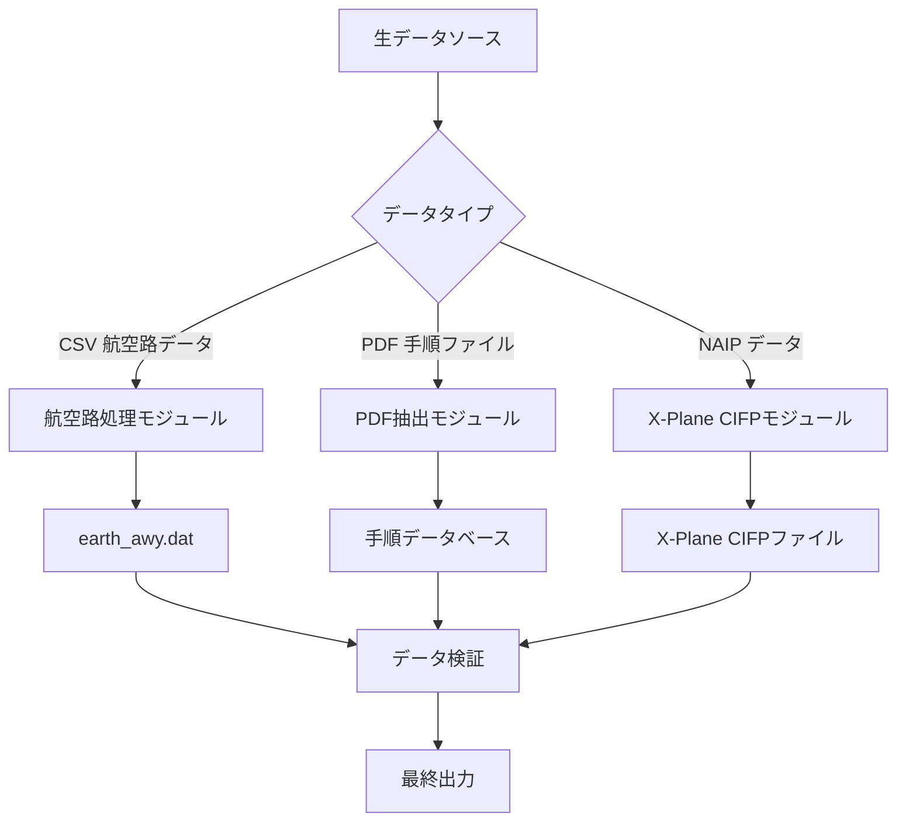

# 利用方法

本文書では、Nav-data ツールを用いた航空航法データ変換の完全なプロセスについて、データ準備から最終出力までを詳細に解説します。

## 🗂️ データ処理フローの概要

Nav-data には、以下の3つの主要なデータ処理フローが含まれています。



## 🛣️ 航空路データ処理

### データ準備

#### 1. 入力ファイルの準備
以下のファイルが作業ディレクトリにあることを確認してください。

```bash
# 必須の入力ファイル
RTE_SEG.csv          # 航空路区間データ（CSV形式）
earth_fix.dat        # X-Plane FIX点データ
earth_nav.dat        # X-Plane 航法施設データ
earth_awy.dat        # X-Plane 航空路データ（更新されます）
```

#### 2. CSVファイル形式の検証
`RTE_SEG.csv` には以下のフィールドが含まれている必要があります。

| フィールド名 | 説明 | 例 |
|--------|------|------|
| `CODE_POINT_START` | 開始点コード | ABCDE |
| `CODE_TYPE_START` | 開始点タイプ | DESIGNATED_POINT |
| `CODE_POINT_END` | 終了点コード | FGHIJ |
| `CODE_TYPE_END` | 終了点タイプ | VOR/DME |
| `CODE_DIR` | 方向コード | N |
| `TXT_DESIG` | 航空路名 | A123 |

### 航空路変換の実行

#### 基本的な使い方
```bash
# 航空路モジュールディレクトリへ移動
cd Airway

# 変換スクリプトを実行
python airway.py
```

#### 高度な使い方
```bash
# カスタムパラメータを使用
python airway.py --config custom_config.ini

# 特定の入力ファイルを指定
python airway.py --csv-file /path/to/custom_routes.csv

# 詳細ログを有効化
python airway.py --verbose

# 特定のエリアのみを処理
python airway.py --areas ZB,ZG,ZY
```

#### スクリプト内の設定変更
処理パラメータを変更するには、`Airway/airway.py` を編集します。

```python
# フィルタリングエリアを変更
china_areas = {'ZB', 'ZG', 'ZY', 'ZS', 'ZW', 'ZJ', 'ZP', 'ZL', 'ZH', 'ZU'}

# ファイルパスを変更
csv_file = 'custom_routes.csv'
earth_fix_path = '/path/to/earth_fix.dat'
earth_nav_path = '/path/to/earth_nav.dat'
earth_awy_path = '/path/to/earth_awy.dat'
```

### 出力ファイルの説明

処理完了後、`earth_awy.dat` ファイルには以下が含まれます。
- フィルタリングされた元の航空路データ
- 新たに追加された中国空域の航空路データ
- X-Plane 形式に準拠した航空路情報

出力形式の例：
```
ABCDE  ZB  11 FGHIJ  ZG   3 N  1    0  600 A123
```

## 📄 PDF データ抽出

### 手順データ処理フロー

#### フロー 1：PDF生データ抽出
```bash
# PDF抽出ディレクトリへ移動
cd "PDF extract"

# PDF抽出スクリプトを実行
python 1_terminal_pdf.py

# 入力：airport_procedures.pdf
# 出力：ZXXX_procedure.txt
```

**使用例：**
```python
# カスタムPDF処理
import pdfplumber
from utils import *

# PDFファイルを開く
with pdfplumber.open("ZBAA_procedures.pdf") as pdf:
    # テキストとグラフィック要素を抽出
    extracted_data = extract(pdf)
    
    # 抽出結果を保存
    with open("ZBAA_procedure.txt", "w", encoding="utf-8") as f:
        for line in extracted_data:
            f.write(line + "\n")
```

#### フロー 2：データ標準化エンコード
```bash
# エンコードスクリプトを実行
python 2_terminal_encode.py

# 入力：ZXXX_procedure.txt
# 出力：ZXXX_encode.txt
```

**エンコード規則：**
- 無効な文字と形式のクリーンアップ
- 手順名の標準化
- 座標形式の規範化
- データ完全性の検証

#### フロー 3：データベース形式生成
```bash
# データベース生成スクリプトを実行
python 3_terminal_db.py

# 入力：ZXXX_encode.txt  
# 出力：ZXXX_db.txt
```

**データベース形式の特性：**
- 複数滑走路手順の分離
- トランジション、復行、待機手順の連結
- X-Plane互換形式の生成
- 手順記述コードの追加

#### フロー 4：手順増殖（オプション）
```bash
# 手順名不一致の問題を修正
python 4_程序增殖.py

# 入力：ZXXX_db.txt
# 出力：修正後の手順ファイル
```

### 航路点座標抽出フロー

#### 自動抽出（推奨）
```bash
# 自動座標抽出を実行
python waypoint_1_pdf.py

# 入出力パスを設定
input_pdf = "ZBAA_waypoints.pdf"
output_txt = "ZBAA_waypoint.txt"
```

**自動抽出の特性：**
- 座標形式のインテリジェントな認識
- 度分秒変換の自動処理
- 多様なPDFレイアウトのサポート
- データ検証を含む

#### 手動抽出（代替手段）
自動抽出の精度が低い場合：

```bash
# Edgeブラウザを使用して手動抽出
python waypoint_2_edge.py
```

**手動抽出の手順：**
1. Microsoft Edge でPDFファイルを開く
2. 右クリックで関連テキストを選択しコピーする
3. テキストを入力ファイルに保存する
4. スクリプトを実行して整形処理を行う

#### 単一ファイル処理（特殊な状況）
```bash
# 特殊文字を含むファイルを処理
python debug_single.py

# 適用されるケース：
# - 括弧などの特殊文字を含むファイル
# - 手動での修正が必要なデータ
# - 個別に処理される空港ファイル
```

### PDF処理のベストプラクティス

#### 1. PDFファイルの前処理
```bash
# PDFファイルの品質をチェック
python -c "
import pdfplumber
with pdfplumber.open('input.pdf') as pdf:
    print(f'ページ数: {len(pdf.pages)}')
    print(f'先頭ページのテキスト行数: {len(pdf.pages[0].extract_text_lines())}')
"
```

#### 2. バッチ処理
```python
# 複数の空港PDFをバッチ処理
import os
from pathlib import Path

pdf_folder = "input_pdfs/"
output_folder = "output_txt/"

for pdf_file in Path(pdf_folder).glob("*.pdf"):
    airport_code = pdf_file.stem[:4]  # 空港コードを抽出
    
    # 個別ファイルを処理
    os.system(f"python 1_terminal_pdf.py {pdf_file}")
    os.system(f"python 2_terminal_encode.py {airport_code}_procedure.txt")
    os.system(f"python 3_terminal_db.py {airport_code}_encode.txt")
    
    print(f"処理完了: {airport_code}")
```

#### 3. 品質チェック
```python
# 抽出結果を検証
def validate_extraction(output_file):
    with open(output_file, 'r', encoding='utf-8') as f:
        lines = f.readlines()
    
    # 座標形式をチェック
    coord_pattern = r'\d+\.\d{8}'
    valid_coords = sum(1 for line in lines if re.search(coord_pattern, line))
    
    print(f"ファイル: {output_file}")
    print(f"総行数: {len(lines)}")
    print(f"有効な座標の行数: {valid_coords}")
    print(f"データ品質: {valid_coords/len(lines)*100:.1f}%")

# 使用例
validate_extraction("ZBAA_waypoint.txt")
```

## 🔧 ターミナル手順の修正

### データエンコード修正

#### エンコーダーの使用
```bash
# 修正モジュールディレクトリへ移動
cd "Terminal Patch"

# バッチ処理（デフォルトパス）
python terminal_encoder.py

# カスタムパス処理
python terminal_encoder.py "input_folder" "output_folder"

# 例
python terminal_encoder.py "PDF extract/public" "PDF extract/encoded"
```

**エンコーダー機能：**
- IF点の位置を識別
- トランジション区間コードを追加
- 手順のキーポイントをマーク
- 標準記述コードを生成

#### 形式修正ツールの使用
```bash
# バッチ形式修正（デフォルトパス）
python terminal_reencode.py

# 単一ファイル処理
python terminal_reencode.py ZBAA.dat ZBAA_fixed.dat

# 入出力フォルダを指定
python terminal_reencode.py "/input/folder" "/output/folder"
```

**修正規則の説明：**

1. **APPCH 行 GY M 規則**
   ```
   修正前: APPCH ... RW01 ... ... GY M
   修正後: APPCH ... RW01 ... G GY M
   ```

2. **純粋な文字の第5部分規則**
   ```
   修正前: SID ... ABC ... ... EY M
   修正後: SID ... ABC ... D B VY M
   ```

3. **SID RW 規則**
   ```
   修正前: SID ... RW25 ... ... EY D
   修正後: SID ... RW25 ... G GY D
   ```

### カスタム修正スクリプト

```python
# カスタム修正スクリプトを作成
import re

def custom_fix_procedure(input_file, output_file):
    """カスタム手順修正関数"""
    with open(input_file, 'r', encoding='utf-8') as f:
        lines = f.readlines()
    
    fixed_lines = []
    for line in lines:
        # カスタム修正規則を適用
        if line.startswith('APPCH'):
            # カスタム進入手順の修正
            parts = line.split()
            if len(parts) >= 9:
                # 修正ロジック
                if parts[8] == 'EY':
                    parts[8] = 'GY'
                line = ' '.join(parts) + '\n'
        
        fixed_lines.append(line)
    
    with open(output_file, 'w', encoding='utf-8') as f:
        f.writelines(fixed_lines)

# 使用例
custom_fix_procedure('ZBAA.dat', 'ZBAA_custom_fixed.dat')
```

## 🛩️ X-Plane CIFP 生成

### 航法施設処理

#### VOR/DME および NDB データ処理
```bash
cd "X-Plane CIFP"

# 航法施設データを処理
python 1_navaid.py
```

**パス設定：**
```python
# スクリプト内のパス設定を変更
navパス = "path/to/earth_nav.dat"
vorパス = "path/to/VOR.csv"
ndbパス = "path/to/NDB.csv"
```

**CSV データ形式要件：**

VOR.csv フィールド：
- 空港コード、名称、周波数、座標、高度など

NDB.csv フィールド：
- 空港コード、名称、周波数、座標、高度など

### 航路点処理

```bash
# 航路点データを処理
python 2_waypoint.py
```

**設定例：**
```python
# パス設定を変更
naipPath = "path/to/naip/waypoints"
xplanePath = "path/to/xplane/data"
outputPath = "path/to/output/earth_fix.dat"

# X-Planeバージョンを選択
forXp11 = False  # True for X-Plane 11, False for X-Plane 12
```

### ターミナル手順処理

```bash
# ターミナル手順データを処理
python 3_terminal.py
```

**パス設定：**
```python
# 主要パス設定
inputPath = "path/to/encoded/procedures"
outputFolder = "path/to/cifp/output"
xplanePath = "path/to/xplane/installation"
csvFolder = "path/to/naip/csv/data"
```

**処理フロー：**
1. エンコードされた手順ファイルを読み込む
2. 航路点データベースを構築
3. SID、STAR、進入手順を処理
4. 滑走路情報を生成
5. CIFP形式ファイルを出力

### 特殊機能モジュール

#### Fenix データ抽出
```bash
# 特定形式の滑走路とMAP情報を抽出
python Fenix.py

# パラメータを設定
csv_folder = "path/to/csv/data"
procedure_folder = "path/to/procedures"
output_file = "fenix_output.txt"
```

#### 滑走路生成
```bash
# 滑走路関連データを生成
python spawn_runway.py

# またはエクスポートバージョンを使用
python 跑道生成导出ver.py
```

## 📊 データ検証と品質管理

### 自動検証スクリプト

`validate_output.py` を作成：

```python
#!/usr/bin/env python3
"""
出力データ検証スクリプト
"""
import re
import os
from pathlib import Path

def validate_airway_data(file_path):
    """航空路データ形式を検証"""
    errors = []
    with open(file_path, 'r', encoding='utf-8') as f:
        for line_num, line in enumerate(f, 1):
            line = line.strip()
            if not line or line == "99":
                continue
                
            # X-Plane 航空路形式の検証
            parts = line.split()
            if len(parts) < 11:
                errors.append(f"行 {line_num}: フィールド数が不足しています")
                continue
                
            # 座標範囲の検証
            try:
                # ここに具体的な座標検証ロジックを追加
                pass
            except ValueError as e:
                errors.append(f"行 {line_num}: 座標形式エラー - {e}")
    
    return errors

def validate_waypoint_data(file_path):
    """航路点データ形式を検証"""
    errors = []
    coord_pattern = r'^-?\d+\.\d{8}$'
    
    with open(file_path, 'r', encoding='utf-8') as f:
        for line_num, line in enumerate(f, 1):
            line = line.strip()
            if not line:
                continue
                
            parts = line.split()
            if len(parts) < 3:
                errors.append(f"行 {line_num}: フィールド数が不足しています")
                continue
                
            # 座標形式を検証
            try:
                lat, lon = float(parts[1]), float(parts[2])
                if not (-90 <= lat <= 90):
                    errors.append(f"行 {line_num}: 緯度が範囲外です")
                if not (-180 <= lon <= 180):
                    errors.append(f"行 {line_num}: 経度が範囲外です")
            except ValueError:
                errors.append(f"行 {line_num}: 座標形式エラー")
    
    return errors

def validate_cifp_data(file_path):
    """CIFPデータ形式を検証"""
    errors = []
    procedure_types = ['SID', 'STAR', 'APPCH']
    
    with open(file_path, 'r', encoding='utf-8') as f:
        for line_num, line in enumerate(f, 1):
            line = line.strip()
            if not line:
                continue
                
            # 手順タイプをチェック
            if any(line.startswith(ptype) for ptype in procedure_types):
                parts = line.split()
                if len(parts) < 15:
                    errors.append(f"行 {line_num}: CIFP形式のフィールドが不足しています")
    
    return errors

def main():
    """主検証関数"""
    print("🔍 Nav-data 出力検証")
    print("=" * 40)
    
    # 検証設定
    validation_config = {
        'earth_awy.dat': validate_airway_data,
        '*.txt': validate_waypoint_data,  # 航路点ファイル
        '*.dat': validate_cifp_data,      # CIFP ファイル
    }
    
    total_errors = 0
    
    for pattern, validator in validation_config.items():
        if '*' in pattern:
            # ワイルドカードパターン
            ext = pattern.split('*')[1]
            files = list(Path('.').glob(f'**/*{ext}'))
        else:
            # 特定ファイル
            files = [Path(pattern)] if Path(pattern).exists() else []
        
        for file_path in files:
            if file_path.exists():
                print(f"\n📄 ファイルを検証中: {file_path}")
                errors = validator(str(file_path))
                
                if errors:
                    print(f"❌ {len(errors)} 個のエラーが見つかりました:")
                    for error in errors[:5]:  # 最初の5つのエラーのみ表示
                        print(f"   - {error}")
                    if len(errors) > 5:
                        print(f"   ... さらに {len(errors) - 5} 個のエラー")
                    total_errors += len(errors)
                else:
                    print("✅ 検証通過")
    
    print(f"\n" + "=" * 40)
    if total_errors == 0:
        print("🎉 すべてのデータ検証が通過しました！")
        return 0
    else:
        print(f"⚠️  合計 {total_errors} 個の問題が見つかりました")
        return 1

if __name__ == "__main__":
    exit(main())
```

### 検証スクリプトの使用
```bash
# 検証を実行
python validate_output.py

# 出力例
🔍 Nav-data 出力検証
========================================

📄 ファイルを検証中: earth_awy.dat
✅ 検証通過

📄 ファイルを検証中: ZBAA_waypoint.txt
✅ 検証通過

📄 ファイルを検証中: ZBAA.dat
❌ 2 個のエラーが見つかりました:
   - 行 15: CIFP形式のフィールドが不足しています
   - 行 23: 座標形式エラー

========================================
⚠️  合計 2 個の問題が見つかりました
```

## 🔧 バッチ処理ワークフロー

### バッチ処理スクリプトの作成

`batch_process.py` を作成：

```python
#!/usr/bin/env python3
"""
Nav-data バッチ処理スクリプト
"""
import os
import sys
import subprocess
from pathlib import Path
import logging

# ロギングを設定
logging.basicConfig(level=logging.INFO, format='%(asctime)s - %(levelname)s - %(message)s')
logger = logging.getLogger(__name__)

class BatchProcessor:
    def __init__(self, config):
        self.config = config
        self.processed_count = 0
        self.error_count = 0
    
    def process_airway_data(self):
        """航空路データを処理"""
        logger.info("航空路データの処理を開始します...")
        
        try:
            os.chdir('Airway')
            result = subprocess.run(['python', 'airway.py'], 
                                  capture_output=True, text=True)
            
            if result.returncode == 0:
                logger.info("航空路データの処理に成功しました")
                self.processed_count += 1
            else:
                logger.error(f"航空路データの処理に失敗しました: {result.stderr}")
                self.error_count += 1
                
        except Exception as e:
            logger.error(f"航空路データの処理中に例外が発生しました: {e}")
            self.error_count += 1
        finally:
            os.chdir('..')
    
    def process_pdf_data(self, pdf_files):
        """PDFデータをバッチ処理"""
        logger.info(f"{len(pdf_files)} 個のPDFファイルの処理を開始します...")
        
        os.chdir('PDF extract')
        
        for pdf_file in pdf_files:
            try:
                airport_code = Path(pdf_file).stem[:4]
                logger.info(f"空港を処理中: {airport_code}")
                
                # ステップ 1: PDF抽出
                subprocess.run(['python', '1_terminal_pdf.py', pdf_file], check=True)
                
                # ステップ 2: エンコード
                subprocess.run(['python', '2_terminal_encode.py', 
                              f'{airport_code}_procedure.txt'], check=True)
                
                # ステップ 3: データベース生成
                subprocess.run(['python', '3_terminal_db.py', 
                              f'{airport_code}_encode.txt'], check=True)
                
                logger.info(f"処理完了: {airport_code}")
                self.processed_count += 1
                
            except subprocess.CalledProcessError as e:
                logger.error(f"{pdf_file} の処理に失敗しました: {e}")
                self.error_count += 1
            except Exception as e:
                logger.error(f"{pdf_file} の処理中に例外が発生しました: {e}")
                self.error_count += 1
        
        os.chdir('..')
    
    def process_terminal_patch(self):
        """ターミナルパッチを処理"""
        logger.info("ターミナルパッチの処理を開始します...")
        
        try:
            os.chdir('Terminal Patch')
            
            # エンコーダー
            subprocess.run(['python', 'terminal_encoder.py'], check=True)
            
            # 形式修正
            subprocess.run(['python', 'terminal_reencode.py'], check=True)
            
            logger.info("ターミナルパッチの処理に成功しました")
            self.processed_count += 1
            
        except subprocess.CalledProcessError as e:
            logger.error(f"ターミナルパッチの処理に失敗しました: {e}")
            self.error_count += 1
        except Exception as e:
            logger.error(f"ターミナルパッチの処理中に例外が発生しました: {e}")
            self.error_count += 1
        finally:
            os.chdir('..')
    
    def process_cifp_data(self):
        """CIFPデータを処理"""
        logger.info("CIFPデータの処理を開始します...")
        
        try:
            os.chdir('X-Plane CIFP')
            
            # 航法施設
            subprocess.run(['python', '1_navaid.py'], check=True)
            
            # 航路点
            subprocess.run(['python', '2_waypoint.py'], check=True)
            
            # ターミナル手順
            subprocess.run(['python', '3_terminal.py'], check=True)
            
            logger.info("CIFPデータの処理に成功しました")
            self.processed_count += 1
            
        except subprocess.CalledProcessError as e:
            logger.error(f"CIFPデータの処理に失敗しました: {e}")
            self.error_count += 1
        except Exception as e:
            logger.error(f"CIFPデータの処理中に例外が発生しました: {e}")
            self.error_count += 1
        finally:
            os.chdir('..')
    
    def run_validation(self):
        """データ検証を実行"""
        logger.info("データ検証を開始します...")
        
        try:
            result = subprocess.run(['python', 'validate_output.py'], 
                                  capture_output=True, text=True)
            
            if result.returncode == 0:
                logger.info("データ検証が通過しました")
            else:
                logger.warning(f"データ検証で問題が見つかりました: {result.stdout}")
                
        except Exception as e:
            logger.error(f"データ検証中に例外が発生しました: {e}")
    
    def generate_report(self):
        """処理レポートを生成"""
        total = self.processed_count + self.error_count
        success_rate = (self.processed_count / total * 100) if total > 0 else 0
        
        report = f"""
Nav-data バッチ処理レポート
========================
総タスク数: {total}
成功数: {self.processed_count}
失敗数: {self.error_count}
成功率: {success_rate:.1f}%

詳細ログはコンソール出力をご覧ください。
        """
        
        logger.info(report)
        
        # レポートをファイルに保存
        with open('batch_process_report.txt', 'w', encoding='utf-8') as f:
            f.write(report)

def main():
    """メイン関数"""
    config = {
        'pdf_folder': 'input_pdfs/',
        'enable_validation': True,
        'generate_report': True
    }
    
    processor = BatchProcessor(config)
    
    # PDFファイルを探す
    pdf_files = list(Path(config['pdf_folder']).glob('*.pdf')) if Path(config['pdf_folder']).exists() else []
    
    # 処理フローを実行
    try:
        # 1. 航空路データ処理
        if Path('Airway/RTE_SEG.csv').exists():
            processor.process_airway_data()
        
        # 2. PDFデータ処理
        if pdf_files:
            processor.process_pdf_data(pdf_files)
        
        # 3. ターミナルパッチ処理
        processor.process_terminal_patch()
        
        # 4. CIFPデータ処理
        processor.process_cifp_data()
        
        # 5. データ検証
        if config['enable_validation']:
            processor.run_validation()
        
        # 6. レポート生成
        if config['generate_report']:
            processor.generate_report()
            
    except KeyboardInterrupt:
        logger.info("ユーザーによって処理が中断されました")
    except Exception as e:
        logger.error(f"バッチ処理中に例外が発生しました: {e}")
    
    logger.info("バッチ処理が完了しました")

if __name__ == "__main__":
    main()
```

### バッチ処理の使用
```bash
# バッチ処理を実行
python batch_process.py

# 出力例
2025-01-23 10:00:00 - INFO - 航空路データの処理を開始します...
2025-01-23 10:01:30 - INFO - 航空路データの処理に成功しました
2025-01-23 10:01:30 - INFO - 5 個のPDFファイルの処理を開始します...
2025-01-23 10:02:00 - INFO - 空港を処理中: ZBAA
2025-01-23 10:03:15 - INFO - 処理完了: ZBAA
...
2025-01-23 10:15:00 - INFO - バッチ処理が完了しました
```

## ❓ よくある質問 (FAQ)

### Q1: 航空路変換が失敗するのはなぜですか？
**A:** よくある原因と解決策：

1. **CSVファイル形式エラー**
   ```bash
   # CSVファイルのエンコーディングをチェック
   file -I RTE_SEG.csv
   
   # エンコーディングを変換（必要な場合）
   iconv -f gbk -t utf-8 RTE_SEG.csv > RTE_SEG_utf8.csv
   ```

2. **必須フィールドの不足**
   ```python
   # CSVフィールドを検証
   import pandas as pd
   df = pd.read_csv('RTE_SEG.csv')
   required_fields = ['CODE_POINT_START', 'CODE_TYPE_START', 'CODE_POINT_END', 
                     'CODE_TYPE_END', 'CODE_DIR', 'TXT_DESIG']
   missing_fields = [f for f in required_fields if f not in df.columns]
   print(f"不足フィールド: {missing_fields}")
   ```

3. **参照データファイルが存在しない**
   ```bash
   # ファイルが存在するか確認
   ls -la earth_fix.dat earth_nav.dat earth_awy.dat
   ```

### Q2: PDF抽出の精度が低い場合はどうすればよいですか？
**A:** 以下の解決策を試してください：

1. **手動抽出方法を使用**
   ```bash
   python waypoint_2_edge.py
   ```

2. **PDF処理パラメータを調整**
   ```python
   # waypoint_1_pdf.py で調整
   crop_margin = 50  # クロップマージンを増やす
   text_confidence = 0.8  # テキスト信頼度閾値を下げる
   ```

3. **PDFファイルの前処理**
   - PDFがスキャン画像ではなくテキスト形式であることを確認してください
   - PDFエディタを使用してファイル品質を最適化してください
   - 不要なグラフィック要素を削除してください

### Q3: 手順のエンコードエラーはどのように修正できますか？
**A:** 修正ツールを使用してください：

1. **自動修正**
   ```bash
   cd "Terminal Patch"
   python terminal_reencode.py
   ```

2. **手動チェックと修正**
   ```python
   # 手順の形式をチェック
   with open('ZBAA.dat', 'r') as f:
       for i, line in enumerate(f, 1):
           if 'APPCH' in line:
               parts = line.split()
               if len(parts) < 15:
                   print(f"行 {i} 形式が不完全です: {line.strip()}")
   ```

### Q4: X-Planeが生成されたデータを認識しないのはなぜですか？
**A:** 以下の項目を確認してください：

1. **ファイルパスの正確性**
   ```bash
   # X-Plane 11
   ls "$XPLANE_PATH/Custom Data/"
   
   # X-Plane 12
   ls "$XPLANE_PATH/Output/FMS plans/"
   ```

2. **ファイル形式の互換性**
   ```python
   # ファイルエンコーディングをチェック
   with open('earth_awy.dat', 'rb') as f:
       raw = f.read(100)
       print(f"ファイルエンコーディング検出: {raw}")
   ```

3. **データの完全性**
   ```bash
   # ファイルが "99" で終わっているか確認
   tail -n 5 earth_awy.dat
   ```

### Q5: 大規模なファイルを処理する際にメモリ不足になりますか？
**A:** メモリ使用量を最適化してください：

1. **仮想メモリの増加**
   ```bash
   # Linuxシステム
   sudo swapon --show
   sudo fallocate -l 4G /swapfile
   sudo mkswap /swapfile
   sudo swapon /swapfile
   ```

2. **バッチ処理**
   ```python
   # バッチサイズを変更
   BATCH_SIZE = 500  # バッチサイズを減らす
   ```

3. **メモリのクリーンアップ**
   ```python
   import gc
   # 処理ループに追加
   gc.collect()
   ```

### Q6: 座標精度の問題ですか？
**A:** 座標処理精度を向上させてください：

1. **精度設定の調整**
   ```python
   COORDINATE_PRECISION = 8  # 小数点以下8桁の精度を維持
   ```

2. **座標範囲の検証**
   ```python
   # 中国地域座標範囲
   LAT_MIN, LAT_MAX = 15.0, 55.0
   LON_MIN, LON_MAX = 70.0, 140.0
   ```

3. **高精度計算の使用**
   ```python
   from decimal import Decimal, getcontext
   getcontext().prec = 12  # 高精度を設定
   ```

### Q7: AIRACデータを更新する方法は？
**A:** AIRACデータ更新フロー：

1. **現在のサイクルを自動計算**
   ```python
   from datetime import datetime
   # ツールは現在のAIRACサイクルを自動的に計算します
   current_cycle = get_current_airac_cycle()
   print(f"現在のAIRACサイクル: {current_cycle}")
   ```

2. **サイクルを手動で指定**
   ```python
   # 設定で指定
   manual_cycle = "2504"  # 2025年第4サイクル
   ```

3. **データの有効期限をチェック**
   ```bash
   # ソースデータのAIRAC情報をチェック
   grep -i "airac" *.csv
   ```

### Q8: コードの貢献や問題の報告方法は？
**A:** プロジェクト開発への参加：

1. **問題の報告**
   - 詳細なIssueをGitHubに提出してください
   - エラーメッセージと再現手順を含めてください
   - 関連する入力ファイル（可能な場合）を提供してください

2. **コードの貢献**
   - プロジェクトリポジトリをフォークしてください
   - 機能ブランチを作成してください
   - プルリクエストを提出してください

3. **ドキュメントの改善**
   - ドキュメントのエラーを報告してください
   - 使用例を提供してください
   - ドキュメントを翻訳してください

---

**お楽しみください！** ✈️ 他にご不明な点がありましたら、プロジェクトのGitHub Issuesをご確認いただくか、新しい問題報告を作成してください。