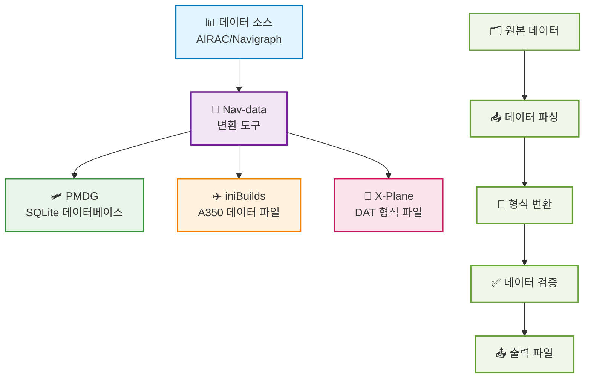

# Nav-data 문서에 오신 것을 환영합니다 🚀

Nav-data는 항공 애호가들이 공동으로 유지 관리하는 데이터 변환 프로젝트로, Microsoft Flight Simulator와 같은 비행 시뮬레이터에 고품질 내비게이션 데이터 지원을 제공하는 데 전념합니다. 개발자, 조종사 또는 애호가이든 상관없이 여기에서 필요한 자료와 가이드를 찾을 수 있습니다.

## 🔄 데이터 변환 프로세스

---

## ✨ 프로젝트 특징

  

    
📦

    <h3>다중 플랫폼 지원</h3>
    
PMDG, iniBuilds, X-Plane 등 주요 비행 시뮬레이터 플랫폼을 지원합니다

  

  
  

    
🛫

    <h3>상세 가이드</h3>
    
완벽한 구성, 설치 및 사용 가이드를 제공하여 초보자도 쉽게 시작할 수 있습니다

  

  
  

    
🗂️

    <h3>명확한 구조</h3>
    
데이터 구조가 명확하여 확장 및 유지 관리가 용이하며, 사용자 정의 구성을 지원합니다

  

  
  

    
🤝

    <h3>오픈 소스 협력</h3>
    
커뮤니티의 기여와 협력을 환영하며, 더 나은 내비게이션 데이터 도구를 함께 구축합니다

  

---

## 🚀 빠른 시작
1. 플러그인을 선택하세요: [PMDG 가이드](/PMDG/guide/index) | [iniBuilds 가이드](/iniBuilds/guide/index)
2. 가이드에 따라 구성 및 설치를 진행하세요
3. 더 현실적인 비행 경험을 즐기세요!

---

## 🧭 빠른 탐색

### 📊 플랫폼 지원 비교

  <table>
    <thead>
      <tr>
        <th>특징</th>
        <th>🛩️ PMDG</th>
        <th>✈️ iniBuilds</th>
        <th>🛫 X-Plane</th>
      </tr>
    </thead>
    <tbody>
      <tr>
        <td><strong>지원 항공기</strong></td>
        <td>737 시리즈, 777 시리즈</td>
        <td>A350</td>
        <td>모든 X-Plane 항공기</td>
      </tr>
      <tr>
        <td><strong>데이터 형식</strong></td>
        <td>SQLite 데이터베이스</td>
        <td>전용 데이터 파일</td>
        <td>DAT 형식 파일</td>
      </tr>
      <tr>
        <td><strong>설치 난이도</strong></td>
        <td><StatusBadge type="warning" text="중간" icon="⚠️" /></td>
        <td><StatusBadge type="success" text="쉬움" icon="✅" /></td>
        <td><StatusBadge type="error" text="복잡함" icon="🔴" /></td>
      </tr>
      <tr>
        <td><strong>데이터 커버리지</strong></td>
        <td><StatusBadge type="success" text="완전함" icon="✅" /></td>
        <td><StatusBadge type="success" text="완전함" icon="✅" /></td>
        <td><StatusBadge type="warning" text="부분적" icon="⚠️" /></td>
      </tr>
      <tr>
        <td><strong>업데이트 빈도</strong></td>
        <td>AIRAC 주기</td>
        <td>AIRAC 주기</td>
        <td>요청 시 업데이트</td>
      </tr>
    </tbody>
  </table>

### 📚 사용 가이드

  <a href="/PMDG/guide/index" class="guide-link pmdg">
    
🛩️

    

      <h3>PMDG 가이드</h3>
      
PMDG 항공기 내비게이션 데이터 변환 전체 튜토리얼

    

  </a>
  
  <a href="/iniBuilds/guide/index" class="guide-link inibuilds">
    
✈️

    

      <h3>iniBuilds 가이드</h3>
      
iniBuilds A350 내비게이션 데이터 변환 가이드

    

  </a>
  
  <a href="/X-Plane/guide/index" class="guide-link xplane">
    
🛫

    

      <h3>X-Plane 가이드</h3>
      
X-Plane 내비게이션 데이터 처리 전체 프로세스

    

  </a>

### 🆘 도움말 보기

  

    <h4>🛩️ PMDG 지원</h4>
    <ul>
      <li><a href="/PMDG/faq">자주 묻는 질문 (FAQ)</a></li>
      <li><a href="/PMDG/troubleshooting">문제 해결 가이드</a></li>
    </ul>
  

  
  

    <h4>✈️ iniBuilds 지원</h4>
    <ul>
      <li><a href="/iniBuilds/faq">자주 묻는 질문 (FAQ)</a></li>
      <li><a href="/iniBuilds/troubleshooting">문제 해결 가이드</a></li>
    </ul>
  

  
  

    <h4>🛫 X-Plane 지원</h4>
    <ul>
      <li><a href="/X-Plane/faq">자주 묻는 질문 (FAQ)</a></li>
      <li><a href="/X-Plane/troubleshooting">문제 해결 가이드</a></li>
    </ul>
  

### 🔧 기술 문서

  <a href="/iniBuilds/architecture" class="tech-link">
    🏗️
    프로젝트 아키텍처 설명
  </a>
  <a href="/iniBuilds/contributing" class="tech-link">
    🤝
    기여 가이드
  </a>
  <a href="/iniBuilds/changelog" class="tech-link">
    📋
    업데이트 로그
  </a>

---

## 🌍 참여 및 피드백
- GitHub: [nav-data](https://github.com/nav-data)
- 제안이나 질문이 있으신가요? [Issue](https://github.com/nav-data/nav-data/issues) 또는 이메일을 통해 저희에게 연락해 주세요!