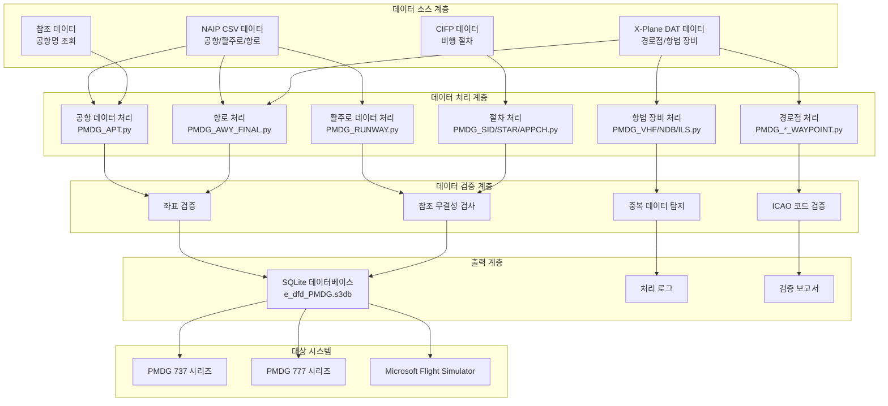
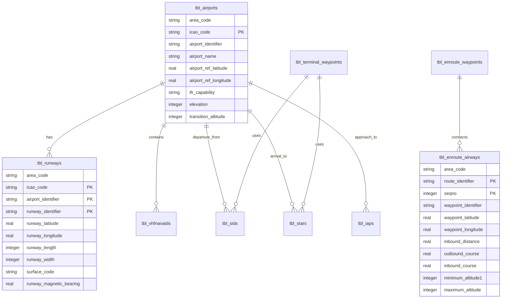
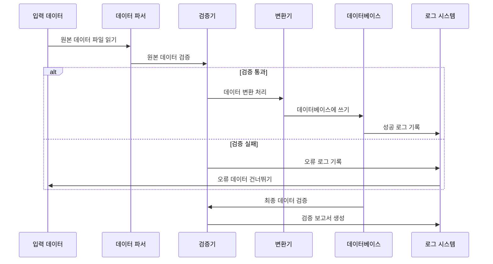

# 🏗️ 기술 아키텍처

본 문서는 Nav-data의 시스템 아키텍처, 설계 원리 및 기술 구현 세부 사항을 심층적으로 소개하여 개발자와 기술 사용자에게 포괄적인 기술 참조를 제공합니다.

## 📐 시스템 아키텍처 개요

### 전체 아키텍처 다이어그램



### 핵심 컴포넌트 설명

| 컴포넌트 | 기능 | 기술 스택 | 주요 특징 |
|------|------|--------|----------|
| **데이터 파서** | 다중 형식 데이터 읽기 | pandas, chardet | 자동 인코딩 감지, 오류 허용 처리 |
| **좌표 변환기** | 지리 좌표 처리 | 사용자 정의 알고리즘 | DMS↔Decimal 변환, 정밀도 제어 |
| **자기 편차 계산기** | 자기 편각 계산 | pygeomag | WMM2025 모델, 고정밀 계산 |
| **데이터베이스 엔진** | SQLite 데이터베이스 | sqlite3 | PMDG 호환 모드, 트랜잭션 처리 |
| **검증 엔진** | 데이터 품질 보증 | 사용자 정의 검증기 | 다층 검증, 상세 보고서 |
| **동시성 처리기** | 성능 최적화 | ThreadPoolExecutor | 멀티스레드 처리, 진행률 모니터링 |

## 🧩 모듈 아키텍처 설계

### 1. 데이터 처리 모듈

#### 공항 데이터 처리 (`PMDG_APT.py`)

```python
class AirportProcessor:
    """공항 데이터 처리기"""
    
    def __init__(self):
        self.csv_parser = CSVParser(encoding='latin1')
        self.coordinate_converter = CoordinateConverter()
        self.database_writer = DatabaseWriter()
    
    def process(self) -> ProcessResult:
        """주요 처리 흐름"""
        # 1. NAIP 공항 데이터 읽기
        airports_data = self.csv_parser.read_csv(self.csv_file_path)
        
        # 2. 공항명 조회 테이블 읽기
        name_lookup = self.load_airport_names()
        
        # 3. 데이터 처리 및 변환
        processed_data = []
        for airport in airports_data:
            # 좌표 변환: DMS -> Decimal
            lat, lon = self.coordinate_converter.dms_to_decimal(
                airport['GEO_LAT_ACCURACY'],
                airport['GEO_LONG_ACCURACY']
            )
            
            # 데이터 검증 및 정리
            if self.validate_airport_data(airport, lat, lon):
                processed_data.append({
                    'icao_code': airport['CODE_ID'][:2],
                    'airport_identifier': airport['CODE_ID'],
                    'airport_name': name_lookup.get(airport['CODE_ID'], 'UNKNOWN'),
                    'latitude': lat,
                    'longitude': lon,
                    # ... 기타 필드
                })
        
        # 4. 데이터베이스에 쓰기
        return self.database_writer.write_airports(processed_data)
```

#### 항로 데이터 처리 (`PMDG_AWY_FINAL.py`)

이 모듈은 가장 복잡하며, 지능형 항로 병합 알고리즘을 포함합니다:

```python
class AirwayProcessor:
    """항로 데이터 처리기 - 지능형 병합 지원"""
    
    def process_airways(self):
        """항로 처리 주요 흐름"""
        # 1. CSV 항로 구간 데이터 읽기
        route_segments = self.read_route_segments()
        
        # 2. 경로점 좌표 매칭
        for segment in route_segments:
            icao_code, lat, lon = self.match_waypoint_coordinates(
                segment['waypoint_identifier'],
                segment['code_type']
            )
            segment.update({'lat': lat, 'lon': lon, 'icao': icao_code})
        
        # 3. 지능형 항로 병합
        for route_id in self.get_unique_routes():
            existing_route = self.get_existing_route(route_id)
            new_segments = self.get_route_segments(route_id)
            
            merged_route = self.intelligent_merge(existing_route, new_segments)
            
            # 4. 항로 구간 거리 및 방위 재계산
            self.recalculate_route_geometry(merged_route)
            
            # 5. 데이터베이스 업데이트
            self.update_route_in_database(route_id, merged_route)
    
    def intelligent_merge(self, existing, new_segments):
        """지능형 항로 병합 알고리즘"""
        if not existing:
            return new_segments
        
        # 공통 경로점 찾기
        common_points = self.find_common_waypoints(existing, new_segments)
        
        if not common_points:
            # 공통점 없음 - 직접 추가
            return self.append_segments(existing, new_segments)
        else:
            # 공통점 있음 - 지능형 삽입
            return self.insert_missing_segments(existing, new_segments, common_points)
```

### 2. 데이터 검증 아키텍처

#### 다층 검증 시스템

```python
class ValidationEngine:
    """데이터 검증 엔진"""
    
    def __init__(self):
        self.validators = [
            CoordinateValidator(),
            ICAOCodeValidator(),
            ReferenceIntegrityValidator(),
            DuplicateDetector(),
            BusinessRuleValidator()
        ]
    
    def validate(self, data: dict) -> ValidationResult:
        """다층 검증 실행"""
        result = ValidationResult()
        
        for validator in self.validators:
            validator_result = validator.validate(data)
            result.merge(validator_result)
            
            # 심각한 오류 발생 시 검증 중단
            if validator_result.has_critical_errors():
                break
        
        return result

class CoordinateValidator:
    """좌표 검증기"""
    
    # 중국 지역 좌표 경계
    CHINA_BOUNDS = {
        'lat_min': 15.0, 'lat_max': 55.0,
        'lon_min': 70.0, 'lon_max': 140.0
    }
    
    def validate(self, data: dict) -> ValidationResult:
        lat, lon = data.get('latitude'), data.get('longitude')
        
        if not self.is_valid_coordinate(lat, lon):
            return ValidationResult.error(f"좌표가 중국 지역 범위를 벗어남: {lat}, {lon}")
        
        return ValidationResult.success()
```

### 3. 동시 처리 아키텍처

#### 멀티스레드 처리 설계

```python
class ConcurrentProcessor:
    """동시성 처리기"""
    
    def __init__(self, max_workers=50):
        self.max_workers = min(max_workers, multiprocessing.cpu_count() * 2)
        self.progress_tracker = ProgressTracker()
    
    def process_in_parallel(self, tasks: List[Task]) -> List[Result]:
        """병렬로 작업 처리"""
        results = []
        
        with ThreadPoolExecutor(max_workers=self.max_workers) as executor:
            # 모든 작업 제출
            future_to_task = {
                executor.submit(self.process_task, task): task 
                for task in tasks
            }
            
            # 결과 수집 및 진행률 업데이트
            for future in as_completed(future_to_task):
                task = future_to_task[future]
                try:
                    result = future.result()
                    results.append(result)
                    self.progress_tracker.update()
                except Exception as e:
                    logging.error(f"작업 {task.id} 실패: {e}")
        
        return results
```

## 🗄️ 데이터베이스 설계

### ER 다이어그램



### 테이블 구조 상세

#### 핵심 테이블 설계 원칙

1.  **PMDG 호환성**: PMDG 데이터베이스 테이블 구조 및 필드 명명 규칙 엄격히 준수
2.  **ICAO 표준**: 국제 민간 항공 기구 데이터 표준 지원
3.  **성능 최적화**: 합리적인 인덱스 설계 및 데이터 타입 선택
4.  **데이터 무결성**: 외래 키 제약 조건 및 비즈니스 규칙 검증

#### 주요 테이블 구조

```sql
-- 공항 테이블
CREATE TABLE tbl_airports (
    area_code TEXT DEFAULT 'EEU',
    icao_code TEXT NOT NULL,
    airport_identifier TEXT PRIMARY KEY,
    airport_name TEXT,
    airport_ref_latitude REAL,
    airport_ref_longitude REAL,
    ifr_capability TEXT DEFAULT 'Y',
    longest_runway_surface_code TEXT,
    elevation INTEGER,
    transition_altitude INTEGER DEFAULT 18000,
    transition_level INTEGER,
    speed_limit INTEGER,
    speed_limit_altitude INTEGER,
    iata_ata_designator TEXT,
    id TEXT UNIQUE
);

-- 항로 테이블
CREATE TABLE tbl_enroute_airways (
    area_code TEXT DEFAULT 'EEU',
    crusing_table_identifier TEXT DEFAULT 'EE',
    route_identifier TEXT NOT NULL,
    seqno INTEGER NOT NULL,
    icao_code TEXT,
    waypoint_identifier TEXT,
    waypoint_latitude REAL,
    waypoint_longitude REAL,
    waypoint_description_code TEXT,
    route_type TEXT DEFAULT 'O',
    inbound_course REAL DEFAULT 0.0,
    inbound_distance REAL DEFAULT 0.0,
    outbound_course REAL DEFAULT 0.0,
    minimum_altitude1 INTEGER DEFAULT 5000,
    minimum_altitude2 INTEGER,
    maximum_altitude INTEGER DEFAULT 99999,
    direction_restriction TEXT,
    flightlevel TEXT DEFAULT 'B',
    id TEXT,
    PRIMARY KEY (route_identifier, seqno)
);
```

## 🔄 데이터 처리 흐름

### 처리 파이프라인



### 오류 처리 전략

```python
class ErrorHandler:
    """오류 처리 전략"""
    
    ERROR_STRATEGIES = {
        'missing_data': 'log_and_skip',
        'invalid_coordinates': 'log_and_skip', 
        'duplicate_records': 'log_and_merge',
        'reference_not_found': 'log_and_continue',
        'critical_error': 'stop_processing'
    }
    
    def handle_error(self, error_type: str, error_data: dict):
        strategy = self.ERROR_STRATEGIES.get(error_type, 'log_and_continue')
        
        if strategy == 'log_and_skip':
            self.log_error(error_data)
            return ProcessingAction.SKIP
        elif strategy == 'stop_processing':
            self.log_critical_error(error_data)
            raise ProcessingException(error_data)
        # ... 기타 전략
```

## 🎯 성능 최적화 설계

### 메모리 관리

```python
class MemoryManager:
    """메모리 관리자"""
    
    def __init__(self, max_memory_mb=2048):
        self.max_memory = max_memory_mb * 1024 * 1024
        self.current_usage = 0
    
    def process_in_batches(self, data_source, batch_size=1000):
        """대규모 데이터셋을 배치로 처리"""
        batch = []
        
        for item in data_source:
            batch.append(item)
            self.current_usage += sys.getsizeof(item)
            
            if len(batch) >= batch_size or self.memory_threshold_reached():
                yield batch
                batch = []
                self.gc_collect()  # 강제 가비지 컬렉션
    
    def memory_threshold_reached(self) -> bool:
        return self.current_usage > self.max_memory * 0.8
```

### 데이터베이스 최적화

```python
class DatabaseOptimizer:
    """데이터베이스 성능 최적화"""
    
    PRAGMA_SETTINGS = {
        'journal_mode': 'DELETE',     # PMDG 호환 모드
        'synchronous': 'FULL',        # 데이터 안전 우선
        'cache_size': 10000,          # 대용량 캐시로 성능 향상
        'temp_store': 'MEMORY',       # 임시 데이터 메모리 저장
        'mmap_size': 268435456        # 256MB 메모리 매핑
    }
    
    def optimize_database(self, connection):
        """성능 최적화 설정 적용"""
        for pragma, value in self.PRAGMA_SETTINGS.items():
            connection.execute(f"PRAGMA {pragma} = {value}")
        
        # 주요 인덱스 생성
        self.create_performance_indexes(connection)
    
    def create_performance_indexes(self, connection):
        """성능 최적화 인덱스 생성"""
        indexes = [
            "CREATE INDEX IF NOT EXISTS idx_airports_icao ON tbl_airports(icao_code)",
            "CREATE INDEX IF NOT EXISTS idx_airways_route ON tbl_enroute_airways(route_identifier)",
            "CREATE INDEX IF NOT EXISTS idx_waypoints_id ON tbl_enroute_waypoints(waypoint_identifier)",
        ]
        
        for index_sql in indexes:
            connection.execute(index_sql)
```

## 🔍 품질 보증 체계

### 데이터 검증 프레임워크

```python
class QualityAssurance:
    """품질 보증 프레임워크"""
    
    def __init__(self):
        self.validation_rules = self.load_validation_rules()
        self.test_cases = self.load_test_cases()
    
    def comprehensive_validation(self, database_path: str) -> QAReport:
        """종합 품질 검사"""
        report = QAReport()
        
        # 1. 구조 검증
        report.add_section(self.validate_schema(database_path))
        
        # 2. 데이터 무결성 검증
        report.add_section(self.validate_integrity(database_path))
        
        # 3. 비즈니스 규칙 검증
        report.add_section(self.validate_business_rules(database_path))
        
        # 4. 성능 벤치마크 테스트
        report.add_section(self.performance_benchmark(database_path))
        
        # 5. PMDG 호환성 테스트
        report.add_section(self.pmdg_compatibility_test(database_path))
        
        return report
    
    def validate_business_rules(self, database_path: str) -> ValidationSection:
        """비즈니스 규칙 검증"""
        rules = [
            "항로는 유효한 경로점에 연결되어야 합니다.",
            "공항은 최소한 하나의 활주로를 가져야 합니다.",
            "ILS 주파수는 유효 범위 내에 있어야 합니다.",
            "항로 고도 제한은 합리적이어야 합니다.",
            "좌표는 중국 지역 범위 내에 있어야 합니다."
        ]
        
        results = []
        for rule in rules:
            result = self.check_business_rule(database_path, rule)
            results.append(result)
        
        return ValidationSection("비즈니스 규칙 검증", results)
```

## 🔧 확장성 설계

### 플러그인 아키텍처

```python
class PluginManager:
    """플러그인 관리자"""
    
    def __init__(self):
        self.processors = {}
        self.validators = {}
        self.exporters = {}
    
    def register_processor(self, name: str, processor_class):
        """데이터 처리기 플러그인 등록"""
        self.processors[name] = processor_class
    
    def register_validator(self, name: str, validator_class):
        """검증기 플러그인 등록"""
        self.validators[name] = validator_class
    
    def load_plugins(self, plugin_directory: str):
        """동적 플러그인 로드"""
        for plugin_file in glob.glob(f"{plugin_directory}/*.py"):
            plugin_module = importlib.import_module(plugin_file)
            if hasattr(plugin_module, 'register'):
                plugin_module.register(self)

# 예시 플러그인
class CustomAirportProcessor(BaseProcessor):
    """사용자 정의 공항 처리기 플러그인"""
    
    def process(self, data):
        # 사용자 정의 처리 로직
        return super().process(data)

def register(plugin_manager):
    """플러그인 등록 함수"""
    plugin_manager.register_processor('custom_airport', CustomAirportProcessor)
```

### 구성 관리

```python
class ConfigurationManager:
    """구성 관리자"""
    
    def __init__(self, config_path: str = "config/settings.yaml"):
        self.config = self.load_config(config_path)
        self.validators = self.load_config_validators()
    
    def load_config(self, path: str) -> dict:
        """구성 파일 로드"""
        with open(path, 'r', encoding='utf-8') as f:
            return yaml.safe_load(f)
    
    def validate_config(self) -> bool:
        """구성 유효성 검증"""
        for validator in self.validators:
            if not validator.validate(self.config):
                return False
        return True
    
    def get_nested_value(self, key_path: str, default=None):
        """중첩된 구성 값 가져오기"""
        keys = key_path.split('.')
        value = self.config
        
        for key in keys:
            if isinstance(value, dict) and key in value:
                value = value[key]
            else:
                return default
        
        return value

# 구성 파일 예시 (settings.yaml)
"""
data_sources:
  naip:
    directory: "data/input/naip"
    encoding: "latin1"
  xplane:
    directory: "data/input/xplane"
    encoding: "utf-8"

processing:
  batch_size: 1000
  max_workers: 50
  memory_limit_mb: 2048

database:
  path: "data/output/e_dfd_PMDG.s3db"
  pragmas:
    journal_mode: "DELETE"
    synchronous: "FULL"

validation:
  coordinate_bounds:
    china:
      lat_min: 15.0
      lat_max: 55.0
      lon_min: 70.0
      lon_max: 140.0
"""
```

## 📊 모니터링 및 로깅

### 구조화된 로깅 시스템

```python
class StructuredLogger:
    """구조화된 로깅 시스템"""
    
    def __init__(self, name: str):
        self.logger = logging.getLogger(name)
        self.setup_handlers()
    
    def setup_handlers(self):
        """로그 핸들러 설정"""
        # 콘솔 핸들러
        console_handler = logging.StreamHandler()
        console_handler.setFormatter(ColoredFormatter())
        
        # 파일 핸들러
        file_handler = RotatingFileHandler(
            f"logs/{self.logger.name}.log",
            maxBytes=10*1024*1024,
            backupCount=5
        )
        file_handler.setFormatter(JSONFormatter())
        
        self.logger.addHandler(console_handler)
        self.logger.addHandler(file_handler)
    
    def log_processing_start(self, module: str, input_size: int):
        """처리 시작 기록"""
        self.logger.info("처리 시작됨", extra={
            'module': module,
            'input_size': input_size,
            'timestamp': datetime.utcnow().isoformat(),
            'event_type': 'processing_start'
        })
    
    def log_processing_complete(self, module: str, output_size: int, duration: float):
        """처리 완료 기록"""
        self.logger.info("처리 완료됨", extra={
            'module': module,
            'output_size': output_size,
            'duration_seconds': duration,
            'records_per_second': output_size / duration if duration > 0 else 0,
            'timestamp': datetime.utcnow().isoformat(),
            'event_type': 'processing_complete'
        })
```

## 🔒 보안 설계

### 데이터 보안

```python
class SecurityManager:
    """보안 관리자"""
    
    def __init__(self):
        self.input_sanitizer = InputSanitizer()
        self.path_validator = PathValidator()
    
    def validate_input_path(self, path: str) -> bool:
        """입력 경로 보안성 검증"""
        # 경로 탐색 공격 방지
        normalized_path = os.path.normpath(path)
        if '..' in normalized_path:
            raise SecurityException("경로에 유효하지 않은 문자가 포함됨")
        
        # 경로가 허용된 디렉토리 내에 있는지 확인
        allowed_dirs = ['data/input', 'config']
        if not any(normalized_path.startswith(allowed) for allowed in allowed_dirs):
            raise SecurityException("경로가 허용된 디렉토리 내에 있지 않음")
        
        return True
    
    def sanitize_sql_input(self, value: str) -> str:
        """SQL 입력 정리"""
        if not isinstance(value, str):
            return value
        
        # 잠재적인 SQL 인젝션 문자 제거
        dangerous_chars = ["'", '"', ';', '--', '/*', '*/']
        for char in dangerous_chars:
            value = value.replace(char, '')
        
        return value
```

---

이 기술 아키텍처 문서는 Nav-data 프로젝트에 대한 시스템 설계, 데이터 흐름, 성능 최적화, 품질 보증 및 보안 등 모든 측면을 포괄하는 기술적 관점을 제공합니다. 개발자는 이 아키텍처를 기반으로 2차 개발 및 기능 확장을 수행할 수 있습니다.