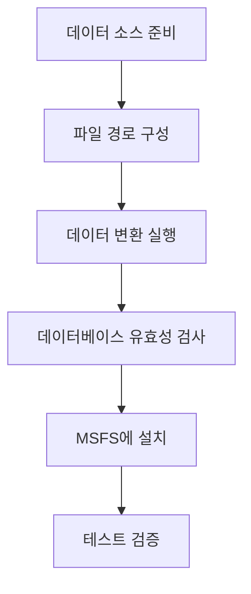

# 🚀 사용 설명

이 가이드는 Nav-data 도구를 사용하여 항공 항법 데이터를 PMDG 호환 데이터베이스 형식으로 변환하고 Microsoft Flight Simulator에 설치하는 방법을 자세히 설명합니다.

## 📋 변환 프로세스 개요

Nav-data의 데이터 변환은 다음 주요 단계를 따릅니다:



### 변환 모듈 설명

| 모듈명 | 기능 | 입력 데이터 | 출력 테이블 |
|--------|------|----------|--------|
| `PMDG_APT.py` | 공항 데이터 처리 | AD_HP.csv + Airport.dat | tbl_airports |
| `PMDG_RUNWAY.py` | 활주로 정보 처리 | RWY*.csv + earth_nav.dat | tbl_runways |
| `PMDG_VHF.py` | VOR/DME 데이터 처리 | earth_nav.dat | tbl_vhfnavaids |
| `PMDG_ENRT_NDB.py` | NDB 데이터 처리 | earth_nav.dat | tbl_enroute_ndbnavaids |
| `PMDG_ENRT_WAYPOINT.py` | 웨이포인트 처리 | earth_fix.dat | tbl_enroute_waypoints |
| `PMDG_TMA_WAYPOINT.py` | 터미널 구역 웨이포인트 | earth_fix.dat | tbl_terminal_waypoints |
| `PMDG_AWY_FINAL.py` | 항로 데이터 처리 | RTE_SEG.csv + earth_*.dat | tbl_enroute_airways |
| `PMDG_ILS.py` | ILS/GS 데이터 처리 | earth_nav.dat | tbl_localizers_glideslopes |
| `PMDG_SID.py` | 표준 계기 이륙 절차 | CIFP .dat파일 | tbl_sids |
| `PMDG_STAR.py` | 표준 터미널 도착 경로 절차 | CIFP .dat파일 | tbl_stars |
| `PMDG_APPCH.py` | 접근 절차 | CIFP .dat파일 | tbl_iaps |

## 🔄 데이터 변환 단계

### 첫 번째 단계: 데이터 준비

1.  **NAIP 데이터 가져오기**
    ```bash
    # NAIP CSV 파일을 지정된 디렉터리에 배치
    cp /source/path/*.csv data/input/naip/
    
    # 파일 무결성 검증
    ls data/input/naip/
    # 다음이 표시되어야 합니다: AD_HP.csv, RWY_DIRECTION.csv, RWY.csv, RTE_SEG.csv
    ```

2.  **X-Plane 데이터 가져오기**
    ```bash
    # X-Plane 설치 디렉터리에서 데이터 파일 복사
    cp "/path/to/X-Plane/Custom Data/earth_fix.dat" data/input/xplane/
    cp "/path/to/X-Plane/Custom Data/earth_nav.dat" data/input/xplane/
    ```

3.  **CIFP 데이터 가져오기**
    ```bash
    # CIFP 절차 데이터 파일 복사
    cp -r /path/to/CIFP/* data/input/cifp/
    ```

4.  **공항 검색 파일 준비**
    ```bash
    # 공항 이름 검색 파일 복사
    cp /path/to/Airport.dat data/input/
    ```

### 두 번째 단계: 환경 활성화 및 검증

```bash
# 가상 환경 활성화
source nav-data-env/bin/activate  # macOS/Linux
# 또는 nav-data-env\Scripts\activate  # Windows

# 구성 검증
python scripts/validate_config.py
```

### 세 번째 단계: 데이터 변환 실행

#### 방법 A: 각 모듈 개별 실행 (권장)

데이터 종속성에 따라 각 모듈을 단계별로 실행합니다:

```bash
# 1. 공항 기본 데이터 처리
echo "🏢 공항 데이터 처리 중..."
python PMDG_APT.py

# 2. 활주로 데이터 처리
echo "🛫 활주로 데이터 처리 중..."
python PMDG_RUNWAY.py

# 3. 항법 장비 처리
echo "📡 VHF 항법 장비 처리 중..."
python PMDG_VHF.py

echo "📡 NDB 항법 장비 처리 중..."
python PMDG_ENRT_NDB.py

echo "📍 ILS 시스템 처리 중..."
python PMDG_ILS.py

# 4. 웨이포인트 처리
echo "🗺️ 웨이포인트 데이터 처리 중..."
python PMDG_ENRT_WAYPOINT.py
python PMDG_TMA_WAYPOINT.py

# 5. 항로 데이터 처리
echo "🛣️ 항로 데이터 처리 중..."
python PMDG_AWY_FINAL.py

# 6. 비행 절차 처리 (CIFP 데이터가 있는 경우)
echo "📋 표준 이륙 절차 처리 중..."
python PMDG_SID.py

echo "📋 표준 도착 절차 처리 중..."
python PMDG_STAR.py

echo "📋 접근 절차 처리 중..."
python PMDG_APPCH.py
```

#### 방법 B: 배치 처리 스크립트

자동 처리 스크립트 생성:

```bash
# scripts/run_conversion.sh
#!/bin/bash

set -e  # 오류 발생 시 중지

echo "🚀 Nav-data 변환 프로세스 시작 중..."

# 가상 환경 확인
if [[ "$VIRTUAL_ENV" == "" ]]; then
    echo "❌ 먼저 가상 환경을 활성화하십시오"
    exit 1
fi

# 구성 검증
echo "🔍 구성 확인 중..."
python scripts/validate_config.py

# 출력 디렉터리 생성
mkdir -p data/output logs

# 시작 시간 기록
start_time=$(date +%s)

# 변환 함수
run_module() {
    local module=$1
    local description=$2
    
    echo "📊 $description"
    if python $module.py; then
        echo "✅ $module 완료"
    else
        echo "❌ $module 실패"
        exit 1
    fi
    echo "---"
}

# 변환 단계 실행
run_module "PMDG_APT" "공항 데이터 처리"
run_module "PMDG_RUNWAY" "활주로 데이터 처리"
run_module "PMDG_VHF" "VHF 항법 장비 처리"
run_module "PMDG_ENRT_NDB" "NDB 항법 장비 처리"
run_module "PMDG_ILS" "ILS 시스템 처리"
run_module "PMDG_ENRT_WAYPOINT" "웨이포인트 데이터 처리"
run_module "PMDG_TMA_WAYPOINT" "터미널 구역 웨이포인트 처리"
run_module "PMDG_AWY_FINAL" "항로 데이터 처리"

# 절차 데이터 (선택 사항)
if [[ -d "data/input/cifp" ]] && [[ $(ls -A data/input/cifp) ]]; then
    run_module "PMDG_SID" "표준 이륙 절차 처리"
    run_module "PMDG_STAR" "표준 도착 절차 처리"
    run_module "PMDG_APPCH" "접근 절차 처리"
fi

# 생성된 데이터베이스 유효성 검사
echo "🔍 데이터베이스 확인 중..."
python db_validator.py data/output/e_dfd_PMDG.s3db

# 총 소요 시간 계산
end_time=$(date +%s)
duration=$((end_time - start_time))
echo "✅ 변환 완료! 총 소요 시간: ${duration}초"

echo "📊 생성된 데이터베이스 파일: data/output/e_dfd_PMDG.s3db"
echo "📝 로그 파일 위치: logs/"
```

### 네 번째 단계: 생성된 데이터베이스 유효성 검사

```bash
# 데이터베이스 유효성 검사 도구 실행
python db_validator.py data/output/e_dfd_PMDG.s3db

# 데이터베이스 통계 정보 확인
python -c "
import sqlite3
conn = sqlite3.connect('data/output/e_dfd_PMDG.s3db')
cursor = conn.cursor()

# 테이블 목록 가져오기
cursor.execute(\"SELECT name FROM sqlite_master WHERE type='table'\")
tables = cursor.fetchall()

print('📊 데이터베이스 테이블 통계:')
for table in tables:
    table_name = table[0]
    cursor.execute(f'SELECT COUNT(*) FROM {table_name}')
    count = cursor.fetchone()[0]
    print(f'  {table_name}: {count:,}개 기록')

conn.close()
"
```

## 📥 Microsoft Flight Simulator에 설치

### 첫 번째 단계: PMDG 항공기 위치 확인

1.  **MSFS Community 폴더 찾기**
    
    MSFS 설치 방식에 따라:
    
    -   **Microsoft Store**: `%LOCALAPPDATA%\Packages\Microsoft.FlightSimulator_8wekyb3d8bbwe\LocalCache\Packages\Community`
    -   **Steam**: `%APPDATA%\Microsoft Flight Simulator\Packages\Community`
    -   **Xbox Game Pass**: `%LOCALAPPDATA%\Packages\Microsoft.FlightDashboard_8wekyb3d8bbwe\LocalCache\Packages\Community`

2.  **PMDG 항공기 설치 확인**
    ```cmd
    dir Community
    ```
    다음과 유사한 디렉터리가 표시되어야 합니다:
    ```
    pmdg-aircraft-737
    pmdg-aircraft-738
    pmdg-aircraft-77w
    ```

### 두 번째 단계: 기존 데이터 백업

각 PMDG 항공기의 기존 항법 데이터를 백업합니다:

```cmd
REM 예시: PMDG 737-800 백업
cd "Community\pmdg-aircraft-738\Config"
ren Navdata Navdata_backup_%DATE:~0,10%

REM PMDG 777-300ER 백업  
cd "..\..\..\pmdg-aircraft-77w\Config"
ren Navdata Navdata_backup_%DATE:~0,10%
```

### 세 번째 단계: 새 데이터베이스 설치

```cmd
REM 각 항공기에 Navdata 디렉터리를 생성하고 데이터베이스 복사
mkdir "Community\pmdg-aircraft-738\Config\Navdata"
copy "Nav-data\data\output\e_dfd_PMDG.s3db" "Community\pmdg-aircraft-738\Config\Navdata\"

mkdir "Community\pmdg-aircraft-77w\Config\Navdata"
copy "Nav-data\data\output\e_dfd_PMDG.s3db" "Community\pmdg-aircraft-77w\Config\Navdata\"
```

### 네 번째 단계: MSFS 캐시 지우기

MSFS 항법 데이터 캐시를 삭제하여 강제로 다시 로드합니다:

```cmd
REM Microsoft Store 버전
rmdir /s /q "%LOCALAPPDATA%\Packages\Microsoft.FlightSimulator_8wekyb3d8bbwe\LocalState\packages\pmdg-aircraft-738\work\NavigationData"
rmdir /s /q "%LOCALAPPDATA%\Packages\Microsoft.FlightSimulator_8wekyb3d8bbwe\LocalState\packages\pmdg-aircraft-77w\work\NavigationData"

REM Steam 버전  
rmdir /s /q "%APPDATA%\Microsoft Flight Simulator\LocalState\packages\pmdg-aircraft-738\work\NavigationData"
rmdir /s /q "%APPDATA%\Microsoft Flight Simulator\LocalState\packages\pmdg-aircraft-77w\work\NavigationData"
```

## ✅ 설치 확인

### 첫 번째 단계: MSFS 시작

1.  Microsoft Flight Simulator를 완전히 종료합니다
2.  MSFS를 다시 시작합니다
3.  완전히 로드될 때까지 기다립니다

### 두 번째 단계: PMDG 항공기 확인

1.  **PMDG 항공기 선택**
    -   임의의 PMDG 737 또는 777 항공기를 선택합니다
    -   중국 지역 공항을 선택합니다 (예: ZBAA 베이징 수도)

2.  **FMC 데이터 확인**
    -   조종석으로 진입합니다
    -   CDU/FMC를 엽니다
    -   항법 데이터베이스 날짜를 확인합니다
    -   웨이포인트 가용성을 검증합니다

### 세 번째 단계: 기능 테스트

#### 웨이포인트 테스트

```
CDU 작동 단계:
1. MENU → NAV DATA → WAYPOINT
2. 테스트 웨이포인트 입력: ABING
3. 올바른 좌표 정보가 표시되는지 확인
```

#### 공항 데이터 테스트

```
CDU 작동 단계:
1. MENU → NAV DATA → AIRPORT
2. 테스트 공항 입력: ZBAA
3. 활주로 정보 및 주파수 데이터를 검증합니다
```

#### 비행 절차 테스트

```
CDU 작동 단계:
1. ROUTE → DEPARTURE
2. 베이징 수도 공항 (ZBAA) 선택
3. SID 절차 가용성 검증
4. ROUTE → ARRIVAL
5. STAR 및 접근 절차 검증
```

## 🔧 고급 사용법

### 1. 증분 업데이트

특정 유형의 데이터만 업데이트해야 하는 경우:

```bash
# 항로 데이터만 업데이트
python PMDG_AWY_FINAL.py

# 공항 데이터만 업데이트
python PMDG_APT.py
python PMDG_RUNWAY.py
```

### 2. 배치 설치 스크립트

자동 설치 스크립트 생성:

```python
# scripts/install_to_msfs.py
import os
import shutil
import winreg
import glob
from pathlib import Path

def find_msfs_community():
    """MSFS Community 폴더를 자동으로 찾습니다"""
    possible_paths = [
        os.path.expandvars(r"%LOCALAPPDATA%\Packages\Microsoft.FlightSimulator_8wekyb3d8bbwe\LocalCache\Packages\Community"),
        os.path.expandvars(r"%APPDATA%\Microsoft Flight Simulator\Packages\Community"),
        os.path.expandvars(r"%LOCALAPPDATA%\Packages\Microsoft.FlightDashboard_8wekyb3d8bbwe\LocalCache\Packages\Community")
    ]
    
    for path in possible_paths:
        if os.path.exists(path):
            return path
    return None

def install_navdata():
    """모든 PMDG 항공기에 항법 데이터를 설치합니다"""
    
    community_path = find_msfs_community()
    if not community_path:
        print("❌ MSFS Community 폴더를 찾을 수 없습니다")
        return False
    
    print(f"📂 Community 폴더를 찾았습니다: {community_path}")
    
    # PMDG 항공기 찾기
    pmdg_aircraft = glob.glob(os.path.join(community_path, "pmdg-aircraft-*"))
    
    if not pmdg_aircraft:
        print("❌ PMDG 항공기를 찾을 수 없습니다")
        return False
    
    database_path = "data/output/e_dfd_PMDG.s3db"
    if not os.path.exists(database_path):
        print(f"❌ 데이터베이스 파일이 존재하지 않습니다: {database_path}")
        return False
    
    for aircraft_path in pmdg_aircraft:
        aircraft_name = os.path.basename(aircraft_path)
        config_path = os.path.join(aircraft_path, "Config")
        navdata_path = os.path.join(config_path, "Navdata")
        
        print(f"🛫 {aircraft_name} 처리 중...")
        
        # 기존 데이터 백업
        if os.path.exists(navdata_path):
            backup_path = f"{navdata_path}_backup"
            if os.path.exists(backup_path):
                shutil.rmtree(backup_path)
            shutil.move(navdata_path, backup_path)
            print(f"  💾 기존 데이터가 {backup_path}에 백업되었습니다")
        
        # 새 Navdata 디렉터리 생성
        os.makedirs(navdata_path, exist_ok=True)
        
        # 데이터베이스 파일 복사
        dest_db = os.path.join(navdata_path, "e_dfd_PMDG.s3db")
        shutil.copy2(database_path, dest_db)
        print(f"  ✅ 데이터베이스가 {dest_db}에 설치되었습니다")
    
    print("✅ 모든 PMDG 항공기의 항법 데이터 설치 완료!")
    print("⚠️ 새로운 데이터를 로드하려면 Microsoft Flight Simulator를 다시 시작하십시오")
    return True

if __name__ == "__main__":
    install_navdata()
```

### 3. 데이터 비교 도구

다른 버전의 데이터를 비교하는 도구 생성:

```python
# scripts/compare_databases.py
import sqlite3
import sys

def compare_databases(db1_path, db2_path):
    """두 데이터베이스의 차이점을 비교합니다"""
    
    conn1 = sqlite3.connect(db1_path)
    conn2 = sqlite3.connect(db2_path)
    
    cursor1 = conn1.cursor()
    cursor2 = conn2.cursor()
    
    # 테이블 목록 가져오기
    cursor1.execute("SELECT name FROM sqlite_master WHERE type='table'")
    tables1 = {row[0] for row in cursor1.fetchall()}
    
    cursor2.execute("SELECT name FROM sqlite_master WHERE type='table'")
    tables2 = {row[0] for row in cursor2.fetchall()}
    
    print("📊 데이터베이스 비교 보고서")
    print("=" * 50)
    
    # 테이블 구조 비교
    common_tables = tables1.intersection(tables2)
    only_in_db1 = tables1 - tables2
    only_in_db2 = tables2 - tables1
    
    if only_in_db1:
        print(f"❗ {db1_path}에만 있는 테이블: {only_in_db1}")
    if only_in_db2:
        print(f"❗ {db2_path}에만 있는 테이블: {only_in_db2}")
    
    # 기록 수 비교
    for table in common_tables:
        cursor1.execute(f"SELECT COUNT(*) FROM {table}")
        count1 = cursor1.fetchone()[0]
        
        cursor2.execute(f"SELECT COUNT(*) FROM {table}")
        count2 = cursor2.fetchone()[0]
        
        diff = count2 - count1
        status = "📈" if diff > 0 else "📉" if diff < 0 else "➡️"
        print(f"{status} {table}: {count1} → {count2} ({diff:+d})")
    
    conn1.close()
    conn2.close()

if __name__ == "__main__":
    if len(sys.argv) != 3:
        print("사용법: python compare_databases.py <데이터베이스1> <데이터베이스2>")
        sys.exit(1)
    
    compare_databases(sys.argv[1], sys.argv[2])
```

## 🔍 문제 해결

### 일반적인 문제 및 해결책

#### 1. 변환 중단
**증상**: 변환 중에 오류가 발생하고 중지됨
**해결책**:
```bash
# 오류 로그 확인
cat logs/PMDG_*.log | grep ERROR

# 실패한 모듈 다시 실행
python [실패한 모듈].py
```

#### 2. MSFS가 데이터를 인식하지 못함
**증상**: PMDG FMC에 "DB OUT OF DATE" 표시
**해결책**:
```bash
# 데이터베이스 파일 위치가 올바른지 확인
ls "Community/pmdg-aircraft-*/Config/Navdata/"

# 캐시 다시 지우기
rmdir /s /q "%LOCALAPPDATA%\...\NavigationData"

# MSFS 재시작
```

#### 3. 메모리 부족 오류
**증상**: "MemoryError" 또는 시스템 속도 저하
**해결책**:
```bash
# 배치 크기 줄이기
# PMDG_TMA_WAYPOINT.py 편집
# batch_size=1000을 batch_size=500으로 변경

# 다른 응용 프로그램 닫기
# 가상 메모리 늘리기
```

#### 4. 권한 문제
**증상**: "Permission denied" 오류
**해결책**:
```cmd
REM Windows: 관리자 권한으로 실행
REM 또는 폴더 권한 수정
icacls "Community" /grant %USERNAME%:F /t
```

### 로그 분석

자세한 정보를 얻으려면 각 모듈의 로그 파일을 확인하십시오:

```bash
# 처리 통계 보기
grep "처리 완료" logs/PMDG_*.log

# 오류 메시지 보기
grep "ERROR\|오류" logs/PMDG_*.log

# 경고 메시지 보기
grep "WARNING\|경고" logs/PMDG_*.log
```

---

**완료**: 이제 Nav-data의 전체 사용 프로세스를 숙지하셨습니다! 더 많은 고급 기능을 알아보려면 [기술 아키텍처](../architecture.md) 문서를 참조하십시오.