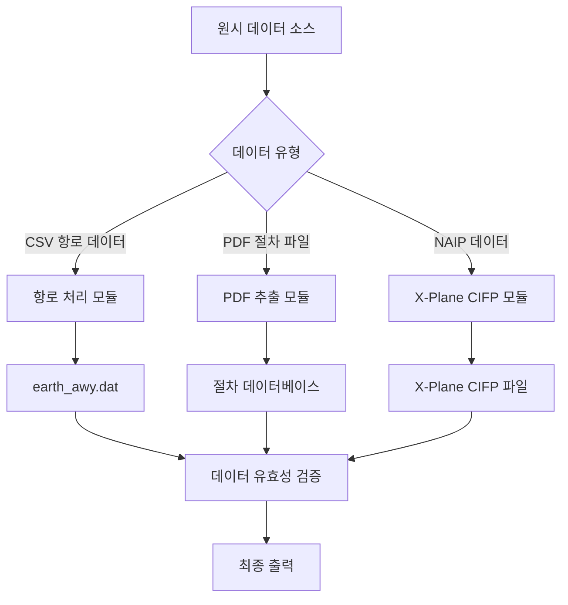

# 사용 설명서

본 문서에서는 Nav-data 도구를 사용하여 항공 항법 데이터를 변환하는 방법에 대해 자세히 설명하며, 데이터 준비부터 최종 출력까지의 전체 프로세스를 다룹니다.

## 🗂️ 데이터 처리 흐름 개요

Nav-data에는 세 가지 주요 데이터 처리 흐름이 포함됩니다.



## 🛣️ 항로 데이터 처리

### 데이터 준비

#### 1. 입력 파일 준비
다음 파일이 작업 디렉토리에 있는지 확인하십시오.

```bash
# 필수 입력 파일
RTE_SEG.csv          # 항로 구간 데이터 (CSV 형식)
earth_fix.dat        # X-Plane 고정점 데이터
earth_nav.dat        # X-Plane 항법 장비 데이터
earth_awy.dat        # X-Plane 항로 데이터 (업데이트 예정)
```

#### 2. CSV 파일 형식 유효성 검증
`RTE_SEG.csv`는 다음 필드를 포함해야 합니다.

| 필드명 | 설명 | 예시 |
|--------|------|------|
| `CODE_POINT_START` | 시작점 코드 | ABCDE |
| `CODE_TYPE_START` | 시작점 유형 | DESIGNATED_POINT |
| `CODE_POINT_END` | 종점 코드 | FGHIJ |
| `CODE_TYPE_END` | 종점 유형 | VOR/DME |
| `CODE_DIR` | 방향 코드 | N |
| `TXT_DESIG` | 항로명 | A123 |

### 항로 변환 실행

#### 기본 사용법
```bash
# 항로 모듈 디렉토리로 이동
cd Airway

# 변환 스크립트 실행
python airway.py
```

#### 고급 사용법
```bash
# 사용자 지정 매개변수 사용
python airway.py --config custom_config.ini

# 특정 입력 파일 지정
python airway.py --csv-file /path/to/custom_routes.csv

# 상세 로깅 활성화
python airway.py --verbose

# 특정 지역만 처리
python airway.py --areas ZB,ZG,ZY
```

#### 스크립트 내 설정 수정
처리 매개변수를 수정하려면 `Airway/airway.py`를 편집하십시오.

```python
# 필터링 지역 수정
china_areas = {'ZB', 'ZG', 'ZY', 'ZS', 'ZW', 'ZJ', 'ZP', 'ZL', 'ZH', 'ZU'}

# 파일 경로 수정
csv_file = 'custom_routes.csv'
earth_fix_path = '/path/to/earth_fix.dat'
earth_nav_path = '/path/to/earth_nav.dat'
earth_awy_path = '/path/to/earth_awy.dat'
```

### 출력 파일 설명

처리 완료 후, `earth_awy.dat` 파일은 다음을 포함합니다.
- 필터링된 원본 항로 데이터
- 새로 추가된 중국 영공 항로 데이터
- X-Plane 형식에 맞는 항로 정보

출력 형식 예시:
```
ABCDE  ZB  11 FGHIJ  ZG   3 N  1    0  600 A123
```

## 📄 PDF 데이터 추출

### 절차 데이터 처리 흐름

#### 흐름 1: PDF 원시 추출
```bash
# PDF 추출 디렉토리로 이동
cd "PDF extract"

# PDF 추출 스크립트 실행
python 1_terminal_pdf.py

# 입력: airport_procedures.pdf
# 출력: ZXXX_procedure.txt
```

**사용 예시:**
```python
# 사용자 지정 PDF 처리
import pdfplumber
from utils import *

# PDF 파일 열기
with pdfplumber.open("ZBAA_procedures.pdf") as pdf:
    # 텍스트 및 그래픽 요소 추출
    extracted_data = extract(pdf)
    
    # 추출 결과 저장
    with open("ZBAA_procedure.txt", "w", encoding="utf-8") as f:
        for line in extracted_data:
            f.write(line + "\n")
```

#### 흐름 2: 데이터 표준화 인코딩
```bash
# 인코딩 스크립트 실행
python 2_terminal_encode.py

# 입력: ZXXX_procedure.txt
# 출력: ZXXX_encode.txt
```

**인코딩 규칙:**
- 유효하지 않은 문자 및 형식 정리
- 절차 이름 표준화
- 좌표 형식 표준화
- 데이터 무결성 검증

#### 흐름 3: 데이터베이스 형식 생성
```bash
# 데이터베이스 생성 스크립트 실행
python 3_terminal_db.py

# 입력: ZXXX_encode.txt  
# 출력: ZXXX_db.txt
```

**데이터베이스 형식 특성:**
- 다중 활주로 절차 분리
- 천이, 복행, 대기 절차 연결
- X-Plane 호환 형식 생성
- 절차 설명 인코딩 추가

#### 흐름 4: 절차 증식 (선택 사항)
```bash
# 절차 이름 불일치 문제 수정
python 4_程序增殖.py

# 입력: ZXXX_db.txt
# 출력: 수정된 절차 파일
```

### 항로점 좌표 추출 흐름

#### 자동 추출 (권장)
```bash
# 자동 좌표 추출 실행
python waypoint_1_pdf.py

# 입력/출력 경로 구성
input_pdf = "ZBAA_waypoints.pdf"
output_txt = "ZBAA_waypoint.txt"
```

**자동 추출 특성:**
- 좌표 형식 지능형 인식
- 도분초 변환 자동 처리
- 다양한 PDF 레이아웃 지원
- 데이터 유효성 검증 포함

#### 수동 추출 (대안 솔루션)
자동 추출 정확도가 이상적이지 않을 때:

```bash
# Microsoft Edge 브라우저를 사용하여 수동 추출
python waypoint_2_edge.py
```

**수동 추출 단계:**
1. Microsoft Edge로 PDF 파일 열기
2. 마우스 오른쪽 버튼을 클릭하여 관련 텍스트 선택 및 복사
3. 텍스트를 입력 파일에 저장
4. 스크립트 실행으로 형식화 처리

#### 단일 파일 처리 (특수 상황)
```bash
# 특수 문자를 포함하는 파일 처리
python debug_single.py

# 적용 대상:
# - 괄호 등 특수 문자를 포함하는 파일
# - 수동 수정이 필요한 데이터
# - 개별적으로 처리된 공항 파일
```

### PDF 처리 모범 사례

#### 1. PDF 파일 전처리
```bash
# PDF 파일 품질 확인
python -c "
import pdfplumber
with pdfplumber.open('input.pdf') as pdf:
    print(f'페이지 수: {len(pdf.pages)}')
    print(f'첫 페이지 텍스트 줄 수: {len(pdf.pages[0].extract_text_lines())}')
"
```

#### 2. 일괄 처리
```python
# 여러 공항 PDF 일괄 처리
import os
from pathlib import Path

pdf_folder = "input_pdfs/"
output_folder = "output_txt/"

for pdf_file in Path(pdf_folder).glob("*.pdf"):
    airport_code = pdf_file.stem[:4]  # 공항 코드 추출
    
    # 단일 파일 처리
    os.system(f"python 1_terminal_pdf.py {pdf_file}")
    os.system(f"python 2_terminal_encode.py {airport_code}_procedure.txt")
    os.system(f"python 3_terminal_db.py {airport_code}_encode.txt")
    
    print(f"처리 완료: {airport_code}")
```

#### 3. 품질 검사
```python
# 추출 결과 검증
def validate_extraction(output_file):
    with open(output_file, 'r', encoding='utf-8') as f:
        lines = f.readlines()
    
    # 좌표 형식 확인
    coord_pattern = r'\d+\.\d{8}'
    valid_coords = sum(1 for line in lines if re.search(coord_pattern, line))
    
    print(f"파일: {output_file}")
    print(f"총 줄 수: {len(lines)}")
    print(f"유효한 좌표 줄 수: {valid_coords}")
    print(f"데이터 품질: {valid_coords/len(lines)*100:.1f}%")

# 사용 예시
validate_extraction("ZBAA_waypoint.txt")
```

## 🔧 터미널 절차 수정

### 데이터 인코딩 수정

#### 인코더 사용
```bash
# 수정 모듈 디렉토리로 이동
cd "Terminal Patch"

# 일괄 처리 (기본 경로)
python terminal_encoder.py

# 사용자 지정 경로 처리
python terminal_encoder.py "input_folder" "output_folder"

# 예시
python terminal_encoder.py "PDF extract/public" "PDF extract/encoded"
```

**인코더 기능:**
- IF 지점 위치 식별
- 천이 구간 인코딩 추가
- 절차 핵심 지점 표시
- 표준 설명 코드 생성

#### 형식 수정기 사용
```bash
# 일괄 형식 수정 (기본 경로)
python terminal_reencode.py

# 단일 파일 처리
python terminal_reencode.py ZBAA.dat ZBAA_fixed.dat

# 입력/출력 폴더 지정
python terminal_reencode.py "/input/folder" "/output/folder"
```

**수정 규칙 설명:**

1. **APPCH 라인 GY M 규칙**
   ```
   수정 전: APPCH ... RW01 ... ... GY M
   수정 후: APPCH ... RW01 ... G GY M
   ```

2. **순수 알파벳 다섯 번째 부분 규칙**
   ```
   수정 전: SID ... ABC ... ... EY M
   수정 후: SID ... ABC ... D B VY M
   ```

3. **SID RW 규칙**
   ```
   수정 전: SID ... RW25 ... ... EY D
   수정 후: SID ... RW25 ... G GY D
   ```

### 사용자 지정 수정 스크립트

```python
# 사용자 지정 수정 스크립트 생성
import re

def custom_fix_procedure(input_file, output_file):
    """사용자 지정 절차 수정 함수"""
    with open(input_file, 'r', encoding='utf-8') as f:
        lines = f.readlines()
    
    fixed_lines = []
    for line in lines:
        # 사용자 지정 수정 규칙 적용
        if line.startswith('APPCH'):
            # 사용자 지정 접근 절차 수정
            parts = line.split()
            if len(parts) >= 9:
                # 수정 논리
                if parts[8] == 'EY':
                    parts[8] = 'GY'
                line = ' '.join(parts) + '\n'
        
        fixed_lines.append(line)
    
    with open(output_file, 'w', encoding='utf-8') as f:
        f.writelines(fixed_lines)

# 사용 예시
custom_fix_procedure('ZBAA.dat', 'ZBAA_custom_fixed.dat')
```

## 🛩️ X-Plane CIFP 생성

### 항법 장비 처리

#### VOR/DME 및 NDB 데이터 처리
```bash
cd "X-Plane CIFP"

# 항법 장비 데이터 처리
python 1_navaid.py
```

**경로 구성:**
```python
# 스크립트 내 경로 설정 수정
nav경로 = "path/to/earth_nav.dat"
vor경로 = "path/to/VOR.csv"
ndb경로 = "path/to/NDB.csv"
```

**CSV 데이터 형식 요구 사항:**

VOR.csv 필드:
- 공항 코드, 이름, 주파수, 좌표, 고도 등

NDB.csv 필드:
- 공항 코드, 이름, 주파수, 좌표, 고도 등

### 항로점 처리

```bash
# 항로점 데이터 처리
python 2_waypoint.py
```

**구성 예시:**
```python
# 경로 설정 수정
naipPath = "path/to/naip/waypoints"
xplanePath = "path/to/xplane/data"
outputPath = "path/to/output/earth_fix.dat"

# X-Plane 버전 선택
forXp11 = False  # X-Plane 11의 경우 True, X-Plane 12의 경우 False
```

### 터미널 절차 처리

```bash
# 터미널 절차 데이터 처리
python 3_terminal.py
```

**경로 구성:**
```python
# 주요 경로 설정
inputPath = "path/to/encoded/procedures"
outputFolder = "path/to/cifp/output"
xplanePath = "path/to/xplane/installation"
csvFolder = "path/to/naip/csv/data"
```

**처리 흐름:**
1. 인코딩된 절차 파일 읽기
2. 항로점 데이터베이스 구축
3. SID, STAR, 접근 절차 처리
4. 활주로 정보 생성
5. CIFP 형식 파일 출력

### 특수 기능 모듈

#### Fenix 데이터 추출
```bash
# 특정 형식 활주로 및 MAP 정보 추출
python Fenix.py

# 매개변수 구성
csv_folder = "path/to/csv/data"
procedure_folder = "path/to/procedures"
output_file = "fenix_output.txt"
```

#### 활주로 생성
```bash
# 활주로 관련 데이터 생성
python spawn_runway.py

# 또는 내보내기 버전 사용
python 跑道生成导出ver.py
```

## 📊 데이터 유효성 검증 및 품질 관리

### 자동 유효성 검증 스크립트

`validate_output.py` 생성:

```python
#!/usr/bin/env python3
"""
출력 데이터 유효성 검증 스크립트
"""
import re
import os
from pathlib import Path

def validate_airway_data(file_path):
    """항로 데이터 형식 검증"""
    errors = []
    with open(file_path, 'r', encoding='utf-8') as f:
        for line_num, line in enumerate(f, 1):
            line = line.strip()
            if not line or line == "99":
                continue
                
            # X-Plane 항로 형식 검증
            parts = line.split()
            if len(parts) < 11:
                errors.append(f"줄 {line_num}: 필드 수 부족")
                continue
                
            # 좌표 범위 유효성 검증
            try:
                # 여기에 구체적인 좌표 유효성 검증 로직 추가
                pass
            except ValueError as e:
                errors.append(f"줄 {line_num}: 좌표 형식 오류 - {e}")
    
    return errors

def validate_waypoint_data(file_path):
    """항로점 데이터 형식 검증"""
    errors = []
    coord_pattern = r'^-?\d+\.\d{8}$'
    
    with open(file_path, 'r', encoding='utf-8') as f:
        for line_num, line in enumerate(f, 1):
            line = line.strip()
            if not line:
                continue
                
            parts = line.split()
            if len(parts) < 3:
                errors.append(f"줄 {line_num}: 필드 수 부족")
                continue
                
            # 좌표 형식 검증
            try:
                lat, lon = float(parts[1]), float(parts[2])
                if not (-90 <= lat <= 90):
                    errors.append(f"줄 {line_num}: 위도 범위 초과")
                if not (-180 <= lon <= 180):
                    errors.append(f"줄 {line_num}: 경도 범위 초과")
            except ValueError:
                errors.append(f"줄 {line_num}: 좌표 형식 오류")
    
    return errors

def validate_cifp_data(file_path):
    """CIFP 데이터 형식 검증"""
    errors = []
    procedure_types = ['SID', 'STAR', 'APPCH']
    
    with open(file_path, 'r', encoding='utf-8') as f:
        for line_num, line in enumerate(f, 1):
            line = line.strip()
            if not line:
                continue
                
            # 절차 유형 확인
            if any(line.startswith(ptype) for ptype in procedure_types):
                parts = line.split()
                if len(parts) < 15:
                    errors.append(f"줄 {line_num}: CIFP 형식 필드 부족")
    
    return errors

def main():
    """주요 유효성 검증 함수"""
    print("🔍 Nav-data 출력 유효성 검증")
    print("=" * 40)
    
    # 유효성 검증 설정
    validation_config = {
        'earth_awy.dat': validate_airway_data,
        '*.txt': validate_waypoint_data,  # 항로점 파일
        '*.dat': validate_cifp_data,      # CIFP 파일
    }
    
    total_errors = 0
    
    for pattern, validator in validation_config.items():
        if '*' in pattern:
            # 와일드카드 패턴
            ext = pattern.split('*')[1]
            files = list(Path('.').glob(f'**/*{ext}'))
        else:
            # 특정 파일
            files = [Path(pattern)] if Path(pattern).exists() else []
        
        for file_path in files:
            if file_path.exists():
                print(f"\n📄 검증 파일: {file_path}")
                errors = validator(str(file_path))
                
                if errors:
                    print(f"❌ {len(errors)}개 오류 발견:")
                    for error in errors[:5]:  # 처음 5개 오류만 표시
                        print(f"   - {error}")
                    if len(errors) > 5:
                        print(f"   ... {len(errors) - 5}개 오류 더 있음")
                    total_errors += len(errors)
                else:
                    print("✅ 유효성 검증 통과")
    
    print(f"\n" + "=" * 40)
    if total_errors == 0:
        print("🎉 모든 데이터 유효성 검증 통과!")
        return 0
    else:
        print(f"⚠️  총 {total_errors}개 문제 발견")
        return 1

if __name__ == "__main__":
    exit(main())
```

### 유효성 검증 스크립트 사용
```bash
# 유효성 검증 실행
python validate_output.py

# 출력 예시
🔍 Nav-data 출력 유효성 검증
========================================

📄 검증 파일: earth_awy.dat
✅ 유효성 검증 통과

📄 검증 파일: ZBAA_waypoint.txt
✅ 유효성 검증 통과

📄 검증 파일: ZBAA.dat
❌ 2개 오류 발견:
   - 줄 15: CIFP 형식 필드 부족
   - 줄 23: 좌표 형식 오류

========================================
⚠️  총 2개 문제 발견
```

## 🔧 일괄 처리 워크플로우

### 일괄 처리 스크립트 생성

`batch_process.py` 생성:

```python
#!/usr/bin/env python3
"""
Nav-data 일괄 처리 스크립트
"""
import os
import sys
import subprocess
from pathlib import Path
import logging

# 로깅 구성
logging.basicConfig(level=logging.INFO, format='%(asctime)s - %(levelname)s - %(message)s')
logger = logging.getLogger(__name__)

class BatchProcessor:
    def __init__(self, config):
        self.config = config
        self.processed_count = 0
        self.error_count = 0
    
    def process_airway_data(self):
        """항로 데이터 처리"""
        logger.info("항로 데이터 처리 시작...")
        
        try:
            os.chdir('Airway')
            result = subprocess.run(['python', 'airway.py'], 
                                  capture_output=True, text=True)
            
            if result.returncode == 0:
                logger.info("항로 데이터 처리 성공")
                self.processed_count += 1
            else:
                logger.error(f"항로 데이터 처리 실패: {result.stderr}")
                self.error_count += 1
                
        except Exception as e:
            logger.error(f"항로 데이터 처리 중 예외 발생: {e}")
            self.error_count += 1
        finally:
            os.chdir('..')
    
    def process_pdf_data(self, pdf_files):
        """PDF 데이터 일괄 처리"""
        logger.info(f"{len(pdf_files)}개 PDF 파일 처리 시작...")
        
        os.chdir('PDF extract')
        
        for pdf_file in pdf_files:
            try:
                airport_code = Path(pdf_file).stem[:4]
                logger.info(f"공항 처리: {airport_code}")
                
                # 단계 1: PDF 추출
                subprocess.run(['python', '1_terminal_pdf.py', pdf_file], check=True)
                
                # 단계 2: 인코딩
                subprocess.run(['python', '2_terminal_encode.py', 
                              f'{airport_code}_procedure.txt'], check=True)
                
                # 단계 3: 데이터베이스 생성
                subprocess.run(['python', '3_terminal_db.py', 
                              f'{airport_code}_encode.txt'], check=True)
                
                logger.info(f"처리 완료: {airport_code}")
                self.processed_count += 1
                
            except subprocess.CalledProcessError as e:
                logger.error(f"{pdf_file} 처리 실패: {e}")
                self.error_count += 1
            except Exception as e:
                logger.error(f"{pdf_file} 처리 중 예외 발생: {e}")
                self.error_count += 1
        
        os.chdir('..')
    
    def process_terminal_patch(self):
        """터미널 패치 처리"""
        logger.info("터미널 패치 처리 시작...")
        
        try:
            os.chdir('Terminal Patch')
            
            # 인코더
            subprocess.run(['python', 'terminal_encoder.py'], check=True)
            
            # 형식 수정
            subprocess.run(['python', 'terminal_reencode.py'], check=True)
            
            logger.info("터미널 패치 처리 성공")
            self.processed_count += 1
            
        except subprocess.CalledProcessError as e:
            logger.error(f"터미널 패치 처리 실패: {e}")
            self.error_count += 1
        except Exception as e:
            logger.error(f"터미널 패치 처리 중 예외 발생: {e}")
            self.error_count += 1
        finally:
            os.chdir('..')
    
    def process_cifp_data(self):
        """CIFP 데이터 처리"""
        logger.info("CIFP 데이터 처리 시작...")
        
        try:
            os.chdir('X-Plane CIFP')
            
            # 항법 장비
            subprocess.run(['python', '1_navaid.py'], check=True)
            
            # 항로점
            subprocess.run(['python', '2_waypoint.py'], check=True)
            
            # 터미널 절차
            subprocess.run(['python', '3_terminal.py'], check=True)
            
            logger.info("CIFP 데이터 처리 성공")
            self.processed_count += 1
            
        except subprocess.CalledProcessError as e:
            logger.error(f"CIFP 데이터 처리 실패: {e}")
            self.error_count += 1
        except Exception as e:
            logger.error(f"CIFP 데이터 처리 중 예외 발생: {e}")
            self.error_count += 1
        finally:
            os.chdir('..')
    
    def run_validation(self):
        """데이터 유효성 검증 실행"""
        logger.info("데이터 유효성 검증 시작...")
        
        try:
            result = subprocess.run(['python', 'validate_output.py'], 
                                  capture_output=True, text=True)
            
            if result.returncode == 0:
                logger.info("데이터 유효성 검증 통과")
            else:
                logger.warning(f"데이터 유효성 검증에서 문제 발견: {result.stdout}")
                
        except Exception as e:
            logger.error(f"데이터 유효성 검증 중 예외 발생: {e}")
    
    def generate_report(self):
        """처리 보고서 생성"""
        total = self.processed_count + self.error_count
        success_rate = (self.processed_count / total * 100) if total > 0 else 0
        
        report = f"""
Nav-data 일괄 처리 보고서
========================
총 작업 수: {total}
성공 수: {self.processed_count}
실패 수: {self.error_count}
성공률: {success_rate:.1f}%

상세 로그는 콘솔 출력을 확인하십시오.
        """
        
        logger.info(report)
        
        # 보고서를 파일에 저장
        with open('batch_process_report.txt', 'w', encoding='utf-8') as f:
            f.write(report)

def main():
    """주요 함수"""
    config = {
        'pdf_folder': 'input_pdfs/',
        'enable_validation': True,
        'generate_report': True
    }
    
    processor = BatchProcessor(config)
    
    # PDF 파일 찾기
    pdf_files = list(Path(config['pdf_folder']).glob('*.pdf')) if Path(config['pdf_folder']).exists() else []
    
    # 처리 흐름 실행
    try:
        # 1. 항로 데이터 처리
        if Path('Airway/RTE_SEG.csv').exists():
            processor.process_airway_data()
        
        # 2. PDF 데이터 처리
        if pdf_files:
            processor.process_pdf_data(pdf_files)
        
        # 3. 터미널 패치 처리
        processor.process_terminal_patch()
        
        # 4. CIFP 데이터 처리
        processor.process_cifp_data()
        
        # 5. 데이터 유효성 검증
        if config['enable_validation']:
            processor.run_validation()
        
        # 6. 보고서 생성
        if config['generate_report']:
            processor.generate_report()
            
    except KeyboardInterrupt:
        logger.info("사용자 처리 중단")
    except Exception as e:
        logger.error(f"일괄 처리 중 예외 발생: {e}")
    
    logger.info("일괄 처리 완료")

if __name__ == "__main__":
    main()
```

### 일괄 처리 사용
```bash
# 일괄 처리 실행
python batch_process.py

# 출력 예시
2025-01-23 10:00:00 - INFO - 항로 데이터 처리 시작...
2025-01-23 10:01:30 - INFO - 항로 데이터 처리 성공
2025-01-23 10:01:30 - INFO - 5개 PDF 파일 처리 시작...
2025-01-23 10:02:00 - INFO - 공항 처리: ZBAA
2025-01-23 10:03:15 - INFO - 처리 완료: ZBAA
...
2025-01-23 10:15:00 - INFO - 일괄 처리 완료
```

## ❓ 자주 묻는 질문 (FAQ)

### Q1: 항로 변환이 실패한 이유는 무엇입니까?
**A:** 일반적인 원인 및 해결책:

1. **CSV 파일 형식 오류**
   ```bash
   # CSV 파일 인코딩 확인
   file -I RTE_SEG.csv
   
   # 인코딩 변환 (필요한 경우)
   iconv -f gbk -t utf-8 RTE_SEG.csv > RTE_SEG_utf8.csv
   ```

2. **필수 필드 누락**
   ```python
   # CSV 필드 검증
   import pandas as pd
   df = pd.read_csv('RTE_SEG.csv')
   required_fields = ['CODE_POINT_START', 'CODE_TYPE_START', 'CODE_POINT_END', 
                     'CODE_TYPE_END', 'CODE_DIR', 'TXT_DESIG']
   missing_fields = [f for f in required_fields if f not in df.columns]
   print(f"누락된 필드: {missing_fields}")
   ```

3. **참조 데이터 파일이 존재하지 않음**
   ```bash
   # 파일 존재 여부 확인
   ls -la earth_fix.dat earth_nav.dat earth_awy.dat
   ```

### Q2: PDF 추출 정확도가 이상적이지 않으면 어떻게 해야 합니까?
**A:** 다음 해결책을 시도하십시오.

1. **수동 추출 방법 사용**
   ```bash
   python waypoint_2_edge.py
   ```

2. **PDF 처리 매개변수 조정**
   ```python
   # waypoint_1_pdf.py에서 조정
   crop_margin = 50  # 자르기 여백 증가
   text_confidence = 0.8  # 텍스트 신뢰도 임계값 감소
   ```

3. **PDF 파일 전처리**
   - PDF가 스캔 이미지가 아닌 텍스트 형식인지 확인
   - PDF 편집기로 파일 품질 최적화
   - 불필요한 그래픽 요소 제거

### Q3: 절차 인코딩 오류는 어떻게 수정합니까?
**A:** 수정 도구를 사용하십시오.

1. **자동 수정**
   ```bash
   cd "Terminal Patch"
   python terminal_reencode.py
   ```

2. **수동 확인 및 수정**
   ```python
   # 절차 형식 확인
   with open('ZBAA.dat', 'r') as f:
       for i, line in enumerate(f, 1):
           if 'APPCH' in line:
               parts = line.split()
               if len(parts) < 15:
                   print(f"줄 {i} 형식 불완전: {line.strip()}")
   ```

### Q4: X-Plane이 생성된 데이터를 인식하지 못합니까?
**A:** 다음 항목을 확인하십시오.

1. **파일 경로의 정확성**
   ```bash
   # X-Plane 11
   ls "$XPLANE_PATH/Custom Data/"
   
   # X-Plane 12
   ls "$XPLANE_PATH/Output/FMS plans/"
   ```

2. **파일 형식 호환성**
   ```python
   # 파일 인코딩 확인
   with open('earth_awy.dat', 'rb') as f:
       raw = f.read(100)
       print(f"파일 인코딩 감지: {raw}")
   ```

3. **데이터 무결성**
   ```bash
   # 파일이 "99"로 끝나는지 확인
   tail -n 5 earth_awy.dat
   ```

### Q5: 대용량 파일 처리 시 메모리 부족?
**A:** 메모리 사용을 최적화하십시오.

1. **가상 메모리 증가**
   ```bash
   # Linux 시스템
   sudo swapon --show
   sudo fallocate -l 4G /swapfile
   sudo mkswap /swapfile
   sudo swapon /swapfile
   ```

2. **일괄 처리**
   ```python
   # 일괄 처리 크기 감소
   BATCH_SIZE = 500  # 일괄 처리 크기 감소
   ```

3. **메모리 정리**
   ```python
   import gc
   # 처리 루프에 추가
   gc.collect()
   ```

### Q6: 좌표 정밀도 문제?
**A:** 좌표 처리 정밀도를 향상시키십시오.

1. **정밀도 설정 조정**
   ```python
   COORDINATE_PRECISION = 8  # 8자리 소수점 정밀도 유지
   ```

2. **좌표 범위 유효성 검증**
   ```python
   # 중국 지역 좌표 범위
   LAT_MIN, LAT_MAX = 15.0, 55.0
   LON_MIN, LON_MAX = 70.0, 140.0
   ```

3. **고정밀 계산 사용**
   ```python
   from decimal import Decimal, getcontext
   getcontext().prec = 12  # 고정밀 설정
   ```

### Q7: AIRAC 데이터는 어떻게 업데이트합니까?
**A:** AIRAC 데이터 업데이트 프로세스:

1. **현재 주기 자동 계산**
   ```python
   from datetime import datetime
   # 도구가 현재 AIRAC 주기를 자동으로 계산합니다
   current_cycle = get_current_airac_cycle()
   print(f"현재 AIRAC 주기: {current_cycle}")
   ```

2. **주기 수동 지정**
   ```python
   # 설정에서 지정
   manual_cycle = "2504"  # 2025년 4번째 주기
   ```

3. **데이터 유효 기간 확인**
   ```bash
   # 원본 데이터의 AIRAC 정보 확인
   grep -i "airac" *.csv
   ```

### Q8: 코드 기여 또는 문제 보고는 어떻게 합니까?
**A:** 프로젝트 개발에 참여하십시오.

1. **문제 보고**
   - GitHub에 상세 Issue 제출
   - 오류 메시지 및 재현 단계 포함
   - 관련 입력 파일 제공 (가능한 경우)

2. **코드 기여**
   - 프로젝트 저장소 Fork
   - 기능 브랜치 생성
   - Pull Request 제출

3. **문서 개선**
   - 문서 오류 보고
   - 사용 예시 제공
   - 문서 번역

---

**즐겁게 사용하세요!** ✈️ 다른 문제가 발생하면 프로젝트의 GitHub Issues를 확인하거나 새로운 문제 보고서를 생성하십시오.