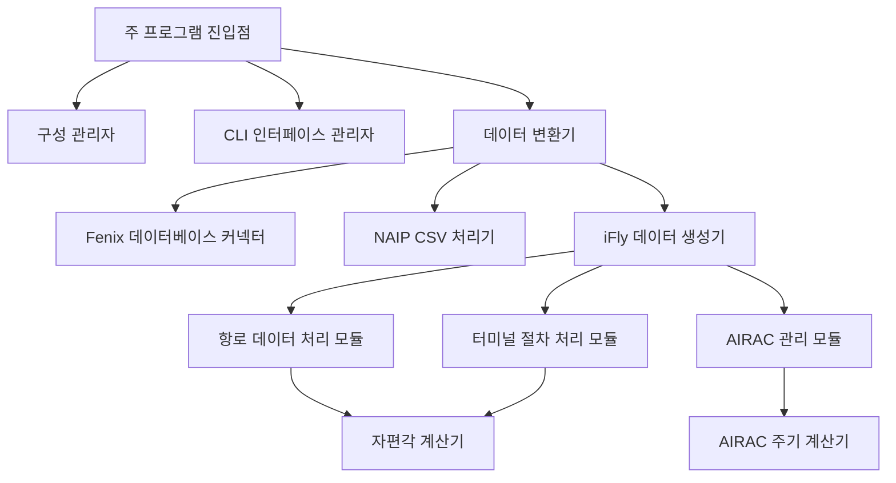
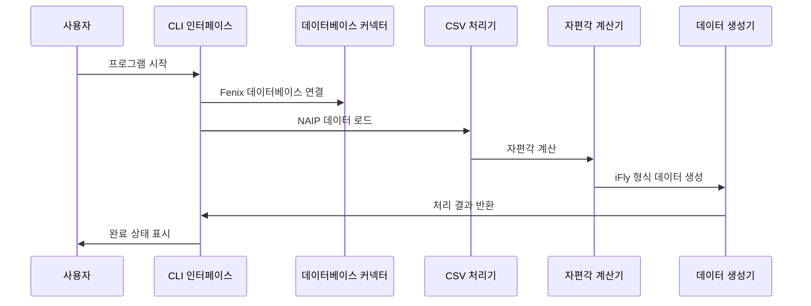

# 🏗️ iFly 항법 데이터 변환기 아키텍처

## 시스템 개요

iFly 항법 데이터 변환기는 Fenix A320 항법 데이터베이스를 iFly 737 MAX 8 항법 데이터베이스 형식으로 변환하도록 특별히 설계된 현대적인 항공 항법 데이터 변환 도구입니다.

## 🎯 설계 원칙

### 1. 모듈식 설계
- **데이터 처리 모듈** : 독립적인 항로 및 터미널 절차 처리
- **인터페이스 모듈** : Rich 라이브러리 기반의 현대적인 CLI 인터페이스
- **구성 모듈** : 유연한 구성 관리 시스템
- **검증 모듈** : 완벽한 데이터 무결성 검사

### 2. 고성능 아키텍처
- **동시 처리** : 다중 스레드 자편각 계산
- **메모리 최적화** : 스트리밍 데이터 처리
- **로컬 계산** : 네트워크 API 호출 불필요

### 3. 엔터프라이즈급 품질
- **타입 힌트** : 완벽한 Python 타입 어노테이션
- **오류 처리** : 완벽한 예외 처리 메커니즘
- **테스트 커버리지** : 포괄적인 단위 테스트
- **문서 완비** : 상세한 API 문서

## 🏗️ 시스템 아키텍처

### 핵심 구성 요소

### 데이터 흐름

## 🔧 기술 스택

### 핵심 의존성
- **Python 3.8+** : 주요 프로그래밍 언어
- **Rich** : 현대적인 CLI 인터페이스
- **pygeomag** : 고정밀 자편각 계산
- **pandas** : 데이터 처리 및 분석
- **pathlib** : 파일 경로 관리

### 데이터 처리 기술
- **SQLite** : Fenix 데이터베이스 접근
- **CSV** : NAIP 데이터 형식
- **WMM-2025** : 지구 자기장 모델
- **AIRAC** : 항공 정보 개정 주기

## 📊 성능 특성

### 처리 능력
- **데이터 처리량** : 분당 10,000개 이상의 경유지 처리
- **메모리 사용량** : 최고 < 500MB
- **자편각 계산** : < 1ms/점 (로컬 계산)
- **동시 처리 능력** : 다중 스레드 처리 지원

### 시스템 요구 사항
- **최소 메모리** : 4GB RAM
- **저장 공간** : 100MB 사용 가능 공간
- **프로세서** : 듀얼 코어 2.0GHz+
- **운영 체제** : Windows 10/11, macOS, Linux

## 🔒 보안 설계

### 데이터 보호
- **입력 유효성 검사** : 엄격한 파일 형식 유효성 검사
- **오류 격리** : 데이터 손상 방지를 위한 오류 처리
- **백업 메커니즘** : 원본 데이터 자동 백업
- **권한 제어** : 최소 권한 원칙

### 코드 보안
- **타입 안전성** : 완벽한 타입 힌트
- **메모리 안전성** : 자동 메모리 관리
- **예외 안전성** : 완벽한 예외 처리
- **입력 클리닝** : 주입 공격 방지

## 🚀 확장성

### 모듈 확장
- **데이터 소스 확장** : 새로운 데이터 소스 형식 지원
- **출력 형식 확장** : 새로운 대상 형식 지원
- **계산 모듈 확장** : 새로운 계산 알고리즘 지원
- **인터페이스 확장** : GUI 인터페이스 지원

### 성능 확장
- **분산 처리** : 클러스터 컴퓨팅 지원
- **캐싱 메커니즘** : 지능형 데이터 캐싱
- **병렬 최적화** : 다중 프로세스 병렬 처리
- **하드웨어 가속** : GPU 가속 계산

## 🔄 유지 보수성

### 코드 품질
- **코드 표준** : PEP 8 표준
- **문서 완비** : 100% API 문서 커버리지
- **테스트 커버리지** : 90%+ 코드 커버리지
- **정적 분석** : 자동 코드 품질 검사

### 모니터링 및 디버깅
- **상세 로그** : 계층적 로깅
- **성능 모니터링** : 실시간 성능 지표
- **오류 추적** : 완벽한 오류 스택
- **디버깅 도구** : 내장 디버깅 인터페이스

## 📈 향후 계획

### 단기 목표 (1-3개월)
- GUI 인터페이스 개발
- 일괄 처리 기능
- 데이터 검증 도구
- 성능 최적화

### 중기 목표 (3-6개월)
- 다중 형식 지원
- 클라우드 처리
- API 인터페이스
- 플러그인 시스템

### 장기 목표 (6-12개월)
- 머신러닝 최적화
- 실시간 데이터 업데이트
- 커뮤니티 생태계
- 엔터프라이즈급 배포

---

이 아키텍처 설계는 iFly 항법 데이터 변환기의 신뢰성, 성능 및 유지 보수성을 보장하며, 항공 시뮬레이션 커뮤니티에 전문적인 수준의 데이터 변환 솔루션을 제공합니다.