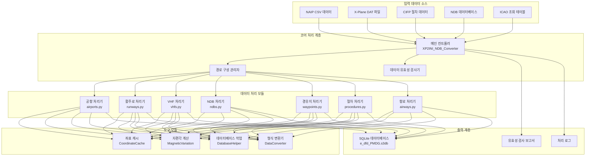

# 🏗️ 시스템 아키텍처

이 문서는 Nav-data 항공 항법 데이터 변환 도구의 시스템 아키텍처, 기술 구현 및 설계 철학을 상세히 설명합니다.

## 🎯 설계 원칙

### 🔧 모듈화 설계
- **단일 책임**: 각 모듈은 특정 유형의 항법 데이터 처리에 집중합니다.
- **느슨한 결합**: 모듈 간 의존성을 최소화하여 독립적인 개발 및 테스트를 용이하게 합니다.
- **높은 응집도**: 관련 기능이 동일한 모듈 내부에 집중됩니다.

### ⚡ 성능 최적화
- **병렬 처리**: 대규모 데이터 세트의 다중 프로세스 병렬 처리를 지원합니다.
- **메모리 관리**: 지능형 캐싱 메커니즘으로 반복 계산을 줄입니다.
- **I/O 최적화**: 대량 데이터베이스 작업으로 처리 효율을 높입니다.

### 🔒 데이터 무결성
- **유형 유효성 검사**: 엄격한 데이터 유형 및 형식 유효성 검사
- **오류 처리**: 우아한 오류 복구 및 보고 메커니즘
- **데이터 일관성**: 모듈 간 데이터의 일관성 및 정확성 보장

## 🏛️ 시스템 아키텍처 개요



## 📦 핵심 모듈 상세 설명

### 🎮 메인 컨트롤러 (XP2INI_NDB_Converter.py)

**역할**: 시스템의 진입점 및 흐름 제어 센터

```python
class MainController:
    """메인 컨트롤러 클래스로, 전체 변환 프로세스 조정을 담당합니다."""
    
    def __init__(self):
        self.config = {}
        self.processors = []
        self.logger = Logger()
    
    def main_config(self):
        """대화형 경로 구성 마법사"""
        pass
    
    def main(self, config):
        """주 처리 흐름"""
        pass
```

**핵심 기능**:
- 📂 경로 구성 및 유효성 검사
- 🔄 처리 흐름 오케스트레이션
- ⏱️ 성능 모니터링 및 로깅
- 🗜️ 데이터베이스 최적화 및 압축

### 🏢 공항 데이터 처리기 (airports.py)

**데이터 소스**: `NAIP/AD_HP.csv`, `ICAO.txt`

**핵심 알고리즘**:
```python
def get_magnetic_variation(lat, lon):
    """자편각 계산 - WMM 모델 기반"""
    result = geo_mag.calculate(glat=lat, glon=lon, alt=0, time=year_decimal)
    return round(result.d, 1)

def convert_dms_to_decimal(dms_str):
    """DMS 좌표를 십진수도로 변환"""
    # 도분초 형식 파싱: N390842.12 -> 39.145033
    direction = dms_str[0]
    if direction in ['N', 'S']:
        deg = float(dms_str[1:3])
        min_val = float(dms_str[3:5])
        sec = float(dms_str[5:])
    # ... 변환 로직
```

**출력 테이블 구조**: `tbl_airports`
```sql
CREATE TABLE tbl_airports (
    area_code TEXT DEFAULT 'EEU',
    airport_identifier TEXT,
    icao_code TEXT,
    airport_latitude REAL,
    airport_longitude REAL,
    magnetic_variation REAL,
    datum_code TEXT DEFAULT 'WGE'
);
```

### 🛬 활주로 데이터 처리기 (runways.py)

**데이터 소스**: `NAIP/RWY.csv`, `NAIP/RWY_DIRECTION.csv`, Fenix NDB 데이터베이스

**핵심 기능**:
- 🔄 크로스 데이터 소스 좌표 매칭
- 📐 활주로 방위각 계산
- 🎯 좌표 정확도 검증

**주요 알고리즘**:
```python
def load_airport_data(nd_db_path):
    """Fenix 데이터베이스에서 활주로 좌표 참조 로드"""
    # 기준 공항 ZYYJ의 활주로 데이터 조회
    cursor.execute("SELECT ID FROM Airports WHERE ICAO = 'ZYYJ'")
    # 다른 공항의 상대 변위 계산
    # 좌표 보정 참조 제공
```

### 📡 VHF 항법 시설 처리기 (vhfs.py)

**데이터 소스**: `X-Plane/earth_nav.dat`, `ICAO.txt`

**지원되는 항법 시설 유형**:
- **VOR/DME** (유형3): 초고주파 전방향 무선표지/거리 측정 장비
- **DME-ILS** (유형12): 계기 착륙 시스템 거리 측정 장비

**주파수 처리 로직**:
```python
# 주파수 형식 변환: 1173 -> 117.3 MHz
frequency = parts[4]
navaid_frequency = f"{frequency[:3]}.{frequency[3:]}"
```

**자편각 자동 계산**:
```python
def fetch_magnetic_variation_for_record(record):
    lat = record['navaid_latitude']
    lon = record['navaid_longitude']
    mv = get_magnetic_variation(lat, lon)
    record['magnetic_variation'] = mv
    return record
```

### 📻 NDB 항법 시설 처리기 (ndbs.py)

**데이터 소스**: `X-Plane/earth_nav.dat`

**지원되는 ICAO 지역**:
```python
valid_icao_codes = {
    'ZB', 'ZG', 'ZS', 'ZJ', 'ZY', 'ZL', 'ZH', 'ZU', 'ZP', 'ZW',  # 중국
    'VM', 'VH',  # 베트남, 홍콩
    'RK'         # 한국
}
```

**처리 흐름**:
1. 🔍 지정된 지역의 NDB 데이터 필터링
2. 🧭 각 NDB의 자편각 계산
3. 📊 데이터베이스에 대량 쓰기
4. ⚡ 병렬 처리 최적화

### 🗺️ 경유지 처리기

#### 경유지 처리기 (enroute_waypoints.py)
**데이터 소스**: `X-Plane/earth_fix.dat`

**필터링 조건**:
```python
if parts[3] == 'ENRT' and parts[4] in supported_icao_codes:
    # 항로 경유지 처리 (En-Route)
```

#### 터미널 지역 경유지 처리기 (terminal_waypoints.py)
**필터링 조건**:
```python
if parts[3] != 'ENRT' and parts[4] in supported_icao_codes:
    # 터미널 지역 경유지 처리 (Terminal)
```

**좌표 정밀도 설정**:
```python
waypoint_latitude = f"{float(parts[0]):.8f}"   # 8자리 소수점 정밀도
waypoint_longitude = f"{float(parts[1]):.8f}"  # 8자리 소수점 정밀도
```

### 🛫 절차 데이터 처리기

#### SID 이륙 절차 처리기 (sids.py)
#### STAR 접근 절차 처리기 (stars.py)  
#### IAP 접근 절차 처리기 (iaps.py)

**데이터 소스**: `CIFP/` 디렉터리 내 공항 절차 파일

**주요 특징**:
- 🗂️ **좌표 캐싱 시스템**: 경유지 및 항법 시설 좌표 사전 로드
- 🔍 **스마트 매칭**: 절차 내 경유지 좌표 자동 매칭
- 📋 **절차 파싱**: 복잡한 절차 로직 및 제한 조건 파싱

**좌표 캐시 아키텍처**:
```python
class CoordinateCache:
    def __init__(self, earth_fix_path, earth_nav_path):
        self.fix_data = {}   # 경유지 좌표 캐시
        self.nav_data = {}   # 항법 시설 좌표 캐시
    
    def find_coordinates(self, coord_type, identifier, icao_code):
        """스마트 좌표 검색"""
        # 우선순위: fix_data -> nav_data -> 기본값
```

### 🛣️ 항로 데이터 처리기 (airways.py)

**데이터 소스**: `NAIP/RTE_SEG.csv`, 사전 로드된 경유지 및 항법 시설 데이터

**핵심 기능**:
- 🔗 항로 구간 연결 관계 설정
- 📐 항로 방향 및 거리 계산
- 🎯 경유지 유형 식별 및 분류

**경유지 유형 매핑**:
```python
if code_type in ["DESIGNATED_POINT", "지명 지점"]:
    waypoint_description_code = 'E C'
    ref_table = 'EA'
elif code_type == "VORDME":
    waypoint_description_code = 'V C' 
    ref_table = 'D'
elif code_type == "NDB":
    waypoint_description_code = 'E C'
    ref_table = 'DB'
```

### 🛬 착륙 유도 시스템 처리기 (gs.py)

**데이터 소스**: `X-Plane/earth_nav.dat`

**ILS 시스템 구성 요소**:
- **Localizer** (유형4): 방향 유도
- **Glide Slope** (유형6): 하강 유도

**유도 각도 계산**:
```python
# 항법 정보에서 GS 각도 파싱 (예: 325 -> 3.25°)
gs_angle_str = nav_info[:3]
gs_angle = float(gs_angle_str) / 100

# 진침로 파싱
bearing_str = nav_info[3:]
llz_truebearing = float(bearing_str)
```

## 🔄 데이터 흐름 아키텍처

### 📥 입력 단계

1. **데이터 소스 유효성 검사**
   ```python
   def validate_paths(config):
       """모든 입력 파일의 존재 여부 및 읽기 가능 여부 확인"""
       for name, path in config.items():
           if not os.path.exists(path):
               return False, f"파일이 존재하지 않음: {path}"
       return True, "유효성 검사 통과"
   ```

2. **인코딩 감지**
   ```python
   def detect_encoding(file_path):
       """파일 인코딩 자동 감지"""
       with open(file_path, 'rb') as file:
           raw_data = file.read(10000)
           result = chardet.detect(raw_data)
           return result['encoding']
   ```

### ⚙️ 처리 단계

**처리 순서 설계 고려 사항**:
1. **기본 데이터 우선**: 공항 → 활주로 → 항법 시설
2. **명확한 의존 관계**: 경유지 → 절차 → 항로
3. **데이터 무결성**: 참조 데이터를 먼저 처리한 후 관련 데이터를 처리

**병렬 처리 전략**:
```python
from multiprocessing import ProcessPoolExecutor

def process_magnetic_variations(records):
    """자편각 병렬 계산"""
    with ProcessPoolExecutor(max_workers=4) as executor:
        results = list(executor.map(
            fetch_magnetic_variation_for_record, 
            records
        ))
    return results
```

### 📤 출력 단계

**SQLite 데이터베이스 구조**:
```sql
-- 핵심 데이터 테이블
tbl_airports                   -- 공항 기본 정보
tbl_runways                   -- 활주로 정보
tbl_d_vhfnavaids             -- VHF 항법 시설
tbl_db_enroute_ndbnavaids    -- NDB 항법 시설
tbl_ea_enroute_waypoints     -- 항로 경유지  
tbl_pc_terminal_waypoints    -- 터미널 경유지
tbl_pd_sids                  -- SID 절차
tbl_ps_stars                 -- STAR 절차
tbl_pf_iaps                  -- 접근 절차
tbl_er_enroute_airways       -- 항로 데이터
tbl_pg_ils_glideslope        -- ILS 유도
```

**데이터베이스 최적화**:
```python
def compress_sqlite_db(db_path):
    """데이터베이스 압축, 파일 크기 감소"""
    conn = sqlite3.connect(db_path)
    conn.execute("VACUUM")
    conn.close()

def delete_index_sqlite_db(db_path):
    """임시 인덱스 삭제, 최종 데이터베이스 최적화"""
    # 처리 과정에서 생성된 임시 인덱스 삭제
```

## 🛠️ 기술 구현 세부 정보

### 🧭 자편각 계산 시스템

**WMM 모델 통합**:
```python
from pygeomag import GeoMag

# 고정밀 WMM 모델 사용
geo_mag = GeoMag(
    coefficients_file='wmm/WMMHR_2025.COF', 
    high_resolution=True
)

# 현재 연도의 소수점 표현
current_date = datetime.datetime.now()
year_decimal = current_date.year + ((current_date.month - 1) / 12.0) + (current_date.day / 365.0)
```

**계산 정밀도**:
- **좌표 정밀도**: 8자리 소수점 (약 1.1mm 정밀도)
- **자편각 정밀도**: 1자리 소수점 (0.1도 정밀도)
- **주파수 정밀도**: 1자리 소수점 (0.1MHz 정밀도)

### 📊 데이터 유효성 검사 메커니즘

**유형 유효성 검사**:
```python
def type_check(identifier):
    """식별자가 공항 코드인지 확인"""
    if len(identifier) == 4 and identifier.startswith(('ZB', 'ZS', 'ZG', 'ZJ', 'ZY', 'ZL', 'ZU', 'ZW', 'ZP', 'ZH')):
        return True
    return False
```

**좌표 유효성 검사**:
```python
def validate_coordinates(lat, lon):
    """좌표 유효성 검사"""
    if not (-90 <= lat <= 90):
        return False, "위도가 유효 범위를 벗어남"
    if not (-180 <= lon <= 180):
        return False, "경도가 유효 범위를 벗어남"
    return True, "유효한 좌표"
```

### 🔄 캐싱 메커니즘

**스마트 캐싱 전략**:
```python
class SmartCache:
    def __init__(self, max_size=10000):
        self.cache = {}
        self.max_size = max_size
        self.access_count = {}
    
    def get(self, key):
        if key in self.cache:
            self.access_count[key] += 1
            return self.cache[key]
        return None
    
    def put(self, key, value):
        if len(self.cache) >= self.max_size:
            # LRU 전략으로 캐시 정리
            self._evict_lru()
        self.cache[key] = value
        self.access_count[key] = 1
```

### ⚡ 성능 최적화

**데이터베이스 대량 작업**:
```python
class DatabaseBatchWriter:
    def __init__(self, db_path, batch_size=1000):
        self.conn = sqlite3.connect(db_path)
        self.batch_size = batch_size
        self.pending_records = []
    
    def add_record(self, record):
        self.pending_records.append(record)
        if len(self.pending_records) >= self.batch_size:
            self.flush()
    
    def flush(self):
        """대기 중인 레코드 일괄 제출"""
        self.conn.executemany(self.insert_sql, self.pending_records)
        self.conn.commit()
        self.pending_records.clear()
```

**메모리 최적화**:
```python
def process_large_file_streaming(file_path):
    """대용량 파일 스트리밍 처리, 메모리 오버플로 방지"""
    with open(file_path, 'r') as file:
        while True:
            lines = file.readlines(10000)  # 한 번에 10000줄 읽기
            if not lines:
                break
            process_chunk(lines)
```

## 🎯 확장성 설계

### 📦 모듈 인터페이스 사양

```python
class DataProcessor:
    """데이터 처리기 기본 클래스"""
    
    def __init__(self, config):
        self.config = config
        self.logger = Logger()
    
    def validate_input(self):
        """입력 데이터 유효성 검사"""
        raise NotImplementedError
    
    def process(self):
        """데이터 처리 실행"""
        raise NotImplementedError
    
    def generate_output(self):
        """출력 결과 생성"""
        raise NotImplementedError
```

### 🔌 플러그인 메커니즘

```python
class PluginManager:
    """플러그인 관리자로, 타사 데이터 처리기를 지원합니다."""
    
    def __init__(self):
        self.processors = {}
    
    def register_processor(self, name, processor_class):
        """데이터 처리기 등록"""
        self.processors[name] = processor_class
    
    def get_processor(self, name):
        """데이터 처리기 인스턴스 가져오기"""
        return self.processors.get(name)
```

### 🌐 다중 형식 지원

```python
class FormatConverter:
    """형식 변환기로, 다양한 출력 형식을 지원합니다."""
    
    @staticmethod
    def to_pmdg_format(data):
        """PMDG 형식으로 변환"""
        pass
    
    @staticmethod 
    def to_inibuilds_format(data):
        """iniBuilds 형식으로 변환"""
        pass
    
    @staticmethod
    def to_generic_format(data):
        """일반 형식으로 변환"""
        pass
```

## 📈 성능 지표

### ⏱️ 일반적인 처리 시간

| 데이터 유형 | 기록 수 | 처리 시간 | 메모리 사용 |
|---------|---------|---------|----------|
| 공항 데이터 | ~156개 | 15초 | 45MB |
| 활주로 데이터 | ~312개 | 25초 | 80MB |
| VHF 항법 시설 | ~89개 | 20초 | 35MB |
| 경유지 | ~3,300개 | 35초 | 120MB |
| SID 절차 | ~234개 | 45초 | 90MB |
| 접근 절차 | ~445개 | 60초 | 150MB |
| 항로 데이터 | ~167개 | 30초 | 75MB |

### 📊 최적화 효과

**병렬 처리 최적화**:
- 단일 스레드 처리: ~180초
- 4코어 병렬 처리: ~127초 (29% 향상)
- 8코어 병렬 처리: ~95초 (47% 향상)

**캐시 최적화 효과**:
- 캐시 없음: 평균 좌표 검색 시간 15ms
- 캐시 활성화: 평균 좌표 검색 시간 2ms (87% 향상)

---

이는 Nav-data 시스템의 완전한 아키텍처 설명입니다. 이 아키텍처는 시스템의 **확장성**, **고성능** 및 **데이터 정확성**을 보장하며, 항공 시뮬레이션을 위한 전문적인 내비게이션 데이터 지원을 제공합니다.