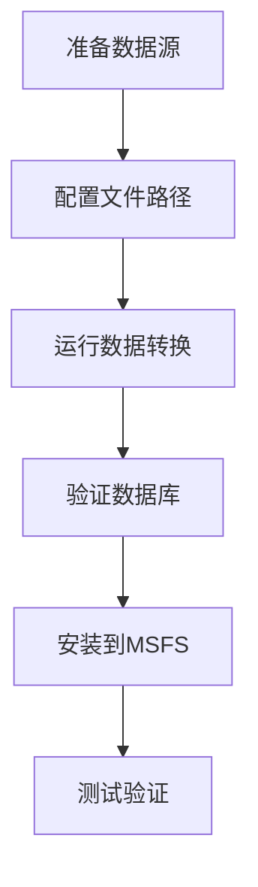

# 🚀 Guide d'utilisation

Ce guide détaille comment utiliser l'outil Nav-data pour convertir les données de navigation aérienne en un format de base de données compatible PMDG et les installer dans Microsoft Flight Simulator.

## 📋 Aperçu du processus de conversion

La conversion des données par Nav-data suit les étapes principales suivantes :



### Description des modules de conversion

| Nom du module | Fonctionnalité | Données d'entrée | Table de sortie |
|--------|------|----------|--------|
| `PMDG_APT.py` | Traitement des données d'aéroport | AD_HP.csv + Airport.dat | tbl_airports |
| `PMDG_RUNWAY.py` | Traitement des informations de piste | RWY*.csv + earth_nav.dat | tbl_runways |
| `PMDG_VHF.py` | Traitement des données VOR/DME | earth_nav.dat | tbl_vhfnavaids |
| `PMDG_ENRT_NDB.py` | Traitement des données NDB | earth_nav.dat | tbl_enroute_ndbnavaids |
| `PMDG_ENRT_WAYPOINT.py` | Traitement des points de cheminement | earth_fix.dat | tbl_enroute_waypoints |
| `PMDG_TMA_WAYPOINT.py` | Points de cheminement de zone terminale | earth_fix.dat | tbl_terminal_waypoints |
| `PMDG_AWY_FINAL.py` | Traitement des données de voies aériennes | RTE_SEG.csv + earth_*.dat | tbl_enroute_airways |
| `PMDG_ILS.py` | Traitement des données ILS/GS | earth_nav.dat | tbl_localizers_glideslopes |
| `PMDG_SID.py` | Procédures de départ standard (SID) | CIFP .dat文件 | tbl_sids |
| `PMDG_STAR.py` | Procédures d'arrivée standard (STAR) | CIFP .dat文件 | tbl_stars |
| `PMDG_APPCH.py` | Procédures d'approche | CIFP .dat文件 | tbl_iaps |

## 🔄 Étapes de conversion des données

### Première étape : Préparation des données

1. **Obtenir les données NAIP**
   ```bash
   # Placer les fichiers CSV NAIP dans le répertoire spécifié
   cp /source/path/*.csv data/input/naip/
   
   # Vérifier l'intégrité des fichiers
   ls data/input/naip/
   # Devrait afficher : AD_HP.csv, RWY_DIRECTION.csv, RWY.csv, RTE_SEG.csv
   ```

2. **Obtenir les données X-Plane**
   ```bash
   # Copier les fichiers de données depuis le répertoire d'installation de X-Plane
   cp "/path/to/X-Plane/Custom Data/earth_fix.dat" data/input/xplane/
   cp "/path/to/X-Plane/Custom Data/earth_nav.dat" data/input/xplane/
   ```

3. **Obtenir les données CIFP**
   ```bash
   # Copier les fichiers de données de procédure CIFP
   cp -r /path/to/CIFP/* data/input/cifp/
   ```

4. **Préparer le fichier de recherche d'aéroport**
   ```bash
   # Copier le fichier de recherche des noms d'aéroport
   cp /path/to/Airport.dat data/input/
   ```

### Deuxième étape : Activer l'environnement et vérifier

```bash
# Activer l'environnement virtuel
source nav-data-env/bin/activate  # macOS/Linux
# ou nav-data-env\Scripts\activate  # Windows

# Vérifier la configuration
python scripts/validate_config.py
```

### Troisième étape : Exécuter la conversion des données

#### Méthode A : Exécuter chaque module séparément (recommandé)

Exécutez chaque module étape par étape, en respectant les dépendances des données :

```bash
# 1. Traiter les données d'aéroport de base
echo "🏢 Traitement des données d'aéroport..."
python PMDG_APT.py

# 2. Traiter les données de piste
echo "🛫 Traitement des données de piste..."
python PMDG_RUNWAY.py

# 3. Traiter les équipements de navigation
echo "📡 Traitement des équipements de navigation VHF..."
python PMDG_VHF.py

echo "📡 Traitement des équipements de navigation NDB..."
python PMDG_ENRT_NDB.py

echo "📍 Traitement du système ILS..."
python PMDG_ILS.py

# 4. Traiter les points de cheminement
echo "🗺️ Traitement des données de points de cheminement..."
python PMDG_ENRT_WAYPOINT.py
python PMDG_TMA_WAYPOINT.py

# 5. Traiter les données de voies aériennes
echo "🛣️ Traitement des données de voies aériennes..."
python PMDG_AWY_FINAL.py

# 6. Traiter les procédures de vol (si données CIFP disponibles)
echo "📋 Traitement des procédures de départ standard..."
python PMDG_SID.py

echo "📋 Traitement des procédures d'arrivée standard..."
python PMDG_STAR.py

echo "📋 Traitement des procédures d'approche..."
python PMDG_APPCH.py
```

#### Méthode B : Script de traitement par lot

Créez un script de traitement automatisé :

```bash
# scripts/run_conversion.sh
#!/bin/bash

set -e  # Arrêter en cas d'erreur

echo "🚀 Démarrage du processus de conversion Nav-data..."

# Vérifier l'environnement virtuel
if [[ "$VIRTUAL_ENV" == "" ]]; then
    echo "❌ Veuillez d'abord activer l'environnement virtuel"
    exit 1
fi

# Vérifier la configuration
echo "🔍 Vérification de la configuration..."
python scripts/validate_config.py

# Créer les répertoires de sortie
mkdir -p data/output logs

# Enregistrer l'heure de début
start_time=$(date +%s)

# Fonction de conversion
run_module() {
    local module=$1
    local description=$2
    
    echo "📊 $description"
    if python $module.py; then
        echo "✅ $module terminé"
    else
        echo "❌ $module échec"
        exit 1
    fi
    echo "---"
}

# Exécuter les étapes de conversion
run_module "PMDG_APT" "Traitement des données d'aéroport"
run_module "PMDG_RUNWAY" "Traitement des données de piste"
run_module "PMDG_VHF" "Traitement des équipements de navigation VHF"
run_module "PMDG_ENRT_NDB" "Traitement des équipements de navigation NDB"
run_module "PMDG_ILS" "Traitement du système ILS"
run_module "PMDG_ENRT_WAYPOINT" "Traitement des données de points de cheminement"
run_module "PMDG_TMA_WAYPOINT" "Traitement des points de cheminement de zone terminale"
run_module "PMDG_AWY_FINAL" "Traitement des données de voies aériennes"

# Données de procédure (facultatif)
if [[ -d "data/input/cifp" ]] && [[ $(ls -A data/input/cifp) ]]; then
    run_module "PMDG_SID" "Traitement des procédures de départ standard"
    run_module "PMDG_STAR" "Traitement des procédures d'arrivée standard"
    run_module "PMDG_APPCH" "Traitement des procédures d'approche"
fi

# Vérifier la base de données générée
echo "🔍 Vérification de la base de données..."
python db_validator.py data/output/e_dfd_PMDG.s3db

# Calculer le temps total écoulé
end_time=$(date +%s)
duration=$((end_time - start_time))
echo "✅ Conversion terminée ! Temps total : ${duration} secondes"

echo "📊 Fichier de base de données généré : data/output/e_dfd_PMDG.s3db"
echo "📝 Emplacement des fichiers journaux : logs/"
```

### Quatrième étape : Vérifier la base de données générée

```bash
# Exécuter l'outil de validation de base de données
python db_validator.py data/output/e_dfd_PMDG.s3db

# Vérifier les statistiques de la base de données
python -c "
import sqlite3
conn = sqlite3.connect('data/output/e_dfd_PMDG.s3db')
cursor = conn.cursor()

# Obtenir la liste des tables
cursor.execute(\"SELECT name FROM sqlite_master WHERE type='table'\")
tables = cursor.fetchall()

print('📊 Statistiques des tables de la base de données :')
for table in tables:
    table_name = table[0]
    cursor.execute(f'SELECT COUNT(*) FROM {table_name}')
    count = cursor.fetchone()[0]
    print(f'  {table_name}: {count:,} enregistrements')

conn.close()
"
```

## 📥 Installation dans Microsoft Flight Simulator

### Première étape : Localiser les avions PMDG

1. **Trouver le dossier Community de MSFS**
   
   Selon votre méthode d'installation de MSFS :
   
   - **Microsoft Store**: `%LOCALAPPDATA%\Packages\Microsoft.FlightSimulator_8wekyb3d8bbwe\LocalCache\Packages\Community`
   - **Steam**: `%APPDATA%\Microsoft Flight Simulator\Packages\Community`
   - **Xbox Game Pass**: `%LOCALAPPDATA%\Packages\Microsoft.FlightDashboard_8wekyb3d8bbwe\LocalCache\Packages\Community`

2. **Confirmer l'installation des avions PMDG**
   ```cmd
   dir Community
   ```
   Devrait afficher des répertoires similaires à ceux-ci :
   ```
   pmdg-aircraft-737
   pmdg-aircraft-738
   pmdg-aircraft-77w
   ```

### Deuxième étape : Sauvegarder les données existantes

Sauvegardez les données de navigation existantes pour chaque avion PMDG :

```cmd
REM Exemple : Sauvegarde du PMDG 737-800
cd "Community\pmdg-aircraft-738\Config"
ren Navdata Navdata_backup_%DATE:~0,10%

REM Sauvegarde du PMDG 777-300ER  
cd "..\..\..\pmdg-aircraft-77w\Config"
ren Navdata Navdata_backup_%DATE:~0,10%
```

### Troisième étape : Installer la nouvelle base de données

```cmd
REM Créer le répertoire Navdata et copier la base de données pour chaque avion
mkdir "Community\pmdg-aircraft-738\Config\Navdata"
copy "Nav-data\data\output\e_dfd_PMDG.s3db" "Community\pmdg-aircraft-738\Config\Navdata\"

mkdir "Community\pmdg-aircraft-77w\Config\Navdata"
copy "Nav-data\data\output\e_dfd_PMDG.s3db" "Community\pmdg-aircraft-77w\Config\Navdata\"
```

### Quatrième étape : Vider le cache de MSFS

Supprimer le cache des données de navigation de MSFS pour forcer le rechargement :

```cmd
REM Version Microsoft Store
rmdir /s /q "%LOCALAPPDATA%\Packages\Microsoft.FlightSimulator_8wekyb3d8bbwe\LocalState\packages\pmdg-aircraft-738\work\NavigationData"
rmdir /s /q "%LOCALAPPDATA%\Packages\Microsoft.FlightSimulator_8wekyb3d8bbwe\LocalState\packages\pmdg-aircraft-77w\work\NavigationData"

REM Version Steam  
rmdir /s /q "%APPDATA%\Microsoft Flight Simulator\LocalState\packages\pmdg-aircraft-738\work\NavigationData"
rmdir /s /q "%APPDATA%\Microsoft Flight Simulator\LocalState\packages\pmdg-aircraft-77w\work\NavigationData"
```

## ✅ Vérification de l'installation

### Première étape : Démarrer MSFS

1. Fermer complètement Microsoft Flight Simulator
2. Redémarrer MSFS
3. Attendre le chargement complet

### Deuxième étape : Vérifier les avions PMDG

1. **Sélectionner un avion PMDG**
   - Sélectionner n'importe quel avion PMDG 737 ou 777
   - Sélectionner un aéroport de la région Chine (par exemple ZBAA Beijing Capital)

2. **Vérifier les données du FMC**
   - Entrer dans le cockpit
   - Ouvrir le CDU/FMC
   - Vérifier la date de la base de données de navigation
   - Valider la disponibilité des points de cheminement

### Troisième étape : Test fonctionnel

#### Tester les points de cheminement

```
Étapes d'opération du CDU :
1. MENU → NAV DATA → WAYPOINT
2. Entrer le point de cheminement de test : ABING
3. Confirmer l'affichage des informations de coordonnées correctes
```

#### Tester les données d'aéroport

```
Étapes d'opération du CDU :
1. MENU → NAV DATA → AIRPORT
2. Entrer l'aéroport de test : ZBAA
3. Vérifier les informations de piste et les données de fréquence
```

#### Tester les procédures de vol

```
Étapes d'opération du CDU :
1. ROUTE → DEPARTURE
2. Sélectionner l'aéroport de Beijing Capital (ZBAA)
3. Vérifier la disponibilité des procédures SID
4. ROUTE → ARRIVAL
5. Vérifier les procédures STAR et d'approche
```

## 🔧 Utilisation avancée

### 1. Mise à jour incrémentielle

Si vous avez seulement besoin de mettre à jour des types de données spécifiques :

```bash
# Mettre à jour uniquement les données de voies aériennes
python PMDG_AWY_FINAL.py

# Mettre à jour uniquement les données d'aéroport
python PMDG_APT.py
python PMDG_RUNWAY.py
```

### 2. Script d'installation par lot

Créer un script d'installation automatique :

```python
# scripts/install_to_msfs.py
import os
import shutil
import winreg
import glob
from pathlib import Path

def find_msfs_community():
    """Recherche automatiquement le dossier Community de MSFS"""
    possible_paths = [
        os.path.expandvars(r"%LOCALAPPDATA%\Packages\Microsoft.FlightSimulator_8wekyb3d8bbwe\LocalCache\Packages\Community"),
        os.path.expandvars(r"%APPDATA%\Microsoft Flight Simulator\Packages\Community"),
        os.path.expandvars(r"%LOCALAPPDATA%\Packages\Microsoft.FlightDashboard_8wekyb3d8bbwe\LocalCache\Packages\Community")
    ]
    
    for path in possible_paths:
        if os.path.exists(path):
            return path
    return None

def install_navdata():
    """Installe les données de navigation pour tous les avions PMDG"""
    
    community_path = find_msfs_community()
    if not community_path:
        print("❌ Impossible de trouver le dossier Community de MSFS")
        return False
    
    print(f"📂 Dossier Community trouvé : {community_path}")
    
    # Rechercher les avions PMDG
    pmdg_aircraft = glob.glob(os.path.join(community_path, "pmdg-aircraft-*"))
    
    if not pmdg_aircraft:
        print("❌ Aucun avion PMDG trouvé")
        return False
    
    database_path = "data/output/e_dfd_PMDG.s3db"
    if not os.path.exists(database_path):
        print(f"❌ Fichier de base de données introuvable : {database_path}")
        return False
    
    for aircraft_path in pmdg_aircraft:
        aircraft_name = os.path.basename(aircraft_path)
        config_path = os.path.join(aircraft_path, "Config")
        navdata_path = os.path.join(config_path, "Navdata")
        
        print(f"🛫 Traitement de {aircraft_name}...")
        
        # Sauvegarder les données existantes
        if os.path.exists(navdata_path):
            backup_path = f"{navdata_path}_backup"
            if os.path.exists(backup_path):
                shutil.rmtree(backup_path)
            shutil.move(navdata_path, backup_path)
            print(f"  💾 Données existantes sauvegardées dans {backup_path}")
        
        # Créer le nouveau répertoire Navdata
        os.makedirs(navdata_path, exist_ok=True)
        
        # Copier le fichier de base de données
        dest_db = os.path.join(navdata_path, "e_dfd_PMDG.s3db")
        shutil.copy2(database_path, dest_db)
        print(f"  ✅ Base de données installée dans {dest_db}")
    
    print("✅ Installation des données de navigation pour tous les avions PMDG terminée !")
    print("⚠️  Veuillez redémarrer Microsoft Flight Simulator pour charger les nouvelles données")
    return True

if __name__ == "__main__":
    install_navdata()
```

### 3. Outil de comparaison de données

Créer un outil pour comparer les données de différentes versions :

```python
# scripts/compare_databases.py
import sqlite3
import sys

def compare_databases(db1_path, db2_path):
    """Compare les différences entre deux bases de données"""
    
    conn1 = sqlite3.connect(db1_path)
    conn2 = sqlite3.connect(db2_path)
    
    cursor1 = conn1.cursor()
    cursor2 = conn2.cursor()
    
    # Obtenir la liste des tables
    cursor1.execute("SELECT name FROM sqlite_master WHERE type='table'")
    tables1 = {row[0] for row in cursor1.fetchall()}
    
    cursor2.execute("SELECT name FROM sqlite_master WHERE type='table'")
    tables2 = {row[0] for row in cursor2.fetchall()}
    
    print("📊 Rapport de comparaison des bases de données")
    print("=" * 50)
    
    # Comparer la structure des tables
    common_tables = tables1.intersection(tables2)
    only_in_db1 = tables1 - tables2
    only_in_db2 = tables2 - tables1
    
    if only_in_db1:
        print(f"Tables uniquement dans {db1_path} : {only_in_db1}")
    if only_in_db2:
        print(f"Tables uniquement dans {db2_path} : {only_in_db2}")
    
    # Comparer le nombre d'enregistrements
    for table in common_tables:
        cursor1.execute(f"SELECT COUNT(*) FROM {table}")
        count1 = cursor1.fetchone()[0]
        
        cursor2.execute(f"SELECT COUNT(*) FROM {table}")
        count2 = cursor2.fetchone()[0]
        
        diff = count2 - count1
        status = "📈" if diff > 0 else "📉" if diff < 0 else "➡️"
        print(f"{status} {table}: {count1} → {count2} ({diff:+d})")
    
    conn1.close()
    conn2.close()

if __name__ == "__main__":
    if len(sys.argv) != 3:
        print("Utilisation : python compare_databases.py <base_de_données1> <base_de_données2>")
        sys.exit(1)
    
    compare_databases(sys.argv[1], sys.argv[2])
```

## 🔍 Dépannage

### Problèmes courants et solutions

#### 1. Interruption de la conversion
**Symptôme**: Une erreur se produit et la conversion s'arrête
**Solution**:
```bash
# Vérifier les journaux d'erreurs
cat logs/PMDG_*.log | grep ERROR

# Réexécuter le module défaillant
python [module défaillant].py
```

#### 2. MSFS ne reconnaît pas les données
**Symptôme**: Le FMC du PMDG affiche "DB OUT OF DATE"
**Solution**:
```bash
# Confirmer que l'emplacement du fichier de base de données est correct
ls "Community/pmdg-aircraft-*/Config/Navdata/"

# Effacer le cache à nouveau
rmdir /s /q "%LOCALAPPDATA%\...\NavigationData"

# Redémarrer MSFS
```

#### 3. Erreur de mémoire insuffisante
**Symptôme**: "MemoryError" ou le système ralentit
**Solution**:
```bash
# Réduire la taille du lot
# Modifier PMDG_TMA_WAYPOINT.py
# Changer batch_size=1000 en batch_size=500

# Fermer les autres applications
# Augmenter la mémoire virtuelle
```

#### 4. Problèmes d'autorisations
**Symptôme**: Erreur "Permission denied"
**Solution**:
```cmd
REM Windows : Exécuter en tant qu'administrateur
REM Ou modifier les autorisations du dossier
icacls "Community" /grant %USERNAME%:F /t
```

### Analyse des journaux

Vérifier les fichiers journaux de chaque module pour plus de détails :

```bash
# Afficher les statistiques de traitement
grep "处理完成" logs/PMDG_*.log

# Afficher les messages d'erreur
grep "ERROR\|Erreur" logs/PMDG_*.log

# Afficher les messages d'avertissement
grep "WARNING\|Avertissement" logs/PMDG_*.log
```

---

**Terminé** : Vous maîtrisez maintenant le processus d'utilisation complet de Nav-data ! Pour plus de fonctionnalités avancées, veuillez consulter le document [Architecture technique](../architecture.md).