# 🏗️ TFDI Navigationsdatenkonverter-Architektur

## Systemübersicht

Der TFDI Navigationsdatenkonverter ist ein professionelles Tool zur Konvertierung von Luftfahrt-Navigationsdaten, speziell entwickelt, um die Navigationsdatenbank des Fenix A320 in das TFDI MD-11-kompatible JSON-Format zu konvertieren. Dieses Tool verfügt über ein modernes Architekturdesign und bietet effiziente und zuverlässige Datenkonvertierungsdienste.

## 🎯 Designprinzipien

### 1. Priorität: Datenintegrität
- **Strenge Validierung**: Mehrschichtige Datenvalidierungsmechanismen
- **Beibehaltung von Beziehungen**: Pflege der Abhängigkeiten zwischen Navigationsdaten
- **Präzisionsgarantie**: Aufrechterhaltung hoher Genauigkeit bei Koordinaten und Berechnungen
- **Konsistenzprüfung**: Sicherstellung der logischen Konsistenz der konvertierten Daten

### 2. Performance-Optimierung
- **SQLite-Optimierung**: WAL-Modus und Performance-Tuning
- **Stapelverarbeitung**: Speichereffiziente Strategien für die Stapelverarbeitung
- **Caching-Mechanismus**: Intelligentes Daten-Caching und Wiederverwendung
- **Komprimierungsoptimierung**: Schnelle 7z-Komprimierung und Bereinigung

### 3. Höchste Priorität: Benutzererfahrung
- **Rich CLI**: Moderne Farbsterminal-Oberfläche
- **Echtzeit-Feedback**: Detaillierte Fortschrittsanzeige und Statusaktualisierungen
- **Benutzerfreundliche Hinweise**: Professionelle Fehlerbehandlung und Wiederherstellungsvorschläge
- **Interaktives Design**: Intuitive Führung durch den Bedienungsablauf

## 🏗️ Systemarchitektur

### Gesamtarchitekturdiagramm

```mermaid
graph TB
    A[Benutzeroberflächenschicht] --> B[Geschäftslogikschicht]
    B --> C[Datenverarbeitungsschicht]
    C --> D[Speicherzugriffsschicht]
    
    A --> A1[Rich CLI-Oberfläche]
    A --> A2[Fortschrittsmanager]
    A --> A3[Benutzerinteraktion]
    
    B --> B1[Konvertierungscontroller]
    B --> B2[Konfigurationsmanager]
    B --> B3[Validierungs-Engine]
    B --> B4[FAF-Detektor]
    
    C --> C1[SQLite-Prozessor]
    C --> C2[Koordinatenstandardisierer]
    C --> C3[JSON-Serialisierer]
    C --> C4[Komprimierungsmanager]
    
    D --> D1[Fenix-Datenbank]
    D --> D2[JSON-Dateien]
    D --> D3[7z-Komprimierungspaket]
```



### Detaillierte Erläuterung der Kernkomponenten

#### 1. Benutzeroberflächenschicht (UI Layer)
**Verantwortlichkeiten**: Bereitstellung der Benutzerinteraktionsschnittstelle und des Feedbacks
```python
class RichInterface:
    """Rich CLI-Schnittstellenmanager"""
    - progress_tracking: Fortschrittsbalkenverwaltung
    - status_display: Anzeige der Statusinformationen
    - error_presentation: Anzeige der Fehlermeldungen
    - user_input: Verarbeitung von Benutzereingaben
```

#### 2. Geschäftslogikschicht (Business Layer)
**Verantwortlichkeiten**: Kern-Geschäftslogik und Prozesssteuerung
```python
class FenixToTFDIConverter:
    """Hauptkonverterklasse"""
    - database_validation: Datenbankvalidierung
    - conversion_orchestration: Orchestrierung des Konvertierungsablaufs
    - faf_detection: FAF-Punkterkennung
    - data_normalization: Datenstandardisierung
```

#### 3. Datenverarbeitungsschicht (Data Layer)
**Verantwortlichkeiten**: Datenkonvertierungs- und Verarbeitungsalgorithmen
```python
class DataProcessor:
    """Kern der Datenverarbeitung"""
    - coordinate_precision: Verarbeitung der Koordinatenpräzision
    - column_standardization: Standardisierung der Spaltennamen
    - relationship_mapping: Beziehungsmapping
    - format_conversion: Formatkonvertierung
```

#### 4. Speicherzugriffsschicht (Storage Layer)
**Verantwortlichkeiten**: Datenbankzugriff und Dateivorgänge
```python
class StorageManager:
    """Speichermanager"""
    - sqlite_optimization: SQLite-Performance-Optimierung
    - file_operations: Datei-Lese- und Schreibvorgänge
    - compression_handling: Verarbeitung von komprimierten Dateien
    - backup_management: Backup-Verwaltung
```

## 📊 Datenflussarchitektur

### Konvertierungspipeline

```mermaid
sequenceDiagram
    participant U as Benutzer
    participant UI as Oberfläche
    participant BL as Geschäftsebene
    participant DL as Datenebene
    participant SL as Speicherebene
    
    U->>UI: Konvertierung starten
    UI->>BL: Konverter initialisieren
    BL->>SL: Datenbank validieren
    SL->>BL: Validierungsergebnis zurückgeben
    BL->>DL: Datenverarbeitung starten
    
    loop Jede Datentabelle
        DL->>SL: Daten lesen
        DL->>DL: Standardisierte Verarbeitung
        DL->>DL: Koordinatenpräzision anpassen
        DL->>SL: JSON schreiben
        DL->>UI: Fortschritt aktualisieren
    end
    
    DL->>BL: Verarbeitung abgeschlossen
    BL->>SL: Komprimierungspaket erstellen
    SL->>UI: Ergebnis zurückgeben
    UI->>U: Abschlussstatus anzeigen
```



### Datenmapping-Architektur


## 🔧 Technologie-Stack

### Kerntechnologien

| Komponente | Technologieauswahl | Versionsanforderung | Zweck |
|------|----------|----------|------|
| **Python** | Python 3.8+ | ≥ 3.8.0 | Hauptprogrammiersprache |
| **Rich** | Rich Library | ≥ 12.0.0 | CLI-Oberflächenverschönerung |
| **SQLite3** | Integriertes Modul | Python integriert | Datenbankzugriff |
| **Pandas** | DataFrame | ≥ 1.3.0 | Datenverarbeitung |
| **JSON** | Integriertes Modul | Python integriert | Datenserialisierung |
| **py7zr** | 7-Zip Python | ≥ 0.18.0 | Komprimierungsverarbeitung |

### Architekturmerkmale

#### 1. Modulares Design
```python
fenix_to_tfdi/
├── core/                  # Kernmodule
│   ├── converter.py       # Hauptkonverter
│   ├── validator.py       # Datenvalidator
│   └── config.py         # Konfigurationsverwaltung
├── data/                  # Datenverarbeitung
│   ├── processor.py       # Datenprozessor
│   ├── normalizer.py      # Standardisierungstool
│   └── serializer.py     # Serialisierungstool
├── ui/                    # Benutzeroberfläche
│   ├── cli.py            # Befehlszeilenoberfläche
│   └── progress.py       # Fortschrittsverwaltung
└── utils/                 # Hilfsmodule
    ├── storage.py        # Speichertool
    └── compression.py    # Komprimierungstool
```

#### 2. Konfigurationsgesteuerte Architektur
```python
@dataclass
class ConverterConfig:
    """Konverter-Konfigurationsklasse"""
    output_dir: str = "Primary"
    procedure_legs_dir: str = "Primary/ProcedureLegs"
    archive_name: str = "Primary.7z"
    coordinate_precision: int = 8
    vnav_threshold: float = 2.5
    
    # SQLite-Optimierungskonfiguration
    sqlite_pragmas: Dict[str, str] = field(default_factory=lambda: {
        "journal_mode": "WAL",
        "synchronous": "NORMAL",
        "cache_size": "10000",
        "temp_store": "MEMORY"
    })
```

## 🚀 Performance-Architektur

### Speicherverwaltungsstrategien

#### 1. Streaming-Verarbeitung
```python
def process_large_table(table_name: str, batch_size: int = 1000):
    """Streaming-Verarbeitung großer Tabellendaten"""
    offset = 0
    while True:
        query = f"""
        SELECT * FROM {table_name} 
        LIMIT {batch_size} OFFSET {offset}
        """
        
        batch = execute_query(query)
        if not batch:
            break
            
        process_batch(batch)
        offset += batch_size
```

#### 2. Cache-Optimierung
```python
class WaypointCache:
    """Wegpunkt-Cache-Verwaltung"""
    def __init__(self, max_size: int = 10000):
        self._cache: Dict[str, WaypointData] = {}
        self._max_size = max_size
        self._access_times: Dict[str, float] = {}
    
    def get_waypoint(self, waypoint_id: str) -> Optional[WaypointData]:
        """Abrufen von zwischengespeicherten Wegpunktdaten"""
        if waypoint_id in self._cache:
            self._access_times[waypoint_id] = time.time()
            return self._cache[waypoint_id]
        return None
```

### Architektur für Parallelverarbeitung

#### 1. Multithreading-Design
```python
class ConcurrentProcessor:
    """Concurrent-Prozessor"""
    def __init__(self, max_workers: int = 4):
        self.max_workers = max_workers
        self.executor = ThreadPoolExecutor(max_workers=max_workers)
    
    def process_tables_parallel(self, tables: List[str]):
        """Parallele Verarbeitung mehrerer Tabellen"""
        futures = []
        for table in tables:
            future = self.executor.submit(self.process_table, table)
            futures.append(future)
        
        # Warten auf den Abschluss aller Aufgaben
        concurrent.futures.wait(futures)
```

#### 2. Ressourcenpool-Verwaltung
```python
class DatabaseConnectionPool:
    """Datenbankverbindungspool"""
    def __init__(self, db_path: str, pool_size: int = 5):
        self.db_path = db_path
        self.pool_size = pool_size
        self.connections: Queue = Queue(maxsize=pool_size)
        self._init_pool()
    
    def get_connection(self) -> sqlite3.Connection:
        """Datenbankverbindung abrufen"""
        return self.connections.get()
    
    def return_connection(self, conn: sqlite3.Connection):
        """Datenbankverbindung zurückgeben"""
        self.connections.put(conn)
```

## 🔒 Sicherheitsarchitektur

### Datenschutzmechanismen

#### 1. Eingabevalidierung
```python
class InputValidator:
    """Eingabevalidator"""
    
    @staticmethod
    def validate_database_path(path: str) -> bool:
        """Sicherheit des Datenbankpfads validieren"""
        # Überprüfung auf Path Traversal-Angriffe
        if ".." in path or path.startswith("/"):
            return False
        
        # Dateierweiterung validieren
        if not path.endswith(('.db', '.db3', '.sqlite')):
            return False
        
        return True
    
    @staticmethod  
    def validate_terminal_id(terminal_id: int) -> bool:
        """Terminal-ID-Bereich validieren"""
        return 1 <= terminal_id <= 999999
```

#### 2. Fehlerisolierung
```python
class SafeConverter:
    """Sicherer Konverter"""
    
    def safe_convert_table(self, table_name: str) -> bool:
        """Sichere Tabellenkonvertierung"""
        try:
            with self.create_transaction() as transaction:
                result = self.convert_table(table_name)
                transaction.commit()
                return result
        except DatabaseError as e:
            self.logger.error(f"Datenbankfehler: {e}")
            transaction.rollback()
            return False
        except Exception as e:
            self.logger.error(f"Unbekannter Fehler: {e}")
            return False
```

## 📈 Erweiterbare Architektur

### Design des Plug-in-Systems

#### 1. Konverter-Plug-in-Schnittstelle
```python
class ConverterPlugin(ABC):
    """Abstrakte Basisklasse für Konverter-Plug-ins"""
    
    @abstractmethod
    def get_name(self) -> str:
        """Plug-in-Namen abrufen"""
        pass
    
    @abstractmethod
    def get_supported_formats(self) -> List[str]:
        """Unterstützte Formate abrufen"""
        pass
    
    @abstractmethod
    def convert_data(self, data: Any, config: ConverterConfig) -> Any:
        """Daten konvertieren"""
        pass
```

#### 2. Formaterweiterungsmechanismus
```python
class FormatRegistry:
    """Formatregister"""
    
    def __init__(self):
        self._converters: Dict[str, ConverterPlugin] = {}
    
    def register_converter(self, format_name: str, converter: ConverterPlugin):
        """Konverter registrieren"""
        self._converters[format_name] = converter
    
    def get_converter(self, format_name: str) -> Optional[ConverterPlugin]:
        """Konverter abrufen"""
        return self._converters.get(format_name)
```

### Datenquellenerweiterung

#### 1. Datenquellenabstraktion
```python
class DataSource(ABC):
    """Abstrakte Basisklasse für Datenquellen"""
    
    @abstractmethod
    def connect(self) -> bool:
        """Datenquelle verbinden"""
        pass
    
    @abstractmethod
    def get_tables(self) -> List[str]:
        """Tabellenliste abrufen"""
        pass
    
    @abstractmethod
    def query_data(self, query: str) -> Iterator[Dict]:
        """Daten abfragen"""
        pass
```

## 🔄 Wartbare Architektur

### Protokollierungssystem

#### 1. Strukturierte Protokollierung
```python
class StructuredLogger:
    """Strukturierter Logger"""
    
    def __init__(self, name: str):
        self.logger = logging.getLogger(name)
        self.logger.setLevel(logging.INFO)
        
        # Rich-Formatierungshandler
        rich_handler = RichHandler(rich_tracebacks=True)
        rich_handler.setFormatter(
            logging.Formatter(
                "%(asctime)s - %(name)s - %(levelname)s - %(message)s"
            )
        )
        self.logger.addHandler(rich_handler)
    
    def log_conversion_start(self, table_name: str, record_count: int):
        """Konvertierungsstart protokollieren"""
        self.logger.info(
            f"Start der Konvertierung von Tabelle {table_name}",
            extra={
                "table": table_name,
                "record_count": record_count,
                "operation": "conversion_start"
            }
        )
```

#### 2. Performance-Überwachung
```python
class PerformanceMonitor:
    """Performance-Monitor"""
    
    def __init__(self):
        self.metrics: Dict[str, List[float]] = defaultdict(list)
    
    @contextmanager
    def measure_time(self, operation: str):
        """Messung der Operationsdauer"""
        start_time = time.time()
        try:
            yield
        finally:
            elapsed = time.time() - start_time
            self.metrics[operation].append(elapsed)
            self.logger.debug(f"{operation} Dauer: {elapsed:.2f}s")
```

## 📊 Testarchitektur

### Teststrategien

#### 1. Schichtweise Tests
```python
# Unit-Tests
class TestDataProcessor(unittest.TestCase):
    def test_coordinate_normalization(self):
        """Test der Koordinatenstandardisierung"""
        processor = DataProcessor()
        result = processor.normalize_coordinate(39.916667, 8)
        self.assertEqual(result, 39.91666700)

# Integrationstests  
class TestConverterIntegration(unittest.TestCase):
    def test_full_conversion_pipeline(self):
        """Test der vollständigen Konvertierungspipeline"""
        converter = FenixToTFDIConverter(test_config)
        result = converter.convert(test_database_path)
        self.assertTrue(result)

# Performance-Tests
class TestPerformance(unittest.TestCase):
    def test_large_database_conversion(self):
        """Test der Konvertierungsleistung großer Datenbanken"""
        start_time = time.time()
        converter.convert(large_test_database)
        elapsed = time.time() - start_time
        self.assertLess(elapsed, 300)  # Sollte innerhalb von 5 Minuten abgeschlossen sein
```

---

Dieses Architekturdesign gewährleistet die **Zuverlässigkeit**, **Leistung** und **Wartbarkeit** des TFDI Navigationsdatenkonverters und bietet der TFDI MD-11 Flugsimulationsgemeinschaft eine professionelle Datenkonvertierungslösung. 🚁✨
