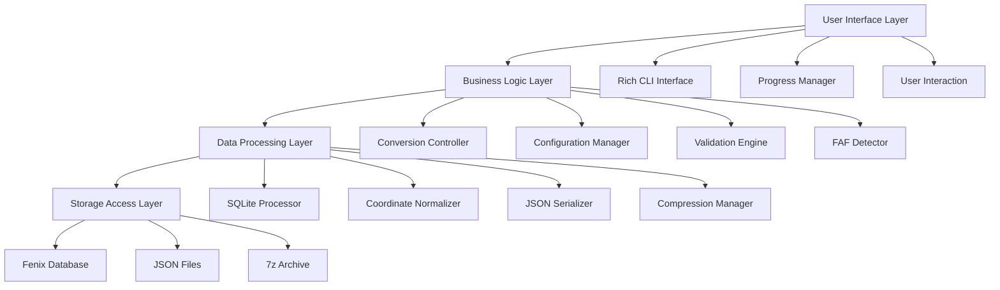
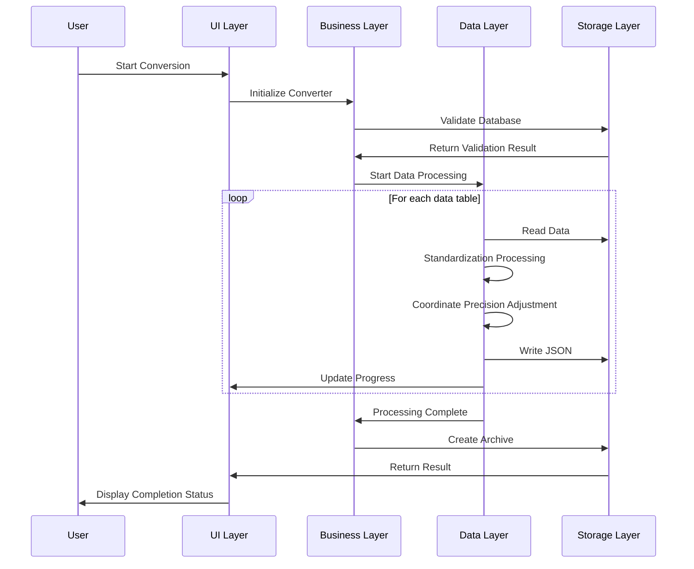

# 🏗️ TFDI Navigation Data Converter Architecture

## System Overview

The TFDI Navigation Data Converter is a professional aviation navigation data conversion tool, specifically designed to convert Fenix A320 navigation databases into TFDI MD-11 compatible JSON format. This tool adopts a modern architectural design, providing efficient and reliable data conversion services.

## 🎯 Design Principles

### 1. Data Integrity Priority
- **Rigorous Validation**: Multi-layered data validation mechanism
- **Relationship Preservation**: Maintaining dependencies between navigation data
- **Precision Assurance**: Maintaining high precision for coordinates and calculations
- **Consistency Check**: Ensuring logical consistency of converted data

### 2. Performance Optimization Oriented
- **SQLite Optimization**: WAL mode and performance tuning
- **Batch Processing**: Memory-efficient batch processing strategy
- **Caching Mechanism**: Intelligent data caching and reuse
- **Compression Optimization**: Fast 7z compression and cleanup

### 3. User Experience First
- **Rich CLI**: Modern colored terminal interface
- **Real-time Feedback**: Detailed progress display and status updates
- **Friendly Prompts**: Professional error handling and recovery suggestions
- **Interactive Design**: Intuitive operational flow guidance

## 🏗️ System Architecture

### Overall Architecture Diagram



### Core Component Details

#### 1. User Interface Layer (UI Layer)
**Responsibilities**: Provides user interaction interface and feedback
```python
class RichInterface:
    """Rich CLI Interface Manager"""
    - progress_tracking: Progress bar management
    - status_display: Status information display
    - error_presentation: Error message presentation
    - user_input: User input handling
```

#### 2. Business Logic Layer (Business Layer)
**Responsibilities**: Core business logic and process control
```python
class FenixToTFDIConverter:
    """Main Converter Class"""
    - database_validation: Database validation
    - conversion_orchestration: Conversion process orchestration
    - faf_detection: FAF point detection
    - data_normalization: Data normalization
```

#### 3. Data Processing Layer (Data Layer)
**Responsibilities**: Data conversion and processing algorithms
```python
class DataProcessor:
    """Data Processing Core"""
    - coordinate_precision: Coordinate precision handling
    - column_standardization: Column name standardization
    - relationship_mapping: Relationship mapping
    - format_conversion: Format conversion
```

#### 4. Storage Access Layer (Storage Layer)
**Responsibilities**: Database access and file operations
```python
class StorageManager:
    """Storage Manager"""
    - sqlite_optimization: SQLite performance optimization
    - file_operations: File read/write operations
    - compression_handling: Compressed file handling
    - backup_management: Backup management
```

## 📊 Data Flow Architecture

### Conversion Pipeline



### Data Mapping Architecture


## 🔧 Technology Stack

### Core Technologies

| Component | Technology Selection | Version Requirement | Purpose |
|------|----------|----------|------|
| **Python** | Python 3.8+ | ≥ 3.8.0 | Main programming language |
| **Rich** | Rich Library | ≥ 12.0.0 | CLI interface beautification |
| **SQLite3** | Built-in module | Python built-in | Database access |
| **Pandas** | DataFrame | ≥ 1.3.0 | Data processing |
| **JSON** | Built-in module | Python built-in | Data serialization |
| **py7zr** | 7-Zip Python | ≥ 0.18.0 | Compression handling |

### Architectural Features

#### 1. Modular Design
```python
fenix_to_tfdi/
├── core/                  # Core modules
│   ├── converter.py       # Main converter
│   ├── validator.py       # Data validator
│   └── config.py         # Configuration management
├── data/                  # Data processing
│   ├── processor.py       # Data processor
│   ├── normalizer.py      # Normalization tools
│   └── serializer.py     # Serialization tools
├── ui/                    # User interface
│   ├── cli.py            # Command-line interface
│   └── progress.py       # Progress management
└── utils/                 # Utility modules
    ├── storage.py        # Storage tools
    └── compression.py    # Compression tools
```

#### 2. Configuration-Driven Architecture
```python
@dataclass
class ConverterConfig:
    """Converter configuration class"""
    output_dir: str = "Primary"
    procedure_legs_dir: str = "Primary/ProcedureLegs"
    archive_name: str = "Primary.7z"
    coordinate_precision: int = 8
    vnav_threshold: float = 2.5
    
    # SQLite optimization configuration
    sqlite_pragmas: Dict[str, str] = field(default_factory=lambda: {
        "journal_mode": "WAL",
        "synchronous": "NORMAL",
        "cache_size": "10000",
        "temp_store": "MEMORY"
    })
```

## 🚀 Performance Architecture

### Memory Management Strategy

#### 1. Stream Processing
```python
def process_large_table(table_name: str, batch_size: int = 1000):
    """Stream processing for large table data"""
    offset = 0
    while True:
        query = f"""
        SELECT * FROM {table_name} 
        LIMIT {batch_size} OFFSET {offset}
        """
        
        batch = execute_query(query)
        if not batch:
            break
            
        process_batch(batch)
        offset += batch_size
```

#### 2. Cache Optimization
```python
class WaypointCache:
    """Waypoint cache management"""
    def __init__(self, max_size: int = 10000):
        self._cache: Dict[str, WaypointData] = {}
        self._max_size = max_size
        self._access_times: Dict[str, float] = {}
    
    def get_waypoint(self, waypoint_id: str) -> Optional[WaypointData]:
        """Retrieve cached waypoint data"""
        if waypoint_id in self._cache:
            self._access_times[waypoint_id] = time.time()
            return self._cache[waypoint_id]
        return None
```

### Concurrency Processing Architecture

#### 1. Multi-threading Design
```python
class ConcurrentProcessor:
    """Concurrent Processor"""
    def __init__(self, max_workers: int = 4):
        self.max_workers = max_workers
        self.executor = ThreadPoolExecutor(max_workers=max_workers)
    
    def process_tables_parallel(self, tables: List[str]):
        """Process multiple tables in parallel"""
        futures = []
        for table in tables:
            future = self.executor.submit(self.process_table, table)
            futures.append(future)
        
        # Wait for all tasks to complete
        concurrent.futures.wait(futures)
```

#### 2. Resource Pool Management
```python
class DatabaseConnectionPool:
    """Database Connection Pool"""
    def __init__(self, db_path: str, pool_size: int = 5):
        self.db_path = db_path
        self.pool_size = pool_size
        self.connections: Queue = Queue(maxsize=pool_size)
        self._init_pool()
    
    def get_connection(self) -> sqlite3.Connection:
        """Get database connection"""
        return self.connections.get()
    
    def return_connection(self, conn: sqlite3.Connection):
        """Return database connection"""
        self.connections.put(conn)
```

## 🔒 Security Architecture

### Data Protection Mechanisms

#### 1. Input Validation
```python
class InputValidator:
    """Input Validator"""
    
    @staticmethod
    def validate_database_path(path: str) -> bool:
        """Validate database path security"""
        # Check for path traversal attacks
        if ".." in path or path.startswith("/"):
            return False
        
        # Validate file extension
        if not path.endswith(('.db', '.db3', '.sqlite')):
            return False
        
        return True
    
    @staticmethod  
    def validate_terminal_id(terminal_id: int) -> bool:
        """Validate terminal ID range"""
        return 1 <= terminal_id <= 999999
```

#### 2. Error Isolation
```python
class SafeConverter:
    """Safe Converter"""
    
    def safe_convert_table(self, table_name: str) -> bool:
        """Safe table conversion"""
        try:
            with self.create_transaction() as transaction:
                result = self.convert_table(table_name)
                transaction.commit()
                return result
        except DatabaseError as e:
            self.logger.error(f"Database error: {e}")
            transaction.rollback()
            return False
        except Exception as e:
            self.logger.error(f"Unknown error: {e}")
            return False
```

## 📈 Extensible Architecture

### Plugin System Design

#### 1. Converter Plugin Interface
```python
class ConverterPlugin(ABC):
    """Converter plugin abstract base class"""
    
    @abstractmethod
    def get_name(self) -> str:
        """Get plugin name"""
        pass
    
    @abstractmethod
    def get_supported_formats(self) -> List[str]:
        """Get supported formats"""
        pass
    
    @abstractmethod
    def convert_data(self, data: Any, config: ConverterConfig) -> Any:
        """Convert data"""
        pass
```

#### 2. Format Extension Mechanism
```python
class FormatRegistry:
    """Format Registry"""
    
    def __init__(self):
        self._converters: Dict[str, ConverterPlugin] = {}
    
    def register_converter(self, format_name: str, converter: ConverterPlugin):
        """Register converter"""
        self._converters[format_name] = converter
    
    def get_converter(self, format_name: str) -> Optional[ConverterPlugin]:
        """Get converter"""
        return self._converters.get(format_name)
```

### Data Source Extension

#### 1. Data Source Abstraction
```python
class DataSource(ABC):
    """Data source abstract base class"""
    
    @abstractmethod
    def connect(self) -> bool:
        """Connect to data source"""
        pass
    
    @abstractmethod
    def get_tables(self) -> List[str]:
        """Get table list"""
        pass
    
    @abstractmethod
    def query_data(self, query: str) -> Iterator[Dict]:
        """Query data"""
        pass
```

## 🔄 Maintainability Architecture

### Logging System

#### 1. Structured Logging
```python
class StructuredLogger:
    """Structured Logger"""
    
    def __init__(self, name: str):
        self.logger = logging.getLogger(name)
        self.logger.setLevel(logging.INFO)
        
        # Rich formatting handler
        rich_handler = RichHandler(rich_tracebacks=True)
        rich_handler.setFormatter(
            logging.Formatter(
                "%(asctime)s - %(name)s - %(levelname)s - %(message)s"
            )
        )
        self.logger.addHandler(rich_handler)
    
    def log_conversion_start(self, table_name: str, record_count: int):
        """Log conversion start"""
        self.logger.info(
            f"Starting conversion for table {table_name}",
            extra={
                "table": table_name,
                "record_count": record_count,
                "operation": "conversion_start"
            }
        )
```

#### 2. Performance Monitoring
```python
class PerformanceMonitor:
    """Performance Monitor"""
    
    def __init__(self):
        self.metrics: Dict[str, List[float]] = defaultdict(list)
    
    @contextmanager
    def measure_time(self, operation: str):
        """Measure operation duration"""
        start_time = time.time()
        try:
            yield
        finally:
            elapsed = time.time() - start_time
            self.metrics[operation].append(elapsed)
            self.logger.debug(f"{operation} elapsed time: {elapsed:.2f}s")
```

## 📊 Testing Architecture

### Testing Strategy

#### 1. Layered Testing
```python
# Unit Testing
class TestDataProcessor(unittest.TestCase):
    def test_coordinate_normalization(self):
        """Test coordinate normalization"""
        processor = DataProcessor()
        result = processor.normalize_coordinate(39.916667, 8)
        self.assertEqual(result, 39.91666700)

# Integration Testing  
class TestConverterIntegration(unittest.TestCase):
    def test_full_conversion_pipeline(self):
        """Test full conversion pipeline"""
        converter = FenixToTFDIConverter(test_config)
        result = converter.convert(test_database_path)
        self.assertTrue(result)

# Performance Testing
class TestPerformance(unittest.TestCase):
    def test_large_database_conversion(self):
        """Test large database conversion performance"""
        start_time = time.time()
        converter.convert(large_test_database)
        elapsed = time.time() - start_time
        self.assertLess(elapsed, 300)  # Should complete within 5 minutes
```

---

This architectural design ensures the **reliability**, **performance**, and **maintainability** of the TFDI Navigation Data Converter, providing a professional-grade data conversion solution for the TFDI MD-11 flight simulation community. 🚁✨