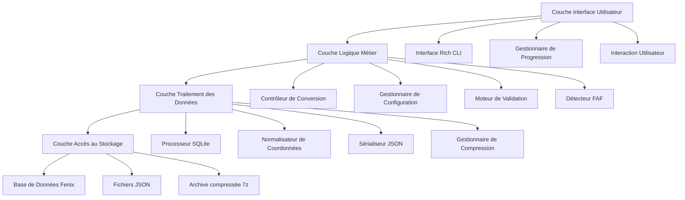
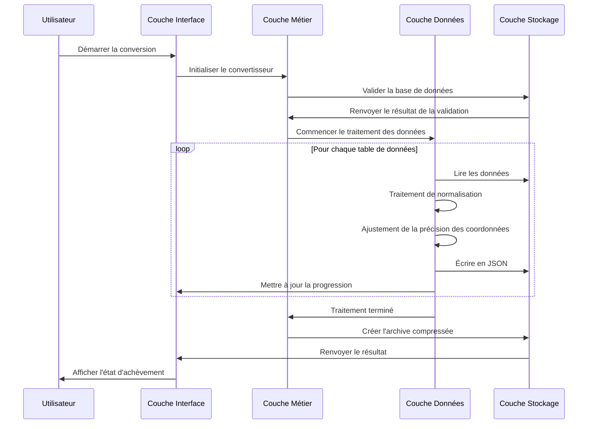
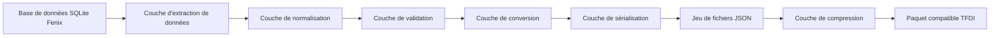

# 🏗️ Architecture du convertisseur de données de navigation TFDI

## Aperçu du système

Le convertisseur de données de navigation TFDI est un outil professionnel de conversion de données de navigation aéronautiques, spécialement conçu pour convertir les bases de données de navigation du Fenix A320 au format JSON compatible avec le TFDI MD-11. Cet outil adopte une conception architecturale moderne, offrant des services de conversion de données efficaces et fiables.

## 🎯 Principes de conception

### 1. Priorité à l'intégrité des données
- **Validation stricte** : Mécanismes de validation de données multicouches
- **Maintien des relations** : Préserve les dépendances entre les données de navigation
- **Garantie de précision** : Maintient une haute précision pour les coordonnées et les calculs
- **Vérification de la cohérence** : Assure la cohérence logique des données après conversion

### 2. Axé sur l'optimisation des performances
- **Optimisation SQLite** : Mode WAL et réglage des performances
- **Traitement par lots** : Stratégie de traitement par lots économe en mémoire
- **Mécanisme de cache** : Cache et réutilisation intelligents des données
- **Optimisation de la compression** : Compression et nettoyage rapides 7z

### 3. Expérience utilisateur primordiale
- **Rich CLI** : Interface de terminal couleur modernisée
- **Retour en temps réel** : Affichage détaillé de la progression et mises à jour de l'état
- **Alertes conviviales** : Gestion professionnelle des erreurs et suggestions de récupération
- **Conception interactive** : Guidage intuitif du flux opérationnel

## 🏗️ Architecture du système

### Diagramme d'architecture global



### Détail des composants clés

#### 1. Couche Interface Utilisateur (UI Layer)
**Responsabilités** : Fournit l'interface d'interaction utilisateur et le feedback
```python
class RichInterface:
    """Gestionnaire d'interface Rich CLI"""
    - progress_tracking: Gestion de la barre de progression
    - status_display: Affichage des informations d'état
    - error_presentation: Présentation des messages d'erreur
    - user_input: Traitement des entrées utilisateur
```

#### 2. Couche Logique Métier (Business Layer)
**Responsabilités** : Logique métier centrale et contrôle de flux
```python
class FenixToTFDIConverter:
    """Classe principale du convertisseur"""
    - database_validation: Validation de la base de données
    - conversion_orchestration: Orchestration du processus de conversion
    - faf_detection: Détection des points FAF
    - data_normalization: Normalisation des données
```

#### 3. Couche Traitement des Données (Data Layer)
**Responsabilités** : Algorithmes de conversion et de traitement des données
```python
class DataProcessor:
    """Noyau de traitement des données"""
    - coordinate_precision: Gestion de la précision des coordonnées
    - column_standardization: Standardisation des noms de colonnes
    - relationship_mapping: Mappage des relations
    - format_conversion: Conversion de format
```

#### 4. Couche Accès au Stockage (Storage Layer)
**Responsabilités** : Accès à la base de données et opérations sur les fichiers
```python
class StorageManager:
    """Gestionnaire de stockage"""
    - sqlite_optimization: Optimisation des performances SQLite
    - file_operations: Opérations de lecture/écriture de fichiers
    - compression_handling: Gestion des fichiers compressés
    - backup_management: Gestion des sauvegardes
```

## 📊 Architecture du flux de données

### Pipeline de conversion



### Architecture de mappage des données



## 🔧 Pile technologique

### Technologies clés

| Composant | Choix technologique | Exigences de version | Utilisation |
|-----------|---------------------|----------------------|-------------|
| **Python**    | Python 3.8+         | ≥ 3.8.0              | Langage de programmation principal |
| **Rich**      | Rich Library        | ≥ 12.0.0             | Embellissement de l'interface CLI |
| **SQLite3**   | Module intégré      | Intégré à Python     | Accès à la base de données |
| **Pandas**    | DataFrame           | ≥ 1.3.0              | Traitement des données |
| **JSON**      | Module intégré      | Intégré à Python     | Sérialisation des données |
| **py7zr**     | 7-Zip Python        | ≥ 0.18.0             | Traitement de compression |

### Caractéristiques architecturales

#### 1. Conception modulaire
```python
fenix_to_tfdi/
├── core/                  # Modules principaux
│   ├── converter.py       # Convertisseur principal
│   ├── validator.py       # Validateur de données
│   └── config.py         # Gestion de la configuration
├── data/                  # Traitement des données
│   ├── processor.py       # Processeur de données
│   ├── normalizer.py      # Outil de normalisation
│   └── serializer.py     # Outil de sérialisation
├── ui/                    # Interface utilisateur
│   ├── cli.py            # Interface en ligne de commande
│   └── progress.py       # Gestion de la progression
└── utils/                 # Modules utilitaires
    ├── storage.py        # Outils de stockage
    └── compression.py    # Outils de compression
```

#### 2. Architecture basée sur la configuration
```python
@dataclass
class ConverterConfig:
    """Classe de configuration du convertisseur"""
    output_dir: str = "Primary"
    procedure_legs_dir: str = "Primary/ProcedureLegs"
    archive_name: str = "Primary.7z"
    coordinate_precision: int = 8
    vnav_threshold: float = 2.5
    
    # Configuration d'optimisation SQLite
    sqlite_pragmas: Dict[str, str] = field(default_factory=lambda: {
        "journal_mode": "WAL",
        "synchronous": "NORMAL",
        "cache_size": "10000",
        "temp_store": "MEMORY"
    })
```

## 🚀 Architecture de performance

### Stratégies de gestion de la mémoire

#### 1. Traitement en flux
```python
def process_large_table(table_name: str, batch_size: int = 1000):
    """Traite les données de grandes tables en flux"""
    offset = 0
    while True:
        query = f"""
        SELECT * FROM {table_name} 
        LIMIT {batch_size} OFFSET {offset}
        """
        
        batch = execute_query(query)
        if not batch:
            break
            
        process_batch(batch)
        offset += batch_size
```

#### 2. Optimisation du cache
```python
class WaypointCache:
    """Gestion du cache des waypoints"""
    def __init__(self, max_size: int = 10000):
        self._cache: Dict[str, WaypointData] = {}
        self._max_size = max_size
        self._access_times: Dict[str, float] = {}
    
    def get_waypoint(self, waypoint_id: str) -> Optional[WaypointData]:
        """Récupère les données de waypoint mises en cache"""
        if waypoint_id in self._cache:
            self._access_times[waypoint_id] = time.time()
            return self._cache[waypoint_id]
        return None
```

### Architecture de traitement concurrent

#### 1. Conception multithread
```python
class ConcurrentProcessor:
    """Processeur concurrent"""
    def __init__(self, max_workers: int = 4):
        self.max_workers = max_workers
        self.executor = ThreadPoolExecutor(max_workers=max_workers)
    
    def process_tables_parallel(self, tables: List[str]):
        """Traite plusieurs tables en parallèle"""
        futures = []
        for table in tables:
            future = self.executor.submit(self.process_table, table)
            futures.append(future)
        
        # Attendre que toutes les tâches soient terminées
        concurrent.futures.wait(futures)
```

#### 2. Gestion des pools de ressources
```python
class DatabaseConnectionPool:
    """Pool de connexions à la base de données"""
    def __init__(self, db_path: str, pool_size: int = 5):
        self.db_path = db_path
        self.pool_size = pool_size
        self.connections: Queue = Queue(maxsize=pool_size)
        self._init_pool()
    
    def get_connection(self) -> sqlite3.Connection:
        """Obtient une connexion à la base de données"""
        return self.connections.get()
    
    def return_connection(self, conn: sqlite3.Connection):
        """Libère une connexion à la base de données"""
        self.connections.put(conn)
```

## 🔒 Architecture de sécurité

### Mécanismes de protection des données

#### 1. Validation des entrées
```python
class InputValidator:
    """Validateur d'entrées"""
    
    @staticmethod
    def validate_database_path(path: str) -> bool:
        """Valide la sécurité du chemin de la base de données"""
        # Vérifier les attaques par traversée de répertoire
        if ".." in path or path.startswith("/"):
            return False
        
        # Valider l'extension du fichier
        if not path.endswith(('.db', '.db3', '.sqlite')):
            return False
        
        return True
    
    @staticmethod  
    def validate_terminal_id(terminal_id: int) -> bool:
        """Valide la plage de l'ID de terminal"""
        return 1 <= terminal_id <= 999999
```

#### 2. Isolation des erreurs
```python
class SafeConverter:
    """Convertisseur sécurisé"""
    
    def safe_convert_table(self, table_name: str) -> bool:
        """Conversion de table sécurisée"""
        try:
            with self.create_transaction() as transaction:
                result = self.convert_table(table_name)
                transaction.commit()
                return result
        except DatabaseError as e:
            self.logger.error(f"Erreur de base de données: {e}")
            transaction.rollback()
            return False
        except Exception as e:
            self.logger.error(f"Erreur inconnue: {e}")
            return False
```

## 📈 Architecture évolutive

### Conception du système de plugins

#### 1. Interface de plugin de convertisseur
```python
class ConverterPlugin(ABC):
    """Classe de base abstraite pour les plugins de convertisseur"""
    
    @abstractmethod
    def get_name(self) -> str:
        """Obtient le nom du plugin"""
        pass
    
    @abstractmethod
    def get_supported_formats(self) -> List[str]:
        """Obtient les formats supportés"""
        pass
    
    @abstractmethod
    def convert_data(self, data: Any, config: ConverterConfig) -> Any:
        """Convertit les données"""
        pass
```

#### 2. Mécanisme d'extension de format
```python
class FormatRegistry:
    """Registre des formats"""
    
    def __init__(self):
        self._converters: Dict[str, ConverterPlugin] = {}
    
    def register_converter(self, format_name: str, converter: ConverterPlugin):
        """Enregistre un convertisseur"""
        self._converters[format_name] = converter
    
    def get_converter(self, format_name: str) -> Optional[ConverterPlugin]:
        """Obtient un convertisseur"""
        return self._converters.get(format_name)
```

### Extension de la source de données

#### 1. Abstraction de la source de données
```python
class DataSource(ABC):
    """Classe de base abstraite pour la source de données"""
    
    @abstractmethod
    def connect(self) -> bool:
        """Connecte la source de données"""
        pass
    
    @abstractmethod
    def get_tables(self) -> List[str]:
        """Obtient la liste des tables"""
        pass
    
    @abstractmethod
    def query_data(self, query: str) -> Iterator[Dict]:
        """Interroge les données"""
        pass
```

## 🔄 Architecture de maintenabilité

### Système de journalisation

#### 1. Journalisation structurée
```python
class StructuredLogger:
    """Enregistreur de logs structurés"""
    
    def __init__(self, name: str):
        self.logger = logging.getLogger(name)
        self.logger.setLevel(logging.INFO)
        
        # Gestionnaire de formatage Rich
        rich_handler = RichHandler(rich_tracebacks=True)
        rich_handler.setFormatter(
            logging.Formatter(
                "%(asctime)s - %(name)s - %(levelname)s - %(message)s"
            )
        )
        self.logger.addHandler(rich_handler)
    
    def log_conversion_start(self, table_name: str, record_count: int):
        """Enregistre le début de la conversion"""
        self.logger.info(
            f"Début de la conversion de la table {table_name}",
            extra={
                "table": table_name,
                "record_count": record_count,
                "operation": "conversion_start"
            }
        )
```

#### 2. Surveillance des performances
```python
class PerformanceMonitor:
    """Moniteur de performance"""
    
    def __init__(self):
        self.metrics: Dict[str, List[float]] = defaultdict(list)
    
    @contextmanager
    def measure_time(self, operation: str):
        """Mesure le temps d'exécution d'une opération"""
        start_time = time.time()
        try:
            yield
        finally:
            elapsed = time.time() - start_time
            self.metrics[operation].append(elapsed)
            self.logger.debug(f"{operation} Durée: {elapsed:.2f}s")
```

## 📊 Architecture de test

### Stratégies de test

#### 1. Test en couches
```python
# Tests unitaires
class TestDataProcessor(unittest.TestCase):
    def test_coordinate_normalization(self):
        """Teste la normalisation des coordonnées"""
        processor = DataProcessor()
        result = processor.normalize_coordinate(39.916667, 8)
        self.assertEqual(result, 39.91666700)

# Tests d'intégration  
class TestConverterIntegration(unittest.TestCase):
    def test_full_conversion_pipeline(self):
        """Teste le pipeline de conversion complet"""
        converter = FenixToTFDIConverter(test_config)
        result = converter.convert(test_database_path)
        self.assertTrue(result)

# Tests de performance
class TestPerformance(unittest.TestCase):
    def test_large_database_conversion(self):
        """Teste les performances de conversion de grandes bases de données"""
        start_time = time.time()
        converter.convert(large_test_database)
        elapsed = time.time() - start_time
        self.assertLess(elapsed, 300)  # Devrait être terminé en moins de 5 minutes
```

---

Cette conception architecturale assure la **fiabilité**, la **performance** et la **maintenabilité** du convertisseur de données de navigation TFDI, fournissant une solution de conversion de données de niveau professionnel à la communauté de simulation de vol du TFDI MD-11. 🚁✨