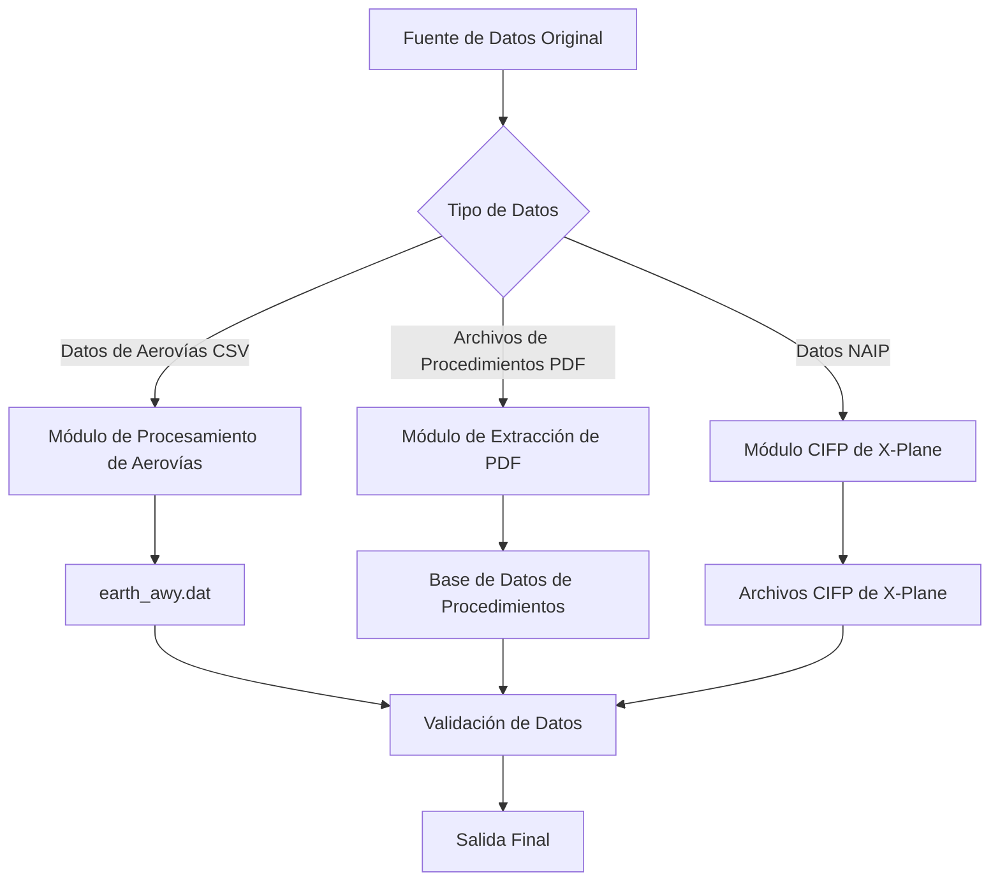

# Instrucciones de Uso

Este documento detalla cómo utilizar la herramienta Nav-data para la conversión de datos de navegación aeronáutica, cubriendo el proceso completo desde la preparación de datos hasta la salida final.

## 🗂️ Visión General del Proceso de Procesamiento de Datos

Nav-data incluye tres flujos principales de procesamiento de datos:



## 🛣️ Procesamiento de Datos de Aerovías

### Preparación de Datos

#### 1. Preparar Archivos de Entrada
Asegúrese de que los siguientes archivos estén en el directorio de trabajo:

```bash
# Archivos de entrada requeridos
RTE_SEG.csv          # Datos de segmentos de aerovías (formato CSV)
earth_fix.dat        # Datos de puntos de referencia de X-Plane
earth_nav.dat        # Datos de equipos de navegación de X-Plane
earth_awy.dat        # Datos de aerovías de X-Plane (serán actualizados)
```

#### 2. Validación del Formato del Archivo CSV
`RTE_SEG.csv` debe contener los siguientes campos:

| Campo | Descripción | Ejemplo |
|--------|------|------|
| `CODE_POINT_START` | Código de punto de inicio | ABCDE |
| `CODE_TYPE_START` | Tipo de punto de inicio | DESIGNATED_POINT |
| `CODE_POINT_END` | Código de punto final | FGHIJ |
| `CODE_TYPE_END` | Tipo de punto final | VOR/DME |
| `CODE_DIR` | Código de dirección | N |
| `TXT_DESIG` | Nombre de aerovía | A123 |

### Ejecutar Conversión de Aerovías

#### Uso Básico
```bash
# Entrar al directorio del módulo de aerovías
cd Airway

# Ejecutar script de conversión
python airway.py
```

#### Uso Avanzado
```bash
# Usar parámetros personalizados
python airway.py --config custom_config.ini

# Especificar un archivo de entrada específico
python airway.py --csv-file /path/to/custom_routes.csv

# Habilitar registro detallado
python airway.py --verbose

# Procesar solo áreas específicas
python airway.py --areas ZB,ZG,ZY
```

#### Modificación de la Configuración en el Script
Para modificar los parámetros de procesamiento, edite `Airway/airway.py`:

```python
# Modificar áreas de filtrado
china_areas = {'ZB', 'ZG', 'ZY', 'ZS', 'ZW', 'ZJ', 'ZP', 'ZL', 'ZH', 'ZU'}

# Modificar rutas de archivo
csv_file = 'custom_routes.csv'
earth_fix_path = '/path/to/earth_fix.dat'
earth_nav_path = '/path/to/earth_nav.dat'
earth_awy_path = '/path/to/earth_awy.dat'
```

### Descripción del Archivo de Salida

Una vez completado el procesamiento, el archivo `earth_awy.dat` contendrá:
- Datos de aerovías originales filtrados
- Nuevos datos de aerovías del espacio aéreo chino añadidos
- Información de aerovías en formato compatible con X-Plane

Ejemplo de formato de salida:
```
ABCDE  ZB  11 FGHIJ  ZG   3 N  1    0  600 A123
```

## 📄 Extracción de Datos PDF

### Flujo de Procesamiento de Datos de Procedimientos

#### Flujo 1: Extracción Original de PDF
```bash
# Entrar al directorio de extracción de PDF
cd "PDF extract"

# Ejecutar script de extracción de PDF
python 1_terminal_pdf.py

# Entrada: airport_procedures.pdf
# Salida: ZXXX_procedure.txt
```

**Ejemplo de uso:**
```python
# Procesamiento de PDF personalizado
import pdfplumber
from utils import *

# Abrir archivo PDF
with pdfplumber.open("ZBAA_procedures.pdf") as pdf:
    # Extraer texto y elementos gráficos
    extracted_data = extract(pdf)
    
    # Guardar resultados de extracción
    with open("ZBAA_procedure.txt", "w", encoding="utf-8") as f:
        for line in extracted_data:
            f.write(line + "\n")
```

#### Flujo 2: Codificación de Estandarización de Datos
```bash
# Ejecutar script de codificación
python 2_terminal_encode.py

# Entrada: ZXXX_procedure.txt
# Salida: ZXXX_encode.txt
```

**Reglas de codificación:**
- Limpiar caracteres y formato inválidos
- Estandarizar nombres de procedimientos
- Normalizar formato de coordenadas
- Validar integridad de datos

#### Flujo 3: Generación de Formato de Base de Datos
```bash
# Ejecutar script de generación de base de datos
python 3_terminal_db.py

# Entrada: ZXXX_encode.txt  
# Salida: ZXXX_db.txt
```

**Características del formato de base de datos:**
- Separar procedimientos de múltiples pistas
- Unir procedimientos de transición, ida al aire y espera
- Generar formato compatible con X-Plane
- Añadir codificación de descripción de procedimiento

#### Flujo 4: Proliferación de Procedimientos (Opcional)
```bash
# Corregir problemas de inconsistencia en nombres de procedimientos
python 4_程序增殖.py

# Entrada: ZXXX_db.txt
# Salida: Archivo de procedimientos corregido
```

### Flujo de Extracción de Coordenadas de Waypoints

#### Extracción Automática (Recomendado)
```bash
# Ejecutar extracción automática de coordenadas
python waypoint_1_pdf.py

# Configurar rutas de entrada y salida
input_pdf = "ZBAA_waypoints.pdf"
output_txt = "ZBAA_waypoint.txt"
```

**Características de la extracción automática:**
- Reconocimiento inteligente del formato de coordenadas
- Manejo automático de la conversión de grados, minutos y segundos
- Soporte para múltiples diseños de PDF
- Incluye validación de datos

#### Extracción Manual (Alternativa)
Cuando la precisión de la extracción automática no es ideal:

```bash
# Usar Microsoft Edge para extracción manual
python waypoint_2_edge.py
```

**Pasos de extracción manual:**
1. Abrir el archivo PDF con Microsoft Edge
2. Hacer clic derecho para seleccionar y copiar el texto relevante
3. Guardar el texto en un archivo de entrada
4. Ejecutar el script para el procesamiento de formato

#### Procesamiento de Archivo Único (Casos Especiales)
```bash
# Procesar archivos que contienen caracteres especiales
python debug_single.py

# Aplicable a:
# - Archivos que contienen caracteres especiales como paréntesis
# - Datos que requieren corrección manual
# - Archivos de aeropuerto procesados individualmente
```

### Mejores Prácticas para el Procesamiento de PDF

#### 1. Preprocesamiento de Archivos PDF
```bash
# Verificar la calidad del archivo PDF
python -c "
import pdfplumber
with pdfplumber.open('input.pdf') as pdf:
    print(f'Páginas: {len(pdf.pages)}')
    print(f'Líneas de texto en la primera página: {len(pdf.pages[0].extract_text_lines())}')
"
```

#### 2. Procesamiento por Lotes
```python
# Procesar por lotes múltiples PDF de aeropuertos
import os
from pathlib import Path

pdf_folder = "input_pdfs/"
output_folder = "output_txt/"

for pdf_file in Path(pdf_folder).glob("*.pdf"):
    airport_code = pdf_file.stem[:4]  # Extraer código de aeropuerto
    
    # Procesar archivo individual
    os.system(f"python 1_terminal_pdf.py {pdf_file}")
    os.system(f"python 2_terminal_encode.py {airport_code}_procedure.txt")
    os.system(f"python 3_terminal_db.py {airport_code}_encode.txt")
    
    print(f"Procesamiento completado: {airport_code}")
```

#### 3. Control de Calidad
```python
# Validar resultados de extracción
def validate_extraction(output_file):
    with open(output_file, 'r', encoding='utf-8') as f:
        lines = f.readlines()
    
    # Verificar formato de coordenadas
    coord_pattern = r'\d+\.\d{8}'
    valid_coords = sum(1 for line in lines if re.search(coord_pattern, line))
    
    print(f"Archivo: {output_file}")
    print(f"Número total de líneas: {len(lines)}")
    print(f"Número de líneas con coordenadas válidas: {valid_coords}")
    print(f"Calidad de datos: {valid_coords/len(lines)*100:.1f}%")

# Ejemplo de uso
validate_extraction("ZBAA_waypoint.txt")
```

## 🔧 Corrección de Procedimientos Terminales

### Corrección de Codificación de Datos

#### Uso del Codificador
```bash
# Entrar al directorio del módulo de corrección
cd "Terminal Patch"

# Procesamiento por lotes (ruta predeterminada)
python terminal_encoder.py

# Procesamiento con ruta personalizada
python terminal_encoder.py "input_folder" "output_folder"

# Ejemplo
python terminal_encoder.py "PDF extract/public" "PDF extract/encoded"
```

**Funcionalidades del codificador:**
- Identificar la posición de los puntos IF
- Añadir codificación de segmentos de transición
- Marcar puntos clave del procedimiento
- Generar código de descripción estándar

#### Uso del Reparador de Formato
```bash
# Reparación de formato por lotes (ruta predeterminada)
python terminal_reencode.py

# Procesamiento de archivo único
python terminal_reencode.py ZBAA.dat ZBAA_fixed.dat

# Especificar carpetas de entrada y salida
python terminal_reencode.py "/input/folder" "/output/folder"
```

**Descripción de las reglas de corrección:**

1. **Regla APPCH línea GY M**
   ```
   Antes de la corrección: APPCH ... RW01 ... ... GY M
   Después de la corrección: APPCH ... RW01 ... G GY M
   ```

2. **Regla de la quinta parte de solo letras**
   ```
   Antes de la corrección: SID ... ABC ... ... EY M
   Después de la corrección: SID ... ABC ... D B VY M
   ```

3. **Regla SID RW**
   ```
   Antes de la corrección: SID ... RW25 ... ... EY D
   Después de la corrección: SID ... RW25 ... G GY D
   ```

### Script de Corrección Personalizado

```python
# Crear script de corrección personalizado
import re

def custom_fix_procedure(input_file, output_file):
    """Función de corrección de procedimiento personalizada"""
    with open(input_file, 'r', encoding='utf-8') as f:
        lines = f.readlines()
    
    fixed_lines = []
    for line in lines:
        # Aplicar reglas de corrección personalizadas
        if line.startswith('APPCH'):
            # Corrección de procedimiento de aproximación personalizada
            parts = line.split()
            if len(parts) >= 9:
                # Lógica de corrección
                if parts[8] == 'EY':
                    parts[8] = 'GY'
                line = ' '.join(parts) + '\n'
        
        fixed_lines.append(line)
    
    with open(output_file, 'w', encoding='utf-8') as f:
        f.writelines(fixed_lines)

# Ejemplo de uso
custom_fix_procedure('ZBAA.dat', 'ZBAA_custom_fixed.dat')
```

## 🛩️ Generación de CIFP para X-Plane

### Procesamiento de Equipos de Navegación

#### Procesamiento de Datos VOR/DME y NDB
```bash
cd "X-Plane CIFP"

# Procesar datos de equipos de navegación
python 1_navaid.py
```

**Configuración de rutas:**
```python
# Modificar la configuración de rutas en el script
nav路径 = "path/to/earth_nav.dat"
vor路径 = "path/to/VOR.csv"
ndb路径 = "path/to/NDB.csv"
```

**Requisitos del formato de datos CSV:**

Campos de VOR.csv:
- Código de aeropuerto, nombre, frecuencia, coordenadas, altitud, etc.

Campos de NDB.csv:
- Código de aeropuerto, nombre, frecuencia, coordenadas, altitud, etc.

### Procesamiento de Waypoints

```bash
# Procesar datos de waypoints
python 2_waypoint.py
```

**Ejemplo de configuración:**
```python
# Modificar configuración de rutas
naipPath = "path/to/naip/waypoints"
xplanePath = "path/to/xplane/data"
outputPath = "path/to/output/earth_fix.dat"

# Seleccionar versión de X-Plane
forXp11 = False  # True para X-Plane 11, False para X-Plane 12
```

### Procesamiento de Procedimientos Terminales

```bash
# Procesar datos de procedimientos terminales
python 3_terminal.py
```

**Configuración de rutas:**
```python
# Configuración principal de rutas
inputPath = "path/to/encoded/procedures"
outputFolder = "path/to/cifp/output"
xplanePath = "path/to/xplane/installation"
csvFolder = "path/to/naip/csv/data"
```

**Flujo de procesamiento:**
1. Leer archivos de procedimiento codificados
2. Establecer base de datos de waypoints
3. Procesar procedimientos SID, STAR y de aproximación
4. Generar información de pista
5. Exportar archivos en formato CIFP

### Módulos de Funciones Especiales

#### Extracción de Datos de Fenix
```bash
# Extraer información de pista y MAP en formato específico
python Fenix.py

# Configuración de parámetros
csv_folder = "path/to/csv/data"
procedure_folder = "path/to/procedures"
output_file = "fenix_output.txt"
```

#### Generación de Pistas
```bash
# Generar datos relacionados con pistas
python spawn_runway.py

# O usar la versión de exportación
python 跑道生成导出ver.py
```

## 📊 Validación de Datos y Control de Calidad

### Script de Validación Automática

Crear `validate_output.py`:

```python
#!/usr/bin/env python3
"""
Script de validación de datos de salida
"""
import re
import os
from pathlib import Path

def validate_airway_data(file_path):
    """Valida el formato de los datos de aerovías"""
    errors = []
    with open(file_path, 'r', encoding='utf-8') as f:
        for line_num, line in enumerate(f, 1):
            line = line.strip()
            if not line or line == "99":
                continue
                
            # Validación del formato de aerovías de X-Plane
            parts = line.split()
            if len(parts) < 11:
                errors.append(f"Línea {line_num}: Campos insuficientes")
                continue
                
            # Validación del rango de coordenadas
            try:
                # Aquí añadir lógica específica de validación de coordenadas
                pass
            except ValueError as e:
                errors.append(f"Línea {line_num}: Error de formato de coordenadas - {e}")
    
    return errors

def validate_waypoint_data(file_path):
    """Valida el formato de los datos de waypoints"""
    errors = []
    coord_pattern = r'^-?\d+\.\d{8}$'
    
    with open(file_path, 'r', encoding='utf-8') as f:
        for line_num, line in enumerate(f, 1):
            line = line.strip()
            if not line:
                continue
                
            parts = line.split()
            if len(parts) < 3:
                errors.append(f"Línea {line_num}: Campos insuficientes")
                continue
                
            # Validar formato de coordenadas
            try:
                lat, lon = float(parts[1]), float(parts[2])
                if not (-90 <= lat <= 90):
                    errors.append(f"Línea {line_num}: Latitud fuera de rango")
                if not (-180 <= lon <= 180):
                    errors.append(f"Línea {line_num}: Longitud fuera de rango")
            except ValueError:
                errors.append(f"Línea {line_num}: Error de formato de coordenadas")
    
    return errors

def validate_cifp_data(file_path):
    """Valida el formato de los datos CIFP"""
    errors = []
    procedure_types = ['SID', 'STAR', 'APPCH']
    
    with open(file_path, 'r', encoding='utf-8') as f:
        for line_num, line in enumerate(f, 1):
            line = line.strip()
            if not line:
                continue
                
            # Verificar tipo de procedimiento
            if any(line.startswith(ptype) for ptype in procedure_types):
                parts = line.split()
                if len(parts) < 15:
                    errors.append(f"Línea {line_num}: Campos de formato CIFP insuficientes")
    
    return errors

def main():
    """Función principal de validación"""
    print("🔍 Validación de Salida de Nav-data")
    print("=" * 40)
    
    # Configuración de validación
    validation_config = {
        'earth_awy.dat': validate_airway_data,
        '*.txt': validate_waypoint_data,  # Archivos de waypoints
        '*.dat': validate_cifp_data,      # Archivos CIFP
    }
    
    total_errors = 0
    
    for pattern, validator in validation_config.items():
        if '*' in pattern:
            # Modo comodín
            ext = pattern.split('*')[1]
            files = list(Path('.').glob(f'**/*{ext}'))
        else:
            # Archivo específico
            files = [Path(pattern)] if Path(pattern).exists() else []
        
        for file_path in files:
            if file_path.exists():
                print(f"\n📄 Archivo a validar: {file_path}")
                errors = validator(str(file_path))
                
                if errors:
                    print(f"❌ Se encontraron {len(errors)} errores:")
                    for error in errors[:5]:  # Mostrar solo los primeros 5 errores
                        print(f"   - {error}")
                    if len(errors) > 5:
                        print(f"   ... y {len(errors) - 5} errores más")
                    total_errors += len(errors)
                else:
                    print("✅ Validación exitosa")
    
    print(f"\n" + "=" * 40)
    if total_errors == 0:
        print("🎉 ¡Todos los datos validados exitosamente!")
        return 0
    else:
        print(f"⚠️  Se encontraron un total de {total_errors} problemas")
        return 1

if __name__ == "__main__":
    exit(main())
```

### Uso del Script de Validación
```bash
# Ejecutar validación
python validate_output.py

# Ejemplo de salida
🔍 Validación de Salida de Nav-data
========================================

📄 Archivo a validar: earth_awy.dat
✅ Validación exitosa

📄 Archivo a validar: ZBAA_waypoint.txt
✅ Validación exitosa

📄 Archivo a validar: ZBAA.dat
❌ Se encontraron 2 errores:
   - Línea 15: Campos de formato CIFP insuficientes
   - Línea 23: Error de formato de coordenadas

========================================
⚠️  Se encontraron un total de 2 problemas
```

## 🔧 Flujo de Trabajo de Procesamiento por Lotes

### Crear Script de Procesamiento por Lotes

Crear `batch_process.py`:

```python
#!/usr/bin/env python3
"""
Script de procesamiento por lotes de Nav-data
"""
import os
import sys
import subprocess
from pathlib import Path
import logging

# Configurar registro
logging.basicConfig(level=logging.INFO, format='%(asctime)s - %(levelname)s - %(message)s')
logger = logging.getLogger(__name__)

class BatchProcessor:
    def __init__(self, config):
        self.config = config
        self.processed_count = 0
        self.error_count = 0
    
    def process_airway_data(self):
        """Procesa los datos de aerovías"""
        logger.info("Iniciando procesamiento de datos de aerovías...")
        
        try:
            os.chdir('Airway')
            result = subprocess.run(['python', 'airway.py'], 
                                  capture_output=True, text=True)
            
            if result.returncode == 0:
                logger.info("Procesamiento de datos de aerovías exitoso")
                self.processed_count += 1
            else:
                logger.error(f"Fallo en el procesamiento de datos de aerovías: {result.stderr}")
                self.error_count += 1
                
        except Exception as e:
            logger.error(f"Excepción en el procesamiento de datos de aerovías: {e}")
            self.error_count += 1
        finally:
            os.chdir('..')
    
    def process_pdf_data(self, pdf_files):
        """Procesa datos PDF por lotes"""
        logger.info(f"Iniciando procesamiento de {len(pdf_files)} archivos PDF...")
        
        os.chdir('PDF extract')
        
        for pdf_file in pdf_files:
            try:
                airport_code = Path(pdf_file).stem[:4]
                logger.info(f"Procesando aeropuerto: {airport_code}")
                
                # Paso 1: Extracción de PDF
                subprocess.run(['python', '1_terminal_pdf.py', pdf_file], check=True)
                
                # Paso 2: Codificación
                subprocess.run(['python', '2_terminal_encode.py', 
                              f'{airport_code}_procedure.txt'], check=True)
                
                # Paso 3: Generación de base de datos
                subprocess.run(['python', '3_terminal_db.py', 
                              f'{airport_code}_encode.txt'], check=True)
                
                logger.info(f"Procesamiento completado: {airport_code}")
                self.processed_count += 1
                
            except subprocess.CalledProcessError as e:
                logger.error(f"Fallo al procesar {pdf_file} por: {e}")
                self.error_count += 1
            except Exception as e:
                logger.error(f"Excepción al procesar {pdf_file} por: {e}")
                self.error_count += 1
        
        os.chdir('..')
    
    def process_terminal_patch(self):
        """Procesa parches terminales"""
        logger.info("Iniciando procesamiento de parches terminales...")
        
        try:
            os.chdir('Terminal Patch')
            
            # Codificador
            subprocess.run(['python', 'terminal_encoder.py'], check=True)
            
            # Reparación de formato
            subprocess.run(['python', 'terminal_reencode.py'], check=True)
            
            logger.info("Procesamiento de parches terminales exitoso")
            self.processed_count += 1
            
        except subprocess.CalledProcessError as e:
            logger.error(f"Fallo en el procesamiento de parches terminales: {e}")
            self.error_count += 1
        except Exception as e:
            logger.error(f"Excepción en el procesamiento de parches terminales: {e}")
            self.error_count += 1
        finally:
            os.chdir('..')
    
    def process_cifp_data(self):
        """Procesa datos CIFP"""
        logger.info("Iniciando procesamiento de datos CIFP...")
        
        try:
            os.chdir('X-Plane CIFP')
            
            # Equipos de navegación
            subprocess.run(['python', '1_navaid.py'], check=True)
            
            # Waypoints
            subprocess.run(['python', '2_waypoint.py'], check=True)
            
            # Procedimientos terminales
            subprocess.run(['python', '3_terminal.py'], check=True)
            
            logger.info("Procesamiento de datos CIFP exitoso")
            self.processed_count += 1
            
        except subprocess.CalledProcessError as e:
            logger.error(f"Fallo en el procesamiento de datos CIFP: {e}")
            self.error_count += 1
        except Exception as e:
            logger.error(f"Excepción en el procesamiento de datos CIFP: {e}")
            self.error_count += 1
        finally:
            os.chdir('..')
    
    def run_validation(self):
        """Ejecuta la validación de datos"""
        logger.info("Iniciando validación de datos...")
        
        try:
            result = subprocess.run(['python', 'validate_output.py'], 
                                  capture_output=True, text=True)
            
            if result.returncode == 0:
                logger.info("Validación de datos exitosa")
            else:
                logger.warning(f"La validación de datos encontró problemas: {result.stdout}")
                
        except Exception as e:
            logger.error(f"Excepción en la validación de datos: {e}")
    
    def generate_report(self):
        """Genera un informe de procesamiento"""
        total = self.processed_count + self.error_count
        success_rate = (self.processed_count / total * 100) if total > 0 else 0
        
        report = f"""
Informe de Procesamiento por Lotes de Nav-data
========================
Tareas totales: {total}
Éxitos: {self.processed_count}
Fallos: {self.error_count}
Tasa de éxito: {success_rate:.1f}%

Consulte la salida de la consola para ver los registros detallados.
        """
        
        logger.info(report)
        
        # Guardar informe en archivo
        with open('batch_process_report.txt', 'w', encoding='utf-8') as f:
            f.write(report)

def main():
    """Función principal"""
    config = {
        'pdf_folder': 'input_pdfs/',
        'enable_validation': True,
        'generate_report': True
    }
    
    processor = BatchProcessor(config)
    
    # Buscar archivos PDF
    pdf_files = list(Path(config['pdf_folder']).glob('*.pdf')) if Path(config['pdf_folder']).exists() else []
    
    # Ejecutar flujo de procesamiento
    try:
        # 1. Procesamiento de datos de aerovías
        if Path('Airway/RTE_SEG.csv').exists():
            processor.process_airway_data()
        
        # 2. Procesamiento de datos PDF
        if pdf_files:
            processor.process_pdf_data(pdf_files)
        
        # 3. Procesamiento de parches terminales
        processor.process_terminal_patch()
        
        # 4. Procesamiento de datos CIFP
        processor.process_cifp_data()
        
        # 5. Validación de datos
        if config['enable_validation']:
            processor.run_validation()
        
        # 6. Generar informe
        if config['generate_report']:
            processor.generate_report()
            
    except KeyboardInterrupt:
        logger.info("Procesamiento interrumpido por el usuario")
    except Exception as e:
        logger.error(f"Excepción en el procesamiento por lotes: {e}")
    
    logger.info("Procesamiento por lotes completado")

if __name__ == "__main__":
    main()
```

### Uso del Procesamiento por Lotes
```bash
# Ejecutar procesamiento por lotes
python batch_process.py

# Ejemplo de salida
2025-01-23 10:00:00 - INFO - Iniciando procesamiento de datos de aerovías...
2025-01-23 10:01:30 - INFO - Procesamiento de datos de aerovías exitoso
2025-01-23 10:01:30 - INFO - Iniciando procesamiento de 5 archivos PDF...
2025-01-23 10:02:00 - INFO - Procesando aeropuerto: ZBAA
2025-01-23 10:03:15 - INFO - Procesamiento completado: ZBAA
...
2025-01-23 10:15:00 - INFO - Procesamiento por lotes completado
```

## ❓ Preguntas Frecuentes (FAQ)

### Q1: ¿Por qué falla la conversión de aerovías?
**A:** Causas comunes y soluciones:

1. **Error de formato de archivo CSV**
   ```bash
   # Verificar la codificación del archivo CSV
   file -I RTE_SEG.csv
   
   # Convertir codificación (si es necesario)
   iconv -f gbk -t utf-8 RTE_SEG.csv > RTE_SEG_utf8.csv
   ```

2. **Faltan campos requeridos**
   ```python
   # Validar campos CSV
   import pandas as pd
   df = pd.read_csv('RTE_SEG.csv')
   required_fields = ['CODE_POINT_START', 'CODE_TYPE_START', 'CODE_POINT_END', 
                     'CODE_TYPE_END', 'CODE_DIR', 'TXT_DESIG']
   missing_fields = [f for f in required_fields if f not in df.columns]
   print(f"Campos faltantes: {missing_fields}")
   ```

3. **El archivo de datos de referencia no existe**
   ```bash
   # Verificar si los archivos existen
   ls -la earth_fix.dat earth_nav.dat earth_awy.dat
   ```

### Q2: ¿Qué hacer si la precisión de la extracción de PDF no es ideal?
**A:** Pruebe las siguientes soluciones:

1. **Usar método de extracción manual**
   ```bash
   python waypoint_2_edge.py
   ```

2. **Ajustar parámetros de procesamiento de PDF**
   ```python
   # Ajustar en waypoint_1_pdf.py
   crop_margin = 50  # Aumentar margen de recorte
   text_confidence = 0.8  # Disminuir umbral de confianza de texto
   ```

3. **Preprocesar archivos PDF**
   - Asegurarse de que el PDF sea en formato de texto y no una imagen escaneada
   - Optimizar la calidad del archivo usando un editor de PDF
   - Eliminar elementos gráficos innecesarios

### Q3: ¿Cómo corregir errores de codificación de procedimientos?
**A:** Usar herramientas de corrección:

1. **Corrección automática**
   ```bash
   cd "Terminal Patch"
   python terminal_reencode.py
   ```

2. **Revisión y corrección manual**
   ```python
   # Verificar formato del procedimiento
   with open('ZBAA.dat', 'r') as f:
       for i, line in enumerate(f, 1):
           if 'APPCH' in line:
               parts = line.split()
               if len(parts) < 15:
                   print(f"Línea {i} formato incompleto: {line.strip()}")
   ```

### Q4: ¿X-Plane no reconoce los datos generados?
**A:** Verificar los siguientes elementos:

1. **Correctitud de la ruta del archivo**
   ```bash
   # X-Plane 11
   ls "$XPLANE_PATH/Custom Data/"
   
   # X-Plane 12
   ls "$XPLANE_PATH/Output/FMS plans/"
   ```

2. **Compatibilidad del formato de archivo**
   ```python
   # Verificar codificación del archivo
   with open('earth_awy.dat', 'rb') as f:
       raw = f.read(100)
       print(f"Detección de codificación de archivo: {raw}")
   ```

3. **Integridad de los datos**
   ```bash
   # Verificar si el archivo termina con "99"
   tail -n 5 earth_awy.dat
   ```

### Q5: ¿Memoria insuficiente al procesar archivos grandes?
**A:** Optimizar el uso de la memoria:

1. **Aumentar la memoria virtual**
   ```bash
   # Sistema Linux
   sudo swapon --show
   sudo fallocate -l 4G /swapfile
   sudo mkswap /swapfile
   sudo swapon /swapfile
   ```

2. **Procesar por lotes**
   ```python
   # Modificar tamaño del lote
   BATCH_SIZE = 500  # Reducir tamaño del lote
   ```

3. **Limpiar memoria**
   ```python
   import gc
   # Añadir en el bucle de procesamiento
   gc.collect()
   ```

### Q6: ¿Problemas con la precisión de las coordenadas?
**A:** Aumentar la precisión del procesamiento de coordenadas:

1. **Ajustar configuración de precisión**
   ```python
   COORDINATE_PRECISION = 8  # Mantener 8 dígitos decimales de precisión
   ```

2. **Validar rango de coordenadas**
   ```python
   # Rango de coordenadas para la región de China
   LAT_MIN, LAT_MAX = 15.0, 55.0
   LON_MIN, LON_MAX = 70.0, 140.0
   ```

3. **Usar cálculo de alta precisión**
   ```python
   from decimal import Decimal, getcontext
   getcontext().prec = 12  # Configurar alta precisión
   ```

### Q7: ¿Cómo actualizar los datos AIRAC?
**A:** Flujo de actualización de datos AIRAC:

1. **Calcular automáticamente el ciclo actual**
   ```python
   from datetime import datetime
   # La herramienta calculará automáticamente el ciclo AIRAC actual
   current_cycle = get_current_airac_cycle()
   print(f"Ciclo AIRAC actual: {current_cycle}")
   ```

2. **Especificar ciclo manualmente**
   ```python
   # Especificar en la configuración
   manual_cycle = "2504"  # 4º ciclo del año 2025
   ```

3. **Verificar validez de los datos**
   ```bash
   # Verificar la información AIRAC de los datos de origen
   grep -i "airac" *.csv
   ```

### Q8: ¿Cómo contribuir con código o reportar problemas?
**A:** Participar en el desarrollo del proyecto:

1. **Reportar problemas**
   - Enviar un Issue detallado a GitHub
   - Incluir el mensaje de error y los pasos para reproducirlo
   - Proporcionar los archivos de entrada relevantes (si es posible)

2. **Contribuir con código**
   - Hacer fork del repositorio del proyecto
   - Crear una rama de características
   - Enviar un Pull Request

3. **Mejorar la documentación**
   - Reportar errores en la documentación
   - Proporcionar ejemplos de uso
   - Traducir la documentación

---

**¡Disfrute usándolo!** ✈️ Si encuentra otros problemas, consulte los GitHub Issues del proyecto o cree un nuevo informe de problema.