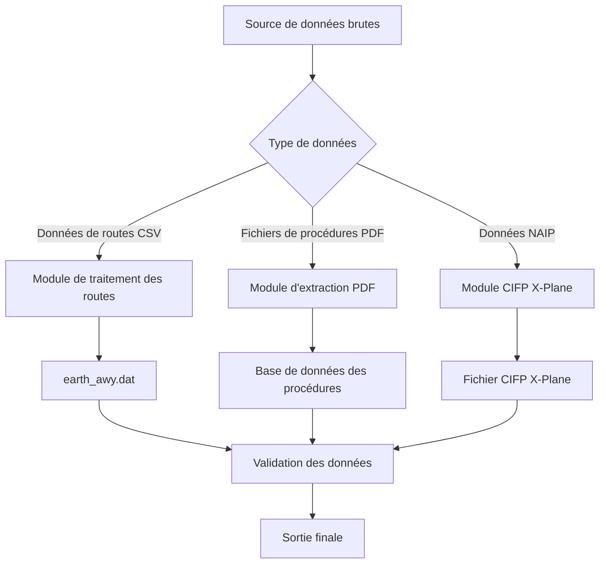

# Instructions d'utilisation

Ce document décrit en détail l'utilisation de l'outil Nav-data pour la conversion de données de navigation aérienne, couvrant le processus complet de la préparation des données à la sortie finale.

## 🗂️ Aperçu du processus de traitement des données

Nav-data comprend trois processus principaux de traitement des données :



## 🛣️ Traitement des données de routes

### Préparation des données

#### 1. Préparation des fichiers d'entrée
Assurez-vous que les fichiers suivants se trouvent dans le répertoire de travail :

```bash
# Fichiers d'entrée requis
RTE_SEG.csv          # Données de segments de routes (format CSV)
earth_fix.dat        # Données de points fixes X-Plane
earth_nav.dat        # Données de balises de navigation X-Plane
earth_awy.dat        # Données de routes X-Plane (sera mis à jour)
```

#### 2. Validation du format de fichier CSV
`RTE_SEG.csv` doit contenir les champs suivants :

| Nom du champ | Description | Exemple |
|--------|------|------|
| `CODE_POINT_START` | Code du point de départ | ABCDE |
| `CODE_TYPE_START` | Type du point de départ | DESIGNATED_POINT |
| `CODE_POINT_END` | Code du point d'arrivée | FGHIJ |
| `CODE_TYPE_END` | Type du point d'arrivée | VOR/DME |
| `CODE_DIR` | Code de direction | N |
| `TXT_DESIG` | Nom de la route | A123 |

### Exécution de la conversion des routes

#### Utilisation de base
```bash
# Accéder au répertoire du module de routes
cd Airway

# Exécuter le script de conversion
python airway.py
```

#### Utilisation avancée
```bash
# Utiliser des paramètres personnalisés
python airway.py --config custom_config.ini

# Spécifier des fichiers d'entrée spécifiques
python airway.py --csv-file /path/to/custom_routes.csv

# Activer les journaux détaillés
python airway.py --verbose

# Traiter uniquement des zones spécifiques
python airway.py --areas ZB,ZG,ZY
```

#### Modification de la configuration dans le script
Pour modifier les paramètres de traitement, éditez `Airway/airway.py` :

```python
# Modifier les zones de filtrage
china_areas = {'ZB', 'ZG', 'ZY', 'ZS', 'ZW', 'ZJ', 'ZP', 'ZL', 'ZH', 'ZU'}

# Modifier les chemins de fichiers
csv_file = 'custom_routes.csv'
earth_fix_path = '/path/to/earth_fix.dat'
earth_nav_path = '/path/to/earth_nav.dat'
earth_awy_path = '/path/to/earth_awy.dat'
```

### Description des fichiers de sortie

Une fois le traitement terminé, le fichier `earth_awy.dat` contiendra :
- Données de routes brutes filtrées
- Nouvelles données de routes de l'espace aérien chinois ajoutées
- Informations de routes au format X-Plane

Exemple de format de sortie :
```
ABCDE  ZB  11 FGHIJ  ZG   3 N  1    0  600 A123
```

## 📄 Extraction de données PDF

### Processus de traitement des données de procédures

#### Processus 1 : Extraction PDF brute
```bash
# Accéder au répertoire d'extraction PDF
cd "PDF extract"

# Exécuter le script d'extraction PDF
python 1_terminal_pdf.py

# Entrée : airport_procedures.pdf
# Sortie : ZXXX_procedure.txt
```

**Exemple d'utilisation :**
```python
# Traitement PDF personnalisé
import pdfplumber
from utils import *

# Ouvrir le fichier PDF
with pdfplumber.open("ZBAA_procedures.pdf") as pdf:
    # Extraire les éléments texte et graphiques
    extracted_data = extract(pdf)
    
    # Enregistrer les résultats de l'extraction
    with open("ZBAA_procedure.txt", "w", encoding="utf-8") as f:
        for line in extracted_data:
            f.write(line + "\n")
```

#### Processus 2 : Encodage de normalisation des données
```bash
# Exécuter le script d'encodage
python 2_terminal_encode.py

# Entrée : ZXXX_procedure.txt
# Sortie : ZXXX_encode.txt
```

**Règles d'encodage :**
- Nettoyer les caractères et formats invalides
- Normaliser les noms de procédures
- Normaliser le format des coordonnées
- Valider l'intégrité des données

#### Processus 3 : Génération du format de base de données
```bash
# Exécuter le script de génération de base de données
python 3_terminal_db.py

# Entrée : ZXXX_encode.txt  
# Sortie : ZXXX_db.txt
```

**Caractéristiques du format de base de données :**
- Séparer les procédures multi-pistes
- Assembler les procédures de transition, remise de gaz et d'attente
- Générer un format compatible X-Plane
- Ajouter l'encodage de description des procédures

#### Processus 4 : Prolifération des procédures (facultatif)
```bash
# Corriger les problèmes d'incohérence des noms de procédures
python 4_程序增殖.py

# Entrée : ZXXX_db.txt
# Sortie : Fichier de procédures corrigé
```

### Processus d'extraction des coordonnées de waypoints

#### Extraction automatique (recommandé)
```bash
# Exécuter l'extraction automatique des coordonnées
python waypoint_1_pdf.py

# Configurer les chemins d'entrée et de sortie
input_pdf = "ZBAA_waypoints.pdf"
output_txt = "ZBAA_waypoint.txt"
```

**Caractéristiques de l'extraction automatique :**
- Reconnaissance intelligente du format des coordonnées
- Gestion automatique de la conversion degrés-minutes-secondes
- Supporte plusieurs mises en page PDF
- Inclut la validation des données

#### Extraction manuelle (solution de repli)
Lorsque la précision de l'extraction automatique n'est pas satisfaisante :

```bash
# Extraire manuellement à l'aide du navigateur Edge
python waypoint_2_edge.py
```

**Étapes de l'extraction manuelle :**
1. Ouvrir le fichier PDF avec Microsoft Edge
2. Cliquer droit pour sélectionner et copier le texte pertinent
3. Enregistrer le texte dans le fichier d'entrée
4. Exécuter le script pour le traitement de formatage

#### Traitement de fichier unique (cas spéciaux)
```bash
# Traiter les fichiers contenant des caractères spéciaux
python debug_single.py

# Applicable pour :
# - Fichiers contenant des caractères spéciaux comme des parenthèses
# - Données nécessitant une correction manuelle
# - Fichiers d'aéroport traités individuellement
```

### Bonnes pratiques de traitement PDF

#### 1. Prétraitement des fichiers PDF
```bash
# Vérifier la qualité du fichier PDF
python -c "
import pdfplumber
with pdfplumber.open('input.pdf') as pdf:
    print(f'Pages : {len(pdf.pages)}')
    print(f'Nombre de lignes de texte sur la première page : {len(pdf.pages[0].extract_text_lines())}')
"
```

#### 2. Traitement par lots
```python
# Traiter par lots plusieurs PDF d'aéroport
import os
from pathlib import Path

pdf_folder = "input_pdfs/"
output_folder = "output_txt/"

for pdf_file in Path(pdf_folder).glob("*.pdf"):
    airport_code = pdf_file.stem[:4]  # Extraire le code ICAO de l'aéroport
    
    # Traiter un fichier unique
    os.system(f"python 1_terminal_pdf.py {pdf_file}")
    os.system(f"python 2_terminal_encode.py {airport_code}_procedure.txt")
    os.system(f"python 3_terminal_db.py {airport_code}_encode.txt")
    
    print(f"Traitement terminé pour : {airport_code}")
```

#### 3. Contrôle qualité
```python
# Valider les résultats de l'extraction
def validate_extraction(output_file):
    with open(output_file, 'r', encoding='utf-8') as f:
        lines = f.readlines()
    
    # Vérifier le format des coordonnées
    coord_pattern = r'\d+\.\d{8}'
    valid_coords = sum(1 for line in lines if re.search(coord_pattern, line))
    
    print(f"Fichier : {output_file}")
    print(f"Nombre total de lignes : {len(lines)}")
    print(f"Nombre de lignes avec coordonnées valides : {valid_coords}")
    print(f"Qualité des données : {valid_coords/len(lines)*100:.1f}%")

# Exemple d'utilisation
validate_extraction("ZBAA_waypoint.txt")
```

## 🔧 Correction des procédures terminales

### Correction de l'encodage des données

#### Utilisation de l'encodeur
```bash
# Accéder au répertoire du module de correction
cd "Terminal Patch"

# Traitement par lots (chemin par défaut)
python terminal_encoder.py

# Traitement avec chemin personnalisé
python terminal_encoder.py "input_folder" "output_folder"

# Exemple
python terminal_encoder.py "PDF extract/public" "PDF extract/encoded"
```

**Fonctionnalités de l'encodeur :**
- Identifier la position des points IF
- Ajouter l'encodage des segments de transition
- Marquer les points clés de la procédure
- Générer des codes de description standard

#### Utilisation de l'outil de correction de format
```bash
# Correction de format par lots (chemin par défaut)
python terminal_reencode.py

# Traitement de fichier unique
python terminal_reencode.py ZBAA.dat ZBAA_fixed.dat

# Spécifier les dossiers d'entrée et de sortie
python terminal_reencode.py "/input/folder" "/output/folder"
```

**Explication des règles de correction :**

1. **Règle GY M pour les lignes APPCH**
   ```
   Avant correction : APPCH ... RW01 ... ... GY M
   Après correction : APPCH ... RW01 ... G GY M
   ```

2. **Règle de la cinquième partie purement alphabétique**
   ```
   Avant correction : SID ... ABC ... ... EY M
   Après correction : SID ... ABC ... D B VY M
   ```

3. **Règle SID RW**
   ```
   Avant correction : SID ... RW25 ... ... EY D
   Après correction : SID ... RW25 ... G GY D
   ```

### Script de correction personnalisé

```python
# Créer un script de correction personnalisé
import re

def custom_fix_procedure(input_file, output_file):
    """Fonction de correction de procédure personnalisée"""
    with open(input_file, 'r', encoding='utf-8') as f:
        lines = f.readlines()
    
    fixed_lines = []
    for line in lines:
        # Appliquer les règles de correction personnalisées
        if line.startswith('APPCH'):
            # Correction personnalisée de la procédure d'approche
            parts = line.split()
            if len(parts) >= 9:
                # Logique de correction
                if parts[8] == 'EY':
                    parts[8] = 'GY'
                line = ' '.join(parts) + '\n'
        
        fixed_lines.append(line)
    
    with open(output_file, 'w', encoding='utf-8') as f:
        f.writelines(fixed_lines)

# Exemple d'utilisation
custom_fix_procedure('ZBAA.dat', 'ZBAA_custom_fixed.dat')
```

## 🛩️ Génération du CIFP X-Plane

### Traitement des équipements de navigation

#### Traitement des données VOR/DME et NDB
```bash
cd "X-Plane CIFP"

# Traiter les données des équipements de navigation
python 1_navaid.py
```

**Configuration des chemins :**
```python
# Modifier la configuration des chemins dans le script
nav路径 = "path/to/earth_nav.dat"
vor路径 = "path/to/VOR.csv"
ndb路径 = "path/to/NDB.csv"
```

**Exigences du format de données CSV :**

Champs de VOR.csv :
- Code ICAO de l'aéroport, nom, fréquence, coordonnées, altitude, etc.

Champs de NDB.csv :
- Code ICAO de l'aéroport, nom, fréquence, coordonnées, altitude, etc.

### Traitement des waypoints

```bash
# Traiter les données de waypoints
python 2_waypoint.py
```

**Exemple de configuration :**
```python
# Modifier la configuration des chemins
naipPath = "path/to/naip/waypoints"
xplanePath = "path/to/xplane/data"
outputPath = "path/to/output/earth_fix.dat"

# Sélectionner la version de X-Plane
forXp11 = False  # True pour X-Plane 11, False pour X-Plane 12
```

### Traitement des procédures terminales

```bash
# Traiter les données des procédures terminales
python 3_terminal.py
```

**Configuration des chemins :**
```python
# Configuration des chemins principaux
inputPath = "path/to/encoded/procedures"
outputFolder = "path/to/cifp/output"
xplanePath = "path/to/xplane/installation"
csvFolder = "path/to/naip/csv/data"
```

**Processus de traitement :**
1. Lire les fichiers de procédures encodés
2. Établir une base de données de waypoints
3. Traiter les procédures SID, STAR, et d'approche
4. Générer les informations de piste
5. Exporter les fichiers au format CIFP

### Modules de fonctions spéciales

#### Extraction de données Fenix
```bash
# Extraire les informations de piste et de MAP dans un format spécifique
python Fenix.py

# Configurer les paramètres
csv_folder = "path/to/csv/data"
procedure_folder = "path/to/procedures"
output_file = "fenix_output.txt"
```

#### Génération de pistes
```bash
# Générer les données relatives aux pistes
python spawn_runway.py

# Ou utiliser la version d'exportation
python 跑道生成导出ver.py
```

## 📊 Validation des données et contrôle qualité

### Script de validation automatique

Créer `validate_output.py` :

```python
#!/usr/bin/env python3
"""
Script de validation des données de sortie
"""
import re
import os
from pathlib import Path

def validate_airway_data(file_path):
    """Valider le format des données de routes"""
    errors = []
    with open(file_path, 'r', encoding='utf-8') as f:
        for line_num, line in enumerate(f, 1):
            line = line.strip()
            if not line or line == "99":
                continue
                
            # Validation du format des routes X-Plane
            parts = line.split()
            if len(parts) < 11:
                errors.append(f"Ligne {line_num} : Nombre insuffisant de champs")
                continue
                
            # Validation de la plage de coordonnées
            try:
                # Ici, ajouter la logique spécifique de validation des coordonnées
                pass
            except ValueError as e:
                errors.append(f"Ligne {line_num} : Erreur de format de coordonnées - {e}")
    
    return errors

def validate_waypoint_data(file_path):
    """Valider le format des données de waypoints"""
    errors = []
    coord_pattern = r'^-?\d+\.\d{8}$'
    
    with open(file_path, 'r', encoding='utf-8') as f:
        for line_num, line in enumerate(f, 1):
            line = line.strip()
            if not line:
                continue
                
            parts = line.split()
            if len(parts) < 3:
                errors.append(f"Ligne {line_num} : Nombre insuffisant de champs")
                continue
                
            # Valider le format des coordonnées
            try:
                lat, lon = float(parts[1]), float(parts[2])
                if not (-90 <= lat <= 90):
                    errors.append(f"Ligne {line_num} : Latitude hors limites")
                if not (-180 <= lon <= 180):
                    errors.append(f"Ligne {line_num} : Longitude hors limites")
            except ValueError:
                errors.append(f"Ligne {line_num} : Erreur de format de coordonnées")
    
    return errors

def validate_cifp_data(file_path):
    """Valider le format des données CIFP"""
    errors = []
    procedure_types = ['SID', 'STAR', 'APPCH']
    
    with open(file_path, 'r', encoding='utf-8') as f:
        for line_num, line in enumerate(f, 1):
            line = line.strip()
            if not line:
                continue
                
            # Vérifier le type de procédure
            if any(line.startswith(ptype) for ptype in procedure_types):
                parts = line.split()
                if len(parts) < 15:
                    errors.append(f"Ligne {line_num} : Champs de format CIFP insuffisants")
    
    return errors

def main():
    """Fonction de validation principale"""
    print("🔍 Validation des données de sortie Nav-data")
    print("=" * 40)
    
    # Configuration de la validation
    validation_config = {
        'earth_awy.dat': validate_airway_data,
        '*.txt': validate_waypoint_data,  # Fichier de waypoints
        '*.dat': validate_cifp_data,      # Fichier CIFP
    }
    
    total_errors = 0
    
    for pattern, validator in validation_config.items():
        if '*' in pattern:
            # Mode caractères génériques
            ext = pattern.split('*')[1]
            files = list(Path('.').glob(f'**/*{ext}'))
        else:
            # Fichier spécifique
            files = [Path(pattern)] if Path(pattern).exists() else []
        
        for file_path in files:
            if file_path.exists():
                print(f"\n📄 Fichier à valider : {file_path}")
                errors = validator(str(file_path))
                
                if errors:
                    print(f"❌ {len(errors)} erreurs trouvées :")
                    for error in errors[:5]:  # N'afficher que les 5 premières erreurs
                        print(f"   - {error}")
                    if len(errors) > 5:
                        print(f"   ... {len(errors) - 5} erreurs supplémentaires")
                    total_errors += len(errors)
                else:
                    print("✅ Validation réussie")
    
    print(f"\n" + "=" * 40)
    if total_errors == 0:
        print("🎉 Toutes les données ont été validées avec succès !")
        return 0
    else:
        print(f"⚠️  {total_errors} problèmes trouvés au total")
        return 1

if __name__ == "__main__":
    exit(main())
```

### Utilisation du script de validation
```bash
# Exécuter la validation
python validate_output.py

# Exemple de sortie
🔍 Validation des données de sortie Nav-data
========================================

📄 Fichier à valider : earth_awy.dat
✅ Validation réussie

📄 Fichier à valider : ZBAA_waypoint.txt
✅ Validation réussie

📄 Fichier à valider : ZBAA.dat
❌ 2 erreurs trouvées :
   - Ligne 15 : Champs de format CIFP insuffisants
   - Ligne 23 : Erreur de format de coordonnées

========================================
⚠️  2 problèmes trouvés au total
```

## 🔧 Flux de travail de traitement par lots

### Création d'un script de traitement par lots

Créer `batch_process.py` :

```python
#!/usr/bin/env python3
"""
Script de traitement par lots Nav-data
"""
import os
import sys
import subprocess
from pathlib import Path
import logging

# Configuration des journaux
logging.basicConfig(level=logging.INFO, format='%(asctime)s - %(levelname)s - %(message)s')
logger = logging.getLogger(__name__)

class BatchProcessor:
    def __init__(self, config):
        self.config = config
        self.processed_count = 0
        self.error_count = 0
    
    def process_airway_data(self):
        """Traitement des données de routes"""
        logger.info("Début du traitement des données de routes...")
        
        try:
            os.chdir('Airway')
            result = subprocess.run(['python', 'airway.py'], 
                                  capture_output=True, text=True)
            
            if result.returncode == 0:
                logger.info("Traitement des données de routes réussi")
                self.processed_count += 1
            else:
                logger.error(f"Échec du traitement des données de routes : {result.stderr}")
                self.error_count += 1
                
        except Exception as e:
            logger.error(f"Exception lors du traitement des données de routes : {e}")
            self.error_count += 1
        finally:
            os.chdir('..')
    
    def process_pdf_data(self, pdf_files):
        """Traitement par lots des données PDF"""
        logger.info(f"Début du traitement de {len(pdf_files)} fichiers PDF...")
        
        os.chdir('PDF extract')
        
        for pdf_file in pdf_files:
            try:
                airport_code = Path(pdf_file).stem[:4]
                logger.info(f"Traitement de l'aéroport : {airport_code}")
                
                # Étape 1 : Extraction PDF
                subprocess.run(['python', '1_terminal_pdf.py', pdf_file], check=True)
                
                # Étape 2 : Encodage
                subprocess.run(['python', '2_terminal_encode.py', 
                              f'{airport_code}_procedure.txt'], check=True)
                
                # Étape 3 : Génération de la base de données
                subprocess.run(['python', '3_terminal_db.py', 
                              f'{airport_code}_encode.txt'], check=True)
                
                logger.info(f"Traitement terminé pour : {airport_code}")
                self.processed_count += 1
                
            except subprocess.CalledProcessError as e:
                logger.error(f"Échec du traitement de {pdf_file} : {e}")
                self.error_count += 1
            except Exception as e:
                logger.error(f"Exception lors du traitement de {pdf_file} : {e}")
                self.error_count += 1
        
        os.chdir('..')
    
    def process_terminal_patch(self):
        """Traitement des correctifs terminaux"""
        logger.info("Début du traitement des correctifs terminaux...")
        
        try:
            os.chdir('Terminal Patch')
            
            # Encodeur
            subprocess.run(['python', 'terminal_encoder.py'], check=True)
            
            # Correction de format
            subprocess.run(['python', 'terminal_reencode.py'], check=True)
            
            logger.info("Traitement des correctifs terminaux réussi")
            self.processed_count += 1
            
        except subprocess.CalledProcessError as e:
            logger.error(f"Échec du traitement des correctifs terminaux : {e}")
            self.error_count += 1
        except Exception as e:
            logger.error(f"Exception lors du traitement des correctifs terminaux : {e}")
            self.error_count += 1
        finally:
            os.chdir('..')
    
    def process_cifp_data(self):
        """Traitement des données CIFP"""
        logger.info("Début du traitement des données CIFP...")
        
        try:
            os.chdir('X-Plane CIFP')
            
            # Équipements de navigation
            subprocess.run(['python', '1_navaid.py'], check=True)
            
            # Waypoints
            subprocess.run(['python', '2_waypoint.py'], check=True)
            
            # Procédures terminales
            subprocess.run(['python', '3_terminal.py'], check=True)
            
            logger.info("Traitement des données CIFP réussi")
            self.processed_count += 1
            
        except subprocess.CalledProcessError as e:
            logger.error(f"Échec du traitement des données CIFP : {e}")
            self.error_count += 1
        except Exception as e:
            logger.error(f"Exception lors du traitement des données CIFP : {e}")
            self.error_count += 1
        finally:
            os.chdir('..')
    
    def run_validation(self):
        """Exécuter la validation des données"""
        logger.info("Début de la validation des données...")
        
        try:
            result = subprocess.run(['python', 'validate_output.py'], 
                                  capture_output=True, text=True)
            
            if result.returncode == 0:
                logger.info("Validation des données réussie")
            else:
                logger.warning(f"Problèmes détectés lors de la validation des données : {result.stdout}")
                
        except Exception as e:
            logger.error(f"Exception lors de la validation des données : {e}")
    
    def generate_report(self):
        """Générer un rapport de traitement"""
        total = self.processed_count + self.error_count
        success_rate = (self.processed_count / total * 100) if total > 0 else 0
        
        report = f"""
Rapport de traitement par lots Nav-data
========================
Nombre total de tâches : {total}
Nombre de succès : {self.processed_count}
Nombre d'échecs : {self.error_count}
Taux de succès : {success_rate:.1f}%

Veuillez consulter la sortie de la console pour les journaux détaillés.
        """
        
        logger.info(report)
        
        # Enregistrer le rapport dans un fichier
        with open('batch_process_report.txt', 'w', encoding='utf-8') as f:
            f.write(report)

def main():
    """Fonction principale"""
    config = {
        'pdf_folder': 'input_pdfs/',
        'enable_validation': True,
        'generate_report': True
    }
    
    processor = BatchProcessor(config)
    
    # Rechercher les fichiers PDF
    pdf_files = list(Path(config['pdf_folder']).glob('*.pdf')) if Path(config['pdf_folder']).exists() else []
    
    # Exécuter le processus de traitement
    try:
        # 1. Traitement des données de routes
        if Path('Airway/RTE_SEG.csv').exists():
            processor.process_airway_data()
        
        # 2. Traitement des données PDF
        if pdf_files:
            processor.process_pdf_data(pdf_files)
        
        # 3. Traitement des correctifs terminaux
        processor.process_terminal_patch()
        
        # 4. Traitement des données CIFP
        processor.process_cifp_data()
        
        # 5. Validation des données
        if config['enable_validation']:
            processor.run_validation()
        
        # 6. Génération du rapport
        if config['generate_report']:
            processor.generate_report()
            
    except KeyboardInterrupt:
        logger.info("Traitement interrompu par l'utilisateur")
    except Exception as e:
        logger.error(f"Exception lors du traitement par lots : {e}")
    
    logger.info("Traitement par lots terminé")

if __name__ == "__main__":
    main()
```

### Utilisation du traitement par lots
```bash
# Exécuter le traitement par lots
python batch_process.py

# Exemple de sortie
2025-01-23 10:00:00 - INFO - Début du traitement des données de routes...
2025-01-23 10:01:30 - INFO - Traitement des données de routes réussi
2025-01-23 10:01:30 - INFO - Début du traitement de 5 fichiers PDF...
2025-01-23 10:02:00 - INFO - Traitement de l'aéroport : ZBAA
2025-01-23 10:03:15 - INFO - Traitement terminé pour : ZBAA
...
2025-01-23 10:15:00 - INFO - Traitement par lots terminé
```

## ❓ Foire Aux Questions (FAQ)

### Q1 : Pourquoi la conversion des routes échoue-t-elle ?
**R :** Causes courantes et solutions :

1. **Erreur de format de fichier CSV**
   ```bash
   # Vérifier l'encodage du fichier CSV
   file -I RTE_SEG.csv
   
   # Convertir l'encodage (si nécessaire)
   iconv -f gbk -t utf-8 RTE_SEG.csv > RTE_SEG_utf8.csv
   ```

2. **Champs requis manquants**
   ```python
   # Valider les champs CSV
   import pandas as pd
   df = pd.read_csv('RTE_SEG.csv')
   required_fields = ['CODE_POINT_START', 'CODE_TYPE_START', 'CODE_POINT_END', 
                     'CODE_TYPE_END', 'CODE_DIR', 'TXT_DESIG']
   missing_fields = [f for f in required_fields if f not in df.columns]
   print(f"Champs manquants : {missing_fields}")
   ```

3. **Fichiers de données de référence introuvables**
   ```bash
   # Vérifier si les fichiers existent
   ls -la earth_fix.dat earth_nav.dat earth_awy.dat
   ```

### Q2 : Que faire si la précision de l'extraction PDF n'est pas optimale ?
**R :** Essayez les solutions suivantes :

1. **Utiliser la méthode d'extraction manuelle**
   ```bash
   python waypoint_2_edge.py
   ```

2. **Ajuster les paramètres de traitement PDF**
   ```python
   # Ajuster dans waypoint_1_pdf.py
   crop_margin = 50  # Augmenter la marge de rognage
   text_confidence = 0.8  # Diminuer le seuil de confiance du texte
   ```

3. **Prétraiter les fichiers PDF**
   - Assurez-vous que le PDF est au format texte et non une image scannée
   - Utiliser un éditeur PDF pour optimiser la qualité du fichier
   - Supprimer les éléments graphiques inutiles

### Q3 : Comment corriger les erreurs d'encodage des procédures ?
**R :** Utiliser les outils de correction :

1. **Correction automatique**
   ```bash
   cd "Terminal Patch"
   python terminal_reencode.py
   ```

2. **Vérification et correction manuelles**
   ```python
   # Vérifier le format de la procédure
   with open('ZBAA.dat', 'r') as f:
       for i, line in enumerate(f, 1):
           if 'APPCH' in line:
               parts = line.split()
               if len(parts) < 15:
                   print(f"Ligne {i} format incomplet : {line.strip()}")
   ```

### Q4 : X-Plane ne reconnaît pas les données générées ?
**R :** Vérifiez les éléments suivants :

1. **Exactitude du chemin du fichier**
   ```bash
   # X-Plane 11
   ls "$XPLANE_PATH/Custom Data/"
   
   # X-Plane 12
   ls "$XPLANE_PATH/Output/FMS plans/"
   ```

2. **Compatibilité du format de fichier**
   ```python
   # Vérifier l'encodage du fichier
   with open('earth_awy.dat', 'rb') as f:
       raw = f.read(100)
       print(f"Détection de l'encodage du fichier : {raw}")
   ```

3. **Intégrité des données**
   ```bash
   # Vérifier si le fichier se termine par "99"
   tail -n 5 earth_awy.dat
   ```

### Q5 : Mémoire insuffisante lors du traitement de fichiers volumineux ?
**R :** Optimiser l'utilisation de la mémoire :

1. **Augmenter la mémoire virtuelle**
   ```bash
   # Système Linux
   sudo swapon --show
   sudo fallocate -l 4G /swapfile
   sudo mkswap /swapfile
   sudo swapon /swapfile
   ```

2. **Traitement par lots**
   ```python
   # Modifier la taille du lot
   BATCH_SIZE = 500  # Réduire la taille du lot
   ```

3. **Nettoyer la mémoire**
   ```python
   import gc
   # Ajouter dans la boucle de traitement
   gc.collect()
   ```

### Q6 : Problèmes de précision des coordonnées ?
**R :** Améliorer la précision du traitement des coordonnées :

1. **Ajuster les paramètres de précision**
   ```python
   COORDINATE_PRECISION = 8  # Maintenir une précision de 8 décimales
   ```

2. **Valider la plage de coordonnées**
   ```python
   # Plage de coordonnées pour la région chinoise
   LAT_MIN, LAT_MAX = 15.0, 55.0
   LON_MIN, LON_MAX = 70.0, 140.0
   ```

3. **Utiliser des calculs de haute précision**
   ```python
   from decimal import Decimal, getcontext
   getcontext().prec = 12  # Définir une haute précision
   ```

### Q7 : Comment mettre à jour les données AIRAC ?
**R :** Processus de mise à jour des données AIRAC :

1. **Calcul automatique du cycle actuel**
   ```python
   from datetime import datetime
   # L'outil calcule automatiquement le cycle AIRAC actuel
   current_cycle = get_current_airac_cycle()
   print(f"Cycle AIRAC actuel : {current_cycle}")
   ```

2. **Spécifier le cycle manuellement**
   ```python
   # Spécifier dans la configuration
   manual_cycle = "2504"  # 4ème cycle de 2025
   ```

3. **Vérifier la validité des données**
   ```bash
   # Vérifier les informations AIRAC des données sources
   grep -i "airac" *.csv
   ```

### Q8 : Comment contribuer au code ou signaler un problème ?
**R :** Participer au développement du projet :

1. **Signaler un problème**
   - Soumettre un problème détaillé sur GitHub
   - Inclure les messages d'erreur et les étapes de reproduction
   - Fournir les fichiers d'entrée pertinents (si possible)

2. **Contribuer au code**
   - Forker le dépôt du projet
   - Créer une branche de fonctionnalité
   - Soumettre une Pull Request

3. **Améliorer la documentation**
   - Signaler les erreurs de documentation
   - Fournir des exemples d'utilisation
   - Traduire la documentation

---

**Bonne utilisation !** ✈️ Si vous rencontrez d'autres problèmes, veuillez consulter les problèmes GitHub du projet ou créer un nouveau rapport de problème.