# Architekturübersicht

Dieses Dokument beschreibt detailliert die Systemarchitektur, die technischen Prinzipien und die Designkonzepte des Nav-data-Projekts.

## 🏗️ Gesamtarchitektur

Nav-data verwendet ein modulares Design und besteht aus vier Kernmodulen, die jeweils unabhängig voneinander ausgeführt und flexibel kombiniert werden können.


## 📋 Designprinzipien

### 1. Modulares Design
- **Unabhängigkeit**: Jedes Modul kann unabhängig ausgeführt werden und ist nicht stark von anderen Modulen abhängig.
- **Kombinierbarkeit**: Module können flexibel kombiniert werden, um verschiedene Verarbeitungsworkflows zu bilden.
- **Erweiterbarkeit**: Neue Module können nahtlos in die bestehende Architektur integriert werden.

### 2. Datenflussgesteuert
- **Unidirektionaler Datenfluss**: Daten fließen von der Quelle zum Ziel, um zirkuläre Abhängigkeiten zu vermeiden.
- **Speicherung von Zwischenzuständen**: Jeder Verarbeitungsschritt speichert Zwischenergebnisse, was das Debugging und die Wiederherstellung erleichtert.
- **Formatstandardisierung**: Einheitliche Datenformatspezifikationen gewährleisten die Kompatibilität zwischen Modulen.

### 3. Fehlertoleranz und Wiederherstellung
- **Schrittweise Verarbeitung**: Komplexe Aufgaben werden in mehrere kleine Schritte zerlegt, um das Fehlerrisiko zu minimieren.
- **Fehlerisolation**: Der Fehler bei der Verarbeitung einer einzelnen Datei beeinträchtigt nicht die gesamte Stapelverarbeitungsaufgabe.
- **Zustandsspeicherung**: Kritische Zustandsinformationen werden persistent gespeichert, um die Fortsetzung nach Unterbrechung zu unterstützen.

### 4. Leistungsoptimierung
- **Speichereffizient**: Stream-Verarbeitung großer Dateien zur Vermeidung von Speicherüberläufen.
- **Stapelverarbeitung**: Stapelverarbeitung zur Verbesserung der I/O-Effizienz.
- **Parallelitätsunterstützung**: Unterstützung von paralleler Verarbeitung mit mehreren Threads/Prozessen.

## 🛠️ Architektur der Kernmodule

### Airway-Verarbeitungsmodul (Airway)

```mermaid
graph TD
    A[CSV-Eingabe] --> B{Datenvalidierung}
    B -->|Validierung erfolgreich| C[Parsen von CSV-Feldern]
    B -->|Validierung fehlgeschlagen| X[Fehlerbehandlung]
    
    C --> D[Referenzdaten laden]
    D --> E[earth_fix.dat]
    D --> F[earth_nav.dat]
    
    E --> G[Navigationspunkt-Abgleich]
    F --> G
    C --> G
    
    G --> H{Regionsfilterung}
    H -->|Chinesischer Luftraum| I[Generierung von Airway-Segmenten]
    H -->|Andere Regionen| J[Verarbeitung überspringen]
    
    I --> K[Formatkonvertierung]
    K --> L[X-Plane DAT-Format]
    L --> M[Ausgabe zusammenführen]
    M --> N[earth_awy.dat]
```



**Technische Merkmale:**
- **Datenabgleichsalgorithmus**: Intelligenter Abgleich basierend auf Identifikatoren und Koordinaten.
- **Regionsfiltermechanismus**: Unterstützt flexible Konfigurationen für geografische Regionsfilter.
- **Formatkonvertierungs-Engine**: Präzise Konvertierung vom CSV- ins X-Plane DAT-Format.
- **AIRAC-Zyklusmanagement**: Automatische Berechnung und Verwaltung des Gültigkeitszeitraums von Luftfahrtdaten.

**Kernklassen und -schnittstellen:**
```python
class NavigationType(Enum):
    """导航点类型枚举"""
    DESIGNATED_POINT = ('DESIGNATED_POINT', '11')
    VORDME = ('VORDME', '3') 
    NDB = ('NDB', '2')

@dataclass
class NavigationPoint:
    """导航点数据结构"""
    identifier: str
    type: NavigationType
    area_code: str

def process_navigation_point(identifier: str, code_type: str, 
                           earth_fix_data: Dict, earth_nav_data: Dict) -> Optional[NavigationPoint]:
    """导航点处理核心算法"""
    pass

def convert_csv_to_dat(csv_file: str, earth_fix_path: str, 
                      earth_nav_path: str, earth_awy_path: str) -> None:
    """主要转换函数"""
    pass
```

### PDF-Extraktionsmodul (PDF Extract)

```mermaid
graph TD
    A[PDF-Eingabe] --> B[PDF-Parsing-Engine]
    B --> C{Inhaltstyp}
    
    C -->|Prozedurdaten| D[Extraktion von Terminalprozeduren]
    C -->|Koordinatendaten| E[Wegpunkt-Extraktion]
    
    D --> F[Textstrukturanalyse]
    F --> G[Prozedursegment-Erkennung]
    G --> H[Formatstandardisierung]
    H --> I[Prozedurdatenausgabe]
    
    E --> J[Koordinatenformat-Erkennung]
    J --> K[Grad-Minuten-Sekunden-Konvertierung]
    K --> L[Präzisionsverarbeitung]
    L --> M[Koordinadatenausgabe]
    
    I --> N[Datenvalidierung]
    M --> N
    N --> O[Qualitätsbericht]
```



**Technische Merkmale:**
- **Mehrstufiges Parsing**: Unterstützung für verschiedene PDF-Elemente wie Text, Linien und Tabellen.
- **Intelligente Erkennung**: Automatische Erkennung von Koordinatenformaten und Prozedurstrukturen.
- **Fehlertoleranzmechanismus**: Behandlung von inkonsistenten PDF-Formaten und fehlenden Daten.
- **Qualitätskontrolle**: Integrierte Datenqualitätsprüfung und Berichtsmechanismus.

**Kernkomponenten:**
```python
class Line:
    """线条元素类"""
    def __init__(self, line: dict):
        self.is_horizontal = True if line["width"] > 5 else False
        self.top = line["top"]
        self.left = line["x0"]
        self.length = line["width"] if self.is_horizontal else line["height"]

class Word:
    """文本元素类"""
    def __init__(self, info: dict):
        self.content = info["text"]
        self.center = ((info["x0"] + info["x1"]) / 2, (info["top"] + info["bottom"]) / 2)

class Unit:
    """处理单元类"""
    def __init__(self):
        self.words = []
        self.lines = []
    
    def match_underline(self):
        """下划线匹配算法"""
        pass

def extract(pdf: pdfplumber.PDF) -> List[str]:
    """PDF 提取主函数"""
    pass
```

### Terminal-Patch-Modul (Terminal Patch)

```mermaid
graph TD
    A[Tdatabase-Eingabe] --> B[Formatprüfung]
    B --> C{Kodierungstyp}
    
    C -->|Kodierung erforderlich| D[Terminal-Encoder]
    C -->|Reparatur erforderlich| E[Format-Korrektur]
    
    D --> F[IF-Punkt-Erkennung]
    F --> G[Übergangssegment-Markierung]
    G --> H[Prozedurkodierung]
    H --> I[Kodierte Ausgabe]
    
    E --> J[Regelabgleich]
    J --> K{Reparaturregeln}
    K -->|APPCH GY M| L[Anflugreparatur]
    K -->|纯字母规则| M[Identifikatorreparatur]
    K -->|SID RW 规则| N[Abflugreparatur]
    
    L --> O[Reparatur-Ausgabe]
    M --> O
    N --> O
    
    I --> P[Qualitätsvalidierung]
    O --> P
    P --> Q[Endgültige Ausgabe]
```



**Technische Merkmale:**
- **Regel-Engine**: Konfigurationsbasierte Reparaturregel-Engine.
- **Mustererkennung**: Intelligente Erkennung verschiedener Prozedur- und Identifikatortypen.
- **Stapelverarbeitung**: Unterstützung für Stapelreparaturen auf Ordnerebene.
- **Abwärtskompatibilität**: Aufrechterhaltung der Kompatibilität mit bestehenden Datenformaten.

**Reparaturregelsystem:**
```python
class FixRule:
    """修复规则基类"""
    def __init__(self, name: str, pattern: str, action: callable):
        self.name = name
        self.pattern = pattern
        self.action = action
    
    def apply(self, line: str) -> str:
        """应用修复规则"""
        pass

class RuleEngine:
    """规则引擎"""
    def __init__(self):
        self.rules = []
    
    def add_rule(self, rule: FixRule):
        """添加修复规则"""
        self.rules.append(rule)
    
    def apply_rules(self, content: str) -> str:
        """应用所有规则"""
        pass

# 预定义修复规则
APPCH_GY_M_RULE = FixRule(
    name="APPCH_GY_M",
    pattern=r"APPCH.*GY M",
    action=lambda line: fix_appch_gy_m(line)
)
```

### X-Plane CIFP-Modul (X-Plane CIFP)

```mermaid
graph TD
    A[Mehrfachquelleneingabe] --> B{Datentyp}
    B -->|Navigationsausrüstung| C[NavAid-Prozessor]
    B -->|Wegpunkt| D[Waypoint-Prozessor]
    B -->|Terminalprozeduren| E[Terminal-Prozessor]
    
    C --> F[VOR/NDB-Konvertierung]
    F --> G[Frequenzverarbeitung]
    G --> H[Koordinatenkonvertierung]
    H --> I[NavAid-Ausgabe]
    
    D --> J[Wegpunktdatenbank]
    J --> K[Deduplizierungsverarbeitung]
    K --> L[Gebietscodierung]
    L --> M[Waypoint-Ausgabe]
    
    E --> N[Prozedurparsing]
    N --> O[SID/STAR/APPCH]
    O --> P[Flugabschnittscodierung]
    P --> Q[Generierung von Landebahninformationen]
    Q --> R[CIFP-Ausgabe]
    
    I --> S[Datenintegration]
    M --> S
    R --> S
    S --> T[X-Plane Kompatibilitätsprüfung]
    T --> U[Endgültige CIFP-Datei]
```



**Technische Merkmale:**
- **Multi-Source-Datenintegration**: Integration mehrerer Datenquellen wie NAIP und X-Plane-Rohdaten.
- **Intelligente Deduplizierung**: Intelligenter Deduplizierungsalgorithmus basierend auf Koordinaten und Identifikatoren.
- **Versionskompatibilität**: Unterstützung für X-Plane 11- und X-Plane 12-Formate.
- **Datenintegrität**: Sicherstellung, dass die generierten CIFP-Daten vollständig sind und den Standards entsprechen.

**Kerndatenstrukturen:**
```python
class Waypoint:
    """航路点类"""
    def __init__(self, la: float, long: float, ident: str, cat: int, 
                 airport: str = '', area: str = '', changeable: bool = True):
        self.latitude = la
        self.longitude = long
        self.ident = ident
        self.cat = cat  # -1:不可用 1:航路点 2:VHF 3:NDB
        self.airport = airport
        self.area = area
        self.changeable = changeable
    
    def is_same(self, fix: "Waypoint", change: bool = False) -> bool:
        """判断是否为相同航路点"""
        pass

class WaypointSystem:
    """航路点管理系统"""
    def __init__(self):
        self.base = {}  # 主数据库
    
    def add_point(self, point: Waypoint):
        """添加航路点"""
        pass
    
    def query(self, point: Waypoint, change: bool = False) -> int:
        """查询航路点"""
        pass

class Procedure:
    """程序类"""
    def __init__(self, ptype: int):
        self.ptype = "SID" if ptype == 1 else ("STAR" if ptype == 2 else "APPCH")
        self.airport = None
        self.runway = None
        self.name = None
        self.legs = []
    
    def encode(self):
        """程序编码"""
        pass
    
    def output(self) -> str:
        """输出 CIFP 格式"""
        pass
```

## 🔄 Datenflussarchitektur

### Datenflussdiagramm

```mermaid
flowchart LR
    subgraph "Quelldaten"
        A1[NAIP CSV]
        A2[PDF-Dateien]
        A3[X-Plane-Daten]
    end
    
    subgraph "Vorverarbeitung"
        B1[CSV-Parsing]
        B2[PDF-Extraktion]
        B3[Datenladen]
    end
    
    subgraph "Kernverarbeitung"
        C1[Airway-Konvertierung]
        C2[Prozedurstandardisierung]
        C3[Formatkorrektur]
        C4[CIFP-Generierung]
    end
    
    subgraph "Nachverarbeitung"
        D1[Datenvalidierung]
        D2[Formatprüfung]
        D3[Qualitätskontrolle]
    end
    
    subgraph "Ausgabe"
        E1[DAT-Dateien]
        E2[Datenbankdateien]
        E3[CIFP-Dateien]
    end
    
    A1 --> B1 --> C1 --> D1 --> E1
    A2 --> B2 --> C2 --> D2 --> E2
    A3 --> B3 --> C4 --> D3 --> E3
    C2 --> C3 --> D2
```



### Datenformat-Konvertierungskette

```mermaid
graph TD
    A[Original-PDF] -->|pdfplumber| B[Strukturierter Text]
    B -->|Parser| C[Prozedurabschnitte]
    C -->|Encoder| D[Standardisierte Prozeduren]
    D -->|Korrektor| E[CIFP-kompatibles Format]
    
    F[NAIP CSV] -->|pandas| G[Datentabelle]
    G -->|Validator| H[Gültige Datensätze]
    H -->|Konverter| I[X-Plane DAT]
    
    J[Native X-Plane-Daten] -->|Lader| K[Referenzdaten]
    K -->|Matcher| L[Assoziierte Informationen]
    L -->|Integrator| M[Vollständiger Datensatz]
```



## ⚙️ Technologie-Stack-Architektur

### Kerntechnologiekomponenten

```mermaid
graph TB
    subgraph "Programmiersprache"
        A1[Python 3.6+]
    end
    
    subgraph "Datenverarbeitung"
        B1[pandas - Datenanalyse]
        B2[numpy - Numerische Berechnungen]
        B3[csv - CSV-Verarbeitung]
    end
    
    subgraph "PDF-Verarbeitung"
        C1[pdfplumber - PDF-Parsing]
        C2[Reguläre Ausdrücke - Musterabgleich]
    end
    
    subgraph "Geografische Berechnungen"
        D1[geopy - Berechnung geografischer Distanzen]
        D2[Koordinatenkonvertierungsalgorithmus]
    end
    
    subgraph "Benutzeroberfläche"
        E1[tqdm - Fortschrittsanzeige]
        E2[colorama - Farbige Ausgabe]
        E3[logging - Log-System]
    end
    
    subgraph "Datenbank"
        F1[sqlite3 - Leichtgewichtige Datenbank]
        F2[Dateisystem - Datenpersistenz]
    end
    
    A1 --> B1
    A1 --> B2
    A1 --> C1
    A1 --> D1
    A1 --> E1
    A1 --> F1
```



### Abhängigkeitsmanagement

```python
# requirements.txt 依赖层次
# Kernabhängigkeiten
pandas>=1.3.0          # Grundlagen der Datenverarbeitung
numpy>=1.21.0          # Grundlagen der numerischen Berechnung

# PDF-Verarbeitung
pdfplumber>=0.7.0      # PDF-Parsing-Engine

# Benutzererfahrung
tqdm>=4.60.0           # Fortschrittsanzeige
colorama>=0.4.4        # Farbige Ausgabe

# Geografische Berechnungen
geopy>=2.2.0           # Berechnung geografischer Distanzen

# Chinesisch-Verarbeitung
pypinyin>=0.44.0       # Konvertierung von chinesischen Schriftzeichen in Pinyin

# Entwicklungstools (optional)
pytest>=6.0.0          # Test-Framework
black>=21.0.0          # Code-Formatierung
flake8>=3.9.0          # Code-Prüfung
```

## 🏛️ Designmuster

### 1. Factory-Muster (Factory Pattern)
Zur Erstellung verschiedener Arten von Datenprozessoren:

```python
class ProcessorFactory:
    """数据处理器工厂"""
    
    @staticmethod
    def create_processor(data_type: str):
        if data_type == "airway":
            return AirwayProcessor()
        elif data_type == "pdf":
            return PDFProcessor()
        elif data_type == "terminal":
            return TerminalProcessor()
        elif data_type == "cifp":
            return CIFPProcessor()
        else:
            raise ValueError(f"Unknown processor type: {data_type}")

# Anwendungsbeispiel
processor = ProcessorFactory.create_processor("airway")
result = processor.process(input_data)
```

### 2. Strategy-Muster (Strategy Pattern)
Zur Implementierung verschiedener Datenkonvertierungsstrategien:

```python
class ConversionStrategy:
    """转换策略接口"""
    def convert(self, data): pass

class CSVToDAT(ConversionStrategy):
    """CSV 到 DAT 转换策略"""
    def convert(self, csv_data):
        # CSV-Konvertierungslogik
        pass

class PDFToText(ConversionStrategy):
    """PDF 到文本转换策略"""
    def convert(self, pdf_data):
        # PDF-Konvertierungslogik
        pass

class DataConverter:
    """数据转换器"""
    def __init__(self, strategy: ConversionStrategy):
        self.strategy = strategy
    
    def convert(self, data):
        return self.strategy.convert(data)
```

### 3. Observer-Muster (Observer Pattern)
Zur Implementierung der Überwachung des Verarbeitungsfortschritts:

```python
class ProgressObserver:
    """进度观察者接口"""
    def update(self, progress: float, message: str): pass

class ConsoleProgressObserver(ProgressObserver):
    """控制台进度显示"""
    def update(self, progress: float, message: str):
        print(f"Progress: {progress:.1%} - {message}")

class TqdmProgressObserver(ProgressObserver):
    """tqdm 进度条显示"""
    def __init__(self):
        self.pbar = None
    
    def update(self, progress: float, message: str):
        if self.pbar:
            self.pbar.set_description(message)
            self.pbar.update()

class DataProcessor:
    """数据处理器基类"""
    def __init__(self):
        self.observers = []
    
    def add_observer(self, observer: ProgressObserver):
        self.observers.append(observer)
    
    def notify_progress(self, progress: float, message: str):
        for observer in self.observers:
            observer.update(progress, message)
```

### 4. Chain of Responsibility-Muster (Chain of Responsibility)
Zur Implementierung einer Datenvalidierungskette:

```python
class ValidationHandler:
    """验证处理器接口"""
    def __init__(self):
        self.next_handler = None
    
    def set_next(self, handler):
        self.next_handler = handler
        return handler
    
    def handle(self, data):
        result = self.validate(data)
        if result and self.next_handler:
            return self.next_handler.handle(data)
        return result
    
    def validate(self, data):
        pass

class FormatValidator(ValidationHandler):
    """格式验证器"""
    def validate(self, data):
        # Formatvalidierungslogik
        return True

class RangeValidator(ValidationHandler):
    """范围验证器"""
    def validate(self, data):
        # Bereichvalidierungslogik
        return True

class IntegrityValidator(ValidationHandler):
    """完整性验证器"""
    def validate(self, data):
        # Integritätsvalidierungslogik
        return True

# Validierungskette aufbauen
format_validator = FormatValidator()
range_validator = RangeValidator()
integrity_validator = IntegrityValidator()

format_validator.set_next(range_validator).set_next(integrity_validator)

# Validierungskette verwenden
is_valid = format_validator.handle(input_data)
```

## 📊 Leistungsarchitektur

### Speicherverwaltungsstrategien

```mermaid
graph TD
    A[Große Dateieingabe] --> B{Dateigröße}
    B -->|Kleiner als Schwellenwert| C[Direkt laden]
    B -->|Überschreitet Schwellenwert| D[Stream-Verarbeitung]
    
    C --> E[Speicherverarbeitung]
    D --> F[Blockweises Lesen]
    F --> G[Stapelverarbeitung]
    G --> H[Inkrementelle Ausgabe]
    
    E --> I[Garbage Collection]
    H --> I
    I --> J[Speicherfreigabe]
```



**Speicheroptimierungsstrategien:**
```python
import gc
from typing import Iterator, List

class MemoryEfficientProcessor:
    """内存高效的数据处理器"""
    
    def __init__(self, chunk_size: int = 1000):
        self.chunk_size = chunk_size
    
    def process_large_file(self, file_path: str) -> Iterator[List]:
        """分块处理大文件"""
        chunk = []
        with open(file_path, 'r', encoding='utf-8') as f:
            for line in f:
                chunk.append(line.strip())
                
                if len(chunk) >= self.chunk_size:
                    yield self.process_chunk(chunk)
                    chunk.clear()
                    gc.collect()  # Erzwingen der Garbage Collection
            
            if chunk:  # Verbleibende Daten verarbeiten
                yield self.process_chunk(chunk)
    
    def process_chunk(self, chunk: List[str]) -> List[str]:
        """处理单个数据块"""
        # Datenverarbeitungslogik
        return [self.process_line(line) for line in chunk]
    
    def process_line(self, line: str) -> str:
        """处理单行数据"""
        # Spezifische Verarbeitungslogik
        return line
```

### Architektur für parallele Verarbeitung

```python
import concurrent.futures
from multiprocessing import Pool
import threading

class ConcurrentProcessor:
    """并发数据处理器"""
    
    def __init__(self, max_workers: int = 4):
        self.max_workers = max_workers
    
    def process_files_threaded(self, file_list: List[str]) -> List:
        """多线程处理文件列表"""
        with concurrent.futures.ThreadPoolExecutor(max_workers=self.max_workers) as executor:
            # Aufgaben übermitteln
            future_to_file = {
                executor.submit(self.process_single_file, file): file 
                for file in file_list
            }
            
            results = []
            for future in concurrent.futures.as_completed(future_to_file):
                file = future_to_file[future]
                try:
                    result = future.result()
                    results.append(result)
                except Exception as exc:
                    print(f'File {file} generated an exception: {exc}')
            
            return results
    
    def process_files_multiprocess(self, file_list: List[str]) -> List:
        """多进程处理文件列表"""
        with Pool(processes=self.max_workers) as pool:
            results = pool.map(self.process_single_file, file_list)
        return results
    
    def process_single_file(self, file_path: str):
        """处理单个文件"""
        # Dateiverarbeitungslogik
        pass
```

### Cache-Architektur

```python
import functools
import hashlib
import pickle
from pathlib import Path

class CacheManager:
    """缓存管理器"""
    
    def __init__(self, cache_dir: str = "cache"):
        self.cache_dir = Path(cache_dir)
        self.cache_dir.mkdir(exist_ok=True)
    
    def get_cache_key(self, *args, **kwargs) -> str:
        """生成缓存键"""
        content = str(args) + str(sorted(kwargs.items()))
        return hashlib.md5(content.encode()).hexdigest()
    
    def get(self, key: str):
        """获取缓存"""
        cache_file = self.cache_dir / f"{key}.cache"
        if cache_file.exists():
            with open(cache_file, 'rb') as f:
                return pickle.load(f)
        return None
    
    def set(self, key: str, value):
        """设置缓存"""
        cache_file = self.cache_dir / f"{key}.cache"
        with open(cache_file, 'wb') as f:
            pickle.dump(value, f)
    
    def cached(self, ttl: int = 3600):
        """缓存装饰器"""
        def decorator(func):
            @functools.wraps(func)
            def wrapper(*args, **kwargs):
                cache_key = self.get_cache_key(func.__name__, *args, **kwargs)
                result = self.get(cache_key)
                
                if result is None:
                    result = func(*args, **kwargs)
                    self.set(cache_key, result)
                
                return result
            return wrapper
        return decorator

# Anwendungsbeispiel
cache_manager = CacheManager()

@cache_manager.cached(ttl=3600)
def expensive_processing(data):
    """耗时的数据处理函数"""
    # Komplexe Verarbeitungslogik
    return processed_data
```

## 🔒 Sicherheitsarchitektur

### Eingabevalidierungsschicht

```python
import re
from pathlib import Path
from typing import Any, Dict

class InputValidator:
    """输入验证器"""
    
    # Sichere Dateierweiterungen
    SAFE_EXTENSIONS = {'.csv', '.dat', '.txt', '.pdf'}
    
    # Pfadlimitierungsmuster
    SAFE_PATH_PATTERN = re.compile(r'^[a-zA-Z0-9._/\-\s]+$')
    
    @classmethod
    def validate_file_path(cls, file_path: str) -> bool:
        """验证文件路径安全性"""
        path = Path(file_path)
        
        # Dateierweiterung prüfen
        if path.suffix.lower() not in cls.SAFE_EXTENSIONS:
            raise ValueError(f"Unsafe file extension: {path.suffix}")
        
        # Pfadzeichen prüfen
        if not cls.SAFE_PATH_PATTERN.match(file_path):
            raise ValueError(f"Unsafe characters in path: {file_path}")
        
        # Pfad-Traversal-Angriff prüfen
        if '..' in file_path or file_path.startswith('/'):
            raise ValueError(f"Path traversal detected: {file_path}")
        
        return True
    
    @classmethod
    def validate_coordinate(cls, lat: float, lon: float) -> bool:
        """验证坐标范围"""
        if not (-90 <= lat <= 90):
            raise ValueError(f"Invalid latitude: {lat}")
        
        if not (-180 <= lon <= 180):
            raise ValueError(f"Invalid longitude: {lon}")
        
        return True
    
    @classmethod
    def sanitize_string(cls, input_str: str) -> str:
        """清理输入字符串"""
        # Potenziell gefährliche Zeichen entfernen
        sanitized = re.sub(r'[<>"\';\\]', '', input_str)
        # Länge begrenzen
        return sanitized[:1000]
```

### Fehlerbehandlungsarchitektur

```python
import logging
from enum import Enum
from typing import Optional

class ErrorLevel(Enum):
    """错误级别"""
    WARNING = "WARNING"
    ERROR = "ERROR"
    CRITICAL = "CRITICAL"

class NavDataError(Exception):
    """Nav-data 自定义异常基类"""
    def __init__(self, message: str, error_code: str = None, level: ErrorLevel = ErrorLevel.ERROR):
        super().__init__(message)
        self.message = message
        self.error_code = error_code
        self.level = level

class FileProcessingError(NavDataError):
    """文件处理异常"""
    pass

class DataValidationError(NavDataError):
    """数据验证异常"""
    pass

class ErrorHandler:
    """错误处理器"""
    
    def __init__(self):
        self.logger = logging.getLogger(__name__)
    
    def handle_error(self, error: Exception, context: Optional[Dict] = None):
        """处理异常"""
        if isinstance(error, NavDataError):
            self.handle_nav_data_error(error, context)
        else:
            self.handle_unexpected_error(error, context)
    
    def handle_nav_data_error(self, error: NavDataError, context: Optional[Dict] = None):
        """处理自定义异常"""
        log_message = f"[{error.error_code}] {error.message}"
        if context:
            log_message += f" Context: {context}"
        
        if error.level == ErrorLevel.WARNING:
            self.logger.warning(log_message)
        elif error.level == ErrorLevel.ERROR:
            self.logger.error(log_message)
        elif error.level == ErrorLevel.CRITICAL:
            self.logger.critical(log_message)
            # Möglicherweise muss die Programmausführung gestoppt werden
    
    def handle_unexpected_error(self, error: Exception, context: Optional[Dict] = None):
        """处理未预期的异常"""
        log_message = f"Unexpected error: {str(error)}"
        if context:
            log_message += f" Context: {context}"
        
        self.logger.error(log_message, exc_info=True)
```

## 🧪 Testarchitektur

### Teststrategie

```mermaid
graph TD
    A[Testpyramide] --> B[Unit-Tests]
    A --> C[Integrationstests]
    A --> D[End-to-End-Tests]
    
    B --> B1[Funktionstests]
    B --> B2[Klassentests]
    B --> B3[Modultests]
    
    C --> C1[Modulübergreifende Interaktion]
    C --> C2[Datenflusstests]
    C --> C3[API-Tests]
    
    D --> D1[Komplette Prozessprüfung]
    D --> D2[Benutzerszenario-Tests]
    D --> D3[Performancetests]
```



### Test-Framework-Code

```python
import pytest
import tempfile
from pathlib import Path
from unittest.mock import Mock, patch

class TestDataFixtures:
    """测试数据装置"""
    
    @pytest.fixture
    def sample_csv_data(self):
        """示例 CSV 数据"""
        return """CODE_POINT_START,CODE_TYPE_START,CODE_POINT_END,CODE_TYPE_END,CODE_DIR,TXT_DESIG
ABCDE,DESIGNATED_POINT,FGHIJ,VOR/DME,N,A123
KLMNO,NDB,PQRST,DESIGNATED_POINT,N,B456"""
    
    @pytest.fixture
    def temp_directory(self):
        """临时目录"""
        with tempfile.TemporaryDirectory() as temp_dir:
            yield Path(temp_dir)
    
    @pytest.fixture
    def mock_earth_fix_data(self):
        """模拟 earth_fix 数据"""
        return {
            'ABCDE': 'ZB',
            'PQRST': 'ZG'
        }
    
    @pytest.fixture
    def mock_earth_nav_data(self):
        """模拟 earth_nav 数据"""
        return {
            'FGHIJ': 'ZG',
            'KLMNO': 'ZB'
        }

class TestAirwayModule(TestDataFixtures):
    """航路模块测试"""
    
    def test_navigation_type_enum(self):
        """测试导航类型枚举"""
        from Airway.airway import NavigationType
        
        assert NavigationType.DESIGNATED_POINT.type_code == '11'
        assert NavigationType.VORDME.type_code == '3'
        assert NavigationType.NDB.type_code == '2'
    
    def test_process_navigation_point(self, mock_earth_fix_data, mock_earth_nav_data):
        """测试导航点处理"""
        from Airway.airway import process_navigation_point
        
        # Test der Verarbeitung eines designierten Punktes
        result = process_navigation_point(
            'ABCDE', 'DESIGNATED_POINT', 
            mock_earth_fix_data, mock_earth_nav_data
        )
        
        assert result is not None
        assert result.identifier == 'ABCDE'
        assert result.area_code == 'ZB'
    
    @patch('Airway.airway.load_fixed_width_data')
    @patch('pandas.read_csv')
    def test_csv_to_dat_conversion(self, mock_read_csv, mock_load_data, 
                                 sample_csv_data, temp_directory):
        """测试 CSV 到 DAT 转换"""
        # Mock-Daten einrichten
        mock_df = Mock()
        mock_read_csv.return_value = mock_df
        mock_load_data.return_value = {'ABCDE': 'ZB'}
        
        # Temporäre Datei erstellen
        csv_file = temp_directory / "test.csv"
        csv_file.write_text(sample_csv_data)
        
        # Test der Konvertierungsfunktion
        from Airway.airway import convert_csv_to_dat
        
        # Hier muss die tatsächliche Funktionssignatur angepasst werden
        # convert_csv_to_dat(str(csv_file), ...)
        
        # Ergebnis validieren
        assert True  # Assertions basierend auf dem tatsächlichen Ergebnis

class TestPDFModule(TestDataFixtures):
    """PDF 模块测试"""
    
    @patch('pdfplumber.open')
    def test_pdf_extraction(self, mock_pdf_open):
        """测试 PDF 提取功能"""
        # Mock-PDF einrichten
        mock_pdf = Mock()
        mock_page = Mock()
        mock_page.extract_text_lines.return_value = [
            {'text': 'ZBAA N39°48\'35.6" E116°34\'46.7"'}
        ]
        mock_pdf.pages = [mock_page]
        mock_pdf_open.return_value.__enter__.return_value = mock_pdf
        
        # Test der Extraktionsfunktion
        import sys
        sys.path.append('PDF extract')
        from waypoint_1_pdf import extract
        
        result = extract(mock_pdf)
        assert len(result) > 0
```

## 📈 Monitoring- und Protokollierungsarchitektur

### Log-System-Design

```python
import logging
import logging.handlers
from enum import Enum
from pathlib import Path

class LogLevel(Enum):
    """日志级别"""
    DEBUG = logging.DEBUG
    INFO = logging.INFO
    WARNING = logging.WARNING
    ERROR = logging.ERROR
    CRITICAL = logging.CRITICAL

class StructuredLogger:
    """结构化日志器"""
    
    def __init__(self, name: str, log_dir: str = "logs"):
        self.logger = logging.getLogger(name)
        self.log_dir = Path(log_dir)
        self.log_dir.mkdir(exist_ok=True)
        
        self.setup_handlers()
    
    def setup_handlers(self):
        """设置日志处理器"""
        # Konsolen-Handler
        console_handler = logging.StreamHandler()
        console_formatter = logging.Formatter(
            '%(asctime)s - %(name)s - %(levelname)s - %(message)s'
        )
        console_handler.setFormatter(console_formatter)
        
        # Datei-Handler (tageweise Rotation)
        file_handler = logging.handlers.TimedRotatingFileHandler(
            filename=self.log_dir / 'nav-data.log',
            when='midnight',
            interval=1,
            backupCount=30,
            encoding='utf-8'
        )
        file_formatter = logging.Formatter(
            '%(asctime)s - %(name)s - %(levelname)s - %(filename)s:%(lineno)d - %(message)s'
        )
        file_handler.setFormatter(file_formatter)
        
        # Fehlerdatei-Handler
        error_handler = logging.FileHandler(
            filename=self.log_dir / 'errors.log',
            encoding='utf-8'
        )
        error_handler.setLevel(logging.ERROR)
        error_handler.setFormatter(file_formatter)
        
        # Handler hinzufügen
        self.logger.addHandler(console_handler)
        self.logger.addHandler(file_handler)
        self.logger.addHandler(error_handler)
        
        self.logger.setLevel(logging.INFO)
    
    def log_with_context(self, level: LogLevel, message: str, **context):
        """带上下文的日志记录"""
        if context:
            message = f"{message} | Context: {context}"
        
        self.logger.log(level.value, message)
    
    def log_performance(self, operation: str, duration: float, **metrics):
        """性能日志"""
        perf_message = f"Performance | Operation: {operation} | Duration: {duration:.3f}s"
        if metrics:
            perf_message += f" | Metrics: {metrics}"
        
        self.logger.info(perf_message)
```

### Performance-Monitoring

```python
import time
import psutil
from contextlib import contextmanager
from typing import Dict, Any

class PerformanceMonitor:
    """性能监控器"""
    
    def __init__(self, logger: StructuredLogger):
        self.logger = logger
        self.metrics = {}
    
    @contextmanager
    def measure_time(self, operation_name: str):
        """测量操作耗时"""
        start_time = time.time()
        start_memory = psutil.Process().memory_info().rss / 1024 / 1024  # MB
        
        try:
            yield
        finally:
            end_time = time.time()
            end_memory = psutil.Process().memory_info().rss / 1024 / 1024  # MB
            
            duration = end_time - start_time
            memory_delta = end_memory - start_memory
            
            self.logger.log_performance(
                operation=operation_name,
                duration=duration,
                memory_start=start_memory,
                memory_end=end_memory,
                memory_delta=memory_delta
            )
    
    def collect_system_metrics(self) -> Dict[str, Any]:
        """收集系统指标"""
        return {
            'cpu_percent': psutil.cpu_percent(),
            'memory_percent': psutil.virtual_memory().percent,
            'disk_usage': psutil.disk_usage('/').percent,
            'process_memory': psutil.Process().memory_info().rss / 1024 / 1024
        }

# Anwendungsbeispiel
logger = StructuredLogger("nav-data")
monitor = PerformanceMonitor(logger)

with monitor.measure_time("csv_processing"):
    # CSV-Verarbeitung durchführen
    process_csv_file("large_file.csv")

# Systemmetriken protokollieren
system_metrics = monitor.collect_system_metrics()
logger.log_with_context(LogLevel.INFO, "System metrics collected", **system_metrics)
```

## 🔮 Erweiterungsarchitektur

### Plugin-System-Design

```python
from abc import ABC, abstractmethod
from typing import Dict, Any, List
import importlib
import os

class Plugin(ABC):
    """插件接口"""
    
    @property
    @abstractmethod
    def name(self) -> str:
        """插件名称"""
        pass
    
    @property
    @abstractmethod
    def version(self) -> str:
        """插件版本"""
        pass
    
    @abstractmethod
    def initialize(self, config: Dict[str, Any]):
        """初始化插件"""
        pass
    
    @abstractmethod
    def process(self, data: Any) -> Any:
        """处理数据"""
        pass
    
    @abstractmethod
    def cleanup(self):
        """清理资源"""
        pass

class PluginManager:
    """插件管理器"""
    
    def __init__(self, plugin_dir: str = "plugins"):
        self.plugin_dir = plugin_dir
        self.plugins: Dict[str, Plugin] = {}
    
    def load_plugins(self):
        """加载所有插件"""
        if not os.path.exists(self.plugin_dir):
            return
        
        for filename in os.listdir(self.plugin_dir):
            if filename.endswith('.py') and not filename.startswith('__'):
                module_name = filename[:-3]
                try:
                    module = importlib.import_module(f"{self.plugin_dir}.{module_name}")
                    plugin_class = getattr(module, 'Plugin', None)
                    
                    if plugin_class and issubclass(plugin_class, Plugin):
                        plugin = plugin_class()
                        self.plugins[plugin.name] = plugin
                        print(f"Loaded plugin: {plugin.name} v{plugin.version}")
                
                except Exception as e:
                    print(f"Failed to load plugin {module_name}: {e}")
    
    def get_plugin(self, name: str) -> Plugin:
        """获取插件"""
        return self.plugins.get(name)
    
    def list_plugins(self) -> List[str]:
        """列出所有插件"""
        return list(self.plugins.keys())
    
    def execute_plugin(self, name: str, data: Any, config: Dict[str, Any] = None) -> Any:
        """执行插件"""
        plugin = self.get_plugin(name)
        if not plugin:
            raise ValueError(f"Plugin not found: {name}")
        
        try:
            if config:
                plugin.initialize(config)
            
            result = plugin.process(data)
            plugin.cleanup()
            return result
        
        except Exception as e:
            plugin.cleanup()
            raise e

# Beispiel-Plugin-Implementierung
class CustomDataProcessor(Plugin):
    """自定义数据处理插件"""
    
    @property
    def name(self) -> str:
        return "custom_processor"
    
    @property
    def version(self) -> str:
        return "1.0.0"
    
    def initialize(self, config: Dict[str, Any]):
        self.config = config
    
    def process(self, data: Any) -> Any:
        # Benutzerdefinierte Verarbeitungslogik
        return processed_data
    
    def cleanup(self):
        # Ressourcen bereinigen
        pass
```

---

**Zusammenfassung**: Nav-data verwendet ein modulares, mehrschichtiges Architekturdesign, was die Wartbarkeit, Erweiterbarkeit und Leistung des Systems gewährleistet. Durch die Anwendung geeigneter Designmuster, eines ausgereiften Fehlerbehandlungsmechanismus und eines Überwachungssystems bietet es Benutzern einen stabilen und zuverlässigen Dienst zur Konvertierung von Luftfahrtdaten. ✈️