# Descripción de la Arquitectura

Este documento detalla la arquitectura del sistema, los principios técnicos y la filosofía de diseño del proyecto Nav-data.

## 🏗️ Arquitectura General

Nav-data adopta un diseño modular, compuesto por cuatro módulos principales, cada uno de los cuales funciona de forma independiente y se puede combinar de manera flexible.

```mermaid
graph TB
    subgraph "Capa de Fuente de Datos"
        A1[Datos CSV de NAIP]
        A2[Archivos de Procedimientos PDF]
        A3[Datos Nativos de X-Plane]
    end
    
    subgraph "Capa de Procesamiento"
        B1[Módulo de Procesamiento de Aerovías<br/>Airway]
        B2[Módulo de Extracción de PDF<br/>PDF Extract]
        B3[Módulo de Reparación de Terminales<br/>Terminal Patch]
        B4[Módulo de Generación CIFP<br/>X-Plane CIFP]
    end
    
    subgraph "Capa de Salida"
        C1[earth_awy.dat]
        C2[Archivos de Base de Datos de Procedimientos]
        C3[Datos de Terminales Reparados]
        C4[Archivos X-Plane CIFP]
    end
    
    subgraph "Capa de Herramientas"
        D1[Validación de Datos]
        D2[Conversión de Formato]
        D3[Procesamiento de Coordenadas]
        D4[Sistema de Registro]
    end
    
    A1 --> B1
    A2 --> B2
    A3 --> B4
    B2 --> B3
    
    B1 --> C1
    B2 --> C2
    B3 --> C3
    B4 --> C4
    
    B1 -.-> D1
    B2 -.-> D2
    B3 -.-> D3
    B4 -.-> D4
```



## 📋 Principios de Diseño

### 1. Diseño Modular
- **Independencia**: Cada módulo puede funcionar de forma independiente, sin una fuerte dependencia de otros módulos.
- **Componibilidad**: Los módulos se pueden combinar de forma flexible para formar diferentes flujos de procesamiento.
- **Extensibilidad**: Los nuevos módulos se pueden integrar sin problemas en la arquitectura existente.

### 2. Impulsado por el Flujo de Datos
- **Flujo de datos unidireccional**: Los datos fluyen desde el origen hasta el destino, evitando dependencias circulares.
- **Guardado de estado intermedio**: Cada paso de procesamiento guarda resultados intermedios para facilitar la depuración y recuperación.
- **Estandarización de formato**: Un formato de datos unificado garantiza la compatibilidad entre módulos.

### 3. Tolerancia a Fallos y Recuperación
- **Procesamiento por pasos**: Las tareas complejas se dividen en pasos más pequeños para reducir el riesgo de fallos.
- **Aislamiento de errores**: El fallo en el procesamiento de un solo archivo no afecta a toda la tarea de procesamiento por lotes.
- **Guardado de estado**: La información de estado clave se mantiene persistente, lo que permite reanudar el procesamiento desde el último punto.

### 4. Optimización del Rendimiento
- **Uso eficiente de la memoria**: Procesamiento de archivos grandes mediante streaming para evitar el desbordamiento de memoria.
- **Operaciones por lotes**: El procesamiento por lotes mejora la eficiencia de E/S.
- **Soporte de concurrencia**: Admite procesamiento concurrente multihilo/multiproceso.

## 🛠️ Arquitectura de Módulos Centrales

### Módulo de Procesamiento de Aerovías (Airway)

```mermaid
graph TD
    A[Entrada CSV] --> B{Validación de Datos}
    B -->|Validación Aprobada| C[Análisis de Campos CSV]
    B -->|Validación Fallida| X[Manejo de Errores]
    
    C --> D[Carga de Datos de Referencia]
    D --> E[earth_fix.dat]
    D --> F[earth_nav.dat]
    
    E --> G[Coincidencia de Puntos de Navegación]
    F --> G
    C --> G
    
    G --> H{Filtrado por Área}
    H -->|Espacio Aéreo Chino| I[Generación de Segmentos de Aerovía]
    H -->|Otras Regiones| J[Omitir Procesamiento]
    
    I --> K[Conversión de Formato]
    K --> L[Formato X-Plane DAT]
    L --> M[Salida Unificada]
    M --> N[earth_awy.dat]
```



**Características Técnicas:**
- **Algoritmo de coincidencia de datos**: Coincidencia inteligente basada en identificadores y coordenadas.
- **Mecanismo de filtrado por área**: Admite una configuración flexible de filtrado por área geográfica.
- **Motor de conversión de formato**: Conversión precisa de CSV a formato X-Plane DAT.
- **Gestión del ciclo AIRAC**: Cálculo y gestión automática de los ciclos de validez de los datos aeronáuticos.

**Clases e Interfaces Principales:**
```python
class NavigationType(Enum):
    """Enumeración de tipos de puntos de navegación"""
    DESIGNATED_POINT = ('DESIGNATED_POINT', '11')
    VORDME = ('VORDME', '3') 
    NDB = ('NDB', '2')

@dataclass
class NavigationPoint:
    """Estructura de datos para puntos de navegación"""
    identifier: str
    type: NavigationType
    area_code: str

def process_navigation_point(identifier: str, code_type: str, 
                           earth_fix_data: Dict, earth_nav_data: Dict) -> Optional[NavigationPoint]:
    """Algoritmo central de procesamiento de puntos de navegación"""
    pass

def convert_csv_to_dat(csv_file: str, earth_fix_path: str, 
                      earth_nav_path: str, earth_awy_path: str) -> None:
    """Función principal de conversión"""
    pass
```

### Módulo de Extracción de PDF (PDF Extract)

```mermaid
graph TD
    A[Entrada PDF] --> B[Motor de Análisis de PDF]
    B --> C{Tipo de Contenido}
    
    C -->|Datos de Procedimientos| D[Extracción de Procedimientos de Terminal]
    C -->|Datos de Coordenadas| E[Extracción de Puntos de Ruta]
    
    D --> F[Análisis de Estructura de Texto]
    F --> G[Identificación de Secciones de Procedimiento]
    G --> H[Estandarización de Formato]
    H --> I[Salida de Datos de Procedimientos]
    
    E --> J[Reconocimiento de Formato de Coordenadas]
    J --> K[Conversión de Grados, Minutos, Segundos]
    K --> L[Manejo de Precisión]
    L --> M[Salida de Datos de Coordenadas]
    
    I --> N[Validación de Datos]
    M --> N
    N --> O[Informe de Calidad]
```



**Características Técnicas:**
- **Análisis multinivel**: Admite varios elementos PDF como texto, líneas y tablas.
- **Reconocimiento inteligente**: Identificación automática de formatos de coordenadas y estructuras de procedimientos.
- **Mecanismo de tolerancia a fallos**: Manejo de inconsistencias en el formato PDF y problemas de datos faltantes.
- **Control de calidad**: Mecanismos integrados de verificación y generación de informes de calidad de datos.

**Componentes Principales:**
```python
class Line:
    """Clase de elemento de línea"""
    def __init__(self, line: dict):
        self.is_horizontal = True if line["width"] > 5 else False
        self.top = line["top"]
        self.left = line["x0"]
        self.length = line["width"] if self.is_horizontal else line["height"]

class Word:
    """Clase de elemento de texto"""
    def __init__(self, info: dict):
        self.content = info["text"]
        self.center = ((info["x0"] + info["x1"]) / 2, (info["top"] + info["bottom"]) / 2)

class Unit:
    """Clase de unidad de procesamiento"""
    def __init__(self):
        self.words = []
        self.lines = []
    
    def match_underline(self):
        """Algoritmo de coincidencia de subrayado"""
        pass

def extract(pdf: pdfplumber.PDF) -> List[str]:
    """Función principal de extracción de PDF"""
    pass
```

### Módulo de Reparación de Terminales (Terminal Patch)

```mermaid
graph TD
    A[Entrada Tdatabase] --> B[Verificación de Formato]
    B --> C{Tipo de Codificación}
    
    C -->|Necesita Codificación| D[Codificador de Terminales]
    C -->|Necesita Reparación| E[Reparador de Formato]
    
    D --> F[Identificación de Puntos IF]
    F --> G[Marcado de Segmentos de Transición]
    G --> H[Codificación de Procedimientos]
    H --> I[Salida Codificada]
    
    E --> J[Coincidencia de Reglas]
    J --> K{Reglas de Reparación}
    K -->|APPCH GY M| L[Reparación de Aproximación]
    K -->|Regla de Solo Letras| M[Reparación de Identificador]
    K -->|Regla SID RW| N[Reparación de Salida]
    
    L --> O[Salida Reparada]
    M --> O
    N --> O
    
    I --> P[Validación de Calidad]
    O --> P
    P --> Q[Salida Final]
```



**Características Técnicas:**
- **Motor de reglas**: Motor de reglas de reparación basado en configuración.
- **Reconocimiento de patrones**: Identificación inteligente de diferentes tipos de procedimientos e identificadores.
- **Procesamiento por lotes**: Admite la reparación por lotes a nivel de carpeta.
- **Compatibilidad con versiones anteriores**: Mantiene la compatibilidad con los formatos de datos existentes.

**Sistema de Reglas de Reparación:**
```python
class FixRule:
    """Clase base para reglas de reparación"""
    def __init__(self, name: str, pattern: str, action: callable):
        self.name = name
        self.pattern = pattern
        self.action = action
    
    def apply(self, line: str) -> str:
        """Aplica la regla de reparación"""
        pass

class RuleEngine:
    """Motor de reglas"""
    def __init__(self):
        self.rules = []
    
    def add_rule(self, rule: FixRule):
        """Agrega una regla de reparación"""
        self.rules.append(rule)
    
    def apply_rules(self, content: str) -> str:
        """Aplica todas las reglas"""
        pass

# Reglas de reparación predefinidas
APPCH_GY_M_RULE = FixRule(
    name="APPCH_GY_M",
    pattern=r"APPCH.*GY M",
    action=lambda line: fix_appch_gy_m(line)
)
```

### Módulo X-Plane CIFP (X-Plane CIFP)

```mermaid
graph TD
    A[Entrada Multifuente] --> B{Tipo de Datos}
    B -->|Equipo de Navegación| C[Procesador NavAid]
    B -->|Puntos de Ruta| D[Procesador Waypoint]
    B -->|Procedimientos de Terminal| E[Procesador Terminal]
    
    C --> F[Conversión VOR/NDB]
    F --> G[Procesamiento de Frecuencia]
    G --> H[Conversión de Coordenadas]
    H --> I[Salida NavAid]
    
    D --> J[Base de Datos de Puntos de Ruta]
    J --> K[Procesamiento de Deduplicación]
    K --> L[Codificación de Área]
    L --> M[Salida Waypoint]
    
    E --> N[Análisis de Procedimientos]
    N --> O[SID/STAR/APPCH]
    O --> P[Codificación de Segmentos]
    P --> Q[Generación de Información de Pista]
    Q --> R[Salida CIFP]
    
    I --> S[Integración de Datos]
    M --> S
    R --> S
    S --> T[Verificación de Compatibilidad con X-Plane]
    T --> U[Archivo CIFP Final]
```



**Características Técnicas:**
- **Integración de datos de múltiples fuentes**: Integra múltiples fuentes de datos como NAIP y datos nativos de X-Plane.
- **Deduplicación inteligente**: Algoritmo de deduplicación inteligente basado en coordenadas e identificadores.
- **Compatibilidad de versiones**: Admite formatos de X-Plane 11 y X-Plane 12.
- **Integridad de datos**: Asegura que los datos CIFP generados sean completos y cumplan con los estándares.

**Estructuras de Datos Principales:**
```python
class Waypoint:
    """Clase de punto de ruta"""
    def __init__(self, la: float, long: float, ident: str, cat: int, 
                 airport: str = '', area: str = '', changeable: bool = True):
        self.latitude = la
        self.longitude = long
        self.ident = ident
        self.cat = cat  # -1:No disponible 1:Punto de ruta 2:VHF 3:NDB
        self.airport = airport
        self.area = area
        self.changeable = changeable
    
    def is_same(self, fix: "Waypoint", change: bool = False) -> bool:
        """Determina si es el mismo punto de ruta"""
        pass

class WaypointSystem:
    """Sistema de gestión de puntos de ruta"""
    def __init__(self):
        self.base = {}  # Base de datos principal
    
    def add_point(self, point: Waypoint):
        """Agrega un punto de ruta"""
        pass
    
    def query(self, point: Waypoint, change: bool = False) -> int:
        """Consulta un punto de ruta"""
        pass

class Procedure:
    """Clase de procedimiento"""
    def __init__(self, ptype: int):
        self.ptype = "SID" if ptype == 1 else ("STAR" if ptype == 2 else "APPCH")
        self.airport = None
        self.runway = None
        self.name = None
        self.legs = []
    
    def encode(self):
        """Codifica el procedimiento"""
        pass
    
    def output(self) -> str:
        """Genera la salida en formato CIFP"""
        pass
```

## 🔄 Arquitectura del Flujo de Datos

### Diagrama de Flujo de Datos

```mermaid
flowchart LR
    subgraph "Datos Fuente"
        A1[NAIP CSV]
        A2[Archivos PDF]
        A3[Datos X-Plane]
    end
    
    subgraph "Preprocesamiento"
        B1[Análisis CSV]
        B2[Extracción PDF]
        B3[Carga de Datos]
    end
    
    subgraph "Procesamiento Central"
        C1[Conversión de Aerovías]
        C2[Estandarización de Procedimientos]
        C3[Reparación de Formato]
        C4[Generación CIFP]
    end
    
    subgraph "Postprocesamiento"
        D1[Validación de Datos]
        D2[Verificación de Formato]
        D3[Control de Calidad]
    end
    
    subgraph "Salida"
        E1[Archivos DAT]
        E2[Archivos de Base de Datos]
        E3[Archivos CIFP]
    end
    
    A1 --> B1 --> C1 --> D1 --> E1
    A2 --> B2 --> C2 --> D2 --> E2
    A3 --> B3 --> C4 --> D3 --> E3
    C2 --> C3 --> D2
```



### Cadena de Conversión de Formato de Datos

```mermaid
graph TD
    A[PDF Original] -->|pdfplumber| B[Texto Estructurado]
    B -->|Analizador| C[Párrafos de Procedimiento]
    C -->|Codificador| D[Procedimiento Estandarizado]
    D -->|Reparador| E[Formato Compatible con CIFP]
    
    F[NAIP CSV] -->|pandas| G[Tabla de Datos]
    G -->|Validador| H[Registros Válidos]
    H -->|Convertidor| I[X-Plane DAT]
    
    J[X-Plane Nativo] -->|Cargador| K[Datos de Referencia]
    K -->|Coincidencia| L[Información Asociada]
    L -->|Integrador| M[Conjunto de Datos Completo]
```



## ⚙️ Arquitectura de la Pila Tecnológica

### Componentes Tecnológicos Clave

```mermaid
graph TB
    subgraph "Lenguaje de Programación"
        A1[Python 3.6+]
    end
    
    subgraph "Procesamiento de Datos"
        B1[pandas - Análisis de Datos]
        B2[numpy - Cálculo Numérico]
        B3[csv - Procesamiento CSV]
    end
    
    subgraph "Procesamiento de PDF"
        C1[pdfplumber - Análisis de PDF]
        C2[Expresiones Regulares - Coincidencia de Patrones]
    end
    
    subgraph "Cálculo Geográfico"
        D1[geopy - Cálculo de Distancia Geográfica]
        D2[Algoritmos de Conversión de Coordenadas]
    end
    
    subgraph "Interfaz de Usuario"
        E1[tqdm - Barra de Progreso]
        E2[colorama - Salida en Color]
        E3[logging - Sistema de Registro]
    end
    
    subgraph "Base de Datos"
        F1[sqlite3 - Base de Datos Ligera]
        F2[Sistema de Archivos - Persistencia de Datos]
    end
    
    A1 --> B1
    A1 --> B2
    A1 --> C1
    A1 --> D1
    A1 --> E1
    A1 --> F1
```



### Gestión de Dependencias

```python
# Niveles de dependencia en requirements.txt
# Dependencias principales
pandas>=1.3.0          # Base para el procesamiento de datos
numpy>=1.21.0          # Base para cálculos numéricos

# Procesamiento de PDF
pdfplumber>=0.7.0      # Motor de análisis de PDF

# Experiencia de usuario
tqdm>=4.60.0           # Visualización de progreso
colorama>=0.4.4        # Salida en color

# Cálculos geográficos
geopy>=2.2.0           # Cálculo de distancia geográfica

# Procesamiento de chino
pypinyin>=0.44.0       # Conversión de pinyin chino

# Herramientas de desarrollo (opcional)
pytest>=6.0.0          # Framework de pruebas
black>=21.0.0          # Formateador de código
flake8>=3.9.0          # Linter de código
```

## 🏛️ Patrones de Diseño

### 1. Patrón Factory (Factory Pattern)
Utilizado para crear diferentes tipos de procesadores de datos:

```python
class ProcessorFactory:
    """Fábrica de procesadores de datos"""
    
    @staticmethod
    def create_processor(data_type: str):
        if data_type == "airway":
            return AirwayProcessor()
        elif data_type == "pdf":
            return PDFProcessor()
        elif data_type == "terminal":
            return TerminalProcessor()
        elif data_type == "cifp":
            return CIFPProcessor()
        else:
            raise ValueError(f"Unknown processor type: {data_type}")

# Ejemplo de uso
processor = ProcessorFactory.create_processor("airway")
result = processor.process(input_data)
```

### 2. Patrón Strategy (Strategy Pattern)
Utilizado para implementar diferentes estrategias de conversión de datos:

```python
class ConversionStrategy:
    """Interfaz de estrategia de conversión"""
    def convert(self, data): pass

class CSVToDAT(ConversionStrategy):
    """Estrategia de conversión de CSV a DAT"""
    def convert(self, csv_data):
        # Lógica de conversión CSV
        pass

class PDFToText(ConversionStrategy):
    """Estrategia de conversión de PDF a texto"""
    def convert(self, pdf_data):
        # Lógica de conversión PDF
        pass

class DataConverter:
    """Convertidor de datos"""
    def __init__(self, strategy: ConversionStrategy):
        self.strategy = strategy
    
    def convert(self, data):
        return self.strategy.convert(data)
```

### 3. Patrón Observer (Observer Pattern)
Utilizado para implementar el monitoreo del progreso del procesamiento:

```python
class ProgressObserver:
    """Interfaz de observador de progreso"""
    def update(self, progress: float, message: str): pass

class ConsoleProgressObserver(ProgressObserver):
    """Visualización del progreso en la consola"""
    def update(self, progress: float, message: str):
        print(f"Progress: {progress:.1%} - {message}")

class TqdmProgressObserver(ProgressObserver):
    """Visualización de barra de progreso tqdm"""
    def __init__(self):
        self.pbar = None
    
    def update(self, progress: float, message: str):
        if self.pbar:
            self.pbar.set_description(message)
            self.pbar.update()

class DataProcessor:
    """Clase base del procesador de datos"""
    def __init__(self):
        self.observers = []
    
    def add_observer(self, observer: ProgressObserver):
        self.observers.append(observer)
    
    def notify_progress(self, progress: float, message: str):
        for observer in self.observers:
            observer.update(progress, message)
```

### 4. Patrón Chain of Responsibility (Chain of Responsibility)
Utilizado para implementar la cadena de validación de datos:

```python
class ValidationHandler:
    """Interfaz de manejador de validación"""
    def __init__(self):
        self.next_handler = None
    
    def set_next(self, handler):
        self.next_handler = handler
        return handler
    
    def handle(self, data):
        result = self.validate(data)
        if result and self.next_handler:
            return self.next_handler.handle(data)
        return result
    
    def validate(self, data):
        pass

class FormatValidator(ValidationHandler):
    """Validador de formato"""
    def validate(self, data):
        # Lógica de validación de formato
        return True

class RangeValidator(ValidationHandler):
    """Validador de rango"""
    def validate(self, data):
        # Lógica de validación de rango
        return True

class IntegrityValidator(ValidationHandler):
    """Validador de integridad"""
    def validate(self, data):
        # Lógica de validación de integridad
        return True

# Construir la cadena de validación
format_validator = FormatValidator()
range_validator = RangeValidator()
integrity_validator = IntegrityValidator()

format_validator.set_next(range_validator).set_next(integrity_validator)

# Usar la cadena de validación
is_valid = format_validator.handle(input_data)
```

## 📊 Arquitectura de Rendimiento

### Estrategias de Gestión de Memoria

```mermaid
graph TD
    A[Entrada de Archivos Grandes] --> B{Tamaño del Archivo}
    B -->|Menor que el Umbral| C[Carga Directa]
    B -->|Excede el Umbral| D[Procesamiento por Streaming]
    
    C --> E[Procesamiento en Memoria]
    D --> F[Lectura por Bloques]
    F --> G[Procesamiento por Lotes]
    G --> H[Salida Incremental]
    
    E --> I[Recolección de Basura]
    H --> I
    I --> J[Liberación de Memoria]
```



**Estrategias de Optimización de Memoria:**
```python
import gc
from typing import Iterator, List

class MemoryEfficientProcessor:
    """Procesador de datos eficiente en memoria"""
    
    def __init__(self, chunk_size: int = 1000):
        self.chunk_size = chunk_size
    
    def process_large_file(self, file_path: str) -> Iterator[List]:
        """Procesa archivos grandes en bloques"""
        chunk = []
        with open(file_path, 'r', encoding='utf-8') as f:
            for line in f:
                chunk.append(line.strip())
                
                if len(chunk) >= self.chunk_size:
                    yield self.process_chunk(chunk)
                    chunk.clear()
                    gc.collect()  # Recolección de basura forzada
            
            if chunk:  # Procesa los datos restantes
                yield self.process_chunk(chunk)
    
    def process_chunk(self, chunk: List[str]) -> List[str]:
        """Procesa un solo bloque de datos"""
        # Lógica de procesamiento de datos
        return [self.process_line(line) for line in chunk]
    
    def process_line(self, line: str) -> str:
        """Procesa una sola línea de datos"""
        # Lógica de procesamiento específica
        return line
```

### Arquitectura de Procesamiento Concurrente

```python
import concurrent.futures
from multiprocessing import Pool
import threading

class ConcurrentProcessor:
    """Procesador de datos concurrente"""
    
    def __init__(self, max_workers: int = 4):
        self.max_workers = max_workers
    
    def process_files_threaded(self, file_list: List[str]) -> List:
        """Procesa una lista de archivos usando múltiples hilos"""
        with concurrent.futures.ThreadPoolExecutor(max_workers=self.max_workers) as executor:
            # Enviar tareas
            future_to_file = {
                executor.submit(self.process_single_file, file): file 
                for file in file_list
            }
            
            results = []
            for future in concurrent.futures.as_completed(future_to_file):
                file = future_to_file[future]
                try:
                    result = future.result()
                    results.append(result)
                except Exception as exc:
                    print(f'File {file} generated an exception: {exc}')
            
            return results
    
    def process_files_multiprocess(self, file_list: List[str]) -> List:
        """Procesa una lista de archivos usando múltiples procesos"""
        with Pool(processes=self.max_workers) as pool:
            results = pool.map(self.process_single_file, file_list)
        return results
    
    def process_single_file(self, file_path: str):
        """Procesa un solo archivo"""
        # Lógica de procesamiento de archivos
        pass
```

### Arquitectura de Caché

```python
import functools
import hashlib
import pickle
from pathlib import Path

class CacheManager:
    """Administrador de caché"""
    
    def __init__(self, cache_dir: str = "cache"):
        self.cache_dir = Path(cache_dir)
        self.cache_dir.mkdir(exist_ok=True)
    
    def get_cache_key(self, *args, **kwargs) -> str:
        """Genera una clave de caché"""
        content = str(args) + str(sorted(kwargs.items()))
        return hashlib.md5(content.encode()).hexdigest()
    
    def get(self, key: str):
        """Obtiene un elemento de la caché"""
        cache_file = self.cache_dir / f"{key}.cache"
        if cache_file.exists():
            with open(cache_file, 'rb') as f:
                return pickle.load(f)
        return None
    
    def set(self, key: str, value):
        """Establece un elemento en la caché"""
        cache_file = self.cache_dir / f"{key}.cache"
        with open(cache_file, 'wb') as f:
            pickle.dump(value, f)
    
    def cached(self, ttl: int = 3600):
        """Decorador de caché"""
        def decorator(func):
            @functools.wraps(func)
            def wrapper(*args, **kwargs):
                cache_key = self.get_cache_key(func.__name__, *args, **kwargs)
                result = self.get(cache_key)
                
                if result is None:
                    result = func(*args, **kwargs)
                    self.set(cache_key, result)
                
                return result
            return wrapper
        return decorator

# Ejemplo de uso
cache_manager = CacheManager()

@cache_manager.cached(ttl=3600)
def expensive_processing(data):
    """Función de procesamiento de datos costosa"""
    # Lógica de procesamiento compleja
    return processed_data
```

## 🔒 Arquitectura de Seguridad

### Capa de Validación de Entrada

```python
import re
from pathlib import Path
from typing import Any, Dict

class InputValidator:
    """Validador de entrada"""
    
    # Extensiones de archivo seguras
    SAFE_EXTENSIONS = {'.csv', '.dat', '.txt', '.pdf'}
    
    # Patrón de restricción de ruta
    SAFE_PATH_PATTERN = re.compile(r'^[a-zA-Z0-9._/\-\s]+$')
    
    @classmethod
    def validate_file_path(cls, file_path: str) -> bool:
        """Valida la seguridad de la ruta de un archivo"""
        path = Path(file_path)
        
        # Verifica la extensión del archivo
        if path.suffix.lower() not in cls.SAFE_EXTENSIONS:
            raise ValueError(f"Unsafe file extension: {path.suffix}")
        
        # Verifica los caracteres de la ruta
        if not cls.SAFE_PATH_PATTERN.match(file_path):
            raise ValueError(f"Unsafe characters in path: {file_path}")
        
        # Verifica ataques de Path Traversal
        if '..' in file_path or file_path.startswith('/'):
            raise ValueError(f"Path traversal detected: {file_path}")
        
        return True
    
    @classmethod
    def validate_coordinate(cls, lat: float, lon: float) -> bool:
        """Valida el rango de las coordenadas"""
        if not (-90 <= lat <= 90):
            raise ValueError(f"Invalid latitude: {lat}")
        
        if not (-180 <= lon <= 180):
            raise ValueError(f"Invalid longitude: {lon}")
        
        return True
    
    @classmethod
    def sanitize_string(cls, input_str: str) -> str:
        """Limpia la cadena de entrada"""
        # Elimina caracteres potencialmente peligrosos
        sanitized = re.sub(r'[<>"\';\\]', '', input_str)
        # Limita la longitud
        return sanitized[:1000]
```

### Arquitectura de Gestión de Errores

```python
import logging
from enum import Enum
from typing import Optional

class ErrorLevel(Enum):
    """Nivel de error"""
    WARNING = "WARNING"
    ERROR = "ERROR"
    CRITICAL = "CRITICAL"

class NavDataError(Exception):
    """Clase base de excepción personalizada de Nav-data"""
    def __init__(self, message: str, error_code: str = None, level: ErrorLevel = ErrorLevel.ERROR):
        super().__init__(message)
        self.message = message
        self.error_code = error_code
        self.level = level

class FileProcessingError(NavDataError):
    """Excepción de procesamiento de archivo"""
    pass

class DataValidationError(NavDataError):
    """Excepción de validación de datos"""
    pass

class ErrorHandler:
    """Manejador de errores"""
    
    def __init__(self):
        self.logger = logging.getLogger(__name__)
    
    def handle_error(self, error: Exception, context: Optional[Dict] = None):
        """Maneja una excepción"""
        if isinstance(error, NavDataError):
            self.handle_nav_data_error(error, context)
        else:
            self.handle_unexpected_error(error, context)
    
    def handle_nav_data_error(self, error: NavDataError, context: Optional[Dict] = None):
        """Maneja excepciones personalizadas"""
        log_message = f"[{error.error_code}] {error.message}"
        if context:
            log_message += f" Context: {context}"
        
        if error.level == ErrorLevel.WARNING:
            self.logger.warning(log_message)
        elif error.level == ErrorLevel.ERROR:
            self.logger.error(log_message)
        elif error.level == ErrorLevel.CRITICAL:
            self.logger.critical(log_message)
            # Puede que sea necesario detener la ejecución del programa
    
    def handle_unexpected_error(self, error: Exception, context: Optional[Dict] = None):
        """Maneja excepciones inesperadas"""
        log_message = f"Unexpected error: {str(error)}"
        if context:
            log_message += f" Context: {context}"
        
        self.logger.error(log_message, exc_info=True)
```

## 🧪 Arquitectura de Pruebas

### Estrategia de Pruebas

```mermaid
graph TD
    A[Pirámide de Pruebas] --> B[Pruebas Unitarias]
    A --> C[Pruebas de Integración]
    A --> D[Pruebas End-to-End]
    
    B --> B1[Pruebas de Función]
    B --> B2[Pruebas de Clase]
    B --> B3[Pruebas de Módulo]
    
    C --> C1[Interacción entre Módulos]
    C --> C2[Pruebas de Flujo de Datos]
    C --> C3[Pruebas de API]
    
    D --> D1[Pruebas de Proceso Completo]
    D --> D2[Pruebas de Escenario de Usuario]
    D --> D3[Pruebas de Rendimiento]
```



### Código del Framework de Pruebas

```python
import pytest
import tempfile
from pathlib import Path
from unittest.mock import Mock, patch

class TestDataFixtures:
    """Dispositivos de datos de prueba"""
    
    @pytest.fixture
    def sample_csv_data(self):
        """Datos CSV de ejemplo"""
        return """CODE_POINT_START,CODE_TYPE_START,CODE_POINT_END,CODE_TYPE_END,CODE_DIR,TXT_DESIG
ABCDE,DESIGNATED_POINT,FGHIJ,VOR/DME,N,A123
KLMNO,NDB,PQRST,DESIGNATED_POINT,N,B456"""
    
    @pytest.fixture
    def temp_directory(self):
        """Directorio temporal"""
        with tempfile.TemporaryDirectory() as temp_dir:
            yield Path(temp_dir)
    
    @pytest.fixture
    def mock_earth_fix_data(self):
        """Datos simulados de earth_fix"""
        return {
            'ABCDE': 'ZB',
            'PQRST': 'ZG'
        }
    
    @pytest.fixture
    def mock_earth_nav_data(self):
        """Datos simulados de earth_nav"""
        return {
            'FGHIJ': 'ZG',
            'KLMNO': 'ZB'
        }

class TestAirwayModule(TestDataFixtures):
    """Pruebas del módulo Airway"""
    
    def test_navigation_type_enum(self):
        """Prueba la enumeración de tipo de navegación"""
        from Airway.airway import NavigationType
        
        assert NavigationType.DESIGNATED_POINT.type_code == '11'
        assert NavigationType.VORDME.type_code == '3'
        assert NavigationType.NDB.type_code == '2'
    
    def test_process_navigation_point(self, mock_earth_fix_data, mock_earth_nav_data):
        """Prueba el procesamiento de puntos de navegación"""
        from Airway.airway import process_navigation_point
        
        # Prueba el procesamiento de un punto designado
        result = process_navigation_point(
            'ABCDE', 'DESIGNATED_POINT', 
            mock_earth_fix_data, mock_earth_nav_data
        )
        
        assert result is not None
        assert result.identifier == 'ABCDE'
        assert result.area_code == 'ZB'
    
    @patch('Airway.airway.load_fixed_width_data')
    @patch('pandas.read_csv')
    def test_csv_to_dat_conversion(self, mock_read_csv, mock_load_data, 
                                 sample_csv_data, temp_directory):
        """Prueba la conversión de CSV a DAT"""
        # Configura datos simulados
        mock_df = Mock()
        mock_read_csv.return_value = mock_df
        mock_load_data.return_value = {'ABCDE': 'ZB'}
        
        # Crea archivo temporal
        csv_file = temp_directory / "test.csv"
        csv_file.write_text(sample_csv_data)
        
        # Prueba la función de conversión
        from Airway.airway import convert_csv_to_dat
        
        # Aquí es necesario ajustar según la firma de la función real
        # convert_csv_to_dat(str(csv_file), ...)
        
        # Verifica el resultado
        assert True  # Afirmar según el resultado real

class TestPDFModule(TestDataFixtures):
    """Pruebas del módulo PDF"""
    
    @patch('pdfplumber.open')
    def test_pdf_extraction(self, mock_pdf_open):
        """Prueba la función de extracción de PDF"""
        # Configura un PDF simulado
        mock_pdf = Mock()
        mock_page = Mock()
        mock_page.extract_text_lines.return_value = [
            {'text': 'ZBAA N39°48\'35.6" E116°34\'46.7"'}
        ]
        mock_pdf.pages = [mock_page]
        mock_pdf_open.return_value.__enter__.return_value = mock_pdf
        
        # Prueba la función de extracción
        import sys
        sys.path.append('PDF extract')
        from waypoint_1_pdf import extract
        
        result = extract(mock_pdf)
        assert len(result) > 0
```

## 📈 Arquitectura de Monitoreo y Registro

### Diseño del Sistema de Registro

```python
import logging
import logging.handlers
from enum import Enum
from pathlib import Path

class LogLevel(Enum):
    """Nivel de registro"""
    DEBUG = logging.DEBUG
    INFO = logging.INFO
    WARNING = logging.WARNING
    ERROR = logging.ERROR
    CRITICAL = logging.CRITICAL

class StructuredLogger:
    """Registrador estructurado"""
    
    def __init__(self, name: str, log_dir: str = "logs"):
        self.logger = logging.getLogger(name)
        self.log_dir = Path(log_dir)
        self.log_dir.mkdir(exist_ok=True)
        
        self.setup_handlers()
    
    def setup_handlers(self):
        """Configura los manejadores de registro"""
        # Manejador de consola
        console_handler = logging.StreamHandler()
        console_formatter = logging.Formatter(
            '%(asctime)s - %(name)s - %(levelname)s - %(message)s'
        )
        console_handler.setFormatter(console_formatter)
        
        # Manejador de archivo (rotación por fecha)
        file_handler = logging.handlers.TimedRotatingFileHandler(
            filename=self.log_dir / 'nav-data.log',
            when='midnight',
            interval=1,
            backupCount=30,
            encoding='utf-8'
        )
        file_formatter = logging.Formatter(
            '%(asctime)s - %(name)s - %(levelname)s - %(filename)s:%(lineno)d - %(message)s'
        )
        file_handler.setFormatter(file_formatter)
        
        # Manejador de archivo de errores
        error_handler = logging.FileHandler(
            filename=self.log_dir / 'errors.log',
            encoding='utf-8'
        )
        error_handler.setLevel(logging.ERROR)
        error_handler.setFormatter(file_formatter)
        
        # Agrega los manejadores
        self.logger.addHandler(console_handler)
        self.logger.addHandler(file_handler)
        self.logger.addHandler(error_handler)
        
        self.logger.setLevel(logging.INFO)
    
    def log_with_context(self, level: LogLevel, message: str, **context):
        """Registra mensajes con contexto"""
        if context:
            message = f"{message} | Context: {context}"
        
        self.logger.log(level.value, message)
    
    def log_performance(self, operation: str, duration: float, **metrics):
        """Registra el rendimiento"""
        perf_message = f"Performance | Operation: {operation} | Duration: {duration:.3f}s"
        if metrics:
            perf_message += f" | Metrics: {metrics}"
        
        self.logger.info(perf_message)
```

### Monitoreo de Rendimiento

```python
import time
import psutil
from contextlib import contextmanager
from typing import Dict, Any

class PerformanceMonitor:
    """Monitor de rendimiento"""
    
    def __init__(self, logger: StructuredLogger):
        self.logger = logger
        self.metrics = {}
    
    @contextmanager
    def measure_time(self, operation_name: str):
        """Mide el tiempo de una operación"""
        start_time = time.time()
        start_memory = psutil.Process().memory_info().rss / 1024 / 1024  # MB
        
        try:
            yield
        finally:
            end_time = time.time()
            end_memory = psutil.Process().memory_info().rss / 1024 / 1024  # MB
            
            duration = end_time - start_time
            memory_delta = end_memory - start_memory
            
            self.logger.log_performance(
                operation=operation_name,
                duration=duration,
                memory_start=start_memory,
                memory_end=end_memory,
                memory_delta=memory_delta
            )
    
    def collect_system_metrics(self) -> Dict[str, Any]:
        """Recopila métricas del sistema"""
        return {
            'cpu_percent': psutil.cpu_percent(),
            'memory_percent': psutil.virtual_memory().percent,
            'disk_usage': psutil.disk_usage('/').percent,
            'process_memory': psutil.Process().memory_info().rss / 1024 / 1024
        }

# Ejemplo de uso
logger = StructuredLogger("nav-data")
monitor = PerformanceMonitor(logger)

with monitor.measure_time("csv_processing"):
    # Ejecutar operación de procesamiento CSV
    process_csv_file("large_file.csv")

# Registrar métricas del sistema
system_metrics = monitor.collect_system_metrics()
logger.log_with_context(LogLevel.INFO, "System metrics collected", **system_metrics)
```

## 🔮 Arquitectura de Extensibilidad

### Diseño del Sistema de Plugins

```python
from abc import ABC, abstractmethod
from typing import Dict, Any, List
import importlib
import os

class Plugin(ABC):
    """Interfaz de plugin"""
    
    @property
    @abstractmethod
    def name(self) -> str:
        """Nombre del plugin"""
        pass
    
    @property
    @abstractmethod
    def version(self) -> str:
        """Versión del plugin"""
        pass
    
    @abstractmethod
    def initialize(self, config: Dict[str, Any]):
        """Inicializa el plugin"""
        pass
    
    @abstractmethod
    def process(self, data: Any) -> Any:
        """Procesa datos"""
        pass
    
    @abstractmethod
    def cleanup(self):
        """Libera recursos"""
        pass

class PluginManager:
    """Administrador de plugins"""
    
    def __init__(self, plugin_dir: str = "plugins"):
        self.plugin_dir = plugin_dir
        self.plugins: Dict[str, Plugin] = {}
    
    def load_plugins(self):
        """Carga todos los plugins"""
        if not os.path.exists(self.plugin_dir):
            return
        
        for filename in os.listdir(self.plugin_dir):
            if filename.endswith('.py') and not filename.startswith('__'):
                module_name = filename[:-3]
                try:
                    module = importlib.import_module(f"{self.plugin_dir}.{module_name}")
                    plugin_class = getattr(module, 'Plugin', None)
                    
                    if plugin_class and issubclass(plugin_class, Plugin):
                        plugin = plugin_class()
                        self.plugins[plugin.name] = plugin
                        print(f"Loaded plugin: {plugin.name} v{plugin.version}")
                
                except Exception as e:
                    print(f"Failed to load plugin {module_name}: {e}")
    
    def get_plugin(self, name: str) -> Plugin:
        """Obtiene un plugin"""
        return self.plugins.get(name)
    
    def list_plugins(self) -> List[str]:
        """Lista todos los plugins"""
        return list(self.plugins.keys())
    
    def execute_plugin(self, name: str, data: Any, config: Dict[str, Any] = None) -> Any:
        """Ejecuta un plugin"""
        plugin = self.get_plugin(name)
        if not plugin:
            raise ValueError(f"Plugin not found: {name}")
        
        try:
            if config:
                plugin.initialize(config)
            
            result = plugin.process(data)
            plugin.cleanup()
            return result
        
        except Exception as e:
            plugin.cleanup()
            raise e

# Ejemplo de implementación de plugin
class CustomDataProcessor(Plugin):
    """Plugin de procesamiento de datos personalizado"""
    
    @property
    def name(self) -> str:
        return "custom_processor"
    
    @property
    def version(self) -> str:
        return "1.0.0"
    
    def initialize(self, config: Dict[str, Any]):
        self.config = config
    
    def process(self, data: Any) -> Any:
        # Lógica de procesamiento personalizada
        return processed_data
    
    def cleanup(self):
        # Libera recursos
        pass
```

---

**Resumen**: Nav-data adopta un diseño arquitectónico modular y en capas, lo que garantiza la mantenibilidad, extensibilidad y rendimiento del sistema. Mediante la aplicación de patrones de diseño adecuados, mecanismos completos de manejo de errores y un sistema de monitoreo, se proporcionan servicios de conversión de datos de navegación aérea estables y confiables a los usuarios. ✈️