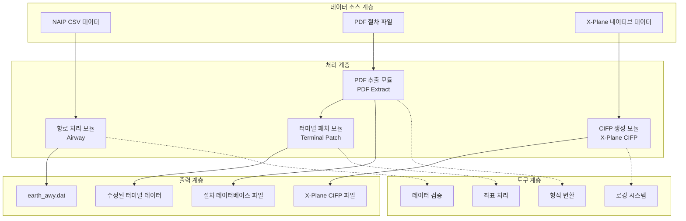
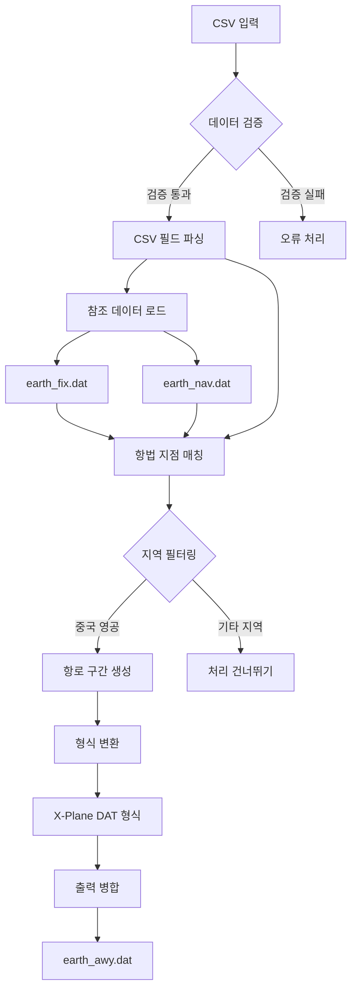
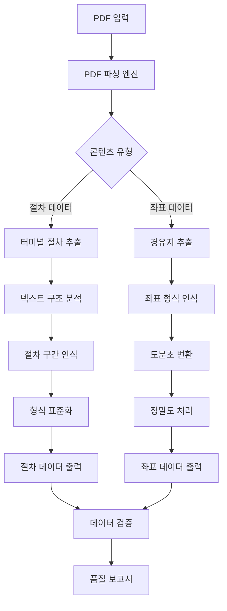
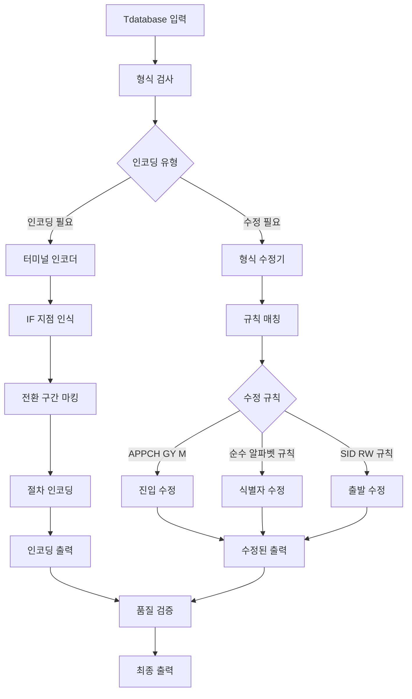
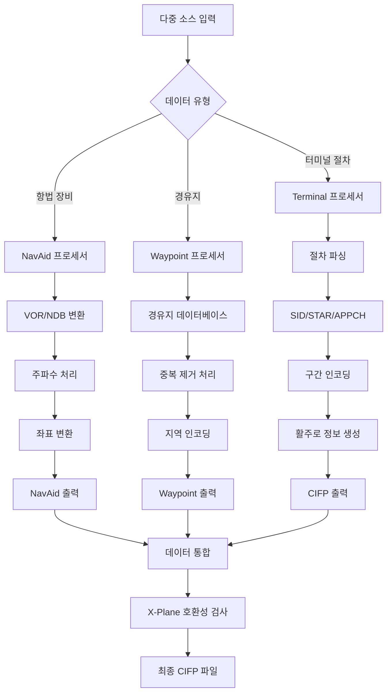
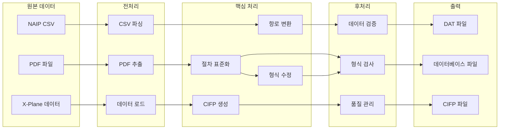
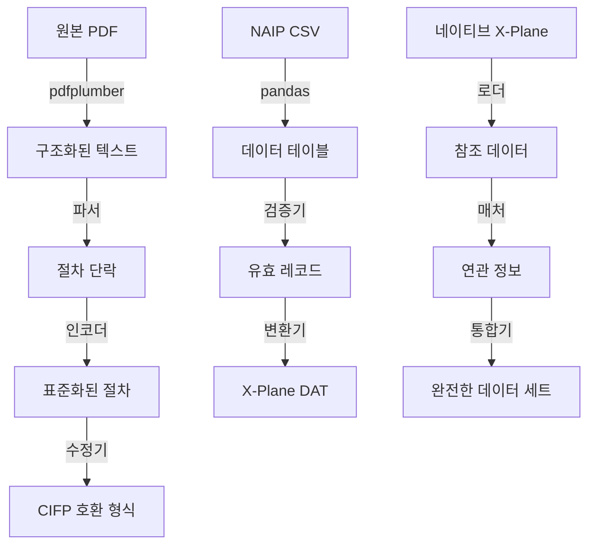
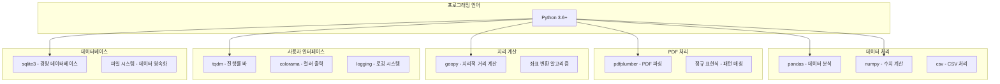
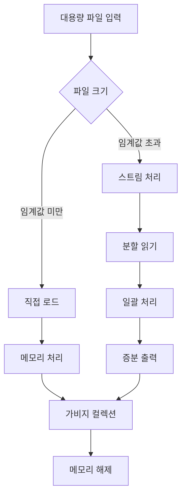
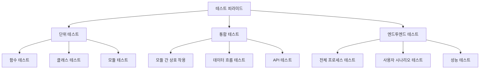

# 아키텍처 설명

본 문서는 Nav-data 프로젝트의 시스템 아키텍처, 기술 원리 및 설계 사상을 상세하게 설명합니다.

## 🏗️ 전체 아키텍처

Nav-data는 모듈식 설계를 채택하며, 네 가지 핵심 모듈로 구성됩니다. 각 모듈은 독립적으로 실행되며 유연하게 조합하여 사용할 수 있습니다.



## 📋 설계 원칙

### 1. 모듈식 설계
- **독립성**: 각 모듈은 독립적으로 실행되며, 다른 모듈에 강하게 의존하지 않습니다.
- **조합성**: 모듈 간 유연한 조합을 통해 다양한 처리 흐름을 구성할 수 있습니다.
- **확장성**: 새로운 모듈을 기존 아키텍처에 원활하게 통합할 수 있습니다.

### 2. 데이터 흐름 기반
- **단방향 데이터 흐름**: 데이터는 소스에서 타겟으로 흐르며, 순환 종속성을 피합니다.
- **중간 상태 저장**: 각 처리 단계는 중간 결과를 저장하여 디버깅 및 복구를 용이하게 합니다.
- **형식 표준화**: 통일된 데이터 형식 사양은 모듈 간 호환성을 보장합니다.

### 3. 오류 허용 및 복구
- **단계별 처리**: 복잡한 작업을 여러 작은 단계로 분해하여 실패 위험을 줄입니다.
- **오류 격리**: 단일 파일 처리 실패는 전체 배치 처리 작업에 영향을 미치지 않습니다.
- **상태 저장**: 주요 상태 정보가 영구화되어 중단점부터 이어서 처리를 지원합니다.

### 4. 성능 최적화
- **메모리 효율적**: 대용량 파일을 스트림 방식으로 처리하여 메모리 오버플로우를 방지합니다.
- **일괄 작업**: 일괄 처리를 통해 I/O 효율성을 향상시킵니다.
- **동시성 지원**: 멀티 스레드/멀티 프로세스 동시 처리를 지원합니다.

## 🛠️ 핵심 모듈 아키텍처

### 항로 처리 모듈 (Airway)



**기술 특징:**
- **데이터 매칭 알고리즘**: 식별자 및 좌표 기반의 지능형 매칭
- **지역 필터링 메커니즘**: 유연한 지리적 지역 필터링 설정을 지원
- **형식 변환 엔진**: CSV에서 X-Plane DAT 형식으로의 정밀 변환
- **AIRAC 주기 관리**: 항공 데이터 유효 주기를 자동 계산 및 관리

**핵심 클래스 및 인터페이스:**
```python
class NavigationType(Enum):
    """항법 지점 유형 열거형"""
    DESIGNATED_POINT = ('DESIGNATED_POINT', '11')
    VORDME = ('VORDME', '3') 
    NDB = ('NDB', '2')

@dataclass
class NavigationPoint:
    """항법 지점 데이터 구조"""
    identifier: str
    type: NavigationType
    area_code: str

def process_navigation_point(identifier: str, code_type: str, 
                           earth_fix_data: Dict, earth_nav_data: Dict) -> Optional[NavigationPoint]:
    """항법 지점 처리 핵심 알고리즘"""
    pass

def convert_csv_to_dat(csv_file: str, earth_fix_path: str, 
                      earth_nav_path: str, earth_awy_path: str) -> None:
    """주요 변환 함수"""
    pass
```

### PDF 추출 모듈 (PDF Extract)



**기술 특징:**
- **다단계 파싱**: 텍스트, 선, 테이블 등 다양한 PDF 요소를 지원합니다.
- **스마트 인식**: 좌표 형식과 절차 구조를 자동으로 인식합니다.
- **오류 허용 메커니즘**: PDF 형식 불일치 및 데이터 누락 문제를 처리합니다.
- **품질 관리**: 내장된 데이터 품질 검사 및 보고 메커니즘

**핵심 구성 요소:**
```python
class Line:
    """선 요소 클래스"""
    def __init__(self, line: dict):
        self.is_horizontal = True if line["width"] > 5 else False
        self.top = line["top"]
        self.left = line["x0"]
        self.length = line["width"] if self.is_horizontal else line["height"]

class Word:
    """텍스트 요소 클래스"""
    def __init__(self, info: dict):
        self.content = info["text"]
        self.center = ((info["x0"] + info["x1"]) / 2, (info["top"] + info["bottom"]) / 2)

class Unit:
    """처리 단위 클래스"""
    def __init__(self):
        self.words = []
        self.lines = []
    
    def match_underline(self):
        """밑줄 매칭 알고리즘"""
        pass

def extract(pdf: pdfplumber.PDF) -> List[str]:
    """PDF 추출 주요 함수"""
    pass
```

### 터미널 패치 모듈 (Terminal Patch)



**기술 특징:**
- **규칙 엔진**: 설정 기반의 수정 규칙 엔진
- **패턴 인식**: 다양한 유형의 절차 및 식별자를 지능적으로 인식
- **일괄 처리**: 폴더 수준의 일괄 수정을 지원
- **하위 호환성**: 기존 데이터 형식과의 호환성을 유지

**수정 규칙 시스템:**
```python
class FixRule:
    """수정 규칙 기본 클래스"""
    def __init__(self, name: str, pattern: str, action: callable):
        self.name = name
        self.pattern = pattern
        self.action = action
    
    def apply(self, line: str) -> str:
        """수정 규칙 적용"""
        pass

class RuleEngine:
    """규칙 엔진"""
    def __init__(self):
        self.rules = []
    
    def add_rule(self, rule: FixRule):
        """수정 규칙 추가"""
        self.rules.append(rule)
    
    def apply_rules(self, content: str) -> str:
        """모든 규칙 적용"""
        pass

# 사전 정의된 수정 규칙
APPCH_GY_M_RULE = FixRule(
    name="APPCH_GY_M",
    pattern=r"APPCH.*GY M",
    action=lambda line: fix_appch_gy_m(line)
)
```

### X-Plane CIFP 모듈 (X-Plane CIFP)



**기술 특징:**
- **다중 소스 데이터 통합**: NAIP, X-Plane 네이티브 데이터 등 여러 데이터 소스 통합
- **스마트 중복 제거**: 좌표 및 식별자 기반의 지능형 중복 제거 알고리즘
- **버전 호환성**: X-Plane 11 및 X-Plane 12 형식을 지원
- **데이터 무결성**: 생성된 CIFP 데이터가 완전하고 표준을 준수하도록 보장

**핵심 데이터 구조:**
```python
class Waypoint:
    """경유지 클래스"""
    def __init__(self, la: float, long: float, ident: str, cat: int, 
                 airport: str = '', area: str = '', changeable: bool = True):
        self.latitude = la
        self.longitude = long
        self.ident = ident
        self.cat = cat  # -1: 사용 불가 1: 경유지 2: VHF 3: NDB
        self.airport = airport
        self.area = area
        self.changeable = changeable
    
    def is_same(self, fix: "Waypoint", change: bool = False) -> bool:
        """동일한 경유지인지 판단"""
        pass

class WaypointSystem:
    """경유지 관리 시스템"""
    def __init__(self):
        self.base = {}  # 주요 데이터베이스
    
    def add_point(self, point: Waypoint):
        """경유지 추가"""
        pass
    
    def query(self, point: Waypoint, change: bool = False) -> int:
        """경유지 조회"""
        pass

class Procedure:
    """절차 클래스"""
    def __init__(self, ptype: int):
        self.ptype = "SID" if ptype == 1 else ("STAR" if ptype == 2 else "APPCH")
        self.airport = None
        self.runway = None
        self.name = None
        self.legs = []
    
    def encode(self):
        """절차 인코딩"""
        pass
    
    def output(self) -> str:
        """CIFP 형식 출력"""
        pass
```

## 🔄 데이터 흐름 아키텍처

### 데이터 흐름도



### 데이터 형식 변환 체인



## ⚙️ 기술 스택 아키텍처

### 핵심 기술 구성 요소



### 의존성 관리

```python
# requirements.txt 의존성 계층
# 핵심 의존성
pandas>=1.3.0          # 데이터 처리 기반
numpy>=1.21.0          # 수치 계산 기반

# PDF 처리
pdfplumber>=0.7.0      # PDF 파싱 엔진

# 사용자 경험
tqdm>=4.60.0           # 진행률 표시
colorama>=0.4.4        # 컬러 출력

# 지리 계산
geopy>=2.2.0           # 지리적 거리 계산

# 중국어 처리
pypinyin>=0.44.0       # 중국어 병음 변환

# 개발 도구 (선택 사항)
pytest>=6.0.0          # 테스트 프레임워크
black>=21.0.0          # 코드 포맷팅
flake8>=3.9.0          # 코드 검사
```

## 🏛️ 디자인 패턴

### 1. 팩토리 패턴 (Factory Pattern)
다양한 유형의 데이터 프로세서를 생성하는 데 사용됩니다:

```python
class ProcessorFactory:
    """데이터 프로세서 팩토리"""
    
    @staticmethod
    def create_processor(data_type: str):
        if data_type == "airway":
            return AirwayProcessor()
        elif data_type == "pdf":
            return PDFProcessor()
        elif data_type == "terminal":
            return TerminalProcessor()
        elif data_type == "cifp":
            return CIFPProcessor()
        else:
            raise ValueError(f"Unknown processor type: {data_type}")

# 사용 예시
processor = ProcessorFactory.create_processor("airway")
result = processor.process(input_data)
```

### 2. 전략 패턴 (Strategy Pattern)
다양한 데이터 변환 전략을 구현하는 데 사용됩니다:

```python
class ConversionStrategy:
    """변환 전략 인터페이스"""
    def convert(self, data): pass

class CSVToDAT(ConversionStrategy):
    """CSV에서 DAT로 변환 전략"""
    def convert(self, csv_data):
        # CSV 변환 로직
        pass

class PDFToText(ConversionStrategy):
    """PDF에서 텍스트로 변환 전략"""
    def convert(self, pdf_data):
        # PDF 변환 로직
        pass

class DataConverter:
    """데이터 변환기"""
    def __init__(self, strategy: ConversionStrategy):
        self.strategy = strategy
    
    def convert(self, data):
        return self.strategy.convert(data)
```

### 3. 옵저버 패턴 (Observer Pattern)
처리 진행 상황 모니터링을 구현하는 데 사용됩니다:

```python
class ProgressObserver:
    """진행률 옵저버 인터페이스"""
    def update(self, progress: float, message: str): pass

class ConsoleProgressObserver(ProgressObserver):
    """콘솔 진행률 표시"""
    def update(self, progress: float, message: str):
        print(f"Progress: {progress:.1%} - {message}")

class TqdmProgressObserver(ProgressObserver):
    """tqdm 진행률 바 표시"""
    def __init__(self):
        self.pbar = None
    
    def update(self, progress: float, message: str):
        if self.pbar:
            self.pbar.set_description(message)
            self.pbar.update()

class DataProcessor:
    """데이터 프로세서 기본 클래스"""
    def __init__(self):
        self.observers = []
    
    def add_observer(self, observer: ProgressObserver):
        self.observers.append(observer)
    
    def notify_progress(self, progress: float, message: str):
        for observer in self.observers:
            observer.update(progress, message)
```

### 4. 책임 연쇄 패턴 (Chain of Responsibility)
데이터 검증 체인을 구현하는 데 사용됩니다:

```python
class ValidationHandler:
    """검증 핸들러 인터페이스"""
    def __init__(self):
        self.next_handler = None
    
    def set_next(self, handler):
        self.next_handler = handler
        return handler
    
    def handle(self, data):
        result = self.validate(data)
        if result and self.next_handler:
            return self.next_handler.handle(data)
        return result
    
    def validate(self, data):
        pass

class FormatValidator(ValidationHandler):
    """형식 검증기"""
    def validate(self, data):
        # 형식 검증 로직
        return True

class RangeValidator(ValidationHandler):
    """범위 검증기"""
    def validate(self, data):
        # 범위 검증 로직
        return True

class IntegrityValidator(ValidationHandler):
    """무결성 검증기"""
    def validate(self, data):
        # 무결성 검증 로직
        return True

# 검증 체인 구축
format_validator = FormatValidator()
range_validator = RangeValidator()
integrity_validator = IntegrityValidator()

format_validator.set_next(range_validator).set_next(integrity_validator)

# 검증 체인 사용
is_valid = format_validator.handle(input_data)
```

## 📊 성능 아키텍처

### 메모리 관리 전략



**메모리 최적화 전략:**
```python
import gc
from typing import Iterator, List

class MemoryEfficientProcessor:
    """메모리 효율적인 데이터 프로세서"""
    
    def __init__(self, chunk_size: int = 1000):
        self.chunk_size = chunk_size
    
    def process_large_file(self, file_path: str) -> Iterator[List]:
        """대용량 파일을 청크 단위로 처리"""
        chunk = []
        with open(file_path, 'r', encoding='utf-8') as f:
            for line in f:
                chunk.append(line.strip())
                
                if len(chunk) >= self.chunk_size:
                    yield self.process_chunk(chunk)
                    chunk.clear()
                    gc.collect()  # 강제 가비지 컬렉션
            
            if chunk:  # 남은 데이터 처리
                yield self.process_chunk(chunk)
    
    def process_chunk(self, chunk: List[str]) -> List[str]:
        """단일 데이터 청크 처리"""
        # 데이터 처리 로직
        return [self.process_line(line) for line in chunk]
    
    def process_line(self, line: str) -> str:
        """단일 행 데이터 처리"""
        # 구체적인 처리 로직
        return line
```

### 동시 처리 아키텍처

```python
import concurrent.futures
from multiprocessing import Pool
import threading

class ConcurrentProcessor:
    """동시 데이터 프로세서"""
    
    def __init__(self, max_workers: int = 4):
        self.max_workers = max_workers
    
    def process_files_threaded(self, file_list: List[str]) -> List:
        """다중 스레드로 파일 목록 처리"""
        with concurrent.futures.ThreadPoolExecutor(max_workers=self.max_workers) as executor:
            # 작업 제출
            future_to_file = {
                executor.submit(self.process_single_file, file): file 
                for file in file_list
            }
            
            results = []
            for future in concurrent.futures.as_completed(future_to_file):
                file = future_to_file[future]
                try:
                    result = future.result()
                    results.append(result)
                except Exception as exc:
                    print(f'File {file} generated an exception: {exc}')
            
            return results
    
    def process_files_multiprocess(self, file_list: List[str]) -> List:
        """다중 프로세스로 파일 목록 처리"""
        with Pool(processes=self.max_workers) as pool:
            results = pool.map(self.process_single_file, file_list)
        return results
    
    def process_single_file(self, file_path: str):
        """단일 파일 처리"""
        # 파일 처리 로직
        pass
```

### 캐싱 아키텍처

```python
import functools
import hashlib
import pickle
from pathlib import Path

class CacheManager:
    """캐시 관리자"""
    
    def __init__(self, cache_dir: str = "cache"):
        self.cache_dir = Path(cache_dir)
        self.cache_dir.mkdir(exist_ok=True)
    
    def get_cache_key(self, *args, **kwargs) -> str:
        """캐시 키 생성"""
        content = str(args) + str(sorted(kwargs.items()))
        return hashlib.md5(content.encode()).hexdigest()
    
    def get(self, key: str):
        """캐시 가져오기"""
        cache_file = self.cache_dir / f"{key}.cache"
        if cache_file.exists():
            with open(cache_file, 'rb') as f:
                return pickle.load(f)
        return None
    
    def set(self, key: str, value):
        """캐시 설정"""
        cache_file = self.cache_dir / f"{key}.cache"
        with open(cache_file, 'wb') as f:
            pickle.dump(value, f)
    
    def cached(self, ttl: int = 3600):
        """캐시 데코레이터"""
        def decorator(func):
            @functools.wraps(func)
            def wrapper(*args, **kwargs):
                cache_key = self.get_cache_key(func.__name__, *args, **kwargs)
                result = self.get(cache_key)
                
                if result is None:
                    result = func(*args, **kwargs)
                    self.set(cache_key, result)
                
                return result
            return wrapper
        return decorator

# 사용 예시
cache_manager = CacheManager()

@cache_manager.cached(ttl=3600)
def expensive_processing(data):
    """시간 소모적인 데이터 처리 함수"""
    # 복잡한 처리 로직
    return processed_data
```

## 🔒 보안 아키텍처

### 입력 유효성 검사 계층

```python
import re
from pathlib import Path
from typing import Any, Dict

class InputValidator:
    """입력 유효성 검사기"""
    
    # 안전한 파일 확장자
    SAFE_EXTENSIONS = {'.csv', '.dat', '.txt', '.pdf'}
    
    # 경로 제한 패턴
    SAFE_PATH_PATTERN = re.compile(r'^[a-zA-Z0-9._/\-\s]+$')
    
    @classmethod
    def validate_file_path(cls, file_path: str) -> bool:
        """파일 경로 보안 유효성 검사"""
        path = Path(file_path)
        
        # 파일 확장자 확인
        if path.suffix.lower() not in cls.SAFE_EXTENSIONS:
            raise ValueError(f"Unsafe file extension: {path.suffix}")
        
        # 경로 문자 확인
        if not cls.SAFE_PATH_PATTERN.match(file_path):
            raise ValueError(f"Unsafe characters in path: {file_path}")
        
        # 경로 탐색 공격 확인
        if '..' in file_path or file_path.startswith('/'):
            raise ValueError(f"Path traversal detected: {file_path}")
        
        return True
    
    @classmethod
    def validate_coordinate(cls, lat: float, lon: float) -> bool:
        """좌표 범위 유효성 검사"""
        if not (-90 <= lat <= 90):
            raise ValueError(f"Invalid latitude: {lat}")
        
        if not (-180 <= lon <= 180):
            raise ValueError(f"Invalid longitude: {lon}")
        
        return True
    
    @classmethod
    def sanitize_string(cls, input_str: str) -> str:
        """입력 문자열 정리"""
        # 잠재적으로 위험한 문자 제거
        sanitized = re.sub(r'[<>"\';\\]', '', input_str)
        # 길이 제한
        return sanitized[:1000]
```

### 오류 처리 아키텍처

```python
import logging
from enum import Enum
from typing import Optional

class ErrorLevel(Enum):
    """오류 수준"""
    WARNING = "WARNING"
    ERROR = "ERROR"
    CRITICAL = "CRITICAL"

class NavDataError(Exception):
    """Nav-data 사용자 정의 예외 기본 클래스"""
    def __init__(self, message: str, error_code: str = None, level: ErrorLevel = ErrorLevel.ERROR):
        super().__init__(message)
        self.message = message
        self.error_code = error_code
        self.level = level

class FileProcessingError(NavDataError):
    """파일 처리 예외"""
    pass

class DataValidationError(NavDataError):
    """데이터 유효성 검사 예외"""
    pass

class ErrorHandler:
    """오류 핸들러"""
    
    def __init__(self):
        self.logger = logging.getLogger(__name__)
    
    def handle_error(self, error: Exception, context: Optional[Dict] = None):
        """예외 처리"""
        if isinstance(error, NavDataError):
            self.handle_nav_data_error(error, context)
        else:
            self.handle_unexpected_error(error, context)
    
    def handle_nav_data_error(self, error: NavDataError, context: Optional[Dict] = None):
        """사용자 정의 예외 처리"""
        log_message = f"[{error.error_code}] {error.message}"
        if context:
            log_message += f" Context: {context}"
        
        if error.level == ErrorLevel.WARNING:
            self.logger.warning(log_message)
        elif error.level == ErrorLevel.ERROR:
            self.logger.error(log_message)
        elif error.level == ErrorLevel.CRITICAL:
            self.logger.critical(log_message)
            # 프로그램 실행을 중지해야 할 수 있음
    
    def handle_unexpected_error(self, error: Exception, context: Optional[Dict] = None):
        """예상치 못한 예외 처리"""
        log_message = f"Unexpected error: {str(error)}"
        if context:
            log_message += f" Context: {context}"
        
        self.logger.error(log_message, exc_info=True)
```

## 🧪 테스트 아키텍처

### 테스트 전략



### 테스트 프레임워크 코드

```python
import pytest
import tempfile
from pathlib import Path
from unittest.mock import Mock, patch

class TestDataFixtures:
    """테스트 데이터 픽스처"""
    
    @pytest.fixture
    def sample_csv_data(self):
        """예시 CSV 데이터"""
        return """CODE_POINT_START,CODE_TYPE_START,CODE_POINT_END,CODE_TYPE_END,CODE_DIR,TXT_DESIG
ABCDE,DESIGNATED_POINT,FGHIJ,VOR/DME,N,A123
KLMNO,NDB,PQRST,DESIGNATED_POINT,N,B456"""
    
    @pytest.fixture
    def temp_directory(self):
        """임시 디렉토리"""
        with tempfile.TemporaryDirectory() as temp_dir:
            yield Path(temp_dir)
    
    @pytest.fixture
    def mock_earth_fix_data(self):
        """모의 earth_fix 데이터"""
        return {
            'ABCDE': 'ZB',
            'PQRST': 'ZG'
        }
    
    @pytest.fixture
    def mock_earth_nav_data(self):
        """모의 earth_nav 데이터"""
        return {
            'FGHIJ': 'ZG',
            'KLMNO': 'ZB'
        }

class TestAirwayModule(TestDataFixtures):
    """항로 모듈 테스트"""
    
    def test_navigation_type_enum(self):
        """항법 지점 유형 열거형 테스트"""
        from Airway.airway import NavigationType
        
        assert NavigationType.DESIGNATED_POINT.type_code == '11'
        assert NavigationType.VORDME.type_code == '3'
        assert NavigationType.NDB.type_code == '2'
    
    def test_process_navigation_point(self, mock_earth_fix_data, mock_earth_nav_data):
        """항법 지점 처리 테스트"""
        from Airway.airway import process_navigation_point
        
        # 지정 지점 처리 테스트
        result = process_navigation_point(
            'ABCDE', 'DESIGNATED_POINT', 
            mock_earth_fix_data, mock_earth_nav_data
        )
        
        assert result is not None
        assert result.identifier == 'ABCDE'
        assert result.area_code == 'ZB'
    
    @patch('Airway.airway.load_fixed_width_data')
    @patch('pandas.read_csv')
    def test_csv_to_dat_conversion(self, mock_read_csv, mock_load_data, 
                                 sample_csv_data, temp_directory):
        """CSV에서 DAT로 변환 테스트"""
        # 모의 데이터 설정
        mock_df = Mock()
        mock_read_csv.return_value = mock_df
        mock_load_data.return_value = {'ABCDE': 'ZB'}
        
        # 임시 파일 생성
        csv_file = temp_directory / "test.csv"
        csv_file.write_text(sample_csv_data)
        
        # 변환 기능 테스트
        from Airway.airway import convert_csv_to_dat
        
        # 여기는 실제 함수 시그니처에 따라 조정해야 합니다.
        # convert_csv_to_dat(str(csv_file), ...)
        
        # 결과 검증
        assert True  # 실제 결과에 따라 어서트

class TestPDFModule(TestDataFixtures):
    """PDF 모듈 테스트"""
    
    @patch('pdfplumber.open')
    def test_pdf_extraction(self, mock_pdf_open):
        """PDF 추출 기능 테스트"""
        # 모의 PDF 설정
        mock_pdf = Mock()
        mock_page = Mock()
        mock_page.extract_text_lines.return_value = [
            {'text': 'ZBAA N39°48\'35.6" E116°34\'46.7"'}
        ]
        mock_pdf.pages = [mock_page]
        mock_pdf_open.return_value.__enter__.return_value = mock_pdf
        
        # 추출 기능 테스트
        import sys
        sys.path.append('PDF extract')
        from waypoint_1_pdf import extract
        
        result = extract(mock_pdf)
        assert len(result) > 0
```

## 📈 모니터링 및 로깅 아키텍처

### 로깅 시스템 설계

```python
import logging
import logging.handlers
from enum import Enum
from pathlib import Path

class LogLevel(Enum):
    """로그 수준"""
    DEBUG = logging.DEBUG
    INFO = logging.INFO
    WARNING = logging.WARNING
    ERROR = logging.ERROR
    CRITICAL = logging.CRITICAL

class StructuredLogger:
    """구조화된 로거"""
    
    def __init__(self, name: str, log_dir: str = "logs"):
        self.logger = logging.getLogger(name)
        self.log_dir = Path(log_dir)
        self.log_dir.mkdir(exist_ok=True)
        
        self.setup_handlers()
    
    def setup_handlers(self):
        """로그 핸들러 설정"""
        # 콘솔 핸들러
        console_handler = logging.StreamHandler()
        console_formatter = logging.Formatter(
            '%(asctime)s - %(name)s - %(levelname)s - %(message)s'
        )
        console_handler.setFormatter(console_formatter)
        
        # 파일 핸들러 (날짜별 로테이션)
        file_handler = logging.handlers.TimedRotatingFileHandler(
            filename=self.log_dir / 'nav-data.log',
            when='midnight',
            interval=1,
            backupCount=30,
            encoding='utf-8'
        )
        file_formatter = logging.Formatter(
            '%(asctime)s - %(name)s - %(levelname)s - %(filename)s:%(lineno)d - %(message)s'
        )
        file_handler.setFormatter(file_formatter)
        
        # 오류 파일 핸들러
        error_handler = logging.FileHandler(
            filename=self.log_dir / 'errors.log',
            encoding='utf-8'
        )
        error_handler.setLevel(logging.ERROR)
        error_handler.setFormatter(file_formatter)
        
        # 핸들러 추가
        self.logger.addHandler(console_handler)
        self.logger.addHandler(file_handler)
        self.logger.addHandler(error_handler)
        
        self.logger.setLevel(logging.INFO)
    
    def log_with_context(self, level: LogLevel, message: str, **context):
        """컨텍스트를 포함한 로깅"""
        if context:
            message = f"{message} | Context: {context}"
        
        self.logger.log(level.value, message)
    
    def log_performance(self, operation: str, duration: float, **metrics):
        """성능 로그"""
        perf_message = f"Performance | Operation: {operation} | Duration: {duration:.3f}s"
        if metrics:
            perf_message += f" | Metrics: {metrics}"
        
        self.logger.info(perf_message)
```

### 성능 모니터링

```python
import time
import psutil
from contextlib import contextmanager
from typing import Dict, Any

class PerformanceMonitor:
    """성능 모니터"""
    
    def __init__(self, logger: StructuredLogger):
        self.logger = logger
        self.metrics = {}
    
    @contextmanager
    def measure_time(self, operation_name: str):
        """작업 시간 소모 측정"""
        start_time = time.time()
        start_memory = psutil.Process().memory_info().rss / 1024 / 1024  # MB
        
        try:
            yield
        finally:
            end_time = time.time()
            end_memory = psutil.Process().memory_info().rss / 1024 / 1024  # MB
            
            duration = end_time - start_time
            memory_delta = end_memory - start_memory
            
            self.logger.log_performance(
                operation=operation_name,
                duration=duration,
                memory_start=start_memory,
                memory_end=end_memory,
                memory_delta=memory_delta
            )
    
    def collect_system_metrics(self) -> Dict[str, Any]:
        """시스템 지표 수집"""
        return {
            'cpu_percent': psutil.cpu_percent(),
            'memory_percent': psutil.virtual_memory().percent,
            'disk_usage': psutil.disk_usage('/').percent,
            'process_memory': psutil.Process().memory_info().rss / 1024 / 1024
        }

# 사용 예시
logger = StructuredLogger("nav-data")
monitor = PerformanceMonitor(logger)

with monitor.measure_time("csv_processing"):
    # CSV 처리 작업 실행
    process_csv_file("large_file.csv")

# 시스템 지표 기록
system_metrics = monitor.collect_system_metrics()
logger.log_with_context(LogLevel.INFO, "System metrics collected", **system_metrics)
```

## 🔮 확장 아키텍처

### 플러그인 시스템 설계

```python
from abc import ABC, abstractmethod
from typing import Dict, Any, List
import importlib
import os

class Plugin(ABC):
    """플러그인 인터페이스"""
    
    @property
    @abstractmethod
    def name(self) -> str:
        """플러그인 이름"""
        pass
    
    @property
    @abstractmethod
    def version(self) -> str:
        """플러그인 버전"""
        pass
    
    @abstractmethod
    def initialize(self, config: Dict[str, Any]):
        """플러그인 초기화"""
        pass
    
    @abstractmethod
    def process(self, data: Any) -> Any:
        """데이터 처리"""
        pass
    
    @abstractmethod
    def cleanup(self):
        """리소스 정리"""
        pass

class PluginManager:
    """플러그인 관리자"""
    
    def __init__(self, plugin_dir: str = "plugins"):
        self.plugin_dir = plugin_dir
        self.plugins: Dict[str, Plugin] = {}
    
    def load_plugins(self):
        """모든 플러그인 로드"""
        if not os.path.exists(self.plugin_dir):
            return
        
        for filename in os.listdir(self.plugin_dir):
            if filename.endswith('.py') and not filename.startswith('__'):
                module_name = filename[:-3]
                try:
                    module = importlib.import_module(f"{self.plugin_dir}.{module_name}")
                    plugin_class = getattr(module, 'Plugin', None)
                    
                    if plugin_class and issubclass(plugin_class, Plugin):
                        plugin = plugin_class()
                        self.plugins[plugin.name] = plugin
                        print(f"Loaded plugin: {plugin.name} v{plugin.version}")
                
                except Exception as e:
                    print(f"Failed to load plugin {module_name}: {e}")
    
    def get_plugin(self, name: str) -> Plugin:
        """플러그인 가져오기"""
        return self.plugins.get(name)
    
    def list_plugins(self) -> List[str]:
        """모든 플러그인 나열"""
        return list(self.plugins.keys())
    
    def execute_plugin(self, name: str, data: Any, config: Dict[str, Any] = None) -> Any:
        """플러그인 실행"""
        plugin = self.get_plugin(name)
        if not plugin:
            raise ValueError(f"Plugin not found: {name}")
        
        try:
            if config:
                plugin.initialize(config)
            
            result = plugin.process(data)
            plugin.cleanup()
            return result
        
        except Exception as e:
            plugin.cleanup()
            raise e

# 예시 플러그인 구현
class CustomDataProcessor(Plugin):
    """사용자 정의 데이터 처리 플러그인"""
    
    @property
    def name(self) -> str:
        return "custom_processor"
    
    @property
    def version(self) -> str:
        return "1.0.0"
    
    def initialize(self, config: Dict[str, Any]):
        self.config = config
    
    def process(self, data: Any) -> Any:
        # 사용자 정의 처리 로직
        return processed_data
    
    def cleanup(self):
        # 리소스 정리
        pass
```

---

**요약**: Nav-data는 모듈화되고 계층화된 아키텍처 설계를 채택하여 시스템의 유지보수성, 확장성 및 성능을 보장합니다. 합리적인 디자인 패턴 적용, 완벽한 오류 처리 메커니즘 및 모니터링 시스템을 통해 사용자에게 안정적이고 신뢰할 수 있는 항공 항법 데이터 변환 서비스를 제공합니다. ✈️