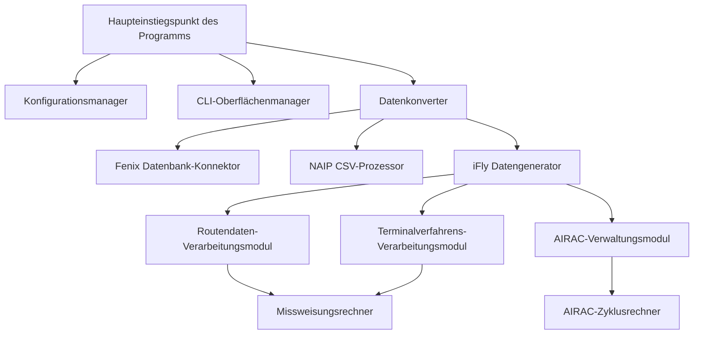
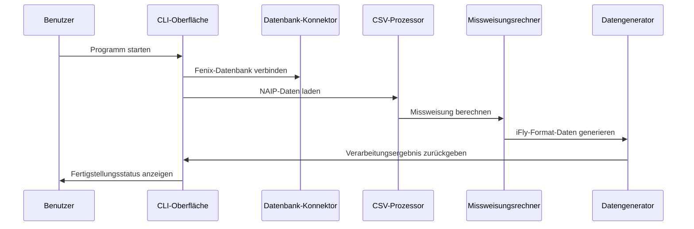

# 🏗️ iFly Navigationsdatenkonverter-Architektur

## Systemübersicht

Der iFly Navigationsdatenkonverter ist ein modernes Flugnavigationsdaten-Konvertierungstool, das speziell dafür entwickelt wurde, Fenix A320 Navigationsdatenbanken in das iFly 737 MAX 8 Navigationsdatenbankformat zu konvertieren.

## 🎯 Designprinzipien

### 1. Modulares Design
- **Datenverarbeitungsmodul**: Unabhängige Routen- und Terminalverfahrensverarbeitung
- **Benutzeroberflächenmodul**: Moderne CLI-Oberfläche basierend auf der Rich-Bibliothek
- **Konfigurationsmodul**: Flexibles Konfigurationsmanagementsystem
- **Validierungsmodul**: Umfassende Datenintegritätsprüfung

### 2. Hochleistungsarchitektur
- **Nebenläufige Verarbeitung**: Multithread-Missweisungsberechnung
- **Speicheroptimierung**: Stream-basierte Datenverarbeitung
- **Lokale Berechnung**: Keine Netzwerk-API-Aufrufe erforderlich

### 3. Qualität auf Unternehmensniveau
- **Typ-Hints**: Vollständige Python-Typannotationen
- **Fehlerbehandlung**: Robuster Ausnahmebehandlungsmechanismus
- **Testabdeckung**: Umfassende Unit-Tests
- **Dokumentationsvollständigkeit**: Detaillierte API-Dokumentation

## 🏗️ Systemarchitektur

### Kernkomponenten

### Datenfluss

## 🔧 Technologie-Stack

### Kernabhängigkeiten
- **Python 3.8+**: Hauptprogrammiersprache
- **Rich**: Moderne CLI-Oberfläche
- **pygeomag**: Hochpräzise Missweisungsberechnung
- **pandas**: Datenverarbeitung und -analyse
- **pathlib**: Dateipfadverwaltung

### Datenverarbeitungstechnologien
- **SQLite**: Fenix-Datenbankzugriff
- **CSV**: NAIP-Datenformat
- **WMM-2025**: Erdmagnetisches Modell
- **AIRAC**: Luftfahrtinformations-Revisionszyklus

## 📊 Leistungsmerkmale

### Verarbeitungsfähigkeit
- **Datendurchsatz**: Verarbeitung von über 10.000 Wegpunkten pro Minute
- **Speichernutzung**: Spitze < 500 MB
- **Missweisungsberechnung**: < 1ms/Punkt (lokale Berechnung)
- **Parallelverarbeitungsfähigkeit**: Unterstützt Multithread-Verarbeitung

### Systemanforderungen
- **Mindestspeicher**: 4 GB RAM
- **Speicherplatz**: 100 MB verfügbarer Speicher
- **Prozessor**: Dual-Core 2.0 GHz+
- **Betriebssystem**: Windows 10/11, macOS, Linux

## 🔒 Sicherheitsdesign

### Datenschutz
- **Eingabevalidierung**: Strenge Dateiformatvalidierung
- **Fehlerisolierung**: Fehlerbehandlung zur Vermeidung von Datenkorruption
- **Backup-Mechanismus**: Automatische Sicherung der Originaldaten
- **Zugriffskontrolle**: Prinzip der geringsten Rechte

### Codesicherheit
- **Typsicherheit**: Vollständige Typ-Hints
- **Speichersicherheit**: Automatische Speicherverwaltung
- **Ausnahmesicherheit**: Robuste Ausnahmebehandlung
- **Eingabebereinigung**: Verhindert Injektionsangriffe

## 🚀 Erweiterbarkeit

### Modulerweiterung
- **Datenquellenerweiterung**: Unterstützung neuer Datenquellenformate
- **Ausgabeformaterweiterung**: Unterstützung neuer Zielformate
- **Berechnungsmodulerweiterung**: Unterstützung neuer Berechnungsalgorithmen
- **Oberflächenerweiterung**: Unterstützung für GUI-Oberflächen

### Leistungserweiterung
- **Verteilte Verarbeitung**: Unterstützung von Cluster-Berechnungen
- **Caching-Mechanismus**: Intelligentes Daten-Caching
- **Paralleloptimierung**: Multiprocess-Parallelverarbeitung
- **Hardwarebeschleunigung**: GPU-beschleunigte Berechnung

## 🔄 Wartbarkeit

### Codequalität
- **Codestandards**: PEP 8 Standard
- **Dokumentationsvollständigkeit**: 100% API-Dokumentationsabdeckung
- **Testabdeckung**: Über 90% Codeabdeckung
- **Statische Analyse**: Automatische Codequalitätsprüfung

### Überwachung und Debugging
- **Detaillierte Protokollierung**: Gestufte Protokollierung
- **Leistungsüberwachung**: Echtzeit-Leistungsmetriken
- **Fehlerverfolgung**: Vollständiger Fehler-Stack-Trace
- **Debugging-Tools**: Integrierte Debugging-Schnittstelle

## 📈 Zukunftsplanung

### Kurzfristige Ziele (1-3 Monate)
- GUI-Oberflächenentwicklung
- Stapelverarbeitungsfunktion
- Datenvalidierungstools
- Leistungsoptimierung

### Mittelfristige Ziele (3-6 Monate)
- Unterstützung mehrerer Formate
- Cloud-Verarbeitung
- API-Schnittstelle
- Plug-in-System

### Langfristige Ziele (6-12 Monate)
- Optimierung durch maschinelles Lernen
- Echtzeit-Datenaktualisierungen
- Community-Ökosystem
- Enterprise-Deployment

---

Dieses Architekturdesign gewährleistet die Zuverlässigkeit, Leistung und Wartbarkeit des iFly Navigationsdatenkonverters und bietet der Flugsimulations-Community eine professionelle Datenkonvertierungslösung.