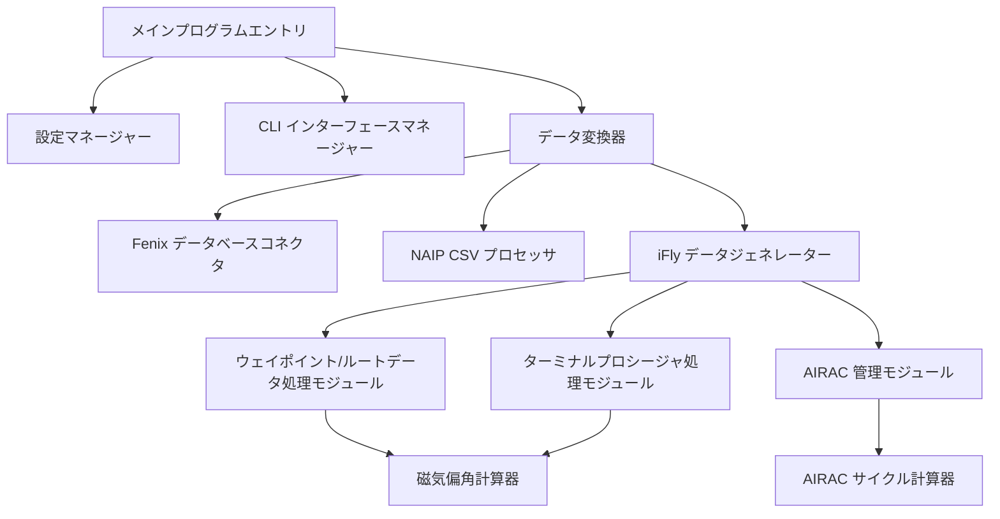
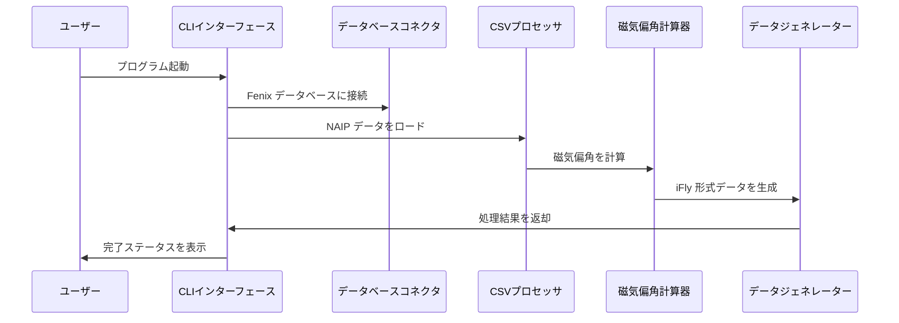

# 🏗️ iFly ナビゲーションデータ変換器アーキテクチャ

## システム概要

iFly ナビゲーションデータ変換器は、Fenix A320 ナビゲーションデータベースを iFly 737 MAX 8 ナビゲーションデータベース形式に変換するために特別に設計された、最新の航空ナビゲーションデータ変換ツールです。

## 🎯 設計原則

### 1. モジュール設計
- **データ処理モジュール**：独立したウェイポイント/ルートおよびターミナルプロシージャ処理
- **インターフェースモジュール**：Rich ライブラリに基づいた最新の CLI インターフェース
- **設定モジュール**：柔軟な設定管理システム
- **検証モジュール**：完全なデータ整合性チェック

### 2. 高性能アーキテクチャ
- **並行処理**：マルチスレッドによる磁気偏角計算
- **メモリ最適化**：ストリーミングデータ処理
- **ローカル計算**：ネットワーク API 呼び出し不要

### 3. エンタープライズ品質
- **型ヒント**：完全な Python 型アノテーション
- **エラー処理**：堅牢な例外処理メカニズム
- **テストカバレッジ**：包括的な単体テスト
- **ドキュメントの完全性**：詳細な API ドキュメント

## 🏗️ システムアーキテクチャ

### コアコンポーネント

### データフロー

## 🔧 技術スタック

### コア依存関係
- **Python 3.8+**：主要プログラミング言語
- **Rich**：最新の CLI インターフェース
- **pygeomag**：高精度な磁気偏角計算
- **pandas**：データ処理と分析
- **pathlib**：ファイルパス管理

### データ処理技術
- **SQLite**：Fenix データベースアクセス
- **CSV**：NAIP データ形式
- **WMM-2025**：地磁気モデル
- **AIRAC**：航空情報改訂サイクル

## 📊 性能特性

### 処理能力
- **データスループット**：1分あたり10,000以上のウェイポイントを処理
- **メモリ使用量**：ピーク時 < 500MB
- **磁気偏角計算**：1ms/点未満（ローカル計算）
- **並行処理能力**：マルチスレッド処理をサポート

### システム要件
- **最小メモリ**：4GB RAM
- **ストレージ容量**：100MB の空き容量
- **プロセッサ**：デュアルコア 2.0GHz+
- **オペレーティングシステム**：Windows 10/11, macOS, Linux

## 🔒 セキュリティ設計

### データ保護
- **入力検証**：厳格なファイル形式検証
- **エラー分離**：データ破損を防ぐエラー処理
- **バックアップメカニズム**：オリジナルデータの自動バックアップ
- **権限制御**：最小権限の原則

### コードセキュリティ
- **タイプセーフティ**：完全な型ヒント
- **メモリセーフティ**：自動メモリ管理
- **例外セーフティ**：堅牢な例外処理
- **入力サニタイズ**：インジェクション攻撃を防止

## 🚀 拡張性

### モジュール拡張
- **データソース拡張**：新しいデータソース形式をサポート
- **出力形式拡張**：新しいターゲット形式をサポート
- **計算モジュール拡張**：新しい計算アルゴリズムをサポート
- **インターフェース拡張**：GUI インターフェースをサポート

### パフォーマンス拡張
- **分散処理**：クラスター計算をサポート
- **キャッシュメカニズム**：インテリジェントデータキャッシュ
- **並列最適化**：マルチプロセス並列処理
- **ハードウェアアクセラレーション**：GPU アクセラレーション計算

## 🔄 メンテナンス性

### コード品質
- **コーディング規約**：PEP 8 標準
- **ドキュメントの完全性**：100% API ドキュメントカバレッジ
- **テストカバレッジ**：90%+ コードカバレッジ
- **静的解析**：自動コード品質チェック

### 監視とデバッグ
- **詳細ログ**：レベル別ログ記録
- **パフォーマンス監視**：リアルタイムパフォーマンス指標
- **エラー追跡**：完全なエラーコールスタック
- **デバッグツール**：組み込みデバッグインターフェース

## 📈 将来の計画

### 短期目標（1-3ヶ月）
- GUI インターフェース開発
- バッチ処理機能
- データ検証ツール
- パフォーマンス最適化

### 中期目標（3-6ヶ月）
- マルチフォーマット対応
- クラウド処理
- API インターフェース
- プラグインシステム

### 長期目標（6-12ヶ月）
- 機械学習最適化
- リアルタイムデータ更新
- コミュニティエコシステム
- エンタープライズデプロイメント

---

このアーキテクチャ設計により、iFly ナビゲーションデータ変換器の信頼性、パフォーマンス、およびメンテナンス性が確保され、フライトシミュレーションコミュニティにプロフェッショナルグレードのデータ変換ソリューションを提供します。