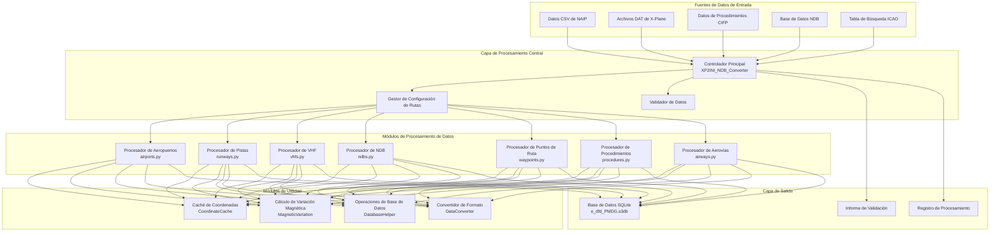

# 🏗️ Arquitectura del Sistema

Este documento detalla la arquitectura del sistema, la implementación técnica y la filosofía de diseño de la herramienta de conversión de datos de navegación aérea Nav-data.

## 🎯 Principios de Diseño

### 🔧 Diseño Modular
- **Responsabilidad Única**: Cada módulo se enfoca en procesar un tipo específico de datos de navegación.
- **Acoplamiento Débil**: Dependencia minimizada entre módulos para facilitar el desarrollo y las pruebas independientes.
- **Alta Cohesión**: Funciones relacionadas centralizadas dentro del mismo módulo.

### ⚡ Optimización del Rendimiento
- **Procesamiento Paralelo**: Soporte para el procesamiento paralelo multiproceso de grandes conjuntos de datos.
- **Gestión de Memoria**: Mecanismo de caché inteligente para reducir cálculos repetitivos.
- **Optimización de E/S**: Operaciones de base de datos por lotes para mejorar la eficiencia del procesamiento.

### 🔒 Integridad de Datos
- **Validación de Tipos**: Validación estricta de tipos y formatos de datos.
- **Manejo de Errores**: Mecanismo elegante de recuperación y reporte de errores.
- **Consistencia de Datos**: Asegura la consistencia y precisión de los datos entre módulos.

## 🏛️ Visión General de la Arquitectura del Sistema



## 📦 Detalle de los Módulos Principales

### 🎮 Controlador Principal (XP2INI_NDB_Converter.py)

**Responsabilidad**: Punto de entrada y centro de control de flujo del sistema.

```python
class MainController:
    """Clase del controlador principal, responsable de la coordinación de todo el proceso de conversión."""
    
    def __init__(self):
        self.config = {}
        self.processors = []
        self.logger = Logger()
    
    def main_config(self):
        """Asistente de configuración de rutas interactivo."""
        pass
    
    def main(self, config):
        """Flujo de procesamiento principal."""
        pass
```

**Funcionalidades Clave**:
- 📂 Configuración y validación de rutas
- 🔄 Orquestación del flujo de procesamiento
- ⏱️ Monitoreo de rendimiento y registro de logs
- 🗜️ Optimización y compresión de la base de datos

### 🏢 Procesador de Datos de Aeropuertos (airports.py)

**Fuente de Datos**: `NAIP/AD_HP.csv`, `ICAO.txt`

**Algoritmos Clave**:
```python
def get_magnetic_variation(lat, lon):
    """Calcula la variación magnética - Basado en el modelo WMM."""
    result = geo_mag.calculate(glat=lat, glon=lon, alt=0, time=year_decimal)
    return round(result.d, 1)

def convert_dms_to_decimal(dms_str):
    """Convierte coordenadas DMS a grados decimales."""
    # Analiza el formato de grados, minutos y segundos: N390842.12 -> 39.145033
    direction = dms_str[0]
    if direction in ['N', 'S']:
        deg = float(dms_str[1:3])
        min_val = float(dms_str[3:5])
        sec = float(dms_str[5:])
    # ... lógica de conversión
```

**Estructura de la Tabla de Salida**: `tbl_airports`
```sql
CREATE TABLE tbl_airports (
    area_code TEXT DEFAULT 'EEU',
    airport_identifier TEXT,
    icao_code TEXT,
    airport_latitude REAL,
    airport_longitude REAL,
    magnetic_variation REAL,
    datum_code TEXT DEFAULT 'WGE'
);
```

### 🛬 Procesador de Datos de Pistas (runways.py)

**Fuente de Datos**: `NAIP/RWY.csv`, `NAIP/RWY_DIRECTION.csv`, Base de datos NDB de Fenix

**Funcionalidades Clave**:
- 🔄 Coincidencia de coordenadas entre fuentes de datos
- 📐 Cálculo del rumbo de la pista
- 🎯 Validación de la precisión de las coordenadas

**Algoritmos Clave**:
```python
def load_airport_data(nd_db_path):
    """Carga referencias de coordenadas de pista desde la base de datos de Fenix."""
    # Consulta los datos de la pista del aeropuerto base ZYYJ
    cursor.execute("SELECT ID FROM Airports WHERE ICAO = 'ZYYJ'")
    # Calcula el desplazamiento relativo de otros aeropuertos
    # Proporciona referencias de corrección de coordenadas
```

### 📡 Procesador de Radionavegación VHF (vhfs.py)

**Fuente de Datos**: `X-Plane/earth_nav.dat`, `ICAO.txt`

**Tipos de Ayudas a la Navegación Soportadas**:
- **VOR/DME** (Tipo 3): Radiofaro omnidireccional de muy alta frecuencia/Equipo medidor de distancia
- **DME-ILS** (Tipo 12): Equipo medidor de distancia del sistema de aterrizaje instrumental

**Lógica de Procesamiento de Frecuencia**:
```python
# Conversión de formato de frecuencia: 1173 -> 117.3 MHz
frequency = parts[4]
navaid_frequency = f"{frequency[:3]}.{frequency[3:]}"
```

**Cálculo Automático de Variación Magnética**:
```python
def fetch_magnetic_variation_for_record(record):
    lat = record['navaid_latitude']
    lon = record['navaid_longitude']
    mv = get_magnetic_variation(lat, lon)
    record['magnetic_variation'] = mv
    return record
```

### 📻 Procesador de Radionavegación NDB (ndbs.py)

**Fuente de Datos**: `X-Plane/earth_nav.dat`

**Regiones ICAO Soportadas**:
```python
valid_icao_codes = {
    'ZB', 'ZG', 'ZS', 'ZJ', 'ZY', 'ZL', 'ZH', 'ZU', 'ZP', 'ZW',  # China
    'VM', 'VH',  # Vietnam, Hong Kong
    'RK'         # Corea del Sur
}
```

**Flujo de Procesamiento**:
1. 🔍 Filtrado de datos NDB para regiones específicas
2. 🧭 Cálculo de la variación magnética para cada NDB
3. 📊 Escritura por lotes en la base de datos
4. ⚡ Optimización del procesamiento paralelo

### 🗺️ Procesador de Puntos de Ruta

#### Procesador de Puntos de Ruta de Aerovía (enroute_waypoints.py)
**Fuente de Datos**: `X-Plane/earth_fix.dat`

**Condiciones de Filtrado**:
```python
if parts[3] == 'ENRT' and parts[4] in supported_icao_codes:
    # Procesa los puntos de ruta en ruta (En-Route)
```

#### Procesador de Puntos de Ruta de Área Terminal (terminal_waypoints.py)
**Condiciones de Filtrado**:
```python
if parts[3] != 'ENRT' and parts[4] in supported_icao_codes:
    # Procesa los puntos de ruta del área terminal (Terminal)
```

**Configuración de Precisión de Coordenadas**:
```python
waypoint_latitude = f"{float(parts[0]):.8f}"   # 8 dígitos decimales de precisión
waypoint_longitude = f"{float(parts[1]):.8f}"  # 8 dígitos decimales de precisión
```

### 🛫 Procesador de Datos de Procedimientos

#### Procesador de Procedimientos de Salida SID (sids.py)
#### Procesador de Procedimientos de Llegada STAR (stars.py)  
#### Procesador de Procedimientos de Aproximación IAP (iaps.py)

**Fuente de Datos**: Archivos de procedimientos de aeropuerto dentro del directorio `CIFP/`

**Características Clave**:
- 🗂️ **Sistema de Caché de Coordenadas**: Precarga de coordenadas de puntos de ruta y radioayudas.
- 🔍 **Coincidencia Inteligente**: Coincidencia automática de coordenadas de puntos de ruta en los procedimientos.
- 📋 **Análisis de Procedimientos**: Análisis de lógicas de procedimientos y condiciones restrictivas complejas.

**Arquitectura de Caché de Coordenadas**:
```python
class CoordinateCache:
    def __init__(self, earth_fix_path, earth_nav_path):
        self.fix_data = {}   # Caché de coordenadas de puntos de ruta
        self.nav_data = {}   # Caché de coordenadas de radioayudas
    
    def find_coordinates(self, coord_type, identifier, icao_code):
        """Búsqueda inteligente de coordenadas."""
        # Prioridad: fix_data -> nav_data -> valor predeterminado
```

### 🛣️ Procesador de Datos de Aerovías (airways.py)

**Fuente de Datos**: `NAIP/RTE_SEG.csv`, datos precargados de puntos de ruta y radioayudas.

**Funcionalidades Clave**:
- 🔗 Establecimiento de relaciones de conexión entre segmentos de aerovías
- 📐 Cálculo de la dirección y distancia de la aerovía
- 🎯 Identificación y clasificación de tipos de puntos de ruta

**Mapeo de Tipos de Puntos de Ruta**:
```python
if code_type in ["DESIGNATED_POINT", "Punto Geográfico"]:
    waypoint_description_code = 'E C'
    ref_table = 'EA'
elif code_type == "VORDME":
    waypoint_description_code = 'V C' 
    ref_table = 'D'
elif code_type == "NDB":
    waypoint_description_code = 'E C'
    ref_table = 'DB'
```

### 🛬 Procesador del Sistema de Guía de Aterrizaje (gs.py)

**Fuente de Datos**: `X-Plane/earth_nav.dat`

**Componentes del Sistema ILS**:
- **Localizer (Tipo 4)**: Guía de rumbo
- **Glide Slope (Tipo 6)**: Guía de senda de planeo

**Cálculo del Ángulo de Guía**:
```python
# Analiza el ángulo GS de la información de navegación (ej: 325 -> 3.25°)
gs_angle_str = nav_info[:3]
gs_angle = float(gs_angle_str) / 100

# Analiza el rumbo verdadero
bearing_str = nav_info[3:]
llz_truebearing = float(bearing_str)
```

## 🔄 Arquitectura del Flujo de Datos

### 📥 Fase de Entrada

1. **Validación de Fuentes de Datos**
   ```python
   def validate_paths(config):
       """Valida la existencia y legibilidad de todos los archivos de entrada."""
       for name, path in config.items():
           if not os.path.exists(path):
               return False, f"Archivo no existe: {path}"
       return True, "Validación exitosa"
   ```

2. **Detección de Codificación**
   ```python
   def detect_encoding(file_path):
       """Detecta automáticamente la codificación del archivo."""
       with open(file_path, 'rb') as file:
           raw_data = file.read(10000)
           result = chardet.detect(raw_data)
           return result['encoding']
   ```

### ⚙️ Fase de Procesamiento

**Consideraciones de Diseño del Orden de Procesamiento**:
1. **Prioridad de Datos Básicos**: Aeropuertos → Pistas → Radioayudas
2. **Dependencias Claras**: Puntos de ruta → Procedimientos → Aerovías
3. **Integridad de Datos**: Procesar primero los datos de referencia, luego los datos asociados.

**Estrategia de Procesamiento Paralelo**:
```python
from multiprocessing import ProcessPoolExecutor

def process_magnetic_variations(records):
    """Calcula la variación magnética en paralelo."""
    with ProcessPoolExecutor(max_workers=4) as executor:
        results = list(executor.map(
            fetch_magnetic_variation_for_record, 
            records
        ))
    return results
```

### 📤 Fase de Salida

**Estructura de la Base de Datos SQLite**:
```sql
-- Tablas de datos principales
tbl_airports                   -- Información básica de aeropuertos
tbl_runways                   -- Información de pistas
tbl_d_vhfnavaids             -- Radioayudas VHF
tbl_db_enroute_ndbnavaids    -- Radioayudas NDB
tbl_ea_enroute_waypoints     -- Puntos de ruta en ruta  
tbl_pc_terminal_waypoints    -- Puntos de ruta terminales
tbl_pd_sids                  -- Procedimientos SID
tbl_ps_stars                 -- Procedimientos STAR
tbl_pf_iaps                  -- Procedimientos de aproximación
tbl_er_enroute_airways       -- Datos de aerovías
tbl_pg_ils_glideslope        -- Guía ILS
```

**Optimización de Base de Datos**:
```python
def compress_sqlite_db(db_path):
    """Comprime la base de datos para reducir el tamaño del archivo."""
    conn = sqlite3.connect(db_path)
    conn.execute("VACUUM")
    conn.close()

def delete_index_sqlite_db(db_path):
    """Elimina índices temporales para optimizar la base de datos final."""
    # Elimina los índices temporales creados durante el procesamiento.
```

## 🛠️ Detalles de Implementación Técnica

### 🧭 Sistema de Cálculo de Variación Magnética

**Integración del Modelo WMM**:
```python
from pygeomag import GeoMag

# Utiliza el modelo WMM de alta precisión
geo_mag = GeoMag(
    coefficients_file='wmm/WMMHR_2025.COF', 
    high_resolution=True
)

# Representación decimal del año actual
current_date = datetime.datetime.now()
year_decimal = current_date.year + ((current_date.month - 1) / 12.0) + (current_date.day / 365.0)
```

**Precisión de Cálculo**:
- **Precisión de Coordenadas**: 8 decimales (aproximadamente 1.1 mm de precisión)
- **Precisión de Variación Magnética**: 1 decimal (0.1 grados de precisión)
- **Precisión de Frecuencia**: 1 decimal (0.1 MHz de precisión)

### 📊 Mecanismo de Validación de Datos

**Validación de Tipos**:
```python
def type_check(identifier):
    """Comprueba si el identificador es un código de aeropuerto."""
    if len(identifier) == 4 and identifier.startswith(('ZB', 'ZS', 'ZG', 'ZJ', 'ZY', 'ZL', 'ZU', 'ZW', 'ZP', 'ZH')):
        return True
    return False
```

**Validación de Coordenadas**:
```python
def validate_coordinates(lat, lon):
    """Valida la validez de las coordenadas."""
    if not (-90 <= lat <= 90):
        return False, "Latitud fuera de rango válido"
    if not (-180 <= lon <= 180):
        return False, "Longitud fuera de rango válido"
    return True, "Coordenadas válidas"
```

### 🔄 Mecanismo de Caché

**Estrategia de Caché Inteligente**:
```python
class SmartCache:
    def __init__(self, max_size=10000):
        self.cache = {}
        self.max_size = max_size
        self.access_count = {}
    
    def get(self, key):
        if key in self.cache:
            self.access_count[key] += 1
            return self.cache[key]
        return None
    
    def put(self, key, value):
        if len(self.cache) >= self.max_size:
            # Limpia la caché con la estrategia LRU
            self._evict_lru()
        self.cache[key] = value
        self.access_count[key] = 1
```

### ⚡ Optimización del Rendimiento

**Operaciones de Base de Datos por Lotes**:
```python
class DatabaseBatchWriter:
    def __init__(self, db_path, batch_size=1000):
        self.conn = sqlite3.connect(db_path)
        self.batch_size = batch_size
        self.pending_records = []
    
    def add_record(self, record):
        self.pending_records.append(record)
        if len(self.pending_records) >= self.batch_size:
            self.flush()
    
    def flush(self):
        """Comite registros pendientes en lotes."""
        self.conn.executemany(self.insert_sql, self.pending_records)
        self.conn.commit()
        self.pending_records.clear()
```

**Optimización de Memoria**:
```python
def process_large_file_streaming(file_path):
    """Procesa archivos grandes en streaming para evitar desbordamientos de memoria."""
    with open(file_path, 'r') as file:
        while True:
            lines = file.readlines(10000)  # Lee 10000 líneas a la vez
            if not lines:
                break
            process_chunk(lines)
```

## 🎯 Diseño de Escalabilidad

### 📦 Especificación de la Interfaz del Módulo

```python
class DataProcessor:
    """Clase base para procesadores de datos."""
    
    def __init__(self, config):
        self.config = config
        self.logger = Logger()
    
    def validate_input(self):
        """Valida los datos de entrada."""
        raise NotImplementedError
    
    def process(self):
        """Ejecuta el procesamiento de datos."""
        raise NotImplementedError
    
    def generate_output(self):
        """Genera los resultados de salida."""
        raise NotImplementedError
```

### 🔌 Mecanismo de Plugins

```python
class PluginManager:
    """Gestor de plugins, soporta procesadores de datos de terceros."""
    
    def __init__(self):
        self.processors = {}
    
    def register_processor(self, name, processor_class):
        """Registra un procesador de datos."""
        self.processors[name] = processor_class
    
    def get_processor(self, name):
        """Obtiene una instancia de un procesador de datos."""
        return self.processors.get(name)
```

### 🌐 Soporte Multi-Formato

```python
class FormatConverter:
    """Convertidor de formato, soporta múltiples formatos de salida."""
    
    @staticmethod
    def to_pmdg_format(data):
        """Convierte al formato PMDG."""
        pass
    
    @staticmethod 
    def to_inibuilds_format(data):
        """Convierte al formato iniBuilds."""
        pass
    
    @staticmethod
    def to_generic_format(data):
        """Convierte al formato genérico."""
        pass
```

## 📈 Métricas de Rendimiento

### ⏱️ Tiempo de Procesamiento Típico

| Tipo de Datos | Número de Registros | Tiempo de Procesamiento | Uso de Memoria |
|---------|---------|---------|----------|
| Datos de Aeropuertos | ~156 | 15 segundos | 45MB |
| Datos de Pistas | ~312 | 25 segundos | 80MB |
| Radioayudas VHF | ~89 | 20 segundos | 35MB |
| Puntos de Ruta | ~3,300 | 35 segundos | 120MB |
| Procedimientos SID | ~234 | 45 segundos | 90MB |
| Procedimientos de Aproximación | ~445 | 60 segundos | 150MB |
| Datos de Aerovías | ~167 | 30 segundos | 75MB |

### 📊 Efectos de la Optimización

**Optimización del Procesamiento Paralelo**:
- Procesamiento de un solo hilo: ~180 segundos
- Procesamiento paralelo de 4 núcleos: ~127 segundos (mejora del 29%)
- Procesamiento paralelo de 8 núcleos: ~95 segundos (mejora del 47%)

**Efectos de la Optimización de Caché**:
- Sin caché: Búsqueda de coordenadas promedio de 15ms
- Caché habilitada: Búsqueda de coordenadas promedio de 2ms (mejora del 87%)

---

Esta ha sido la descripción completa de la arquitectura del sistema Nav-data. Esta arquitectura asegura la **escalabilidad**, el **alto rendimiento** y la **precisión de los datos** del sistema, proporcionando soporte de datos de navegación de nivel profesional para la simulación aeronáutica.