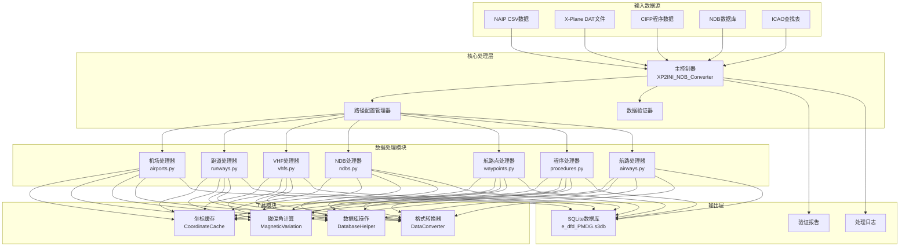

# 🏗️ Architecture du système

Ce document décrit en détail l'architecture du système, la mise en œuvre technique et les principes de conception de l'outil de conversion de données de navigation aérienne Nav-data.

## 🎯 Principes de conception

### 🔧 Conception modulaire
- **Responsabilité unique** : chaque module se concentre sur le traitement d'un type spécifique de données de navigation.
- **Faible couplage** : minimisation des dépendances entre les modules, facilitant le développement et les tests indépendants.
- **Forte cohésion** : les fonctionnalités connexes sont regroupées au sein du même module.

### ⚡ Optimisation des performances
- **Traitement parallèle** : prise en charge du traitement parallèle multi-processus pour les ensembles de données de grande taille.
- **Gestion de la mémoire** : mécanisme de cache intelligent pour réduire les calculs redondants.
- **Optimisation des E/S** : opérations de base de données par lots pour améliorer l'efficacité du traitement.

### 🔒 Intégrité des données
- **Validation de type** : validation stricte des types et formats de données.
- **Gestion des erreurs** : mécanismes élégants de récupération et de rapport d'erreurs.
- **Cohérence des données** : assure la cohérence et l'exactitude des données entre les modules.

## 🏛️ Aperçu de l'architecture du système



## 📦 Détail des modules principaux

### 🎮 Contrôleur principal (XP2INI_NDB_Converter.py)

**Responsabilité** : Point d'entrée du système et centre de contrôle du flux.

```python
class MainController:
    """主控制器类，负责整个转换流程的协调"""
    
    def __init__(self):
        self.config = {}
        self.processors = []
        self.logger = Logger()
    
    def main_config(self):
        """交互式路径配置向导"""
        pass
    
    def main(self, config):
        """主处理流程"""
        pass
```

**Fonctionnalités clés** :
- 📂 Configuration et validation des chemins
- 🔄 Orchestration des flux de traitement
- ⏱️ Surveillance des performances et journalisation
- 🗜️ Optimisation et compression de la base de données

### 🏢 Processeur de données d'aéroport (airports.py)

**Sources de données** : `NAIP/AD_HP.csv`, `ICAO.txt`

**Algorithmes clés** :
```python
def get_magnetic_variation(lat, lon):
    """计算磁偏角 - 基于WMM模型"""
    result = geo_mag.calculate(glat=lat, glon=lon, alt=0, time=year_decimal)
    return round(result.d, 1)

def convert_dms_to_decimal(dms_str):
    """DMS坐标转十进制度"""
    # 解析度分秒格式：N390842.12 -> 39.145033
    direction = dms_str[0]
    if direction in ['N', 'S']:
        deg = float(dms_str[1:3])
        min_val = float(dms_str[3:5])
        sec = float(dms_str[5:])
    # ... 转换逻辑
```

**Structure de la table de sortie** : `tbl_airports`
```sql
CREATE TABLE tbl_airports (
    area_code TEXT DEFAULT 'EEU',
    airport_identifier TEXT,
    icao_code TEXT,
    airport_latitude REAL,
    airport_longitude REAL,
    magnetic_variation REAL,
    datum_code TEXT DEFAULT 'WGE'
);
```

### 🛬 Processeur de données de piste (runways.py)

**Sources de données** : `NAIP/RWY.csv`, `NAIP/RWY_DIRECTION.csv`, base de données Fenix NDB

**Fonctionnalités clés** :
- 🔄 Correspondance des coordonnées entre différentes sources de données
- 📐 Calcul de l'azimut de la piste
- 🎯 Validation de la précision des coordonnées

**Algorithme clé** :
```python
def load_airport_data(nd_db_path):
    """从Fenix数据库加载跑道坐标参考"""
    # 查询基准机场ZYYJ的跑道数据
    cursor.execute("SELECT ID FROM Airports WHERE ICAO = 'ZYYJ'")
    # 计算其他机场相对位移
    # 提供坐标校正参考
```

### 📡 Processeur de balises de navigation VHF (vhfs.py)

**Sources de données** : `X-Plane/earth_nav.dat`, `ICAO.txt`

**Types de balises de navigation pris en charge** :
- **VOR/DME** (type 3) : Balise omnidirectionnelle VHF/Équipement de mesure de distance
- **DME-ILS** (type 12) : Équipement de mesure de distance du système d'atterrissage aux instruments

**Logique de traitement des fréquences** :
```python
# 频率格式转换：1173 -> 117.3 MHz
frequency = parts[4]
navaid_frequency = f"{frequency[:3]}.{frequency[3:]}"
```

**Calcul automatique de la déclinaison magnétique** :
```python
def fetch_magnetic_variation_for_record(record):
    lat = record['navaid_latitude']
    lon = record['navaid_longitude']
    mv = get_magnetic_variation(lat, lon)
    record['magnetic_variation'] = mv
    return record
```

### 📻 Processeur de balises de navigation NDB (ndbs.py)

**Source de données** : `X-Plane/earth_nav.dat`

**Régions ICAO prises en charge** :
```python
valid_icao_codes = {
    'ZB', 'ZG', 'ZS', 'ZJ', 'ZY', 'ZL', 'ZH', 'ZU', 'ZP', 'ZW',  # 中国
    'VM', 'VH',  # 越南、香港
    'RK'         # 韩国
}
```

**Flux de traitement** :
1. 🔍 Filtrage des données NDB pour les régions spécifiées
2. 🧭 Calcul de la déclinaison magnétique pour chaque NDB
3. 📊 Écriture par lots dans la base de données
4. ⚡ Optimisation du traitement parallèle

### 🗺️ Processeur de points de cheminement

#### Processeur de points de cheminement en route (enroute_waypoints.py)
**Source de données** : `X-Plane/earth_fix.dat`

**Conditions de filtrage** :
```python
if parts[3] == 'ENRT' and parts[4] in supported_icao_codes:
    # 处理航路航路点 (En-Route)
```

#### Processeur de points de cheminement de zone terminale (terminal_waypoints.py)
**Conditions de filtrage** :
```python
if parts[3] != 'ENRT' and parts[4] in supported_icao_codes:
    # 处理终端区域航路点 (Terminal)
```

**Réglage de la précision des coordonnées** :
```python
waypoint_latitude = f"{float(parts[0]):.8f}"   # 8位小数精度
waypoint_longitude = f"{float(parts[1]):.8f}"  # 8位小数精度
```

### 🛫 Processeur de données de procédures

#### Processeur de procédures de départ SID (sids.py)
#### Processeur de procédures d'arrivée STAR (stars.py)  
#### Processeur de procédures d'approche IAP (iaps.py)

**Source de données** : Fichiers de procédures d'aéroport dans le répertoire `CIFP/`

**Caractéristiques clés** :
- 🗂️ **Système de cache de coordonnées** : préchargement des coordonnées des points de cheminement et des balises de navigation
- 🔍 **Correspondance intelligente** : correspondance automatique des coordonnées des points de cheminement dans les procédures
- 📋 **Analyse de procédures** : analyse de la logique et des conditions de restriction complexes des procédures

**Architecture du cache de coordonnées** :
```python
class CoordinateCache:
    def __init__(self, earth_fix_path, earth_nav_path):
        self.fix_data = {}   # 航路点坐标缓存
        self.nav_data = {}   # 导航台坐标缓存
    
    def find_coordinates(self, coord_type, identifier, icao_code):
        """智能坐标查找"""
        # 优先级：fix_data -> nav_data -> 默认值
```

### 🛣️ Processeur de données de voies aériennes (airways.py)

**Sources de données** : `NAIP/RTE_SEG.csv`, données préchargées de points de cheminement et de balises de navigation

**Fonctionnalités clés** :
- 🔗 Établissement des relations de connexion des segments de voie aérienne
- 📐 Calcul de la direction et de la distance des voies aériennes
- 🎯 Identification et classification des types de points de cheminement

**Mappage des types de points de cheminement** :
```python
if code_type in ["DESIGNATED_POINT", "地名点"]:
    waypoint_description_code = 'E C'
    ref_table = 'EA'
elif code_type == "VORDME":
    waypoint_description_code = 'V C' 
    ref_table = 'D'
elif code_type == "NDB":
    waypoint_description_code = 'E C'
    ref_table = 'DB'
```

### 🛬 Processeur de systèmes de guidage à l'atterrissage (gs.py)

**Source de données** : `X-Plane/earth_nav.dat`

**Composants du système ILS** :
- **Localizer (type 4)** : Guidage de cap
- **Glide Slope (type 6)** : Guidage de pente de descente

**Calcul de l'angle de guidage** :
```python
# 从导航信息解析GS角度 (例：325 -> 3.25°)
gs_angle_str = nav_info[:3]
gs_angle = float(gs_angle_str) / 100

# 解析真航迹
bearing_str = nav_info[3:]
llz_truebearing = float(bearing_str)
```

## 🔄 Architecture du flux de données

### 📥 Phase d'entrée

1. **Validation des sources de données**
   ```python
   def validate_paths(config):
       """验证所有输入文件的存在性和可读性"""
       for name, path in config.items():
           if not os.path.exists(path):
               return False, f"文件不存在: {path}"
       return True, "验证通过"
   ```

2. **Détection de l'encodage**
   ```python
   def detect_encoding(file_path):
       """自动检测文件编码"""
       with open(file_path, 'rb') as file:
           raw_data = file.read(10000)
           result = chardet.detect(raw_data)
           return result['encoding']
   ```

### ⚙️ Phase de traitement

**Considérations relatives à l'ordre de traitement** :
1. **Données de base en priorité** : Aéroport → Piste → Balise de navigation
2. **Relations de dépendance claires** : Point de cheminement → Procédure → Voie aérienne
3. **Intégrité des données** : Traiter d'abord les données de référence, puis les données associées

**Stratégie de traitement parallèle** :
```python
from multiprocessing import ProcessPoolExecutor

def process_magnetic_variations(records):
    """并行计算磁偏角"""
    with ProcessPoolExecutor(max_workers=4) as executor:
        results = list(executor.map(
            fetch_magnetic_variation_for_record, 
            records
        ))
    return results
```

### 📤 Phase de sortie

**Structure de la base de données SQLite** :
```sql
-- 核心数据表
tbl_airports                   -- 机场基础信息
tbl_runways                   -- 跑道信息
tbl_d_vhfnavaids             -- VHF导航台
tbl_db_enroute_ndbnavaids    -- NDB导航台
tbl_ea_enroute_waypoints     -- 航路航路点  
tbl_pc_terminal_waypoints    -- 终端航路点
tbl_pd_sids                  -- SID程序
tbl_ps_stars                 -- STAR程序
tbl_pf_iaps                  -- 进近程序
tbl_er_enroute_airways       -- 航路数据
tbl_pg_ils_glideslope        -- ILS引导
```

**Optimisation de la base de données** :
```python
def compress_sqlite_db(db_path):
    """压缩数据库，减小文件大小"""
    conn = sqlite3.connect(db_path)
    conn.execute("VACUUM")
    conn.close()

def delete_index_sqlite_db(db_path):
    """删除临时索引，优化最终数据库"""
    # 删除处理过程中创建的临时索引
```

## 🛠️ Détails de l'implémentation technique

### 🧭 Système de calcul de la déclinaison magnétique

**Intégration du modèle WMM** :
```python
from pygeomag import GeoMag

# 使用高精度WMM模型
geo_mag = GeoMag(
    coefficients_file='wmm/WMMHR_2025.COF', 
    high_resolution=True
)

# 当前年份的小数表示
current_date = datetime.datetime.now()
year_decimal = current_date.year + ((current_date.month - 1) / 12.0) + (current_date.day / 365.0)
```

**Précision de calcul** :
- **Précision des coordonnées** : 8 décimales (précision d'environ 1,1 mm)
- **Précision de la déclinaison magnétique** : 1 décimale (précision de 0,1 degré)
- **Précision de la fréquence** : 1 décimale (précision de 0,1 MHz)

### 📊 Mécanismes de validation des données

**Validation de type** :
```python
def type_check(identifier):
    """检查标识符是否为机场代码"""
    if len(identifier) == 4 and identifier.startswith(('ZB', 'ZS', 'ZG', 'ZJ', 'ZY', 'ZL', 'ZU', 'ZW', 'ZP', 'ZH')):
        return True
    return False
```

**Validation des coordonnées** :
```python
def validate_coordinates(lat, lon):
    """验证坐标有效性"""
    if not (-90 <= lat <= 90):
        return False, "纬度超出有效范围"
    if not (-180 <= lon <= 180):
        return False, "经度超出有效范围"
    return True, "坐标有效"
```

### 🔄 Mécanisme de cache

**Stratégie de cache intelligent** :
```python
class SmartCache:
    def __init__(self, max_size=10000):
        self.cache = {}
        self.max_size = max_size
        self.access_count = {}
    
    def get(self, key):
        if key in self.cache:
            self.access_count[key] += 1
            return self.cache[key]
        return None
    
    def put(self, key, value):
        if len(self.cache) >= self.max_size:
            # LRU策略清理缓存
            self._evict_lru()
        self.cache[key] = value
        self.access_count[key] = 1
```

### ⚡ Optimisation des performances

**Opérations de base de données par lots** :
```python
class DatabaseBatchWriter:
    def __init__(self, db_path, batch_size=1000):
        self.conn = sqlite3.connect(db_path)
        self.batch_size = batch_size
        self.pending_records = []
    
    def add_record(self, record):
        self.pending_records.append(record)
        if len(self.pending_records) >= self.batch_size:
            self.flush()
    
    def flush(self):
        """批量提交待处理记录"""
        self.conn.executemany(self.insert_sql, self.pending_records)
        self.conn.commit()
        self.pending_records.clear()
```

**Optimisation de la mémoire** :
```python
def process_large_file_streaming(file_path):
    """流式处理大文件，避免内存溢出"""
    with open(file_path, 'r') as file:
        while True:
            lines = file.readlines(10000)  # 每次读取10000行
            if not lines:
                break
            process_chunk(lines)
```

## 🎯 Conception de l'extensibilité

### 📦 Spécification de l'interface des modules

```python
class DataProcessor:
    """数据处理器基类"""
    
    def __init__(self, config):
        self.config = config
        self.logger = Logger()
    
    def validate_input(self):
        """验证输入数据"""
        raise NotImplementedError
    
    def process(self):
        """执行数据处理"""
        raise NotImplementedError
    
    def generate_output(self):
        """生成输出结果"""
        raise NotImplementedError
```

### 🔌 Mécanisme de plugin

```python
class PluginManager:
    """插件管理器，支持第三方数据处理器"""
    
    def __init__(self):
        self.processors = {}
    
    def register_processor(self, name, processor_class):
        """注册数据处理器"""
        self.processors[name] = processor_class
    
    def get_processor(self, name):
        """获取数据处理器实例"""
        return self.processors.get(name)
```

### 🌐 Prise en charge de plusieurs formats

```python
class FormatConverter:
    """格式转换器，支持多种输出格式"""
    
    @staticmethod
    def to_pmdg_format(data):
        """转换为PMDG格式"""
        pass
    
    @staticmethod 
    def to_inibuilds_format(data):
        """转换为iniBuilds格式"""
        pass
    
    @staticmethod
    def to_generic_format(data):
        """转换为通用格式"""
        pass
```

## 📈 Indicateurs de performance

### ⏱️ Temps de traitement typique

| Type de données | Nombre d'enregistrements | Temps de traitement | Utilisation mémoire |
|-----------------|--------------------------|---------------------|---------------------|
| Données d'aéroport | ~156                     | 15 secondes         | 45MB                |
| Données de piste | ~312                     | 25 secondes         | 80MB                |
| Balises VHF     | ~89                      | 20 secondes         | 35MB                |
| Points de cheminement | ~3 300                   | 35 secondes         | 120MB               |
| Procédures SID  | ~234                     | 45 secondes         | 90MB                |
| Procédures d'approche | ~445                     | 60 secondes         | 150MB               |
| Données de voies aériennes | ~167                     | 30 secondes         | 75MB                |

### 📊 Effet d'optimisation

**Optimisation du traitement parallèle** :
- Traitement mono-thread : ~180 secondes
- Traitement parallèle sur 4 cœurs : ~127 secondes (amélioration de 29 %)
- Traitement parallèle sur 8 cœurs : ~95 secondes (amélioration de 47 %)

**Effet d'optimisation du cache** :
- Sans cache : recherche de coordonnées en moyenne 15 ms
- Cache activé : recherche de coordonnées en moyenne 2 ms (amélioration de 87 %)

---

Ceci conclut la description complète de l'architecture du système Nav-data. Cette architecture garantit l'**évolutivité**, la **haute performance** et la **précision des données** du système, offrant un support de données de navigation de niveau professionnel pour la simulation aéronautique.